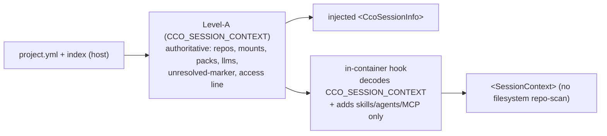

# 03 — Session Context & the `none` Contract (R6 + R7 + R8)

> The awareness surface (Level-A injection + the in-container discovery hook) and
> the lowest-trust level `none`. Shared theme: **Level-A must be the single
> authority on session resources**, and every level (including `none`) must have an
> explicit, honest contract.

## R6 — Explicit `none` contract (Guard)

**Cause.** The `cco` symlink is baked **unconditionally** (`Dockerfile:144-145`);
operator-mode env is exported only when `cco_access != none` (`cmd-start.sh:892-897`).
At `none` the binary is on PATH but not in operator mode → it falls through to the
**host dispatcher**, emitting a wrong ADR-0007 host-resolve refusal, leaking
`cco list` output (`template base`), and printing raw host help. Level-A also omits
any "cco unavailable" line at `none` (`session-context.sh:155-170` prints the
wrapped-cco line only when `!= none`).

**Design (ratified: Guard).** `none` is a first-class privilege level, symmetric
with the others — `cco` is present and answers with an explicit **permission
denied for `cco_access=none`**, exactly as other levels report "N resources hidden
by scope". Concretely:

- **Early guard in `bin/cco`**: after loading `paths.sh`, if running in-container (`_cco_in_container`) and operator env is absent (i.e. `cco_access=none`), `die` with a clear message — `"cco is not available at this access level (cco_access=none). Start a session with --cco-access read-project (the default) or higher to use cco, or run cco on your host."` Exit `2` (D8, refused-by-policy). This fires before any dispatch, so no host-resolve fallthrough, no `cco list` leak, no raw help.
- **Level-A line**: `session-context.sh` emits, at `none`, an explicit `"cco is not available in this session (cco_access=none)."` line (the `else` branch of `:155`).
- Robust regardless of PATH: even an absolute-path invocation hits the guard.

**Clarifications (ratified).**
- `none` = deliberate **least-privilege** floor (an agent that must have zero cco introspection/config surface). Not for context/image saving (unused cco costs no context).
- `cco docs` is **refused** at `none` too (it is a cco verb) — consistent. Docs need `read-project` (the default). This reinforces that `none` is rare; the normal default is `read-project`.

## R7 — Declared-but-unresolved resources in Level-A (Marker + provenance)

**Cause.** `_effective_extra_mounts` (`cmd-start.sh:176`, stderr suppressed
`2>/dev/null || true`) and `_llms_render_entries` (`llms.sh:147`, dir-existence)
**silently drop** declared-but-unresolved resources. Level-A has no "declared vs
available" concept (design §1 P-d assumed `project.yml` == session). At `none`
(no CLI) the omission is terminal — the agent may reason about a mount that isn't
there, or hunt for one Level-A never mentioned.

**Design (ratified: marker + provenance).**
- Preserve the unresolved set through `_effective_extra_mounts` / `_collect_llms_names` / `_llms_render_entries` (currently discarded), instead of filtering silently.
- Level-A renders a **"Declared but not mounted this session"** section listing each unresolved `extra_mount` / `llms` (and repo, if any), with a reason marker:
  - **`unresolved`** — path/coordinate not resolvable on this host (a real gap the user may want to fix via `cco resolve`).
  - **`skipped by user`** — the user opted to skip unresolved paths at `cco start`.
- **Provenance caveat**: the `skipped-by-user` marker requires `cco start` to *record* that choice where `session-context.sh` can read it (e.g. an env/flag threaded through). If the skip decision is not readily capturable, **degrade to marker-only** (`declared but not mounted`) — still closes the "phantom resource" gap; the auto/user distinction is the enhancement.
- **Data-hygiene follow-up** (separate): audit `cave-auth` / `cave-eda-flow` `project.yml` for stale refs (mounts/llms declared but never resolvable) — decide drop vs resolve. Not a code fix.

## R8 — In-container discovery hook consumes Level-A (not the filesystem)

**Cause.** `config/hooks/session-context.sh:12-18` scans `/workspace/*/.git` and
labels **any** dir with a `.git/` as a repository — catching a git-backed
**read-only** extra_mount (the personal store) as `"Repositories (1): cco-config"`
though `project.yml` has `repos: []` (S8-5). Three resource-discovery surfaces
compete: host-computed Level-A (authoritative), the in-container filesystem scan
(lossy), the wrapped-cco (on-demand).

**Design.** Make the hook a **consumer** of the authoritative Level-A, not an
independent discoverer:

- The hook already decodes `CCO_SESSION_CONTEXT` (`session-context.sh` hook, ~`:74-88`). Derive the repo/mount list from it (the host-computed truth), instead of scanning `/workspace/*/.git`.
- Never label a `readonly: true` mount a "repository". Repos and read-only mounts are distinct sections, matching `project.yml`.
- Add mount→project/config labeling (OBS-2): render `<name>-config` mounts as "project config (cave-auth)" rather than a bare basename, so the config-editor agent needn't infer the mapping.
- Retain the hook only for genuinely filesystem-side, non-resource metadata (available skills/agents/MCP) that Level-A does not carry.

**Invariant restored**: Level-A (host-computed) is the sole authority on session
resources; the hook augments with local, non-resource metadata only. Consistent
with INV-1 (§design division of labour).

## Consolidated fix loci
| Root | Primary loci |
|---|---|
| R6 | `bin/cco` (early in-container `none` guard) · `session-context.sh:155-170` (unavailable line) |
| R7 | `cmd-start.sh:176` + `llms.sh:147` (preserve unresolved set) · `session-context.sh` (render "declared but not mounted" + provenance) |
| R8 | `config/hooks/session-context.sh:12-18` (consume `CCO_SESSION_CONTEXT`, drop `.git` scan, label mounts) |
