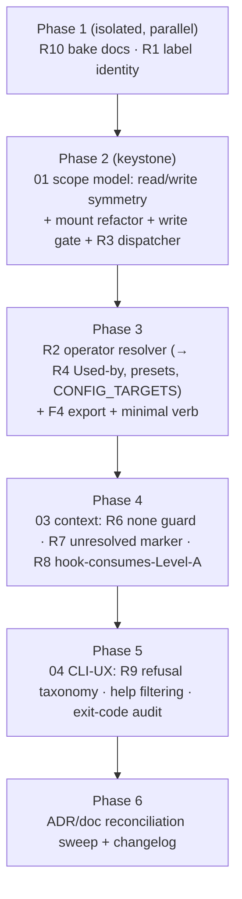

# Implementation Handoff — Agent ↔ cco Access Fixes

> **Status**: Ready to implement (2026-07-05). Design phase complete and
> self-reviewed (verdict: PASS with refinements, folded in below). Drives the
> implementation of the 9 consolidated roots in a **fresh session**.
>
> **Nature**: implementation. The design is settled in `00-overview.md` +
> `01`–`04`; this handoff sequences the build, folds in the design review's
> corrections, pins the open rules, and defines validation. Do **not** re-open the
> ratified decisions (overview §2) without maintainer HITL.

## 0. Read first (in order)
1. `00-overview.md` — ratified decisions, root map, cross-cutting conventions, ordering.
2. `01-scope-model.md` — the keystone (read/write symmetry). **Apply correction C1 below.**
3. `02-session-identity.md` — R1/R2/R4/F4. **Apply correction C2 below.**
4. `03-session-context.md` — R6/R7/R8.
5. `04-cli-ux.md` — R9/R10. **Apply correction C3 below.**
6. The RC reports + `CONSOLIDATION.md` on the review mount (`/review/rootcause/`) for the deep per-finding mechanism, if needed.

## 1. Design-doc corrections (apply as you implement — from the 2026-07-05 review)

- **C1 (`01` §5, F-A)** — the "cross-project write → edit-all" row is misleading.
  Rule: **write_scope is determined by the TARGET TREE, not by which project a
  global entry names.** `cco tag add <any-project>` / `remote add` write the global
  DATA registry → `edit-global`. The only `edit-all` write is **mutating another
  project's `.cco` tree** (config-editor). Reword the row accordingly; it stays
  consistent with the symmetric model (tags/remotes are global resources).
- **C2 (`02` R2, F-B)** — there is **no canonical `/workspace/.cco/project.yml`**.
  The operator resolver must handle two distinct mount layouts:
  - **current project** (normal session): scan `/workspace/*/.cco/project.yml` for
    the one whose `name == PROJECT_NAME` (the owning repo among the mounted repos).
  - **config-editor target** (`CCO_CONFIG_TARGETS`): the manifest is at the mount
    **root** — `/workspace/<name>-config/project.yml` (the mount *is* the `.cco`
    dir; there is no nested `.cco/`).
  Either teach `_resolve_unit_dir_for_project` both layouts, or return the
  `project.yml` path directly instead of a "unit dir". Verified: only
  `/workspace/claude-orchestrator/.cco/project.yml` exists this session; `/workspace/.cco/` does not.
- **C3 (`04` D8, F-C)** — pin the exit-code rule for scope refusals: a `list` that
  **filters rows** → exit `0` + the count-only notice (graceful degrade); a
  `show <specific hidden name>` (user named something out of scope) → exit `2`
  (refused by policy). Apply this split consistently in `_env_require_visible`
  callers.

## 2. Build order & dependencies

Per `00-overview.md` §7. Isolated first, keystone next, then dependents.

Rationale: R3's read behavior and R5's write gate both depend on the scope layer
(Phase 2); R4/presets/F4-verb depend on the resolver (Phase 3); R9's exit-code
audit spans verbs touched by earlier phases, so it goes last before the doc sweep.

## 3. Per-phase implementation tasks

### Phase 1 — isolated
- **R10**: `Dockerfile` → `COPY docs/users /opt/cco/docs/users`. Verify `cco docs`/`cco docs <topic>` resolve; no path escapes `docs/users`. Exit codes per D8.
- **R1**: replace the 5 `cc-<name>`-name greps with `docker ps --filter "label=cco.project=<name>"` (`cmd-project-query.sh:50,230`; `cmd-start.sh:474`; `cmd-stop.sh:41,53`). Do **not** change the launch (`run --rm`) or the `cc-<project>` **network** name (`:495`). `cco stop` targets running containers by label + `docker stop`.

### Phase 2 — scope model (keystone; `01`)
- `lib/access-scope.sh`: `_env_read_scope()` → `project|global|all|none`; rewrite `_env_in_scope` per the visibility table (only `global`/`all` differ, on the `project` kind — **F-D: this is intentional, one branch**). Keep INV-A (host never scoped). Retain a thin ordinal `_env_read_rank` derived from `_env_read_scope` if callers need it.
- **F-F**: update **both** rank sites — `access-scope.sh:_env_read_rank` **and** `bin/cco:227` (`read_rank`) — or unify. They must agree.
- `lib/cmd-start.sh`: split the mount policy into read-tier (what is mounted / narrowed) × write-tier (RW per tree). **Narrow `edit-project`'s CONFIG read mount** like `read-project` (it currently mounts the whole store, `:1043`). Re-key the `<repo>/.cco` overlay (`:964`) and `_op_rw` (`:1025`) off `write_scope`, not hard-coded level lists.
- **R5 write gate** (`bin/cco` `_op_write :233`): classify each write verb's target tree → required `write_scope`; refuse at the gate (exit `2`) before the RO filesystem. Table in `01` §5 (with C1 applied). Defense-in-depth: rc checks on the lib write points (`cmd-pack.sh:57/62`, `cmd-template.sh`, `tags.sh:71/81`, `cmd-remote.sh:166/170`). `cco llms install`: default the name (no interactive prompt), pre-check writability (S5-04).
- **R3 dispatcher**: route bare `cco list <kind>` through the scope layer (per-kind `_env_in_scope` guard like `cmd-project-query.sh:30`); `cco list pack` `check_global` (`cmd-pack.sh:92`) degrades in operator mode instead of the host-only "run cco init". Wire `cco pack list` / `cco project list` to the ADR-0029 redirect (single point with R9).

### Phase 3 — resolver + introspection (`02`)
- **R2/R4**: operator-mode resolver in `cmd-resolve.sh:65-97` handling both layouts (**C2**), keyed on `PROJECT_NAME` / `CCO_CONFIG_TARGETS` / preset registry; unresolvable in-session → "unavailable at this scope" (exit `2`), never host-only "run cco resolve". `_project_foreach` enumerates mounted projects only → "Used by" answers for mounted, "unavailable at this scope" for others (D10). `cco project coords` accepts a name argument.
- **D9**: `cco start --project <name>` exports `CCO_CONFIG_TARGETS`; `PROJECT_NAME` stays the started project. Managed rule + Level-A instruct the config-editor agent to introspect the target.
- **F4**: export `CCO_CLAUDE_ACCESS` + `CCO_SHOW_HOST_PATHS` (`cmd-start.sh:243/258` → env); add the minimal introspection verb (placeholder name `cco whoami`; **final name deferred to the CLI-UX review**). Add it to the shim's valid-verb set (removes the unknown≡host-only misfire for it). Refused only at `none`.

### Phase 4 — session context (`03`)
- **R6**: early in-container guard in `bin/cco` — operator env absent ⇒ `die` (exit `2`) with the `cco_access=none` message, before any dispatch. Level-A "cco unavailable" line at `none` (`session-context.sh:155`). `cco docs` refused at `none` too.
- **R7**: preserve the unresolved set (`cmd-start.sh:176`, `llms.sh:147`); Level-A renders a "Declared but not mounted this session" section with `unresolved` / `skipped by user` markers. **Provenance caveat**: `skipped by user` needs `cco start` to record the choice; if not readily capturable, degrade to marker-only. Separate data-hygiene follow-up: audit cave-auth / cave-eda-flow `project.yml`.
- **R8**: the in-container hook (`config/hooks/session-context.sh:12-18`) consumes `CCO_SESSION_CONTEXT` instead of scanning `/workspace/*/.git`; never labels a `readonly` mount a repo; labels `<name>-config` mounts as project config. Keep the hook only for skills/agents/MCP metadata.

### Phase 5 — CLI UX (`04`)
- **R9**: model the 5 refusal cases (unknown / host-only / removed-alias / bare-namespace / informational `--help`) in the shim; enumerate known verbs; recompute the usage header per level. Fix the `'cco project '` trailing-space. **D7**: in-container filtered help by default + `--help --host` escape + always-available per-command `--help`. **D8**: audit every refusal/error/degrade path to the 0/2/1 convention (with C3).

### Phase 6 — reconciliation
- ADR-0043 taxonomy table (add `edit-*`, split `read-global`/`read-all`); ADR-0042 "mirror" clarification; ADR-0036 D4 wording (D5); `CLAUDE.md` + `access-scope.sh` comment + managed rule ("each level reads at its matching scope"); managed rule config-editor `--project` + `none` contract. Follow `.claude/rules/documentation-lifecycle.md` (ADRs = history → forward-annotate; living docs → rewrite). `changelog.yml` entry if any user-visible additive surface (the introspection verb, filtered help).

## 4. Cross-cutting (apply throughout)
- **Exit codes** (D8 + C3): `0` success/graceful-degrade; `2` policy refusal (scope/host-only/removed-alias/bare-namespace); `1` error (unknown verb/missing file/parse). `show <hidden>` = `2`; `list` filtering = `0`+notice.
- **In-container help** (D7): default filtered; `--help --host` full; `<cmd> --help` always shown.
- **Migrations/changelog**: per `.claude/rules/update-system.md` — schema-breaking config changes need a migration; additive user-visible surface needs a `changelog.yml` entry. The scope-model change is behavior, not a `project.yml` schema change (no project migration expected — confirm).

## 5. Validation & testing (READ — self-dev caveat)

Per the project CLAUDE.md self-dev note: **changes to `Dockerfile`, `config/entrypoint.sh`, `config/hooks/*` are NOT active in the editing session.** Affected roots that **cannot be verified in-session**: R1 (docker naming), R6 (entrypoint/guard), R8 (hooks), R10 (Dockerfile bake). They require `cco build && cco start` on the host.

- **Unit/behavioral**: extend `tests/test_access_scope.sh` — the existing suite asserted the aggregate `cco list` + `<kind> show` paths but **not** the `cco list <kind>` dispatcher (that gap let R3 ship). Add per-kind dispatcher cases at every read tier, the write-gate refusals per level, and `_env_read_scope` mapping. Confirm the symmetric read: `edit-project` now scopes (F2a/F2b must reproduce there and be fixed, not masked).
- **In-session** (no rebuild): the scope layer, resolver, write gate, `cco list`/`show`, help, exit codes are pure `bin/cco`/`lib/*.sh` — testable directly by running the wrapped `cco` in this container.
- **Full validation**: **re-run the e2e review harness** (the 8 sessions in `../handoff.md`) after `cco build`, and diff findings — every 🔴/🟠 must be closed and no regression introduced. This is the acceptance gate. The consolidation session then confirms.

## 6. Definition of done
- All 9 roots implemented per `01`–`04` with C1–C3 applied; the 2 de-escalations left as-is (no code), the 2 doc de-escalations (INV-1 note, ADR-0036 wording) written.
- `tests/test_access_scope.sh` extended and green (incl. the dispatcher + write-gate + symmetric-read cases).
- e2e harness re-run post-`cco build`: all 🔴/🟠 closed, no regression; exit-code convention holds.
- ADR/doc reconciliation sweep done (Phase 6); `changelog.yml` updated if applicable.
- Roadmap annotated with the two post-fix tasks (maintainer CLI reference; UX/CLI-completeness review) — with maintainer approval.

## 7. Deferred to the post-fix CLI-UX review (do NOT bikeshed now)
- The introspection verb's final name/shape (`whoami` vs `session`; reserve `cco status` for global cco state).
- Intuitiveness/naming of the broader verb set; the maintainer CLI reference matrix (`command × {host, in-container} × cco_access`).
