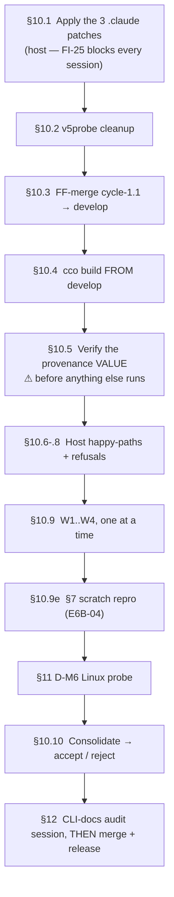

# e2e review **v3.1** — reduced acceptance run for cycle-1.1

> **Written 2026-07-21**, at the close of cycle-1.1 (S1…S9 landed on
> `fix/config-access/e2e-v3-cycle1.1`, suite 1463/9, nothing pushed).
> Successor to [`handoff-v3.md`](handoff-v3.md), whose §0–§9 conventions this reuses rather than
> restates. **This document is both the host runbook and the session brief** — §10 is what *you*
> run on the Mac, §5/§6 are what the *sessions* run. Work top-to-bottom: §10 is ordered, and the
> order is load-bearing.
>
> **Why a run at all, when the suite is green.** The suite is hermetic; the three 🔴 of v3 were a
> **mount-composition** defect it cannot see by construction (RC-17's stated blind spot), and every
> store-touching verb executes the **image-baked** `/opt/cco/bin/cco`, so none of cycle-1.1 is
> observable until `cco build`. A green suite is a precondition here, never the verdict.

---

## 0. What v3.1 tests

Cycle-1.1 closed v3's three 🔴 (one root, R1) plus six secondary roots. This run asks one question
per stage, from the only vantage that can answer it — a live container on a rebuilt image.

| Stage | Claim under test | Where |
|---|---|---|
| **S1** (R1) | STATE crosses as a **directory**; in-container index + sidecar writes actually land | W1, W2 |
| **S2 / S2b / S2b-P** | A write that cannot be performed **fails**, loudly, instead of printing `✓` | W1, W2, §10.7 |
| **S3** | A rename is refused **before** Phase 1 when either store is unwritable | W1 |
| **S4** (R3) | An unreadable/truncated index is reported as such, not as "nothing configured" | W4 |
| **S5** (D-V3-1, R5) | `remote remove\|rename` refuse **exit 2** with a host hint; `remote add` still works | W2 |
| **S6** (R4) | `project show` and `project validate` answer availability with **one voice** | W4 |
| **S7** (R6) | config-editor **announces every drop**; never mounts a target's `extra_mounts` | W2 |
| **S8 / V1-F2** | `cco project show` lists extra_mounts by **logical name**, `[unresolved]` when unbound | W4 |
| **S8 / V1-F3** | `cco whoami` reports `image built from: <branch>@<sha>` — and the **value is right** | §10.5 |
| **S8 / V4-F-V4-03** | A **projects-only** hidden notice offers `read-all`, not `read-global` | W4 |
| **S8 / V3-03** | Bare `repo rename <new>` at the WORKDIR root refuses **as ambiguous** | W1 |
| **D-M11** | A granular `current=ro` makes the config-editor target mount honestly **read-only** | W3 |
| **§7 / E6B-04** | pack-rename fan-out atomicity — **never executed in any round** | §10.9 |
| **D-M6** | Can `cco-svc` write a store it does not own? (the Linux question) | §11 |

**Not under test.** Everything `handoff-v3.md` §9 defers, plus the whole *"do not re-litigate"* list
carried in `fix-design-v3/RESUME-HANDOFF-s9.md` §6 — RC-4, RC-1's D-M5 arms, RC-6 repos, the
ADR-0047 boundary, criterion E, `lib/store.sh`'s fail-closed contract, and the settled INV-S3b /
INV-ENV / decision-(b) questions. **RC-4 in particular is confirmed on both halves across three
projects and must not be re-opened**; if a session's `path list` looks surprising, the standing
triage rule from V5's note 2 applies — *"fix the mount + fix the message, not reconsider RC-3."*

---

## 1. Reference reading (sessions)

Same set as `handoff-v3.md` §1, plus, for this round:

1. [`results/consolidated-review-v3.md`](results/consolidated-review-v3.md) — the verdict this cycle answers.
2. [`fix-design-v3/00-plan.md`](fix-design-v3/00-plan.md) — §2 (S1's shape), §6 (S5 + INV-S3b), §11 (what S9 recorded).
3. [`fix-design-v3/RESUME-HANDOFF-s9.md`](fix-design-v3/RESUME-HANDOFF-s9.md) — §2 "five things to understand", §6 do-not-re-litigate.
4. [ADR-0047](decisions/0047-config-access-enforcement.md) — the 2026-07-21 forward annotation is this cycle's contract.
5. `design-docker.md` §1.2.2.1 — why the bind is a directory and why the parent is `cco-svc`-owned.

---

## 2. How the run works



**Launch rules** — `handoff-v3.md` §2 rules 1–5 carry over verbatim (always `./bin/cco`; shared
output mount; `docs:/cco-docs:ro` for sessions that do not mount the repo; review-only; one session
at a time). Two are **new or changed for v3.1**:

- **Rule 0 is now two steps, not one.** v3's rule 0 was *merge, then build*. v3.1 prepends **apply
  the `.claude` patches** (§10.1). They are tool **source**, baked into the image at
  `/etc/claude-code/`, so a build that precedes them ships a managed rule which *prescribes a verb
  D-V3-1 refuses* — and every session in this round would then be briefed by that rule.
- **Rule 6 — provenance before conclusions.** No session's result is attributable until §10.5
  passes. This exists because v2's cycle-0 was built from the wrong branch and its whole round had
  to be discarded. Ten seconds, and it is the reason the field was added.

**Prompt to give each session** (adjust `<N>` and the slug):

> Read the handoff — `docs/maintainers/configuration/agent-cco-access/e2e-review/handoff-v3.1.md`
> in a `claude-orchestrator` session (W1), or
> `/cco-docs/maintainers/configuration/agent-cco-access/e2e-review/handoff-v3.1.md` otherwise —
> then execute **section W\<N\>** end-to-end: read the §1 refs, run the §3 checklist plus your
> section focus, verify the §8 criteria in your scope, and write your findings to
> `/review-v3.1/W<N>-<slug>.md` using the §4 template. This is a **targeted acceptance run for the
> cycle-1.1 fixes** — confirm each claim in your scope holds in this live container, and report any
> **new** breakage. Do **not** re-report anything in §0 "Not under test". Review only — do not apply
> fixes, do not commit.

---

## 3. Shared checklist — every session does these five

`handoff-v3.md` §3's five carry over unchanged (resolved access matches the launch; declared-vs-
enforced proven by a **real scratch write**; the three availability states speak D-M2's vocabulary;
no false success on a write; boundary re-probe). v3.1 adds two, both cheap:

6. **Record the provenance line.** `cco whoami` → copy `image built from:` verbatim into your
   report. If it does not name the branch and sha the maintainer built, **stop and say so** — your
   findings are about a different image and are not attributable.
7. **`cco remote remove x` and `cco remote rename a b` must refuse, exit 2, with a host hint**
   (D-V3-1), while **`cco remote add probe-<N> https://example.invalid/x.git` succeeds** — it is
   DATA-only. Remove nothing you did not add; if `add` succeeds, note that its cleanup is now
   host-only and leave it for §10.10. *(This is a 20-second check and it is the one behaviour
   change a user will hit.)*

**Hunt beyond the claims.** Same-class problems from your vantage are the point; a different project
shape or access level routinely exposes a sibling the fix missed.

---

## 4. Output file template (`/review-v3.1/W<N>-<slug>.md`)

```markdown
# W<N> — <slug>

- Launch command:
- `cco whoami` — access triple(s):
- `image built from:`                     <-- must match §10.5
- Date / duration:

## Claims under test (from §0)

## §3 checklist (7 items) — result each

## Section focus — result

## §8 acceptance criteria checked here

## Findings (this session)
<!-- id, severity 🔴/🟠/🟡, what, how observed, exact command + output -->

## Notes / open questions for consolidation
```

---

## 5. Session matrix

Four sessions + one scratch procedure. Reduced from v3's five: RC-4's A/B pair is retired (settled),
and V5b folds into W2 as a sub-run.

| # | Slug | Host command (run in `claude-orchestrator/`) | Validates |
|---|---|---|---|
| **W1** | `rename-editproject` | `./bin/cco start claude-orchestrator --cco-access edit-project --mount ~/cco-e2e-review-v3.1:/review-v3.1:rw` | **S1 + S2 + S2b + S3 + V3-03 + V3-P** — the R1 root, from the verb that exposed it |
| **W2** | `ce-broad` | `./bin/cco start config-editor --all --mount ~/cco-e2e-review-v3.1:/review-v3.1:rw --mount docs:/cco-docs:ro` | **S1 store ops + S7 + S5** (+ the **V5b** bare-global sub-run) |
| **W3** | `escalation` | `./bin/cco start config-editor --project <TARGET> --cco-access global=rw,current=ro,others=none --mount ~/cco-e2e-review-v3.1:/review-v3.1:rw --mount docs:/cco-docs:ro` | **D-M11 / V4b** — ⚠ the only probe that fails **open** |
| **W4** | `readpath` | `./bin/cco start <PROJ-WITH-MOUNTS> --mount ~/cco-e2e-review-v3.1:/review-v3.1:rw --mount docs:/cco-docs:ro` | **S4 + S6 + V1-F2 + V4-F-V4-03** — the read vantage |

`<PROJ-WITH-MOUNTS>` = the **StaiSicuro-Juri** project (maintainer-confirmed 2026-07-20 as declaring
`extra_mounts:`). Use the exact slug `cco list projects` reports. `<TARGET>` for W3 = any resolvable
project other than `claude-orchestrator`; `cave-auth` was v3's choice.

**Why W4 exists in a reduced matrix.** It is the only session from which four cycle-1.1 fixes are
observable at all. **V4-F-V4-03 in particular requires a session where projects ARE hidden** — at
`edit-all` (W2) nothing is hidden, so the notice never prints. Dropping W4 would leave S4, S6,
V1-F2 and V4-F-V4-03 verified by the hermetic suite only, i.e. never seen in a container.

---

## 6. Per-session specs

### W1 — `rename-editproject` — claude-orchestrator @ `edit-project`

- **Access**: `(none,rw,none)`.
- **Focus — R1, from the verb that exposed it.**
  1. **The rename completes and is observable.** `cco repo rename <old> <new>` from **inside the
     hosting repo**. Then prove it landed in **both** stores: `cco path list` shows the new name,
     and the repo's `.cco/project.yml` carries it. In v3 this printed `✓` at exit 0 and changed
     nothing — a `✓` with no observable change is **🔴 blocking**.
  2. **V3-P.** A *successful* rename must warn that the live bind cannot follow until restart.
     Confirm the member then classifies `not-mounted` for the rest of the session — that is
     correct, and the note is what makes it legible.
  3. **V3-03 — the ambiguity refusal.** From `/workspace` (the WORKDIR root), run bare
     `cco repo rename <newname>`. It must refuse **as ambiguous**, saying it cannot tell which
     member you mean and telling you to `cd` into it. ⚠ It must **not** advise passing
     `<old> <new>` — that form fails at the same root (**FI-26**), and a remedy that cannot be
     followed from where it is printed is itself a finding. Assert the absence.
  4. **S3 — fail-closed pre-flight.** Make one of the two stores unwritable and confirm the rename
     refuses **before** applying anything (project.yml untouched). ⚠ On macOS `chmod` on a bind's
     content does not enforce (`fakeowner`), so this arm may be **unfalsifiable here** — say so in
     the report rather than recording a pass. It is §11's question, not yours.
  5. **S2b — the host-only verbs' in-session refusals** are unchanged; do not spend time there.
- **Record verbatim** the rename's full output and the two post-state proofs.

### W2 — `ce-broad` — config-editor `--all`

- **Access**: `edit-all` — `(rw,rw,rw)`.
- **Focus — the store write path and S7's announcements.**
  1. **S1/store ops live.** `cco pack rename <a> <b>` and back, or `cco template remove` on a
     disposable entry: each must apply **wholly and observably**, or refuse with the real reason at
     a non-zero exit. In v3 six store verbs were **dead** here.
  2. **S7 — announce every drop.** Every project the index knows is either **mounted or
     announced**. Reconcile the count: `cco list projects` vs the mounted set vs the announcements.
     The two remedies must be **discriminated** — `cco init` for a member dir on disk without
     `.cco`, `cco resolve` for one not on this machine. A wrong remedy here is the false-remedy
     class and is a finding even though the count reconciles.
  3. **S7 / decision (b).** If any target declares `extra_mounts:`, they must be **announced and
     not mounted**. Confirm nothing is bound at `/workspace/<mount-name>`.
  4. **S5.** §3 item 7, plus: confirm the refusal is **exit 2** (a policy refusal), not 1.
- **Sub-run (V5b) — bare global.** After finishing, exit and relaunch
  `./bin/cco start config-editor --cco-access global=rw,current=none,others=none …`. Expect an
  **honest empty** `cco path list` with a notice, and the ADR-0048 inert-no-target guard to fire
  rather than a silently inert session. Report as a `## V5b` section in the same file.

### W3 — `escalation` — config-editor `--project <TARGET>` @ granular `current=ro`

- **Access**: `(rw, ro, none)` — set granularly, not by preset.
- **Focus — D-M11, and this is the one that fails OPEN.** Every other probe in this round fails
  *safe* if its fix is wrong; this one hands you write access you were not granted.
  1. `cco whoami` must report `Pc=ro`. If it reports `rw`, **stop — 🔴, report immediately.**
  2. **Prove it at the filesystem, not from `whoami`.** Attempt a real write to the target's mount
     **root**: `touch /workspace/<TARGET>-config/escalation-probe`. It must fail
     `Read-only file system`. Delete it if it somehow succeeds, and record that as 🔴.
  3. Repeat one level down (a file inside the target's `.cco/`) — the nested clamp and the mount
     root are different mechanisms and D-M11 is about the **root**.
  4. Confirm the **store** is writable (`G=rw`) in the same session: the point of the triple is
     that the two axes move independently.

### W4 — `readpath` — a project **with** extra_mounts @ `read-project`

- **Access**: `(none,ro,none)`.
- **Focus — the read vantage, which no other session in this matrix has.**
  1. **V1-F2.** `cco project show <this project>` must list `extra_mounts` **by logical name** —
     the key `cco path` and `cco extra-mount rename` take — with `[unresolved]` on any declared but
     unbound. Cross-check each name against `/workspace/<name>` actually being mounted.
  2. **S6 — one voice.** Run `cco project show` and `cco project validate` on the **same** project
     in the **same** session. Their availability answers must agree. In v3 `show` blamed access
     scope and prescribed a widening that does not exist at `read-all`, while `validate` answered
     correctly. Also run both from `/workspace` (the root) — V1-F1 gave `validate` the same
     session fallback `show` had.
  3. **V4-F-V4-03 — the notice.** Trigger a hidden-by-scope notice where **everything hidden is a
     project** (e.g. `cco list projects`). It must offer **`read-all`**, not `read-global` —
     read-global reveals no project. Then find a **mixed** set (projects + packs/llms): that one
     must still offer **both**. Both arms are required; only the pair proves it is not a blanket
     substitution.
  4. **S4 — read honesty.** `cco path list`, `cco list`, `cco list projects`, `cco config validate`
     must each distinguish "nothing configured" from "could not read". You cannot easily synthesize
     a truncated index from inside a session — instead confirm the **benign** arm reads normally and
     note it; the diagnostic arm rides §10.9d.

---

## 7. §7 — the E6B-04 scratch reproduction

Unchanged from `handoff-v3.md` §7, and **still never executed in any round**. Procedure and exact
steps are in §10.9e. It is now unblocked by S1: before S1 the fan-out could not write the index at
all, so the atomicity question was unanswerable.

---

## 8. Acceptance criteria

`handoff-v3.md` §8 is the oracle and carries over. v3.1 **ACCEPTED** requires all of:

- **A** — every claim in §0's table observed to hold from its listed vantage, with the command and
  output recorded.
- **B** — the ADR-0047 boundary re-confirmed in all four sessions (§3 item 5).
- **C** — no 🔴. A `✓` at exit 0 with no observable change is automatically 🔴.
- **D** — W3's escalation probe **fails closed** (`Read-only file system`).
- **E** — provenance verified (§10.5) *before* any session ran.
- **F** — the fail-closed write-path arm: signed off from §11, **or** explicitly recorded as
  macOS-only with the Linux question carried (see §11's decision).
- **G** — §7/E6B-04 executed, whatever the outcome. "Not run" is not a pass.

---

## 9. Out of scope

See §0 "Not under test", `handoff-v3.md` §9, and `RESUME-HANDOFF-s9.md` §6. Additionally out of
scope for v3.1: **FI-24** (the false-success residue), **FI-25** (the self-dev `.claude` clamp),
**FI-26** (`rename` resolving `$unit` from cwd) — all three are recorded, designed-or-triaged, and
deliberately not in this cycle.

---

## 10. HOST RUNBOOK — do these in order

Every step states **why** it exists, the **exact command**, and **how you know it worked**. The
order matters: 1 before 4 (the image bakes the rule), 5 before 9 (attribution), 9e last among the
destructive ones.

### 10.1 — Apply the three `.claude` patches ⚠ FIRST

**Why.** These files are tool *source*: `defaults/managed/.claude/` is baked into the image at
`/etc/claude-code/` and injected as managed policy into **every** session. Two of the three fix a
rule that, after D-V3-1, tells every agent to reach for `cco remote remove` — a verb the session now
refuses. Build before patching and this whole round is briefed by a rule that is wrong.
**No session can apply them** (every `.claude` tree is `:ro` in-session — that clamp is **FI-25**).

**Command.** The verbatim replacement text for all three is in
[`fix-design-v3/00-plan.md`](fix-design-v3/00-plan.md) §6.-1. On the host:

```bash
cd ~/Projects/CaveResistance/Software/claude-orchestrator
git checkout fix/config-access/e2e-v3-cycle1.1
$EDITOR defaults/managed/.claude/rules/cco-config-interaction.md   # patches 1 AND 2, one edit
$EDITOR internal/config-editor/.claude/CLAUDE.md                   # patch 3
```

⚠ Patches 1 and 2 are **one edit to one file** and must land together — patch 1 alone leaves the
rule host-only in one paragraph and prescribing the same verb in another, which is worse than the
gap it closes.

*Alternative, if you would rather do it from a session*: `cco start claude-orchestrator
--claude-access all` lifts the clamp (FI-25 option (d)). Do not "fix" FI-25 by narrowing the nested
sweep — the monorepo case it exists for is real and the clamp is fail-safe.

**Verify.**

```bash
grep -n 'remove|rename' defaults/managed/.claude/rules/cco-config-interaction.md
grep -n 'remote add' defaults/managed/.claude/rules/cco-config-interaction.md
grep -n 'extra_mounts' internal/config-editor/.claude/CLAUDE.md
```

Expected: the host-only paragraph now names `remove|rename`; the "editing config" bullet no longer
says `remote add|remove`; the config-editor project-mode bullet states extra_mounts are never
mounted. Then commit:

```bash
git add defaults/managed/.claude/rules/cco-config-interaction.md internal/config-editor/.claude/CLAUDE.md
git commit -m "docs(managed): S5/S7 — host-only remote verbs + config-editor extra_mounts contract"
```

⚠ Stage with **explicit paths**. `git add -A` would sweep the working tree's untracked notes.

### 10.2 — Clean up the `v5probe` remote

**Why.** V5 registered a probe remote and — by the very defect this cycle fixed — could not remove
it. After the build in 10.4, `remote remove` is host-only for good, so removing it *now* costs
nothing and removing it later costs a context switch. Unrelated to the fix; the store is simply
grown by one entry.

```bash
cco remote remove v5probe
cco list remotes            # verify: v5probe absent
```

### 10.3 — Fast-forward cycle-1.1 into `develop`

**Why.** Rule 0. `develop` is an **ancestor** of the fix branch, so this is a clean fast-forward and
the resulting tree is byte-identical to what you already have. Doing it anyway makes the image's
provenance unambiguous: v3.1 validates what `develop` holds, not a feature branch. This is exactly
what v2's cycle-0 got wrong.

```bash
cd ~/Projects/CaveResistance/Software/claude-orchestrator
git checkout develop
git merge --ff-only fix/config-access/e2e-v3-cycle1.1
```

**Verify** — the merge must be a fast-forward and the trees identical:

```bash
git status --short                                   # clean (bar your own notes)
git diff --stat develop fix/config-access/e2e-v3-cycle1.1   # MUST be empty
git log --oneline -1                                 # tip == the branch tip
```

If `--ff-only` refuses, **stop**: the branches diverged and the assumption behind this step is
false. Do not force it.

### 10.4 — Build from `develop`

**Why.** Store-touching verbs exec the **image-baked** `/opt/cco/bin/cco`, so nothing in cycle-1.1
is observable in a session until this runs. This is also what bakes the §10.1 rules and the S8
provenance file.

```bash
cco build
```

**Verify.** Build succeeds and the image is fresh:

```bash
docker images claude-orchestrator:latest --format '{{.CreatedSince}}'
```

### 10.5 — Verify the provenance VALUE ⚠ before any session's results count

**Why.** This is the field's whole reason for existing: v2's cycle-0 built from the wrong branch and
its entire round had to be discarded, undetectably. The hermetic suite can only pin the *row* and
its `unknown` fallback — **the value is exactly what it cannot check**.

```bash
git rev-parse --abbrev-ref HEAD    # expect: develop
git rev-parse --short HEAD         # note this sha
cco start claude-orchestrator      # then, inside the session:
#   cco whoami
```

**Verify.** The line reads `image built from: develop@<sha>` and `<sha>` **equals** what
`git rev-parse --short HEAD` printed above. The value is `<branch>@<shortsha>`
(`lib/cmd-build.sh:_cco_build_ref`); `detached` appears instead of a branch name on a detached HEAD,
and `unknown` when git was unavailable at build time.

- Reads `unknown` → the image predates S8. Rebuild.
- Reads a **different** branch or sha → **stop**. Everything after this is unattributable.

### 10.6 — Host happy-paths for the verbs S2b changed

**Why.** S2b made seven host-only verbs **die where they used to continue**. The suite covers the
*failure* arms; the *success* arms are the daily path and are exactly what a status-propagation
change can break. One live run each is cheap insurance against having fixed the lie by breaking the
truth.

```bash
cco resolve --scan          # a sweep, best-effort: counts failures, exits non-zero at the END
cco path list               # the index reads back
cco project validate <any resolvable project>
```

Exercise `init`, `join`, `forget`, `project import`, `path set` and `migrate` **only if** you have a
disposable subject — do not manufacture one. Note in the consolidation which of the seven you
actually ran.

**Verify.** Each succeeds and its stated effect is observable afterwards. A verb that now dies on a
path that used to work is a **regression** and is 🔴.

### 10.7 — Confirm the two host-only refusals are host-only *only in a session*

**Why.** D-V3-1 removes two verbs from the container, not from cco. If they stopped working on the
host too, the cycle traded a silent failure for a lost capability.

```bash
cco remote add v31probe https://example.invalid/probe.git
cco list remotes                  # v31probe present
cco remote rename v31probe v31probe2
cco remote remove v31probe2
cco list remotes                  # gone
```

**Verify.** All four succeed **on the host**. The in-session half is §3 item 7.

### 10.8 — Create the shared output directory

```bash
mkdir -p ~/cco-e2e-review-v3.1
```

### 10.9 — Run the sessions, one at a time

Launch each from the `claude-orchestrator` repo root on the host with `./bin/cco` (never a stale
npm-global `cco`). Commands are in §5; the prompt is in §2. **One at a time** — v3's process lesson
was that V1 and V2 ran concurrently and nearly inverted V1's conclusion invisibly.

- **a. W1** `rename-editproject` — ⚠ leaves a renamed repo. Rename it back before W4, or W4's
  subject changes underneath it.
- **b. W2** `ce-broad`, then its **V5b** bare-global sub-run.
- **c. W3** `escalation` — ⚠ the fails-open one. If its probe writes, stop the round and report.
- **d. W4** `readpath`. **While W4 is running**, from the host, exercise S4's diagnostic arm:
  rename the index out from under the live session and confirm the session says *unreadable*, not
  *empty*:
  ```bash
  mv ~/.local/state/cco/shared/index ~/.local/state/cco/shared/index.bak    # in another terminal
  # in the W4 session:  cco path list      -> must report a READ FAILURE, exit 1
  mv ~/.local/state/cco/shared/index.bak ~/.local/state/cco/shared/index    # restore immediately
  ```
  ⚠ This is the V2-F01 shape that produced "0 rows at exit 0" in v3 — the whole point of S4 is that
  it can no longer answer that way. **Restore the index before doing anything else.**
- **e. §7 / E6B-04 — the scratch reproduction.** Deliberately destructive; **throwaway subject
  only**. Use the substrate V5 identified rather than building one: `cave-core` is referenced by
  **two** mounted projects, which is exactly the fan-out shape. Rename it and verify the reference
  was rewritten in **every** referencing project's `project.yml` **and** the stores — or refused
  wholly. A partial fan-out is 🔴. Rename it back afterwards.

### 10.10 — Consolidate

Read the four reports plus the §7 outcome, write
`results/consolidated-review-v3.1.md` (same shape as `consolidated-review-v3.md`), and decide
against §8. Remove any `probe-<N>` remotes the sessions left (§3 item 7) — that cleanup is now
host-only by design.

---

## 11. §11 — the D-M6 Linux write-path question

**The question, precisely.** `cco-svc` is **uid 900**, created in the image
(`Dockerfile:140`). The internal-store binds have **host** sources (`cmd-start.sh:1716,1727,1729`).
The entrypoint chowns only the container-local bucket **parents** and deliberately **not** the bind
children — *"their ownership belongs to the host"*. So on a native-Linux host the children keep the
host user's uid (typically 1000) and `cco-svc` (900) would get **EACCES** on its own store.

**Why macOS cannot answer it.** Docker Desktop binds the macOS filesystem through VirtioFS, whose
`fakeowner` layer fakes ownership to the caller — `chown`/`chmod` on bind-mount **content** are not
DAC-enforced (ADR-0047 §8, verified). So on your Mac the store is writable **regardless of
ownership**, and `chmod 500 && mktemp` *succeeds* (that is V3-02). The pre-validation cannot be
falsified, which is not a bug in the test — it is the platform.

**Does the feature work for macOS users?** **Yes, and it is verified.** It works *because*
`fakeowner` makes the ownership question moot. The exposure is entirely Linux-side: a Linux user
could hit a store `cco-svc` cannot write at all. So the open question is not *"is the code
correct"* — it is *"which platform can we claim"*.

**You can test it on your Mac after all.** The discriminator is not the OS but **where the
filesystem lives**: fakeowner applies to *macOS→VM bind mounts*, while **Docker named volumes live
inside the Linux VM on a real Linux filesystem, with real DAC and real ownership**. So a named
volume reproduces native-Linux semantics — and lets you set the owning uid deliberately, which makes
the probe *better controlled* than an incidental Linux run.

**The probe — two commands, answers D-M6 directly. ⚠ Run them from the HOST terminal, not from a
cco session** (see the box below).

```bash
# 1. Create a store-shaped dir inside the VM, owned by a FOREIGN uid, mode 0700
docker volume create cco-linux-probe
docker run --rm -v cco-linux-probe:/probe alpine \
  sh -c 'mkdir -p /probe/shared && chown 1000:1000 /probe/shared && chmod 0700 /probe/shared && ls -ln /probe'

# 2. Ask whether cco-svc (uid 900) can write it — real Linux DAC, no fakeowner.
#    --entrypoint is REQUIRED: the image's ENTRYPOINT is entrypoint.sh (Dockerfile:205),
#    which would swallow the command and run the whole session bootstrap instead.
docker run --rm --entrypoint /usr/local/bin/gosu -v cco-linux-probe:/probe \
  claude-orchestrator:latest \
  cco-svc sh -c 'touch /probe/shared/x && echo WRITABLE || echo EACCES'
```

> ⚠ **Do not try this from inside a cco session — it cannot work, by design.** Attempted while
> writing this handoff (2026-07-21) and refused **twice** by `cco-docker-proxy`, each time
> correctly: first *"container name is required — must start with `cc-claude-orchestrator-`"*, then,
> once renamed, *"mount path not in project paths: cco-linux-probe"*. The socket proxy filters
> container names **and** mount paths against the project policy, and a throwaway named volume is
> in neither. On the host, `docker` talks to the daemon directly and neither filter applies. This is
> the proxy working — do not "fix" it to run the probe.

**How to read the result:**

- **`EACCES`** — the Linux exposure is **real and reproduced**. That is a genuine finding about
  Linux support, not merely an unverified gate, and it wants its own design pass (uid alignment at
  start, or an ownership-reconciliation step in the entrypoint, or documented Linux setup). Record
  it as a finding; it does **not** block a macOS-scoped release.
- **`WRITABLE`** — something already reconciles the uid; find out what before believing it, and
  record the mechanism.

Clean up: `docker volume rm cco-linux-probe`.

**Full fidelity, still without a partition.** If you want the complete end-to-end Linux answer,
**Lima or colima** gives a genuine Linux VM on a Mac where the *host* filesystem is Linux and
`./bin/cco` runs natively. That is the only way to exercise mount composition under real DAC. It is
a bigger lift than this round needs.

⚠ **Note on your "third container as a Linux cco host" idea** — conceptually right, but it collides
with docker-from-docker path translation: the daemon resolves bind **sources** against the VM's
filesystem, not the calling container's, so `cco start` from inside a container emits paths the
daemon resolves somewhere else entirely. Workable with the same-path trick (bind
`/var/lib/docker/volumes/<vol>/_data` at that identical path and point `HOME` at it), but the probe
above buys the same answer for two commands.

**Decision to record at consolidation.** Criterion F is signed off as **macOS-verified**, with the
Linux write-path carried explicitly as open. That is a **deliberate re-scoping** of a gate that was
previously classified as blocking — write it down as such in `consolidated-review-v3.1.md` rather
than letting it lapse silently, and state in the release notes which platform is verified.

---

## 12. After ACCEPTED — the sequence to release

1. **CLI-surface documentation audit** (its own session — see the roadmap entry). Every verb must
   declare correctly **which access levels** it runs at and **host vs container**. This round
   changes that surface in two places (`remote remove|rename` become host-only; config-editor's
   extra_mounts contract), and the prior audit predates them. Subjects: `docs/users/reference/cli.md`,
   the user guides, `analysis/A1-command-scope-matrix.md`, and
   `docs/maintainers/cli/design/design-cli-environment-awareness.md`.
2. **Merge** `develop → main` — gated on this round being ACCEPTED **and** step 1 landing.
3. **Release**, stating the verified platform (see §11).

⚠ Steps 1 and 2 are ordered deliberately: a release whose CLI reference misstates where a verb runs
ships the same class of defect this whole cycle was about — a message that reads correct and
strands the reader.
