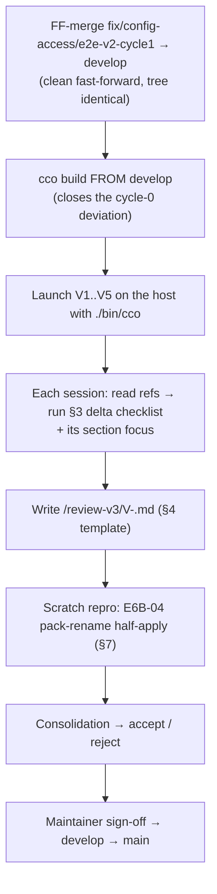

# Agent ↔ cco access — End-to-End Acceptance Handoff (**v3**, targeted re-review)

> **Status**: ready to run (2026-07-20). This is the **acceptance re-review of the cycle-1 fixes**
> produced after the v2 run returned **NOT ACCEPTED**. It is deliberately **narrower** than
> [`handoff.md`](handoff.md) (v2): v2 audited the whole model; v3 asks one question per root —
> *did the fix actually land in a real container, and did it break nothing?*
>
> **What v3 gates**: `develop → main` (the release). It does **not** gate the merge of the fix
> branch into `develop` — that happens *before* the run (§2 rule 0), exactly as v2 did.

---

## 0. What changed since v2 — the six roots under test

The v2 run (7 sessions, 2026-07-16) consolidated to 17 root causes; the verdict was
**NOT ACCEPTED** on enforcement *fidelity*, not on the model. Cycle 1 fixed the six roots that
broke acceptance criteria. Each row below is a **claim v3 must confirm in a live container**:

| Root | Claim to confirm | Criterion |
|---|---|---|
| **RC-1** nested-config clamp | A config-editor target's / the store's own `.cco` is **writable** when the triple grants it (`-mindepth 1` + role-keyed axis, D-M5); the mount **root** follows its own `readonly:`, and the config-editor target root follows **Pc** (D-M11) | D, E |
| **RC-6** config-editor target repos | `config-editor --project X` **mounts X's member repos** at `/workspace/<name>`, not only its `.cco`; an unresolvable member is **announced**, not silently skipped | D |
| **RC-2** host-path class | Index host paths are never existence-tested in-container (INV-F); `repo`/`extra-mount rename` **runs to completion**; `--move-dir` refused exit 2; the "not mounted in this session" vocabulary replaces the misleading "run cco resolve" | A-F3, F |
| **RC-3** store write path | A store write that cannot complete is an **error (exit 1)** with the real reason — never a false success, never a half-apply | B, F |
| **RC-4** `path list` scoping | Owner-less (`unscoped:`) rows are scoped on the **Po** axis — hidden below `read-all`, **counted** in the notice — **unless** the current project actually resolves through one, which stays visible | B, C, G |
| **RC-17** test lane | (meta) the hermetic lane exists; v3 is where its stated blind spot — mount-time reality — is covered | — |

**Already confirmed in-session on the rebuilt image (2026-07-20, `claude-orchestrator` @ read-project)**, so v3
need not re-derive these — but should not contradict them:

- **RC-4 live**: `cco path list` printed only `[claude-orchestrator]`-bracketed rows; the previously
  leaking unbracketed rows are gone and the hidden count rose **13 → 20**; the notice points to
  `read-all` (the Po axis), not `read-global`.
- **RC-2 live**: `cco project show` no longer badges the mounted repo `[missing]`.
- **ADR-0047 boundary live**: raw `cat ~/.local/state/cco/index` → `Permission denied`.
- Scope refusals and store-write refusals exit **2** naming the required axis — no false success.

**What that session could NOT reach** (and is therefore v3's real job): every mount-generation
claim (RC-1/RC-6), the store **write** path at an edit level (RC-3), rename completion and the
`--move-dir` refusal (RC-2 — the access gate fires first at a read level), and — importantly —
**RC-4's positive half**: `claude-orchestrator` declares no `extra_mounts:`, so "a claimed unscoped
row stays visible" was never exercised. **V1 exists for that.**

---

## 1. Reference reading (before reviewing)

Read in this order; everything else is downstream.

1. [`results/consolidated-review.md`](results/consolidated-review.md) — the v2 verdict, the 17-root
   map, decisions **D-M1…D-M3**.
2. [`fix-design-v2/00-overview.md`](fix-design-v2/00-overview.md) — §5 the cross-cutting
   conventions (**the three availability states**, the 0/1/2 exit codes, positive assertions), §9
   the ratified decision table **D-M1…D-M11**, §10 **what is deliberately NOT in cycle 1**.
3. The design doc for the root your session tests: `02-mount-generation.md` (RC-1),
   `03-config-editor-repos.md` (RC-6), `04-host-path-class.md` (RC-2), `05-store-write-path.md`
   (RC-3), `06-path-list-scoping.md` (RC-4), `01-test-lane.md` (RC-17).
4. [`handoff.md`](handoff.md) (v2) — §0 the model recap and §3 the shared checklist still apply as
   background; v3's §3 is the **delta** on top of it.

**ADRs in force** (settled — formalize, never re-litigate): 0042, **0043** (+ its RC-4
annotation), 0044, 0046, **0047**, 0048, **0049**, 0050, 0051. Every cycle-1 fix is
forward-annotated into the ADR it realizes — read the annotation, not just the original decision.

---

## 2. How the run works



**Launch rules:**

0. **Merge first, then build — this is the rule v2's cycle-0 broke.** `develop` is an **ancestor**
   of the fix branch, so the merge is a clean fast-forward and the resulting tree is **identical**
   to the one already built. Doing it anyway makes the image's provenance unambiguous: v3 validates
   what `develop` actually holds, not a feature branch. Commands in §10 step 1.
1. **Always `./bin/cco`** from the `claude-orchestrator` repo on the host — never a stale
   npm-global `cco` (version skew regenerates retired artifacts; v1 root cause **M0**).
2. **Shared output mount**: every session adds `--mount ~/cco-e2e-review-v3:/review-v3:rw`.
   Create once (§10 step 2). Each session writes exactly one `/review-v3/V<N>-<slug>.md`.
3. **Reference-docs mount (non-`claude-orchestrator` sessions)**: V1, V2, V4, V5 do not mount the
   `claude-orchestrator` repo → add `--mount docs:/cco-docs:ro` (run from the repo root so the
   relative `docs` source resolves against `$PWD`). This handoff is then at
   `/cco-docs/maintainers/configuration/agent-cco-access/e2e-review/handoff-v3.md`.
4. **Review-only.** Sessions may *test-write* to disposable targets to exercise edit/rename verbs,
   but must **not** commit, **not** persist changes to real project config, and **not** apply
   fixes. Record what a write *would* do rather than leaving it applied. **Exception**: §7's
   scratch repro is deliberately destructive — on a throwaway project only.
5. **Parallelism**: V1 and V2 are the same project at different access — run them **sequentially**
   so the A/B diff is clean. V3, V4, V5 touch edit surfaces — run **one at a time**.

**Prompt to give each session** (after `./bin/cco start …`, adjust `<N>`):

> Read the handoff — `docs/maintainers/configuration/agent-cco-access/e2e-review/handoff-v3.md`
> in a `claude-orchestrator` session (V3), or
> `/cco-docs/maintainers/configuration/agent-cco-access/e2e-review/handoff-v3.md` otherwise —
> then execute **section V\<N\>** end-to-end: read the §1 refs, run the §3 delta checklist plus your
> section focus, verify the §8 acceptance criteria in your scope, and write your findings to
> `/review-v3/V<N>-<slug>.md` using the §4 template. This is a **targeted re-review of the cycle-1
> fixes** — confirm each claim in your scope actually holds in this live container, and report any
> **new** breakage. Do **not** re-report anything listed in §9 (cycle-2 / out of scope). Review
> only — do not apply fixes, do not commit.

---

## 3. Shared checklist — the v3 delta

v2's §3 (12 items) is the background. In v3 every session additionally does these five, because
they are the things a rebuilt image can finally answer:

1. **Resolved access is what the launch asked for.** `cco whoami` — record the full `(G,Pc,Po)`
   and `(Cr,Cp,Cg,Co)`. Any divergence from the §6 spec is a finding, not a footnote.
2. **Declared vs enforced — the v2 verdict's core.** For every tree the session is told it can
   write: **actually write a scratch file into it** and delete it. `whoami` saying `rw` while the
   mount is `ro` is precisely the class v2 found; only a real write proves it. Record the path
   tested and the result. (Do not leave the file behind.)
3. **The three availability states speak the new vocabulary.** Anywhere a resource is known but
   not bound into this container, the message must say **"not mounted in this session"** with a
   *host* remedy — never "run cco resolve" (the old lie) and never a bare "not found". Exit codes
   follow 0/1/2 (0 degrade · 2 policy refusal, always with a reason · 1 error).
4. **No false success on a write.** Any store-mutating verb you exercise must either succeed
   **and be observable afterwards**, or fail with a non-zero exit and the **real** reason. A `✓`
   followed by no change is the RC-3 defect and is a **blocking** finding.
5. **Boundary re-probe (30 seconds).** As the agent, not via `cco`: `cat ~/.local/state/cco/index`
   and one DATA registry → must be `Permission denied`. Then confirm `cco` itself still reads them,
   scoped. This is criterion B and it is cheap to re-confirm per session.

**Hunt beyond the claims.** For each root in your scope, look for **same-class** problems from your
vantage — a different project shape or access level often exposes a sibling the fix missed. New
findings are welcome; re-reports of §9 items are noise.

---

## 4. Output file template (`/review-v3/V<N>-<slug>.md`)

```markdown
# V<N> — <slug> — <project> @ <access>

- Launched: <exact host command>
- Resolved: cco_access=<level> (G,Pc,Po)=(…)  claude_access=(Cr,Cp,Cg,Co)=(…)  show_host_paths=<on|off>
- Image built from: <develop @ sha>

## Claims under test (from §0)
| Root | Claim | Verdict (HOLDS / BROKEN / NOT REACHABLE) | Evidence |
|---|---|---|---|

## §3 delta checklist
1. access matches spec: …
2. declared-vs-enforced write probe: <path tested> → <result>
3. vocabulary + exit codes: …
4. no false success on writes: …
5. boundary re-probe: …

## Acceptance criteria checked here (§8)
<criterion: PASS / FAIL + one-line evidence>

## Findings (this session)
<ID · severity · what · where (file:line or exact command+output) · why it matters>

## Notes / open questions for consolidation
```

Severity: 🔴 blocking (breaks an acceptance criterion) · 🟠 real bug, non-blocking · 🟡 cosmetic ·
**PROPOSAL** (missing-but-coherent capability, not a bug).

---

## 5. Session matrix

Five sessions + one scratch procedure. Targeted per the cycle-1 verification gates: **V1/V2** for
RC-4, **V3** for RC-2/F, **V4** for RC-1+RC-6/D+E, **V5** for RC-1-broad+RC-3, **§7** for the
never-executed E6B-04.

| # | Slug | Host command (run in `claude-orchestrator/`) | Validates |
|---|---|---|---|
| **V1** | `rc4-claimed` | `./bin/cco start <PROJ-WITH-MOUNTS> --mount ~/cco-e2e-review-v3:/review-v3:rw --mount docs:/cco-docs:ro` | **RC-4 both halves** — the anti-false-positive case nothing has ever verified |
| **V2** | `rc4-readall` | `./bin/cco start <PROJ-WITH-MOUNTS> --cco-access read-all --mount ~/cco-e2e-review-v3:/review-v3:rw --mount docs:/cco-docs:ro` | **RC-4 no-regression** (criterion G) — A/B partner of V1 |
| **V3** | `rename-editproject` | `./bin/cco start claude-orchestrator --cco-access edit-project --mount ~/cco-e2e-review-v3:/review-v3:rw` | **RC-2 / criterion F** — rename completes; `--move-dir` refused; fail-closed |
| **V4** | `ce-project` | `./bin/cco start config-editor --project cave-auth --mount ~/cco-e2e-review-v3:/review-v3:rw --mount docs:/cco-docs:ro` | **RC-1 + RC-6 + D-M11 / criteria D+E** — the v2 verdict's heaviest failure |
| **V5** | `ce-broad` | `./bin/cco start config-editor --all --mount ~/cco-e2e-review-v3:/review-v3:rw --mount docs:/cco-docs:ro` | **RC-1 broad + RC-3** — store writes honest at G=rw |

`<PROJ-WITH-MOUNTS>` = **the StaiSicuro-Juri project** — maintainer-confirmed (2026-07-20) as
declaring `extra_mounts:`. Its `docs` / `mock` / `assets` mounts are exactly the FI-23 residue rows
that leaked in v2, which makes it the ideal V1 subject: the same bindings must now be **hidden from
other projects' sessions** (V2's vantage) yet **still visible to its own** (V1's) — the two halves
of RC-4 in one project. Use the **exact slug** `cco list projects` reports (the paths in the v2
reports read `StaiSicuro-Juri`; confirm the registered project name before launching).

---

## 6. Per-session specs

### V1 — `rc4-claimed` — a project **with** extra_mounts @ read-project

- **Access**: `(none,ro,none)` — `Pc=ro`, `Po=none`.
- **Focus — RC-4's two halves, and the second one is the point.**
  1. **No false negative** (the v2 leak): `cco path list` must **not** show any row belonging to a
     project other than this one, and must **not** show unattributable rows. In v2 this session
     class printed other projects' host paths unbracketed.
  2. **No false positive — the half never verified.** This project's **own** `extra_mounts` are
     (on a v1-migrated machine, FI-23) stored in the project-less `unscoped:` bucket, yet the
     project **resolves through them** — so they are its live mounts. They **must still appear**,
     printed **bare** (unbracketed, because they are stored under no project). Cross-check each
     against `/workspace/<name>` actually being mounted and against Level-A's `path_map`.
     *A hidden row here that is mounted at `/workspace/<name>` is a 🔴 blocking false positive.*
  3. **INV-B**: every hidden row is **counted** in the notice; the notice names **`read-all`**
     (not `read-global`) as the widening — that is the ratified `Po` axis.
  4. **Vocabulary**: `cco project show` / `validate` on this project — no `[missing]` on a mounted
     repo; any genuinely unbound member says "not mounted in this session".
- **Record verbatim** the full `cco path list` output (it is the A/B baseline for V2).

### V2 — `rc4-readall` — same project @ read-all

- **Access**: `(ro,ro,ro)`.
- **Focus — criterion G, the no-regression oracle.** Every row visible, **no** hidden notice; the
  set must be a **strict superset** of V1's. Diff V1 vs V2 and confirm the *only* difference is
  scope. Then reason about the **`read-global` delta**: under the ratified Po axis a `read-global`
  session would still hide other-project **and** unattributable rows — note which rows those are.
  If `read-all` output were to *hide* anything, that is the A2 regression and is 🔴.

### V3 — `rename-editproject` — claude-orchestrator @ edit-project

- **Access**: `(none,rw,none)`; claude_access derived `(ro,rw,ro,ro)`.
- **Focus — criterion F / RC-2.**
  1. **`cco repo rename` runs to completion in-container** on a disposable name (rename, verify
     **both** stores changed — the STATE index *and* `<repo>/.cco/project.yml` — then rename back).
     A `✓ Renamed` with `project.yml` untouched is the half-apply defect (🔴).
  2. **`--move-dir` must be refused, exit 2**, with a host hint (D-M9/Q-5) — *now reachable*,
     because `Pc=rw` means the access gate no longer fires first.
  3. **Bare `cco repo rename <new>` at `/workspace`** (the WORKDIR root, not a member dir) must be
     refused as **ambiguous** (D-M9/Q-6), with no single-repo fallback.
  4. **Fail-closed pre-validation**: the verb must refuse **before** mutating anything when the
     config tree is not writable (no half-apply).
  5. `cco pack rename` / `template rename` must be **refused** here (need `G=rw`).
  6. **Declared-vs-enforced probe** (§3.2) on `<repo>/.cco` and on the project `.claude`.

### V4 — `ce-project` — config-editor `--project cave-auth`

- **Access**: `(ro,rw,none)` (ADR-0048 project mode); claude concordant `(ro,rw,ro,ro)`.
- **Focus — criteria D+E; this is where v2 failed hardest (E5-01 ≡ E6A-01/02/12 ≡ E6B-01/02).**
  1. **RC-1**: cave-auth's `<repo>/.cco` must be **genuinely writable** — prove it with a real
     scratch write (§3.2), not by reading `whoami`. Its **nested `.claude`** follows `Cp`. The
     store `/workspace/cco-config` is **ro** here (`G=ro`) — confirm the *root* is ro by its own
     flag, and that nothing re-clamps a tree that should be writable.
  2. **RC-6**: cave-auth's **member repos are mounted** at `/workspace/<name>` — list them and
     confirm each is real code, not just `.cco`. Any member that could not be mounted must be
     **announced** ("not mounted in this session"), never silently absent (INV-M4).
  3. **D-M11**: the target mount root's readonly follows **Pc**. Sanity-check the escalation
     direction too: with `Pc=rw` it is writable (above); the inverse is V4's optional extra —
     relaunch with `--cco-access global=rw,current=ro,others=none` and confirm the target `.cco`
     is **ro** (it must NOT be writable while `Pc=ro`). *This is the D-M11 escalation test.*
  4. **Repo-aware authoring** (ADR-0042 §8) is now actually possible — exercise authoring a
     `repos[].description` from real repo context, **without persisting**.
  5. `cco pack rename` must be **refused** (store `ro`) — the key by-mode assertion.
  6. Managed rule: introspect the **TARGET** (`cave-auth`), not `PROJECT_NAME` (`config-editor`).

### V5 — `ce-broad` — config-editor `--all` (+ a bare global sub-run)

- **Access**: `--all` → `edit-all (rw,rw,rw)`. Sub-run bare → global mode `(rw,none,none)`.
- **Focus — RC-1 in broad mode + RC-3, the store write path.**
  1. **RC-1 broad**: **every** resolvable project's `.cco` is mounted **and writable** — scratch-write
     into two or three of them (§3.2). v2 found them mounted `ro` while declaring `rw`.
  2. **RC-3 — the honest-failure claim.** Exercise a store-mutating verb (`pack rename` /
     `template rename`) on a **disposable** target at `G=rw`. It must either **apply completely**
     (store dir moved **and** every referring `project.yml`/registry re-keyed — verify both) or
     **fail with exit 1 naming the real reason**. A `✓` with an unchanged store, or a moved dir
     with stale refs, is 🔴 blocking.
  3. **`pack install` is expected to REFUSE in-container** (D-M8/Q-10 — provenance writers are
     cycle-2). A clean refusal is **correct**; a false success is a finding.
  4. **Bare global sub-run**: `(rw,none,none)` — `Pc=none` is honest (project-less). `cco path list`
     is expected to be **honestly empty + notice** (D-M9/Q-9): with `Pc=none, Po=none` and no
     manifest to claim with, no row is in scope. Confirm it is empty-with-notice, **not** a false
     "the path index is empty". Confirm the session **fails loud** if it resolves to an inert
     no-target state (ADR-0048 guard).

---

## 7. §7 — The E6B-04 scratch reproduction (**must be run; never has been**)

v2 *inferred* a `pack rename` half-apply from a non-firing guard plus code order — the reviewers
deliberately never ran it with `-y`. A fix for an unreproduced defect is unverified, so this is a
**named gate**, not an optional extra. It is 🔴 data-loss if the pre-fix behaviour is confirmed.

Run it on a **throwaway** project/pack, from V5 (or its own `edit-all` session):

1. **Create the scratch subject on the host** — a disposable project with one pack, and a second
   project that *references* the same pack (the fan-out is the point). §10 step 6 has the commands.
2. **Post-fix run (the one that matters)**: in an `edit-all` container session,
   `cco pack rename <old> <new> -y`. Then verify **all three** of:
   - the store directory moved (`~/.cco/packs/<new>` exists, `<old>` gone);
   - **every** referring `project.yml` now says `<new>` — including the *second* project's;
   - the DATA provenance/tags registries re-keyed.
   **Either all of it, or none of it plus a non-zero exit with the reason.** Anything in between is
   the half-apply, and it is blocking.
3. **Optional pre-fix comparison**: if you want the before/after contrast, run the same steps in a
   container built from `develop~` (before the cycle-1 merge). Not required for acceptance —
   the post-fix behaviour is the criterion.
4. **Clean up** the scratch project/pack afterwards.

---

## 8. Acceptance criteria (the oracle)

v3 **accepts** the release when all of these hold. They are v2's criteria narrowed to what cycle 1
claimed to fix — an unchanged-and-still-failing v2 criterion listed in §9 does **not** block.

- **B — enforcement.** Raw store reads still `EACCES` (S1/S1b intact). Output scoping has **no
  false negative** (nothing leaks) **and no false positive** (nothing in-scope is hidden) — V1
  carries both halves. Every store write either completes observably or fails **exit 1** with the
  real reason (RC-3); no false success anywhere.
- **C — model correctness.** Each session's resolved `(G,Pc,Po)` matches its spec; hidden ≠ absent
  (count-only notices); exit codes follow 0/1/2 and every refusal names a reason and a remedy; the
  "not mounted in this session" vocabulary is used wherever it applies.
- **D — config-editor by mode.** Project mode `(ro,rw,none)` with the target `.cco` **actually
  writable** and its **repos mounted**; `--all` `(rw,rw,rw)` with every project's `.cco` actually
  writable; bare global `(rw,none,none)` honest and project-less; the D-M11 escalation test shows
  the target `.cco` **ro** when `Pc=ro`.
- **E — claude_access concordance.** `.claude` read-only by default; the four axes behave; the
  nested `.claude` under a writable config tree follows **Cp/Cg** per role (D-M5), not a blanket
  clamp.
- **F — rename verbs.** `repo`/`extra-mount rename` complete **in-container** at `edit-project`,
  writing **both** stores; `--move-dir` refused exit 2; `pack`/`template rename` gated at `G=rw`;
  fail-closed pre-validation; no half-apply (§7).
- **G — no regressions.** `read-all`/`edit-all` output unchanged vs v2 (V2 is the oracle); secret
  and host-path hygiene at every level; Level-A injection accurate; the settled decisions untouched.

**Verdict rule**: any 🔴 against B/C/D/E/F/G ⇒ **NOT ACCEPTED**, and the finding is triaged into a
cycle-1.1 fix (not cycle 2). Only 🟠/🟡 remaining ⇒ **ACCEPTED with follow-ups**.

---

## 9. Explicitly OUT of scope — do **not** re-report

These are **known, triaged and deferred by decision**. Re-reporting them costs a consolidation
cycle and was the single biggest noise source in v2.

- **The whole cycle-2 set**: the **RC-5** vocabulary sweep across the verbs cycle 1 did not touch,
  and **RC-7…RC-16** — including `/etc/cco/policy.json` being agent-readable (criterion **B-S1b**
  stays FAILING by design), `whoami` presentation, help-surface gaps, list rendering, llms verb
  desync, doc drift, M0 residue, host-side index hygiene. Full table:
  [`fix-design-v2/00-overview.md`](fix-design-v2/00-overview.md) §10.
- **Q-10 provenance writers** — `pack install`/`update`/`import`, `llms install`/`update` are a
  **clean in-container refusal** until cycle 2. The refusal is the correct behaviour.
- **Q-15** the unscoped `dummy-repo` test seed · **DI2** the `-ne 0` negative-space test sweep ·
  the **`LLMS_DIR`** lint taint-set gap · the **`cmd-resolve.sh` INV-F.3** asserted-shape exemption.
  All recorded in [`pre-revalidation-backlog.md`](pre-revalidation-backlog.md) §Cycle-2 residue.
- **FI-21 / FI-22 / FI-23** — index-model items, triaged out before v2 and still out. In
  particular **FI-23** (legacy extra_mounts in the `unscoped:` bucket) is the *substrate* V1 tests
  against, **not a bug to file**: RC-4 makes `path list` correct **in its presence**; it does not
  clean it. (The backlog's old "self-healing" claim was corrected 2026-07-20 — the residue does
  **not** drain away.)
- **E4-02 / RC-16** — a binding attributed to the *wrong* project is a different mechanism from an
  *un-owned* one; RC-4 explicitly does not claim it. You will still see
  `[claude-orchestrator] cave-web-kit`-style rows; that is cycle 2.
- **Docs-coherence track** — the maintainer's untracked `to-verify-guides-docs.md` / `tmp` notes.
- **Linux write-path** — the D-M6 check-in is a separate gate before `develop → main`, not a v3
  session (macOS Docker Desktop `fakeowner` is already dogfood-confirmed).

---

## 10. Host-side runbook (maintainer) — do these in order

Everything below runs **on the Mac**, from the `claude-orchestrator` repo root.

### Step 1 — Merge cycle-1 into `develop` (clean fast-forward), then build from it

`develop` is an ancestor of the fix branch, so this is a true fast-forward: **no merge commit, no
conflict, and the resulting tree is byte-identical** to the one you already built. Doing it now is
what makes v3 validate the release branch rather than a feature branch (v2 launch-rule 0).

```bash
cd /Users/alessandro/Projects/CaveResistance/Software/claude-orchestrator

# 0. Sanity: clean tree except your two untracked notes
git status --short

# 1. Fast-forward develop onto the cycle-1 tip (no checkout dance needed)
git checkout develop
git merge --ff-only fix/config-access/e2e-v2-cycle1
git log --oneline -1            # expect: f886a22 docs(design): rewrite living docs…

# 2. Build the image FROM develop
cco build

# 3. Record the sha the image was built from — each session reports it in §4
git rev-parse --short HEAD
```

> **Do not delete the fix branch yet** — keep it until v3 is accepted, so a revert is one command.
> **Do not push yet** and **do not merge develop → main**: v3 is the gate for that.

### Step 2 — Create the shared output directory

```bash
mkdir -p ~/cco-e2e-review-v3
```

### Step 3 — Confirm the V1/V2 subject + capture the host oracle

`<PROJ-WITH-MOUNTS>` is **StaiSicuro-Juri** (maintainer-confirmed: it declares `extra_mounts:`).
Only the exact registered slug is still needed — the v2 reports show the *path* as
`StaiSicuro-Juri`, which may differ from the project name in the index:

```bash
cco list projects        # copy the exact slug for the V1/V2 launches
```

Capture the host-side truth to diff against later:

```bash
cco path list > ~/cco-e2e-review-v3/HOST-path-list.txt
```

This is the **criterion-G oracle**: V2 (`read-all`) output must match this modulo formatting.

### Step 4 — Run the sessions, one at a time

For each, launch, paste the §2 prompt (with the right `V<N>`), let it work, then exit.

```bash
# V1 — RC-4 both halves  (substitute the project from step 3)
./bin/cco start StaiSicuro-Juri \
  --mount ~/cco-e2e-review-v3:/review-v3:rw --mount docs:/cco-docs:ro

# V2 — RC-4 no-regression (same project, read-all)
./bin/cco start StaiSicuro-Juri --cco-access read-all \
  --mount ~/cco-e2e-review-v3:/review-v3:rw --mount docs:/cco-docs:ro

# V3 — rename / criterion F (self-dev project, docs in-repo → no docs mount)
./bin/cco start claude-orchestrator --cco-access edit-project \
  --mount ~/cco-e2e-review-v3:/review-v3:rw

# V4 — config-editor project mode (criteria D+E)
./bin/cco start config-editor --project cave-auth \
  --mount ~/cco-e2e-review-v3:/review-v3:rw --mount docs:/cco-docs:ro

# V4b — the D-M11 escalation test (optional but recommended, ~5 min)
./bin/cco start config-editor --project cave-auth \
  --cco-access global=rw,current=ro,others=none \
  --mount ~/cco-e2e-review-v3:/review-v3:rw --mount docs:/cco-docs:ro

# V5 — config-editor broad + RC-3 store writes
./bin/cco start config-editor --all \
  --mount ~/cco-e2e-review-v3:/review-v3:rw --mount docs:/cco-docs:ro

# V5b — bare global sub-run (project-less honesty)
./bin/cco start config-editor \
  --mount ~/cco-e2e-review-v3:/review-v3:rw --mount docs:/cco-docs:ro
```

> If a project needs resolving first, the host will say so — run the suggested
> `./bin/cco resolve <project>` and re-launch.

### Step 5 — What **you** should eyeball personally (2 minutes, high value)

Two things are much easier for a human than for a session agent:

1. **The V1/V2 `path list` diff.** Open `HOST-path-list.txt` next to what V1 and V2 reported. You
   know which of those bindings are really yours; a session agent does not. If V1 hides a row that
   is genuinely one of that project's own mounts, that is the blocking false positive — and you are
   the fastest oracle for it.
2. **The V4 repo mounts.** In the V4 session, `ls /workspace` should show cave-auth's actual member
   repos, not just `cave-auth-config`. That is RC-6 in one glance.

### Step 6 — The §7 scratch reproduction (do **not** skip)

> **These commands are a sketch, not a script.** `cco init` is interactive and the pack-reference
> edit is a manual `project.yml` change. Adapt as needed — what matters is the **shape**: two
> projects that both reference **one** pack, so the rename's cross-project ref fan-out is actually
> exercised. A single-project setup would pass a half-apply undetected.

```bash
# Two throwaway repos, each becoming a cco project
mkdir -p /tmp/cco-scratch/proj-a /tmp/cco-scratch/proj-b
( cd /tmp/cco-scratch/proj-a && git init -q && cco init )   # name it e.g. scratch-a
( cd /tmp/cco-scratch/proj-b && git init -q && cco init )   # name it e.g. scratch-b

cco pack create scratch-pack                                # a disposable pack

# Manually add `scratch-pack` to the packs: list of BOTH projects' .cco/project.yml, then:
cco resolve scratch-a && cco resolve scratch-b
cco list packs                                              # confirm scratch-pack is registered
```

Then run the rename **inside** a container session (`./bin/cco start config-editor --all …`) per
§7 step 2, and verify the three post-conditions — in particular that **`scratch-b`'s**
`project.yml` was re-keyed too, not just `scratch-a`'s.

Cleanup afterwards: remove `/tmp/cco-scratch`, `~/.cco/packs/scratch-pack*`, and the two scratch
projects from the index (`cco forget scratch-a`, `cco forget scratch-b` — host-only verbs).

### Step 7 — After all sessions: consolidate

Hand me the `~/cco-e2e-review-v3/` directory (mount it into a fresh `claude-orchestrator` session)
and I will consolidate to a single verdict + any cycle-1.1 fix design, exactly as v2's
`results/consolidated-review.md` did.

```bash
./bin/cco start claude-orchestrator --mount ~/cco-e2e-review-v3:/review-v3:ro
```

### Step 8 — Only after ACCEPTED

```bash
git push origin develop
git checkout main && git merge --no-ff develop
git push origin main
git branch -d fix/config-access/e2e-v2-cycle1
```

Plus the **D-M6 Linux write-path check-in** before `develop → main` if you intend to support
native-Linux hosts in this release.

---

## 11. Quick reference — what each session must produce

| Session | One-line pass condition |
|---|---|
| **V1** | No foreign/unattributable row printed **and** this project's own bare mount rows still printed, all hidden rows counted, notice says `read-all` |
| **V2** | Strict superset of V1, no notice, matches the host oracle |
| **V3** | `repo rename` changes **both** stores; `--move-dir` exits 2; `pack rename` refused |
| **V4** | Target `.cco` accepts a real write **and** `ls /workspace` shows cave-auth's repos; `pack rename` refused; V4b shows the target `.cco` **ro** at `Pc=ro` |
| **V5** | Every project's `.cco` accepts a real write; a store rename is all-or-nothing with a truthful exit code; bare global is honestly empty |
| **§7** | `pack rename -y` is atomic across store + **all** referring `project.yml` + registries, or refuses non-zero |
