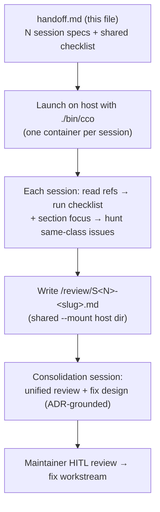

# Agent ↔ cco Access — End-to-End Validation Handoff

> **Status**: Ready to run (2026-07-03). Drives a representative, multi-session
> end-to-end validation of the agent↔cco access model (ADR-0036 / ADR-0042 /
> ADR-0043) as it actually behaves **inside live cco sessions**.
>
> **Nature**: This is a **review / bug-hunt** handoff — sessions **observe, probe,
> and report**. They do **not** apply fixes. Fixes are designed later, in a unified
> pass across all session outputs, with maintainer HITL.
>
> **Scope**: agent-facing configuration only — (A) hook context injection, (B) the
> wrapped in-container `cco`, (C) managed rules. Correctness of *verb availability,
> access gating, output scoping, awareness injection, self-introspection, and help
> scope-awareness* across representative access classes and project shapes.

---

## 1. Reference reading (before reviewing)

Every session MUST read these first (they define the target behavior; findings are
judged against them, not against intuition):

- `docs/maintainers/configuration/agent-cco-access/design.md` — the three-level model (A/B/C), invariants INV-1..4.
- `docs/maintainers/configuration/agent-cco-access/decisions/0042-agent-cco-interaction-model.md` — the model + the six ratified decisions (read-project default, scope-aware help, config-editor UX, `cco docs` reachability).
- `docs/maintainers/cli/decisions/0043-unified-cli-environment-access-scope.md` — output-scoping layer, scope taxonomy, INV-A..E, `lib/access-scope.sh`.
- `docs/maintainers/configuration/decentralized-config/decisions/0036-session-config-capability-model.md` — the capability knobs.
- `docs/maintainers/cli/design/design-cli-environment-awareness.md` — the surface-wide dual-context principle + per-verb checklist.

**Design tenets a reviewer must hold in mind** (from the ADRs):

- `cco_access` axis: `none · read-project · read-global · read-all · edit-project · edit-global · edit-all` (symmetric read scoping; normal-project default = `read-project`).
- **Scope taxonomy** (ADR-0043 §1): `project`-class kinds (project, pack, llms) are visible at `read-project` **only when referenced by the current project**; `global`-class kinds (template, remote) need `read-global+`. Anything hidden → a **count-only stderr notice** (INV-B/C); hidden ≠ absent.
- **Host is never scoped** (INV-A); scoping engages only in container-operator mode.
- **Scope-aware help** (ADR-0042 D5): host-only verbs are *shown but flagged* `(host only — run on your host)`; verbs above the current level marked unavailable.
- **No generated file** in any tree (INV-2); Level-A context arrives via `CCO_SESSION_CONTEXT` env, decoded by the hooks.
- Secrets/tokens are masked/absent at **every** level.

---

## 2. How the review runs



**Launch rules (all sessions):**

1. **Always use `./bin/cco`** from the `claude-orchestrator` repo on the host — the
   npm-global `cco` is a stale release (pre-`--version`, pre-`workspace.yml`
   retirement) and would regenerate retired artifacts. `./bin/cco` is the current
   branch. (Root cause of finding **M0**; see §6.)
2. **Shared output mount**: every session adds
   `--mount ~/cco-e2e-review:/review:rw`. Create the dir once on host:
   `mkdir -p ~/cco-e2e-review`. Each session writes exactly one file
   `/review/S<N>-<slug>.md` using the template in §4.
3. **Review-only**: sessions may *test-write* to disposable targets to exercise
   edit verbs, but must **not** commit, must **not** modify real project config
   permanently, and must **not** apply fixes. Note what a write verb *would* do
   instead of leaving it applied.
4. **Parallelism**: sessions on distinct projects run concurrently. Same-project
   sessions with different access also run concurrently (mounts are independent);
   because sessions are review-only, concurrent config-editor sessions are safe as
   long as they don't persist writes. If in doubt, run the edit-capable sessions
   (S5/S6/S7) one at a time.

**Passing the handoff to a session**: after `./bin/cco start …`, give the agent this
prompt (adjust `<N>`):

> Read `docs/maintainers/configuration/agent-cco-access/e2e-review/handoff.md`,
> then execute **section S<N>** end-to-end: run the shared checklist (§3) + the
> section focus, hunt for same-class issues beyond the known seeds, and write your
> findings to `/review/S<N>-<slug>.md` using the §4 template. Review only — do not
> apply fixes.

---

## 3. Shared checklist (every session)

For the session's resolved access level and project, verify and record:

1. **Level-A injection** — is the injected `<CcoSessionInfo>` / `<SessionContext>`
   present, accurate, and complete for this project? Repos, extra_mounts, packs,
   llms, descriptions, `path_map` (only when `show_host_paths` on), access-scope
   declaration, wrapped-cco availability line. Cross-check against `./bin/cco`
   reality. Any drift, stale, or missing element?
2. **Verb availability & gating** — which `cco` verbs are reachable? Do host-only
   verbs refuse with a redirect-to-host hint? Do write verbs require an edit level?
   Do `global`-class read verbs (`template`, `remote list`) require `read-global+`?
   Any verb that is *inconsistently* gated vs its siblings?
3. **Output scoping + notice** (read levels) — does `cco list` and each
   `cco list <kind>` show exactly the in-scope resources, and emit the count-only
   hidden notice on **stderr** when it filters? Is `cco list` consistent with
   `cco list <kind>` (same hidden/visible verdict per kind)? Do `show`/detail verbs
   degrade gracefully for out-of-scope names?
4. **Help scope-awareness** — do `cco`, `cco help`, `cco <cmd> --help` reflect the
   container context (host-only flagged, above-level marked)? Is any help missing,
   empty, or misleading in-container?
5. **Self-introspection** — can the agent learn its *current* project's resources
   from the CLI (not only Level-A)? Does the project name from Level-A/`cco list`
   work where a name is expected? Does resolution work from the `/workspace` root?
6. **Permission-state discoverability** — can the agent determine its own
   `cco_access` / `claude_access` / `show_host_paths` from a command (not only env
   vars / Level-A)? Note the gap if none.
7. **`cco docs`** — does `cco docs` list and open bundled user docs in-container?
8. **Secret/host-path hygiene** — are secrets/tokens absent/masked? Are host paths
   shown only when `show_host_paths` is on, and never in a form that would be
   committed?
9. **Managed rules (C)** — is `cco-config-interaction.md` present and its
   access-gated sections applied correctly for this level (edit-safety only at
   edit levels; read-project scope-awareness at any read level)?
10. **Design drift** — anything that contradicts ADR-0036/0042/0043 or the design
    doc. Cite the ADR/section.

**Hunt beyond the seeds.** The known seeds below are *starting points*, not the
scope. For each seed, look for **same-class** problems the reviewer can reach from
this session's vantage (a different project shape or access level often exposes a
sibling bug the baseline could not).

### Known seeds (already observed at `read-project` on a no-packs project)

| Seed | Summary | Class to hunt |
|---|---|---|
| **M0** | Retired `workspace.yml`/`packs.md` regenerated as 0-byte in the committed tree by a **stale host `cco`** (version skew). Migration 014 is correct; gitignore now excludes them. | Generated-artifact leakage into committed trees; version-skew between host cco and image |
| **F1** | `cco docs` → "Bundled docs not found at /opt/cco/docs/users": the Dockerfile bakes `bin/lib/templates` but **not `docs/`** → D3 ("cco docs at any read level") unmet in-container. | Declared-but-unbuilt features; image/packaging gaps |
| **F2** | Drift `cco list` (scoped ✅) vs `cco list <kind>`: `list template` shows templates unscoped at read-project; `list pack` dies "Global config not found. Run 'cco init'" (host-only, wrong); `list llms` "Used by" ignores the membership env. | Per-kind read verbs not wired to `lib/access-scope.sh` (INV-E); wrong/host-only error hints in-container |
| **F3 / F7** | In-container cwd resolution: from `/workspace` root, cwd-based verbs fail; `cco project show <current-name>` fails ("run cco resolve" — host-only) while bare `cco project show` (from `<repo>` cwd) works; `cco project` (bare) prints a misleading `'cco project ' is not available…`. Design gap: in-container `/workspace` **is** the project root and `PROJECT_NAME` is in env — resolution should succeed from root; host behavior unchanged. | cwd/project resolution in container-operator mode; misleading refusals |
| **F4** | No verb reports the session's own permission state (`cco_access`/`claude_access`/`show_host_paths`) — only env + Level-A. | Missing introspection surface |
| **F5** | `cco start --help` in-container prints **nothing** (while `cco new --help` correctly refuses as host-only). | Inconsistent host-only handling across lifecycle verbs |

Findings are **possible missing-but-useful commands** too (coherent with the access
design/scope) — e.g. a `cco project show <current>` that works in-container, a
permission-state verb, a rich "current project resources" view. Record these as
*proposals*, tagged, distinct from bugs.

---

## 4. Output file template (`/review/S<N>-<slug>.md`)

```markdown
# S<N> — <mode> — <project>

- Launched: <exact ./bin/cco command used>
- Resolved access: claude_access=<> cco_access=<> show_host_paths=<>
- Mounted resources (observed): <repos / .cco / packs / llms / extra_mounts>

## Checklist results
1. Level-A injection: <PASS/ISSUE + evidence>
2. Verb availability & gating: ...
3. Output scoping + notice: ...
4. Help scope-awareness: ...
5. Self-introspection: ...
6. Permission-state discoverability: ...
7. cco docs: ...
8. Secret/host-path hygiene: ...
9. Managed rules (C): ...
10. Design drift: ...

## Findings (this session)
- [ID] <BUG|DRIFT|PROPOSAL> — <one-line> — severity <🔴/🟠/🟡> — class <> — evidence (command + output) — ADR ref
  - Same-class hunt: <what else was probed, what was/wasn't found>

## Seeds re-observed here
- M0/F1/F2/F3/F4/F5: <confirmed here? behaves differently at this scope/project? new sibling?>

## Notes / open questions for consolidation
```

---

## 5. Session matrix

Representative set: covers every **behavior class** across a **richness spectrum**
(minimal → rich → all-projects) while minimizing manual launches. `read-all` is not
a separate session (identical read *output* to `read-global`); `edit-all` is covered
by config-editor-broad. **S1 is this baseline session (already running).**

| # | Slug | Host command (run in `claude-orchestrator/`) | Project shape | Class validated |
|---|---|---|---|---|
| S1 | `readproject-min` | *(running)* `./bin/cco start claude-orchestrator` | minimal: 1 repo, 0 packs | read-project baseline; no-packs scoping edge (F2) |
| S2 | `readproject-rich` | `./bin/cco start cave-auth --mount ~/cco-e2e-review:/review:rw` | rich: 3 repos, packs cave-core+cave-web | read-project scoping **with** referenced packs |
| S3 | `readglobal-rich` | `./bin/cco start cave-auth --cco-access read-global --mount ~/cco-e2e-review:/review:rw` | rich (A/B vs S2) | full-read: no scoping, all kinds visible, no notice |
| S4 | `none-mid` | `./bin/cco start cave-eda-flow --cco-access none --mount ~/cco-e2e-review:/review:rw` | mid: 2 repos, pack cave-core | no-cco: Level-A without wrapped cco; CLI absent |
| S5 | `editproject-min` | `./bin/cco start claude-orchestrator --cco-access edit-project --mount ~/cco-e2e-review:/review:rw` | minimal (self-dev) | write-scoped + managed edit rule + `project.yml` authoring |
| S6 | `configeditor-broad` | `./bin/cco start config-editor --mount ~/cco-e2e-review:/review:rw` | all projects' `.cco`, no repos | edit-all broad; cross-project view |
| S7 | `configeditor-project` | `./bin/cco start config-editor --project cave-auth --mount ~/cco-e2e-review:/review:rw` | cave-auth `.cco` + its 3 repos | repo-aware authoring (ADR-0042 §8) |
| S8 | `tutorial` | `./bin/cco start tutorial --mount ~/cco-e2e-review:/review:rw` | internal tutorial | preset resolution (none/read-project teacher) |

> If a project needs resolving first, the host will say so — run the suggested
> `./bin/cco resolve <project>` on the host, then re-launch.

---

## 6. Per-session specs

Each spec: the exact host launch, the resources expected to be mounted, the resolved
access, and the **section focus** (what to press hardest, beyond the shared
checklist). Expected behaviors are the *target*; deviations are findings.

### S1 — `readproject-min` — claude-orchestrator @ read-project (baseline, running)
- **Host**: `./bin/cco start claude-orchestrator` (add the review mount if re-run).
- **Mounts**: repo `claude-orchestrator` (rw); committed `.cco/claude` → `/workspace/.claude`; managed overlays; no packs; llms code-claude + platform-claude (referenced). Operator CONFIG bucket narrowed (no referenced packs).
- **Access**: claude_access=repo, cco_access=read-project, show_host_paths=on.
- **Focus**: the **no-packs** edge — `cco list pack` error (F2), `cco list` vs per-kind consistency, self-introspection from `/workspace` root (F3/F7), permission-state gap (F4), `cco docs` (F1), `cco start --help` emptiness (F5). This session already produced seeds M0/F1–F5; confirm and expand.

### S2 — `readproject-rich` — cave-auth @ read-project
- **Host**: `./bin/cco start cave-auth --mount ~/cco-e2e-review:/review:rw`
- **Mounts**: repos cave-auth, cave-auth-web, cave-infrastructure (rw, per resolution state); their committed `.cco`; referenced packs **cave-core + cave-web** (ro); referenced llms; CONFIG bucket narrowed to referenced packs.
- **Access**: cco_access=read-project.
- **Focus**: **output scoping with real packs**. Expected: `cco list` shows cave-auth + cave-core + cave-web (+ referenced llms); **hides** the other packs (alberghi-it, cave-homeserver) and the other 4 projects and template `base`, with a **count-only stderr notice**. Verify `cco list pack` here (does it work when packs *are* referenced, unlike S1?), `cco list template` (should be hidden/`read-global+`), `cco pack show cave-core` (in-scope, should work) vs `cco pack show alberghi-it` (out-of-scope, should degrade per `_env_require_visible`). Multi-repo Level-A + path_map correctness. Self-introspection with 3 repos.

### S3 — `readglobal-rich` — cave-auth @ read-global
- **Host**: `./bin/cco start cave-auth --cco-access read-global --mount ~/cco-e2e-review:/review:rw`
- **Mounts**: as S2 but the operator CONFIG bucket is **not** narrowed (global read).
- **Access**: cco_access=read-global.
- **Focus**: **no scoping** — `cco list` and every `cco list <kind>` must show the **full** set (all 5 projects, all 4 packs, template base, both llms, remotes) with **no** hidden notice. This is the A/B partner to S2: diff the two outputs and confirm the *only* difference is scope. Confirm `template`/`remote list` are now reachable (they need `read-global+`). Confirm host-only verbs still refuse.

### S4 — `none-mid` — cave-eda-flow @ cco_access=none
- **Host**: `./bin/cco start cave-eda-flow --cco-access none --mount ~/cco-e2e-review:/review:rw`
- **Mounts**: repos cave-flow, cave-eda-framework (rw); pack cave-core (ro); **no wrapped `cco`** (operator shim absent at `none`).
- **Access**: cco_access=none.
- **Focus**: Level-A must still fully inform the agent **without** any CLI — repos, packs, llms, path_map, and the awareness that `cco` is *not* available here. Confirm `cco` is genuinely absent/refused (no partial surface). This is the "awareness without operation" class: the whole burden is on injection (A) + managed rules (C).

### S5 — `editproject-min` — claude-orchestrator @ edit-project
- **Host**: `./bin/cco start claude-orchestrator --cco-access edit-project --mount ~/cco-e2e-review:/review:rw`
- **Mounts**: repo (rw) + committed `.cco` writable for config authoring; managed edit-safety rule active.
- **Access**: cco_access=edit-project (scoped writes to the current project).
- **Focus**: **write surface + managed rule**. Which write verbs are enabled and are they **scoped** to claude-orchestrator (can't touch other projects)? Does the managed `cco-config-interaction.md` edit-safety section now apply (diff/status before edit, atomic commits, `cco config save`)? Exercise `project.yml` description authoring (ADR-0042 §6) — but **do not persist**; describe what it would write. Confirm path-resolving/network verbs (`config push/pull`, `remote *-token`) stay host-only even at an edit level. Hunt for edit verbs that are *not* scope-enforced.

### S6 — `configeditor-broad` — config-editor (broad)
- **Host**: `./bin/cco start config-editor --mount ~/cco-e2e-review:/review:rw`
- **Mounts**: personal store `~/.cco` (rw) + **every resolvable project's `<repo>/.cco`** (rw), **no full repos** (ADR-0042 §8). Real secret files masked (only `*.example`).
- **Access**: claude_access=all, cco_access=edit-all.
- **Focus**: the **broad cross-project** authoring surface — is every project's `.cco` present and editable, and are **no** repos mounted (P18 refined)? Full unscoped read (edit-all ⇒ everything visible). Verify secret masking across all mounted `.cco` trees. This session is the natural place to cross-check the *multi-project* picture the scoped sessions (S1/S2) only saw a slice of. Confirm `--all` alias equivalence. Hunt for any project whose `.cco` fails to mount/resolve.

### S7 — `configeditor-project` — config-editor --project cave-auth
- **Host**: `./bin/cco start config-editor --project cave-auth --mount ~/cco-e2e-review:/review:rw`
- **Mounts**: `~/.cco` + cave-auth's `<repo>/.cco` + **cave-auth's repos** (the repo-aware authoring session).
- **Access**: cco_access=edit-all (narrowed target), repos mounted.
- **Focus**: ADR-0042 §8 **repo-aware authoring** — both the project's `.cco` *and* its code are present, so `project.yml` `repos[].description` can be authored with real repo context. Verify the narrowing (only cave-auth's `.cco`, its repos) vs S6's breadth. This resolves the §6 "authoring tension" — confirm it actually does. Exercise (without persisting) description authoring for cave-auth's 3 repos.

### S8 — `tutorial` — tutorial preset
- **Host**: `./bin/cco start tutorial --mount ~/cco-e2e-review:/review:rw`
- **Mounts**: internal tutorial content; docs mounted per preset.
- **Access**: preset none/read-project (read-only teacher).
- **Focus**: **preset resolution** — confirm the resolved knobs match the tutorial preset, that the read-project scope-awareness holds, and that `cco docs` (D3) is reachable here (the tutorial is the canonical "learn by doing" path — F1 would break it). Verify the teacher experience surfaces the right, non-misleading command set.

---

## 7. Consolidation (after all sessions)

1. Collect `~/cco-e2e-review/S*.md` (host). Re-mount that dir into a consolidation
   session (`./bin/cco start claude-orchestrator --mount ~/cco-e2e-review:/review:ro`)
   or share the files back.
2. **Unified review**: dedupe findings across sessions; classify each as
   BUG / DRIFT / PROPOSAL; rank by severity and by how many scopes/projects
   reproduce it; map each to the ADR/section it violates or extends.
3. **Fix design**: for each confirmed issue, design the fix grounded in
   ADR-0036/0042/0043 and `design-cli-environment-awareness.md` (which module,
   which invariant). Group into a fix workstream with ordering (e.g. F1 image bake,
   F2 per-kind scoping wiring, F3/F7 in-container resolution, F4 permission verb).
4. **Maintainer HITL**: review the consolidated findings + fix design before any
   implementation. No fixes are applied inside the review sessions.

## 8. Appendix — related, out-of-scope-for-now

- **Docs coherence**: the maintainer's working notes `to-verify-guides-docs.md` and
  `tmp` (repo root, untracked) flag README / guide inconsistencies (e.g. the
  `cco init` quick-start reads as a global step but is cwd/project-based). This is a
  **separate docs-review track** — noted here so its items are folded into the
  eventual documentation sweep, not lost. Not part of the access e2e.
- **Host maintenance**: the npm-global `cco` is stale; refresh it (or keep using
  `./bin/cco`) once the post-retirement release ships. This is the M0 root-cause
  mitigation and is host-side, not a repo fix.
