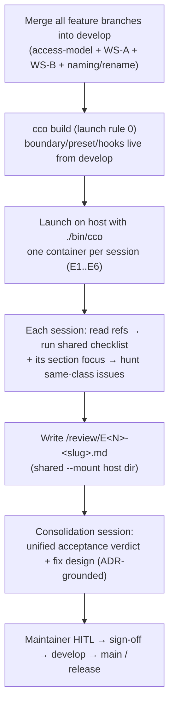

# Agent ↔ cco access + CLI environment-awareness — End-to-End Acceptance Handoff (v2)

> **Status**: Ready to run. This is the **v2 acceptance pass** — written *after* the
> hardening-v2 design + implementation (unified `(G,Pc,Po)` model, the S1/S1b privilege
> boundary, config-editor min-privilege-by-mode, concordant `claude_access`) and the naming
> workstream (rename verbs). It supersedes the v1 review handoff (bug-hunt seed pass, kept in
> git history at `83cc22a`).
>
> **Nature**: **Acceptance review** — sessions **observe, probe, and report** against a known
> oracle (§8 acceptance criteria + the ADRs). They do **not** apply fixes and do **not**
> commit. Findings feed a unified consolidation pass with maintainer HITL.
>
> **Gate role**: The feature branches (access-model, WS-A, WS-B, naming/rename) are merged into
> `develop` **first**; this e2e runs from the integrated `develop` and gates **develop → main /
> release**. It is the truthful pre-release acceptance of the whole access + CLI-awareness
> surface at the current development point.
>
> **Scope**: agent-facing configuration + in-container CLI — (A) hook context injection,
> (B) the wrapped in-container `cco`, (C) managed rules — plus the physical **privilege
> boundary** (D). Correctness of *verb availability, access gating, output scoping, awareness
> injection, self-introspection, help scope-awareness, config confidentiality, and
> `claude_access` behaviour* across representative access classes and project shapes.

---

## 0. Model recap (hold in mind while reviewing)

The behaviour below is the **target**; deviations are findings. Judge against the ADRs, not
intuition.

- **cco_access = `(G, Pc, Po)`** triple (ADR-0046), each axis `none | ro | rw`:
  - **G** = global store `~/.cco` (packs, templates, llms, remotes, `.claude`, DATA
    registries). `none` = referenced subset only; `ro` = whole (read); `rw`.
  - **Pc** = current project config `<repo>/.cco`.
  - **Po** = other projects' config.
  - Invariants: `rw ⇒ ro`; **INV-2 (conditional, ADR-0048)** `perm>none ∧ has_current_project ⇒ Pc ≥ ro`; **INV-3** `Po≠none ⇒ Pc≠none`; **INV-4** `Po ≤ Pc`.
  - **Presets are sugar** over triples: `read-project=(none,ro,none)` · `read-global=(ro,ro,none)` · `read-all=(ro,ro,ro)` · `edit-project=(none,rw,none)` · `edit-global=(rw,rw,none)` · `edit-all=(rw,rw,rw)`. Granular form (`--cco-access global=ro,current=rw,others=rw`) is first-class and covers the previously-unreachable cases 6/7.
- **claude_access = `(Cr, Cp, Cg, Co)`** triple (ADR-0049), each `ro | rw` (never `none`):
  - **Cr** = repo-native `<repo>/.claude` (always `ro`, never derived); **Cp** = project `<repo>/.cco/claude`; **Cg** = global `~/.cco/.claude`; **Co** = other projects' `.cco/.claude`.
  - **Concordant default**: derived from cco (`Cp=Pc`, `Cg=G`, `Co=Po`, `Cr=ro`). Explicit granular *more permissive* than derived → **warn, not refuse**. `.claude` is **read-only by default** (reverses ADR-0027 P17). Functional floor: `~/.claude/settings*.json` stays rw.
- **Enforcement / privilege boundary (ADR-0047)**: the internal store (STATE index, DATA
  registries, CACHE) lives behind a **parent-gated (mode-0700) directory + setuid `cco-svc`
  helper**. The `claude` user cannot traverse it → raw `cat` fails **EACCES**; only `cco`
  (via the helper, reading the trusted session descriptor) reads it, gated on `(G,Pc,Po)`.
  Output-scoping (ADR-0043, `lib/access-scope.sh`) is now **defense-in-depth**, no longer the
  confidentiality control. This closes v1 **S1** (cross-scope info leak) and **S1b**
  (`show_host_paths=off` bypass).
- **Output scoping (ADR-0043)**: `project`-class kinds (project, pack, llms) visible at
  `read-project` **only when referenced**; `global`-class kinds (template, remote) need
  `read-global+`. Hidden → **count-only stderr notice** (INV-B/C); **hidden ≠ absent**. Host
  is never scoped (INV-A). Single source = `lib/access-scope.sh` (INV-E).
- **config-editor min-privilege by mode (ADR-0044 + ADR-0048)**: project mode `(ro,rw,none)`;
  global mode (bare, project-less) `(rw,none,none)`; `--all` / `edit-all` `(rw,rw,rw)`. Floor
  `G ≥ ro`. Fail-loud on an inert (no-target) session.
- **Rename verbs (ADR-0050)**: `cco <kind> rename` are **edit verbs, access-gated by the
  target tree** — `repo`/`extra-mount` rename → **Pc** (edit-project); `pack`/`template`/
  `llms`/`remote` rename → **G** (edit-global). `repo`/`extra-mount` rename write the STATE
  index → cross the boundary via the helper. Not host-only.
- **No generated file in any tree** (INV-3/design): Level-A context arrives via
  `CCO_SESSION_CONTEXT` env, decoded by the hooks. Secrets/tokens masked/absent at every level.

**Settled — do NOT re-open** (formalize/verify, don't re-litigate): the `(G,Pc,Po)` model
(0046); the privilege-boundary architecture (0047); output-scoping demoted to
defense-in-depth (0043 INV-D revised); conditional INV-2 (0048); concordant `claude_access`
(0049); config-editor two-regime (0044); rename gate-by-target-tree (0050). Findings are
*deviations from* these, or gaps/missing-but-useful verbs coherent *with* them.

---

## 1. Reference reading (before reviewing)

Every session MUST read these first. In a `claude-orchestrator` session (E1, E4) they are
repo-relative under `docs/`; in every other session they are at `/cco-docs/…` (docs mounted
read-only, §2 rule 3).

- `…/configuration/agent-cco-access/design.md` — three-level model (A/B/C), invariants.
- `…/agent-cco-access/decisions/0042-agent-cco-interaction-model.md` — the interaction model.
- `…/cli/decisions/0043-unified-cli-environment-access-scope.md` — output-scoping, scope taxonomy, INV-A..E (INV-D revised by 0047).
- `…/agent-cco-access/decisions/0044-internal-builtin-presets-and-config-editor-scope.md` — built-in presets + config-editor scope.
- `…/agent-cco-access/decisions/0046-unified-cco-access-model.md` — the `(G,Pc,Po)` model.
- `…/agent-cco-access/decisions/0047-config-access-enforcement.md` — **the privilege boundary (S1/S1b fix)**.
- `…/agent-cco-access/decisions/0048-config-editor-min-privilege-refinement.md` — config-editor by-mode.
- `…/agent-cco-access/decisions/0049-claude-access-concordant-model.md` — `claude_access` concordant + `.claude` ro-default.
- `…/configuration/naming/decisions/0050-*.md` and `0051-*.md` — rename verbs + per-project scoping (locate under the naming decisions dir; grep `rename` if the path differs).
- `…/cli/design/design-cli-environment-awareness.md` + `…/cli/reference/cli-surface-matrix.md` — the central gate + the per-verb oracle.

---

## 2. How the review runs



**Launch rules (all sessions):**

0. **Build from the integrated `develop` first.** On the host, in the `claude-orchestrator`
   repo: merge every release feature branch into `develop` (access-model, WS-A, WS-B,
   naming/rename — the naming tip is stacked and fast-forwards), delete the merged feature
   branches, then `cco build`. The privilege boundary (ADR-0047: `cco-svc` setuid helper,
   mode-0700 parent), the hooks, and the presets are baked into the image — they are **not**
   live until rebuilt. Run every session from `./bin/cco` on the freshly built image.
1. **Always use `./bin/cco`** from the `claude-orchestrator` repo on the host — never a stale
   npm-global `cco` (version-skew regenerates retired artifacts; v1 root cause **M0**).
2. **Shared output mount**: every session adds `--mount ~/cco-e2e-review-v2:/review:rw`.
   Create once: `mkdir -p ~/cco-e2e-review-v2`. Each session writes exactly one file
   `/review/E<N>-<slug>.md` using the §4 template.
3. **Reference-docs mount (non-`claude-orchestrator` sessions)**: E2, E3, E5, E6 do **not**
   mount the `claude-orchestrator` repo, so add `--mount docs:/cco-docs:ro` (run from the
   `claude-orchestrator/` repo root so the relative `docs` source resolves against `$PWD`).
   This bind-mounts the whole `docs/` tree read-only at `/cco-docs`, making the §1 refs and
   this handoff (`/cco-docs/maintainers/configuration/agent-cco-access/e2e-review/handoff.md`)
   reachable. E1 and E4 run on `claude-orchestrator` (docs in-repo) and need no docs mount.
4. **Review-only**: sessions may *test-write* to disposable targets to exercise edit/rename
   verbs, but must **not** commit, must **not** persist changes to real project config, and
   must **not** apply fixes. For a write/rename verb, record what it *would* do rather than
   leaving it applied.
5. **Parallelism**: sessions on distinct projects run concurrently. Same-project sessions with
   different access run concurrently (independent mounts). Because sessions are review-only,
   concurrent config-editor sessions are safe as long as they don't persist writes; if in
   doubt, run the edit-capable sessions (E4/E5/E6) one at a time.

**Passing the handoff to a session** — after `./bin/cco start …`, give the agent this prompt
(adjust `<N>`):

> Read the handoff — `docs/maintainers/configuration/agent-cco-access/e2e-review/handoff.md`
> in a `claude-orchestrator` session (E1/E4), or
> `/cco-docs/maintainers/configuration/agent-cco-access/e2e-review/handoff.md` otherwise
> (docs mounted per §2 rule 3) — then execute **section E<N>** end-to-end: read the §1 refs,
> run the shared checklist (§3) + the section focus, verify the §8 acceptance criteria that
> fall in your scope, hunt for same-class issues beyond the known items, and write your
> findings to `/review/E<N>-<slug>.md` using the §4 template. Review only — do not apply fixes,
> do not commit.

---

## 3. Shared checklist (every session)

For the session's resolved access level and project, verify and record:

1. **Level-A injection** — is the injected `<CcoSessionInfo>` / `<SessionContext>` present,
   accurate, complete? Repos, extra_mounts, packs, llms, descriptions, `path_map` (only when
   `show_host_paths` on), access-scope declaration (the `(G,Pc,Po)` / claude triple),
   wrapped-cco availability line. Cross-check against `./bin/cco` reality. Any drift/stale/missing?
2. **Verb availability & gating** — which verbs are reachable? Host-only verbs refuse (exit 2)
   with a redirect-to-host hint? Write/rename verbs require the right edit axis (`repo`/
   `extra-mount` rename → Pc; `pack`/`template`/`llms`/`remote` rename → G)? `global`-class
   read verbs (`template`/`remote list`) require `read-global+`? Any inconsistently-gated sibling?
3. **Output scoping + notice** (read levels) — do `cco list` and each `cco list <kind>` show
   exactly the in-scope resources and emit the **count-only hidden notice on stderr** when
   filtering? Is `cco list` consistent with per-kind `list`? Do `show`/detail verbs degrade
   gracefully for out-of-scope names (`_env_require_visible`)?
4. **Help scope-awareness** — do `cco`, `cco help`, `cco <cmd> --help` reflect the container
   context (host-only flagged, above-level marked, empty sections pruned)? Anything missing,
   empty, or misleading in-container?
5. **Self-introspection** — can the agent learn the *current* project's resources from the CLI
   (not only Level-A)? Does bare `cco project show` resolve from the `/workspace` root (R4)?
   Does `cco list builtin` / `--include-internal` behave (R3)?
6. **Permission-state discoverability (`whoami`)** — does `cco whoami` report identity-first
   (Session block) then the full Access block: `cco_access` level + `(G,Pc,Po)` triple,
   `claude_access` + `(Cr,Cp,Cg,Co)` triple, `show_host_paths`, and the **enforcement note**
   (ADR-0047 boundary, not just output-filtering)? This is the F4 fix — verify it's complete.
7. **`cco docs`** — does `cco docs` list and open bundled user docs in-container (F1 fix; docs
   baked into the image)?
8. **Confidentiality / boundary (ADR-0047)** — attempt, **as the agent (not via cco)**, to
   read the raw internal store: `ls -l ~/.local/state/cco`, `cat ~/.local/state/cco/index`,
   read the DATA registries (`~/.local/share/cco/…` tags/remotes) and CACHE. Expected:
   **EACCES / permission denied** (parent traversal blocked) — the agent must not enumerate
   other projects' names/host-paths/remote-URLs/tags by raw read. Then confirm `cco` itself
   still reads them (via the helper), scoped. With `show_host_paths=off`, confirm host paths
   are **not** obtainable by raw read (S1b). Record exactly what succeeded/failed.
9. **Secret/host-path hygiene** — secrets/tokens absent or masked (`*.example` only)? Host
   paths shown only when `show_host_paths` on, never in a committable form?
10. **Managed rules (C)** — is `cco-config-interaction.md` present, and its access-gated
    sections applied for this level (edit-safety only at edit levels; read-project
    scope-awareness at any read level; config-editor introspects the TARGET, not
    `PROJECT_NAME`)?
11. **`claude_access` / `.claude` (ADR-0049)** — is `.claude` **read-only by default** at read
    levels? Are the four axes `(Cr,Cp,Cg,Co)` reported and behaving (repo-native always ro;
    project/global/other tracking Pc/G/Po)? Does an explicit-more-permissive grant **warn**
    (not refuse)? Is the `~/.claude/settings*.json` write floor intact?
12. **Design drift** — anything contradicting ADR-0042/0043/0044/0046/0047/0048/0049/0050 or
    the design docs. Cite the ADR/section.

**Hunt beyond the criteria.** §8 lists the known acceptance criteria (v1 seeds now expected
closed + model invariants). For each, look for **same-class** problems reachable from this
session's vantage — a different project shape or access level often exposes a sibling bug the
baseline can't. Record missing-but-useful verbs (coherent with the model) as **PROPOSAL**,
tagged and distinct from bugs.

---

## 4. Output file template (`/review/E<N>-<slug>.md`)

```markdown
# E<N> — <mode> — <project>

- Launched: <exact ./bin/cco command used>
- Resolved access: cco_access=<level (G,Pc,Po)> claude_access=<(Cr,Cp,Cg,Co)> show_host_paths=<>
- Mounted resources (observed): <repos / .cco / packs / llms / extra_mounts>

## Checklist results
1. Level-A injection: <PASS/ISSUE + evidence>
2. Verb availability & gating: ...
3. Output scoping + notice: ...
4. Help scope-awareness: ...
5. Self-introspection: ...
6. Permission-state (whoami): ...
7. cco docs: ...
8. Confidentiality / boundary (raw-read probe): <EACCES? evidence — commands + output>
9. Secret/host-path hygiene: ...
10. Managed rules (C): ...
11. claude_access / .claude: ...
12. Design drift: ...

## Acceptance criteria checked here (§8)
- <ID> <PASS/FAIL + evidence> ...

## Findings (this session)
- [ID] <BUG|DRIFT|PROPOSAL> — <one-line> — severity <🔴/🟠/🟡> — class <> — evidence (command + output) — ADR ref
  - Same-class hunt: <what else was probed, what was/wasn't found>

## Notes / open questions for consolidation
```

---

## 5. Session matrix

Representative set covering every **behaviour class** across a **richness spectrum**
(minimal → rich → cross-project) and every **access class** (read-project / read-all / none /
edit-project / config-editor-project / config-editor-broad). `read-global` is not a separate
session — it differs from `read-all` only by other-projects being hidden; E3 (read-all) notes
that delta. `none` is folded as a sub-check in E1.

| # | Slug | Host command (run in `claude-orchestrator/`) | Project shape | Class validated |
|---|---|---|---|---|
| E1 | `readproject-min` | `./bin/cco start claude-orchestrator --mount ~/cco-e2e-review-v2:/review:rw` | minimal: 1 repo, 0 packs | read-project baseline; **boundary S1/S1b probe**; no-packs edge (F2); whoami/F4; docs/F1; `none` sub-check |
| E2 | `readproject-rich` | `./bin/cco start cave-auth --mount ~/cco-e2e-review-v2:/review:rw --mount docs:/cco-docs:ro` | rich: 3 repos, packs cave-core+cave-web | read-project scoping **with** referenced packs; count-notice |
| E3 | `read-all` | `./bin/cco start cave-auth --cco-access read-all --mount ~/cco-e2e-review-v2:/review:rw --mount docs:/cco-docs:ro` | rich (A/B vs E2) | full-read: no scoping, all kinds visible, no notice; read-global delta note |
| E4 | `editproject` | `./bin/cco start claude-orchestrator --cco-access edit-project --mount ~/cco-e2e-review-v2:/review:rw` | minimal (self-dev) | write-scoped gating; **claude_access ro-default (WS-B)**; managed edit rule; **repo/extra-mount rename (Pc)**; boundary write-path |
| E5 | `configeditor-project` | `./bin/cco start config-editor --project cave-auth --mount ~/cco-e2e-review-v2:/review:rw --mount docs:/cco-docs:ro` | cave-auth `.cco` + its 3 repos | **ADR-0048 (ro,rw,none)**; repo-aware authoring; concordance; **G-scoped rename refused** (store ro) |
| E6 | `configeditor-broad` | *(two launches — see spec)* `./bin/cco start config-editor …` (bare, then `--all`) | all projects' `.cco`, no repos | config-editor **global mode (rw,none,none)** + **edit-all (rw,rw,rw)**; cross-project; **G-scoped rename (pack/template)** |

> If a project needs resolving first, the host will say so — run the suggested
> `./bin/cco resolve <project>` on the host, then re-launch.

---

## 6. Per-session specs

Each spec: exact host launch, expected mounts, resolved access, and the **section focus**
(press hardest here, beyond the shared checklist).

### E1 — `readproject-min` — claude-orchestrator @ read-project
- **Host**: `./bin/cco start claude-orchestrator --mount ~/cco-e2e-review-v2:/review:rw`
- **Mounts**: repo `claude-orchestrator` (rw); committed `.cco/claude` → `/workspace/.claude`; no packs; llms code-claude + platform-claude (referenced). CONFIG bucket narrowed (no referenced packs). Docs in-repo (no docs mount).
- **Access**: cco_access=read-project `(none,ro,none)`, claude_access `(ro,ro,ro,ro)`, show_host_paths=on.
- **Focus**: (1) **The boundary probe (checklist #8) is the headline acceptance test** — raw
  `cat ~/.local/state/cco/index` and the DATA registries must fail EACCES; `cco` reads them
  scoped. (2) The **no-packs edge** — `cco list pack` must not error host-only (v1 F2);
  `cco list` vs per-kind consistency. (3) **whoami completeness** (F4) — full triple + boundary
  note. (4) Self-introspection from `/workspace` root — bare `cco project show` (R4). (5)
  `cco docs` reachable (F1). (6) `cco start --help` behaves (v1 F5). (7) **`none` sub-check**:
  reason about whether Level-A alone (no CLI) would inform the agent — or, if quick, note it
  for a dedicated `none` run.

### E2 — `readproject-rich` — cave-auth @ read-project
- **Host**: `./bin/cco start cave-auth --mount ~/cco-e2e-review-v2:/review:rw --mount docs:/cco-docs:ro`
- **Mounts**: repos cave-auth, cave-auth-web, cave-infrastructure (rw); their committed `.cco`; referenced packs **cave-core + cave-web** (ro); referenced llms; CONFIG narrowed to referenced packs.
- **Access**: cco_access=read-project `(none,ro,none)`.
- **Focus**: **output scoping with real packs**. Expected: `cco list` shows cave-auth +
  cave-core + cave-web (+ referenced llms); **hides** the other packs (alberghi-it,
  cave-homeserver), the other 4 projects, and template `base`, with a **count-only stderr
  notice** per hidden kind. Verify `cco pack show cave-core` (in-scope → works) vs
  `cco pack show alberghi-it` (out-of-scope → graceful degrade). `cco list template` /
  `remote list` hidden (need read-global+). Multi-repo Level-A + path_map correctness.
  Self-introspection with 3 repos. Re-run the boundary probe (#8) at read-project on a
  packs-bearing project.

### E3 — `read-all` — cave-auth @ read-all
- **Host**: `./bin/cco start cave-auth --cco-access read-all --mount ~/cco-e2e-review-v2:/review:rw --mount docs:/cco-docs:ro`
- **Mounts**: as E2 but the CONFIG bucket is **not** narrowed (full read).
- **Access**: cco_access=read-all `(ro,ro,ro)`.
- **Focus**: **no scoping** — `cco list` and every per-kind `list` show the **full** set (all
  5 projects, all 4 packs, template base, both llms, remotes) with **no** hidden notice. A/B
  partner to E2: diff the two and confirm the *only* difference is scope. Confirm
  `template`/`remote list` now reachable. **read-global delta**: note which rows would be
  hidden at `read-global` (other projects — Po) vs read-all. Host-only verbs still refuse.
  Boundary: even at read-all the raw store read should still go through the helper (the mount
  is behind the boundary); confirm the CLI reads it while raw `cat` behaviour matches the
  boundary model.

### E4 — `editproject` — claude-orchestrator @ edit-project
- **Host**: `./bin/cco start claude-orchestrator --cco-access edit-project --mount ~/cco-e2e-review-v2:/review:rw`
- **Mounts**: repo (rw) + committed `.cco` writable; managed edit-safety rule active.
- **Access**: cco_access=edit-project `(none,rw,none)`; claude_access derived `(ro,rw,ro,ro)`.
- **Focus**: **write surface + rename + claude_access**. (1) Which write verbs are enabled and
  **scoped to claude-orchestrator** (can't touch other projects / the global store)? (2)
  **`claude_access` ro-default (WS-B)**: at edit-project, `Cp=rw` (project `.claude` writable)
  but `Cg=ro`/`Co=ro`; confirm `.claude` is not blanket-writable and the `settings*.json`
  floor holds. (3) **rename verbs**: `cco repo rename` / `cco extra-mount rename` are
  **edit-project (Pc)** and write the STATE index **through the boundary** (helper trampoline)
  — exercise on a disposable name, **do not persist**, describe what it would write; confirm
  `cco pack rename` / `template rename` are **refused** here (need G=rw / edit-global). (4)
  Managed `cco-config-interaction.md` edit-safety section applies. (5) `config push/pull`,
  `remote *-token`, `project rename` stay host-only. Hunt for edit/rename verbs **not**
  scope-enforced.

### E5 — `configeditor-project` — config-editor --project cave-auth
- **Host**: `./bin/cco start config-editor --project cave-auth --mount ~/cco-e2e-review-v2:/review:rw --mount docs:/cco-docs:ro`
- **Mounts**: `~/.cco` (**ro**, config-editor floor `G≥ro`) + cave-auth's `<repo>/.cco` (rw) + cave-auth's repos. Real secret files masked (`*.example` only).
- **Access**: cco_access `(ro,rw,none)` (ADR-0048 project mode); claude_access concordant `(ro,rw,ro,ro)` — `Cg=ro`.
- **Focus**: **ADR-0048 project-mode**. (1) Confirm the resolved triple is `(ro,rw,none)` —
  **not** edit-global — via `cco whoami`. (2) **repo-aware authoring** (ADR-0042 §8): both
  cave-auth's `.cco` *and* its code are present, so `project.yml repos[].description` can be
  authored with real repo context — exercise **without persisting**. (3) **G-scoped rename
  refused**: `cco pack rename` / `template rename` must be **refused** (store is ro) — this is
  the key by-mode assertion; `cco repo rename` on cave-auth (Pc=rw) is allowed. (4) `CONFIG
  targets`: managed rule says introspect the TARGET (`cave-auth`), not `PROJECT_NAME`
  (`config-editor`). (5) `.claude` concordance: `Cg=ro` (global rules not writable), project
  `.claude` writable. (6) Secret masking across the mounted `.cco`.

### E6 — `configeditor-broad` — config-editor (global + all)
- **Host (two launches, run one at a time)**:
  - **6a global mode (bare, project-less)**: `./bin/cco start config-editor --mount ~/cco-e2e-review-v2:/review:rw --mount docs:/cco-docs:ro`
  - **6b broad edit-all**: `./bin/cco start config-editor --all --mount ~/cco-e2e-review-v2:/review:rw --mount docs:/cco-docs:ro`
- **Mounts**: 6a — `~/.cco` (rw), **no** project `.cco`, no repos (honest project-less). 6b — `~/.cco` (rw) + **every** resolvable project's `<repo>/.cco` (rw), no full repos. Secrets masked.
- **Access**: 6a cco_access `(rw,none,none)` (global mode); 6b `edit-all (rw,rw,rw)`.
- **Focus**: (1) **6a global mode** — confirm `(rw,none,none)` via whoami; `Pc=none` is honest
  (no current project); **fail-loud** if launched somewhere that resolves to an inert/no-target
  session (ADR-0048 guard, F4). Global-store authoring works; project verbs degrade cleanly
  (no project in scope). (2) **6b edit-all** — every project's `.cco` present and editable, no
  repos; full unscoped read. **G-scoped rename** (`cco pack rename` / `template rename`) now
  **allowed** (store rw) — exercise on a disposable target, **do not persist**, describe the
  cross-project ref fan-out it would perform (ADR-0050). (3) Cross-project picture the scoped
  sessions (E1/E2) only saw a slice of. (4) Secret masking across **all** mounted `.cco` trees.
  (5) `--all` alias equivalence. Hunt for any project whose `.cco` fails to mount/resolve.

---

## 7. Consolidation (after all sessions)

1. Collect `~/cco-e2e-review-v2/E*.md` on the host. Re-mount into a consolidation session
   (`./bin/cco start claude-orchestrator --mount ~/cco-e2e-review-v2:/review:ro`).
2. **Unified acceptance verdict**: for each §8 acceptance criterion, aggregate the per-session
   PASS/FAIL (a criterion passes only if every session that could observe it passed). Dedupe
   findings across sessions; classify BUG / DRIFT / PROPOSAL; rank by severity and by how many
   scopes/projects reproduce; map each to the ADR/section it violates or extends.
3. **Fix design** (only if findings): design each fix grounded in the ADRs + design docs (which
   module, which invariant); group into an ordered fix workstream.
4. **Maintainer HITL → sign-off**: on a clean verdict (or after fixes land + re-check), sign
   off; then `develop → main` and release. No fixes are applied inside review sessions.

---

## 8. Acceptance criteria (the oracle)

The review **accepts** the release when all of the following hold (each session verifies the
subset in its scope; consolidation aggregates). v1 seeds are now expected **closed**.

**A. v1 seeds/roots closed**
- **M0** — no retired/generated artifact (`workspace.yml`, `packs.md`) regenerated in any
  committed tree; `./bin/cco` only (version-skew avoided).
- **F1** — `cco docs` lists/opens bundled docs in-container (docs baked into image).
- **F2** — per-kind read verbs wired to `access-scope.sh`; `cco list pack` works with 0 and ≥1
  referenced packs; no host-only error in-container.
- **F3** — in-container resolution from `/workspace` root works; bare `cco project show`
  resolves the session project (R4); no misleading refusals.
- **F4** — `cco whoami` reports the full permission state (both triples + boundary note).
- **F5** — lifecycle verbs handle `--help` consistently in-container.

**B. Confidentiality / enforcement (ADR-0047) — the central new criterion**
- **S1** — an agent at read-project (raw, bypassing `cco`) **cannot** enumerate other
  projects' names / host-paths / membership / remote-URLs / tags: raw reads of the internal
  store fail **EACCES**.
- **S1b** — with `show_host_paths=off`, host paths are **not** obtainable by raw read.
- `cco` (via the setuid helper) still reads the store, gated on `(G,Pc,Po)`; output-scoping is
  intact as defense-in-depth (no false negatives that would leak, no false positives that hide
  in-scope resources).

**C. Model correctness (ADR-0046/0048)**
- Each session's resolved `(G,Pc,Po)` matches the preset/flag per §0; invariants hold
  (INV-2 conditional, INV-3, INV-4).
- Output scoping + count-only stderr notice correct per kind; **hidden ≠ absent**; `cco list`
  consistent with per-kind `list`.
- Host-only verbs refuse (exit 2) with a reason; write/read gating exit codes follow the 0/1/2
  convention (2 = policy, always with a reason — B6 hint invariant).

**D. config-editor by-mode (ADR-0044/0048)**
- project mode `(ro,rw,none)`; global mode `(rw,none,none)`; `--all` `(rw,rw,rw)`; floor
  `G≥ro`; fail-loud on inert session; introspect-the-TARGET rule applied.

**E. claude_access concordant (ADR-0049)**
- `.claude` read-only by default; `(Cr,Cp,Cg,Co)` derived from cco (Cr always ro); explicit
  more-permissive → warn not refuse; `~/.claude/settings*.json` write floor intact.

**F. Rename verbs (ADR-0050)**
- `repo`/`extra-mount` rename gated Pc (edit-project), write the index through the boundary;
  `pack`/`template`/`llms`/`remote` rename gated G (edit-global); refused below the required
  axis; not host-only.

**G. No regressions**
- Secret/host-path hygiene at every level; managed rules applied per level; Level-A injection
  accurate; the 10 settled decisions untouched.

---

## 9. Appendix — related / out-of-scope-for-now

- **Naming/rename inclusion**: rename verbs (ADR-0050) are **in scope** for this acceptance as
  access-gated edit verbs (criterion F) because the release merges them into `develop` before
  the run. The *broader* naming semantics (per-project scoping ADR-0051, disambiguation
  prompts) are validated incidentally via the scoping checks (E2/E3/E6); a deep naming-only
  functional pass, if desired, is a separate track.
- **Linux write-path check-in**: the ADR-0047 boundary write-path (setuid helper `bash -p`)
  had a maintainer check-in pending; confirm the write-path (E4 rename, E6 store writes) on
  the target platform. macOS Docker Desktop `fakeowner` was already dogfood-confirmed.
- **Docs coherence**: the maintainer's working notes `to-verify-guides-docs.md` / `tmp` (repo
  root, untracked) flag README/guide inconsistencies — a **separate docs-review track**, folded
  into the eventual documentation sweep, not part of this access acceptance.
