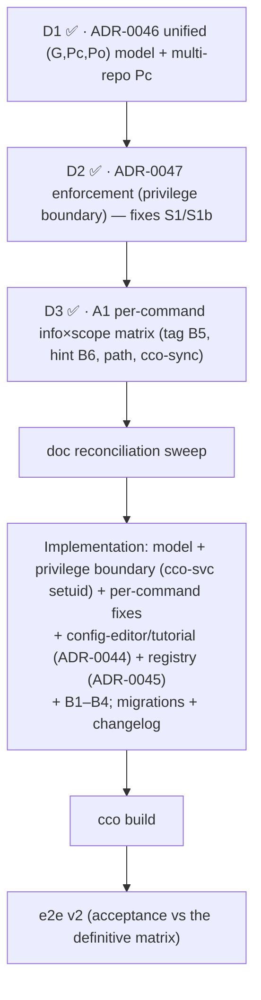

# Pre-revalidation backlog — agent ↔ cco access

> **Status**: Open (2026-07-06). Working backlog of items to resolve **before** the
> e2e re-validation (handoff v2) of the access fixes. Populated from a maintainer
> working session reviewing the shipped fixes on `feat/config-access/e2e-review`.
>
> **Purpose**: nothing spotted between the fix workstream and the re-validation is
> lost. Each item is classified *pre-review fix* (must land before revalidation) or
> *design item* (needs an ADR/design pass, may or may not block). Items that land as
> fixes become **acceptance rows** in the handoff v2 checklist.
>
> **Feeds**: the CLI-surface matrix (`../../../cli/reference/cli-surface-matrix.md`) and
> `handoff.md` v2.
>
> **⚠ Scope expanded (2026-07-08).** A maintainer design review turned this from a small
> pre-review bug list into a **design workstream**: a unified `(G,Pc,Po)` permission model
> (covers the missing asymmetric cases) + a **confidentiality-bypass security fix** (S1/S1b,
> §7). The definitive design is driven by
> **the hardening-v2 D1→D2→D3 design** (ADR-0046/0047 + the A1 matrix). That
> handoff is now the **master plan**; this file remains the item tracker. Design lands +
> is implemented **before** the e2e v2.

---

## 1. Confirmed decisions (maintainer, 2026-07-06)

- **D-CE1 — config-editor default scope flip.** `cco start config-editor` no longer
  defaults to `edit-all`. New model (least-privilege by default; the risky broad scope
  is explicit opt-in):
  - cwd **is** a project → default **edit-project**: mount `~/.cco` + **that cwd
    project's** `<repo>/.cco`.
  - cwd is **not** a project → default **global-only**: mount `~/.cco` only, no project
    trees (option **b**, chosen over an "are-you-sure" prompt — cco widens access via
    explicit flags, not interactive prompts).
  - `--all` / `--cco-access edit-all` → `~/.cco` + **all** resolvable projects' `.cco`
    (explicit consent, the old default).
  - `--project <name>` (repeatable) → `~/.cco` + that project's `.cco` (+ its repos,
    ADR-0042 §8 repo-aware authoring).
  - **Subtle note to document**: for config-editor, "edit-project scope" means *the cwd
    project's `.cco`*, which is **≠ the started project** (the started project is always
    `config-editor`; D9 / `CCO_CONFIG_TARGETS`). For a normal session the started
    project and the cwd project coincide; for config-editor they do not. This asymmetry
    must be called out in the ADR refinement and the matrix.
  - **Requires**: a refinement of **ADR-0042 §8 D2** (supersedes the "bare config-editor
    = broad/edit-all" decision), reconciled with the "config-editor is not cwd-based"
    argument (resolution: cwd is a *convenience default* for which project to scope,
    always overridable by `--project`/`--all`). Must land **before** revalidation.

- **D-CE2 — reference-first ordering.** Write the CLI-surface matrix + formalized CLI
  docs **before** the handoff v2; author the handoff once the work is clear and can
  reference the matrix.

## 2. Resolved (2026-07-07) — now in ADR-0044

- **O-TUT1 / config-editor / two-regime principle → decided and documented in
  [ADR-0044](../decisions/0044-internal-builtin-presets-and-config-editor-scope.md).**
  - **Two regimes**: standard projects follow the uniform minimum-privilege model;
    internal built-ins (tutorial, config-editor) are *special sessions with their own
    motivated preset rules*, discriminated by **read-only vs write**.
  - **tutorial → `read-all` hardcoded** (read-only teacher: full context, no write risk,
    config not sensitive, defense-in-depth via proxy+network). `--cco-access` available
    but discouraged.
  - **config-editor → minimum-privilege default** (cwd-project `edit-project`, or
    global-only `edit-global` outside a project); `--all`/`edit-all` is the explicit
    broad widener. *started-project (`config-editor`) ≠ scoped cwd-config-project.*
  - Living design updated: [`../design.md`](../design.md) §8. ADR-0042 §8 forward-annotated.

## 3. Pre-review fixes (must land before revalidation)

> **Status (2026-07-10)**: **all landed.** **B5** (tag gate-by-axis) + **B6** (no-silent-exit-2)
> shipped in S2 Phase III. **B1** (whoami in operator help), **B2** (suppress empty help sections),
> **B3** (`cco list` STATUS column + `--sort status`), **B4** (in-container `unknown`, never a false
> `stopped`) shipped in **S3 Phase V** (2026-07-10, commits `f08bbf2`/`6fefa85`; see "Implementation
> progress" below). Sibling hunts done (B2 pruner is general; B-DF2 was the sole `read … 2>/dev/null`
> prompt-eater).

| ID | Area | Symptom | Hypothesised root | Proposed fix | Class |
|----|------|---------|-------------------|--------------|-------|
| **B1** | help | `cco whoami` is missing from in-container `cco help`/usage | `whoami` added (F4) but `usage()` (`bin/cco` help-render, ~L116-215) not updated to list it in the operator-filtered help | Add `whoami` to the runnable-verb set rendered in operator-mode usage | help/CLI |
| **B2** | help | In-container help prints **empty section titles** when all verbs in a section are host-only and filtered out (D7) | The D7 filter removes the host-only verbs but leaves the section header with no body | Suppress a section header when it has zero runnable verbs at the current scope | help/CLI |
| **B3** | list | `cco list` (generic) shows no running status for projects, while `cco list project` does | Status column only implemented in the per-kind `cco list project` path (`cmd-project-query.sh:49-56`), not in the unified `cco list` project rows | Render status for the `project` kind in the unified `cco list` too (other kinds have no state → blank) | consistency |
| **B4** | status | In-container, a second project already running in **another host terminal** is reported `stopped` (false negative) | `_cco_session_running` (`lib/utils.sh:141`) uses `docker ps --filter label=cco.project`. In-container this is scoped by the **cco-docker-proxy to the session's own container** (isolation, by design) and/or the socket may be unmounted (`mount_socket:false`) → the other project is invisible | **Minimal correct fix**: in container-operator context, never assert `stopped` when docker visibility is scoped/absent — degrade to **`unknown` / `n-a (in-container)`** (aligns with the "hidden ≠ absent" philosophy). Do **not** fabricate a false negative | status/CLI |
| **B5** | tag/gating | `cco tag add/remove` gated as a blanket `write:global` — **both too strict** (can't tag the current project at `edit-project`) **and too loose** (can tag *other* projects at `edit-global`) | Shim hardcodes one level; tags target **pack/project/template** (different scopes; storage in the global DATA registry is irrelevant to the permission — `lib/tags.sh`) | Gate **per-invocation by the tagged resource's axis** (current project → `Pc=rw`; global pack/template → `G=rw`; other project → `Po=rw`). The exemplar of "gate by resource area, not a fixed level" — **✅ refined in A1 (D3), [`analysis/A1-command-scope-matrix.md`](analysis/A1-command-scope-matrix.md) §4.1** | gating/CLI |
| **B6** | help/exit | Not every exit-2 refusal carries a reason; the matrix only annotated the hint on start/stop | Convention not stated as an invariant | **Hint invariant**: every exit-2 refusal states its cause (host-only *or* insufficient scope); exit-1 = unknown verb/error. Audit no silent exit-2 path exists | help/CLI |

> **Hunt for same-class siblings** while fixing B1–B4 (other empty-section/host-only
> help artifacts; other unified-vs-per-kind `list` drifts; other in-container false
> negatives from proxy-scoped docker). Add anything found here.

## 4. Design items

- **DI1 — machine-wide "running sessions" awareness → XDG_STATE registry. ✅ DONE (S3 Phase V,
  2026-07-10, commits `95eb8b5`/`0b8f295`).** Built as designed, with one reconciliation forced by
  ADR-0047 (which postdates this item): the registry mounts `:ro` **under the cco-svc privileged
  root** (`/var/lib/cco-internal/state/cco/running`), NOT a claude-readable mount — marker filenames
  are project names (S1-confidential), so a readable mount would re-open the leak. In-container it is
  read only inside the elevated `cco __store list/show`, still visibility-gated by `_env_in_scope`
  (ADR-0045 §2 intent preserved; ADR-0045 forward-annotated). Lifecycle does **not** depend on `cco
  stop` (B-DF3): the blocking `cco start` owns the marker (mark pre-run, unmark post-run) and
  host-side reconciliation is the primary reaper. The original design follows.** The correct model for cco. The docker proxy filters
  `docker ps` in-container to the session's own container (AI-security, must stay); that
  is the **wrong layer** to govern the CLI's project-visibility. Right layer =
  **cco_access output-scoping** (a session's knowledge of *other* projects is already a
  cco_access concern). Design:
  - A **host-maintained running registry under XDG_STATE** (keyed by the `cco.project`
    label R1 introduced), written by `cco start`/`stop`, **liveness-reconciled** host-side
    against `docker ps` (prunes stale markers after a crash). Mounted **ro** into sessions
    (the dir, so host start/stop events reflect near-live in-container).
  - In-container, `cco list`/`project show` read running status from the registry, and its
    **cross-project visibility is gated by the same `lib/access-scope.sh` layer** (read-project
    → current only; read-global/all → others). One model, proxy untouched, security intact.
  - **Rejected**: a dedicated unfiltered docker path for the CLI (option b) — reintroduces
    the very unfiltered-daemon surface the proxy exists to remove, and cco-in-container is
    agent-invokable. Avoided.
  - **B4** (§3) is the interim honest fallback (`unknown`, no false `stopped`) and remains
    correct even after DI1 lands (for sessions where the registry is absent/stale).
  - **✅ Design done (2026-07-07)**:
    [ADR-0045](../../../environment/decisions/0045-session-running-registry.md)
    (STATE `running/` registry, host-written on start/stop, host-reconciled vs docker, ro
    mount, in-container visibility gated by `lib/access-scope.sh`; unfiltered-docker path
    rejected). Build in the pre-review phase.

- **DI2 — the `-ne 0` negative-space sweep in `tests/` (follow-up to RC-17, cycle 1).** RC-17's
  static ban (`test_invariants.sh` invariant 11) closes the **"not 2"** idiom as a class — any
  rc-shaped identifier, `-ne` or `!=`, sigil or not, either operand order. It does **not** close
  the negative-space *family*. The sibling terminal idiom "assert the command failed somehow"
  (`-ne 0`) is one exit code over and is **already widespread: 46 rc-shaped negative comparisons
  live in `tests/` today**, including `test_paths.sh:254`, `test_llms.sh:365`,
  `test_start_decentralized.sh:71`, `test_update.sh:1230,1256` and
  `test_access_resolution.sh:166,425,467,580,593`.

  Several are genuinely weak in the RC-17 way — "invalid `cco_access` should abort" passes on a
  `die` (rc=1) *or* a policy refusal (rc=2), which are **different behaviours** with different
  contracts (§5.2 of the cycle-1 overview: 1 = error, 2 = refused by policy). Most of the rest
  are host-side argument-validation guards where the distinction does not currently hide a
  defect.

  **Deliberately out of cycle-1 scope** (D-M3): converting 46 sites is its own change with its
  own review, and folding it into the keystone would have made the lane's diff unreviewable.
  Recorded here rather than assumed, because a scope limit that lives only in a review comment
  is indistinguishable from an oversight. When it runs: classify each site as *error* vs
  *refusal*, convert to `assert_rc` / `assert_refused`, then extend invariant 11's pattern to
  `0` and re-run — the pattern is already parameterised by the compared value.

## 5. Documentation tasks (reference-first, D-CE2)

- **DOC1 — central-gate documentation. ✅ DONE (2026-07-07).**
  [`design-cli-environment-awareness.md`](../../../cli/design/design-cli-environment-awareness.md)
  §4 now states the **single central pre-command gate** property (`_cco_operator_shim`
  runs before the dispatcher; default-deny; unified preventive protection) + rationale +
  the permissions-vs-command-guards division + the mis-classification residual. v1.3.0.
- **DOC2 — CLI-surface matrix. ✅ DONE (2026-07-07).**
  [`cli/reference/cli-surface-matrix.md`](../../../cli/reference/cli-surface-matrix.md):
  verb × {host, in-container} × cco_access, monotonic "available-from" form, output-scoping
  table (ADR-0043 §3), help scope-awareness, preset defaults (ADR-0044), orthogonal
  `claude_access` note. Derived from `_cco_operator_shim`; ⏳-target rows flag
  approved-but-unshipped behaviour (ADR-0044 + B1–B4) for the e2e v2 acceptance oracle.
- **DOC3 — ADR-0044 + living design. ✅ DONE (2026-07-07).**
  [ADR-0044](../decisions/0044-internal-builtin-presets-and-config-editor-scope.md) (two
  regimes + config-editor scope + tutorial read-all); [`../design.md`](../design.md) §8
  rewritten; ADR-0042 §8 forward-annotated.
- **DOC4 — living-doc reconciliation to ADR-0046/0047. ✅ DONE (2026-07-08).** Post-D2
  4-way audit + fixes: `design.md` §4 invariant-label disambiguation; `design-cli-environment-awareness.md`
  + `cli-surface-matrix.md` ADR-0046/0047 refs + INV-D "presentation-filter" → defense-in-depth;
  `design-security-model.md` new **HIGH-6** (S1/S1b) + ADR-0047 mitigation. Audit found **no
  today-contradictions** in shipped-behavior docs.
- **DOC5 — shipped-doc cutover checklist. ✅ DONE (2026-07-11, commit `3b947ad`)** — all six docs
  below rewritten to the shipped `(G,Pc,Po)` + boundary truth (repo `CLAUDE.md`, `cli.md`,
  `project-yaml.md`, `docker-and-networking.md`, config-editor/tutorial guides); config-editor
  preset documented as min-privilege (edit-global default / edit-all with `--all`), tutorial as
  read-all. The original checklist follows for the record.
  When ADR-0046/0047 land in code, update these shipped-behavior docs (all currently correct for
  the enum model):
  1. **repo `CLAUDE.md`** "Session access" ¶ — enum → `(G,Pc,Po)` triple + presets-as-sugar +
     granular `global=…,current=…,others=…`; `edit-global` **redefined** `(rw,ro,none)`→`(rw,rw,none)`;
     output-scoping → defense-in-depth, enforcement = privilege boundary (ADR-0047).
  2. **`docs/users/reference/cli.md`** "Session access" block — replace the level enum table with
     the triple + a 7-intent matrix (cases 6&7 granular-only); note the privilege-boundary enforcement.
  3. **`docs/users/configuration/reference/project-yaml.md`** `access.cco` row — scalar **or**
     `{global,current,others}` map; new optional `access.cco.include_member_configs` (bool, default false).
  4. **`docs/users/environment/guides/docker-and-networking.md`** config-mount ¶ — `:ro`/`:rw`
     remains for config-content; internal store confined by the boundary.
  5. **`docs/users/internal-projects/guides/{config-editor,tutorial}.md`** — restate preset triples
     (config-editor `edit-all=(rw,rw,rw)`; tutorial `read-all=(ro,ro,ro)`) + the boundary.
  - **Optional now (maintainer's call)**: a single non-invasive forward-pointer line in the repo
    `CLAUDE.md` + `cli.md` "Session access" sections ("planned evolution: ADR-0046 model + ADR-0047
    enforcement, not yet implemented") — additive, non-rewriting; not yet applied.

## 7. Design workstream + security (2026-07-08) — driven by hardening-v2

Confirmed by the maintainer; formalized by the hardening-v2 D1→D2→D3 design (ADR-0046/0047 + the A1 matrix).

- **M1 — unified `(G,Pc,Po)` permission model (D1). ✅ DESIGN DONE (2026-07-08) —
  [ADR-0046](../decisions/0046-unified-cco-access-model.md).** Three axes each `none<ro<rw`
  (G = global-store non-referenced portion; referenced packs/llms always ride with Pc);
  invariants `rw⇒ro`, `Pc≥ro`, `Po≠none⇒Pc≠none`, **`Po≤Pc`** + auto-promotion of unspecified
  axes. The 6 named levels survive as a **symmetric ladder** of sugar (asymmetry granular-only;
  **`edit-global` redefined to `(rw,rw,none)`** — includes project write); cases **6 & 7**
  (`(ro,rw,rw)` / `(rw,ro,ro)`) + curate-global-only `(rw,ro,none)` are granular-only via a
  `{global,current,others}` map. **Multi-repo Pc**: default cwd `<repo>/.cco`; opt-in
  `access.cco.include_member_configs` extends Pc to all member `.cco` (divergent incl.);
  **agent `cco sync` of divergent members = host-only** (in-container config-editor sync
  deferred to D3/A1). Living design `../design.md` §4 rewritten; ADR-0043 §1 + CLI-surface
  matrix §1/§5 forward-annotated. → **D2 next.**
- **S1 — cross-scope confidentiality leak (SECURITY, CONFIRMED).** STATE index + whole DATA
  bucket mounted unscoped → an agent at read-project can `cat` them and enumerate all
  projects' names/host-paths/membership/tags/remote-URLs, bypassing `access-scope.sh`
  (which filters only command output). Root: agent + cco share UID, no FS confinement.
- **S1b — `show_host_paths` bypass (SECURITY, CONFIRMED).** Host paths readable via the
  mounted index even at `show_host_paths=off`. Same root as S1.
- **M2 — enforcement architecture (D2). ✅ DESIGN DONE (2026-07-08) —
  [ADR-0047](../decisions/0047-config-access-enforcement.md).** Not a broker: confine only the
  **internal store** behind a **privilege boundary** — a dedicated `cco-svc`-owned mode-0700
  real-FS parent (`/var/lib/cco-internal`) the `claude` user cannot traverse, crossed by a setuid
  helper enforcing `(G,Pc,Po)`. No daemon/protocol/duplication; config-content trees stay mounted.
  Grounded in a macOS-Docker-Desktop `fakeowner` test (chown/chmod can't confine bind content;
  real-FS parent traversal can). Options A (scoped ro projection) + B (socket broker) rejected/
  fallback. Forward-annotates ADR-0043 INV-D; design.md INV-5 + design-docker.md §1.2.3. → **D3
  next.**
- **A1 — per-command info×scope analysis (D3). ✅ DESIGN DONE (2026-07-08, awaiting maintainer
  approval) — [`analysis/A1-command-scope-matrix.md`](analysis/A1-command-scope-matrix.md).**
  Every verb classified on two orthogonal axes: **enforcement side** (config-content mount /
  internal-store helper / environment-host) and **resource area** (`(G,Pc,Po)` axis × read/write,
  keyed off ADR-0046 §7). The shim's hardcoded per-verb level literals (`bin/cco:301-368`) are
  replaced by a **gate-by-resource-area** derivation (target tree → axis, per-invocation for
  `tag`, static for the rest). Decisions resolved: **B5** — `tag` gated by the *tagged
  resource's* axis (project→`Pc`/`Po`, pack/template→`G` uniformly, not ride-with-`Pc`);
  **B6** — hint invariant asserted (no silent exit-2; audited clean, must hold post-refactor);
  **`path`** — keep `path list`, **scope its output** (current+referenced, host paths gated by
  `show_host_paths`), `path set` host-only; **`cco sync` of divergent members = host-only,
  config-editor included** (closes ADR-0046 §6; `include_member_configs` covers the read/edit
  need); **coverage** — no `cco state`, `whoami` extended to render the `(G,Pc,Po)` triple at
  implementation. Consolidated fix list (B1–B6 + `path` + `whoami+`) + ⏳ CLI-surface matrix row
  updates in §5/§6. **Gate: maintainer approval → doc-reconciliation sweep → implementation.**

### Implementation progress

- **S1 Phase I — model `(G,Pc,Po)` (ADR-0046). ✅ DONE (2026-07-09)** on
  `feat/config-access/e2e-review`, 5 atomic commits (`ec56f9f` resolver + per-axis
  read-visibility; `f78ae54` resolution → triple + granular/map parse +
  auto-promotion + invariant rejection; `c8a476f` consumers off the triple —
  mount-gen/shim/help/whoami, `edit-global`=(rw,rw,none) unlocks A1, exports
  `CCO_ACCESS_TRIPLE`; `566d660` access.cco map schema + `include_member_configs`;
  `274723e` doc status). Suite **1147 → 1169/0** (+22 tests), no migration. Branch
  **NOT pushed** (push both branches from the Mac). **Deferred**: the §6 multi-repo
  Pc mount-narrowing — the flag is plumbed/read/documented, but the hosting-vs-member
  `:ro` narrowing is a follow-up (DEFERRED note in `_start_generate_compose`; today
  every mounted repo's `.cco` follows Pc, == the flag's `true` span, additive +
  non-regressive). Re-open with the multi-repo mount rework or in e2e v2.
- **S1 Phase II — privilege boundary (ADR-0047). ✅ CODE DONE (2026-07-09)** on
  `feat/config-access/e2e-review`, 6 atomic commits (`3d77c8d` Dockerfile: `cco-svc`
  uid + setuid C helper + `/var/lib/cco-internal` 0700; `427d95c` entrypoint lock-first
  + XDG symlinks; `80aec06` paths.sh ensure-skip under the root in operator mode;
  `6983d41` trampoline + `_cco_verb_touches_store` classifier + helper marker; `3e4ee40`
  cmd-start `:ro` session descriptor + internal mounts under the root, whole+rw per §4;
  `81f191d` `tests/test_privilege_boundary.sh`) **+ dogfood fix `98de9b1`**. Architecture:
  TRAMPOLINE — the outer claude cco `exec`s the setuid helper for store-touching verbs;
  the helper reads the trusted `:ro` descriptor, sanitizes env (injects the descriptor
  triple, marks elevated), and execs `bash -p /opt/cco/bin/cco __store <verb>` as cco-svc;
  `__store` re-runs the shim (authoritative gate, descriptor triple) + dispatches the real
  verb with Phase-I output-scoping. Suite **1169 → 1174/0**. **Dogfood #1 on Mac
  (2026-07-09)**: boundary CONFIRMED — `cat ~/.local/state/cco/index` → EACCES (S1/S1b
  closed); a helper `setgroups` EPERM bug (setuid-to-non-root has no CAP_SETGID; bash
  euid≠ruid self-resets) was fixed in `98de9b1` (euid-only elevation + `bash -p`, staying
  within ADR-0047 §2 "not root"). **▶ maintainer check-in** (ADR-0047 §8 Test B) still
  pending after the re-build. Branch NOT pushed.
- **S2 (Phase III+IV) ✅ DONE (2026-07-09)** — 7 commits `1b4ec02`→`c0f5dbe` (B5/B6, path scoping,
  whoami+, ADR-0044 presets).
- **S3 Phase V ✅ DONE (2026-07-10)** — running registry (ADR-0045/DI1) + B1–B4 + B-DF2, 5 commits
  `95eb8b5` (E core: helpers + tri-state `_cco_session_status` + `:ro` mount under the ADR-0047
  boundary + `cco start`-owned lifecycle/reconcile reaper per B-DF3 + `test_running_registry.sh`),
  `f08bbf2` (B4 display + B3 STATUS column + `--sort status`), `6fefa85` (B1 whoami + B2 empty-section
  pruner), `fed84e6` (B-DF2 init prompt), `0b8f295` (ADR-0045 fwd-annot). Suite **1197/7** (7 =
  pre-existing §6.2 in-container artifacts).
- **S3 Phase VI (REBUILD)** — ✅ DONE in-session (2026-07-11), 4 commits `6436665` (changelog #37),
  `67ad13f` (config-editor project mode → `edit-global` fix + tests), `3b947ad` (DOC5 cutover),
  `9f179b4` (CLI-surface ⏳ cleared + `design-docker.md` `running/` mount + ADR-0044 §3 annotation).
  Migrations **verified none needed** (additive/code-only — schema stays project 014/global 016).
  Suite **1197/7**. **Remaining on the Mac: `cco build` → e2e v2 acceptance; push both branches.**

### Unified implementation review I–IV (2026-07-10) — findings

Driven by the unified Phases I–IV implementation review over
`ec56f9f^..HEAD`. Three confirmed fixes landed on `feat/config-access/e2e-review`; one
assess item deferred. Fasi I & II clean (resolver invariants + privilege boundary sound
statically; Linux write-path correctly documented as an open follow-up). Suite baseline held
(the only in-container failures are the documented §6.2 env artifacts).

- **F1 — `CCO_CONFIG_TARGETS` never emitted (ALTA). ✅ FIXED `7f06be7`.** `_ce_targets`/
  `_ce_repos` were `local` to `_start_resolve_project`, so the sibling
  `_start_generate_compose` saw them empty → the D9 signal (env + the ADR-0047 R2 session
  descriptor) was silently blank, neutering the config-editor ownership predicate
  (`_env_is_current_project`, B5): a `config-editor --project X` (edit-project, Po=none)
  session could not tag/show its own target. Root pre-existed B2's D9 wiring, but the new
  B5/whoami/descriptor code depended on it. Hoisted the vars to `cmd_start` scope; regression
  tests added. Empirically verified via dry-run (`CCO_CONFIG_TARGETS=myproj` now emitted).
- **F2 — `_env_in_scope` ignored `CCO_CONFIG_TARGETS` (MEDIA; = the §4 config-editor assess
  item). ✅ FIXED `9b4f27d`.** The `project`/owner branches keyed off bare `PROJECT_NAME`
  instead of `_env_is_current_project`, so even after F1 a config-editor target stayed hidden
  from `list project`/`project show`/`validate`/`coords`. Now uses the same ownership
  predicate as the B5 write gate (ADR-0046 §7 current→Pc; ADR-0044 D9). No change for normal
  sessions. Unit test added.
- **F3 — hidden-notice pointed to the wrong widening (BASSA). ✅ FIXED `eac219c`.** `cco path
  list`'s count-only notice said "start a read-global session", but hidden entries are OTHER
  projects, visible only at Po≥ro = read-**all** (A1 §2.2). Corrected to read-all; the shared
  `_env_flush_hidden_notice` now names both widenings. Test locks in the hint.
- **F4 — config-editor mode vs collector may disagree (BASSA, ASSESS — ✅ CLOSED/FIXED 2026-07-10).**
  An explicit `--cco-access edit-project|edit-global` that contradicts the cwd-derived
  `config_editor_mode` made the preset default (via the CLI override) and the target
  collector resolve different scopes. The outcome is always **narrower** (fail-safe), never a
  privilege escalation — e.g. `config-editor --cco-access edit-project` outside any project
  yielded edit-project scope with no project targets mounted (an effectively **empty** session,
  silently). Re-assessment confirmed **no correctness/security impact**; the single real symptom
  was the silent inert session. **Fix (fail-loud guard, `_start_guard_config_editor_scope`,
  `lib/cmd-start.sh`)**: a config-editor session whose resolved triple is `edit-project`
  (`G=none, Pc=rw, Po=none` — the current project is the ONLY writable axis) but for which the
  collector resolved **zero** targets now `die`s with actionable guidance (cd into a project /
  `--project <name>` / `--cco-access edit-global`) instead of launching inert. Chosen over the
  two backlog options (a: align mode to the flag — only relabels; b: reject any `--cco-access ≠
  edit-all` — too blunt, breaks legit `edit-project` *inside* a project and read-level narrowing):
  the guard targets exactly the incoherent state, no false positives (the preset never emits
  edit-project without a target; `edit-global` keeps `G=rw` on `~/.cco`, so it is NOT guarded).
  Tests in `tests/test_config_editor.sh` (die-outside-project, positive with `--project`,
  read-level narrowing stays valid).
- **DOC-NIT (folded into F3).** The generic multi-kind notice shared the same imprecise
  "read-global" wording; updated alongside F3.

**Post-`cco build` dogfood (2026-07-10) — fixes CONFIRMED live in the rebuilt image.** In a
`read-project` operator session: the Phase-II boundary holds (`cat ~/.local/state/cco/index` →
EACCES; `/var/lib/cco-internal` is `0700 cco-svc`; helper `4750 cco-svc:claude`); the trampoline
elevates store-touching verbs (`cco list` / `cco tag add` reach the store via the setuid helper);
`cco whoami` renders the `(G,Pc,Po)` triple + the enforcement note; refusal taxonomy correct
(`tag add <current-project>` → exit 2 "needs Pc=rw" [B5 detected kind+ownership against the real
store]; `cco start` → host-only; `cco list templates` → above-scope, all with reasons). **F3
verified live**: `cco path list` → "start a **read-all** session"; the generic `cco list` notice →
"read-global (read-all to also see other projects)". F1/F2 are config-editor-specific — verified
via host dry-run (CCO_CONFIG_TARGETS emitted) + unit tests; a full config-editor `--project`
live-dogfood needs a host `cco start config-editor --project <name>` session (recommended before
merge).

### Dogfood-found bugs (pre-merge / pre-e2e — NOT hardening-v2 scope)

- **B-DF1 — ✅ FIXED 2026-07-16 (`8ae2a12`)**, on `fix/cli/project-show-container-paths` (from
  `develop`; **not pushed** — push from the Mac). Re-surfaced by the maintainer host session that
  also produced FI-21/22/23 (see "2026-07-16 triage" below), which independently re-derived this
  entry's own prescription. Shipped as written here — probe at `/workspace/<repo_name>` for the
  `-d` badge **and** the role/`_project_member_status` path — via `_cco_member_probe_path`
  (`lib/paths.sh`), applied in the query-layer callers that still hold the member NAME.
  `lib/index.sh` deliberately **untouched**: its other callers are the host-only verbs
  (`join`/`forget`/`rename`), which must keep receiving the real host path to act on.
  This entry's closing suspicion — *"same index-host-path pattern may affect other in-container
  read verbs"* — was **confirmed and generalised**: a host-path-hygiene sibling (both views
  printed the index host path ignoring `show_host_paths`, INV-4) sat in the very same functions
  and is fixed in the same commit, and the class now has a checklist item + rule
  ([design-cli-environment-awareness §4c/§5.3b](../../../cli/design/design-cli-environment-awareness.md)),
  since F1 and B-DF1 are one defect with two different remedies. 6 tests; the role test fails on
  the pre-fix code with the exact mislabel. Suite 1305/9 (+6 passing; the 9 = the FI-19
  boundary artifacts). **Acceptance still needs `cco build`** — a live session runs the
  image-baked cco (`project show` is a store verb and trampolines through the setuid helper), so
  this fix is NOT observable in-session until the image is rebuilt.

  *Original report (2026-07-09, dogfood #2) — kept verbatim; its line numbers predate the
  intervening refactors (`:184`→`:211`, `index.sh:302`→`:762`, `:146`→`:177`):*
  **`cco project show` reports mounted repos as `[missing]`/`code-only` in-container.**
  `cmd_project_show`
  (`lib/cmd-project-query.sh`) resolves each member's path via `_effective_repo_mounts`
  → the STATE **index HOST path** (e.g. `/Users/alessandro/.../cave-flow`), then tests
  `[[ -d "$repo_path" ]]` (`:184`) and `_project_member_role` → `_project_member_status`
  (`-d host_path`, `index.sh:302`). **In-container the host path does not exist** — the
  repo is bind-mounted at `/workspace/<repo_name>` — so every member is mislabelled
  `[missing]` + `code-only` + "N reference(s) unresolved", though `ls /workspace/<name>`
  shows it resolved. The project.yml resolution IS already operator-aware (`:146`), but
  the **member-repo existence/role detection is NOT**. Fix (future): in operator mode,
  check presence at `/workspace/<repo_name>` (where `cco start` mounts each repo), not the
  index host path — for the `-d` badge AND `_project_member_status`. Not a security issue;
  a UX/correctness bug surfaced by the Phase-II dogfood. Same index-host-path pattern may
  affect other in-container read verbs that existence-check member repos.

- **B-DF2 — `cco init` (no `--migrate`) name prompt is invisible; the command looks hung**
  (found 2026-07-09, maintainer first-run). `_cco_init_resolve_name` (`lib/cmd-init.sh:335`)
  runs `read -rp "  Project name [$base]: " name < /dev/tty 2>/dev/null`. Bash writes the
  `read -p` **prompt to stderr**; the `2>/dev/null` (added to swallow a read error) also
  **swallows the prompt**, so the user sees nothing while `read` blocks on `/dev/tty` — the
  command appears frozen, then resumes once a name is typed + Enter. The sibling **language**
  prompts (`:148-152`) omit `2>/dev/null` and render correctly (proving the diagnosis).
  **Fix (Phase V, folded like B-DF1):** print the prompt explicitly to the tty
  (`printf '  Project name [%s]: ' "$base" > /dev/tty; read -r name < /dev/tty`) or drop the
  `2>/dev/null`. Not security; first-run UX. **Hunt siblings** — any other `read … 2>/dev/null`
  whose prompt is eaten.

- **B-DF3 (registry lifecycle input for Phase V / ADR-0045) — normal exit is NOT `cco stop`;
  reconciliation must be the primary reaper.** In practice `cco stop` is ~never invoked:
  exiting Claude Code ends the `docker compose run --rm` container (auto-removed) and drops
  back to the host shell — no explicit stop. So a `<state>/cco/running/<project>` marker written
  by `cco start` has **no writer to remove it on normal exit**, and — post-Phase-II — the
  container **cannot** write/remove it anyway (`running/` lives in STATE, behind the ADR-0047
  boundary; writers are host-side only). **ADR-0045 already covers this**: the marker is
  *advisory*, `docker ps` is the source of truth, and the **host-side liveness reconciliation**
  (run on any host read: `cco list`/`project show`/`start`/`stop`) **reaps stale markers**
  (ADR-0045 §"self-healing, bounded staleness after an unclean exit"). Phase-V requirements this
  observation sharpens: (1) treat reconciliation as the **primary** cleanup, not `cco stop`
  (which is the rare path); (2) ensure `cco start` runs a reconciliation **sweep** so a fresh
  session's list is accurate despite prior no-stop exits; (3) the `running/` dir sits under the
  privileged root — arrange its **host-side writes + the `:ro` in-container mount** accordingly;
  (4) **verify a normal `--rm` exit leaves no other stale index/state/metadata** (today: `--rm`
  removes the container, entrypoint `trap _cleanup EXIT` reaps bg procs, generated compose is
  CACHE/STATE — the marker is the only new artifact to get right). Do **not** design marker
  cleanup around an exit-time `cco stop`.

### 2026-07-16 triage — maintainer host session (pre-e2e)

A maintainer host session (repo rename → `cco path list` → `cco resolve`, partly run against the
**npm-released** cco by mistake) raised four points, triaged against one question: *does it affect
the e2e review's results, or the release the review gates?*

| Raised | Verdict | Where it went |
|---|---|---|
| `project show` marks a mounted+resolved repo `[missing]`, and the name appears twice | **Fix now** — it is **B-DF1**, a known open pre-merge item, and a sibling of the F1 the CLI-surface review already fixed. Leaving it would spend a review cycle re-finding a known bug. | ✅ fixed `8ae2a12` (see above) |
| Per-project name scoping leaves rename / `path set` / `path list` / by-name lookups without a deliberate scope UX | **Defer** — the [e2e handoff §9](handoff.md) already excludes "broader naming semantics (ADR-0051, disambiguation prompts)" from this acceptance. Not a regression: `rename`'s *semantics* are correct (path-anchored, D1) and its cwd default is right; what is missing is explicit scope selection (`--project`/`--all-projects`) and the ban on silent first-match. | [FI-21](../../../roadmap-backlog.md#fi-21-explicit-project-scope-on-the-host-path-surface-post-adr-0051-completeness) |
| An older cco silently misreads/rewrites newer internal state (no version gate) | **Defer** — the e2e runs a **single** binary (the image-baked one), so the mixed-version scenario cannot arise in it. Pre-existing note, now with a design. | [FI-16](../../../roadmap-backlog.md#fi-16-fail-loud-state-guards-for-mixed-cco-versions) (updated) |
| Validation / doctor / repair for broken or mixed-format internal files | **Defer** — largely closed upstream by FI-16's gate; `cco config validate --fix` is the existing vehicle. | [FI-22](../../../roadmap-backlog.md#fi-22-internal-state-validation-doctor-and-repair) |
| *(found while triaging)* legacy extra_mounts migrate into the index `unscoped:` bucket → a de-facto global default ADR-0051 D2 rejected | **Defer** — self-healing (`cco resolve` re-binds per project; a project's own binding wins). Live on the maintainer's machine; explains the "messy" `path list` view. | [FI-23](../../../roadmap-backlog.md#fi-23-extra_mount-legacy-bindings-land-in-the-unscoped-bucket-adr-0051-migration-residue) |

**For the reviewer**: FI-21/22/23 are **known and deliberately out of scope** — do not re-report
them. FI-21/22/23 all touch the index model and must be **scoped together** before any one is
designed (see the backlog's re-verify-the-bound convention). What B-DF1 leaves for the run:
`cco build`, then confirm `project show` in a live session (it is unobservable before the
rebuild — a store verb trampolines into the baked cco).

### Updated sequencing

- Each **design** sub-phase runs in its own clean session (see the hardening-v2 handoff),
  with **maintainer approval gates** between them.
- The DOC1/DOC2/DOC3 references (§5) and ADR-0044/0045 were produced **this session** as the
  base the design phases build on. The old "matrix-then-config-editor-then-handoff-v2"
  sequence (superseded) assumed no model/security redesign; it is folded into the phases
  above.
- `cco build` + the e2e run happen on the Mac (image-baked fixes need a rebuild).

### Cycle-2 residue — recorded at cycle-1 close (2026-07-20)

Cycle 1 (RC-1/RC-6/RC-2/RC-3/RC-4/RC-17 + docs) shipped code-complete on
`fix/config-access/e2e-v2-cycle1` (suite 1414/9). Per **D-M3/D-M7** the following are
**deferred to cycle 2** and must **not** be re-discovered by the re-review — they are known,
triaged, and out of cycle-1 scope:

- **RC-5 full sweep + RC-7…RC-16** — the D-M2 three-state vocabulary is ratified and cycle 1
  emits it at the sites it already touches; the sweep across `access-scope.sh`
  (`_env_require_visible`), `cmd-project-query.sh` and every other verb that invents a third
  answer is cycle 2, together with RC-7 (`/etc/cco/policy.json` agent-readable, criterion B-S1b),
  RC-8…RC-16. Full table: `results/consolidated-review.md` §3 / `fix-design-v2/00-overview.md` §10.
- **Q-10 provenance-writer conversion** — `pack`/`template install|update|import|internalize`,
  `llms install|update`, `_record_tree_as_base`, `_meta_record_provenance` are **not** on
  `lib/store.sh`'s cascade layer yet; cycle 1 gave them a fail-fast `_store_provenance_guard`, so
  `pack install` is a clean in-container refusal until they convert.
- **Q-15 — the unscoped `dummy-repo` seed** (`tests/helpers.sh`). The shared fixture seeds
  `dummy-repo` **unscoped**, and `_index_get_path`'s unscoped fallback answers for any scope, so a
  few tests pass on otherwise-broken code. RC-6 routed around it (unseeded name + 3-arg scoped
  form); converting the shared seed to scoped touches most of the suite — cycle 2.
- **The `-ne 0` negative-space sweep (DI2, §4 above)** — RC-17 banned negative-**only** `rc -ne 2`
  terminal assertions; the sibling `-ne 0` "the command failed somehow" idiom is 46 rc-shaped
  comparisons still on the tree. Cycle 2 (`fix-design-v2/01-test-lane.md` §3.5).
- **`LLMS_DIR` taint-set minor (RC-3 §6.5 lint)** — the INV-S6 CLASS lint (`test_invariants.sh`)
  taints the confined-bucket resolvers but omits the module-global `LLMS_DIR`; direct
  `$(_cco_llms_dir)` forms **are** caught, so this is a hardening gap, not a live bypass. Cycle 2.
- **`cmd-resolve.sh` INV-F.3 asserted-shape exemption (04 §6.7)** — `cmd-resolve.sh` is
  deliberately absent from `test_invariant_index_resolver_host_only`'s `deny` list (it defines the
  host/operator dispatcher and hosts the host-only `cco resolve`). A robust asserted
  operator-branch-shape exemption over its six heterogeneous call sites needs control-flow
  analysis and is too brittle for a lint; documented in-place at the test, tracked here for cycle 2.

**Explicitly NOT residue** (do not file): **Q-12** — closed in cycle 1 by **D-M11** (the
config-editor target mount root's `readonly:` follows `Pc`); **Q-11** — a §3.8 no-op, the real
INV-S5 over-elevation was already closed by RC-2's D-M4 de-elevation (the residual whole-verb
elevation covers only the STATE index re-key, which §3.8 keeps as a primitive).
