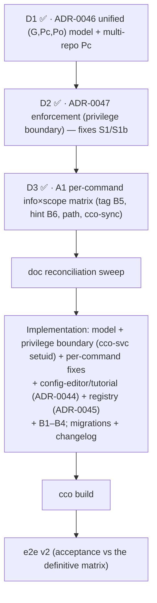

# Pre-revalidation backlog — agent ↔ cco access

> **Status**: Open (2026-07-06). Working backlog of items to resolve **before** the
> e2e re-validation (handoff v2) of the access fixes. Populated from a maintainer
> working session reviewing the shipped fixes on `feat/config-access/e2e-review`.
>
> **Purpose**: nothing spotted between the fix workstream and the re-validation is
> lost. Each item is classified *pre-review fix* (must land before revalidation) or
> *design item* (needs an ADR/design pass, may or may not block). Items that land as
> fixes become **acceptance rows** in the handoff v2 checklist.
>
> **Feeds**: the CLI-surface matrix (`../../../cli/reference/cli-surface-matrix.md`) and
> `handoff.md` v2.
>
> **⚠ Scope expanded (2026-07-08).** A maintainer design review turned this from a small
> pre-review bug list into a **design workstream**: a unified `(G,Pc,Po)` permission model
> (covers the missing asymmetric cases) + a **confidentiality-bypass security fix** (S1/S1b,
> §7). The definitive design is driven by
> **[`../hardening-v2/handoff.md`](../hardening-v2/handoff.md)** (phases D1→D2→D3). That
> handoff is now the **master plan**; this file remains the item tracker. Design lands +
> is implemented **before** the e2e v2.

---

## 1. Confirmed decisions (maintainer, 2026-07-06)

- **D-CE1 — config-editor default scope flip.** `cco start config-editor` no longer
  defaults to `edit-all`. New model (least-privilege by default; the risky broad scope
  is explicit opt-in):
  - cwd **is** a project → default **edit-project**: mount `~/.cco` + **that cwd
    project's** `<repo>/.cco`.
  - cwd is **not** a project → default **global-only**: mount `~/.cco` only, no project
    trees (option **b**, chosen over an "are-you-sure" prompt — cco widens access via
    explicit flags, not interactive prompts).
  - `--all` / `--cco-access edit-all` → `~/.cco` + **all** resolvable projects' `.cco`
    (explicit consent, the old default).
  - `--project <name>` (repeatable) → `~/.cco` + that project's `.cco` (+ its repos,
    ADR-0042 §8 repo-aware authoring).
  - **Subtle note to document**: for config-editor, "edit-project scope" means *the cwd
    project's `.cco`*, which is **≠ the started project** (the started project is always
    `config-editor`; D9 / `CCO_CONFIG_TARGETS`). For a normal session the started
    project and the cwd project coincide; for config-editor they do not. This asymmetry
    must be called out in the ADR refinement and the matrix.
  - **Requires**: a refinement of **ADR-0042 §8 D2** (supersedes the "bare config-editor
    = broad/edit-all" decision), reconciled with the "config-editor is not cwd-based"
    argument (resolution: cwd is a *convenience default* for which project to scope,
    always overridable by `--project`/`--all`). Must land **before** revalidation.

- **D-CE2 — reference-first ordering.** Write the CLI-surface matrix + formalized CLI
  docs **before** the handoff v2; author the handoff once the work is clear and can
  reference the matrix.

## 2. Resolved (2026-07-07) — now in ADR-0044

- **O-TUT1 / config-editor / two-regime principle → decided and documented in
  [ADR-0044](../decisions/0044-internal-builtin-presets-and-config-editor-scope.md).**
  - **Two regimes**: standard projects follow the uniform minimum-privilege model;
    internal built-ins (tutorial, config-editor) are *special sessions with their own
    motivated preset rules*, discriminated by **read-only vs write**.
  - **tutorial → `read-all` hardcoded** (read-only teacher: full context, no write risk,
    config not sensitive, defense-in-depth via proxy+network). `--cco-access` available
    but discouraged.
  - **config-editor → minimum-privilege default** (cwd-project `edit-project`, or
    global-only `edit-global` outside a project); `--all`/`edit-all` is the explicit
    broad widener. *started-project (`config-editor`) ≠ scoped cwd-config-project.*
  - Living design updated: [`../design.md`](../design.md) §8. ADR-0042 §8 forward-annotated.

## 3. Pre-review fixes (must land before revalidation)

| ID | Area | Symptom | Hypothesised root | Proposed fix | Class |
|----|------|---------|-------------------|--------------|-------|
| **B1** | help | `cco whoami` is missing from in-container `cco help`/usage | `whoami` added (F4) but `usage()` (`bin/cco` help-render, ~L116-215) not updated to list it in the operator-filtered help | Add `whoami` to the runnable-verb set rendered in operator-mode usage | help/CLI |
| **B2** | help | In-container help prints **empty section titles** when all verbs in a section are host-only and filtered out (D7) | The D7 filter removes the host-only verbs but leaves the section header with no body | Suppress a section header when it has zero runnable verbs at the current scope | help/CLI |
| **B3** | list | `cco list` (generic) shows no running status for projects, while `cco list project` does | Status column only implemented in the per-kind `cco list project` path (`cmd-project-query.sh:49-56`), not in the unified `cco list` project rows | Render status for the `project` kind in the unified `cco list` too (other kinds have no state → blank) | consistency |
| **B4** | status | In-container, a second project already running in **another host terminal** is reported `stopped` (false negative) | `_cco_session_running` (`lib/utils.sh:141`) uses `docker ps --filter label=cco.project`. In-container this is scoped by the **cco-docker-proxy to the session's own container** (isolation, by design) and/or the socket may be unmounted (`mount_socket:false`) → the other project is invisible | **Minimal correct fix**: in container-operator context, never assert `stopped` when docker visibility is scoped/absent — degrade to **`unknown` / `n-a (in-container)`** (aligns with the "hidden ≠ absent" philosophy). Do **not** fabricate a false negative | status/CLI |
| **B5** | tag/gating | `cco tag add/remove` gated as a blanket `write:global` — **both too strict** (can't tag the current project at `edit-project`) **and too loose** (can tag *other* projects at `edit-global`) | Shim hardcodes one level; tags target **pack/project/template** (different scopes; storage in the global DATA registry is irrelevant to the permission — `lib/tags.sh`) | Gate **per-invocation by the tagged resource's axis** (current project → `Pc=rw`; global pack/template → `G=rw`; other project → `Po=rw`). The exemplar of "gate by resource area, not a fixed level" — **✅ refined in A1 (D3), [`analysis/A1-command-scope-matrix.md`](analysis/A1-command-scope-matrix.md) §4.1** | gating/CLI |
| **B6** | help/exit | Not every exit-2 refusal carries a reason; the matrix only annotated the hint on start/stop | Convention not stated as an invariant | **Hint invariant**: every exit-2 refusal states its cause (host-only *or* insufficient scope); exit-1 = unknown verb/error. Audit no silent exit-2 path exists | help/CLI |

> **Hunt for same-class siblings** while fixing B1–B4 (other empty-section/host-only
> help artifacts; other unified-vs-per-kind `list` drifts; other in-container false
> negatives from proxy-scoped docker). Add anything found here.

## 4. Design items

- **DI1 — machine-wide "running sessions" awareness → XDG_STATE registry (decided
  2026-07-07: build pre-review).** The correct model for cco. The docker proxy filters
  `docker ps` in-container to the session's own container (AI-security, must stay); that
  is the **wrong layer** to govern the CLI's project-visibility. Right layer =
  **cco_access output-scoping** (a session's knowledge of *other* projects is already a
  cco_access concern). Design:
  - A **host-maintained running registry under XDG_STATE** (keyed by the `cco.project`
    label R1 introduced), written by `cco start`/`stop`, **liveness-reconciled** host-side
    against `docker ps` (prunes stale markers after a crash). Mounted **ro** into sessions
    (the dir, so host start/stop events reflect near-live in-container).
  - In-container, `cco list`/`project show` read running status from the registry, and its
    **cross-project visibility is gated by the same `lib/access-scope.sh` layer** (read-project
    → current only; read-global/all → others). One model, proxy untouched, security intact.
  - **Rejected**: a dedicated unfiltered docker path for the CLI (option b) — reintroduces
    the very unfiltered-daemon surface the proxy exists to remove, and cco-in-container is
    agent-invokable. Avoided.
  - **B4** (§3) is the interim honest fallback (`unknown`, no false `stopped`) and remains
    correct even after DI1 lands (for sessions where the registry is absent/stale).
  - **✅ Design done (2026-07-07)**:
    [ADR-0045](../../../environment/decisions/0045-session-running-registry.md)
    (STATE `running/` registry, host-written on start/stop, host-reconciled vs docker, ro
    mount, in-container visibility gated by `lib/access-scope.sh`; unfiltered-docker path
    rejected). Build in the pre-review phase.

## 5. Documentation tasks (reference-first, D-CE2)

- **DOC1 — central-gate documentation. ✅ DONE (2026-07-07).**
  [`design-cli-environment-awareness.md`](../../../cli/design/design-cli-environment-awareness.md)
  §4 now states the **single central pre-command gate** property (`_cco_operator_shim`
  runs before the dispatcher; default-deny; unified preventive protection) + rationale +
  the permissions-vs-command-guards division + the mis-classification residual. v1.3.0.
- **DOC2 — CLI-surface matrix. ✅ DONE (2026-07-07).**
  [`cli/reference/cli-surface-matrix.md`](../../../cli/reference/cli-surface-matrix.md):
  verb × {host, in-container} × cco_access, monotonic "available-from" form, output-scoping
  table (ADR-0043 §3), help scope-awareness, preset defaults (ADR-0044), orthogonal
  `claude_access` note. Derived from `_cco_operator_shim`; ⏳-target rows flag
  approved-but-unshipped behaviour (ADR-0044 + B1–B4) for the e2e v2 acceptance oracle.
- **DOC3 — ADR-0044 + living design. ✅ DONE (2026-07-07).**
  [ADR-0044](../decisions/0044-internal-builtin-presets-and-config-editor-scope.md) (two
  regimes + config-editor scope + tutorial read-all); [`../design.md`](../design.md) §8
  rewritten; ADR-0042 §8 forward-annotated.
- **DOC4 — living-doc reconciliation to ADR-0046/0047. ✅ DONE (2026-07-08).** Post-D2
  4-way audit + fixes: `design.md` §4 invariant-label disambiguation; `design-cli-environment-awareness.md`
  + `cli-surface-matrix.md` ADR-0046/0047 refs + INV-D "presentation-filter" → defense-in-depth;
  `design-security-model.md` new **HIGH-6** (S1/S1b) + ADR-0047 mitigation. Audit found **no
  today-contradictions** in shipped-behavior docs.
- **DOC5 — shipped-doc cutover checklist (⏳ DO AT IMPLEMENTATION, NOT before — lifecycle rule).**
  When ADR-0046/0047 land in code, update these shipped-behavior docs (all currently correct for
  the enum model):
  1. **repo `CLAUDE.md`** "Session access" ¶ — enum → `(G,Pc,Po)` triple + presets-as-sugar +
     granular `global=…,current=…,others=…`; `edit-global` **redefined** `(rw,ro,none)`→`(rw,rw,none)`;
     output-scoping → defense-in-depth, enforcement = privilege boundary (ADR-0047).
  2. **`docs/users/reference/cli.md`** "Session access" block — replace the level enum table with
     the triple + a 7-intent matrix (cases 6&7 granular-only); note the privilege-boundary enforcement.
  3. **`docs/users/configuration/reference/project-yaml.md`** `access.cco` row — scalar **or**
     `{global,current,others}` map; new optional `access.cco.include_member_configs` (bool, default false).
  4. **`docs/users/environment/guides/docker-and-networking.md`** config-mount ¶ — `:ro`/`:rw`
     remains for config-content; internal store confined by the boundary.
  5. **`docs/users/internal-projects/guides/{config-editor,tutorial}.md`** — restate preset triples
     (config-editor `edit-all=(rw,rw,rw)`; tutorial `read-all=(ro,ro,ro)`) + the boundary.
  - **Optional now (maintainer's call)**: a single non-invasive forward-pointer line in the repo
    `CLAUDE.md` + `cli.md` "Session access" sections ("planned evolution: ADR-0046 model + ADR-0047
    enforcement, not yet implemented") — additive, non-rewriting; not yet applied.

## 7. Design workstream + security (2026-07-08) — driven by hardening-v2

Confirmed by the maintainer; formalized by **[`../hardening-v2/handoff.md`](../hardening-v2/handoff.md)** (phases D1→D2→D3).

- **M1 — unified `(G,Pc,Po)` permission model (D1). ✅ DESIGN DONE (2026-07-08) —
  [ADR-0046](../decisions/0046-unified-cco-access-model.md).** Three axes each `none<ro<rw`
  (G = global-store non-referenced portion; referenced packs/llms always ride with Pc);
  invariants `rw⇒ro`, `Pc≥ro`, `Po≠none⇒Pc≠none`, **`Po≤Pc`** + auto-promotion of unspecified
  axes. The 6 named levels survive as a **symmetric ladder** of sugar (asymmetry granular-only;
  **`edit-global` redefined to `(rw,rw,none)`** — includes project write); cases **6 & 7**
  (`(ro,rw,rw)` / `(rw,ro,ro)`) + curate-global-only `(rw,ro,none)` are granular-only via a
  `{global,current,others}` map. **Multi-repo Pc**: default cwd `<repo>/.cco`; opt-in
  `access.cco.include_member_configs` extends Pc to all member `.cco` (divergent incl.);
  **agent `cco sync` of divergent members = host-only** (in-container config-editor sync
  deferred to D3/A1). Living design `../design.md` §4 rewritten; ADR-0043 §1 + CLI-surface
  matrix §1/§5 forward-annotated. → **D2 next.**
- **S1 — cross-scope confidentiality leak (SECURITY, CONFIRMED).** STATE index + whole DATA
  bucket mounted unscoped → an agent at read-project can `cat` them and enumerate all
  projects' names/host-paths/membership/tags/remote-URLs, bypassing `access-scope.sh`
  (which filters only command output). Root: agent + cco share UID, no FS confinement.
- **S1b — `show_host_paths` bypass (SECURITY, CONFIRMED).** Host paths readable via the
  mounted index even at `show_host_paths=off`. Same root as S1.
- **M2 — enforcement architecture (D2). ✅ DESIGN DONE (2026-07-08) —
  [ADR-0047](../decisions/0047-config-access-enforcement.md).** Not a broker: confine only the
  **internal store** behind a **privilege boundary** — a dedicated `cco-svc`-owned mode-0700
  real-FS parent (`/var/lib/cco-internal`) the `claude` user cannot traverse, crossed by a setuid
  helper enforcing `(G,Pc,Po)`. No daemon/protocol/duplication; config-content trees stay mounted.
  Grounded in a macOS-Docker-Desktop `fakeowner` test (chown/chmod can't confine bind content;
  real-FS parent traversal can). Options A (scoped ro projection) + B (socket broker) rejected/
  fallback. Forward-annotates ADR-0043 INV-D; design.md INV-5 + design-docker.md §1.2.3. → **D3
  next.**
- **A1 — per-command info×scope analysis (D3). ✅ DESIGN DONE (2026-07-08, awaiting maintainer
  approval) — [`analysis/A1-command-scope-matrix.md`](analysis/A1-command-scope-matrix.md).**
  Every verb classified on two orthogonal axes: **enforcement side** (config-content mount /
  internal-store helper / environment-host) and **resource area** (`(G,Pc,Po)` axis × read/write,
  keyed off ADR-0046 §7). The shim's hardcoded per-verb level literals (`bin/cco:301-368`) are
  replaced by a **gate-by-resource-area** derivation (target tree → axis, per-invocation for
  `tag`, static for the rest). Decisions resolved: **B5** — `tag` gated by the *tagged
  resource's* axis (project→`Pc`/`Po`, pack/template→`G` uniformly, not ride-with-`Pc`);
  **B6** — hint invariant asserted (no silent exit-2; audited clean, must hold post-refactor);
  **`path`** — keep `path list`, **scope its output** (current+referenced, host paths gated by
  `show_host_paths`), `path set` host-only; **`cco sync` of divergent members = host-only,
  config-editor included** (closes ADR-0046 §6; `include_member_configs` covers the read/edit
  need); **coverage** — no `cco state`, `whoami` extended to render the `(G,Pc,Po)` triple at
  implementation. Consolidated fix list (B1–B6 + `path` + `whoami+`) + ⏳ CLI-surface matrix row
  updates in §5/§6. **Gate: maintainer approval → doc-reconciliation sweep → implementation.**

### Implementation progress

- **S1 Phase I — model `(G,Pc,Po)` (ADR-0046). ✅ DONE (2026-07-09)** on
  `feat/config-access/e2e-review`, 5 atomic commits (`ec56f9f` resolver + per-axis
  read-visibility; `f78ae54` resolution → triple + granular/map parse +
  auto-promotion + invariant rejection; `c8a476f` consumers off the triple —
  mount-gen/shim/help/whoami, `edit-global`=(rw,rw,none) unlocks A1, exports
  `CCO_ACCESS_TRIPLE`; `566d660` access.cco map schema + `include_member_configs`;
  `274723e` doc status). Suite **1147 → 1169/0** (+22 tests), no migration. Branch
  **NOT pushed** (push both branches from the Mac). **Deferred**: the §6 multi-repo
  Pc mount-narrowing — the flag is plumbed/read/documented, but the hosting-vs-member
  `:ro` narrowing is a follow-up (DEFERRED note in `_start_generate_compose`; today
  every mounted repo's `.cco` follows Pc, == the flag's `true` span, additive +
  non-regressive). Re-open with the multi-repo mount rework or in e2e v2.
- **S1 Phase II — privilege boundary (ADR-0047). ▶ NEXT** (REBUILD; not
  in-session-verifiable; **maintainer check-in after**). Kickoff:
  [`../hardening-v2/phase-II-kickoff.md`](../hardening-v2/phase-II-kickoff.md).
- **S2 (Phase III+IV), S3 (Phase V+VI)** — pending, per the implementation handoff.

### Updated sequencing

- Each **design** sub-phase runs in its own clean session (see the hardening-v2 handoff),
  with **maintainer approval gates** between them.
- The DOC1/DOC2/DOC3 references (§5) and ADR-0044/0045 were produced **this session** as the
  base the design phases build on. The old "matrix-then-config-editor-then-handoff-v2"
  sequence (superseded) assumed no model/security redesign; it is folded into the phases
  above.
- `cco build` + the e2e run happen on the Mac (image-baked fixes need a rebuild).
