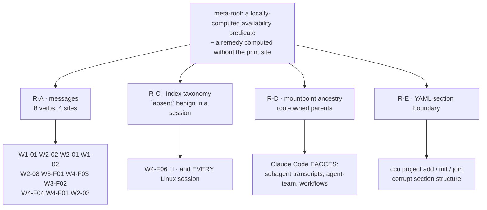

# Agent ↔ cco access — v3.1 acceptance re-review, consolidated verdict

> **Verdict: NOT ACCEPTED.** Three 🔴 against criterion **C**, plus two blocking roots found during
> consolidation that no session could see. **Everything cycle-1.1 set out to fix holds live** — the
> enforcement layer, the store write path and the privilege boundary were probed hard from four
> vantages and did not move. Every product finding this round sits in the **message / rendering /
> composition** layer, and they collapse to **one meta-root**: three subsystems that never got an
> invariant. The release is gated on **cycle-1.2**, scoped in §6 and sequenced in
> [`../../../../handoff.md`](../../../../handoff.md).
>
> Run: 2026-07-28, 4 sessions (W1…W4) + the §11 host probe. Inputs: `/review-v3.1/W{1..4}-*.md`,
> `host-verifications.md`. Image: `develop@8fd479c`, host-confirmed. Gate: `develop → main`.

---

## 1. Sessions and coverage

| Session | Shape | Triple | Report |
|---|---|---|---|
| **W1** | `claude-orchestrator` @ `edit-project` | `G=none Pc=rw Po=none` | `W1-rename-editproject.md` |
| **W2** | `config-editor --all` (+ a `(rw,ro,none)` follow-up) | `G=rw Pc=rw Po=rw` | `W2-ce-broad.md` |
| **W3** | `config-editor --project cave-auth` @ granular `current=ro` | `G=rw Pc=ro Po=none` | `W3-escalation.md` |
| **W4** | `stai-sicuro` (3 extra_mounts) @ `read-project` | `G=none Pc=ro Po=none` | `W4-readpath.md` |
| **§11** | host probe, Docker named volume (real Linux DAC) | — | `host-verifications.md` |

**Provenance (criterion E) — PASS.** All four sessions reported `image built from: develop@8fd479c`,
equal to the host's `git rev-parse --short HEAD`. Per the 2026-07-26 note the expected value is
develop's tip at build time, not a pinned sha. The findings are attributable.

**Not run as specified**: the V5b bare-global sub-run (see **W2-07** / §9), and §10.9e / E6B-04 — the
pack-rename fan-out scratch procedure, still never executed in any round.

---

## 2. What cycle-1.1 claimed, and what holds

Every claim §0 put under test was observed from its listed vantage. **Nothing regressed.**

| Claim | Verdict | Carried by |
|---|---|---|
| **S1** — STATE crosses as a directory; in-container index + sidecar writes land | ✅ **HOLDS** | W1 (rename, both stores), W2 (`pack create`/`remove` observable in both surfaces) |
| **S2 / S2b / S2b-P** — a write that cannot be performed fails loudly, never prints `✓` | ✅ **HOLDS** | W1, W2, W3 — no `✓`-at-exit-0-with-no-change anywhere in the round |
| **S3** — rename refused before Phase 1 when a store is unwritable | ⚠ **UNFALSIFIABLE on macOS** | W1 (`chmod 500` + `mktemp` succeeded → `fakeowner`) — carried to §11 |
| **S5 / D-V3-1** — `remote remove\|rename` refuse exit 2 + host hint; `remote add` works | ✅ **HOLDS** | W1, W2, W3, W4 (all four) |
| **S6 / R4** — `project show` and `validate` answer availability with one voice | ✅ **HOLDS** | W3, W4 — byte-identical, same exit code (the classifier's *content* is R-A's subject; its *unification* works) |
| **S7 / R6** — config-editor announces every drop | ✅ **HOLDS** | W2 (host `cco start` output, correct `unresolved` branch, with the host qualifier) |
| **S7 / decision (b)** — a target's `extra_mounts` are never mounted | ✅ **HOLDS** (not-mounted half) | W2 (7/7 absent), W3 (`/proc/self/mountinfo` carries no trace) |
| **S8 / V1-F2** — `project show` lists extra_mounts by logical name | ✅ **HOLDS** (named arm) | W4 (3/3, cross-checked against `/proc/mounts`) |
| **S8 / V4-F-V4-03** — a projects-only hidden set offers `read-all` | ✅ **HOLDS** (both arms) | W4 (projects-only *and* mixed), W2 + W3 (second and third access levels) |
| **S8 / V1-F3** — provenance discoverable and correct | ✅ **HOLDS** | all four |
| **S4 / R3** — an unreadable/truncated index is reported as such | 🔴 **DIAGNOSTIC ARM FAILS** | W4 (§10.9d) — see **R-C** |
| **D-M11** — granular `current=ro` mounts the target honestly read-only | ✅ **HOLDS — fails CLOSED** | W3 (root, 3 nested depths, existing files, **and a second bind of the same inode**), W2 (independent, different target) |
| **RC-4 / RC-1 / RC-6 / ADR-0047 boundary / secret masking** | ✅ **HOLD** | all four; raw store reads `EACCES` in every session, 9/9 `secrets.env` bound 0-byte `ro` at `edit-all` |

**Two results deserve to be called out**, because they are stronger than the criteria asked for:

- **W3 extended criterion D beyond its spec.** `/proc/self/mountinfo` showed the target's `.cco` is
  reachable by **two** independent paths (`44:36417` — the config-editor target mount *and* the
  nested `.cco` of the mounted code repo). Both carry the `Pc` axis. Had D-M11's guard been applied
  only to the config-editor mount, the repo path would have been an escalation vector. It is not.
- **W1's rename round trip was confirmed from two other sessions** that never ran it (W2's `--all`
  vantage, forward *and* back), across index, `project.yml` and `coords`. The R1 root — a `✓` at
  exit 0 with an untouched store — is **closed**.

---

## 3. The meta-root: three subsystems without an invariant

Twenty-four raw findings (1 🔴 · 13 🟠 · 10 🟡) deduplicate to **8 product defects**, and every one of
them is the same proposition:

> **cco renders "I cannot see X from here" as "X is not there", and computes the remedy without
> regard to where the message is printed.**

Its mirror image is in the round too: **W2-06 / W4-F02**, a correct exit rendered as a crash. After
S2 taught this codebase that a `✓` must not survive a failure, an `✗` that survives a *correct*
refusal is the same defect read backwards.

**Why it keeps recurring is structural, not a matter of care.** cco has met this class three times
before and beaten it three times, always the same way — an invariant plus a static lint:

| Layer | Invariant | Outcome |
|---|---|---|
| store writes | INV-S1…S6 + CLASS lint (`tests/test_invariants.sh`) | held under `edit-all` probing, W2/W3 |
| index writers | INV-IDX | held |
| interactivity gate | `test_invariant_tty_gate_single_spelling` | held |
| **availability vocabulary / rendering** | **none** | **eight divergent sites** |
| **mountpoint ancestry** | INV-MP — scoped to `/workspace/.claude` only | **recurs, see R-D** |
| **YAML section editing** | **none** | **see R-E** |

The three layers that fail are exactly the three without an invariant. Consequently each cycle has
fixed **the reported site** and left its siblings — S7's own lesson (*"a fix at a site that cannot
execute is indistinguishable from a fix"*) turned one notch: **a fix at one of several sites that
*can* execute is indistinguishable from a complete fix until you look at the others.** W1 and W2
reached this conclusion independently.



**The corollary that sets cycle-1.2's shape**: fixing the eight findings one at a time reproduces the
failure. The unit of work is **the invariant plus its lint**, and the findings close as a
consequence.

---

## 4. Root map

### Release-blocking

| Root | Findings | Summary | Sites |
|---|---|---|---|
| **R-A** — no single availability vocabulary; every verb hand-rolls the predicate | W1-01, W2-02, W2-01, W1-02, W2-08, W3-F01, W4-F03, W3-F02, W4-F04, W2-03 | Four distinct symptoms from one absence: (1) `project show`'s member branch is a **two-way** `[[ -d probe ]]` test that never calls `_env_member_state`, so a not-mounted member renders `[missing]` + the retired `cco resolve` remedy — which is refused exit 2 in the same session; (2) the shared refusal offers **`read-global`** for a **project**, the level ADR-0043 defines as revealing no project — found independently by **all four sessions**; (3) the `project` family has no *unknown* arm, so a typo is answered *"it exists on this machine"*; (4) `project coords` answers store-wide from a 1-of-10 view at exit 0 with no hidden notice, where its siblings refuse at exit 2. | `cmd-project-query.sh:249-253`; `access-scope.sh:688`, `:785`; `cmd-project-query.sh` (coords lane); `cmd-pack.sh` (validate remedy) |
| **R-B** — a hidden set that cannot be enumerated is not counted | W4-F01 | `cco list packs` prints a bare header, no rows, **no notice**, rc=0, while 6 packs exist — inverting INV-B on the one kind that has no count. **The session reports diagnose this as "packs are not wired into the scope layer"; that is wrong**: `cmd-pack.sh:116` does call `_env_note_hidden pack` and `:134` flushes. The real cause is that at `G=none` **`~/.cco` is not mounted at all**, so the enumeration loop never iterates and there is nothing to count. `llms` behaves correctly only because it enumerates from CACHE, which is mounted regardless of `G`. **You cannot count what you cannot enumerate** — the count must come from the elevated side, not from a mounted directory. | `cmd-pack.sh:110-134`; `cmd-start.sh` CONFIG mount at `G=none` |
| **R-C** — the index-health taxonomy has no session-vs-host axis | W4-F06 🔴 | `_index_health` classifies four states with **`absent` as the only benign one** (`index.sh:104-131`). A session is *launched from* the index, so in-container `absent` can only mean the bind broke or host state was destroyed — it is **never** benign there. With the index moved aside under a live session, `path list` answered *"the path index is empty — nothing is registered on this machine yet"* at **rc=0**, and `project show` rendered a **fabricated** card: three bound, readable mounts badged `[unresolved]`, the repo's host path silently degraded to its container path. `stale` (nlink 0) does not catch it either — that arm was designed against the pre-S1 **file** bind; S1's directory bind presents a host-side `mv` as plain `absent`. **This is also the default state of every session on native Linux** — see §5. | `lib/index.sh:104-131`, `:171-180`; `cmd-project-query.sh` (`[unresolved]` marker) |
| **R-D** — mountpoint ancestors materialised by the runtime are root-owned (INV-MP is scoped too narrowly) | *found in consolidation* | See §7.1. Blocks Claude Code's own runtime writes; reproduced live on macOS. | `Dockerfile:127`; `cmd-start.sh:1793-1796` |
| **R-E** — the YAML section-boundary spelling swallows the next section's comment header | *found by the maintainer* | See §7.2. Corrupts `project.yml` structure on four verbs. | `cmd-project-add.sh:70-75` |
| **R-F** — the functional-write floor was derived from one known path, not from the documented set | *found in consolidation* | See §7.1. `claude_access` clamps paths Claude Code needs for runtime state. | `cmd-start.sh:1743-1789` (ADR-0049 §5) |

### Non-blocking, cosmetic or pre-existing

| Root | Findings | Disposition |
|---|---|---|
| **R-G** — the EXIT trap fires on paths that exit without the completion sentinel | W2-06, W4-F02 | **Blocking by exception**: arm 2 fires on the **host**, on a well-formed INV-2 refusal, on the default path a user hits when mistyping `--cco-access`. `bin/cco:8` vs `_cco_completed` (`:534,541,542,568,711`). Small fix + a lint that no early exit skips the sentinel. |
| **R-H** — index hygiene / rendering residue | W1-04, W2-05, W3-F04 | Deferred → **FI-33 · FI-34 · FI-35** |
| **R-I** — post-rename cwd derivation is stale | W1-03 | Deferred → **FI-36**. Narrow (post-rename, pre-restart), non-destructive, and V3-P's info note warns about the state that creates it. |
| **R-J** — taxonomy / handoff defects, not product | W2-04, W1-05, W2-07 | W2-04 settled by **D-V31-2** (§6); W1-05 and W2-07 are handoff corrections (§9). |

---

## 5. §11 — the Linux write path, and what the probe actually proves

The host probe returned **`EACCES`** on a Docker named volume (real Linux DAC inside the VM):

```
docker run --rm --entrypoint /usr/local/bin/gosu -v cco-linux-probe:/probe \
  claude-orchestrator:latest cco-svc sh -c 'touch /probe/shared/x && echo WRITABLE || echo EACCES'
touch: cannot touch '/probe/shared/x': Permission denied
```

This is **not a new discovery** — the roadmap predicted it from the code on 2026-07-21 (`cco-svc` is
uid 900; the internal-store binds have host sources; the entrypoint deliberately does not chown the
bind children). The probe converts a code-grounded prediction into an observation.

**What the session reports missed, and this consolidation adds: the exposure is wider than "writes".**
The host buckets are created **mode 0700** by `_cco_ensure_dir` (`paths.sh:448-451`, `umask 077`) and
owned by the host user. Inside the container `cco-svc` is neither owner nor group:

| Path | Mechanism | Result on native Linux |
|---|---|---|
| **writes** | `_store_probe` tests `-r`/`-x` on the bucket (`store.sh:210`) → `reach unreachable` → `die` exit 1, *"nothing was changed"* | ✅ **fails closed, honestly** |
| **reads** | `_index_health` does `[[ -e "$f" ]]` (`index.sh:130`); without search permission on the parent the stat fails → **`absent`** → the only benign state | 🔴 **lies**: *"nothing is registered on this machine yet"* at rc=0, in **every** session |

So **R-C is not a macOS edge case — on Linux it is the default experience of every session.** That
raises its priority, and it means the same fix serves both: giving the taxonomy its session-vs-host
axis converts Linux from *silently wrong* to *honestly refusing*, which is the precondition for
stating a verified platform in the release notes at all.

**Decision (unchanged in substance, re-grounded): criterion F is signed off as macOS-verified**, with
the Linux write path carried explicitly as open — a deliberate re-scoping of a gate previously
classified blocking, recorded here rather than allowed to lapse. **The Linux fix is an ADR, not a
patch**: the conflict is structural — the agent's uid must equal the host user's (or it cannot write
the repos), the store content is owned by that same uid, and the elevated identity must **not** be
that uid. The candidate resolutions (a dedicated host group + setgid dirs + the gid joined in the
entrypoint; POSIX ACLs granting uid 900; or dropping the boundary on Linux, a security regression)
all imply host-side setup and belong in cycle-2.

⚠ **The README contradicts itself today** and must be corrected before the release regardless:
`README.md:59` says Linux is *"functional but not yet thoroughly tested"*, `README.md:220` says
*"Linux | Fully supported | All features except macOS-specific Keychain and iTerm2"*. The table is
stale (it does not even carry the OAuth caveat stated 160 lines above).

---

## 6. Decisions ratified by this review

Confirmed with the maintainer, 2026-07-28. Each is anchored to a rule the project already committed
to, so none is a fresh preference.

### D-V31-1 — hidden vs nonexistent: reword to non-asserting, add the `unknown` arm **only at read scope `all`**

W2-01 (the classifier has complete information at `edit-all` and still says *"it exists on this
machine"*) and W3-F05 (distinguishing would make `project show` an existence oracle) are both right,
on **different axes** — and the discriminating axis already exists. ADR-0043 makes behaviour a
function of read scope, with `_cco_level_read_scope` as the single source:

- read scope **`all`** → nothing can be hidden by construction → the *unknown* arm is safe **and
  owed** (no oracle: the session would see the resource anyway).
- read scope **`project` / `global`** → one non-disclosing sentence, **reworded so it asserts
  nothing**: *"no project 'X' is available at this access scope …"*, never *"it exists on this
  machine, but …"*.

Closes W2-01, W3-F05 and W4's open note without introducing a new concept, and makes the managed rule
(*"A hidden resource is not a missing one"*) true of the code for the first time.

### D-V31-2 — a pre-flight refusal in a session is **exit 2**; INV-S3b's text is amended

INV-S3b already states the rule in `lib/store.sh`'s header: *"A pre-flight refusal in a SESSION is a
session-SHAPE condition, knowable in advance → refuse, exit 2."* `pack rename`'s fan-out guard is
exactly that — knowable in advance, nothing written, remedy *"run it on the host"* — so by INV-S3b's
own words it is a **2**, not the **1** W2-04 observed. The parenthetical that appears to scope row 1
to *"the bucket is not bound"* is an **example**, not the discriminator; the axis is
*pre-flight-vs-write × session-vs-host*, **not which store**. INV-S3b's text is amended to state the
axis without the example, because it has now been misread three times. V3-03's exit **1** stays out
of this: a *usage* fact, fixable where it is printed, is a different lane.

### D-V31-3 — config-editor's dropped `extra_mounts` are **badged in the message**; the managed rule stays as defense-in-depth

The governing precedent is ADR-0047 itself: when correctness depended on output scoping, the project
chose a **real boundary** and demoted `access-scope.sh` to defense-in-depth — **mechanism before
prose**. Making legibility depend on a rule in prose depends on every future reader having it loaded,
and §12 names exactly that as a failure class (*"a message that reads correct and strands the
reader"*). `cco project show` badges them `[not mounted in this session]`, in the existing
vocabulary; `internal/config-editor/.claude/CLAUDE.md` keeps its rule.

### D-V31-4 — criterion **C** keeps its literal reading; a release exception is written down, never inferred

The project's own testing rule — *"when a test fails, question the implementation first; do not
adjust the test so failing code passes"* — applies to acceptance criteria too. Re-reading a criterion
to exclude a defect **because it is old** is that same move in review clothing. The pattern the
project already uses is §11's for criterion F: sign off explicitly, carry the exception explicitly,
in writing.

**Consequence:** **W1-01 / W2-02** (criterion C's *"the 'not mounted in this session' vocabulary is
used wherever it applies"*) and **W4-F01** (*"hidden ≠ absent — count-only notices"*) are **🔴**, not
🟠 — regardless of being pre-existing. With the maintainer's decision to fix at the root, both are in
cycle-1.2 anyway; what the decision protects is the precedent that criteria are not reinterpreted to
fit a verdict.

---

## 7. Two blocking roots found during consolidation

Neither is visible to any review session, and neither is visible to the hermetic suite. Both were
reproduced against the shipped image.

### 7.1 R-D + R-F — Claude Code cannot write parts of its own state

Reported by the maintainer as `EACCES` affecting **subagent / agent-team transcripts and
communication** and **workflow persistence**. Two independent causes; the first was reproduced live
in a container running `develop@8fd479c`:

**R-D — `~/.claude/projects` is `root:root 0755`.**

```
drwxr-xr-x 3 root root 4096 /home/claude/.claude/projects
touch: cannot touch '/home/claude/.claude/projects/.wprobe': Permission denied
```

cco binds `~/.claude/projects/-workspace` (transcripts) and `.../memory` (`cmd-start.sh:1793-1796`).
The **parent** `projects/` does not exist in the image, so the container runtime materialises it as
`root:root 0755`: `claude` can traverse and read it, and **cannot create inside it**.

This is **R1's mechanism in a third subsystem** (v3's STATE bucket was the first, FI-31/ADR-0054 the
second), and the decisive detail is that **the Dockerfile already documents the rule** it violates —
lines 119-124 state that a missing base dir is auto-created *"as a root-owned mount point — blocking
any sibling from being created by claude"*, and pre-create `.local/bin`, `.local/share`,
`.local/state`, `.cache` and `.claude` accordingly. `.claude/projects` — where cco nests a bind — was
not added. **The reasoning was written down and applied to one path instead of to the class**: §3's
meta-root, in the mount layer.

*Symptom mapping.* Claude Code writes transcripts to `~/.claude/projects/<key-derived-from-cwd>/`.
The key `-workspace` is mounted and works. **Any other key** — a subagent or teammate started from
the repo (`/workspace/<repo>`) rather than `/workspace`, a session in a worktree, a background
session — requires a `mkdir` inside `projects/` → `EACCES`.

*Platform note.* This is **not** the Linux/DAC issue: the directory is container-local, DAC applies
normally, `fakeowner` is irrelevant — which is why it reproduces on macOS. Good news: it is fixable
without touching the Linux design.

**R-F — ADR-0049's `:ro` default collides with Claude Code's runtime writes.**

`/workspace/.claude` is `ro` whenever `Cp≠rw` (`cmd-start.sh:1743-1789`; ADR-0049 reverses P17), and
the only **functional-write floor** is `settings.local.json` (§5). The official documentation states
that project-scope workflow saves target *"the closest existing `.claude/workflows/`"*
(`llms-full.txt:3631`) — i.e. `/workspace/.claude/workflows/`, which is `ro`. That is the reported
workflow-persistence failure. It is invisible in the maintainer's current session only because the
uncommitted `access: {claude: all}` block (the FI-25 workaround) makes everything `rw`.

The structural point: **the floor was derived from one known write path instead of from the
documented set.** The authoritative list is the official *application data* table
(`claude-directory`): `~/.claude/projects/`, `history.jsonl`, `file-history/`,
`{tasks,teams,sessions,session-env,shell-snapshots,backups,plans,paste-cache,image-cache,debug}/`,
`stats-cache.json`, `remote-settings.json`, `plugins/`, plus project-scope `.claude/workflows/` and
`.claude/worktrees/`.

**Design axis to settle in cycle-1.2:** `claude_access` governs **authoring** (CLAUDE.md, rules,
agents, skills) and **not** runtime state, which must be writable at every access level — exactly as
`settings.json` already is (`cmd-start.sh:1738`, *"always rw (runtime prefs)"*).

*Diagnostic, for future reports:* on macOS an `EACCES` can only come from a `:ro` mount flag
(`fakeowner` voids DAC on bind content); on Linux it can come from either. They are told apart with
`grep <path> /proc/self/mountinfo` (is `ro,` present?) against `ls -ln` (is the uid foreign?).

### 7.2 R-E — the YAML section-boundary spelling swallows the next section's comment header

`cco project add repo` appended `cave-auth` to `cave-ensemble` **after** the `# ── Extra mounts ──`
header and immediately before `extra_mounts:`, instead of at the end of the `repos:` list.

Root, `lib/cmd-project-add.sh:70-75` (`_yml_append_coord`):

```awk
in_sec && /^[^ #]/ { if (!ins) { print BLK; ins=1 } in_sec=0; print; next }
```

The section-end detector is *"the first top-level line that is not a comment"*. Comments therefore do
**not** close the section — they fall through to `{ print }` and leave `in_sec` set — so the
insertion point slides **past** the comment block and lands immediately before the next key, i.e.
after the next section's header.

The `#` in that character class was almost certainly added so a top-level comment would not terminate
the section prematurely. It trades one misplacement for a worse one: **a comment block contiguous
with the following key is, by universal YAML convention, that key's header, not the previous
section's footer.**

**Correct rule**: buffer the run of top-level comment and blank lines; when the next top-level key
arrives, emit the new entry **before the buffered run**, then flush it. Indented commented examples
(`  # - name: my-repo`) are unaffected — they do not match `^[^ #]` and stay inside the section, so
the new entry lands after them, which is the intent.

**Surface**: one site, four verbs — `cco project add {repo,mount,llms,pack}` (`:203`), `cco init`
(`cmd-init.sh:390`), `cco join` (`cmd-join.sh:164`). The same `/^[^ #]/` idiom also appears in
`lib/index.sh` (harmless there — a generated file with no comments), which is precisely why the fix
must land as **one spelling with a lint**, not as a local patch.

---

## 8. Acceptance criteria — verdict

| Criterion | Verdict | Basis |
|---|---|---|
| **A** — every §0 claim observed from its vantage | **FAIL on S4** | 11 of 12 claims hold with commands and output recorded; S4's diagnostic arm fails (R-C). S3 is *unfalsifiable* on macOS, recorded as such, not as a pass |
| **B** — ADR-0047 boundary re-confirmed | **PASS** | raw store reads `EACCES` in all four sessions, before *and* after an elevated index write; `cco` reads scoped throughout |
| **C** — no 🔴; hidden ≠ absent; a `✓` at exit 0 with no observable change is 🔴 | **FAIL** | three 🔴: **R-C** (W4-F06), **R-A** (W1-01/W2-02), **R-B** (W4-F01) — the last two at 🔴 by **D-V31-4** |
| **D** — the escalation probe fails closed | **PASS** | W3, on more surfaces than the spec required; independently corroborated by W2 |
| **E** — provenance verified before the sessions ran | **PASS** | `develop@8fd479c` == host `git rev-parse --short HEAD` |
| **F** — fail-closed write path | **PASS, macOS-scoped** | signed off macOS-verified; the Linux write path carried open, §5 |
| **G** — §7 / E6B-04 executed | **NOT RUN** | never executed in any round; carried to cycle-1.2 |

**No `✓` at exit 0 with nothing behind it was produced anywhere in the round.** The enforcement layer
was probed from the broadest access level the framework has (`edit-all`, 13 trees written for real)
and from a granular `Pc=ro` escalation shape, and it held everywhere. **Every failure is in how the
system narrates itself.**

---

## 9. Carry-forward

**Deferred to cycle 2 — filed in [`roadmap-backlog.md`](../../../../roadmap-backlog.md):**

| ID | From | Summary |
|---|---|---|
| **FI-33** | W1-04 | two surfaces render the same binding's host path differently (`…/repo` vs `…/repo/.`) — ADR-0053-adjacent, cosmetic |
| **FI-34** | W2-05 | `proj-b` owns `project_paths` rows with no `projects` entry → structurally invisible to `_index_list_projects`, hence to S7's diff. Needs a host `cco config validate` to tell residue from live orphan |
| **FI-35** | W3-F04 | a binding whose target is a **file** passes every surface unflagged; no surface distinguishes *bound to something usable* from *bound to nonsense* |
| **FI-36** | W1-03 | after a rename the cwd-first `<old>` derivation is stale and misdiagnoses (pre-restart only) |

**Handoff corrections (procedure, not product):**

- **W1-05** — §3 item 7 instructs *every* session to confirm `cco remote add` succeeds. At `G=none`
  (W1, W4) the ADR-0046 write-scope gate refuses it **correctly**. Scope that item to `G=rw`
  sessions, or a future round records a false 🔴.
- **W2-07** — §6's V5b launch prescribes `--cco-access global=rw,current=none,others=none`, which
  INV-2's project floor **correctly** rejects. Reaching a genuinely no-target config-editor session
  is `config_editor_mode=global`'s job (`cmd-start.sh:961`), not the granular triple's — and §5's
  *"run from the repo root"* rule directly contradicts V5b's *"bare global"* requirement. Suggested
  runnable procedure: invoke `./bin/cco` **by absolute path from outside any configured repo**,
  leaving `--cco-access` at its default.
- **Provenance** — drop a one-line `HOST-provenance.txt` beside the reports so consolidation can
  check every session mechanically instead of by question-and-answer.

**Still unverified after this round**: V5b's own claims (honest empty `path list` + the ADR-0048
inert-no-target guard); the *positive* `[unresolved]` arm (a genuinely unbound declaration); decision
(b)'s **announcement** half in a session surface; and **§10.9e / E6B-04**.

**Cleanup owed on the host** (`remote remove` is host-only by design):

```bash
cco remote remove probe-2     # W2, mandated §3 item 7 probe
cco remote remove x           # W2, incidental (banner sweep)
cco remote remove probe-3     # W3
cco remote remove probe-3b    # W3
```

Plus the pre-existing `scratch-pack` (0/0/0/0, untagged) and the `scratch-a`/`scratch-b` projects
from `handoff-v3.md` §10 step 6, whose cleanup never ran — worth clearing **before** E6B-04, since a
stale scratch pack beside `cave-core` makes a fan-out result ambiguous to read.

---

## 10. Verdict and route to release

**NOT ACCEPTED for `develop → main`.** Three 🔴 against criterion **C**, one 🔴 against **A**, and two
blocking roots (R-D, R-F) plus one config-integrity root (R-E) found outside the session matrix.

**Nothing found this round threatens the model, the boundary, or data integrity.** The enforcement
layer, the store write path, the privilege boundary and the secret filter were all attacked directly
and did not move. The trajectory across three acceptance rounds is unambiguous:

| Round | Findings | Roots | What failed |
|---|---|---|---|
| v2 | ~60 | 17 (6 blocking) | **the model** — three subsystems declared `rw` and mounted `ro` |
| v3 | 14 (3 🔴) | 6, the three 🔴 collapsing to **one** | **data integrity** — six dead store verbs, half-applied renames with `✓` |
| **v3.1** | 24 (3 🔴 after D-V31-4) | 8, all one meta-root | **the narration** — plus three composition roots found off-matrix |

**Route to release** (sequenced in [`../../../../handoff.md`](../../../../handoff.md)):

1. **Cycle-1.2 — fix at the root, not by report.** Three invariants with lints (**INV-AVAIL**,
   **INV-MP generalised**, **INV-YAML**) and two contracts (the index-health **session/host axis**;
   the **functional-write floor derived from the official documentation**). The eight findings close
   as a consequence.
2. **CLI-surface documentation audit** (already planned, §12) — now also covering D-V31-3's badge and
   the corrected README platform statement.
3. **E6B-04 / §10.9e**, never yet executed.
4. **Merge + release**, stating the verified platform.

⚠ **Acceptance for R-C, R-D and R-F cannot come from the hermetic suite** — it is blind to mount-time
and container-context reality by construction. This is RC-17's **fourth** recurrence (RC-17 itself,
the R1 mount shape, FI-31, now R-D). Each of those three roots needs a probe in a **real container
after `cco build`**, and the probe belongs in the acceptance record, not in the test suite's green.
