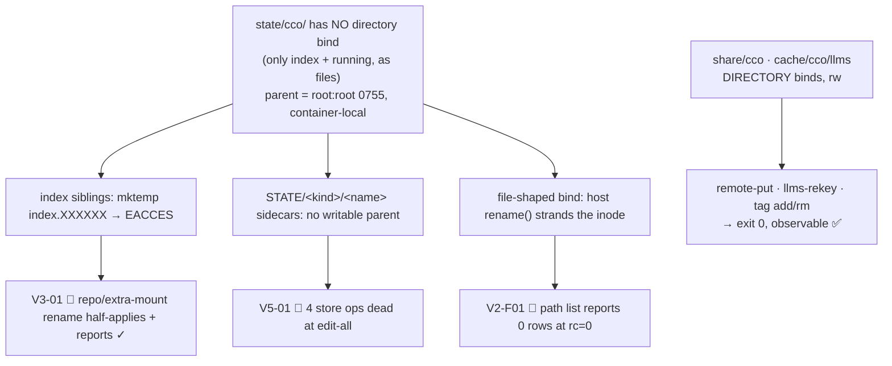

# Agent ↔ cco access — v3 acceptance re-review, consolidated verdict

> **Verdict: NOT ACCEPTED.** Three 🔴 findings, raised independently by three sessions through three
> unrelated verb families, **collapse to a single root cause**: the shape of the STATE bucket mount.
> Everything cycle 1 set out to fix is otherwise confirmed live. The release is gated on a
> **cycle-1.1** fix, scoped in [`../fix-design-v3/00-plan.md`](../fix-design-v3/00-plan.md).
>
> Run: 2026-07-20, 5 sessions (V1…V5) + the §7 scratch procedure. Inputs: `/review-v3/V{1..5}-*.md`,
> `HOST-path-list.txt`, `step-6-scratch-reproduction.md`. Gate: `develop → main`.

---

## 1. What cycle 1 claimed, and what actually holds

`handoff-v3.md` §0 put six roots under test. Live result:

| Root | Claim | Verdict | Carried by |
|---|---|---|---|
| **RC-4** `path list` scoping | owner-less rows scoped on **Po**, claimed rows stay visible | ✅ **HOLDS — both halves** | V1, V2 (read-project re-run), V4 |
| **RC-1** nested-config clamp | target/store `.cco` writable when the triple grants it; nested `.claude` follows the role axis (D-M5) | ✅ **HOLDS — both arms** | V4 (project-config), V5 (store) |
| **RC-6** config-editor target repos | `--project X` mounts X's member repos | ✅ **HOLDS** | V4 |
| **RC-2** host-path class | no in-container existence test; `--move-dir` refused exit 2; vocabulary retired | ⚠️ **PARTIAL** — vocabulary + `--move-dir` hold; **rename completion is BROKEN** | V3, V5 |
| **RC-3** store write path | completes observably, or fails exit 1 with the real reason | ⚠️ **PARTIAL** — fail-closed holds (no false success, no half-apply in the `store.sh` layer); **completion fails** | V4, V5 |
| **RC-17** test lane | the hermetic lane's stated blind spot is mount-time reality | ✅ **confirmed as the blind spot** — it is exactly what let R1 ship green | V3, V5 |

**RC-4 is the strongest result in the corpus.** It was confirmed on **three independent projects**
(`stai-sicuro`, `cave-auth`, and incidentally `cave-auth` again from V4's config-editor vantage), and
the observed row partitions discriminate against **both** wrong implementations that were considered
and rejected during design: an `A1`-style patch would have hidden the claimed rows (the blocking
false positive), an `A7` `G`-axis implementation would have pointed the notice at `read-global`.
Neither happened. RC-4 needs no further work.

Also closed live: the **ADR-0047 privilege boundary** (raw store reads `EACCES` in all five
sessions), **criterion E** in full (V4 closed the project-config arm, V5 the store arm), **secret
masking on writable targets** (T7), and the **D-M2 "not mounted in this session" string**, which
V1/V3/V4 each marked NOT REACHABLE and V5 finally reached.

---

## 2. The single root cause behind all three 🔴

### R1 — the STATE bucket is bind-mounted as individual **files**, not as a directory

`lib/cmd-start.sh:1643-1656` mounts the three internal buckets asymmetrically:

| Bucket | Host source | Container target | Shape |
|---|---|---|---|
| DATA | `$(_cco_data_dir)` | `/var/lib/cco-internal/share/cco` | **directory**, rw |
| CACHE | `$(_cco_llms_dir)` | `/var/lib/cco-internal/cache/cco/llms` | **directory**, rw |
| STATE | `${state_root}/index` | `…/state/cco/index` | **single file**, rw |
| STATE | `$(_cco_running_dir)` | `…/state/cco/running` | **single file**, ro |

There is **no bind for the `state/cco/` directory itself**. Docker creates that intermediate parent
when it materialises the two mountpoints, so it is a container-local `root:root 0755` directory
inside the `cco-svc`-owned 0700 root. The elevated identity (`euid=cco-svc`) can traverse and read
it but **cannot create inside it**.



**Code-verified consequences:**

- **V3-01 (write, index)** — every index writer uses the atomic `mktemp "${f}.XXXXXX"` + `mv` pattern
  (`lib/index.sh:70,104,175,209,315,373,412`). `mktemp` targets `dirname "$f"` = the root-owned
  `state/cco/` → `EACCES` ×3, then the verb prints `✓` and exits 0. Reproduced 2/2.
- **V5-01 (write, sidecars)** — `_store_op_buckets` returns `_cco_state_dir` for `sidecar-purge`,
  `sidecar-rekey`, `remote-drop`, `remote-rekey` (`lib/store.sh:137,140`); the pre-flight probe
  `mktemp "$d/.cco-stwtest.XXXXXX"` (`store.sh:188`) fails → `write<TAB>unwritable` → `die` at
  `store.sh:245`. Six verbs refuse at **every** access level, including `edit-all`.
- **V2-F01 (read)** — binding a *file* pins the container to one inode. A host-side
  write-temp-then-`rename()` (the pattern every index writer uses) unlinks it; the container is left
  on `//deleted` and reads zero bytes. Confirmed by `/proc/self/mountinfo`; the only `//deleted`
  mount in the session. Cleared by a session restart, so the blast radius is one session's lifetime.

The DATA/CACHE contrast is the decisive control: V3 showed `cco tag add` — the *identical* `mktemp`
sibling pattern in `lib/tags.sh:75`, at the same identity, through the same setuid trampoline —
succeeding end-to-end because `share/cco` **is** the mount. V5 showed `remote-put` (DATA-only)
succeeding while `remote-drop` (DATA + STATE) refused **on the same registry file, seconds apart**.
The elevation, the trampoline and the `(G,Pc,Po)` gate are all healthy. **The defect is the mount
shape, and nothing else.**

### ⚠️ The "one-line fix" proposed by V3 and V5 is not safely applicable

Both sessions propose *"bind the `state/cco` directory instead of the file"*. Taken literally this
**breaks a core invariant**. `lib/cmd-start.sh:1592-1600` states it explicitly — *"Secrets stay OFF
the container: the 0600 STATE remotes-token, transcripts and memory are never mounted (only the
STATE index file crosses)"* — and `lib/paths.sh` confirms what lives under `state/cco/`:

| Path | Content | May it cross? |
|---|---|---|
| `remotes-token` (`paths.sh:53`) | 0600 auth tokens | **never** |
| `projects/<id>/session/{memory,claude-state}` (`paths.sh:203-209`) | transcripts + memory | **never** |
| `global/update/{meta,base}` (`paths.sh:153-157`) | host update state | no need |
| `index` | the path index | **yes** — already does |
| `packs/<n>/update/*`, `templates/<n>/update/*` (`paths.sh:232-262`) | the blocked sidecars | **yes** — non-secret |

A whole-directory bind would mount tokens, transcripts and memory into **every** session at any
access level. The fix must stay **selective**, and the mount work reduces to the two non-secret
members once the remote-token question is settled (§3).

---

## 3. Ratified decision — `remote remove` / `remote rename` become host-only

**Decision (this review, D-V3-1): `cco remote remove` and `cco remote rename` are declared
host-only in-container, refused exit 2 with the existing host hint.** `cco remote add` stays
functional.

**Rationale 1 — consistency with a decision already ratified.** `bin/cco:404` already refuses
`cco remote set-token|remove-token` in-container with the reason *"secrets stay off the container"*.
`remote remove` and `remote rename` mutate the **same** token store: `_store_do_remote_drop`
(`store.sh:347`) calls `_remote_token_remove`, and `_store_do_remote_rekey` (`store.sh:361-364`)
does `_remote_token_set` + `_remote_token_remove`. Declaring them host-only applies a settled rule
to two verbs that escaped it; it is not a new concession.

**Rationale 2 — the container structurally cannot decide correctly.** The token file never mounts,
so `remote_get_token` cannot distinguish *"no token exists"* from *"a token exists and I cannot see
it"*. Both ops are written as a **conditional no-op** on exactly that test (`|| true` in drop, `if
remote_get_token` in rekey), so with a directory mount they would **pass silently** — and
`remote-rekey` would leave the token keyed to the **old** name, so the renamed remote loses its auth
with no diagnostic. A refusal is strictly better than a silent functional break, which is the
fail-closed principle ADR-0047 is built on.

**Rejected — (b) split the token into its own sub-bucket** so the rest of STATE can mount: high
structural cost to rescue two lifecycle verbs that have a working host path. **Rejected — (c) defer
to cycle 2**: leaves V5-02/V5-03's false reason and unactionable remedy in the shipped release.

**Corollaries.** `remote add` keeps working (DATA-only, no token) — only its dup-check message needs
correcting (V5-03), since it currently names `cco remote remove`, a command that will now be
explicitly host-only. And with the remote ops out, **STATE is no longer required by any store op
except the index and the pack/template sidecars — both non-secret.**

### Recommended mount shape — an explicitly shareable STATE sub-bucket

Bind **one** new directory, `state/cco/shared/`, holding `index` plus the `packs/`/`templates/`
sidecars. Rejected alternative: bind `state/cco` whole and mask the secrets by reusing
`_emit_secret_overlays` (the mechanism already dogfood-verified on `secrets.env`) — it is cheaper and
needs no migration, but it **flips the boundary from allow-list to deny-list**: today only the index
crosses (fail-safe); under masking everything crosses except what someone remembered to mask
(fail-open), so any future file added under STATE leaks by default. On a privilege boundary with
explicit fail-closed language that is not a trade worth a saved migration.

The sub-bucket preserves the allow-list, makes all four buckets structurally uniform, keeps the
atomic `mktemp`+`mv` pattern intact, and removes the `rename()`-onto-a-mountpoint **EBUSY** that
would defeat a permissions-only fix (V3 root cause A′). Cost: one migration. Full option analysis
and the staged plan are in [`../fix-design-v3/00-plan.md`](../fix-design-v3/00-plan.md) §2.

---

## 4. Secondary roots — independently fixable, and all still required

R1 explains the three 🔴 symptoms, but it is **not the only defect**. Each root below would survive
a perfect mount fix and must be closed on its own.

### R2 — the index write path cannot report failure (contributes to V3-01)

Three suppressions stack, verified:

1. `_index_rename_path` (`lib/index.sh:715-731`) checks the status of **none** of its three
   sub-writes (`_index_pp_set`, `_index_pp_remove`, `_index_set_project_repos`).
2. `lib/cmd-repo.sh:157` calls it bare — no `||` — then reaches `ok "Renamed …"` unconditionally at
   `:165`.
3. `bin/cco:657` — `repo) cmd_repo "$@" || _cco_rc=$? ;;` — places the whole command body in a `||`
   context, which **disables `errexit` for the entire call tree**, so three consecutive `mktemp`
   failures did not abort. `extra-mount` is identical at `:658`.

The contrast is in-repo: `lib/tags.sh:75` does `mktemp … || die "Cannot write tags registry…"`.
Because the dispatcher neutralises `errexit`, **explicit `||` propagation is the only reliable
mechanism** here — it deserves an invariant, not just a patch.

### R3 — the read path resolves "unreadable" as "empty", at rc=0

`lib/cmd-resolve.sh:869` emits `the path index is empty — run 'cco resolve' or 'cco resolve --scan
<dir>'`. Two defects: it re-emits the **retired "run cco resolve" vocabulary** RC-2 claims to have
removed, from a path cycle 1 never audited; and the "empty" branch has **no third arm for "the read
failed"**, so a zero-byte, permission-denied or stranded index all render as a cheerful success.
Per D-M2's three availability states this is an **error, exit 1, with the real reason**. Related:
the staleness itself is entirely silent (V2-F03) — `cco whoami` reports a healthy session while the
index behind it is a dead inode.

### R4 — one predicate, two spellings: the `project show` verb-local fallback

`lib/cmd-project-query.sh:192` hardcodes *"…not available at this access scope — its config is not
mounted in this session. **Widen the session's scope on the host**, or run cco there."* — bypassing
the shared resolver. `lib/access-scope.sh:736` (`_env_unavailable_sentence`) is already the correct
string at **every** level. The bypass was reported **three times from three vantages**:

| Session | Level | Why the hardcoded remedy is wrong there |
|---|---|---|
| V2-F04 | `read-all` | scope layer passes the name through; there is no wider read scope |
| V4-F-V4-02 | config-editor `(ro,rw,none)` | offers `read-global`, which under the ratified **Po** axis reveals no other project |
| V5-04 | `edit-all` | `edit-all` **is** the ceiling — nothing can be out of scope, nothing can be widened |

V5's framing settles the triage question: **cycle 1 rewrote `project validate` to the D-M2
vocabulary and left `project show` behind**, so the two now contradict each other on the same
resource in the same session. That contradiction is cycle-1 territory under D-M2 rule 3 (*"cycle 1
must not emit text that contradicts it"*), even though the broader RC-5 sweep stays cycle-2.

### R5 — the store refusal names a false reason and an unactionable remedy

`lib/store.sh:245` — *"the store is not writable in this session. Run the command on your host"* — is
false on both clauses at `edit-all`: `whoami` reports the store `rw`, and `pack create` /
`template create` / `remote add` all wrote successfully in the same session. The real condition is a
**mount-composition gap**, which is precisely D-M2's *"not mounted in this session"* state — the one
the neighbouring `project validate` already speaks correctly. The message must distinguish *"this
session's triple does not grant `G=rw`"* (a scope refusal, exit 2) from *"the bucket is not bound
into this container"*.

### R6 — config-editor silently drops two classes of declared binding

- **V5-05, `--all`**: `lib/cmd-start.sh:776-780` — `[[ -d "$path/.cco" ]] || continue` is a **bare
  `continue`**, while the sibling repo path calls `_ce_skip_note` (`:585-598`). One index-known
  project (`test`) was omitted from 8, with no announcement on any in-container surface.
- **V4-F-V4-01, `--project X`**: `_start_collect_config_editor_targets` (`:759-800`) never consults
  the target's `extra_mounts:`. cave-auth declares two; neither is delivered nor announced, while
  `cco path list` prints both as live host paths — actively implying they are reachable.

Both violate **INV-B / INV-M4** (*nothing is silently dropped; a skipped member is announced*). The
`extra_mounts` case additionally needs a **decision**: config-editor may legitimately choose never to
mount a target's extra_mounts — but that must be recorded, not left as an accident.

### R7 — the fail-closed pre-flight probes the wrong tree, and is unfalsifiable on macOS

`_rename_assert_writable "$unit/.cco"` (`lib/rename.sh:174`, from `cmd-repo.sh:143`) probes only the
**config** tree, which is writable; the tree that actually fails — the index bucket — is never
probed. RC-3's own pre-flight has the right shape (`store.sh:188`), but **`lib/index.sh` is not
routed through `lib/store.sh` at all** (`grep -n 'store-op' lib/index.sh` → no hits), so D-M8's Q-11
is only half-landed: the verb trampolines, its index writes bypass the primitive layer.

Compounding it: Docker Desktop's `fakeowner` ignores modes for container uids, so V3 could not
falsify the probe at all (`chmod 500 .cco && mktemp .cco/.x.XXXXXX` **succeeded**). **Criterion F's
"fail-closed pre-validation" cannot be signed off from a macOS run** — this converts the D-M6 Linux
write-path check-in from a follow-up into a hard gate.

---

## 5. Findings inventory and mapping

| ID | Sev | Finding | Root | RC | Governing doc / ADR |
|---|---|---|---|---|---|
| V3-01 | 🔴 | `repo`/`extra-mount rename` half-applies, prints `✓`, exits 0 | **R1** + R2 + R7 | RC-2, RC-3 | ADR-0047; `02-mount-generation.md`, `04-host-path-class.md`; D-M8/Q-11 |
| V5-01 | 🔴 | 4 store ops (6 verbs) dead at `edit-all` — STATE has no writable parent | **R1** | RC-3 | ADR-0047; `05-store-write-path.md` §4.2 |
| V2-F01 | 🔴 | index bound as a file → `//deleted` inode; reported "empty" at rc=0 | **R1** + R3 | RC-1, RC-3 | ADR-0047; `02-mount-generation.md`; D-M2 |
| V2-F02 | 🟠 | "empty" vs "unreadable" indistinguishable; resolves to success | R3 | RC-3 | `00-overview.md` §5.2 |
| V2-F03 | 🟠 | `//deleted` staleness is silent; `whoami` reports a healthy session | R3 | RC-1 | D-M2 |
| V2-F04 ≡ V4-F-V4-02 ≡ V5-04 | 🟠 | `project show` verb-local fallback: wrong/impossible remedy | R4 | RC-2 | D-M2 rule 3; `access-scope.sh:736` |
| V5-02 | 🟠 | store refusal names a false reason and an unactionable remedy | R5 | RC-3 | D-M2; criteria B, C |
| V5-03 | 🟠 | `remote add` succeeds, `remote remove` cannot; dup-check names an impossible command | R5 + **D-V3-1** | RC-3 | this review §3 |
| V4-F-V4-01 | 🟠 | config-editor target's `extra_mounts:` neither delivered nor announced | R6 | RC-6 | INV-B/INV-M4; `03-config-editor-repos.md` §3.9 |
| V5-05 | 🟠 | `--all` omits an index-known project with no announcement | R6 | RC-6 | INV-B/INV-M4 |
| V3-02 | 🟠 | fail-closed pre-flight probes the wrong tree; unfalsifiable on macOS | R7 | RC-3 | D-M6, D-M8/Q-11 |
| V1-F1 | 🟠 | bare `cco project validate` does not resolve the project at the WORKDIR root, while `show` does | R4 (adjacent) | RC-2 | R4 fallback (`project show` only) |
| V4-F-V4-03 | 🟡 | `list projects` notice leads with a widening that reveals none of what it hid | R4 | — | Q-C3 (cycle-2) |
| V3-03 | 🟡 | Q-6 ambiguity refusal unreachable at the WORKDIR root; an earlier guard answers | — | RC-2 | `04-host-path-class.md` §3.3 |
| V4-F-V4-04 | 🟡 doc | D-M9/Q-8 contradicts the implemented (and separately ratified) `03-*` §3.7, unmarked | — | — | `00-overview.md` §9 |
| V1-F3 ≡ V5-note-8 | 🟡 | image build provenance not discoverable in-container | — | — | `handoff-v3.md` §2 rule 0 |
| V1-F2 | PROPOSAL | `cco project show` has no extra_mounts section | — | — | `cli.md:930-941` (as-specified) |
| V3-P | PROPOSAL | a *successful* repo rename silently invalidates the session's mount mapping | — | — | `cmd-repo.sh:168` |

**Severity note.** The three 🔴 are one root; the seven 🟠 are five roots. No finding contradicts a
settled ADR, and none argues for reversing a cycle-1 design decision. V5's note 2 is worth adopting
verbatim: *"the correct triage is 'fix the mount + fix the message', not 'reconsider RC-3'."*

---

## 6. Process findings from the run itself

- **DEV-1** — V2 ran on `cave-auth`, not on the V1 subject `stai-sicuro`, so the specified
  same-project A/B diff was not performed. It closed **transitively** instead: both sessions anchored
  to the same 22-row host oracle (V1: 4 visible + 18 hidden; V2: 22 visible + 0 hidden,
  byte-identical), which is the stronger reference. Criterion G's oracle role is fulfilled.
- **DEV-2** — V1 and V2 ran **concurrently**, against launch rule 5. This is the most probable
  trigger of V2-F01, and it put V1's own captures at risk of the same silent truncation. V2 checked
  and cleared V1: its exact 4+18=22 reconciliation is impossible against a stale index. **No re-run
  needed** — but the near miss is instructive, because a truncated V1 would have *inverted* its RC-4
  conclusion on both halves while looking like a clean pass.
- **Matrix lesson for v4** (V2 note 5): *one project's `path list` at two access levels, both diffed
  against the host oracle*, is a stronger and cheaper RC-4 gate than two projects at one level each.
- **§7 / E6B-04 was never executed.** The host fixture (`scratch-a`/`scratch-b`/`scratch-pack`) was
  not created as specified — `step-6-scratch-reproduction.md` records a different, partly improvised
  run that renamed projects and repos rather than exercising the pack-rename fan-out. It is now
  additionally **blocked by V5-01**. V5 notes usable substrate already exists: `cave-core` is
  referenced by two mounted projects, which is exactly §7's fan-out shape.

---

## 7. Open gates — none closable in-container

| Gate | What it proves | Why it is still open |
|---|---|---|
| **V4b** — D-M11 escalation (`global=rw,current=ro,others=none` ⇒ target `.cco` **ro**) | the privilege escalation D-M11 was ratified to prevent | needs a host launch. **Highest-value remaining run**: it is the only probe in v3 that fails **open** if the fix is wrong — every other probe fails safe |
| **V5b** — bare global `(rw,none,none)` | honest-empty `path list` + notice; ADR-0048 inert-no-target guard | needs a host launch |
| **§7** — E6B-04 pack-rename fan-out atomicity | the half-apply cycle 1 fixed for an *unreproduced* defect | blocked by V5-01; re-run after cycle-1.1 |
| **D-M6** — Linux write-path check-in | fail-closed pre-validation (criterion F) | `fakeowner` makes it unfalsifiable on macOS (V3-02). **Hard gate, not a follow-up** |

## 8. Action required on the host, before anything else

V5 left a remote it could not remove (V5-03) — the store is monotonically grown by one entry:

```bash
cco remote remove v5probe
```

Everything else created by the five sessions was reverted and verified (see each report's hygiene
section). No commits were made and no fixes were applied by any session.

---

## 9. Verdict

**NOT ACCEPTED for `develop → main`.** Three 🔴 against criteria **B** and **F**, all resolving to
**R1**. The model is sound and the cycle-1 fixes it claimed are live-verified — RC-4 on both halves
across three projects, RC-1 on both D-M5 arms, RC-6, the ADR-0047 boundary, criterion E in full, and
`lib/store.sh`'s fail-closed contract, which V5 confirms works exactly as designed. What failed is a
**mount-composition defect the hermetic lane cannot see by construction**, plus a cluster of
honesty-of-message defects around it.

Proceed to **cycle-1.1** per [`../fix-design-v3/00-plan.md`](../fix-design-v3/00-plan.md).
</content>
</invoke>
