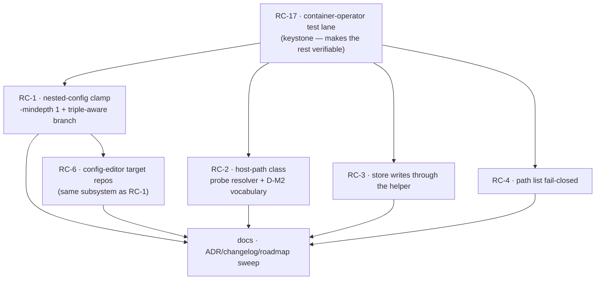

# Consolidated acceptance review — e2e v2

> **Status**: consolidation done (2026-07-19). Distils the seven session reports
> (`E1…E6B`, produced 2026-07-16 on the shared host mount `/review`) into a single
> acceptance verdict + root map, per [`../handoff.md`](../handoff.md) §7.2. This is the
> input to the fix workstream (`../fix-design-v2/`) and to maintainer sign-off.
>
> **Verdict**: **NOT ACCEPTED.** Six root causes break acceptance criteria; the release
> is blocked on cycle 1 of the fix workstream. Criterion **D** (config-editor by-mode)
> fails in **2 of 3 modes**; criteria **E**, **F**, **F3** and the output-scoping clause
> of **B** also fail.
>
> **Method**: incremental cycles (review → fix → re-review), agreed with the maintainer.
> This document is the cycle-0 baseline.

## 1. Sessions and coverage

| Session | Mode | Project shape | Report |
|---|---|---|---|
| E1 | read-project | minimal (1 repo, 0 packs) | `E1-readproject-min.md` |
| E2 | read-project | rich (3 repos, 2 packs) | `E2-readproject-rich.md` |
| E3 | read-all | rich | `E3-read-all.md` |
| E4 | edit-project | minimal (self-dev) | `E4-editproject.md` |
| E5 | config-editor `--project` | cave-auth | `E5-configeditor-project.md` |
| E6A | config-editor global (bare) | project-less + annex run | `E6A-configeditor-global.md` |
| E6B | config-editor `--all` | all projects | `E6B-configeditor-broad.md` |

~60 findings across the seven reports; deduped to **17 root causes** below.

**Launch-rule deviation (E1-04 / E4-09)**: the image was built from
`fix/cli/project-show-container-paths`, not the integrated `develop` (handoff §2 rule 0).
The branch is a strict superset of `develop` (develop + B-DF1 + docs), so findings remain
valid, but **B-DF1/F3 passed on code not yet on the release branch**. That merge has since
landed (`e773eb2`); the re-review must build from `develop`.

## 2. Acceptance verdict per criterion (§8)

A criterion passes only if every session that could observe it passed.

| Criterion | Verdict | Blocking root causes |
|---|---|---|
| **A — M0** | PASS (residue noted) | RC-15 (stale artifacts in 3/7 committed trees; nothing regenerated) |
| **A — F1** `cco docs` | **PASS** | — |
| **A — F2** per-kind read verbs | PARTIAL | RC-8 (pack hidden-notice never fires) |
| **A — F3** in-container resolution | **FAIL** | RC-2 |
| **A — F4** `whoami` | PASS (drift) | RC-10 |
| **A — F5** `--help` | PARTIAL | RC-11 (host-only *subverb* `--help` refuses) |
| **B — S1** raw enumeration | **PASS** | — (boundary confirmed in every session) |
| **B — S1b** host paths at `off` | **FAIL** | RC-7 (`policy.json` agent-readable) |
| **B — output-scoping intact** | **FAIL** | RC-4 (false negative that leaks), RC-3 |
| **C — model correctness** | **FAIL** | RC-5 (hidden ≠ absent inverted), RC-1 (triple not physically binding) |
| **D — config-editor by-mode** | **FAIL (2/3 modes)** | RC-1, RC-6 |
| **E — claude_access concordant** | **FAIL** | RC-1 (`Cg=rw`/`Cp=rw` not enforced) |
| **F — rename verbs** | **FAIL** | RC-2 (dead in-container), RC-3 (re-key silently skipped) |
| **G — no regressions** | PARTIAL | RC-9 (Level-A accuracy), RC-14 (doc drift) |

**The headline**: the access *model* is sound and the ADR-0047 privilege boundary is real
and confirmed — every session verified raw store reads fail EACCES. What fails is
**enforcement fidelity**: what the resolver declares (`whoami`, the triple, Level-A) and
what the container physically delivers have diverged. Three subsystems declare `rw` and
mount `ro`.

## 3. Root map (17 roots)

### Release-blocking (cycle 1)

| Root | Findings | Summary | Sites |
|---|---|---|---|
| **RC-1** — nested-config clamp over-reach | E5-01, E6A-01, E6A-02, E6A-12, E6B-01, E6B-02 | `_find_nested_config_dirs` matches its own root (no `-mindepth 1`), so config-editor's synthetic targets (source **is** a `.cco`) get a second `:ro` bind that clobbers `readonly: false`. Independently, the extra_mount branch ignores the session triple at default policy, so `~/.cco/.claude` is clamped `:ro` despite `Cg=rw` — the repo branch (`:1551`) does honour it. **Two defects, one cluster.** | `lib/cmd-start.sh:474-486`, `:1616-1637` |
| **RC-2** — host paths consumed in-container | E2-03, E3-01, E3-03, E4-01, E4-06, E4-08, E5-05, E5-06, E6A-10, E6B-04, E6B-05 | The B-DF1 **class** is open. Index host paths are `-d`-tested inside the container, where they never exist → verbs report "unresolved"/"missing"/"not found" for resources that are mounted and in scope. `repo`/`extra-mount rename` are **dead** (die at the guard), which ADR-0050 D7 requires to be runnable at edit-project. | `lib/cmd-project-validate.sh:307-313`, `lib/cmd-repo.sh:67,75,80,86,91,92,111`, `lib/index.sh:777` (`_project_iter_members`) |
| **RC-3** — direct-FS store writes bypass the helper | E6A-13, E6B-03, E6B-04 | Command bodies `rm`/`mv` DATA+STATE directly as uid 1001 → EACCES on the 0700 boundary parent, **error swallowed, `✓` printed, exit 0**. DATA/STATE orphaned. `pack rename` of a referenced pack would half-apply (store re-keyed, `packs[]` left dangling) — data-loss shaped. The boundary works; the write path does not use it. | `lib/cmd-pack.sh` (remove/rename); predicted `cmd-template.sh`, `cmd-llms.sh`, `cmd-remote.sh` per ADR-0050 D2 |
| **RC-4** — owner-less index pins exempt from scoping | E1-09, E2-02, E3-07, E4-03, E5-03 | `cco path list` skips the scope check for bindings with no owning project (`-n "$proj"` conjunct, deliberate per code comment). Result: other projects' names **and host paths** print at `Po=none`. Cross-level proof: output is byte-identical at read-project and read-all → the verb never consults the scope layer for these rows. `show_host_paths=off` **is** honoured (E4-03 code-grounded), so S1b is not reopened here. | `lib/cmd-resolve.sh:750` |
| **RC-5** — no "in scope but not mounted" state | E2-07, E3-02, E3-03, E3-04, E3-06, E4-04, E6A-14, E6B-06 | The model has two outcomes (visible / out-of-scope) but three realities. Verbs invent incompatible third answers: exit 2 "outside this session's project" (false at read-all/edit-all, where nothing *can* be hidden), exit 1 "not found" (absent reported for present), exit 0 + a false global negative. **Inverts INV-B** (absent reported as hidden, and vice versa) and violates the B6 hint invariant. | `lib/access-scope.sh` (`_env_require_visible`), `cmd-project-query.sh`, `cmd-project-validate.sh` |
| **RC-6** — config-editor target repos never mounted | E5-02 | `_effective_repo_mounts` derives the project name from the generated `project.yml` → `config-editor`, but under ADR-0051 the bindings are keyed `[cave-auth]`. Lookup misses, conscious-skip drops each repo **silently**. Repo-aware authoring (ADR-0042 §8) is impossible. Extra_mounts survive only because `_CCO_MOUNT_OVERRIDE` bypasses the lookup; repos never got the equivalent. | `lib/local-paths.sh:180-200`, `lib/cmd-start.sh:111-121` |
| **RC-17** — suite blind to container context | E4-01 meta | The hermetic suite cannot observe mount-time or container-context behaviour, so these defects ship green. Worse, `tests/test_operator_shim.sh:650` asserts only `rc -ne 2`, which a verb dying `rc=1` at a host-path guard **satisfies** — a false green on dead code. `test_repo_rename.sh` / `test_project_validate.sh` have zero container-operator coverage. ADR-0049 §5's forward annotation predicted this; it has now come true in a second subsystem. | `tests/helpers.sh`, `tests/test_operator_shim.sh:647-653` |

### Deferred to cycle 2+

| Root | Findings | Summary |
|---|---|---|
| **RC-7** — non-store host-path surfaces | E1-01, E4-05, E1-08 | `/etc/cco/policy.json` is agent-readable and carries host paths + username regardless of `show_host_paths` (**S1b FAIL**). `/proc/self/mountinfo` (kernel-owned) and persisted transcripts do too. Needs a criterion-wording decision, not only patches. |
| **RC-8** — kinds counted from the narrowed mount | E1-02, E2-01 | Packs are enumerated from the mount-narrowed CONFIG bucket, so out-of-scope packs are never iterated and the hidden-count is structurally unreachable. Templates prove the correct pattern (complete enumeration + filter). |
| **RC-9** — Level-A accuracy | E2-05, E3-11, E4-10, E5-04, E6A-07, E6B-10 | Wrong remediation target for pack-declared llms; missing `(read-only)` markers; declared-but-unmounted repos omitted; resolved triples never injected. |
| **RC-10** — `whoami` presentation | E2-04, E3-11 | Derived `claude_access` labelled as preset `none`; `Co` omitted from the authoring-trees block. |
| **RC-11** — help surface | E1-03, E2-09, E3-10, E3-12, E6A-05, E6B-09, E6B-12, E6B-13 | Group descriptions advertise host-only subverbs; above-scope verbs unmarked; host-only *subverb* `--help` refuses instead of informing; spurious `✗ exited unexpectedly (exit 0)` on bare `project`/`pack`. |
| **RC-12** — list rendering/consistency | E3-08, E3-09, E6B-11 | Unified `cco list` collapses two distinct `base` templates into one row (information loss); `REPOS` shows `-` for non-current projects the index knows; NAME column overflow. |
| **RC-13** — llms verb desync | E6B-08, E2-06, E3-12 | Read verbs find entries that mutation verbs report "not found"; no `llms validate`; llms never surfaced by `project show`/`pack show`. |
| **RC-14** — doc/ADR drift | E3-05, E4-07, E6A-04, E6A-06 | Managed rule + ADR-0043 §1 over-promise what `read-all` delivers; CLI-surface matrix §2.2 contradicts the shipped exit code; `cco start --help` still advertises the retired broad config-editor default; ADR-0046 §7 stale on `tag`. |
| **RC-15** — M0 residue | E1-05, E6A-09, E6B-14 | Retired `workspace.yml`/`packs.md` survive (0-byte) in 3/7 committed trees; the reap covers only the session overlay. |
| **RC-16** — host-side index hygiene | E2-08, E4-02, E6B-07 | An extra_mount bound to a **file** at a directory target; a binding attributed to the wrong project; `--all` silently skips an unmountable project. Needs host-side `cco resolve --scan` to settle whether these are shipped defects or local residue. |

## 4. Ratified decisions (maintainer, 2026-07-19)

| # | Decision | Outcome |
|---|---|---|
| **D-M1** | RC-1 fix shape | **`-mindepth 1` + triple-aware extra_mount branch.** The helper must never return its own root (closes the self-match class for user mounts too), *and* the extra_mount nested-config branch consults `_committed_ro`/`_b1_ro` at default policy for built-in synthetic mounts, removing the asymmetry with the repo branch (`:1551`). `config_access_policy` remains the explicit per-mount override; the strict `ro` default is unchanged for user extra_mounts. Rejected: `config_access_policy: write` on generated mounts alone (leaves the self-match class latent and duplicates intent already carried by the triple). |
| **D-M2** | RC-5 semantics | **New vocabulary + honest docs, no additional mounts.** Introduce an explicit third state, "not mounted in this session", distinct from "unresolved on this machine" and from "out of scope", behind one shared resolver with a single remedy string. `read-all` keeps its current meaning (name/index visibility, not config access); the managed rule, ADR-0043 §1 and `whoami` are corrected to say so. Rejected: mounting other projects' `.cco` at `Po=ro` (widens the mount surface against ADR-0047 §1) and restricting `read-all` (breaking change to a just-settled model). |
| **D-M4** | Elevated identity vs claude-owned config trees (criterion F on Linux) | **De-elevate only the config-tree write.** `repo`/`extra-mount rename` stays trampolined for its STATE-index work, but the `<repo>/.cco/project.yml` rewrite drops back to ruid=`claude` via a plain `bash`. Privilege is only ever narrowed. Rejected: per-call boundary crossing in the index accessors (an ADR-0047 revision, not a cycle-1 change) and host-only (contradicts ADR-0050 D7). |
| **D-M5** | Reading of D-M1 | **Role-keyed axis confirmed.** `store` → `.claude`/`Cg`, content/`G`; `project-config` → `.claude`/`Cp`, content/`Pc`. D-M1's "`_committed_ro`/`_b1_ro`" wording was imprecise — `Cr` is pinned `ro` by ADR-0049, so the literal reading would have left E6A-12/E6B-02 alive. Intent unchanged. |
| **D-M6** | Linux write-path gate | **Cycle 1 does not gate on it**, provided the D-M4 shape is POSIX-correct by construction (never `fakeowner`-dependent). The check-in stays a separate gate before `develop → main`. |
| **D-M3** | Cycle-1 scope | **Only the roots that break acceptance criteria**: RC-1, RC-2, RC-3, RC-4, RC-6, plus RC-17 (without the container-operator lane the fixes are not verifiable). RC-5's *decision* is ratified now so the verbs touched in cycle 1 emit the correct vocabulary; the full RC-5 sweep and RC-7…RC-16 land in cycle 2. |

## 5. Cycle-1 ordering

- **Keystone first**: RC-17. It is the only item that converts the other five from
  "believed fixed" to "verified fixed", and it retro-fits the false-green assertion.
- **RC-1 → RC-6** are sequential (same file, `lib/cmd-start.sh` mount generation).
- **RC-2, RC-3, RC-4** are file-disjoint from each other and from the mount work, so they
  can proceed independently once the lane exists.
- **Docs last**, once behaviour is settled (the v1 fix workstream's convention).

## 6. Verification gates for the re-review

1. Full suite green against the **1311/9** baseline (the 9 = pre-existing FI-19 boundary
   artifacts), plus the new container-operator lane.
2. `cco build` from `develop` — every one of these fixes is invisible in-session until the
   image is rebuilt (store verbs trampoline into the image-baked cco).
3. Re-run **E5**, **E6A**, **E6B** (criterion D/E) and **E4** (criterion F) as the targeted
   re-review; E1–E3 re-run only for RC-4.
4. RC-3's `pack rename` half-apply (E6B-04) must be **reproduced on a scratch project**
   before it is declared fixed — the reviewers deliberately did not execute it with `-y`.

## 7. Known and deliberately out of scope

FI-21 / FI-22 / FI-23 (index-model items) were triaged out before the run and must not be
re-reported; the reviewers correctly did not. The docs-coherence track
(`to-verify-guides-docs.md`) remains separate per handoff §9.
