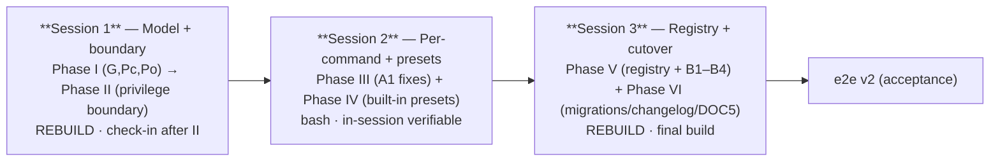
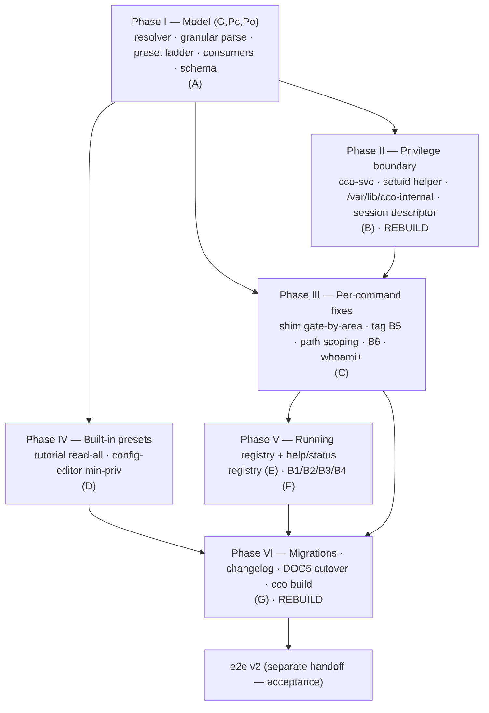

# Hardening-v2 — Implementation handoff

> **Status**: **S1 (Phase I + II) + S2 (Phase III + IV) DONE (2026-07-09)** on
> `feat/config-access/e2e-review`; the **unified implementation review over Phases I–IV is DONE
> (2026-07-10)** — 3 fixes landed (F1 `7f06be7` CCO_CONFIG_TARGETS emission, F2 `9b4f27d`
> `_env_in_scope` config-editor-aware, F3 `eac219c` notice widening) + backlog log `aad1a02`;
> F4 deferred as a fail-safe assess item; **post-`cco build` dogfood confirmed the boundary,
> trampoline, whoami+ and F3 live** (suite in-container 1183/7 = §6.2 artifacts, no regressions;
> see the backlog "Unified implementation review I–IV" section). **▶ S3 (Phase V + VI) is the
> remaining implementation, then e2e v2 (acceptance).** All three design sub-phases are DONE +
> approved — D1 [ADR-0046](../decisions/0046-unified-cco-access-model.md) (`(G,Pc,Po)` model),
> D2 [ADR-0047](../decisions/0047-config-access-enforcement.md) (privilege boundary), D3
> [A1 matrix](../e2e-review/analysis/A1-command-scope-matrix.md) (per-command gating). This
> handoff drives the **implementation phase**: turn the approved design into code, migrations,
> changelog, and a rebuilt image.
>
> **Resume point for the next session = S3 / Phase V** (§5, "Phase V — Running registry"):
> start with item E (running registry, ADR-0045) + items F (B1–B4) — no rebuild — then Phase VI
> (migrations · changelog · DOC5 shipped-doc cutover · `cco build`). Also fold in the two
> dogfood bugs logged in the backlog: **B-DF1** (in-container `cco project show` repo-resolution)
> and **B-DF2** (`cco init` prompt visibility). Branch NOT pushed — push both branches from the Mac.
>
> **Runs across three dedicated-context sessions** (§4 session plan), in dependency order, each a
> clean session that loads only its own subsystem context and lands a set of atomic commits. The
> six build phases (§5) group into those three sessions; a maintainer check-in falls between
> Session 1 and Session 2 (the security core).
>
> **Master plan**: [`handoff.md`](handoff.md) (the design-phase plan, now complete). **Tracker**:
> [`../e2e-review/pre-revalidation-backlog.md`](../e2e-review/pre-revalidation-backlog.md).

---

## 1. Operating constraints (read before touching code)

- **Self-development caveat.** This project develops cco from inside a cco session. Changes to
  `Dockerfile`, `config/entrypoint.sh`, `config/hooks/*`, and baked `defaults/managed/**` are
  **NOT active in the running session** — they need `cco build && cco start` **on the Mac** to
  take effect. **Any phase that touches the image (II, parts of III/IV/VI) cannot be verified
  in-session** — write it, land it, and mark it "verify after `cco build`".
- **The suite is the in-session safety net.** `bash tests/run.sh` (or the individual
  `tests/test_*.sh`) runs in-session and is the primary feedback loop for bash-logic phases (I,
  III, V). Baseline before starting: note the current pass count (memory: ~1147/0, one
  pre-existing env-only fail). Never let a phase regress it.
- **Branch**: continue on **`feat/config-access/e2e-review`** (D1/D2/D3 already committed there;
  the branch is **not pushed** — push both branches **from the Mac**). Atomic commits, conventional
  messages (`feat:`/`fix:`/`docs:`), each leaving the tree working.
- **Design-driven testing** (workflow rule): write/extend tests **alongside** each unit against
  the **contract** (A1 matrix + ADR §7 tables as the oracle), not the implementation. When a test
  fails, question the code first.
- **Language**: respond in Italian; code/comments/docs in English.
- **Documentation-lifecycle**: shipped-behaviour user docs (repo `CLAUDE.md`, `cli.md`, guides)
  are the **DOC5 cutover** — update them in **Phase VI**, at the commit that makes them true,
  **never ahead of code**. Living design docs are already reconciled (D1/D2/D3 sweeps).

---

## 2. Read first

- **[ADR-0046](../decisions/0046-unified-cco-access-model.md)** — the model. §7 (read-visibility
  + write-authority tables — the resolver's output), §2 (invariants + auto-promotion), §3 (preset
  ladder, **`edit-global` redefined `(rw,rw,none)`**), §5 (granular syntax), §6 (multi-repo Pc +
  `include_member_configs`; `cco sync` host-only — A1 §4.4), §8 (migration/back-compat).
- **[ADR-0047](../decisions/0047-config-access-enforcement.md)** — the boundary. §1 (confine only
  internal store), §2 (parent-gating + setuid `cco-svc`, no daemon), §3 (R1 root outside `$HOME`;
  R2 trusted session descriptor, fail-closed), §4 (mounts may go whole+rw; output-scoping demoted
  to defense-in-depth), §8 (empirical basis — the `fakeowner` test the layout depends on).
- **[A1 matrix](../e2e-review/analysis/A1-command-scope-matrix.md)** — per-verb gating. §1
  (the two axes), §2 (the per-verb table), §3 (shim changes), §4 (B5 tag / B6 hint / path / cco
  sync decisions), §5 (the consolidated fix list B1–B6 + path + whoami+).
- **[ADR-0044](../decisions/0044-internal-builtin-presets-and-config-editor-scope.md)** —
  config-editor min-privilege + tutorial `read-all` (§2/§3 tables).
- **[ADR-0045](../../../environment/decisions/0045-session-running-registry.md)** — the STATE
  running registry (§1 artifact, §2 in-container consumption, §3 B4 interim).
- Code baselines: `lib/access-scope.sh` (the level→scope maps to generalise, `:75-103`), `bin/cco`
  `_cco_operator_shim` (`:248-369`), `lib/cmd-start.sh` (`_start_resolve_access:209`,
  `_start_collect_config_editor_targets:315`, `_start_generate_compose:806`, mount block `:893`),
  `lib/paths.sh` (XDG 4-bucket resolver), `lib/tags.sh` (B5), `lib/cmd-whoami.sh`, `lib/utils.sh`
  (`_cco_session_running`), `Dockerfile`, `config/entrypoint.sh`.

---

## 3. Scope — what ships this phase

| # | Workstream | Source | Image rebuild? |
|---|---|---|---|
| **A** | `(G,Pc,Po)` resolver + granular syntax + preset ladder + consumers + schema | ADR-0046 | no (bash) |
| **B** | privilege boundary: `cco-svc` uid + setuid helper + `/var/lib/cco-internal` + symlinks + session descriptor + simplified mounts | ADR-0047 | **yes** |
| **C** | per-command fixes: shim gate-by-resource-area, tag **B5**, `path list` scoping, **B6** audit, `whoami+` triple | A1 | no (bash) |
| **D** | built-in presets: tutorial `read-all`, config-editor min-privilege + `--all` | ADR-0044 | maybe (preset defaults) |
| **E** | running registry: writers + reconciler + ro mount + in-container consumption | ADR-0045 | no (bash + mount) |
| **F** | pre-review B1 (whoami in help), B2 (empty section), B3 (unified-list status), B4 (unknown-not-stopped) | backlog §3 | no |
| **G** | migrations + changelog + **DOC5 shipped-doc cutover** + `cco build` | all | **yes** |

---

## 4. Session plan — three dedicated-context sessions

The six build phases (§5) run across **three clean sessions**, in dependency order. Each session
loads only its own subsystem context (a focused working set), lands atomic commits, and hands the
next session a working tree. **Do not merge two sessions** — the split keeps each context small
and the risky image-rebuild work isolated.

| Session | Phases | Dedicated context (working set) | Rebuild | In-session verifiable | Boundary |
|---|---|---|---|---|---|
| **S1 — Model + boundary** ✅ DONE (2026-07-09) — dogfooded on the Mac; maintainer check-in pending | **I + II** | `lib/access-scope.sh` (resolver), `lib/cmd-start.sh` (`_start_resolve_access`, mount block), `Dockerfile`, `config/entrypoint.sh`, `lib/paths.sh` (XDG→privileged root), setuid helper, session descriptor | **II: yes** | I: yes (suite); **II: only after `cco build` on the Mac** | **maintainer check-in after II** (confirm the `fakeowner` layout holds, ADR-0047 §8) |
| **S2 — Per-command + presets** ✅ DONE (2026-07-09) — in-session on `feat/config-access/e2e-review`; no rebuild needed | **III + IV** | `bin/cco` `_cco_operator_shim` (`_op_tag_gate`), `lib/access-scope.sh` (`_env_is_current_project`), `lib/cmd-whoami.sh`, `lib/cmd-resolve.sh` (`path list`), `lib/cmd-start.sh` (`_resolve_config_editor_mode`, `_start_collect_config_editor_targets`, preset resolution) | no (bash) | yes (suite) | starts from S1's merged tree |
| **S3 — Registry + help/status + cutover** | **V + VI** | `lib/utils.sh` (`_cco_session_running`), `cco start`/`stop` writers + reconciler, `_start_generate_compose` (ro mount), `bin/cco` usage render, `changelog.yml`, `migrations/*`, shipped-behaviour user docs | **VI: yes** (final build) | V: yes (suite); **VI: after `cco build`** | → **e2e v2** (separate acceptance handoff) |

Each session's kickoff is **this file** — open it, read §1–§3 + the session's phases in §5, and
work only that session's phases. Flip the backlog/roadmap rows as each lands.

## 5. Build phases (sequenced by dependency)

**Rationale for the order**: the **resolver (I)** is the foundation — mount-gen, shim, and
output-scoping all derive from the triple, so nothing else is correct until it exists. The
**boundary (II)** enforces the triple (its helper reads the resolved `(G,Pc,Po)` from the session
descriptor) → depends on I. **Per-command (III)** gates by resource area (I) and rides the helper
for internal-store writes (II). **Presets (IV)** are triples → depend on I. **Registry (V)** is
largely independent but touches the same mount/scope layer, so lands after III. **Cutover (VI)**
is last — docs + migrations + the final rebuild.

### Phase I — Model `(G,Pc,Po)` (ADR-0046) — no rebuild · **[Session 1]** — ✅ DONE (2026-07-09)

> **Landed** on `feat/config-access/e2e-review` in 4 atomic commits (`ec56f9f`
> resolver + per-axis read-visibility; `f78ae54` resolution → triple + granular/map
> parse + auto-promotion + invariant rejection; `c8a476f` consumers off the triple —
> mount-gen/shim/help/whoami, `edit-global`=(rw,rw,none) unlocks A1; `566d660`
> access.cco map schema + `include_member_configs`). Suite **1147 → 1169/0** (+22
> tests). **Deferred**: the §6 multi-repo Pc mount-narrowing (flag is plumbed + read +
> documented, but the hosting-vs-member :ro narrowing is a follow-up — see the DEFERRED
> note in `_start_generate_compose`; today every mounted repo's `.cco` follows Pc, ==
> the flag's `true` span, so additive + non-regressive).

Atomic units (one commit each, suggested):

1. **The resolver.** Generalise `_cco_level_read_scope`/`_cco_level_write_scope`
   (`access-scope.sh:75-103`) into `_cco_resolve_access` → emits the triple `(G,Pc,Po)`, each
   `none|ro|rw`. Keep the level→scope maps as thin adapters during transition, or replace call
   sites. Derive read-visibility + write-authority **per axis** (ADR-0046 §7) — replace the
   `{project,global,all}` ordinal in `_env_in_scope` and `_cco_write_scope_satisfies`.
2. **Granular parse + auto-promotion + validation.** `--cco-access global=…,current=…,others=…`
   (comma-separated, order-free, partial) **and** the `access.cco` map form in `project.yml`, in
   `_start_resolve_access` (`cmd-start.sh:209`). Auto-promote unspecified axes to the invariant
   floor (§2); **reject** an explicit invariant-violating triple (die, exit 1, name the invariant).
   Precedence unchanged (CLI > project.yml > `~/.cco/access.yml` > preset); scalar and map are two
   spellings of one field.
3. **Preset ladder redefinition.** Presets → sugar for the symmetric triples (§3 table);
   **`edit-global` = `(rw,rw,none)`** (was `(rw,ro,none)`). `read`→`read-all` alias kept.
4. **Consumers derive from axes.** Mount-gen (`_start_generate_compose:806`, mount block `:893`),
   the shim's read/write gates, and output-scoping all key off the triple (INV-E single source).
5. **Schema.** New optional `access.cco` **map** form + **`access.cco.include_member_configs`**
   (bool, default `false`; §6 multi-repo Pc — widens which member `<repo>/.cco` trees `Pc` spans).
   Additive → code-level default, `templates/project/base/project.yml` updated, **no migration**
   (verify: additive only).

**Tests**: extend `test_access_resolution.sh` (triple, auto-promotion, invariant rejection,
granular parse, precedence), `test_access_scope.sh` (per-axis read-visibility), `test_operator_shim.sh`
(write gate by axis, `edit-global` now writes project).

### Phase II — Privilege boundary (ADR-0047) — **REBUILD** · **[Session 1]** — ✅ DONE (2026-07-09)

> **Landed** on `feat/config-access/e2e-review` in 6 atomic commits (`3d77c8d` Dockerfile:
> `cco-svc` uid 900 + setuid C helper `config/cco-svc-helper.c` mode 4750 + `/var/lib/cco-internal`
> 0700; `427d95c` entrypoint lock-first + XDG symlinks into the root; `80aec06` paths.sh
> `_cco_ensure_dir` skip under the root in operator mode; `6983d41` **trampoline** —
> `_cco_verb_touches_store` classifies store verbs, the outer claude cco `exec`s the helper →
> `cco __store <verb>` elevated, which re-runs the shim as the authoritative gate; `3e4ee40`
> cmd-start `:ro` session descriptor `/etc/cco/session-access` + internal mounts under the root
> whole+rw per §4; `81f191d` `tests/test_privilege_boundary.sh`) **+ dogfood fix `98de9b1`**.
> Confirmed model (maintainer): **helper in C** + **"helper sottile, gating stays in cco bash"**
> (zero duplication). Suite **1169→1174/0**. **Dogfooded on the Mac**: boundary CONFIRMED
> (`cat ~/.local/state/cco/index` → EACCES; `cco list` scoped works). Dogfood found a
> `setgroups`/bash-privilege helper bug — a setuid-to-NON-root helper can't setgid/setuid and
> a bash with euid≠ruid self-resets euid; fixed in `98de9b1` (euid-only elevation via the
> setuid bit + `bash -p`, staying within ADR-0047 §2 "not root"). **Still pending: maintainer
> check-in** (ADR-0047 §8 Test B on the Mac) + the helper-variant decision (`bash -p`
> setuid-cco-svc vs setuid-root full uid+gid+groups drop). **Not verified on Linux** (write-path
> relies on macOS fakeowner — see the backlog). Dogfood bug **B-DF1** logged (backlog).

1. **Dockerfile**: create the **`cco-svc`** uid; bake the **minimal setuid helper** (owned
   `cco-svc`, setuid bit); create **`/var/lib/cco-internal/`** owned `cco-svc`, **mode 0700**.
2. **`config/entrypoint.sh`**: establish/own the privileged root and **lock it down first**
   (chmod-before-use, mirroring the proxy `:47-85`); make `$HOME/.local/{state,share,cache}/cco`
   **symlinks** into the root (Test B layout). `claude` must not own/traverse the root (R1).
3. **`lib/paths.sh`**: XDG resolver (`_cco_state_dir`/`_cco_data_dir`/`_cco_cache_dir`) →
   the privileged root; internal-store **primitives re-exec through the setuid helper**.
4. **The setuid helper** enforces `(G,Pc,Po)` (ADR-0046 §7) from the **trusted session
   descriptor** (R2) — never `argv`/env; **fail-closed** absent a valid descriptor.
5. **`cmd-start.sh`**: write the `cco-svc`/root-owned **session descriptor** (`:ro`, the resolved
   triple) host-side; **simplify the internal mounts** — registries may mount **whole, rw** (the
   parent boundary confines; drop the `read-project` narrowing of the internal registries, ADR-0047
   §4). Config-content mounts unchanged (`:ro`/`:rw`, secret-masking, referenced-subset narrowing).

**Tests**: new `test_privilege_boundary.sh` — **S1/S1b acceptance**: a `read-project` shell
`cat`-ing the index → **EACCES** (parent traversal); the helper reads it; `show_host_paths=off`
hides host paths for real. Fail-closed on a missing/forged descriptor. `test_paths.sh` for the
resolver redirect. **Verify after `cco build` on the Mac** (image + entrypoint).

> **Maintainer check-in after Phase II** — the boundary is the security core; confirm the
> `fakeowner` layout holds on the Mac (ADR-0047 §8 Test B) before building on top of it.

### Phase III — Per-command fixes (A1) — no rebuild (bash) · **[Session 2]** — ✅ DONE (2026-07-09)

> Landed on `feat/config-access/e2e-review` as 5 atomic commits: test-infra
> (`1b4ec02`, harness env-isolation for in-container runs), B5 tag gate
> (`6458fd1`), `path list` scoping (`0605f15`), whoami+ (`91e8e54`), B6 assertion
> (`176f344`). Suite (in-container) 1176/7 — the 7 are pre-existing environment
> artifacts (6 `test_as_list_*` HOME/bucket sandbox + 1 symlink); on the host that
> is the frozen 1174/0 baseline + the new tests, all green.
>
> **Deviations from the plan below (all intentional):** (1) the shim write gate
> was *already* axis-derived from Phase I (`_op_write <target>` via
> `_cco_triple_write_satisfies`) — the only remaining literal was `tag`, so unit 1
> merged into B5. (2) `path list` lives in `lib/cmd-resolve.sh` (`cmd_path`), not
> the shim; scoped there. (3) B5 ownership predicate = new `_env_is_current_project`
> (access-scope.sh), leaving `_env_current_project` single-valued for other callers.
> (4) B5/path/whoami tests went to `test_operator_shim.sh` (the operator-mode
> harness, with a seeded-store `_op_seed` helper), not `test_tag.sh`/`test_whoami`.

1. **Shim gate-by-resource-area.** Replace the hardcoded level literals (`bin/cco:301-368`) with
   the target→axis derivation (A1 §3). Environment-host class unchanged (still refused, host hint).
2. **B5 tag** (A1 §4.1). Gate `tag add/remove` by the **tagged resource's axis**:
   project(current)→`Pc=rw`, project(other)→`Po=rw`, pack/template→`G=rw`. Resolve kind+ownership
   **before/at the gate** (today inside `cmd_tag`, `tags.sh:216`); make the ownership predicate
   **config-editor-aware** (current = `PROJECT_NAME` for normal sessions, the `CCO_CONFIG_TARGETS`
   set for config-editor — extend `_env_current_project`, `access-scope.sh:129`). The DATA write
   rides the helper (II).
3. **`path list` scoping** (A1 §4.3). Scope output like `list project` (current+referenced; host
   paths gated by `show_host_paths`); `path set` stays host-only. Move it out of the shim's
   host-only block's special-case into a scoped read verb.
4. **B6 hint invariant** (A1 §4.2). After the refactor, assert **no silent exit-2**: every refusal
   states host-only or above-scope (naming the axis); exit-1 = unknown/error.
5. **`whoami+`** (A1 §4.5). Render the resolved **`(G,Pc,Po)` triple** (each axis) + the granular
   form + a **privilege-boundary note** (`cmd-whoami.sh:38-59`).

**Tests**: extend `test_operator_shim.sh` (gate-by-area, B6 no-silent-exit-2, path-list scoping),
`test_tag.sh` (B5 per-target: edit-project tags current project ✓; edit-global tags pack ✓ but
other project ✗; edit-all ✓), a `path list` scoping case, `test_whoami` for the triple render.

### Phase IV — Built-in presets (ADR-0044) — no rebuild (bash) · **[Session 2]** — ✅ DONE (2026-07-09)

> Landed as one atomic commit (`8617e24`) on `feat/config-access/e2e-review` — no
> baked-default change, so no rebuild. The config-editor scope is resolved once by
> a new `_resolve_config_editor_mode` (cwd + flags) so the preset cco_access default
> and the mounted target set agree. Tests: `test_config_editor.sh` (cwd-vs-flag
> matrix, cd-controlled since the suite runs from the repo root — itself a project),
> `test_access_resolution.sh` (unit-level preset resolution), `test_tutorial.sh`
> (read-all). No changelog / shipped-doc edits (DOC5 = Phase VI).

1. **tutorial → `read-all`** (`claude=none, cco=read-all, show_host_paths=on`). `--cco-access`
   available but discouraged (document).
2. **config-editor → min-privilege** (`_start_resolve_access` + `_start_collect_config_editor_targets`,
   `cmd-start.sh:209/315`): cwd-in-project → `edit-project` (cwd project's `.cco` + `~/.cco`);
   outside a project → `edit-global` (`~/.cco` only); `--all`/`--cco-access edit-all` → `edit-all`
   (every project). Preserve `--project`/`--repo` targeting + the *started ≠ cwd* asymmetry (D9).

**Tests**: `test_start_decentralized.sh`/`test_access_resolution.sh` for the preset resolution +
the config-editor cwd-vs-`--all` matrix.

### Phase V — Running registry (ADR-0045) + help/status (B1–B4) — no rebuild · **[Session 3]**

1. **Registry (E)**: `<state>/cco/running/<project>` markers written by `cco start`/`stop`;
   host-side **liveness reconciliation** vs `docker ps`; **ro dir mount** in
   `_start_generate_compose`; in-container `_cco_session_running` (`utils.sh`) reads the registry,
   **visibility gated by `_env_in_scope`** (not the docker channel).
2. **B4** (`utils.sh:141`): in-container, unseen-by-scoped-docker/absent-registry →
   **`unknown`**, never a false `stopped` (interim + permanent fallback; complements E).
3. **B3**: unified `cco list` shows running status for the `project` kind (today only `cco list
   project`) — `tags.sh:cmd_list` / `cmd-project-query.sh`.
4. **B1**: list `whoami` in operator-mode help; **B2**: suppress a help section header with zero
   runnable verbs (`bin/cco` usage render). **Hunt same-class siblings** (backlog §3 note).
5. **Registry lifecycle without `cco stop`** (dogfood **B-DF3**): normal exit is the `run --rm`
   container disappearing when Claude Code exits — `cco stop` is ~never invoked, and post-Phase-II
   the container can't write the internal-store `running/` dir. So the **host-side reconciliation
   is the primary reaper** (marker advisory, `docker ps` = truth; ADR-0045 self-healing): have
   `cco start` run a reconciliation **sweep**; arrange host-side writes + the `:ro` in-container
   mount for `running/` under the privileged root; verify a normal `--rm` exit leaves no stale
   index/state/metadata. Do NOT design cleanup around an exit-time `cco stop`.
6. **B-DF2 (first-run UX, folded like B-DF1)**: `cco init` name prompt is swallowed —
   `_cco_init_resolve_name` (`cmd-init.sh:335`) `read -rp … 2>/dev/null` eats the `read -p` prompt
   (bash writes it to stderr); the command looks hung. Print the prompt to `/dev/tty` (or drop the
   `2>/dev/null`); hunt sibling `read … 2>/dev/null` prompt-eaters.

**Tests**: new `test_running_registry.sh` (writers/reconcile/scope-gated visibility, unknown
fallback, **no-stop exit → next-read reconciliation reaps the marker**), `test_operator_shim.sh`
help-render cases for B1/B2, a `cco init` prompt-visibility case for B-DF2.

### Phase VI — Migrations · changelog · DOC5 cutover · `cco build` — **REBUILD** · **[Session 3]**

1. **Migrations**: expected **additive-only** (the model syntax + `include_member_configs` are
   code-defaulted; the boundary is container plumbing, not user-config; `edit-global` semantics are
   a code change). **Verify** no breaking schema change is needed. Next ids if any: **project 015**,
   **global 017** (current max: project 014, global 016). Every migration idempotent.
2. **Changelog** (`changelog.yml`, next id **37**): additive entries, each "requires `cco build`" —
   the `(G,Pc,Po)` granular model + `edit-global` redefinition; the privilege boundary; the
   config-editor/tutorial preset flip; the running registry. Group logically.
3. **DOC5 shipped-doc cutover** (backlog §5 DOC5 — do it **here**, at the code that makes it true):
   repo `CLAUDE.md` "Session access" ¶ (enum → triple + presets-as-sugar + granular syntax;
   `edit-global` redefined; output-scoping → defense-in-depth); `docs/users/reference/cli.md`;
   `docs/users/configuration/reference/project-yaml.md` (`access.cco` scalar|map +
   `include_member_configs`); `docs/users/environment/guides/docker-and-networking.md` (boundary);
   `docs/users/internal-projects/guides/{config-editor,tutorial}.md` (preset triples).
4. **CLI-surface matrix**: clear the ⏳ flags on the rows that just became true (tag B5, path list,
   whoami+, model recap), per the matrix §6 maintenance note.
5. **`cco build`** on the Mac + full suite green.

---

## 6. Acceptance gate → e2e v2

After Phase VI + `cco build`, write the **e2e v2 handoff** (separate session) and run the S1–S8
matrix as an **acceptance** pass against the [A1 matrix](../e2e-review/analysis/A1-command-scope-matrix.md)
+ [CLI-surface matrix](../../../cli/reference/cli-surface-matrix.md) as the oracle:

- **Launch rule 0**: `cco build` before any run (image-baked fixes need a rebuild).
- **S1/S1b are acceptance criteria** against the privilege boundary: a `read-project` agent
  `cat`-ing the index/DATA must get **EACCES**; `show_host_paths=off` must actually hide host paths.
- Seeds/roots + the per-verb behaviours from A1 become acceptance rows.

---

## 7. Definition of done (per phase)

- Phase suite green (in-session for I/III/V; **after `cco build` on the Mac** for II/IV/VI).
- No regression vs the baseline pass count.
- Behaviour matches the **A1 matrix + ADR §7 tables** (the contract), not the other way round.
- Atomic commits on `feat/config-access/e2e-review`; **push both branches from the Mac**.
- Living docs already truth (D1/D2/D3); shipped docs updated **in Phase VI only**.
- Backlog + roadmap rows flipped to done as each phase lands.
