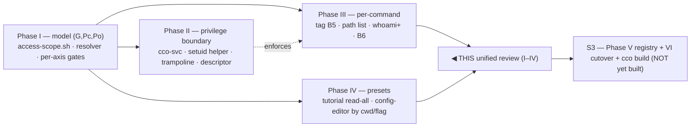
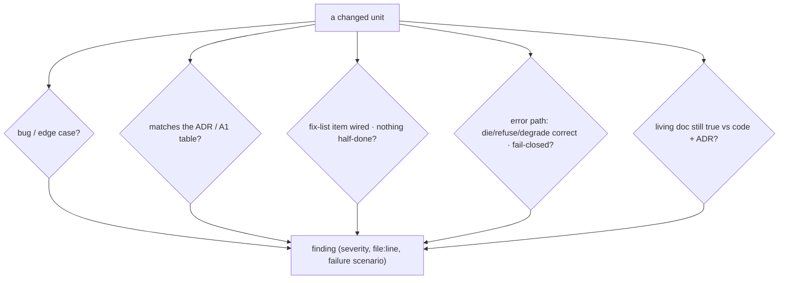

# Hardening-v2 — Unified implementation review handoff (Phases I–IV)

> **Purpose.** Drive a **single, unified implementation review** over everything that
> hardening-v2 has implemented so far — **Phases I, II, III, IV** (sessions S1 + S2) — before
> S3 (Phase V + VI) and the e2e v2 acceptance. This is a *review* handoff (read + reason +
> adversarially verify), not an implementation one: no code is written here except, optionally,
> the small fixes the review confirms.
>
> **Scope note on "phases 1–5".** The *implemented* phases are **I–IV**. **Phase V (running
> registry, ADR-0045) and Phase VI (migrations + changelog + DOC5 shipped-doc cutover +
> `cco build`) are NOT implemented yet** (they are S3). There is therefore no Phase-V/VI
> implementation to review; this handoff covers I–IV. Phase V/VI context is given only so the
> reviewer understands what is *deliberately deferred* (see §6 "Out of scope / deferred").

---

## 1. What is under review

**Branch**: `feat/config-access/e2e-review` (NOT pushed — push both branches from the Mac).
**Review range**: `ec56f9f^..HEAD` (the whole hardening-v2 implementation; the leading commits
before `ec56f9f` are the earlier e2e-review fix, out of this review's scope).
**Suite baseline**: host **1187 passed / 0 failed**; in-container **1180 / 7** — the 7 fails are
**pre-existing environment artifacts, not regressions** (§6.2). Never regress the host baseline.

Commits by phase (all `feat(access)`/`test(access)`/`docs(access)` on the branch):

| Phase | Session | Commits | Core files |
|---|---|---|---|
| **I — `(G,Pc,Po)` model** (ADR-0046) | S1 | `ec56f9f` `f78ae54` `c8a476f` `566d660` (+docs `274723e` `71dee74`) | `lib/access-scope.sh` (triple resolver, per-axis read/write), `lib/cmd-start.sh` `_start_resolve_access`, `templates/project/base/project.yml` (access.cco map) |
| **II — privilege boundary** (ADR-0047) | S1 | `3d77c8d` `427d95c` `80aec06` `6983d41` `3e4ee40` `81f191d` `98de9b1` (+docs `1c23cfe` `4686f2f`) | `Dockerfile`, `config/cco-svc-helper.c`, `config/entrypoint.sh`, `lib/paths.sh` (XDG→privileged root + resolver guard), `bin/cco` (`__store` trampoline + `_cco_verb_touches_store`), `lib/cmd-start.sh` (session descriptor + internal mounts) |
| **III — per-command fixes** (A1 matrix) | S2 | `1b4ec02` (test-infra) `6458fd1` (B5) `0605f15` (path list) `91e8e54` (whoami+) `176f344` (B6) | `bin/cco` `_op_tag_gate`, `lib/access-scope.sh` `_env_is_current_project`, `lib/cmd-resolve.sh` `cmd_path` (`path list`), `lib/cmd-whoami.sh` |
| **IV — built-in presets** (ADR-0044) | S2 | `8617e24` (+docs `c0f5dbe`) | `lib/cmd-start.sh` `_resolve_config_editor_mode` + `_start_collect_config_editor_targets` + `_start_resolve_access` preset block |

---

## 2. Reference material (read before reviewing)

**Design decisions (ADRs — the contract the code must obey):**
- **[ADR-0046](../decisions/0046-unified-cco-access-model.md)** — the `(G,Pc,Po)` triple: three
  axes `none<ro<rw`; §7 read-visibility + write-authority tables; §1 referenced-subset invariant;
  §2 invariants (`Po≤Pc`, Pc≥ro floor, auto-promotion); §3 presets = symmetric-ladder sugar
  (`edit-global`=`(rw,rw,none)`); §6 multi-repo Pc (`include_member_configs`).
- **[ADR-0047](../decisions/0047-config-access-enforcement.md)** — confine only the *internal
  store* behind a mode-0700 `cco-svc` real-FS parent + a setuid helper enforcing `(G,Pc,Po)`
  from the trusted `:ro` session descriptor; config-content stays mounted; `access-scope.sh`
  output-scoping demoted to defense-in-depth. §2 helper contract, §4 mount model, §8 test plan.
- **[ADR-0044](../decisions/0044-internal-builtin-presets-and-config-editor-scope.md)** — built-in
  presets by read-only-vs-write: §2 tutorial `read-all`; §3 config-editor minimum-privilege table.
- **[ADR-0042](../decisions/0042-agent-cco-interaction-model.md)** (interaction model, §8
  config-editor UX — refined by 0044), **[ADR-0043](../../../cli/decisions/0043-unified-cli-environment-access-scope.md)**
  (CLI env-awareness + output-scoping INV-A…E), **[ADR-0036](../../decentralized-config/decisions/0036-session-config-capability-model.md)**
  (capability-model base: three knobs, host-only families).
- **[A1 command-scope matrix](../e2e-review/analysis/A1-command-scope-matrix.md)** — the per-verb
  oracle for Phase III: §1 two axes (enforcement side + resource area), §2 per-verb table, §4
  resolved decisions (B5/B6/`path`/`sync`), §5 fix-list B1–B6+`path`+`whoami+`, §1.3 refusal
  taxonomy.

**Living design docs (must be coherent with the code — see dimension 5):**
- **[design.md](../design.md)** (the agent↔cco access living design), **[CLI-surface matrix](../../../cli/reference/cli-surface-matrix.md)**
  (⏳ rows for tag/path/whoami), **[design-cli-environment-awareness.md](../../../cli/design/design-cli-environment-awareness.md)**
  (§4 verb gating), **[design-docker.md §1.2](../../../environment/design/design-docker.md)**
  (boundary + XDG base-dir ownership invariant).
- Repo **[CLAUDE.md](../../../../../CLAUDE.md)** "Session access" recap paragraph (the shipped-model
  enum + the ADR-0046/0047 "planned evolution" annotation).

**Principles & conventions (the review lens):**
- **Least privilege by default**; widest scopes (`edit-all`, all-projects, `read-all`) are always
  an *explicit* opt-in (ADR-0044 §1). **Leverage native Claude Code** (don't reimplement).
- **Refusal taxonomy (R9/B6)**: `exit 0` success-or-degrade · `exit 2` policy refusal *with a
  stated reason* (host-only **or** above-scope, naming the axis) · `exit 1` unknown verb/parse
  error. **No silent exit-2.**
- **Output-scoping invariants (ADR-0043 §2)**: INV-A host-open · INV-B hidden≠absent (count-only
  notice) · INV-C stderr · INV-D index-complete · INV-E single-source.
- **Trampoline rule**: any store-touching verb must be in `_cco_verb_touches_store` *and* its gate
  must be pure/env-driven so the outer (forgeable-env) and elevated (trusted-descriptor) runs of
  `_cco_operator_shim` agree; the elevated one is authoritative.
- **bash 3.2 / macOS `/bin/bash`** compatibility; `set -euo pipefail` (guard empty arrays, command
  substitutions, unset vars).
- **[documentation-lifecycle](../../../../../.claude/rules/documentation-lifecycle.md)**: ADRs/analyses
  = immutable history (annotate forward); living design docs = rewrite to truth; **shipped-behaviour
  docs are the Phase VI cutover** (do NOT expect them updated yet — §6).
- Managed rule **[cco-config-interaction.md](file:///etc/claude-code/.claude/rules/cco-config-interaction.md)**
  (agent↔cco config-edit safety, access-conditional).

**Item tracker**: [pre-revalidation-backlog.md](../e2e-review/pre-revalidation-backlog.md)
(B1–B6, `path`, `whoami+`, D-CE1/O-TUT1, dogfood bugs).

---

## 3. Review dimensions (what to verify)

Review every changed unit against these five dimensions. Rank findings most-severe first; each
finding must name a **concrete failure scenario** (inputs/state → wrong output/crash), not a style
preference.

1. **Bugs / issues.** Logic errors, edge cases, bash pitfalls (word-splitting, unquoted
   expansions, `set -e` inside `$()`/`||`, empty-array under `set -u`, `read` field loss, subshell
   `die` swallowed), TOCTOU/races, wrong exit codes, secret/host-path leaks, mount rw/ro mistakes.
2. **Correctness & design adherence.** Does the code implement the ADRs *as written*? Cross-check
   against the ADR-0046 §7 tables (per-axis read-visibility + write-authority), ADR-0047 §2/§4
   (boundary + descriptor), ADR-0044 §2/§3 (preset table), and the A1 §2 per-verb matrix +
   §1.3 refusal taxonomy. Flag any drift, silent widening, or asymmetry the design forbids.
3. **No forgotten / gap implementation.** Is the fix-list complete? Every A1 fix-list row
   (B5, B6, `path`, `whoami+`) landed and wired? Every store-touching verb in the trampoline
   classifier? Every preset row (config-editor all/project/global + `--project`/`--repo`;
   tutorial) reachable? Every triple axis actually gated (G, Pc, Po; the granular cases 6/7)?
   Any dead code, unreachable branch, or half-wired path?
4. **Error handling — complete & correct.** `die` (exit 1) vs `refuse` (exit 2) vs graceful
   degrade (exit 0) used per the taxonomy; **fail-closed** on the security path (helper missing /
   descriptor unreadable / detection unreadable → refuse or safe-default, never silent allow);
   every refusal carries a reason (B6); defer-not-false-refuse where detection is unreliable in
   the outer shim (B5). No unguarded `mktemp`/`awk`/`mv` that reports success on a failed write.
5. **Living docs coherent with the code + in-force ADRs.** The living design docs (design.md,
   CLI-surface matrix ⏳ rows, design-cli-environment-awareness, design-docker §1.2, the CLAUDE.md
   recap) must reflect what the code now does and the ADRs now in force. **Only living docs are in
   scope** — do NOT flag shipped-behaviour user docs / changelog lag (that is the deliberate Phase
   VI cutover, §6). Also check ADR forward-annotations are present where a later ADR refined an
   earlier one (0042→0044/0046, 0043 INV-D→0047).

---

## 4. Per-phase focus areas (where the risk concentrates)

**Phase I — `lib/access-scope.sh` + `_start_resolve_access`.**
- The pure resolver chain: `_cco_parse_granular` → `_cco_promote_triple` (auto-promotion +
  invariant rejection: `Pc≥ro`, `Po≤Pc`) → `_cco_preset_triple` / `_cco_resolve_access`. Verify
  every ADR-0046 §2/§3 invariant and every preset triple (esp. `edit-global`=`(rw,rw,none)`).
- Per-axis gates: `_env_in_scope` (read-visibility by kind, §7 table), `_cco_triple_write_satisfies`
  (write-authority), `_env_require_visible`/`_env_require_kind_visible` (show/list refusals),
  the count-only notice (`_env_note_hidden`/`_env_flush_hidden_notice`, INV-B/C). Check the lossy
  ordinal shims (`_env_read_scope`/`_env_read_rank`) never gate a G/Po-independent decision (case 6
  `(none,rw,rw)`: sees other projects yet hides unreferenced globals).
- `_env_triple` precedence (trusted `CCO_ACCESS_TRIPLE` vs preset fallback vs read-project floor);
  host → `rw rw rw` (INV-A).

**Phase II — the boundary (the security core; ADR-0047).**
- `config/cco-svc-helper.c`: env sanitation (only `ALLOWED_KEYS` from the descriptor, nothing from
  the caller), control-char rejection, fail-closed when the descriptor is absent/unreadable, the
  `CCO_STORE_ELEVATED=1` marker, the fixed bucket homes, the `bash -p` euid-preserving elevation
  (`98de9b1`), argv passthrough. Look for env-injection, path-injection, TOCTOU on the descriptor.
- `bin/cco`: `_cco_verb_touches_store` completeness (every store-touching verb listed; default-deny
  unlisted), the `__store` re-entry gate (re-runs `_cco_operator_shim` authoritatively), the
  trampoline guard (`CCO_STORE_ELEVATED != 1 && -x helper`), the no-helper fallback.
- `config/entrypoint.sh` + `lib/paths.sh`: lock-first ordering, XDG→`/var/lib/cco-internal`
  symlinks, `_cco_ensure_dir` skip in operator mode, the resolver guard/redirect.
- **Known limitation to NOT re-flag as a new bug (assess only):** the boundary is **macOS-DD
  `fakeowner`-verified**; the **Linux write-path** (cco-svc writing host-owned bind-mounted
  DATA/index) is an *open, documented* follow-up (ADR-0047 §8 macOS-only; memory `hardening-v2-impl`
  check-in caveat a). Confirm it is *documented as open*, not silently assumed working.

**Phase III — `bin/cco` `_op_tag_gate`, `cmd_path` list, `cmd-whoami`, `_env_is_current_project`.**
- **B5**: the target→axis derivation (project-current→`Pc`, project-other→`Po`, pack/template→`G`);
  the **defer-not-false-refuse** on unreadable/ambiguous detection in the OUTER shim (the STATE
  index is behind the boundary there) so a valid project tag is never refused before the trampoline,
  while a positive denial (pack tag at `G=none`) still refuses early. Config-editor ownership
  (`_env_is_current_project` = `PROJECT_NAME` ∪ `CCO_CONFIG_TARGETS`). Verify the elevated re-run
  is authoritative and both runs agree.
- **`path list`**: scoped like `cco list project` via the **Po axis** (not the old
  `_env_read_rank -eq 1` — read-global must still hide other projects) + host-path column gated by
  `show_host_paths` (S1b). Check owner-iteration + the empty/malformed/hidden notice paths.
- **whoami+**: the explicit `(G,Pc,Po)` line, granular form, boundary note; the preserved
  read/write-scope + per-tree rw/ro lines.
- **B6**: audit *every* `refuse`/`die` arm across `_cco_operator_shim` for a stated reason and the
  correct 0/2/1 code after the B5 + path refactors.

**Phase IV — `_resolve_config_editor_mode` + collector + preset block (`lib/cmd-start.sh`).**
- The mode decision (`--all`/`--cco-access edit-all`→all · named `--project`→project · cwd-in-
  project→project · else global) resolved **once** and consumed by *both* the preset `d_cco`
  default *and* the target collector (they must agree). The `*)`→edit-global fail-safe default.
- The collector's four branches (named / all / cwd-project / global-none) + `--repo`; the
  started≠cwd asymmetry surfaced via `CCO_CONFIG_TARGETS` (D9).
- **Assess (possible gap):** `_env_in_scope`'s `project` branch still compares the single
  `PROJECT_NAME`, not the config-editor target *set*. For a config-editor **edit-project** session
  (Po=none), `cco list project` / `project show` of a `CCO_CONFIG_TARGETS` project would fall to the
  Po check and hide it — invisible today because config-editor is usually broad, but a latent
  inconsistency with the B5 ownership predicate. Decide: gap to fix now, or a documented Phase-V
  follow-up.

---

## 5. How to run the review

- **In-session verifiable (I, III, IV):** pure bash — the suite is the feedback loop. Run
  `bash bin/test` (host baseline **1187/0**; in-container 1180/7, the 7 being §6.2 artifacts).
  Read the code against the ADR/A1 tables; reason about failure scenarios; drive representative
  refusals/gates with a throwaway operator env (see `tests/test_operator_shim.sh` `_op_cco`/`_op_seed`
  helpers for the pattern — note `CCO_STORE_ELEVATED=1` isolates the gate from the live trampoline).
- **Phase II (boundary):** not fully in-session verifiable — the setuid helper + image plumbing
  need `cco build && cco start` on the **Mac** (the container these tests run in cannot rebuild the
  image under itself). Review `cco-svc-helper.c` + entrypoint + Dockerfile statically; the runtime
  proof is the Mac dogfood (`cat index`→EACCES already confirmed) + ADR-0047 §8 Test A/B/C.
- **Suggested methodology:** review each phase as an independent lens, then a cross-cutting pass on
  the trampoline (III depends on II) and the shared `_start_resolve_access`/`access-scope.sh` (I
  underpins III/IV). **Adversarially verify** each candidate finding (try to refute it; default to
  "not a bug" unless a concrete failing input exists) before reporting — the boundary + gates are
  subtle and plausible-but-wrong findings are the main risk.
- **Deliverable:** a findings report ranked by severity, each with `file:line`, the dimension it
  violates (§3), a concrete failure scenario, and a proposed fix. Separate **confirmed bugs** from
  **assess/decide items** (e.g. the two "assess" notes in §4) and **doc-coherence** nits. Land
  confirmed fixes as atomic commits on `feat/config-access/e2e-review`; log design questions in the
  backlog. Do NOT touch shipped-behaviour docs / changelog (§6).

---

## 6. Out of scope / deferred — do NOT report these as defects

1. **Phase V (running registry, ADR-0045) + Phase VI (migrations, changelog, DOC5 shipped-doc
   cutover, `cco build`)** are **not implemented yet** (S3). Their absence is not a gap. In
   particular: **changelog entries** for the tag-gate / preset behaviour changes and the
   **shipped-behaviour docs** (repo `CLAUDE.md` model recap, `docs/users/**` guides, `cli.md`,
   tutorial/config-editor user docs, CLI-surface matrix ⏳→final flip) are the **Phase VI DOC5
   cutover** — deliberately not updated now (documentation-lifecycle: never rewrite shipped docs
   ahead of the build that makes them true). Dimension-5 coherence applies to **living** design
   docs + ADRs only.
2. **The 7 in-container suite failures are environment artifacts, not regressions** (confirmed via
   `git stash` to pre-exist all hardening-v2 changes; on the host they pass → 1187/0):
   6× `test_as_list_*` / `test_as_llms_show_used_by_*` (their `run_cco` reads the *real* container
   store instead of the seeded tmpdir — a HOME/bucket sandbox gap that only manifests inside a
   populated container) + `test_paths_symlink_safe_tool_root` (symlink resolution in-container).
   Also `test_migration_010_user_project_named_tutorial` fails only when run in isolation but
   passes in full-suite order (a pre-existing test-order fragility). None are hardening-v2 bugs.
3. **Phase II Linux write-path** and the **helper-variant decision** (bash-p vs setuid-root
   full-drop) are open maintainer check-in items (ADR-0047 §8), not review defects.
4. **B-DF1** (in-container `cco project show` mislabels bind-mounted members) is a logged pre-merge
   bug *outside* hardening-v2 scope (backlog §"Dogfood-found bugs") — note if touched, don't fix here.
5. **§6 multi-repo Pc mount-narrowing** (ADR-0046 §6) is an *intentional deferral* (flag plumbed +
   documented; hosting-vs-member `:ro` narrowing is a follow-up) — not a gap.

---

## 7. After the review

Feed confirmed fixes back onto the branch, resolve the two §4 "assess" items (record decisions in
the backlog / a short ADR annotation), then proceed to **S3** (Phase V + VI) →
**e2e v2** acceptance (separate handoff, post-`cco build`). Push both branches from the Mac.
