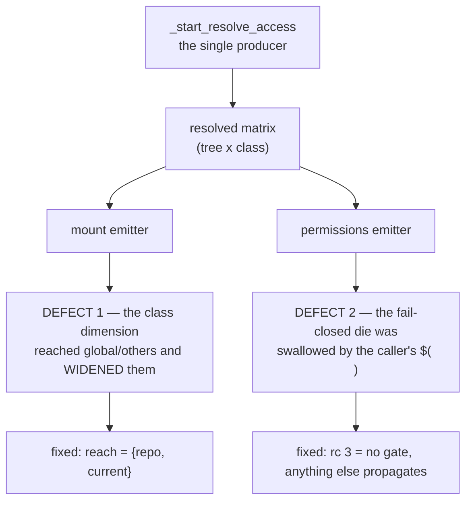

# Implementation review — A4 / ADR-0057, the `ask` enforcement plane

**Historical record.** `/review-implementation` over the whole A4 unit on
`feat/access/claude-md-axis` (26 commits, `5924dab…51a0e3e`), measured against
[ADR-0057](../decisions/0057-ask-enforcement-plane-and-resource-classes.md), the living
[design §4bis.1](../design.md), and `docs/users/reference/cli.md`. Run before the merge
into `develop`, 2026-08-08.

## Verdict

**Fixed in place** — two objective defects, both realignments to what ADR-0057 already
decided, both on the security surface, both with a discriminating regression test. The
rest of the unit is sound and unusually well evidenced.

Suite before: 1629 passed · 7 failed (the known host-only set) of 1636.
Suite after: **1631 passed · the same 7 failed** of 1638. Bash 3.2 parses all three
changed files (negative control fired).

## Fixed in place

### 1. `design-divergence` — the class dimension widened the two trees it does not reach

`lib/access-scope.sh:_claude_cell` — the cell rule applied
`max(axis(tree), value(class))` across **all four** trees and clamped only the token
`ask`. ADR-0057 D2 declares the dimension's reach in the grammar block itself
(*"reach: {Cr, Cp} only"*), design §4bis.1 repeats it (*"reaching `{Cr, Cp}` only"*), and
`cli.md` states it to users (*"Within the `repo` and `current` trees…"*). Because only
`ask` was clamped, a class value of **`rw`** lifted `global`/`others` above their tree axis.

Measured on the emitted compose, not inferred:

| Session | `~/.cco/.claude/*` before the fix | ADR-0049 §3 / ADR-0057 D5 |
|---|---|---|
| `--claude-access repo` | `CLAUDE.md`, `rules`, `agents`, `skills` all **rw** | `Cg=ro` — "author the **local** trees" |
| `--claude-access entries.claude_md=rw` | `CLAUDE.md` **rw** | out of reach; no git backstop (D5) |

The second is the *"one-flag exit"* the FI-52 amendment and `changelog.yml` entry 62 both
advertise as opening "every `CLAUDE.md` **under `/workspace`**". `~/.cco/.claude/CLAUDE.md`
is not under `/workspace`, so the flag was granting strictly more than it documented — and
`~/.cco` is versioned only if the user runs `cco config save`, which is D5's own argument.

**Fix**: `_claude_tree_allows_ask` → `_claude_tree_in_class_reach`, consulted *before*
`max()` rather than only to clamp `ask`. A class may **refine** a tree it reaches; it can
never **widen** one it does not. The `ask`-clamp is kept as belt-and-braces.

**Why it hid**: the default path is `claude_md: ask`, and `ask` on a two-valued tree
clamped back to `ro` — so the default looked correct (`test_access_mount_ask_clamps_on_global_tree`
passed) while every `rw` class value escalated. The acceptance run measured a default
session, a `--claude-access none` session and a config-editor session; **no `repo`/`all`
session was ever started**, which is precisely the shape the defect lived in.

**Regression test**: `test_access_entries_do_not_widen_out_of_reach_trees` — asserts on the
generated compose for both shapes, plus a positive control that preset `repo` still grants
the local trees (or the test would pass on a preset that granted nothing).

### 2. `bug` — the permissions emitter's fail-closed refusal never reached the caller

`lib/cmd-start.sh:_emit_managed_settings_overlay` + its call site. The emitter documents
itself as fail-closed — *"the mount emitter has already projected `ask` to rw, so if the
rule cannot be written the session would run with a WRITABLE tree and no gate… Refusing to
start is the only honest outcome"* — and design §4bis.1 publishes the same guarantee
(*"a missing `jq` or a missing baked file refuses the start"*).

It did not. The emitter is invoked inside a command substitution, so its `die` exited only
that **subshell**. The caller's `if` could not tell a refusal (rc 1) from *"no gate needed"*
(also rc 1), took the false branch, and compose generation continued — emitting the rw
`CLAUDE.md` child binds with **no rule bound**. Exactly the silent `rw` D3's corollary
exists to prevent, produced by the code written to prevent it.

Measured directly: with the baked `defaults/managed/managed-settings.json` removed,
`cco start --dry-run` printed the refusal and **exited 0**.

**Fix**: *"no gate needed"* returns **3**; the caller captures the rc and propagates
anything else through `_cco_exit`. One code means "nothing to emit"; every other non-zero
is a refusal that takes the start down.

**Regression test**: `test_access_managed_overlay_refuses_start_when_it_cannot_generate` —
driven through the CLI, because the defect lived in the *call shape*, not in the emitter; a
unit test on the emitter alone would have passed throughout.

## REVIEW NEEDED

None. Both fixes are realignments to decisions already recorded in ADR-0057; neither
introduces a capability or a choice the maintainer has not made.

## Remaining findings — for the author's judgment

### major

- **`_claude_matrix_get`'s "fail loudly" is fail-OPEN at every mount call site.**
  `lib/access-scope.sh` — the function `die`s on a missing cell, but every mount consumer
  reads it through `$(_claude_matrix_mount_mode …)`. The `die` exits the substitution, the
  expansion yields the empty string, and `_claude_matrix_mount_mode`'s `*)` arm returns
  `''` — which `_compose_vol` renders as **rw**. So the one guard written to prefer a loud
  failure over a default silently produces the most permissive mode. Not reachable today
  (the producer emits all 20 rows unconditionally), so it is latent rather than live — but
  it is defence-in-depth pointing the wrong way. Same shape as fixed defect 2. Left alone
  because closing it well means choosing a propagation convention across ~10 call sites.

### minor

- **INV-P's second clause is neither true nor enforced.** ADR-0057 D10 and design §5 state
  *"no code outside the mount emitter emits a compose volume for a `.claude` path"*. The
  lint (`_invp_lint_prog`) has two arms — `REDERIVE` (raw axes) and `PERM` (a `permissions`
  key) — and neither checks compose volumes. `lib/packs.sh:178-210` already emits four
  `_compose_vol … /workspace/.claude/…` lines. The invariant as published overstates what
  holds; the half that *is* enforced (`REDERIVE` + `PERM`) is genuinely well built.
- **The INV-P `local` exemption is broader than its rationale.** Any line starting with
  `local` is exempt on the grounds that "a declaration names the axes, it does not read
  them" — but `local m=$(_derive "$claude_cp")` is a declaration *and* a read, and slips
  through. Narrow it to declarations with no `$(`/`` ` ``, or to `local` lines with no `=`.
- **`lib/cmd-whoami.sh`'s new output has no automated coverage.** The `claude entries:`
  line and the whole *Resolved cells that differ from their tree* block are exercised only
  by the host acceptance run. `test_operator_whoami_renders_claude_triple` still asserts
  only the tree line. Given FI-53 is open against exactly that surface, a test pinning
  `CCO_CLAUDE_ENTRIES` and asserting the cells would be cheap.
- **`bin/test` does not neutralise `CCO_CLAUDE_ENTRIES`.** Once A4 ships, a self-dev
  `bin/test` run inherits the real session's value (`CCO_CLAUDE_TRIPLE` has the same
  pre-existing gap). INV-DESC does not cover it — it guards *descriptor* keys, and these
  are compose env vars. Nothing depends on it today; it is the mechanism behind the
  `CCO_STORE_TOTALS` incident INV-DESC was written for.
- **`--dry-run` under-reports the mount set.** `_seed_claude_md_stub` is skipped on dry-run
  (correctly — it writes into the user's committed tree), but the class overlays that
  follow test `[[ -e … ]]`. So a project with no `<repo>/.cco/claude/CLAUDE.md` gets a
  `--dump` compose with **no** `CLAUDE.md` bind, while the real start would have one. The
  artefact `--dump` exists to let a human inspect therefore differs from what runs.
- **The tutorial preset quietly gained a write path.** ADR-0044 §2 describes it as a
  read-only teacher with "no write risk"; it derives all-ro trees and now takes the D7
  class default, so `entries.claude_md=ask` applies. Net effect is small (its own
  `.claude/CLAUDE.md` opens behind a prompt; every `<repo>/**/CLAUDE.md` *tightens* from
  silently writable). Worth one sentence somewhere, or an explicit `claude: none` on the
  preset if the "no write risk" wording is meant literally.

### nit

- **ADR vs changelog on rebuild.** ADR-0057 *Consequences* says *"Requires `cco build`"*;
  `changelog.yml` #62 says *"No rebuild needed"*. The changelog is right — the overlay is
  generated host-side from `defaults/` and bind-mounted over the image's baked file, and
  nothing else in A4 is image-time. The ADR line is a design-time expectation and, being
  history, is best left as written; no forward annotation is needed unless a reader is
  likely to act on it.
- `docs/users/foundation/reference/context-hierarchy.md` §7.5 — the inserted sentence runs
  straight into the existing `**Note**:` with no break, so the note reads as a continuation.

## Good practices worth repeating

- **Two planes, one producer, a lint to keep it so.** The resolver/matrix/two-emitters
  decomposition (D10) is the right shape, and INV-P's `REDERIVE`+`PERM` arms are built the
  way this project's linters should be: live tree clean, *then* a planted violation per arm
  to prove discrimination, *then* three declared-legitimate shapes to prove it does not
  over-reach. That third section is what stops a lint from pushing its own exceptions into
  the code it guards.
- **Exclusions expressed as data, not branches.** `_claude_classes` as the one declared set,
  `settings.json`/hooks excluded by *absence* from it, the fail-closed corollary living in
  exactly one function. Defect 1 was a gap in *which* data the rule consulted — the shape
  itself made the fix a four-line change in one place.
- **Honest test updates.** Every assertion the new defaults invalidated was rewritten to the
  new *designed* behaviour with the reason inline, and several were strengthened rather than
  relaxed (`test_access_resolve_defaults` now pins the tree axes *and* the classes *and* the
  fact that the session must no longer call itself `none`). No test was bent to pass.
- **A regression test that names its own failure mode.** `test_access_debug_lines_stay_gated_without_cco_debug`
  asserts the absence of `[debug]` *and then* proves the gate still opens — the two halves
  that stop it passing on a deleted line. FI-54 will not recur silently.
- **The acceptance record is the model.** Two checks recorded as *"measured nothing"* rather
  than folded into a pass, two agent claims adjudicated (one refuted with the D3 derivation,
  one upheld as a *reporting* defect and filed as FI-53), and the raw transcript preserved
  verbatim. That discipline is why defect 1 is the only escalation this unit shipped, and
  why it was findable at all.
- **FI-52 handled as a divergence, not hidden.** Accepting the over-reach *and* making
  `cco start` announce it — with `_claude_matrix_overreach` tested for both firing and
  staying quiet — is the right answer to "from inside a session, a divergence and a bug are
  indistinguishable".

## Follow-up

The two fixes are **uncommitted** in the working tree
(`lib/access-scope.sh`, `lib/cmd-start.sh`, `tests/test_access_resolution.sh`) and are two
atomic commits:

1. `fix(access): keep the entries dimension inside its {repo,current} reach`
2. `fix(start): propagate the permissions emitter's fail-closed refusal`
