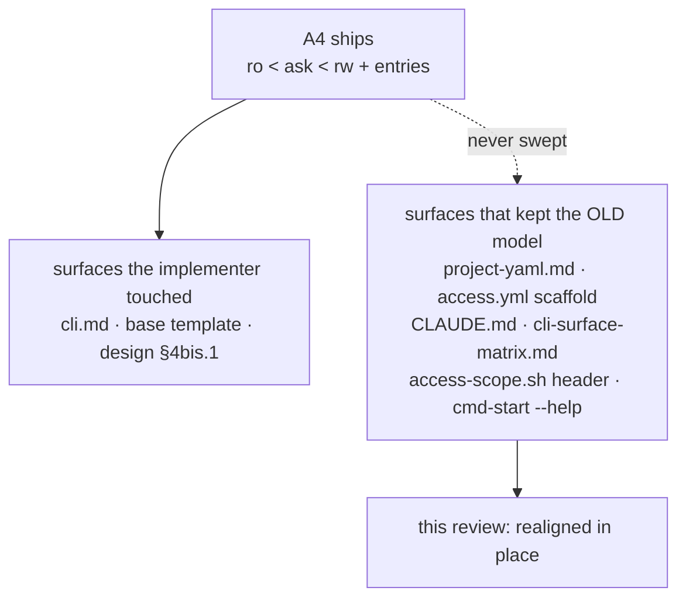

# Documentation review — post-A4 merge, post-FI-67

**Historical record.** `/review-docs` run on `develop` at `3ca4cfa`, after A4 merged and
[FI-67](../../../improvements.md) closed as [ADR-0057 A2](../decisions/0057-ask-enforcement-plane-and-resource-classes.md#amendments).
2026-08-09.

## Verdict

**Updated in place, with three items raised.** The A4/A2 documentation is honest and well kept — the
ADR amended rather than rewritten, `changelog.yml` #62 extended by #63, `cli.md` corrected in the same
commit as the fix. What the sweep found is the **other** direction: A4 updated the surfaces its
implementer had open, and **six publication surfaces still described the pre-A4 model**.

## Updated in place

| File | What was stale | Realigned to |
|---|---|---|
| `roadmap.md` | FI-67 as an open REVIEW NEEDED; A4 "ready to merge"; `develop` level with origin; tracker `FI-1…FI-66` | FI-67 closed by A2; A4 merged at `3ca4cfa`, **36 ahead, unpushed**; `FI-1…FI-70`; measured baseline `1633/7 of 1640` |
| `docs/users/configuration/reference/project-yaml.md` | lattice `ro\|rw`, **no rows** for `entries.*` — the schema reference did not know A4 existed | ADR-0057 D1/D2/D5/D7: `ro < ask < rw`, the four class rows, the gate-not-boundary note on `claude_md` |
| `lib/cmd-init.sh` (the `~/.cco/access.yml` scaffold) | "four axes on the `ro < rw` lattice", no `entries`, and *"a read-only cco session keeps .claude read-only too"* — false after D7 | the base template's structure; stays **fully commented** (`test_init_scaffolds_commented_access_yml` green) |
| `CLAUDE.md` | `ro < rw`; *"a default read-project session reports `claude_access: none`"* — which the code **deliberately refuses** to do (`_claude_triple_preset` compares matrices) | ADR-0057, plus a bullet on the two enforcement planes |
| `lib/access-scope.sh` | Axis-B header comment: `ro < rw`, "every `{ro,rw}^4` combination is legal" — contradicted **six lines below** by `_claude_rank` | `ro < ask < rw` on Cr/Cp, two-valued Cg/Co, pointer to D2/D3/D11 |
| `lib/cmd-start.sh` (`--help`) | *"`none` (locked)"* — the last user surface still carrying the word A2 replaced | *"`none` (refused, zero prompts)"* |
| `docs/maintainers/cli/reference/cli-surface-matrix.md` | Axis B on `ro < rw`; `.claude` "read-only by default" with no exception | `ro < ask < rw` + `entries.claude_md: ask` as the one exception |
| `design.md` | §4bis lattice with no pointer to §4bis.1; header still "awaiting `cco build` + e2e v2" | pointer added; status accepted/reviewed-twice/merged; `cco build` **not** a prerequisite; `_locks` listed |
| `docs/maintainers/README.md` | `FI-1…FI-51`; the leaf table omitted `reviews/` | `FI-1…FI-70`; `reviews/` listed as historical, like `decisions/` |

**Annotated, not rewritten** — `acceptance/0057-acceptance-results.md` gained a dated forward
annotation stating *what check 4 covered* (the two `.claude` trees, never `<repo>/**/CLAUDE.md`) with a
pointer to FI-67 → A2. §§1–6 stay verbatim. It was the last historical record still asserting
*"`none` is genuinely locked"* without qualification.

**Verification**: full suite `1633 passed · 7 failed · 1640`, the 7 compared **name for name** with the
known host-only set (FI-19), `Results:` line present. Targeted re-runs after the edits: 232/232 and
162/162. bash 3.2 parse of the three touched `lib/` files rc=0, with a planted negative control
returning rc=2 — the oracle discriminates. Link check over 253 files: no new broken links.

## Raised

1. **`cli.md` promised more than the predicate enforces** — *"a refusal when it is `ro`"*, stated
   unconditionally, while `_claude_matrix_locks` emits the deny only when **every** in-reach tree
   resolves `ro`. In the mixed cell (`current=rw` with `entries.claude_md=ro`) neither rule is
   emitted. `design.md` says so ("left ungoverned"); the user document did not. **This is FI-67's own
   failure mode one level down**, in text written the same day the amendment landed. *Corrected in
   this pass*: the guarantee block now names the combination that gets neither rule, and why.
2. **`handoff.md` is obsolete and actively misleading** — lists the FI-52 decision, the check 1/3
   re-run, the FI-25 mask and the merge as pending, all done, and carries *"✅ `none` is genuinely
   locked"* at line 57. Ephemeral by policy: deleted and rewritten by `/handoff`, never patched.
   ⚠ Highest-priority of the three — project memory says *"Start from `docs/maintainers/handoff.md`"*,
   so it is the first document the next session reads.
3. **`design-config-editor.md` describes an access model replaced twice** — filed as
   [FI-71](../../../improvements.md). A living doc on a security surface, overstating the built-in's
   privilege. Passed to the `documenter` rather than patched inline, because the doc predates two ADRs
   and the three flagged lines are a lower bound.

## Not touched — placement decisions, not corrections

- `cco whoami` explains `ask` (`lib/cmd-whoami.sh:176`) but not that `ro` on `claude_md` now produces a
  **refusal**. Natural candidate for the FI-53 round, which is open against that same surface.
- The `acceptance/` leaf in the access domain is invented relative to the pack's canonical set
  (`analysis/ design/ decisions/ reviews/`). Moving it would break links from ADRs and the roadmap, so
  it is a taxonomy decision rather than a fix.

## Good practices worth repeating

- **`changelog.yml` #62 extended by #63 rather than rewritten.** Users notified of the old behaviour
  are owed the correction as its own entry. Reusable model.
- **A2 corrected its claims in the same change as the fix.** Without it the deny would have replaced a
  false promise with a subtler one — and it is why this review was short.
- **Scope annotation instead of a verdict** on historical records: the acceptance file is told what its
  check covered, not that it was wrong. Same shape already used for A1.
- **`_claude_matrix_locks` documents the ALL/ANY asymmetry at the point of use**, with the reason
  (`deny → ask → allow` would revoke a granted write). That comment is what let this review verify the
  mixed cell without re-deriving the argument.
