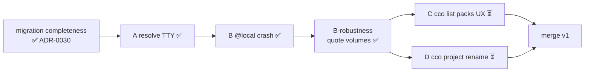
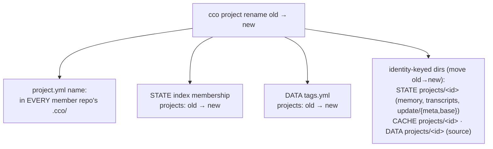

# Handoff — Dogfooding follow-ups C (`cco list` packs UX) + D (`cco project rename`)

**Status:** 🟡 OPEN, pre-merge. Two defects found during host e2e dogfooding of `cave-flow`
(2026-06-28), branch `feat/vault/decentralized-config`. Lower severity than the already-fixed
A/B mount-resolution defects — scheduled for **separate sessions**, both **before merge**.
**Audience:** the maintainer-dev picking up C or D in a fresh session.

> Self-contained: read top-to-bottom, then start at the chosen section. Confirm every code
> reference from source before changing it. Baseline at handoff: suite **953/0**; next free ADR
> **0031**; commits LOCAL (push from Mac).

## Context

The dogfooding sequence so far (see `migration-completeness-fix-handoff.md` + roadmap §"Dogfooding
findings"): migration completeness (ADR-0030) ✅; **A** `cco resolve` never prompted ✅; **B**
`cco start` crashed on a leaked `@local` mount source ✅; **B-robustness** compose volumes now
quoted ✅. C and D are the remaining two, independent of each other.

---

## C — `cco list` packs: table formatting + sort

### Symptoms (reported)
1. The **packs table wraps / mis-paginates** (columns misalign and break onto a new line).
2. **No sort by tag.**
3. **No ascending/descending choice.**

### Code map (verify from source)
| What | Where |
|---|---|
| Unified compact index + flag parsing | `lib/tags.sh` → `cmd_list()` (**:285–360**). Flags today: `--tag <t>`, `--sort kind\|name` (**:308–311**); compact render `printf '%-10s %-26s %s\n'` (**:356–359**); final `LC_ALL=C sort -t'\t' -k1,2` (**:357**). |
| Rich per-kind **packs** view (the wrapping table) | `lib/cmd-pack.sh` → `cmd_pack_list()` — fixed header `NAME              KNOWLEDGE  SKILLS  AGENTS  RULES` (**:88**) + `printf "%-18s %-11s %-8s %-8s %s\n"` (**:104**). |
| Tag reads (for a tag-sort key) | `lib/tags.sh` → `_tags_get <kind> <name>` (**:41**) |

### The three sub-issues + suggested direction
- **C1 — formatting/wrapping.** Both renderers use **hardcoded** column widths
  (`%-18s`/`%-10s %-26s`). A pack name (or a long tag list) wider than its column **shifts** the
  rest of the row → the misaligned/“wrapped” look, especially in a narrow terminal. Options:
  (a) **truncate/ellipsize** each field to its column width (simplest, deterministic), or
  (b) **compute column widths dynamically** from the actual rows (two passes), or
  (c) pad-and-let-it-overflow but never inject a newline. Keep it **bash 3.2 + macOS** clean (no
  `column -t` reliance — BSD `column` differs; if used, guard it). Recommend (a) for the compact
  index and (b) for `cmd_pack_list` if names are commonly long.
- **C2 — sort by tag.** Extend `--sort` to accept **`tag`** (`:309–310` validation + the
  `sortkey` at `:346`). Sort key = the resource’s first tag (or the joined tag string);
  untagged → sort last. Update the `_list_collect` pipeline’s sort accordingly.
- **C3 — ascending/descending.** Add a direction: either a `--reverse`/`-r` flag or a
  `--sort <key>:desc` suffix. Mechanically it’s `sort … -r` at `:357` (and the bare-kind views).
  Pick ONE spelling and document it.

### Decisions / docs
- **No new ADR** expected — these are **additive flags + a cosmetic fix** that *refine* the
  `cco list` surface defined in **ADR-0029 D1**. If a non-obvious choice arises (e.g. the
  `--sort tag` tie-break, or the asc/desc spelling), forward-annotate ADR-0029 rather than
  opening a new ADR.
- Update `docs/users/reference/cli.md` (the `cco list` section + §3.16-ish) and the in-CLI
  `cco list --help` to match. No changelog (pre-merge, internal to the in-development surface).

### Test plan
- `tests/test_tags.sh` (or wherever `cco list` is covered): a fixture with a **long** pack name
  + multi-tag resource → assert no row exceeds the intended width / no embedded newline; assert
  `--sort tag` orders by tag; assert `--reverse` (or `:desc`) inverts a known order. Macro: the
  rendered table must be **column-stable** for long values.

---

## D — `cco project rename <old> <new>`

### Symptom (gap)
There is **no supported way to rename a project**. The user asked after `cco sync`. A project is
identified by its `name:` (ADR-0024 D1), and that identity is the key for several stores, so a
correct rename is a **multi-store atomic re-key**, not a single-file edit.

### What a rename must re-key (all keyed by the project name)

### Code map (verify from source)
| Store | Helper / API |
|---|---|
| Project identity (name → id) | `lib/paths.sh` → `_cco_project_id()` (**:96**) — read it; the id derives the dirs below |
| Identity-keyed dirs | `_cco_project_session_memory` (**:160**) / `_cco_project_session_transcripts` / `_cco_project_meta` (**:120**) / `_cco_project_base_dir` (**:125**) / `_cco_project_source` (DATA) / `_cco_project_cache_managed` (**:146**) — all `…/projects/$(_cco_project_id)/…` |
| Index membership | `lib/index.sh` → `_index_get_project_repos` (**:191**), `_index_set_project_repos` (**:195**), `_index_remove_project` (**:201**), `_index_list_projects` (**:179**) |
| Member repo paths | `_index_get_path <name>` per member → `<repo>/.cco/project.yml` (the synced copies to rewrite) |
| Tags | `lib/tags.sh` → `_tags_get`/`_tags_add`/`_tags_remove` (no `_tags_rename` yet — add one or get+remove+add) |
| Name-uniqueness precedent | `lib/migrate.sh` `_cco_migrate_project` F12 check via `_index_get_project_repos <new>` (**~:695**) |

### Suggested approach (one new verb, `lib/cmd-project-*.sh`)
1. **Resolve** the project (cwd-first or by-name), get its member repo names via
   `_index_get_project_repos <old>`.
2. **Validate** `<new>`: charset (mirror `cmd-start` name validation), reserved names
   (`tutorial`/`config-editor`), and **uniqueness** (`<new>` not already bound — F12 pattern).
3. **Rewrite `name:`** in `<repo>/.cco/project.yml` for **every** member repo that has one
   (host + synced members); a member unresolved on this machine → **warn + skip** (partial,
   surfaced — like `cco sync`).
4. **Re-key the index**: `_index_set_project_repos <new> <members…>` + `_index_remove_project <old>`
   (or add `_index_rename_project`).
5. **Re-key DATA tags**: `projects: <old> → <new>` in `tags.yml`.
6. **Move identity dirs**: `<state>/cco/projects/<old> → <new>`, same for `<cache>` and `<data>`
   (no-op when a dir is absent). Use the `_cco_project_id` of old/new (mind the name→id
   sanitization — if two names map to the same id, that’s a uniqueness clash to reject).
7. **Atomicity**: do steps 4–6 (machine-local stores) together and guard them; the step-3
   project.yml edits live in git working trees and **cannot** be transactional across repos →
   apply them, then **warn to commit + sync** each changed member repo (P17 delegate-to-git,
   mirroring `cmd_sync`’s closing warnings).

### Decisions / docs
- **NEW ADR-0031** — this is a genuine lifecycle decision (a new identity-mutating verb): record
  the rename semantics, the **atomicity boundary** (machine-local stores re-keyed together;
  cross-repo `project.yml` edits delegated to the user’s git flow), member-repo partial handling,
  and the name→id sanitization rule. Relate to ADR-0021 (lifecycle: `forget`/`migrate`),
  ADR-0024 D1 (identity), ADR-0023 D1 (`cco project` namespace).
- Update `docs/users/reference/cli.md` (`cco project` section) + `cco project --help`. No
  changelog (pre-merge).

### Edge cases
- Member repo unresolved here → partial rename + explicit warn (don’t silently leave `<old>`).
- `<new>` collides with an existing project / a name→id clash → reject before any write.
- `memory`/`transcripts` dirs may not exist yet (never started) → move is a no-op.
- A repo hosting `<old>` is also a *member* of another project → only the `<old>` project.yml is
  touched (projects don’t cross-reference; verify the repo’s own `.cco/project.yml` `name:` is the
  one being renamed).

### Test plan
- New `tests/test_project_rename.sh` (or extend `test_migrate.sh`/`test_resolve.sh` fixtures):
  set up a 2-member project + tags + a STATE memory dir; run rename; assert **every** member
  `project.yml` `name:` updated, index membership re-keyed (`<old>` gone, `<new>` present with
  same members), tags moved, and `<state|cache|data>/cco/projects/<old>` → `<new>`. Negative:
  rename to an existing name is rejected with no partial write to the machine-local stores.

---

## Working agreement
- Per `.claude/rules/workflow.md`: analysis → design (gate) → implement+test (green per phase) →
  docs. Atomic commits; tests alongside; LOCAL commits (push from Mac).
- C and D are **independent** — either order. C is smaller (UX); D needs ADR-0031.
- Reading order: this handoff → for C: `lib/tags.sh` `cmd_list` + `lib/cmd-pack.sh` `cmd_pack_list`
  + ADR-0029; for D: `lib/paths.sh` identity helpers + `lib/index.sh` membership + `lib/tags.sh`
  + ADR-0021/0024.

*Generated with Claude Code*
