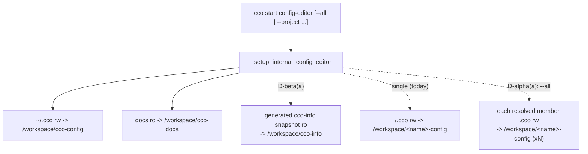

# Handover B (POST-MERGE / develop) — config-editor & tutorial access scope

> **Created**: 2026-06-29 · **Track**: feature design. Runs on `develop` **after** the v1 merge;
> ships in v1 or a point release (**additive — does NOT gate the merge or the release**).
> **Siblings**: Handover A (docs/CLI cutover sweep — ✅ done, merged into `develop`) ·
> Handover C (`../../engineering/npm-packaging-distribution-handoff.md`, release-gating). On develop,
> B and C run in parallel; **C is release-gating, B is additive** — sequence per maintainer priority.

Coordination artifact. Authoritative design will be a new **ADR-0036** + a rewrite-in-place of
`docs/maintainers/internal-projects/config-editor/design/design-config-editor.md` (living doc).

---

## 1. The ask vs reality

The maintainer raised: config-editor *"should become an internal project, like tutorial"* — **it already
is** (`internal/config-editor/`, reserved name, runtime-generated `project.yml`, ADR-0027). The real open
question is its **access scope**: today it edits `~/.cco` (global) + **one** target project; the
maintainer wants it to **edit any project's config + global, with access to all projects' repos and to
"cco info"**. Tutorial should get a *partial* (read-only) version.

## 2. Current state (ADR-0027, code-grounded in `lib/cmd-start.sh:42-207`)

| Aspect | Today |
|---|---|
| Instantiation | Reserved name; `_setup_internal_config_editor` refreshes `.claude/` + **generates** `project.yml` at start (host paths injected via the in-process mount override `_CCO_MOUNT_OVERRIDE`, never committed — AD3/G8). |
| Mounts | `~/.cco` **rw** → `/workspace/cco-config`; `docs/` **ro** → `/workspace/cco-docs`; **project mode** (`--project <name>` or cwd-hosted) adds **that one** project's `<repo>/.cco` **rw** → `/workspace/<name>-config`. |
| Edit-protection | Exempt (`is_internal=true`) — the sanctioned agentic edit path (ADR-0027 D3). |
| cco "info" (index/tags/remotes/DATA/STATE) | **Not mounted** by design — machine-local, "managed only via `cco …`, never hand-edited". |
| cco CLI in-container | **Host-only** — the agent prints host commands; cco does not run inside. |
| Docker socket | `mount_socket: false`. |
| Tutorial | `~/.cco` **ro** + `docs/` **ro**; `repos: []`; no project mounts. |

## 3. Design dimensions & options (resolve with the maintainer)

**D-α — All-projects access.** Enumerate the STATE index and mount each **resolved** member's
`<repo>/.cco` rw (skip unresolved). Options:
- (a) **Opt-in flag** `cco start config-editor --all` (default stays single-target/global) — least
  surprising, bounded blast radius. *(recommended default)*
- (b) **Always all** — most convenient; crowded workspace + large rw surface every session.
- (c) **Multi-target** `--project a --project b` — explicit subset.
Editing project X's `project.yml` does not propagate — the agent must tell the user to `cco sync`
(host-only). Consistent with the decentralized model.

**D-β — "cco info" exposure** (index/DATA are deliberately not hand-editable):
- (a) **Generated read-only snapshot** at start (dump `cco list` / project→path / tags / remotes /
  divergence-state into `/workspace/cco-info/…`) — respects "managed via cco", zero write risk.
  *(recommended)*
- (b) **Read-only mount** of STATE index + DATA registries — live but raw; still read-only.
- (c) **cco read-subset in-container** — needs cco + deps in the image and the buckets mounted; biggest
  change, likely a later iteration.

**D-γ — Safety.** Rw to *all* project configs + global is a wide surface. Keep/extend
`config-safety.md`: explain-before-write, diff-before-overwrite, never secrets, confirm destructive; add a
session-end **per-project "touched" summary** listing the exact `cco sync` / `cco config save` commands to
run on the host.

**D-δ — Tutorial partial.** Likely just D-β(a) (read-only info snapshot) + keep `~/.cco` ro; no project
config rw. Teaching stays read-only — its whole point vs config-editor.

**D-ε — Workspace layout / naming.** With N project mounts settle target paths (`/workspace/<name>-config`)
and avoid collisions with `cco-config` / `cco-docs` / `cco-info`.

## 4. Open questions for the maintainer
1. All-projects = opt-in flag (D-α a) or always (b)? Default scope when neither `--project` nor `--all`?
2. cco-info via generated snapshot (D-β a) or read-only mount (b)? Which fields (list, tags, remotes,
   index paths, divergence/sync-state)?
3. Any **write** needed to cco-internal state, or read-only sufficient (all mutation via host `cco …`)?
4. Tutorial: read-only info snapshot only, or more?

## 5. Recommendation
Frame as **ADR-0036, additive**: new `--all`/repeatable-`--project` + extra mounts + a snapshot generator
in `_setup_internal_config_editor`, doc updates, and tests (`tests/test_config_editor.sh`). It does not
touch the merge or the release gate, so it can land any time on develop. Keep it independent of the
docs sweep (Handover A) and the npm work (Handover C).

## 6. Definition of done
- ADR-0036 records the chosen D-α/D-β/D-γ/D-δ options.
- `_setup_internal_config_editor` implements them; `config-safety.md` + the config-editor CLAUDE.md updated
  (note: Handover A fixes that file's *stale* refs first — coordinate so edits don't collide).
- `tests/test_config_editor.sh` covers all-projects mounts, the cco-info snapshot, and the single/global
  defaults; suite green.
- `design-config-editor.md` rewritten in place to the new behavior.

## 7. Reading order
ADR-0027 → `design-config-editor.md` → `lib/cmd-start.sh:42-207` (setup + dispatch) →
`internal/config-editor/.claude/` (CLAUDE.md + config-safety.md) → this handover.
