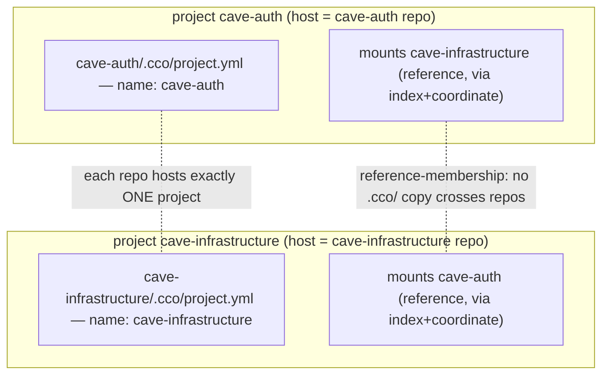

# ADR 0024 — Repo ↔ Project: Multi-Reference, One Config Home per Repo

**Status**: Accepted (2026-06-22)
**Deciders**: maintainer + design session
**Context docs**: `../RD-repo-multi-project.md` (problem framing), `../design.md`
§2.1/§2.4/§3/§4/§9, `../guiding-principles.md` (P5/P13, **+P18 added by this ADR**)
**Related ADRs**: 0001 (decentralization), **0002 (machine-agnostic symmetric config —
refined here, D1)**, **0003 (sync-as-copy — sync-set refined here, D6)**, 0004
(config/state/cache separation), 0005 (dual-`.claude`-scope), 0016 D2 (uniform manifest),
0019/0022 D4 (pack resolution), 0021/0023 D4 (`internalize` family), 0022 D2 (global-flat
index), 0023 (command surface).

> **Grounds in the TARGET design, not the transitional P0/P1 code.** Where the live code
> still reads project files from the legacy central `$PROJECTS_DIR` (e.g.
> `mcp.json`/`setup.sh`/`mcp-packages.txt`), this ADR reasons from the **final** model in
> which those files live in `<repo>/.cco/` (§2.1 H5) and are read from the **invoking
> repo** after the P2/P3 cutover. The implementation must converge to this target; the
> transitional state is not evidence (P10: classify by role, not by current surface).

---

## Context

A repo can be a member of **more than one project**. Canonical example: `cave-auth`
**hosts** project `cave-auth` *and* is **referenced** by project `cave-infrastructure`
(which is hosted in its own repo and mounts `cave-auth`), and symmetrically
`cave-infrastructure` is referenced by `cave-auth`.

The decentralized model gives each repo exactly one `<repo>/.cco/` holding one
`project.yml`; ADR-0002 declares it *"byte-identical across a project's repos"* with the
host = the **invoking repo at runtime** (AD6). The unstated assumption **1 repo ⇒ 1
project** breaks when a member repo hosts a *different* project: `cco sync` would clobber
that repo's own config, and cwd `cco start` becomes ambiguous.

Two facts narrow the gap:
- The **whole `<repo>/.cco/` is per-(hosted-)project config** (§2.1) — not only
  `project.yml`. So "N projects in one repo" would mean **N full `.cco/` subtrees**, not N
  small files.
- **Multi-reference already works** (Case A): the index `projects:` map is
  multi-membership-capable (ADR-0022 D2), and a referenced repo is mounted by logical
  name + embedded coordinate without carrying that project's `.cco/`.

The real gaps, surfaced and analysed across **fronts A–E** (see *Analysis* below):
1. the one-vs-N **config-home** meaning (front D/topology);
2. a `cco sync` **clobber-guard** (front D);
3. the cwd `cco start` **rule** (front D);
4. the `.claude` **scope hierarchy** clarity (front A);
5. repo↔project **observability** (front C);
6. **sync-set completeness** (front B);
7. the **axis-1/2** correlation for project sharing (front E).

---

## Decision

### D1 — One config home per repo; referenced by N (Option 1 ≡ Option 3)

`<repo>/.cco/` (the whole tree) holds the config of **exactly one** project — the one the
repo **hosts**, identified by the `name:` in the present `project.yml`. A repo may be a
**reference-member** of **N** other projects via the index (`projects:` membership) + the
referencing project's embedded coordinate (Case A). **1 repo = 1 development scope.**

- **Supported — the normal interdependency case.** Different projects referencing the same
  repo while each project lives in its **own** host repo. E.g. `cave-auth` hosts+shares
  `cave-auth` (mounts `cave-infrastructure`) while `cave-infrastructure` hosts+shares
  `cave-infrastructure` (mounts `cave-auth`): two host repos, two remotes, two distinct
  audiences. Legitimate — the shared repo is mounted by both, but the two projects are
  **distinct development scopes**.
- **Not supported (Option 2) — a single repo as the config home of two projects at
  once.** This is **bad practice** (a repo is one development scope): you cannot initialise
  two projects on the same repo. **Workaround:** create a second, **config-only** host repo
  with a divergent project config (Case C) that references the original repo as a member;
  `cco start <P2>` from there mounts the original repo. Natively supported, no schema change.

ADR-0002 §1 is refined accordingly: *"byte-identical across a project's repos"* is scoped
to a project's **config-bearing repos** (host + synced same-name members); **a repo hosts
at most one project**.

### D2 — `cco sync` clobber-guard (skip + warn; **no** prompt/`--force` override)

Before writing the synced set into a target repo `T`, `cco sync 
` (source project `P`):

| `T` state | Action |
|---|---|
| no `<repo>/.cco/project.yml` (code-only) | receives the copy (Case A → B) |
| `project.yml` `name == P` | converge (normal sync) |
| `project.yml` `name != P` (hosts a **different** project) | **skip + warn**, never clobber |

There is **no override** (no `--force`, no prompt). To re-home a repo to a different
project the user must explicitly **de-init** the repo's `.cco/` (remove the old config)
*then* sync, or **re-init** the repo with explicit `--sync`. The guard never erases or
overwrites a different project's config. Syncing a **subset** of same-name members stays
valid. The guard keys on the `project.yml` `name:` (D1's discriminator), so the whole
synced set (D6) is skipped for a foreign-hosting target — not just `project.yml`.

This guard protects sync-set **mutation safety** (a git-level concern, cf. P17) — **not**
referenced-resource **reachability**. A foreign-hosting repo is still a first-class reference,
resolved normally via the index + coordinate; P14's "never hard-block" governs *reachability*
(a missing coordinate is warned, never blocked), whereas this guard refuses to *overwrite* a
different project's config (like git refusing a non-fast-forward push). The two are orthogonal.

### D3 — `cco start` cwd rule

From a repo dir, `cco start` (no name) resolves to the project the repo **hosts** (its
`project.yml` `name`; AD6 — **unambiguous under D1**). To start a project the repo only
**references**, pass the name explicitly (`cco start <project>`) or `--from <repo>`. A repo
that hosts nothing (pure code-only member) has no local `project.yml` → `cco start`
requires an explicit name. (Source-precedence for by-name start is unchanged: `--from` >
`entry` > prompt, §4.4.)

### D4 — `.claude` scope hierarchy made explicit (front A)

> **Forward note (ADR-0028, 2026-06-27):** the global-user host source below is now
> **`~/.cco/.claude/`** — the `global/` wrapper was flattened away. Read every
> `~/.cco/global/.claude/` in this ADR as `~/.cco/.claude/`. Body kept as history.

Four `.claude` scopes compose in a session — **three user-managed + one framework-managed**:

| Scope | Host source | Container path | Claude Code scope | Synced by cco? |
|---|---|---|---|---|
| Managed | `defaults/managed/` (baked) | `/etc/claude-code/` | Managed — **own path, highest priority, not merged into user global** | n/a (image) |
| Global user | `~/.cco/global/.claude/` | `~/.claude` | User | Axis-1 (`cco config push/pull`) |
| **Project / cross-repo** | **`<host-repo>/.cco/claude/`** | `/workspace/.claude` (rw) + cache `:ro` overlays | Project | **yes (sync-as-copy)** |
| Repo-native | `<repo>/.claude/` | `/workspace/<repo>/.claude` | Nested (on-demand) | **never** (cco never touches it) |

Two consequences are now explicit:
- **`<repo>/.cco/claude/` is per-(hosted-)project and never leaks cross-project.** Only the
  **invoking** repo's `.cco/claude/` becomes `/workspace/.claude` (ADR-0005 §3, no
  privileged repo); a repo that merely *references* another project does not mount that
  project's `.cco/claude/`. A repo hosting its own project `Q` does **not** leak `Q`'s
  cross-repo config into a session for project `P` that mounts it.
- **`<repo>/.claude/` (repo-native) is the cross-cutting tree**: loaded for every project
  that mounts the repo *and* for native (non-cco) Claude use; cco never reads/syncs it.

**Placement guidance** (to surface in config UX + guides):

| Intended reach | Put it in |
|---|---|
| cross-cutting whenever this repo is mounted (+ native Claude) | `<repo>/.claude/` (repo-native) |
| this project, across all its repos | host repo's `<repo>/.cco/claude/` (project scope) |
| all of my projects on this machine | `~/.cco/global/.claude/` |
| non-overridable framework policy | `defaults/managed/` (managed) |

D1 keeps this map unambiguous: one hosted project per repo ⇒ `<repo>/.cco/claude/` has a
single meaning.

### D5 — Repo↔project observability (front C)

cco must let the user determine, at any time: **(a)** which project a repo **hosts**
(`<repo>/.cco/project.yml` `name`); **(b)** which projects **reference** a repo (reverse
lookup over the index `projects:` map — a **new internal helper** `repo→projects`, since
today only the forward `project→repos` exists); **(c)** which member repos are
**synced / divergent / code-only** (reuse the sync-meta fingerprints, §4.6).

Surface by **extending the existing command surface** (no new top-level verbs — consistent
with ADR-0023's consolidation):
- `cco project show 
` lists, per member repo, its **role** (host · synced · divergent ·
  code-only) and **referenced-by** (other projects referencing it);
- a **repo-centric view** when invoked from a repo dir ("this repo hosts `
`; referenced
  by `<Q,R>`; sync: …");
- the passive **⚠ badge** at `cco start`/`cco list` (F49);
- the **D2 sync warn** on a foreign-hosting target.

Exact wording is maintainer-confirmed during build (P10 lesson b).

### D6 — Sync-set = the whole committed `.cco/` (front B; **refines ADR-0003**)

The synced set is the **entire committed, machine-agnostic `<repo>/.cco/` tree** — it is
config-only by construction (all internal/machine-specific data is *evicted* to
DATA/STATE/CACHE, §2.1) — **minus** the gitignored `secrets.env` (the `secrets.env.example`
skeleton **is** synced).

This **corrects an inconsistency**: §2.1 H5 places `mcp.json` / `setup.sh` /
`mcp-packages.txt` in `<repo>/.cco/` as project config, but ADR-0003/§4.1 enumerated only
`project.yml + claude/** + secrets.env.example`. In the **target** model `cco start` reads
those files from the **invoking** repo's `.cco/`, so two config-bearing members of one
project could diverge in MCP servers / setup / packages → **broken Case-B parity** (the
session differs, lacks tools, or errors). Tying the synced set to the §2.1 **bucket
definition** (rather than an ad-hoc enumeration) is **self-maintaining** — a new
project-config file syncs for free.

- **`packs/` — sync *authored* packs only.** A `packs:` entry **without** `url` is a
  project-local **source** (P15) and must travel for parity → **synced**. A **url-present**
  entry is a **cache** of an upstream (ADR-0019/0022 D4) → **not synced** (re-fetchable;
  syncing it risks the D4 same-name collision). The discriminator is the **coordinate the
  resolver already reads** in `project.yml`, not a flag in the pack files.
- The **§4.6 fingerprint** hashes this same expanded set — one definition feeds write +
  compare, so they never drift.

Excluded forever: `secrets.env` (security), the repo-root `.claude/` (repo-native, D4),
and the internal buckets (already evicted, §2.1).

### D7 — Axis-1/2 for project config (front E): distributed sharing; future opt-in compatible

Under D1, project config is **distributed per host-repo**; the audience boundary coincides
with each host repo's remote. Therefore:
- "share **all** projects a repo belongs to" and "share a **subset**" are **already**
  satisfied **by construction** — each project shares via its **own** host repo's remote
  (Axis-1+2, P5); you choose per host repo. **No new feature.**
- "share **none** on Axis-2 (private / Axis-1-only)" is the **pre-existing solo-adopter gap
  A4** (P5): (A) gitignore now; (B) opt-in **centralization under `~/.cco/projects/`**
  (Axis-1-only, outside the repo) — **post-v1**, the `cco project internalize` family
  (ADR-0021/0023 D4). Multi-project does **not** create this gap; it makes it more visible.

Option 1 is **compatible** with the future opt-in: a referenced repo that should not carry a
project's config uses the same centralization path. **Confirmed: keep post-v1, no v1 scope
increase**; record the correlation so the future analysis layers cleanly on D1.

---

## Alternatives Considered

| Alternative | Pros | Cons | Verdict |
|---|---|---|---|
| **Option 2** — N config homes per repo (`<repo>/.cco/projects/<name>/…`) | any project startable from the shared repo; full symmetric resilience | it is **N full `.cco/` subtrees**, not N yaml files (project.yml + claude/ + mcp.json + setup.sh + packs/) → heavy schema change that **violates P2 build-once**; breaks AD6 (cwd always ambiguous → name required); **cross-team audience leak** (a member repo carries another project's config to *its* team via the shared remote); `git diff` noise | **Rejected** |
| **Option 3** — sync-member ≤1, reference-member N | — | substantively identical to Option 1 ("≤1" just names the code-only case) | **Folded into D1** |
| **include / symlink** another project's manifest into the shared repo | one physical copy | breaks machine-agnostic config + truthful `git diff` (AD3/G8); couples repos on the filesystem | **Rejected** |

---

## Consequences

**Positive** — satisfies the maintainer hard-constraint (multi-reference keeps working —
it is Case A); **no schema change ⇒ P2 build-once preserved**; more correct than Option 2
on the audience/privacy axis; the re-coherence sweep is **narrow** (the D2 guard + D6
sync-set in `lib/cmd-sync.sh`/`lib/sync-meta.sh`, an **additive** index reverse-lookup, the
D5 observability UX); the `.claude` placement model becomes unambiguous; D6 fixes a latent
Case-B parity bug before it ships.

**Negative** — a repo that hosts its own project cannot *also* be a config-bearing (Case-B)
copy of another project (it participates by reference) — marginal, since each project has
its own host and the index+coordinate model resolves a missing host on demand; the D6
sync-set expansion and the D2 guard touch **already-built P1 code** (re-coherence sweep,
keep the suite delta-green).

---

## Analysis (fronts A–E)

**A — `.claude` hierarchy & container composition** (ground: ADR-0005, design §2.1/§2.2,
`lib/cmd-start.sh` compose generation). Four scopes (D4). The session's project scope
`/workspace/.claude` is sourced from the **invoking** repo's `.cco/claude/` only → **no
cross-project leak** of project config; only the repo-native `<repo>/.claude/` is
cross-cutting (by design, cco never touches it). The managed tree has its **own** path with
top priority (not merged) — the "more correct" arrangement. D1 makes the placement map
unambiguous.

**B — sync-set completeness** (ground: ADR-0003, §2.1 H5, §4.1/§4.6, `lib/sync-meta.sh`).
The enumerated subset (`project.yml + claude/** + secrets.env.example`) is **inconsistent**
with §2.1 H5, which places `mcp.json`/`setup.sh`/`mcp-packages.txt` in `<repo>/.cco/`. The
live code still reads them from the **legacy** `$PROJECTS_DIR` (transitional, not the
target). In the target model the exclusion **breaks Case-B parity** → expand to the whole
committed `.cco/` minus `secrets.env`, packs authored-only (D6).

**C — observability** (ground: `lib/index.sh`, `lib/sync-meta.sh`, `lib/cmd-project*.sh`).
The state to answer (a)/(b)/(c) exists, but (b) reverse-lookup has **no helper/CLI** and (c)
sync-status is **not surfaced**. Extend the existing surface (D5).

**D — config/sync modes × multi-reference** (ground: §4.5 Cases A/B/C). Mapped to D1–D3:
host vs synced vs divergent members of *one* project, vs reference-members of *other*
projects; the clobber-guard (D2) protects a foreign-hosting target across all three modes.

**E — Axis-1 vs Axis-2 for project config** (ground: P5/P13 A4, §6, ADR-0008/0018, ADR-0023
D4). Distributed per-host-repo sharing already covers "all"/"subset"; "none/Axis-1-only" is
the existing post-v1 A4 gap; D1 is compatible with the future `~/.cco/projects/`
centralization (D7).

---

## New principle (distilled into `guiding-principles.md`)

> **P18 — One repo, one config home; referenced by many.** A repo hosts **at most one**
> project's config (`<repo>/.cco/`, identified by `project.yml` `name`) = **one development
> scope**; it may be **referenced** by N projects via the index + embedded coordinate
> (Case A). The symmetric "identical `.cco/` across a project's repos" (ADR-0002) is scoped
> to that project's **config-bearing** members; cco **never** replicates one project's
> `.cco/` into a repo that hosts a different project (the `cco sync` guard skips + warns,
> no override). Multi-**host** in one repo is unsupported (bad practice); multi-**reference**
> is first-class. Config is **distributed per host-repo**, so the audience/sharing boundary
> coincides with each host repo's remote (Axis-1+2 by construction). *(ADR-0024.)*

---

## Open / follow-ups

- **D5 wording** and the D2 sync messages → maintainer-confirm at build (P10 lesson b).
- **Front A/E user-guide rewrites** (the `.claude` hierarchy; "how to share a project") are
  **shipped-behavior** docs → updated at the **Phase-3 cutover** sweep, never ahead of the
  code (documentation-lifecycle rule). Tracked in `resource-coherence-inventory.md`.
- **Re-coherence sweep scoped to ADR-0024** before resuming P2 (RD §8): `lib/cmd-sync.sh`
  (D2 guard, D6 set), `lib/sync-meta.sh` (D6 fingerprint), `lib/index.sh` (D5
  reverse-lookup), the D5 observability UX; keep the suite delta-green. The P0
  `project.yml` schema and the global-flat index are **unchanged**.
