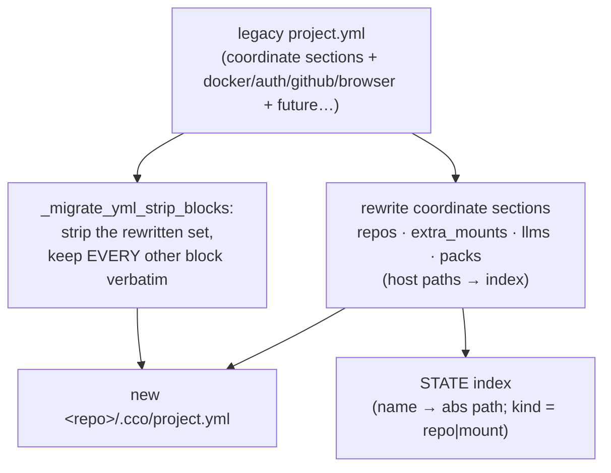

# ADR 0030 — Migration completeness: passthrough-by-default + extra_mounts name synthesis

**Status**: Accepted (2026-06-28) — migration-completeness fix (host e2e dogfooding blocker)
**Deciders**: maintainer + migration-completeness fix session
**Context docs**: [`../migration-completeness-fix-handoff.md`](../migration-completeness-fix-handoff.md)
(the blocker + the A–D phase plan); `../design.md` §9 (migration — "complete final
`project.yml` in one pass") and §11 (phase-2 test plan); `../e2e-validation-checklist.md`
(the gate this unblocked)
**Related ADRs**: **0021 (resource lifecycle — `cco init --migrate` contract)**,
**0023 D5 (`extra_mounts` join the coordinate model; host path in the index, no vendor)**,
**0022 D1 (source→DATA relocation + key rename, F4 publish_target re-derive)**,
0016 D2/D7 (4-bucket taxonomy; M3 remotes de-tokenize split), 0025 (migration ownership —
eager global / lazy project), 0024 D1 (unit identity)

---

## Context

`cco init --migrate <project>` writes the new `<repo>/.cco/project.yml` from the legacy
vault. The first host e2e dogfooding run (2026-06-28) found that the migrated file kept only
`name`, `description`, `repos`, `llms`, `packs` and **silently dropped** `extra_mounts` and the
whole `docker:` / `auth:` / `github:` / `browser:` configuration. The project still started —
the start-time code applies defaults for every absent field — so the loss was invisible. Nothing
was lost at the source (migration is non-destructive; the verified backup is intact), but a
migration that quietly discards user configuration cannot ship.

The writer (`_cco_build_project_yml`) emitted a **fixed set** of sections. That is the root
cause and, more importantly, a recurring trap: every time a new top-level section was added to
`project.yml` (`browser` in project-migration 002, `github` in 004), the migration writer would
have to be taught about it or it would drop it. The test suite never caught any of this because
its fixture only ever contained the five surviving sections.

Two facts forced genuine decisions rather than a mechanical bugfix:

1. **What is the migration's completeness contract?** An allowlist of "sections to carry" repeats
   the bug on the next schema addition. The alternative is a contract where carrying is the
   default and only *transformation* is special-cased.
2. **`extra_mounts` has no logical name in the legacy schema.** Legacy mounts were
   `source:` (host path) + `target:` + `readonly:`. The new schema (ADR-0023 D5) is name-keyed,
   with the host path in the machine-local index. The migration therefore has to *invent* a
   logical name — a legacy field mapping with no pre-existing answer.

## Decision

### D1 — Completeness by construction: transform the coordinate sections, pass the rest through verbatim

`_cco_build_project_yml` rewrites only the sections that carry host paths or coordinates —
`name`, `description`, `repos`, `extra_mounts`, `llms`, `packs` — and then **carries every other
top-level section through verbatim**, computed as the *complement* of that strip-set, not a
fixed allowlist (`_migrate_yml_strip_blocks`). Consequences:

- A future top-level section (say `telemetry:`) is migrated **for free** — the drop cannot recur.
- The strip-set is exactly the set of sections that may embed a machine-specific host path; every
  other section is machine-agnostic *by construction*, so the passthrough can never leak a host
  path into the committed config (preserves AD3/G8 — "no local paths in `project.yml`").
- This is the open-closed reading of design §9's "writes the complete final `project.yml` in one
  pass": *complete* means **all configuration**, not only the coordinate sections. The §11 test
  plan's narrower "repos+llms+packs coordinates together" wording is superseded by this ADR.

The maintenance rule: adding a new **coordinate** section means editing the builder *and* the
strip-set (a deliberate, local two-line change). Adding a new **plain** section means doing
nothing — it passes through.

### D2 — `extra_mounts` name synthesis

For each legacy mount the migration synthesizes a logical name, in order of preference:

1. a legacy `name:` if one is present (honoured, never overwritten);
2. otherwise `basename(target)`;
3. otherwise `basename(source)`.

The candidate is sanitized to the logical-name charset (`[a-zA-Z0-9_-]`, separators squeezed and
trimmed) and disambiguated against names already used in the same migration (`api-specs`,
`api-specs-2`, …). The host `source` is expanded (`~` / `$HOME`) to an absolute path and written
to the **STATE index** with `kind = mount`; it never enters the committed `project.yml`. A mount
gets an index *path* but does **not** join project membership (only `repos` are members) — at
start it is resolved by name through `_effective_extra_mounts`, exactly like a fresh project.

### D3 — Two related drops fixed under the same completeness review (no new schema decision)

The broader blind-spot audit surfaced two more silent drops in the *global* migration; both are
carried by existing patterns and need no new schema:

- **Legacy remotes registry** → relocated in `_cco_populate_global_from` with the M3 split
  (ADR-0016 D7): the legacy central `.cco/remotes` stored `name=url` and `name.token=token`
  inline; url lines go to the synced DATA registry (de-tokenized), token lines to the STATE token
  store (0600, never-sync). A plain copy would have leaked tokens onto the synced file.
- **Installed template provenance** → `_relocate_legacy_template_sources`, the exact twin of the
  pack relocation (ADR-0022 D1), so `cco template update` keeps finding a migrated template's
  source.

*Intentional non-drop:* installed `llms` content is **not** migrated — it is re-fetchable CACHE
(ADR-0016 D2/D7); the coordinate survives in `project.yml` and the content is re-fetched at
start.

## Alternatives considered

- **Fixed passthrough allowlist (`docker`/`auth`/`github`/`browser`).** Smallest diff, but it
  reintroduces the exact bug on the next top-level section added to `project.yml`. Rejected — a
  patch that must be revisited, against the "reinforce, don't patch" directive.
- **Copy-the-legacy-file-and-splice (transform in place).** Start from the legacy text and edit
  only the coordinate sections. Same completeness contract as D1, but splicing multi-line blocks
  *into* existing YAML in bash is fragile, and the coordinate transforms pull data from other
  files (`local-paths.yml`, `.cco/source`) so it does not actually simplify them. Rejected in
  favour of "rebuild the coordinate sections + strip-and-append the rest", which never edits
  inside a kept block.
- **`extra_mounts` name = `basename(source)` first.** Rejected: `target` is the stable,
  user-visible container path; two different sources can map to the same target intent, and the
  target basename reads better as a logical name. Source is the fallback when target is absent.

## Consequences

- A migrated `project.yml` is field-for-field equivalent to the legacy one, modulo the intended
  coordinate transforms (host paths → index) — verified by an extended migrate fixture that now
  carries `docker`/`auth`/`github`/`browser`/`extra_mounts` **and an unknown section**, asserting
  each survives (these assertions fail on the pre-fix builder).
- The index TSV gains a third `kind` column (`repo`|`mount`); the migrate consumer registers a
  path for both kinds but membership for repos only.
- No new migration script and no changelog entry — this is an internal completeness **bugfix** of
  an in-development cutover, not a user-facing schema change. `design.md` §9/§11 are updated in
  place (living docs) to state that *complete* means all configuration.
- Re-migration story for an already-migrated project is unchanged: `cco forget 
` +
  `rm -rf <repo>/.cco` + `cco init --migrate 
`.
