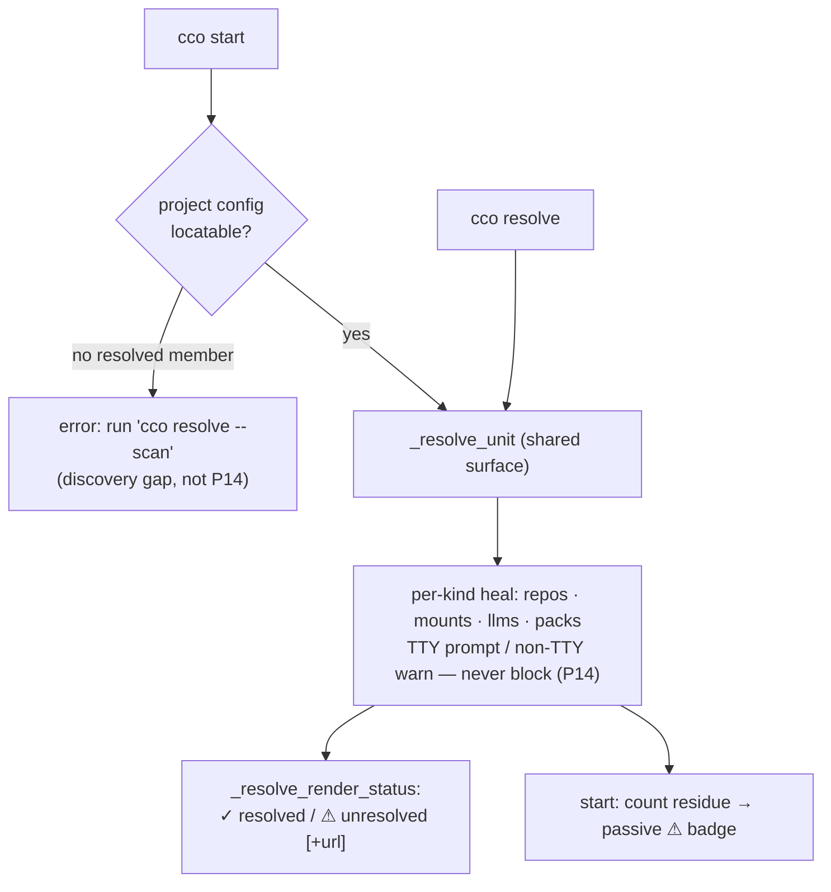

# ADR 0033 — Unified resolution surface: one heal verb for repos/mounts/llms/packs, start invokes resolve

**Status**: Accepted (2026-06-29) — pre-merge **dogfooding follow-up (round 3)** (first host e2e of
`claude-orchestrator` itself after the legacy → decentralized-config migration); decisions D1–D4 land pre-merge
**Deciders**: maintainer + dogfooding session
**Context docs**: `../../roadmap.md` §"Round 3"; the S1 handoff
(`../s1-resolution-surface-handoff.md`); round-3 finding #7 (resolution surface inlined, not a single
reused entry point)
**Related ADRs**: **0017 D2 (consolidated resolution surface — `cco resolve` / `cco start --from`)**,
**0016 D4 (AD5 name uniqueness + the STATE index subsumes `@local`/`local-paths.yml`)**, **0022 D2/D3
(index global-flat + atomic writes + `--scan` non-destructive upsert)**, **0029 D4 (`cco path` demoted
to a low-level escape hatch)**, **0032 D5 (llms heal inside `cco resolve`)**, and **P14 (boundary-less
reachability — never hard-block)**

**Resolves**: a coherence gap surfaced when `cco start` of a freshly-migrated project resolved its
members through a **parallel inlined loop** (`_resolve_project_paths_impl` in `lib/local-paths.sh`)
distinct from the `cco resolve` surface (`_resolve_unit` in `lib/cmd-resolve.sh`) — two callsites
re-implementing the same categorization/resolution loop (the #B10 drift class), with the resolve side
additionally healing llms (ADR-0032 D5) and recording membership while the start side did not. Packs
were healed by neither.

> This ADR records a **consolidation + a small extension**, not a new architecture. ADR-0017 D2 already
> calls for one consolidated resolution surface; ADR-0032 D5 already added llms healing inside
> `cco resolve` under the single-heal-verb principle (P14). This finishes the job: one entry point used
> by both `cco resolve` and `cco start`, extended to the 4th referenced-resource kind (packs), with a
> uniform status view.

> **Not in this ADR**: the pure index-normalization bug-fix (S1 workstream a — normalize at the
> `_index_set_path` boundary, unify the migration's repos/mounts path recovery, clean `cco path list`,
> and the one-shot cleanup migration `016`). That restores ADR-0016 D4 / ADR-0022 D3 behavior and needs
> no decision record.

---

## Context

The decentralized model treats repos, extra_mounts, llms, and packs as **referenced resources**: each
carries a machine-agnostic coordinate in the versioned `project.yml`, and is materialized on this machine
at resolution time (repos/mounts → the STATE index path; llms → CACHE download; packs → a local layer
under `~/.cco/packs` or `<repo>/.cco/packs`). P14 (boundary-less reachability) says resolution layers and
heals but **never hard-blocks**: an unresolved reference is a conscious-skip (warn + exclude), never a
silent empty mount (#B17) and never an abort.

`cco resolve` was the canonical surface for this: `_resolve_unit` looped repos + mounts + llms, offered
per-kind interactive heal on a TTY, warned + counted on non-TTY, and recorded project → member
membership. `cco start`, however, ran its **own** resolution loop (`_resolve_project_paths_impl`, via the
thin `_resolve_start_paths`) which covered only repos + mounts, used different wording, and on a TTY
`[q]uit` called `die "Aborted."`. Packs were healed by neither surface (the `_pack_resolve_dir` comment
even promised "the fetch offered by `cco resolve`", which did not exist).

Round-3 host dogfooding (first real `cco start` of `claude-orchestrator` after its own migration) surfaced
the divergence (finding #7) on top of the index-poisoning data bug fixed separately in workstream (a).

## Decision

### D1 — One resolution entry point

`cco start` invokes the **same** resolve surface as `cco resolve`: `_start_resolve_paths` now calls
`_resolve_unit "$(dirname "$project_dir")"` instead of the parallel `_resolve_project_paths_impl` loop.
The duplicate loop (`_resolve_project_paths_impl` + `_resolve_start_paths`) is **retired** from
`lib/local-paths.sh`. There is one categorization/resolution implementation; the #B10 drift class cannot
recur. `cco start` still computes the passive ⚠ badge by counting the residue via
`_project_effective_paths` after the shared heal runs.

### D2 — Uniform resource-status model, rendered once

A referenced resource has a status of **resolved** (materialized on this machine), **unresolved + url**
(clonable / re-downloadable / installable), or **unresolved, no url**. `cco resolve` renders a status
row per resource across all four kinds (`_resolve_render_status`): `✓ <path|installed>` or
`⚠ unresolved [ (url: …) ]`. The surface therefore **always shows the state of every referenced
resource**, not only the ones it prompted for.

### D3 — Per-kind heal extended to packs (the 4th kind)

`_resolve_unit` heals a referenced-but-uninstalled **pack** from its sharing-repo `url`, mirroring the
llms heal (ADR-0032 D5): a new `_resolve_pack_entry` offers install-from-url / different-url / skip
(install via the `cco pack install --pick` backend, in a subshell so a download `die` cannot abort the
whole resolve). A pack already present in a local layer is a **clean skip** (P15 — a shared resource's
local copy is a cache, presence = resolved). No url and not embedded → conscious-skip (warn). Non-TTY:
warn + count, never block.

### D4 — `cco start` never hard-blocks on unresolved members

Member resolution at start now flows through the shared surface, so an unresolved repo/mount/llms/pack is
a conscious-skip (P14), and a TTY `[q]uit` mid-resolve **stops prompting and proceeds** (the old start
aborted). `cco start` still errors in exactly one case — when the project's config **cannot be located at
all** (no resolved member on disk from which to read `project.yml`, so its coordinates are unknown). That
is a *discovery* gap, not a member-resolution failure; its remedy is `cco resolve --scan <dir>` (which
walks the filesystem to find the manifest) or starting from inside the repo. The message was reworded
accordingly ("not in the index on this machine yet — its config can't be located").

## Consequences

- **Positive**: one resolution implementation (no #B10 drift); `cco start` heals llms + packs too, not
  just repos/mounts; `cco resolve` shows a complete resource picture; packs gain the heal affordance the
  code already advertised; start is strictly more P14-aligned (a TTY quit no longer aborts a launch).
- **Behavior change**: `cco start` now prints the shared surface's per-resource prompts/warns + summary
  line and may interactively offer to install a missing llms/pack before launch. A TTY `[q]uit` during
  start no longer aborts — it proceeds with conscious-skip.
- **Neutral**: the status table is `cco resolve`-only (start keeps its compact ⚠ badge, not a full table
  every launch).

## Alternatives considered

- **Keep two loops, share only a primitive** — rejected: it is exactly the #B10 drift class the single
  surface exists to prevent (the round-3 divergence is the evidence).
- **Add `cco llms resolve` / `cco pack resolve` as separate verbs** — rejected: violates the single
  heal-verb principle (P14, ADR-0032 D5). One `cco resolve` heals every kind.
- **Make start hard-block until all members resolve** — rejected: violates P14. Unresolved members are a
  conscious-skip; only an unlocatable project (no coordinates to act on) is an error.
