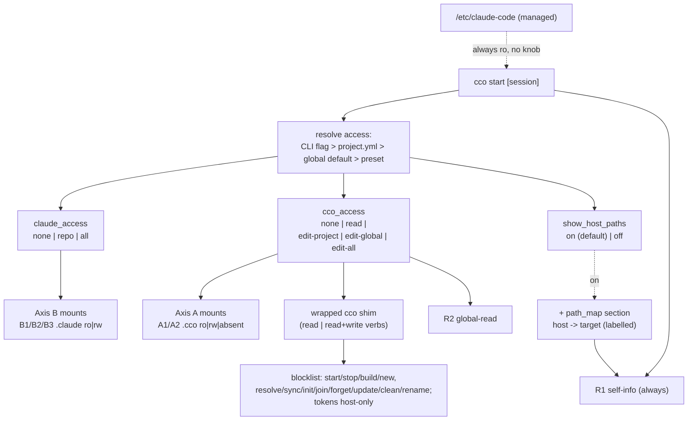

# ADR 0036 — Session config capability model (two axes, wrapped-cco, built-ins as presets)

**Status**: Accepted (2026-07-01) — **implemented** (2026-07-01, branch
`feat/config-access/capability-model`; all 7 steps, changelog #28–31; pending merge into
`develop`). Design-only decision in the deciding session; built out per the implementation handoff.

**Deciders**: maintainer (set the direction + the two-axis reframe + the packs/managed
refinements), implementer (analysis + code-grounding + recommendations)

**Context docs**: `../config-editor-access-design-handoff.md` (Handover B),
`../../internal-projects/config-editor/design/design-config-editor.md` (living design),
`../../internal-projects/tutorial/design/design-tutorial.md`

**Related ADRs**: 0027 (config-editor built-in + agentic edit-protection — **generalized
here**), 0007 (XDG buckets + anti-in-container guard — the host-side constraint this ADR
navigates), 0024 (one repo = one config home), 0028 (flat global `~/.cco/.claude`),
0016 (resource taxonomy), 0022 (coordinate model), 0039 (native Claude install)

---

## Context

Handover B raised config-editor's **access scope**: today it edits `~/.cco` (global) plus
**one** target project (`--project`/cwd). The maintainer wants it to edit **any** project's
config + global, expose a read-only "cco info", and give the tutorial a **read-only** partial.
Exploring the ask surfaced a larger, cross-cutting question the maintainer asked to settle
**as one coherent design** before implementing gradually: *what is the correct degree of
resource availability + read/write for an in-container agent, and how do we distinguish an
arbitrary project session from the config-editor/tutorial built-ins — via flags, config, or
session type?*

Three code-grounded facts frame the design:

1. **`cco` is host-side by construction (ADR-0007).** Every XDG bucket resolver in
   `lib/paths.sh` calls `_cco_resolver_guard`, which `die()`s inside a container
   (`_cco_in_container` via `/.dockerenv`). `cco` reasons in **host-absolute paths** (the
   STATE index maps logical name → host path, then bind-mounts to fixed `/workspace/...`
   targets). A naive "run full `cco` in the container" is therefore impossible: path-resolving
   and container-spawning commands are meaningless or dangerous inside a session.

2. **Internal XDG state (DATA/STATE) is CLI-managed.** `tags.yml`, the `remotes` registry,
   the index, and `source` records are written by dedicated functions (`_tags_*`,
   `_remote_*`, `_index_*`, `_*_record_source`). Free-form file edits by an agent risk
   corruption. Any agent mutation of these must go **through the shared `cco` functions** —
   never duplicated, never hand-edited.

3. **Today's per-session mount rules are asymmetric but mostly intentional** (ADR-0027 D3):
   `<repo>/.claude` is **rw** (authoring), `<repo>/.cco` structural is **:ro**
   (edit-protection), `~/.cco` is **absent** in a normal session. The discriminator was
   framed as "repo-ownership", but both `.claude` and `.cco` live in the repo — so ownership
   is the wrong axis. The correct discriminator is **config type**.

The command inventory (see the design doc's appendix) classifies every `cco` verb by
read/write, path-free, write target (CONFIG hand-editable vs internal XDG), and usefulness to
a config agent. The useful, safe subset is entirely **path-free**; the excluded set is exactly
the **container-spawning** (`start/stop/build/new`) and **path-resolving / non-transactional
lifecycle** (`init/join/resolve/sync/forget/update/clean/project rename`) commands.

## Decision

### D1 — A resource taxonomy on **two axes** plus a **read surface** and a **managed floor**

Session resources are classified by *config type*, not by *ownership*:

- **M — managed config** `/etc/claude-code/` (baked in the image). **Always read-only, never
  editable by user or agent**, governed by no knob. The top of the resolution hierarchy;
  maintainer-owned.
- **Axis B — `.claude` config (authoring surface)**, co-authored with code (native Claude Code
  semantics):
  - **B1** `<repo>/.claude` (repo-native, cross-cutting)
  - **B2** `<repo>/.cco/claude` → `/workspace/.claude` (project)
  - **B3** `~/.cco/.claude` (global)
- **Axis A — `.cco` config (framework wiring)**, where involuntary mutation is dangerous:
  - **A1** `<repo>/.cco` structural (`project.yml`, `secrets.env`, `.cco/` metadata)
  - **A2** `~/.cco` structural (**incl. `packs/` and `templates/`**, setup, config datums)
  - **A3** internal XDG (DATA/STATE: `tags`, `remotes`, index, `source`) — **CLI-only, never
    file-level**
- **Surface R — read/info**:
  - **R1** self-info: the running project's resources + the **host↔container path map** —
    unifies today's **agent-facing** surfaces (`packs.md` + `workspace.yml`) into one
    cco-generated surface (`.managed/` is entrypoint infra, excluded — ADR-0041 R1-D1)
  - **R2** global-read: listings / tags / remotes / coords across all projects + global, via
    read-only wrapped `cco`

**Packs refinement (maintainer note).** A referenced pack injects additional `.claude`
resources into a session, but its **source is `~/.cco/packs/` (A2)**. Editing pack content is
therefore an **Axis A** operation gated by `cco_access` — **not** by `claude_access`.
`claude_access` governs only the B1/B2/B3 `.claude` *trees*, never pack-sourced content.

### D2 — Orthogonal access / visibility knobs

The single `--enable-config-edit` flag (ADR-0027) is generalized into **three** orthogonal
knobs, each resolved per session — two govern **editing** (axes B and A), one governs
**host-path visibility**:

- **`claude_access`** (Axis B): `none` | `repo` | `all`
  - `repo` = **default**: B1+B2 **rw**, B3 **ro**
  - `all`: also B3 (global `.claude`) **rw**
  - `none`: all B **ro** (advanced security — lock authoring too)
- **`cco_access`** (Axis A + surface R): `none` | `read` | `edit-project` | `edit-global` | `edit-all`
  - `none` = **default**: A1 **ro**, A2 **absent**, **only R1** (self-info) exposed
  - `read`: + R2 + read-only wrapped `cco`
  - `edit-project`: A1 **rw** (the target project(s), honoring `--all` / `--project`); A2 **ro**;
    A3 read-only via `cco`
  - `edit-global`: A2 **rw** (incl. `packs/`/`templates/`) + A3 **rw via `cco`** (tags/remotes/…
    are global registries); A1 **ro**
  - `edit-all`: A1 **rw** + A2 **rw** + A3 **rw via `cco`**

  The edit level is **granular on the config-type axis** (project A1 vs global A2) because a user
  may want to touch only one — e.g. edit a project's `project.yml` without exposing the whole
  personal store rw, or curate global packs/templates without a project mounted. A3 (global
  registries) rw comes with `edit-global`/`edit-all`, since tags/remotes are global by nature.

- **`show_host_paths`** (visibility, **not** editing): `on` = **default** | `off`. When `on`,
  the session is shown the **host↔container path map** (labelled `HOST_PATH → /workspace/<target>`
  pairs) — in R1's `path_map` section (ADR-0041) and in the wrapped-`cco` read output — so the
  agent can hand the user copy-pasteable **host** commands. It is a **separate knob**, not folded
  into `cco_access`, because the utility (host commands) is independent of config editing: a
  plain code session may want it. It exposes only the user's own machine paths, to the user's own
  agent, inside the user's own container — no new access is granted (the container cannot reach
  host paths). **Default `on`** (useful, low-risk); `off` for security-conscious setups. It does
  **not** violate AD3: AD3 governs *committed* config (machine-agnostic), not a read-only runtime
  view. `config-safety.md` reminds the agent not to paste host paths into commits / PRs /
  external calls.

**The discriminator, made explicit (the symmetry the maintainer asked for):** `.claude` is an
authoring surface co-authored with code → editable by default in a code session (because it is
authoring config, *not* because it lives in the repo). `.cco` structural is framework wiring →
protected by default (ADR-0027's edit-protection stands, now justified by *config type*, not
ownership). Internal XDG is CLI-managed → mutated only via `cco`.

**Direct edit vs `cco` call within the edit levels.** An edit level grants direct rw to the
*hand-editable* A1/A2 files in its scope (YAML/text authored by convention) **and** the
wrapped-`cco` write verbs for A3 (whose files are never hand-edited). The two mechanisms
(direct file edit vs `cco` call) are both "editing my cco configuration"; which one applies to a
given file is enforced by the wrapper (D4) and the resolved edit level.

### D3 — Knob placement: global default + per-project override + CLI one-off

Resolution precedence (most specific wins):

1. **CLI flag** `--claude-access <none|repo|all>` /
   `--cco-access <none|read|edit-project|edit-global|edit-all>` /
   `--show-host-paths` / `--no-show-host-paths` (this session only)
2. **Per-project** `project.yml` (`access:` block) — the project's standing choice
3. **Global default** in `~/.cco` (a config datum) — the user's baseline
4. **Built-in defaults**: `claude_access=repo`, `cco_access=none`, `show_host_paths=on`

This generalizes `--enable-config-edit` — which re-enabled rw only on the invoking repo's
`<repo>/.cco` (A1). It becomes sugar for `--cco-access edit-project`, kept as a deprecated
alias for one release.

### D4 — Mechanism: a whitelisted, wrapped `cco` in the container

The read/write capability is delivered by making `cco` runnable in the container behind a
**whitelist shim**, not by duplicating logic or by hand-editing internal files:

- **Whitelist (allowed)**: the path-free read verbs (`list`, `*show`, `*validate`, `docs`,
  `path list`, `config validate`, `project coords --diff`, `list remotes`) and — under
  `cco_access=edit` — the path-free write verbs that mutate CONFIG or internal XDG **through
  the shared functions** (`tag add|remove`, `remote add|remove`, `pack|template|llms
  create|update|remove|install|import`, `config save`).
- **Blocklist (refused with a "run this on the host" hint)**: container-spawning
  (`start/stop/build/new`), path-resolving / non-transactional lifecycle
  (`init/join/resolve/sync/forget/update/clean/project rename`), and **network + credential**
  ops — `config push` / `config pull` (host-only; only the local `config save` runs in-container).
- **Container-operator mode**: a **dedicated** entry (e.g. `CCO_CONTAINER_OPERATOR=1` +
  `CCO_DATA_HOME`/`CCO_STATE_HOME`/`CCO_CACHE_HOME` pointing at the mounted buckets) — **not**
  the `CCO_ALLOW_HOST_RESOLVE` test/dev hatch. This addresses ADR-0007's concern
  by-construction: `cco` operates on the *real, deliberately-mounted* buckets, never silently
  under the container's `$HOME`.
- **Host paths in read output are a feature, not a bug** — *but must be labelled*: `cco list`
  etc. print host paths; combined with R1's path map, the agent can hand the user exact host
  commands. The output (and the config-editor/tutorial CLAUDE.md + `config-safety.md`) **must
  state explicitly** that these are the **user's host paths**, bind-mounted into the container
  at `<target_path>` — otherwise the agent conflates the two namespaces. Read output shows
  `HOST_PATH → /workspace/<target>` pairs, never a bare host path. This exposure is governed by
  the **`show_host_paths`** knob (default `on`): when `off`, host paths are omitted from read
  output and the `path_map` section. Only commands that *act on* those host paths
  (resolve/sync/start) are blocked regardless.
- **Secrets stay host-only** (extended for the broadened mount surface — maintainer decision
  2026-07-01): remote **tokens** (STATE `remotes-token`, 0600) are not mounted, and
  `remote set-token` / `remote remove-token` are host-only. **Real secret files are also excluded
  from every config mount** — `<repo>/.cco/secrets.env` and common secret patterns (`*.env`,
  `*.key`, `*.pem`) are **filtered out** of the mounted `<repo>/.cco` (a `:ro`-hide/`tmpfs`
  overlay, or a filtered copy — implementer's choice), so neither `--all`/config-editor nor the
  tutorial's read-all ever sees real secret values. Only `*.example` skeletons are surfaced and
  writable. This does not reduce config-editor's function (it must never touch real secrets —
  config-safety.md). The agent manages remote *urls* and `*.example`, never secrets.

MCP is **not** built now: it would be a thin wrapper over this same CLI. Deferred to a future
analysis if a need appears — recorded, not scheduled.

### D5 — Read surface R generalized

- **R1 (self-info)** is the intent: **one** cco-generated, read-only surface describing the
  running project's resources **and the host↔container path map**, always on (including normal
  sessions), minimal and about *this* project only so it doesn't bloat non-config projects.
  **Its format is specified in [ADR-0041](0041-unified-session-info-surface.md)** (the dedicated
  design). Two refinements from that grounding: (a) R1 unifies only the **agent-facing** surfaces
  (`packs.md` + `workspace.yml`) — **`.managed/` is out** (it is entrypoint infrastructure, not
  agent-read), correcting this bullet's earlier "+ `.managed/`"; (b) the **host↔container path
  map is governed by the dedicated `show_host_paths` knob** (default `on`; a separate visibility
  axis, not `cco_access`), so R1's structural core (container paths) is always present and the
  host-path section toggles with the knob. Implementation step 6 is gated on ADR-0041.
- **R2 (global-read)** exposes cross-project listings/tags/remotes/coords via the read-only
  wrapped `cco`, only under `cco_access ≥ read`. (R2 is served by the D4 shim and does not
  depend on the R1 format work.)

### D6 — Built-ins become **presets** of the general knobs

The tutorial and config-editor stop being bespoke code paths and become **named presets**:

| Session | `claude_access` | `cco_access` | Scope |
|---|---|---|---|
| **normal** (default) | `repo` | `none` (R1 only) | its own project |
| **config-editor** | `all` | `edit-all` | global + `--all` / repeatable `--project` (only `<repo>/.cco`); narrow to `edit-project` / `edit-global` on request |
| **tutorial** | `none` | `read` | read of **all** projects' config + global |

**D-α (all-projects, confirmed):** config-editor's `edit` scope is opt-in via `--all` (mount
every resolved member's `<repo>/.cco` rw, skip unresolved) and repeatable `--project a
--project b`. Default stays single/global. **Only `<repo>/.cco`** is mounted — never full code
repos.

**Project-scope selector is orthogonal to the access *level*.** The `--all` / repeatable
`--project` / default-current selector chooses **which** projects' `<repo>/.cco` are surfaced;
the access level chooses **how** (ro under `read`, rw under `edit-project`/`edit-all`). So it
applies to `read` too: **tutorial = `read` + all-scope** (every resolved `<repo>/.cco` mounted
**ro** + `~/.cco` ro + R2), giving it read of all configs; a **normal `--cco-access read`**
defaults to **current-project** scope (its own `<repo>/.cco` ro + R2) unless `--all`/`--project`
widen it. Unresolved members are skipped in both modes.

### D7 — Complete design now, gradual implementation by dependency

Per the maintainer: design the whole model first (this ADR), then implement in dependency order
to avoid drift. The generalized mechanisms (R1 self-info; the wrapped-`cco` shim +
container-operator mode) are built **first**; the built-ins then consume them as presets. See
*Implementation* below.

### D8 — A uniform caller-context signal available to every `cco` command

`cco` gains a canonical, framework-wide **caller-context** signal that every command body can
read to guard or differ behavior by *who/where* invoked it — **user on host** vs **agent inside
a session container**. Today this is implicit and scattered (`_cco_in_container` via
`/.dockerenv`, the ADR-0007 resolver guard, the proposed `CCO_CONTAINER_OPERATOR`). This
decision makes it a **single default helper** (e.g. `_cco_caller_context` → `host` |
`container-agent`) resolved once at startup and available to all commands, so:

- the whitelist/blocklist shim (D4) is one consumer, not a bespoke mechanism;
- any command can add a targeted guard (refuse, warn, or take a container-safe branch) without
  re-detecting the environment;
- the anti-in-container resolver guard (ADR-0007) is re-expressed on top of this one signal
  rather than duplicated.

It is a **default part of the command contract**: adding a new `cco` command inherits the
signal for free. Container-agent context is established deliberately (the container-operator
entry of D4 — mounted buckets + `CCO_*_HOME`), never inferred silently, keeping ADR-0007's
invariant intact.

## Capability matrix

| Resource | managed floor | normal (default) | `--cco-access read` | config-editor (`edit-all`) | tutorial (`read`/`none`) |
|---|---|---|---|---|---|
| **M** `/etc/claude-code/` | ro (always) | ro | ro | ro | ro |
| **B1** `<repo>/.claude` | — | rw | rw | rw | ro |
| **B2** project `.claude` | — | rw | rw | rw | ro |
| **B3** global `~/.cco/.claude` | — | ro | ro | rw | ro |
| **A1** `<repo>/.cco` structural | — | ro | ro | rw (N via `--all`) | ro |
| **A2** `~/.cco` structural (+packs/templates) | — | absent | ro | rw | ro |
| **A3** internal XDG (tags/remotes/…) | — | none | ro via `cco` | rw **via `cco`** | ro via `cco` |
| **R1** self-info + path map | — | ro (always) | ro | ro | ro |
| **R2** global-read | — | none | ro via `cco` | ro/rw via `cco` | ro via `cco` |
| remote **tokens** (STATE) | — | host-only | host-only | host-only | host-only |
| real **secret files** (`secrets.env`/`*.key`/`*.pem`) | — | filtered | filtered | filtered (only `*.example`) | filtered |

The config-editor column shows `edit-all`. The intermediate edit levels restrict it: under
`edit-project` only **A1** is rw (A2 drops to ro, A3 to read-only via `cco`); under `edit-global`
only **A2**+**A3** are rw (A1 drops to ro). `read` and `none` are the two leftmost data columns.
The **`show_host_paths`** knob (default `on`) is orthogonal to every column: it toggles the R1
`path_map` section + host-path labelling in read output, independent of `claude_access`/`cco_access`.

## Consequences

- **Positive**: one coherent vocabulary (two axes + read surface + managed floor) replaces
  ad-hoc per-type rules; the config-type discriminator is explicit and symmetric; built-ins are
  presets of user-visible knobs, so classic sessions can opt into the same mechanisms; internal
  XDG is mutated only via shared `cco` functions (no duplication, no corruption); ADR-0007 is
  respected via a first-class container-operator mode; secrets never reach the agent; R1 gives
  every session a minimal, non-bloating self-view including the host↔container path map.
- **Negative / accepted**: a larger surface than the original handoff (a wrapped-`cco` shim +
  bucket mounts + two knobs); `cco_access=edit` on config-editor with `--all` is a wide rw
  surface (mitigated by the whitelist, host-only tokens, and config-safety.md); read output
  shows host paths (intended — the path-map feature). MCP is deferred, so tool ergonomics rely
  on the CLI shim for now.
- **Self-development caveat**: all touched files are host-side (`lib/`, `internal/`,
  `config/`, `Dockerfile` for baking the shim) — live for a **fresh** `cco start`, not the
  running session; testable via `./bin/test`.

## Implementation (dependency-ordered, gradual)

1. **Caller-context signal (D8)** — the single `_cco_caller_context` helper; re-express the
   ADR-0007 resolver guard on top of it. Foundational: the shim and later guards depend on it.
2. **Access resolution** — the three knobs (`claude_access` `none|repo|all`; `cco_access`
   `none|read|edit-project|edit-global|edit-all`; `show_host_paths` `on|off`, default `on`),
   their precedence (CLI > project.yml `access:` > global default > preset), and the
   `--enable-config-edit` → `edit-project` alias.
3. **Axis-B / Axis-A mount generation** — drive the `.claude` and `.cco` mount modes (per the
   granular edit levels) from the resolved knobs in `lib/cmd-start.sh` (generalizes the
   `_committed_ro` logic).
4. **Wrapped-`cco` shim + container-operator mode** — the whitelist/blocklist shim, bucket
   mounts (DATA rw / STATE index ro / **tokens excluded**), `CCO_CONTAINER_OPERATOR` env;
   host-path labelling in read output; bake or mount `bin/cco` + `lib/` into the image.
5. **Built-in presets** — re-express tutorial (`read`/`none`) and config-editor (`edit-all`/
   `all`) as presets; add config-editor `--all` / repeatable `--project` (only `<repo>/.cco`).
6. **R1 self-info** — per [ADR-0041](0041-unified-session-info-surface.md): the unified
   `workspace.yml` absorbing `packs.md` + `workspace.yml` (agent-facing only; `.managed/`
   excluded) + the gated host↔container path map. **Net cut** (no dual-emit): migrate the three
   consumers and delete `packs.md` in one change, validated on `develop` before release
   (R1-D4/D6). (R2 ships with step 4, independent of R1.)
7. **Docs + tests** — rewrite `design-config-editor.md` and the tutorial design in place to the
   preset model; update `config-safety.md` (host-path labelling, granular edit levels); extend
   `tests/test_config_editor.sh` (all-projects mounts, wrapped-cco whitelist/blocklist, the two
   knobs' precedence + granular edit levels, token exclusion, caller-context guard). Add a
   `changelog.yml` entry (additive) and, since `project.yml` gains an `access:` block, a project
   migration.

## Open items / future

- **R1 unified format** — designed in [ADR-0041](0041-unified-session-info-surface.md)
  (agent-facing surfaces only; gated path-map; **net cut** validated on `develop`, no dual-emit;
  start-time snapshot with defined staleness semantics). Gates Implementation step 6.
- **MCP** over the wrapped `cco` — deferred; evaluate if the CLI shim proves insufficient.
- **`--cco-access` in normal sessions** as a routine workflow (beyond R1) — enabled by this
  model; adoption is a UX decision for a follow-up.
