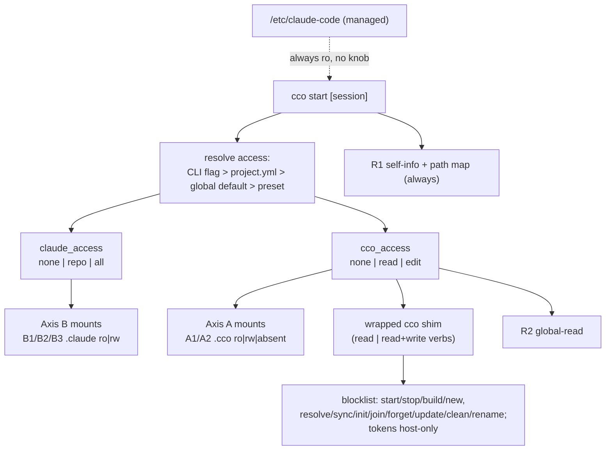

# ADR 0036 — Session config capability model (two axes, wrapped-cco, built-ins as presets)

**Status**: Proposed (2026-07-01)

**Deciders**: maintainer (set the direction + the two-axis reframe + the packs/managed
refinements), implementer (analysis + code-grounding + recommendations)

**Context docs**: `../config-editor-access-design-handoff.md` (Handover B),
`../../internal-projects/config-editor/design/design-config-editor.md` (living design),
`../../internal-projects/tutorial/design/design-tutorial.md`

**Related ADRs**: 0027 (config-editor built-in + agentic edit-protection — **generalized
here**), 0007 (XDG buckets + anti-in-container guard — the host-side constraint this ADR
navigates), 0024 (one repo = one config home), 0028 (flat global `~/.cco/.claude`),
0016 (resource taxonomy), 0022 (coordinate model), 0039 (native Claude install)

---

## Context

Handover B raised config-editor's **access scope**: today it edits `~/.cco` (global) plus
**one** target project (`--project`/cwd). The maintainer wants it to edit **any** project's
config + global, expose a read-only "cco info", and give the tutorial a **read-only** partial.
Exploring the ask surfaced a larger, cross-cutting question the maintainer asked to settle
**as one coherent design** before implementing gradually: *what is the correct degree of
resource availability + read/write for an in-container agent, and how do we distinguish an
arbitrary project session from the config-editor/tutorial built-ins — via flags, config, or
session type?*

Three code-grounded facts frame the design:

1. **`cco` is host-side by construction (ADR-0007).** Every XDG bucket resolver in
   `lib/paths.sh` calls `_cco_resolver_guard`, which `die()`s inside a container
   (`_cco_in_container` via `/.dockerenv`). `cco` reasons in **host-absolute paths** (the
   STATE index maps logical name → host path, then bind-mounts to fixed `/workspace/...`
   targets). A naive "run full `cco` in the container" is therefore impossible: path-resolving
   and container-spawning commands are meaningless or dangerous inside a session.

2. **Internal XDG state (DATA/STATE) is CLI-managed.** `tags.yml`, the `remotes` registry,
   the index, and `source` records are written by dedicated functions (`_tags_*`,
   `_remote_*`, `_index_*`, `_*_record_source`). Free-form file edits by an agent risk
   corruption. Any agent mutation of these must go **through the shared `cco` functions** —
   never duplicated, never hand-edited.

3. **Today's per-session mount rules are asymmetric but mostly intentional** (ADR-0027 D3):
   `<repo>/.claude` is **rw** (authoring), `<repo>/.cco` structural is **:ro**
   (edit-protection), `~/.cco` is **absent** in a normal session. The discriminator was
   framed as "repo-ownership", but both `.claude` and `.cco` live in the repo — so ownership
   is the wrong axis. The correct discriminator is **config type**.

The command inventory (see the design doc's appendix) classifies every `cco` verb by
read/write, path-free, write target (CONFIG hand-editable vs internal XDG), and usefulness to
a config agent. The useful, safe subset is entirely **path-free**; the excluded set is exactly
the **container-spawning** (`start/stop/build/new`) and **path-resolving / non-transactional
lifecycle** (`init/join/resolve/sync/forget/update/clean/project rename`) commands.

## Decision

### D1 — A resource taxonomy on **two axes** plus a **read surface** and a **managed floor**

Session resources are classified by *config type*, not by *ownership*:

- **M — managed config** `/etc/claude-code/` (baked in the image). **Always read-only, never
  editable by user or agent**, governed by no knob. The top of the resolution hierarchy;
  maintainer-owned.
- **Axis B — `.claude` config (authoring surface)**, co-authored with code (native Claude Code
  semantics):
  - **B1** `<repo>/.claude` (repo-native, cross-cutting)
  - **B2** `<repo>/.cco/claude` → `/workspace/.claude` (project)
  - **B3** `~/.cco/.claude` (global)
- **Axis A — `.cco` config (framework wiring)**, where involuntary mutation is dangerous:
  - **A1** `<repo>/.cco` structural (`project.yml`, `secrets.env`, `.cco/` metadata)
  - **A2** `~/.cco` structural (**incl. `packs/` and `templates/`**, setup, config datums)
  - **A3** internal XDG (DATA/STATE: `tags`, `remotes`, index, `source`) — **CLI-only, never
    file-level**
- **Surface R — read/info**:
  - **R1** self-info: the running project's resources + the **host↔container path map** —
    unifies today's `packs.md` + `workspace.yml` + `.managed/` into one cco-generated surface
  - **R2** global-read: listings / tags / remotes / coords across all projects + global, via
    read-only wrapped `cco`

**Packs refinement (maintainer note).** A referenced pack injects additional `.claude`
resources into a session, but its **source is `~/.cco/packs/` (A2)**. Editing pack content is
therefore an **Axis A** operation gated by `cco_access` — **not** by `claude_access`.
`claude_access` governs only the B1/B2/B3 `.claude` *trees*, never pack-sourced content.

### D2 — Two orthogonal user knobs

The single `--enable-config-edit` flag (ADR-0027) is generalized into two orthogonal knobs,
each resolved per session:

- **`claude_access`** (Axis B): `none` | `repo` | `all`
  - `repo` = **default**: B1+B2 **rw**, B3 **ro**
  - `all`: also B3 (global `.claude`) **rw**
  - `none`: all B **ro** (advanced security — lock authoring too)
- **`cco_access`** (Axis A + surface R): `none` | `read` | `edit`
  - `none` = **default**: A1 **ro**, A2 **absent**, **only R1** (self-info) exposed
  - `read`: + R2 + read-only wrapped `cco`
  - `edit`: A1/A2 **rw** + write-enabled wrapped `cco` (A3 mutated only via `cco` functions)

**The discriminator, made explicit (the symmetry the maintainer asked for):** `.claude` is an
authoring surface co-authored with code → editable by default in a code session (because it is
authoring config, *not* because it lives in the repo). `.cco` structural is framework wiring →
protected by default (ADR-0027's edit-protection stands, now justified by *config type*, not
ownership). Internal XDG is CLI-managed → mutated only via `cco`.

**A3 vs A2 within `cco_access=edit`.** `edit` grants direct rw to the *hand-editable* A1/A2
files (YAML/text authored by convention) **and** the wrapped-`cco` write verbs for A3 (whose
files are never hand-edited). Both live under the one knob because both are "editing my cco
configuration"; the *mechanism* differs (direct file edit vs `cco` call), enforced by the
wrapper (D4).

### D3 — Knob placement: global default + per-project override + CLI one-off

Resolution precedence (most specific wins):

1. **CLI flag** `--claude-access <none|repo|all>` / `--cco-access <none|read|edit>` (this
   session only)
2. **Per-project** `project.yml` (`access:` block) — the project's standing choice
3. **Global default** in `~/.cco` (a config datum) — the user's baseline
4. **Built-in defaults**: `claude_access=repo`, `cco_access=none`

This generalizes `--enable-config-edit` (which becomes sugar for `--cco-access edit`, kept as a
deprecated alias for one release).

### D4 — Mechanism: a whitelisted, wrapped `cco` in the container

The read/write capability is delivered by making `cco` runnable in the container behind a
**whitelist shim**, not by duplicating logic or by hand-editing internal files:

- **Whitelist (allowed)**: the path-free read verbs (`list`, `*show`, `*validate`, `docs`,
  `path list`, `config validate`, `project coords --diff`, `list remotes`) and — under
  `cco_access=edit` — the path-free write verbs that mutate CONFIG or internal XDG **through
  the shared functions** (`tag add|remove`, `remote add|remove`, `pack|template|llms
  create|update|remove|install|import`, `config save|pull|push`).
- **Blocklist (refused with a "run this on the host" hint)**: container-spawning
  (`start/stop/build/new`), path-resolving / non-transactional lifecycle
  (`init/join/resolve/sync/forget/update/clean/project rename`).
- **Container-operator mode**: a **dedicated** entry (e.g. `CCO_CONTAINER_OPERATOR=1` +
  `CCO_DATA_HOME`/`CCO_STATE_HOME`/`CCO_CACHE_HOME` pointing at the mounted buckets) — **not**
  the `CCO_ALLOW_HOST_RESOLVE` test/dev hatch. This addresses ADR-0007's concern
  by-construction: `cco` operates on the *real, deliberately-mounted* buckets, never silently
  under the container's `$HOME`.
- **Host paths in read output are a feature, not a bug**: `cco list` etc. print host paths;
  combined with R1's path map, the agent can hand the user exact host commands. Only commands
  that *act on* those host paths (resolve/sync/start) are blocked.
- **Secrets stay host-only**: remote **tokens** live in STATE `remotes-token` (0600). That
  file is **not mounted**, and `remote set-token` / `remote remove-token` remain host-only
  (config-safety.md — never expose secrets to the agent). The agent manages remote *urls*,
  not tokens.

MCP is **not** built now: it would be a thin wrapper over this same CLI. Deferred to a future
analysis if a need appears — recorded, not scheduled.

### D5 — Read surface R generalized

- **R1 (self-info)** unifies `packs.md` + `workspace.yml` + `.managed/` into one cco-generated,
  read-only surface describing the running project's resources **and the host↔container path
  map**. Always on (including normal sessions) — it is minimal and about *this* project only,
  so it does not bloat the context of projects that don't work on config.
- **R2 (global-read)** exposes cross-project listings/tags/remotes/coords via the read-only
  wrapped `cco`, only under `cco_access ≥ read`.

### D6 — Built-ins become **presets** of the general knobs

The tutorial and config-editor stop being bespoke code paths and become **named presets**:

| Session | `claude_access` | `cco_access` | Scope |
|---|---|---|---|
| **normal** (default) | `repo` | `none` (R1 only) | its own project |
| **config-editor** | `all` | `edit` | global + `--all` / repeatable `--project` (only `<repo>/.cco`) |
| **tutorial** | `none` | `read` | read of **all** projects' config + global |

**D-α (all-projects, confirmed):** config-editor's `edit` scope is opt-in via `--all` (mount
every resolved member's `<repo>/.cco` rw, skip unresolved) and repeatable `--project a
--project b`. Default stays single/global. **Only `<repo>/.cco`** is mounted — never full code
repos.

### D7 — Complete design now, gradual implementation by dependency

Per the maintainer: design the whole model first (this ADR), then implement in dependency order
to avoid drift. The generalized mechanisms (R1 self-info; the wrapped-`cco` shim +
container-operator mode) are built **first**; the built-ins then consume them as presets. See
*Implementation* below.

## Capability matrix

| Resource | managed floor | normal (default) | `--cco-access read` | config-editor (`edit`/`all`) | tutorial (`read`/`none`) |
|---|---|---|---|---|---|
| **M** `/etc/claude-code/` | ro (always) | ro | ro | ro | ro |
| **B1** `<repo>/.claude` | — | rw | rw | rw | ro |
| **B2** project `.claude` | — | rw | rw | rw | ro |
| **B3** global `~/.cco/.claude` | — | ro | ro | rw | ro |
| **A1** `<repo>/.cco` structural | — | ro | ro | rw (N via `--all`) | ro |
| **A2** `~/.cco` structural (+packs/templates) | — | absent | ro | rw | ro |
| **A3** internal XDG (tags/remotes/…) | — | none | ro via `cco` | rw **via `cco`** | ro via `cco` |
| **R1** self-info + path map | — | ro (always) | ro | ro | ro |
| **R2** global-read | — | none | ro via `cco` | ro/rw via `cco` | ro via `cco` |
| remote **tokens** (STATE) | — | host-only | host-only | host-only | host-only |

## Consequences

- **Positive**: one coherent vocabulary (two axes + read surface + managed floor) replaces
  ad-hoc per-type rules; the config-type discriminator is explicit and symmetric; built-ins are
  presets of user-visible knobs, so classic sessions can opt into the same mechanisms; internal
  XDG is mutated only via shared `cco` functions (no duplication, no corruption); ADR-0007 is
  respected via a first-class container-operator mode; secrets never reach the agent; R1 gives
  every session a minimal, non-bloating self-view including the host↔container path map.
- **Negative / accepted**: a larger surface than the original handoff (a wrapped-`cco` shim +
  bucket mounts + two knobs); `cco_access=edit` on config-editor with `--all` is a wide rw
  surface (mitigated by the whitelist, host-only tokens, and config-safety.md); read output
  shows host paths (intended — the path-map feature). MCP is deferred, so tool ergonomics rely
  on the CLI shim for now.
- **Self-development caveat**: all touched files are host-side (`lib/`, `internal/`,
  `config/`, `Dockerfile` for baking the shim) — live for a **fresh** `cco start`, not the
  running session; testable via `./bin/test`.

## Implementation (dependency-ordered, gradual)

1. **Access resolution** — the two knobs (`claude_access`, `cco_access`), their precedence
   (CLI > project.yml `access:` > global default > preset), and `--enable-config-edit` alias.
2. **Axis-B / Axis-A mount generation** — drive the `.claude` and `.cco` mount modes from the
   resolved knobs in `lib/cmd-start.sh` (generalizes the `_committed_ro` logic).
3. **R1 self-info** — one cco-generated surface absorbing `packs.md` + `workspace.yml` +
   `.managed/`, plus the host↔container path map. (Refactor of a working mechanism — keep old
   outputs until R1 is proven.)
4. **Wrapped-`cco` shim + container-operator mode** — the whitelist/blocklist shim, bucket
   mounts (DATA rw / STATE index ro / tokens excluded), `CCO_CONTAINER_OPERATOR` env; bake or
   mount `bin/cco` + `lib/` into the image.
5. **Built-in presets** — re-express tutorial (`read`/`none`) and config-editor (`edit`/`all`)
   as presets; add config-editor `--all` / repeatable `--project` (only `<repo>/.cco`).
6. **Docs + tests** — rewrite `design-config-editor.md` and the tutorial design in place to the
   preset model; update `config-safety.md`; extend `tests/test_config_editor.sh` (all-projects
   mounts, wrapped-cco whitelist/blocklist, R1 surface, the two knobs' precedence, token
   exclusion). Add a `changelog.yml` entry (additive) and, if `project.yml` gains an `access:`
   block, a project migration.

## Open items / future

- **MCP** over the wrapped `cco` — deferred; evaluate if the CLI shim proves insufficient.
- **`--cco-access` in normal sessions** as a routine workflow (beyond R1) — enabled by this
  model; adoption is a UX decision for a follow-up.
