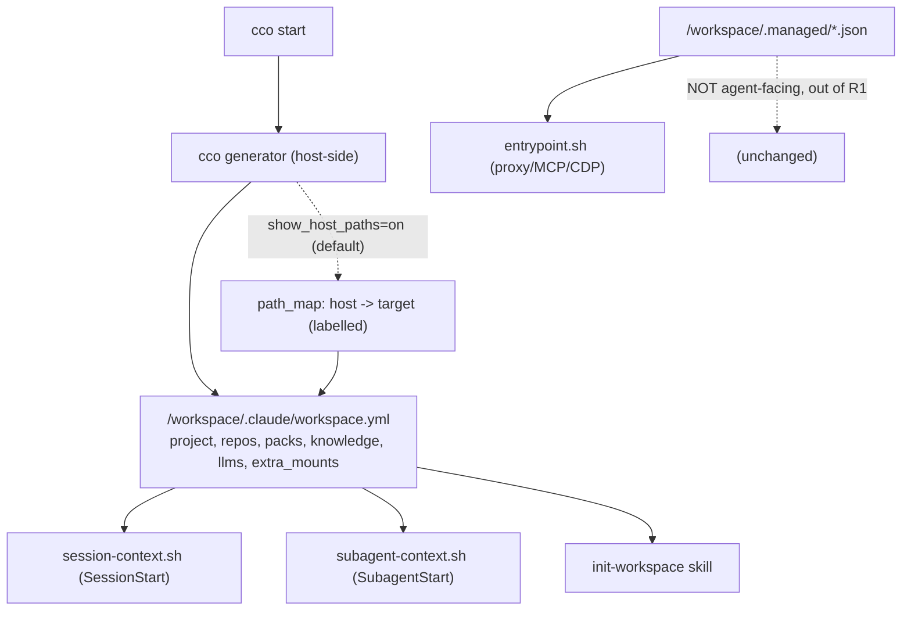

# ADR 0041 — Unified agent-facing session-info surface (R1)

**Status**: Accepted (2026-07-01) — **implemented** (2026-07-01, ADR-0036 step 6, branch
`feat/config-access/capability-model`; `workspace.yml` absorbs `packs.md`, changelog #31; pending
merge into `develop`). Design-only decision in the deciding session.

> **Superseded surface (ADR-0042, 2026-07-02):** the **`workspace.yml` file** delivery is
> retired. This ADR's *goal* — one agent-facing session-info surface, no `packs.md` — stands,
> but the surface becomes **injected context (a hook env-var block), not a file** (no
> `workspace.yml` in the committed tree or in CACHE), and resource descriptions single-source
> to `project.yml`. See
> [ADR-0042](../../agent-cco-access/decisions/0042-agent-cco-interaction-model.md) +
> [agent-cco-access design](../../agent-cco-access/design.md).

**Deciders**: maintainer (asked for R1 as its own design), implementer (grounding + design)

**Context docs**: `0036-session-config-capability-model.md` §D5 (defers R1's format here),
`../config-editor-access-design-handoff.md`

**Related ADRs**: 0036 (capability model — R1 is its surface R), 0027 (edit-protection /
generated overlays), 0005 (managed runtime overlays — `.managed/`), 0007 (host-side buckets,
machine-agnostic paths), 0024 (one repo = one config home)

---

## Context

ADR-0036 D5 named a read surface **R1 (self-info)** — "one cco-generated, read-only surface
describing the running project's resources and the host↔container path map" — and **deferred its
format** to a dedicated session, because R1 subsumes `packs.md` + `workspace.yml` + `.managed/`,
which are load-bearing for how Claude Code assembles context. This ADR is that session.

Grounding the current surfaces and **their consumers** (see the inventory in the design doc's
appendix) produced two findings that shape R1:

1. **`.managed/` is not agent-facing.** `policy.json`, `browser.json`, `github.json` are
   consumed by **`config/entrypoint.sh`** (Docker-proxy policy `entrypoint.sh:47-85`, MCP merge
   `:137-156`, CDP socat `:161-166`) — *before/outside* the agent. The agent never reads them.
   The genuinely agent-facing surfaces are **`packs.md`** (a knowledge/llms index, consumed by
   `session-context.sh:75-80`, `subagent-context.sh:23-29`, and the `init-workspace` skill) and
   **`workspace.yml`** (project structure, consumed by `init-workspace` step 1).
2. **Host paths are deliberately hidden.** `project.yml` and `workspace.yml` carry only logical
   names / container paths; the index (logical→host-absolute) is **never mounted** (AD3,
   machine-agnostic). ADR-0036's path-map feature therefore cannot be an always-on R1 section.

## Decision

### R1-D1 — R1 scope = the **agent-facing** surfaces only; `.managed/` stays out

R1 unifies **`packs.md` + `workspace.yml`** (and the data the SessionStart/SubagentStart hooks
inject) into one cco-generated, read-only surface. **`.managed/` is explicitly excluded** — it
is entrypoint infrastructure (proxy/MCP/CDP), not agent-read; it keeps its current shape and
consumers untouched. This corrects ADR-0036 D5's "+ `.managed/`" wording.

### R1-D2 — Canonical format: one structured YAML, superseding `packs.md`

The canonical R1 artifact is a **single structured YAML** at `/workspace/.claude/workspace.yml`
(kept in `.claude/` so scope resolution + hooks still find it; name retained to minimize
consumer churn). It **absorbs `packs.md`** as new sections and gains an optional gated section:

```yaml
project: <name>
repos:
  - { name, path: /workspace/<name>, description }   # seeded descriptions preserved
packs:      [ <name>, ... ]
knowledge:  [ { path: /workspace/.claude/packs/<...>, description }, ... ]   # was packs.md
llms:       [ { name, path }, ... ]                                          # was packs.md
extra_mounts:
  - { target: /workspace/<t>, readonly: true|false }
path_map:   # OPTIONAL — present only when show_host_paths=on (default on; see R1-D3)
  - { host: <HOST_PATH>, target: /workspace/<t>, readonly }
```

`packs.md` is **removed** once consumers migrate (R1-D4). Presentation stays per-consumer: the
hooks render the slice they inject as markdown; the skill parses the YAML. Centralized data, one
generator; no duplicated formats.

### R1-D3 — Host↔container `path_map` is governed by the `show_host_paths` knob (default on)

The `path_map` section is emitted when **`show_host_paths=on`** — a **dedicated visibility knob**
(ADR-0036 D2), orthogonal to `claude_access`/`cco_access`, **default `on`** because the utility
(handing the user copy-pasteable host commands) is independent of config editing and applies even
to a plain code session. It exposes only the user's own machine paths, to the user's own agent,
inside the user's own container — no new access. Set `off` for security-conscious setups.

This does **not** violate AD3: AD3 governs *committed* config being machine-agnostic, not a
read-only runtime view. Entries are always **labelled pairs** `host → target` (ADR-0036 D4), so
the agent never mistakes a host path for a container path, and `config-safety.md` reminds it not
to paste host paths into commits / PRs / external calls. Resolution logical→host stays
**host-side, before compose** — never inside the container (ADR-0007).

### R1-D4 — Net migration: one clean cut, validated on `develop`, no legacy period

**Maintainer decision (2026-07-01):** a **clean migration** — **no dual-emit, no legacy support
window, no future cutover**. The unified `workspace.yml` replaces `packs.md` **in a single
change**: the generator stops emitting `packs.md`, all three consumers switch to the unified
file, and `packs.md` (plus any other now-unused generated surface) is removed — **together**.
Three consumers migrate: `config/hooks/session-context.sh`, `config/hooks/subagent-context.sh`,
the managed `init-workspace` skill; plus the managed `memory-policy.md` reference to
`/workspace/.claude/packs/` is reconciled.

Validation happens **on `develop`** (`./bin/test` + a real `cco start` dogfood) **before
release**; the release ships the unified, integrated system with the legacy surface already gone.
The actual knowledge files under `/workspace/.claude/packs/` stay where they are — only the
*index* moves. No `packs.md` compatibility shim ships. Idempotent description seeding
(`lib/workspace.sh:37-47`) is preserved.

### R1-D5 — Completeness guarantee

R1 must expose **every datum** the current surfaces expose (else context regresses). Because the
migration is a single atomic cut (R1-D4), this is the **pre-release gate on `develop`**: a
checklist verifying knowledge-file instructions, project structure (repos/packs/extra_mounts +
seeded descriptions), and the SessionStart/SubagentStart injected fields all survive — adherent
to ADR-0036 and this ADR. `.managed/`, the compose env/volumes, and the logical→absolute
resolution order are **out of R1's scope** and unchanged.



### R1-D6 — Generation timing & staleness semantics (session-start snapshot)

**Question raised (maintainer):** is `workspace.yml` regenerated each `cco start`, and must it be
updated if the agent edits config mid-session (`cco_access`/`claude_access`)?

**Grounded answer.** `workspace.yml` is generated **host-side at each `cco start`**, before the
container launches. The decisive fact: **Docker bind-mounts are immutable for a running
container** — a repo/mount cannot be added or removed without a restart. Therefore R1 is a
**session-start snapshot of the immutable mounted reality**, with precise staleness semantics:

- **Structure + `path_map`** (repos, extra_mounts, targets, host↔container map) — **never stale
  within a session**: they describe what is actually mounted, which cannot change until the next
  `cco start`. Editing `project.yml` in-session changes the **next** session's mounts, not the
  current ones.
- **Resource-index sections** (`packs`/`knowledge`/`llms`) — can drift **only** under rw config
  editing (config-editor `cco_access=edit-*`), when the agent creates/removes resources in an
  already-mounted rw location (`~/.cco/packs`). This is benign: the editing agent **is** the
  source of the change and reads the actual files directly — `workspace.yml` is *orientation*,
  not the source of truth. For normal/tutorial sessions (`cco_access` none/read) nothing drifts.

**Decision (v1):** R1 stays a **start-time snapshot**; config edits apply at the next `cco start`
(consistent with the immutable-mount model and the "run `cco sync` / restart on host" flow).
No live-updating of `workspace.yml` during a session. Two escape valves are recorded but **not
required for v1**:

- an **on-demand refresh** the config-editor agent can call via the wrapped `cco`
  (regenerate the index sections into the mounted file after edits) — a nicety, deferrable;
- **hot-reload of live configuration** (mounts + surfaces) — a **separate planned future
  feature** (roadmap "Exploratory / hot-reload"), explicitly out of scope here.

The generator must be **idempotent** and safe to re-run (it already re-seeds descriptions), so a
future refresh/hot-reload can reuse it unchanged.

## Consequences

- **Positive**: one agent-facing surface + one generator; `packs.md`/`workspace.yml` split
  collapses; the path-map feature is delivered via the dedicated `show_host_paths` knob
  (default on) without touching AD3 (which governs committed config, not runtime views);
  `.managed/` correctly stays infrastructure; a clean net migration (no legacy shim) keeps the
  shipped system simple; staleness semantics are well-defined (start-time snapshot over immutable
  mounts).
- **Negative / accepted**: three consumers + one managed rule migrate in **one atomic change**
  (validated on `develop` before release — higher test burden up front, no legacy window);
  `workspace.yml` grows a few sections; mid-session config edits are not reflected until the next
  `cco start` (acceptable — mounts are immutable anyway; refresh/hot-reload deferred).
- **Self-development caveat**: touched files are host-side (`lib/workspace.sh`, `lib/cmd-start.sh`,
  `config/hooks/*`, managed skill/rule) — live for a fresh `cco start`, testable via `./bin/test`.

## Implementation (this is ADR-0036 step 6, now unblocked)

1. Extend the generator (`lib/workspace.sh`, folding in the `packs.md` generator from
   `lib/cmd-start.sh`) to emit the unified `workspace.yml` (`knowledge`/`llms` sections); keep it
   idempotent and safe to re-run (R1-D6).
2. Emit `path_map` when `show_host_paths=on` (default on; labelled host→target pairs).
3. Migrate `session-context.sh`, `subagent-context.sh`, `init-workspace` to the unified file;
   reconcile `memory-policy.md`. **In the same change, stop emitting `packs.md` and delete it**
   (net cut — R1-D4; no dual-emit).
4. Pre-release completeness gate on `develop` (R1-D5): `./bin/test` + a real `cco start` dogfood
   confirm no context regressed, then release.
5. Tests: unified-file shape, `path_map` toggling with `show_host_paths` (absent when `off`,
   present + labelled when `on`), hook rendering, `init-workspace` parse, description-seeding
   idempotency, no `packs.md` emitted.

## Open items / future

- Whether the SessionStart hook should read the unified file directly vs a cco-rendered markdown
  slice — a rendering detail settled in implementation.
- **On-demand R1 refresh** via wrapped `cco` (config-editor) and **hot-reload of live
  configuration** — both deferred (R1-D6); hot-reload is a separate planned roadmap feature.
- A future rename `workspace.yml` → a clearer `session-info.yml` (deferred; would add churn now).
