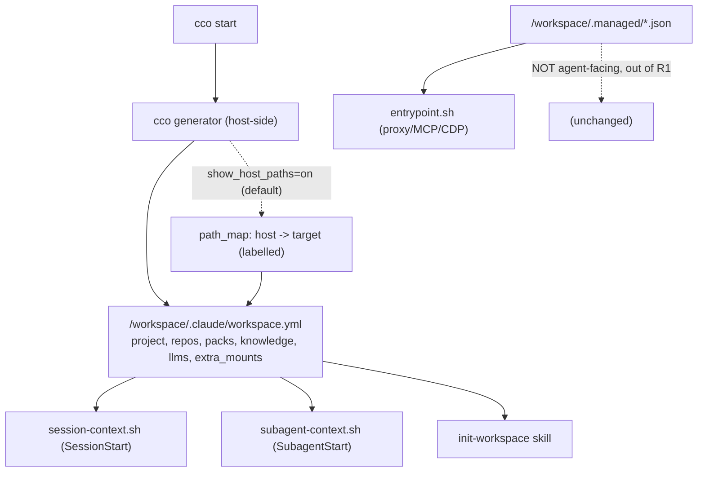

# ADR 0041 — Unified agent-facing session-info surface (R1)

**Status**: Accepted (2026-07-01) — implementation pending (ADR-0036 step 6). Design-only.

**Deciders**: maintainer (asked for R1 as its own design), implementer (grounding + design)

**Context docs**: `0036-session-config-capability-model.md` §D5 (defers R1's format here),
`../config-editor-access-design-handoff.md`

**Related ADRs**: 0036 (capability model — R1 is its surface R), 0027 (edit-protection /
generated overlays), 0005 (managed runtime overlays — `.managed/`), 0007 (host-side buckets,
machine-agnostic paths), 0024 (one repo = one config home)

---

## Context

ADR-0036 D5 named a read surface **R1 (self-info)** — "one cco-generated, read-only surface
describing the running project's resources and the host↔container path map" — and **deferred its
format** to a dedicated session, because R1 subsumes `packs.md` + `workspace.yml` + `.managed/`,
which are load-bearing for how Claude Code assembles context. This ADR is that session.

Grounding the current surfaces and **their consumers** (see the inventory in the design doc's
appendix) produced two findings that shape R1:

1. **`.managed/` is not agent-facing.** `policy.json`, `browser.json`, `github.json` are
   consumed by **`config/entrypoint.sh`** (Docker-proxy policy `entrypoint.sh:47-85`, MCP merge
   `:137-156`, CDP socat `:161-166`) — *before/outside* the agent. The agent never reads them.
   The genuinely agent-facing surfaces are **`packs.md`** (a knowledge/llms index, consumed by
   `session-context.sh:75-80`, `subagent-context.sh:23-29`, and the `init-workspace` skill) and
   **`workspace.yml`** (project structure, consumed by `init-workspace` step 1).
2. **Host paths are deliberately hidden.** `project.yml` and `workspace.yml` carry only logical
   names / container paths; the index (logical→host-absolute) is **never mounted** (AD3,
   machine-agnostic). ADR-0036's path-map feature therefore cannot be an always-on R1 section.

## Decision

### R1-D1 — R1 scope = the **agent-facing** surfaces only; `.managed/` stays out

R1 unifies **`packs.md` + `workspace.yml`** (and the data the SessionStart/SubagentStart hooks
inject) into one cco-generated, read-only surface. **`.managed/` is explicitly excluded** — it
is entrypoint infrastructure (proxy/MCP/CDP), not agent-read; it keeps its current shape and
consumers untouched. This corrects ADR-0036 D5's "+ `.managed/`" wording.

### R1-D2 — Canonical format: one structured YAML, superseding `packs.md`

The canonical R1 artifact is a **single structured YAML** at `/workspace/.claude/workspace.yml`
(kept in `.claude/` so scope resolution + hooks still find it; name retained to minimize
consumer churn). It **absorbs `packs.md`** as new sections and gains an optional gated section:

```yaml
project: <name>
repos:
  - { name, path: /workspace/<name>, description }   # seeded descriptions preserved
packs:      [ <name>, ... ]
knowledge:  [ { path: /workspace/.claude/packs/<...>, description }, ... ]   # was packs.md
llms:       [ { name, path }, ... ]                                          # was packs.md
extra_mounts:
  - { target: /workspace/<t>, readonly: true|false }
path_map:   # OPTIONAL — present only when show_host_paths=on (default on; see R1-D3)
  - { host: <HOST_PATH>, target: /workspace/<t>, readonly }
```

`packs.md` is **removed** once consumers migrate (R1-D4). Presentation stays per-consumer: the
hooks render the slice they inject as markdown; the skill parses the YAML. Centralized data, one
generator; no duplicated formats.

### R1-D3 — Host↔container `path_map` is governed by the `show_host_paths` knob (default on)

The `path_map` section is emitted when **`show_host_paths=on`** — a **dedicated visibility knob**
(ADR-0036 D2), orthogonal to `claude_access`/`cco_access`, **default `on`** because the utility
(handing the user copy-pasteable host commands) is independent of config editing and applies even
to a plain code session. It exposes only the user's own machine paths, to the user's own agent,
inside the user's own container — no new access. Set `off` for security-conscious setups.

This does **not** violate AD3: AD3 governs *committed* config being machine-agnostic, not a
read-only runtime view. Entries are always **labelled pairs** `host → target` (ADR-0036 D4), so
the agent never mistakes a host path for a container path, and `config-safety.md` reminds it not
to paste host paths into commits / PRs / external calls. Resolution logical→host stays
**host-side, before compose** — never inside the container (ADR-0007).

### R1-D4 — Consumer migration: dual-emit then cutover, preserve every datum

Three consumers migrate to the unified file: `config/hooks/session-context.sh`,
`config/hooks/subagent-context.sh`, and the managed `init-workspace` skill. Plus the managed
`memory-policy.md` reference to `/workspace/.claude/packs/` is reconciled. Sequence:

1. Generator emits the unified `workspace.yml` (with `knowledge`/`llms`) **alongside** the
   existing `packs.md` (dual-emit) — nothing breaks.
2. Migrate each consumer to read the unified file; keep `/workspace/.claude/packs/` (the actual
   knowledge files) exactly where it is.
3. Once all consumers are cut over and tests are green, **stop emitting `packs.md`**.

Idempotent description seeding (`lib/workspace.sh:37-47`) is preserved.

### R1-D5 — Completeness guarantee

R1 must expose **every datum** the current surfaces expose (else context regresses). The gate
before removing `packs.md`: a checklist verifying knowledge-file instructions, project structure
(repos/packs/extra_mounts + seeded descriptions), and the SessionStart/SubagentStart injected
fields all survive — adherent to ADR-0036 and this ADR. `.managed/`, the compose env/volumes,
and the logical→absolute resolution order are **out of R1's scope** and unchanged.



## Consequences

- **Positive**: one agent-facing surface + one generator; `packs.md`/`workspace.yml` split
  collapses; the path-map feature is delivered via the dedicated `show_host_paths` knob
  (default on) without touching AD3 (which governs committed config, not runtime views);
  `.managed/` correctly stays infrastructure; completeness is enforced by an explicit gate
  before cutover.
- **Negative / accepted**: three consumers + one managed rule must be migrated in lockstep;
  dual-emit adds a transient generation cost until cutover; `workspace.yml` grows a few sections.
- **Self-development caveat**: touched files are host-side (`lib/workspace.sh`, `lib/cmd-start.sh`,
  `config/hooks/*`, managed skill/rule) — live for a fresh `cco start`, testable via `./bin/test`.

## Implementation (this is ADR-0036 step 6, now unblocked)

1. Extend the generator (`lib/workspace.sh` + the `packs.md` generator in `lib/cmd-start.sh`) to
   emit the unified `workspace.yml` sections (`knowledge`, `llms`); dual-emit `packs.md`.
2. Emit `path_map` when `show_host_paths=on` (default on; labelled host→target pairs).
3. Migrate `session-context.sh`, `subagent-context.sh`, `init-workspace` to the unified file;
   reconcile `memory-policy.md`.
4. Completeness gate (R1-D5) → then remove `packs.md` emission.
5. Tests: unified-file shape, `path_map` toggling with `show_host_paths` (absent when `off`,
   present + labelled when `on`), hook rendering, `init-workspace` parse, description-seeding
   idempotency.

## Open items / future

- Whether the SessionStart hook should read the unified file directly vs a cco-rendered markdown
  slice — a rendering detail settled in implementation.
- A future rename `workspace.yml` → a clearer `session-info.yml` (deferred; would add churn now).
