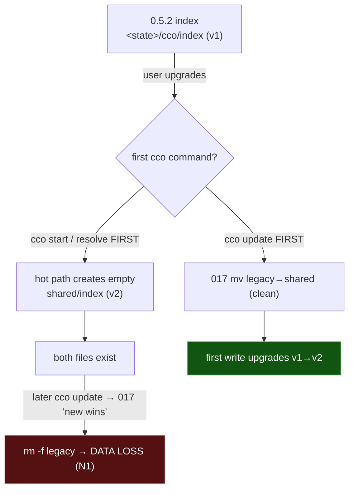
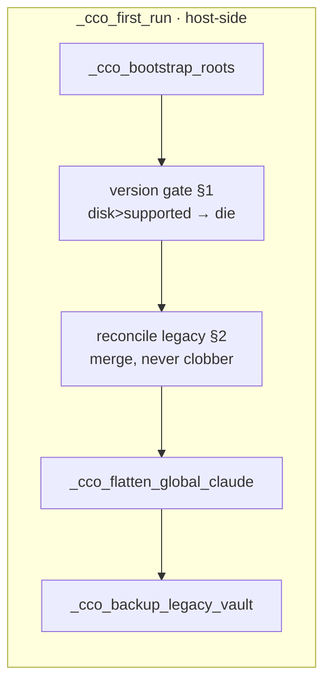

# ADR 0052 — Index integrity: fail-loud version gate + non-destructive reconcile

**Status**: Accepted (2026-07-22) — implementing on `feat/index/integrity-hardening`; per-workstream
status tracked in [`index-integrity/00-plan.md`](../index-integrity/00-plan.md).
**Deciders**: maintainer + design session (4-way code recon)
**Context docs**: `../../../roadmap-backlog.md` (FI-16, FI-22, FI-23), the host e2e-review v3.1
§10.6 incident report (2026-07-22)
**Related ADRs**: **0051 (per-project name scoping — the v2 index model this protects; D2 rejects a
global-default layer, D6 defines the in-index v1→v2 self-upgrade)**, 0021 (resource lifecycle /
cleanup integrity — the `cco config validate --fix` two-phase sync-class model reused here), 0016
D4 (index = 4-bucket machine-local name→path), 0017 D2/D3 (non-destructive scan; J0 four-root
bootstrap), 0047 (privilege boundary — the reconcile is host-only, the legacy path never mounts),
0037 (npm packaging — the published binary that predates all of this)

---

## Context

The machine-local STATE path index underwent **two independent transitions** on the road to
release, and the code conflated them:

| Transition | From → To | Owner | Trigger | State |
|---|---|---|---|---|
| **Schema** | v1 flat `paths:` → v2 nested `project_paths:` | in-index `_index_migrate_if_needed` (ADR-0051 D6) | first host-side write | sound — lossless, transparent, dual-read |
| **Location** | `<state>/cco/index` → `<state>/cco/shared/index` | `migrations/global/017` (S1/R1) | `cco update` only | **defective** |

A legacy index is simultaneously *old-location* **and** *v1-schema*, so a correct reconcile must
**relocate + merge + upgrade** atomically. Keeping the two transitions separate is the root of the
observed failures.

**The incident (host e2e-review v3.1 §10.6, 2026-07-22).** Alternating the published npm `cco`
(v0.5.2 — index at `<state>/cco/index`, schema v1) with the develop `bin/cco` (index at
`<state>/cco/shared/index`, schema v2) lost registered paths, reported "the path index is empty",
re-prompted to resolve repos that were present all along, and `q`/Exit at a `cco start` mount prompt
booted the session anyway. Triage tied this to three already-tracked notes **and surfaced three new
defects**:

- **N1 — data loss in migration 017.** When both `<state>/cco/index` and `<state>/cco/shared/index`
  exist, 017's index arm does `rm -f "$state/index"` with no backup ("new wins"). It cannot
  distinguish the benign partial-run/downgrade-bounce from "the new file was created by ordinary
  hot-path use and is a *subset* of the legacy one." Reachable by any 0.5.2→release upgrade where the
  user runs `cco start`/`cco resolve` **before** `cco update`.
- **N2 — the hot path never reconciles the legacy location.** `_index_ensure_file` creates a fresh
  empty v2 `shared/index` when absent, never consulting `<state>/cco/index`; only `cco update`→017
  relocates. `cco start` merely prints "Updates available". So the natural order (start first, update
  later) first diverges, then N1 deletes.
- **N3 — `q`/Exit does not abort `cco start`.** `_resolve_unit` maps `_prompt_for_path` rc=2 (abort)
  to `return 0`; `_start_resolve_paths` ignores the return → the session boots. The menu promises
  "(q) Exit" but delivers "skip-and-boot".

Already tracked and folded into this cluster (the backlog itself says *"FI-21/22/23 all touch the
index model — scope them together"*, FI-16 first):

- **FI-16** — a newer cco leaves state an older one silently misreads (the "empty" + re-clone
  symptoms). Root fix = fail loud at the boundary, not patch 0.5.2.
- **FI-23** — the v1→v2 migration re-homes *repos-membership* names only, so every legacy
  extra_mount lands in the `unscoped:` bucket — a de-facto global-default layer that ADR-0051 D2
  explicitly rejects.
- **FI-22** — internal state has no integrity story: lenient readers (index awk, tags, remotes) skip
  malformed records silently, so corruption reads as "empty".

## Decision

### 1. Fail-loud version gate — refuse when on-disk state is newer than the binary

A single host-only gate in `_cco_first_run` (the pre-dispatch choke point, `lib/migrate.sh`),
placed **after** `_cco_bootstrap_roots` (STATE must exist) but **before** the state-mutating
self-heals (`_cco_flatten_global_claude`, `_cco_backup_legacy_vault`, and the new reconcile of §2).
It compares the on-disk version of each **versioned** artifact against this binary's supported
maximum and **dies on any `disk > supported`**:

- global `.cco/meta` `schema_version` vs `_latest_schema_version global` (self-maintaining — scans
  `migrations/global/`);
- the index `version:` vs a **single declared constant** (see below).

**`die` on every verb, not just writers.** A verb-class split (die-writers / warn-read) was rejected
(Alternatives A): a binary that does not understand the newer schema cannot *read* it safely either
— it misparses and prints wrong output, which is precisely the "empty index" mislead FI-16 exists to
kill. Warn-then-misread is a weaker fail-loud. `die` everywhere is simpler (no verb classification,
no "freeze the self-heals" branch) and more honest. The cost — a developer running an older gated
binary against newer state — is removed at the source by the developer sandbox (§7), not papered
over by a warn.

**Single index-version source.** Today `2` is hardcoded twice (`_index_ensure_file` writes it,
`_index_version` defaults around it). The gate needs a declared bound. The index is an **in-index
self-upgrade** (ADR-0051 D6), *not* a `migrations/` script, so the bound is a **constant**
(`CCO_INDEX_VERSION`, single definition) consumed by the writer, the reader default, and the gate —
not a `migrations/index/` directory (Alternatives B).

Also closes the `_cco_in_container` gap (honours `CCO_IN_CONTAINER==1` but never `==0`) so host
semantics can be forced deterministically.

### 2. Non-destructive merge reconcile of the legacy index location (N1 + N2)

A host-only `_index_reconcile_legacy_location` (guarded `! _cco_container_operator` — under the
ADR-0047 boundary the legacy path is not even mounted into a session):

- **legacy absent** → no-op;
- **legacy present, new absent** → `mv` (the benign case, already correct);
- **both present** → **MERGE**: convert the legacy (v1) entries through the same v1→v2 re-homing,
  then fold them into the existing v2 file — adopt a `(project, name)` the new file lacks; skip when
  the paths already agree; on a **path conflict** (same key, different path) **prompt** on a TTY,
  else **keep both files, warn, and do NOT delete** (the non-destructive guarantee). The legacy file
  is removed only after a fully-resolved merge.

Called from **two** sites so both orderings are safe:

- `_cco_first_run` — auto-heals on any command, host-side, idempotent (legacy gone after the first
  merge → cheap `[[ -f ]]` no-op thereafter). This is what closes N2 without waiting for `cco update`.
- migration `017`'s index arm — the explicit `cco update` path, its `rm -f`/"new wins" replaced by
  the same reconcile. This closes N1. (017 already preserves the pack/template sidecar trees
  per-entry — "never `-rf` it"; the index arm is brought into line with that caution.)

### 3. In-index residue absorption (the alternating-binary write divergence)

Extend `_index_migrate_if_needed`: today it fires only when `version < 2`. It also fires when the
file is `version: 2` **but** carries a non-empty legacy `paths:` section — a residue written by an
older binary that misread the v2 file as empty and wrote v1-format records back into it. The residue
is folded into `project_paths:`/`unscoped:` via the existing re-homing and the `paths:` section is
dropped. This is the "sanitise the internal indices without losing anything" guarantee: a legacy
write is re-absorbed on the next host-side write rather than silently ignored forever.

### 4. Extra_mount re-home (FI-23)

The v1→v2 migration is corrected to re-home extra_mount names under the projects whose `project.yml`
declares them (via `yml_get_mount_coords`), leaving `unscoped:` for genuine project-less `cco path
set` pins only — restoring ADR-0051 D2 ("no global-default layer for generic labels"). Residue
already on disk is re-homed by a new detection in `cco config validate --fix`.

### 5. Index-focused doctor (FI-22, this cycle)

Generalise the existing `cco path list` precedent (flag non-absolute entries + warn) into a
**flag-on-read + warn-once** contract for `cco config validate`: malformed/unparseable records are
reported **separately** from orphans and are **never pruned** (the user decides format repair);
orphan pruning keeps the ADR-0021 two-phase sync-class calibration (STATE/CACHE one confirmation,
synced DATA a second). Broad structural/format validation of the other lenient readers (tags,
remotes) is **out of scope this cycle** and remains under FI-22.

### 6. `q`/Exit honours the exit (N3)

`_resolve_unit` propagates rc=2 (abort) instead of `return 0`; `_start_resolve_paths` aborts the
start before the container boots; standalone `cco resolve` exits cleanly. Bindings already written
stay valid.

### 7. Developer sandbox — isolated XDG buckets (what makes §1's `die` safe)

The only realistic multi-version scenario is a developer testing a dev binary against the published
one on the **same filesystem / XDG dirs** — shared state is the root cause, not the reaction. A
toggle redirects the internal buckets (`CCO_STATE_HOME`/`CCO_CACHE_HOME`/`CCO_DATA_HOME` — already
resolved by `paths.sh`) to a separate sandbox root, with an optional one-shot seed-copy from the
real buckets and a visible indicator (in `cco whoami` / command output). With the sandbox, the two
binaries never touch each other's state, so §1's `die`-on-everything costs the developer nothing and
protects the ordinary user completely.

## Alternatives considered

- **A — die on writers, warn on read-only.** FI-16 floats this. Rejected: reading a schema the binary
  does not understand yields *wrong* output (the very "empty index" symptom), so a warn-and-read is a
  weaker fail-loud that still misleads; and it forces a "freeze the self-heals" branch in
  `_cco_first_run` for the incompatible-read case. `die` + the developer sandbox is simpler and
  strictly honest.
- **B — a `migrations/index/` directory to derive the index bound like the schema bound.** Rejected:
  ADR-0051 D6 deliberately keeps the index upgrade *in-index* (machine-local STATE, no `cco update`,
  no user action). A single `CCO_INDEX_VERSION` constant is the coherent bound.
- **C — keep 017 "new wins", add a `.bak` before `rm -f`.** Rejected as the primary fix: it leaves
  recovery manual and does not reconstitute the index; a real merge preserves the bindings live. (A
  defensive `.bak` may still be written by the reconcile before it removes the legacy — an
  implementation-level safety net, not the contract.)
- **D — a global-default layer so a generic extra_mount name resolves across projects.** Already
  rejected by ADR-0051 D2; re-homing under the declaring project is the correct model.

## Consequences

**Preserved invariants** (pinned in `tests/test_index.sh`, `test_resolve.sh`, `test_migrate*.sh`;
baseline 1463/9 in-container): AD5′ (per-project name→path uniqueness), `INV-NON-DESTRUCTIVE-SCAN`,
`INV-NO-PRUNE`, the v2 scaffold shape, and v1→v2 losslessness. The reconcile is **additive** to these
— it never prunes, never overwrites a diverging binding without consent, and remains scan-rebuildable.

**Classification** (per `.claude/rules/update-system.md`): the reconcile and residue-absorption are
in-index self-upgrade (ADR-0051 D6 model, no `migrations/` script). The corrected `017` is an
existing global migration edited in place (idempotent). The gate, the `CCO_INDEX_VERSION` constant,
the doctor extension, N3, and the developer sandbox are **additive** → a `changelog.yml` entry
(user-visible: data preservation on upgrade + the new gate + the sandbox). No new schema version.

**Forward pointers**: this ADR promotes and closes (in part) FI-16 (gate), FI-22 (index-focused
doctor; broad reader validation stays open), FI-23 (extra_mount re-home), and records N1/N2/N3.
ADR-0051 D6's "lossless migration" now also covers the location + residue cases. ADR-0021's
`config validate --fix` gains a malformed-report lane and the FI-23 re-home op.
