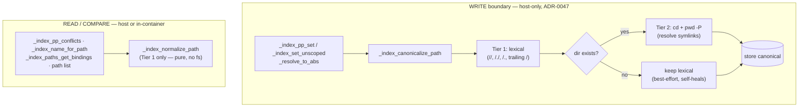
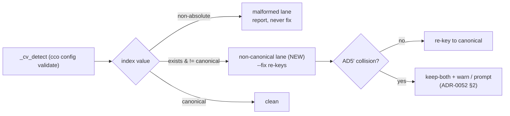

# ADR 0053 — Index path canonicalization: physical identity at the write boundary

**Status**: Accepted (design) — 2026-07-24. Implementation gated separately.
Refines **design.md §3** ("Absolute paths only — enforced at the write boundary") and
operationalizes **ADR-0051 D1** (identity is the PATH). Extends **ADR-0052 §5** (index-focused
doctor) with a non-canonical detection lane. Closes roadmap **FI-27**.

**Related ADRs**: 0051 D1 (path identity), D3 (`_index_path_conflicts` chokepoint), D6 (in-index
lazy migration doctrine); 0052 §2 (non-destructive merge reconcile), §5 (doctor flag-on-read),
§7 (developer sandbox — note the label collision clarified in Consequences); 0047 (privilege
boundary — index writes are host-only); 0021 (`config validate --fix` two-phase sync-class).

---

## Context

`_index_normalize_path` (`lib/index.sh:809`) is the single normalizer every value written to the
STATE index flows through. By design (design.md §3, lines 422-430) it is a **pure string**
normalizer: it expands `~`/`$HOME` and **rejects** anything still non-absolute, but deliberately
does **not** touch the filesystem. §3 delegates physical canonicalization to the callers ("CLI
commands additionally absolutize cwd-relative paths before storing").

That delegation is **asymmetric**, which is the defect:

- **cwd-derived** sites resolve symlinks via `pwd -P` / `cd -P && pwd` → the *physical* path
  (`_resolve_find_unit_dir` `cmd-resolve.sh:54`, `cmd-join.sh:73`, `cmd-init.sh`, and the relative
  branch of `_resolve_to_abs` `cmd-resolve.sh:46`).
- **User-supplied absolute** paths and **coordinate-resolved** paths are stored **verbatim**:
  `_resolve_to_abs` (`cmd-resolve.sh:44-47`) applies `pwd -P` *only* to the cwd prefix of a
  **relative** input; an already-absolute input (`cco path set foo /var/…`) is never resolved.

On macOS `/var`→`/private/var`, `/tmp`→`/private/tmp` are symlinks. The same working tree reached
once via cwd (`/private/var/…`) and once via a coordinate or `cco path set` (`/var/…`) is stored
and compared as **two distinct keys**. Since **ADR-0051 D1** makes the *physical host path* the
resource identity ("same path ⇒ same resource"), two symlink-aliases of one working tree **must**
key identically — and today they do not. The consequences: by-name resolve, cwd-first repo /
extra_mount rename, `join` member indexing, and the AD5′ conflict check (`_index_pp_conflicts`
`index.sh:1101`) all diverge, and the ADR-0052 reconcile "legacy … vs current … differ" warning
fires spuriously.

Two distinct sub-classes, with different feasibility:

| Sub-class | Example | Needs filesystem? | Valid on a missing path? |
|---|---|---|---|
| **Symlinked prefix** | `/var/x` vs `/private/var/x` | **Yes** (must stat/resolve) | No |
| **Lexical non-canonical** | trailing `/.`, `//`, `/./` | **No** (pure string) | Yes |

The trailing-`/.` class is live in the self-dev session path map (`…/claude-orchestrator/.`): its
origin is `_resolve_to_abs` with input `.` → `$(pwd -P)/.` (`cmd-resolve.sh:46`), which the
pure normalizer never collapses.

The test suite hit exactly this and it is currently **papered over in the harness** (commit
`8317222` wraps `mktemp` to canonicalize its output with `pwd -P`). A real macOS user with a repo
under `/var`, `/tmp`, or any symlinked prefix — or a path registered with a trailing `/.` — is
still exposed. FI-27 tracks the real implementation gap; per the maintainer, impl-touching fixes
are **designed before** the e2e v3.1 review.

**Why it is not a one-liner**: adding filesystem resolution at the write boundary (a) is on the
hot path every path write crosses, (b) reverses the deliberate *purity* of design §3, (c) must
stay correct when the path does **not exist yet**, and (d) must be **portable to bash 3.2 + BSD**
— the very environment that produced the bug. Note `realpath` is used **nowhere** in the codebase
(BSD/GNU flag divergence); the portable primitive is the shell builtin `( cd "$p" && pwd -P )`,
already present as `_sync_canon` (`cmd-sync.sh:51`).

---

## Decision

### D1 — Two-tier canonicalization, anchored at the write boundary

Keep the single-chokepoint architecture (design §3, ADR-0051 D3) but split canonicalization into
two tiers by cost and feasibility:

- **Tier 1 — lexical (pure string), folded into `_index_normalize_path`.** After the existing
  `~`/`$HOME` expansion and the absolute-path guard, collapse the lexical non-canonical forms:
  `//`→`/`, drop `/.` path segments, strip a trailing `/` (but never reduce `/` itself).
  This stays **pure string** — idempotent, portable, and correct even when the path does not
  exist. Because `_index_normalize_path` is the **shared** normalizer called at every read/compare
  site, Tier 1 closes the lexical class **universally** (write *and* compare) for free, with no
  filesystem access added to the read paths. **`..` is deliberately NOT collapsed** (see D6).

- **Tier 2 — physical (best-effort), a new `_index_canonicalize_path`.** Contract: run the value
  through Tier 1, then — **iff the result is an existing directory** — resolve symlinks via the
  `_sync_canon` primitive `( cd "$p" && pwd -P )`; otherwise return the Tier-1 (lexical) form
  unchanged. No `realpath`. Idempotent. This tier is wired **only at the write boundary**, never
  into the shared read normalizer.



Stored values are physical+lexical; the dominant probes (`pwd -P`) are already physical, so
compares — which normalize both sides with the pure Tier-1 normalizer — now agree on both classes.

### D2 — Best-effort physical resolution answers the "path does not exist yet" case

The hot-path writers (`init` / `join` / `resolve`) **always** bind an existing working tree (the
located or cloned directory). cco does **not** register a coordinate before it is resolved to a
real directory. The only writers of a possibly-missing path are:

- `cco path set` (the documented low-level manual editor — "fix divergence, external installs"), and
- legacy re-home during the ADR-0052 reconcile / v1→v2 migration (paths from a stale legacy index).

For those, Tier 2 falls back to Tier-1 lexical only (you cannot resolve the symlinks of a path you
cannot stat). This is deterministic per input and **self-heals**: once the path exists, the next
cwd-derived write / `cco resolve --scan` / doctor `--fix` re-canonicalizes it. The residual window
(a `cco path set /var/x` stored before `x` exists, later diverging from a `/private/var/x`
cwd-derived write) is narrow, confined to the manual surface, and caught by D5's doctor lane.

### D3 — Wiring (interfaces, no behavior change to the read contract)

| Site | Today | Change |
|---|---|---|
| `_index_pp_set` (`index.sh:622`) | `_index_normalize_path "$3"` | `_index_canonicalize_path "$3"` |
| `_index_set_unscoped` (`index.sh:908`) | `_index_normalize_path "$2"` | `_index_canonicalize_path "$2"` |
| `_index_set_path` (`index.sh:891`) | alias of `_index_pp_set` | inherits, no edit |
| `_resolve_to_abs` (`cmd-resolve.sh:34`) | `pwd -P` prefix on relative only | canonicalize the final absolute value (feeds the pre-write conflict check too) |
| `cmd-init.sh:272` `target` | `$PWD` (LOGICAL cwd) | `_index_canonicalize_path "$PWD"` — see note |
| every read/compare (`_index_pp_conflicts`, `_index_name_for_path`, `_index_paths_get_bindings`, `cco path list`, `cmd-forget`, `cmd-sync`) | `_index_normalize_path` | **unchanged** (now Tier-1-canon) |

**Probe-source rule (implementation refinement).** The load-bearing principle is that a probe
compared against the index must be derived in the *same canonical spelling* the writer stores.
`_resolve_to_abs` is the shared derivation point for `path set`/`resolve`/prompts, so canonicalizing
there covers those. Two more sites derive a probe directly and must match: `cmd-init.sh:272` used
`$PWD` — the **logical** cwd (symlinks unresolved) — for both the AD5′ pre-check and the write, so
without canonicalizing it a re-init from a symlinked cwd (macOS `/tmp`, `/var`) would raise a
**false** "already bound to `<physical>`" conflict once the writer stores the physical path; it is
now canonicalized at derivation. (`join`/`resolve` already derive via `pwd -P` = physical, so they
need no change; `migrate`'s conflict check runs only on a fresh migration and the writer still
stores the canonical value; `cco project show`'s `$PWD` is display-only — it reverse-looks-up member
paths *from* the index, never comparing `$PWD` against it — so it stays logical, cosmetically.)

Canonicalizing inside `_resolve_to_abs` is load-bearing: its output feeds **both** the
pre-write `_index_path_conflicts` check (`cmd-resolve.sh:590`) and the interactive prompts, so the
AD5′ pre-check compares a canonical probe against a canonical stored value — no spurious
conflict/non-conflict in the window before the write.

Contract of the new helper (pseudocode — not implementation):

```
_index_canonicalize_path <value> → stdout canonical abs path, return 0
                                  → (non-absolute) no output, return 1
  norm = _index_normalize_path(value)      # Tier 1; return 1 propagates
  if [ -d norm ]: ( cd norm && pwd -P )     # Tier 2, portable builtin
  else:           printf norm               # best-effort fallback (D2)
```

### D4 — Physical resolution is a host-only-write invariant

Under ADR-0047 the index is writable **host-side only** (the in-container operator cannot write
it). Tier 2 (`cd`/`pwd -P`) requires the host path to be reachable, which holds host-side and
never in a container (host paths are not mounted there). Therefore:

> **INV-CANON** — physical resolution lives only at the (host-only) write boundary. Reads and
> compares — which run in both host and container — use the pure Tier-1 `_index_normalize_path`
> and never touch the filesystem. `_index_canonicalize_path` is reachable only from write sites.

This is *why* Tier 2 is a separate helper rather than being folded into the shared normalizer: an
in-container read must never attempt `cd` on a non-existent host path.

### D5 — Re-keying divergent indexes: lazy self-heal + doctor, no migration script

Existing on-disk indexes may already hold divergent spellings. Two mechanisms, no forced
`migrations/index` script (consistent with ADR-0051 D6's in-index doctrine and ADR-0052
alternative B):

1. **Lazy self-heal on write** — any upsert re-canonicalizes through D3, healing the hot entries
   without `cco update`.
2. **Doctor `--fix` re-key** — extend `cco config validate`'s `_cv_detect` (`cmd-config.sh:231`)
   with a **non-canonical** detection distinct from the existing **malformed** lane:

   | Lane | Predicate | Repair |
   |---|---|---|
   | malformed (`_CV_MALFORMED`, WS-5) | value is non-absolute (`! _index_normalize_path`) | **reported, never fixed** (a hand-edit; user decides) |
   | **non-canonical (new)** | path exists **and** `_index_canonicalize_path(v) != v` | **`--fix` re-keys** to canonical |

   The re-key is a mechanical re-spelling of the **same** resource, so unlike malformed it is
   safe to auto-apply on confirm. On an AD5′ collision (the canonical form already bound under the
   same `(project, name)` to a different path, or two entries collapsing onto one path) apply the
   ADR-0052 §2 semantics: **keep-both + warn**, prompt on a TTY, never silently overwrite.

   > **Implementation refinement (this cycle).** The shipped `idx_recanon` arm re-derives the
   > CURRENT stored value for the fixed key `(project, name)` and re-writes it through the
   > canonicalizing writer. This is a pure **value rewrite under a fixed key**, so an AD5′ violation
   > is not actually reachable: it overwrites one key's value (never creates a second name for it),
   > and AD5′ explicitly permits the *same path under different names* — so two entries canonicalizing
   > onto one path is legal, not a collision. The keep-both branch above is therefore defensive/
   > unreached for the re-key; it is documented for completeness and remains the model should a future
   > re-key ever *move* a key rather than rewrite its value.



`cco resolve --scan` remains the bulk rebuild backstop, but it is `keep-existing` on conflict
(non-destructive) so it will not overwrite a divergent entry — the doctor `--fix` is the actual
consented re-key tool.

### D6 — `..` is not collapsed lexically

Lexical `..` resolution is **wrong** across symlinks (`/a/b/..` ≠ `/a` when `b` is a symlink), so
Tier 1 must not touch `..`. Only Tier 2's physical resolution collapses `..` correctly, and only
when the path exists. `..` in a stored index value is not an observed class; if one ever appears
on a missing path it is left verbatim and surfaces via the doctor.

---

## Alternatives considered

- **A — canonicalize only at the compare sites** (both sides physically resolved per compare).
  Rejected: it is O(filesystem) per compare, would make in-container reads `cd` on non-existent
  host paths (violating INV-CANON), leaves the **stored** value non-canonical for every reader
  that does not compare (e.g. `cco path list` display, `_index_get_path` consumers), and requires
  finding and patching *every* compare site consistently — a larger, more fragile surface than one
  write chokepoint.
- **B — lexical only, no symlink resolution.** Rejected: it closes the trailing-`/.` class but
  leaves the `/var`↔`/private/var` divergence, which is the actual macOS bug.
- **C — introduce `realpath`.** Rejected: absent from the codebase, BSD vs GNU flag divergence,
  and it is precisely the bash-3.2 + BSD environment that produced this bug. `( cd && pwd -P )` is
  the portable builtin (already `_sync_canon`).
- **D — eager one-shot `migrations/global/NNN_canonicalize-index.sh`** modeled on the pure-string
  `016_normalize-index.sh`. Rejected as the primary fix: `016` is a **pure-string** rewrite, safe
  to run blindly at `cco update`; FI-27's canonicalization is **filesystem-touching** (needs the
  paths present at update time) and can create AD5′ collisions requiring the keep-both/merge logic
  — heavier and in tension with ADR-0051 D6 / ADR-0052 alt-B. The doctor `--fix` is the consented
  re-key. Left open as a possible future *eager* convenience if bulk healing at `cco update`
  becomes desirable.
- **E — resolve symlinks even for non-existent paths (lexical `..`/symlink guessing).** Rejected:
  a symlink you cannot stat cannot be resolved, and lexical `..` is unsafe (D6).

---

## Consequences

- **Operationalizes ADR-0051 D1.** The write boundary now enforces *physical* identity: two
  symlink-aliases of one working tree key identically. This is the intended meaning of "identity
  is the path", not a new behavior.
- **Preserved invariants** (to be pinned in `tests/`): AD5′ (canonicalization cannot split a
  single map key; the only collision risk is in the doctor re-key, handled by keep-both), the
  purity of the *shared* normalizer at read (still pure — now lexically canonical too),
  `INV-NON-DESTRUCTIVE-SCAN`, `INV-NO-PRUNE`, and INV-CANON (D4).
- **Portability**: bash 3.2 + BSD safe — builtins only (`cd`, `pwd -P`, parameter expansion / a
  small `awk` for the lexical pass), no `realpath`.
- **Classification** (per `.claude/rules/update-system.md`): the write-boundary canonicalization +
  lazy self-heal are **in-index self-heal** (ADR-0051 D6 model — no `migrations/` script). The new
  `_index_canonicalize_path` helper and the doctor non-canonical lane are **additive** → a
  `changelog.yml` entry at implementation (user-visible: consistent path identity on macOS + a new
  `config validate` repair). **No schema version change.**
- **Living-doc sweep at implementation**: design.md §3 (describe the two-tier boundary), cli.md
  (`cco config validate` non-canonical lane), and forward-annotations on ADR-0051 (§3 / D1 — the
  normalizer is now two-tier) and ADR-0052 (§5 doctor gains the lane). Per
  `documentation-lifecycle.md` these are updated at the phase that makes them true, not ahead of
  the code.
- **Doc-hygiene**: ADR-0052 §7's WS-6 annotation contains "No scope split → **no FI-27**", where
  "FI-27" was a placeholder for a hypothetical dev-sandbox scope-split follow-up written
  (2026-07-23) **before** the real FI-27 backlog item existed (2026-07-24). The label now collides;
  clarify it in the ADR-0052 §7 annotation (this ADR is the real FI-27; the §7 line refers to a
  different, dropped follow-up).
- **Test plan** (design-driven): unit tests for `_index_canonicalize_path` (lexical cases — `/.`,
  `//`, `/./`, trailing `/`, `/` itself; symlink resolution; non-existent fallback; idempotency;
  `..` left verbatim on a missing path), `_index_pp_conflicts` consistency across symlink-aliases,
  and the doctor non-canonical detection + `--fix` re-key + AD5′ keep-both. macOS reproduction is
  possible in a Linux container via a **symlinked `TMPDIR`** (a GNU `mktemp` under a symlinked
  temp dir returns the symlinked spelling, mirroring BSD/macOS — the harness lesson from the
  portability sweep), so the fix is verifiable in-container despite the Mac-only symptom.

---

## Follow-up (out of this ADR)

- Whether to also ship the eager migration (alternative D) as a convenience.
- Broad structural validation of the other lenient readers (tags, remotes) stays under FI-22.
