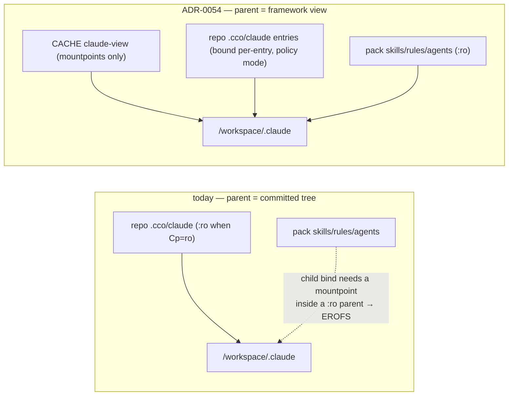

# ADR 0054 — Framework-owned mountpoints for injected `.claude` overlays

**Status**: Accepted (design) — 2026-07-26. Implementation in the same cycle.
Refines **ADR-0005** `RD-claude-mount` (F1/F2/**F3**) by replacing its dropped precondition.
Generalizes the **ADR-0049 §5** forward annotation (2026-07-15) from the `settings.local.json`
lane to *every* framework-injected child. Closes roadmap **FI-31**.

**Related ADRs**: 0005 (dual claude scope; the nested-overlay mechanism, F1 derived-files rule,
F2 reserved namespaces, F3 "parent stays rw"); 0049 §2 (Cp/Cr read-only by default — the change
that invalidated F3), §5 (functional-write floor + the mountpoint annotation); 0004 (CONFIG /
STATE / CACHE separation — the view is CACHE); 0047 (privilege boundary — the view is *not* a
confined bucket); 0019 D5 (three-layer pack resolution — unchanged).

---

## Context

`/workspace/.claude` is a single mount slot that must present **two sources at once**: the
project's committed authoring tree (`<repo>/.cco/claude/`) and the framework's injected
resources (pack `rules`/`agents`/`skills`/`knowledge`, `llms` docs). ADR-0005's `RD-claude-mount`
resolution settled how: the committed tree is the parent bind, framework resources are **nested
`:ro` binds** at deeper paths, and Docker orders mounts parent-before-child so the overlays
compose without shadowing siblings. It verified that mechanism against the code and recorded
three follow-ups, of which the third is the load-bearing one here:

> **F3 — parent stays rw.** In-session edits to cross-repo config must land in the cwd repo's
> `.cco/claude/` for commit, so the parent mount stays rw; pack/llms overlays stay `:ro`.

F3 was an **invariant the design leaned on**, not merely a preference: a bind whose target does
not exist inside a `:ro` parent cannot be created. runc must `mkdirat` the mountpoint, the write
traverses the read-only bind, and it fails with `EROFS` — the container never starts. (The host
directory behind the bind is perfectly writable; it is the mount's `ro` flag that refuses.)

**ADR-0049 §2 then made `Cp=ro` the default** — reversing P17 so a normal session no longer
authors `.claude` — and never revisited F3. The consequence was found on 2026-07-15 and written
into ADR-0049 §5 verbatim (*"Docker/runc cannot create the mountpoint inside the `:ro` parent …
the target must simply pre-exist"*), but the remedy — seeding an inert stub host-side before the
bind — was applied **only to `settings.local.json`**. The pack and llms lanes consume the same
dropped precondition and were left behind.

**Observed 2026-07-26** (host, real project): adopting a pack that ships skills makes `cco start`
die in runc —

```
error mounting ".../packs/core-dev-framework/skills/review-refactoring" to rootfs at
"/workspace/.claude/skills/review-refactoring": create mountpoint …: read-only file system
```

The failure has nothing to do with the pack's contents or with pack permissions — the pack is
correctly `:ro` and correctly resolved. Any child would fail identically. Projects created
*before* ADR-0049 are masked: they ran with `.claude` writable, so runc silently created the
mountpoint directories inside their committed tree, and that residue persists (cco's own repo
carries `.cco/claude/llms/{platform-claude,code-claude}/` — empty auto-created dirs).

Two properties of the current state make this more than a one-line bug:

- The **only** remedy available to a user is to grant `claude` write access — i.e. to work around
  a *visibility* failure by widening an *authoring* policy. The two are meant to be orthogonal.
- The `settings.local.json` remedy writes a framework-derived artifact into the committed tree,
  which is exactly what **ADR-0005 F1** decided against ("generated files are NOT written into
  `.cco/claude/`; they are produced in a machine-local cache dir and overlaid"). It survives as a
  bounded exception because the name is single and fixed (gitignored by migration 015).
  Replicating it across the pack/llms lanes would multiply the exception — and could not be
  gitignored at all, since a stub in `rules/`/`agents/` carries a pack-chosen filename
  indistinguishable from user content.



## Decision

### D1 — INV-MP, the invariant that replaces F3

> **Every mountpoint of a framework-injected bind is created by cco, host-side, before the
> container starts — never left to runc, and never dependent on the writability of a
> policy-governed tree.**

Corollary, and the discriminator to apply when this recurs: the `claude` axis governs
**authoring**, never the **visibility** of framework resources. A session at any `claude_access`
level sees its packs and llms; what the level decides is who may *write* the authoring trees.
F3 ("parent stays rw") is **superseded**: the parent's writability is no longer a precondition of
the mechanism, so it is free to follow policy.

### D2 — Mechanism: a framework-owned view directory, built only when children are injected

When a session injects **no** children under `/workspace/.claude`, nothing changes: the committed
tree is bound whole, exactly as today. This keeps the majority path byte-identical and confines
the change to the sessions that are broken today.

Otherwise cco builds a **view directory** in CACHE containing *only mountpoints* — empty
directories and empty files, no content — and mounts **that** at `/workspace/.claude`. Into it:

| Source | Bound at | Mode |
|---|---|---|
| the view itself (mountpoints only) | `/workspace/.claude` | the policy's Cp mode |
| each top-level entry of the committed tree **not** receiving injections | `/workspace/.claude/<entry>` | Cp mode |
| each committed file inside an **injected namespace** (`rules/`, `agents/`, `skills/`) | `/workspace/.claude/<ns>/<file>` | Cp mode |
| pack `rules`/`agents`/`skills` files, pack knowledge, llms docs | unchanged targets | `:ro` |
| `settings.local.json` STATE overlay (when Cp=ro) | unchanged target | rw |

The injected-child set is **derived from the emitted mount lines themselves**, not re-enumerated:
compose generation captures what `_generate_pack_mounts` / `_generate_llms_mounts` produce and
creates a stub per target. A future injector (e.g. `commands/`, FI-29) is therefore covered the
day it emits a line, with no second list to keep in sync.

### D3 — The view is mounted at the policy's mode, not rw

Tempting and rejected: mount the framework-owned parent rw and keep children `:ro`. It would make
`Cp=ro` a lie — the agent could create files under `/workspace/.claude` that *appear* to persist
while landing in CACHE. That is the false-success class the e2e v2 review spent a cycle removing.
The view carries no content of its own, so mounting it `:ro` costs nothing: every mountpoint it
needs already exists by the time the container starts.

### D4 — The residual delta, bounded and surfaced

In a session that **is** composing *and* has `Cp=rw`, a **newly created** file written directly
into a composed namespace lands in the CACHE view instead of the repo (edits to existing files
still reach the repo through their own per-entry bind). This is inherent: a flat directory that
must hold files from two sources cannot be either source. It is bounded by D2 (only composed
namespaces, only when packs inject) and must be **surfaced** — `cco start` says so once, and the
authoring guidance is to edit `<repo>/.cco/claude/` directly, as it already is for `:ro` sessions.

Rejected alternative: copy the view back into the repo at session end (drift, races between
concurrent sessions on one repo, and nothing runs reliably after `docker compose run --rm`).

### D5 — The view is regenerable CACHE, not confined state

It lives at `<cache>/cco/projects/<name>/claude-view/`, the same class as the existing per-session
managed overlays (`_cco_project_cache_managed`), and is **rebuilt from scratch at every start** so
a removed pack leaves nothing behind. It is *not* an ADR-0047-confined bucket: it holds no
cross-project or host-path confidential data — only empty stubs whose names come from the
session's own project. `cmd-start.sh` is already the allowlisted host-only writer for CACHE.

### D6 — `settings.local.json` rejoins F1 when composing

While composing, the overlay's mountpoint is a stub **in the view**, not in the committed tree —
removing the F1 exception for that lane too. The ADR-0049 §5 refinement is preserved: STATE is
still seeded from the committed `settings.local.json` when one exists, so a real file keeps its
content. When not composing, the existing repo-side seed stays as is.

### D7 — Test contract

Dry-run compose assertions cover the composed parent, the per-entry binds, the preserved pack/llms
targets, and the no-injection path staying byte-identical; a non-dry-run assertion covers that the
view materializes every mountpoint. The **mount-time** failure itself stays an e2e-gate concern —
this is the third recurrence of "the hermetic suite cannot see mount-time failures" (ADR-0049 §5,
e2e v2 RC-17, now FI-31), and D7 does not pretend to close it.

> **Implementation note (2026-07-26, same day).** The first implementation satisfied D7 as written
> and still shipped a broken `cco start` — the host hit `EROFS` on `settings.json` instead of a pack
> skill. Cause: `local view="$1" rel="$2" src="$3" mp="$view/$rel"` in the stub helper. `local` is a
> builtin, so **all** its arguments are expanded before any assignment lands; `$view`/`$rel` therefore
> resolved to the *caller's* identically-named variables (bash is dynamically scoped) — correct by
> accident while looping over injected children, and a silent no-op for every committed entry, whose
> mountpoints were consequently never created. D7 is therefore **strengthened from spot checks to a
> property**: for every child target emitted (by this function *and* by the captured pack/llms lines),
> the view must carry a mountpoint of the matching shape. The language trap is closed separately by a
> static lint, `test_invariant_no_local_self_reference` (INV-LOCAL), which also found — and fixed —
> two latent instances of the same shape elsewhere in the tree (`_config_ensure_gitignore`,
> `_mig014_rm`; both were accidentally correct, one caller rename away from breaking).

## Alternatives considered

| Option | Why not |
|---|---|
| **Generalize the stub seed into the committed tree** (the §5 pattern, 4 more lanes) | Smallest diff, and it works — but it writes framework artifacts into the committed tree against F1, and the `rules/`/`agents/` stubs carry pack-chosen filenames that no static `.gitignore` can separate from user content. Also leaves residue when a pack is removed. |
| **Parent always rw** | Already rejected in ADR-0049 §5 for the same reason: it holes the `ro` guarantee (new files become creatable) and re-couples visibility to the authoring policy. |
| **Copy-based mirror of the tree into CACHE** | In-session edits would never reach the repo; drift between the copy and the source. The per-entry bind keeps writes truthful. |
| **Scaffold the namespace dirs in the project template + migration** | Empty directories do not survive a git clone, so the fix would evaporate for the next person to clone the repo; a `.gitkeep` inside `packs/` additionally trips F2's framework-reserved warning. |

## Consequences

**Positive** — pack/llms visibility no longer depends on the `claude` policy, in either
direction; the committed tree stops accumulating framework residue (and stops needing gitignore
entries for it); F1 regains the `settings.local.json` lane; a future injector inherits the
mountpoint handling for free (D2); the tutorial and config-editor built-ins are covered by the
same path, since they differ only in which tree `claude_src` points at.

**Negative** — one more per-start host-side step (a `mkdir`/`:>` sweep over a handful of paths);
the compose file grows one line per committed entry when composing; and D4's new-file delta in
`Cp=rw` sessions with packs.

**Migration** — none. The view is CACHE (regenerable, never committed) and no schema changes.
Pre-existing empty mountpoint dirs in committed trees (`.cco/claude/llms/*`, `skills/*`) are inert
residue: harmless, removable by hand, not worth a migration.
