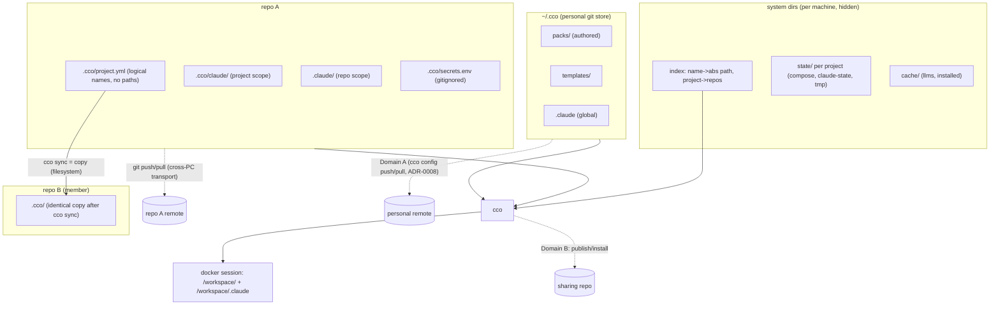
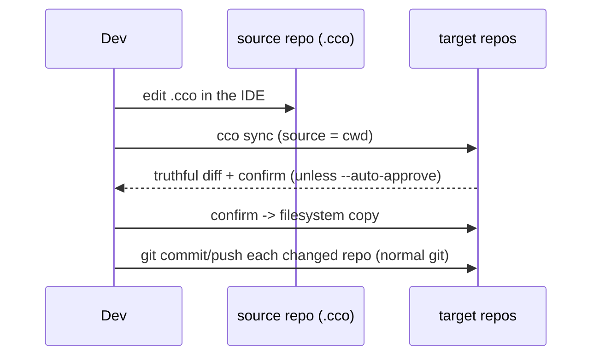

# Decentralized In-Repo Config — Design

**Status**: Approved for implementation (2026-06-15); **§2 layout rewritten to the 4-bucket
taxonomy by ADR-0016 (M, 2026-06-17)**; **Domain-B sharing realigned by the S cycle — §2.1/§2.4
(pack coordinates + project-local packs), §6.2, §7, §12 (ADR-0018/0019/0020, 2026-06-18)**;
**§1 overview realigned to ADR-0008 (`~/.cco` management) + sharing-repo nomenclature
(Cluster 3 doc-resync, 2026-06-19)**.
**Implementation status (2026-06-29): fully realized — Phases 0–5 (§9) plus the impl-readiness
review (ADRs 0021–0023), the pre-merge review cycle (flatten ADR-0028, UX-UI ADR-0029), and Mac
dogfooding rounds 2–3 + the `cco sync` UX refinement (ADRs 0030–0035) are all shipped on
`feat/vault/decentralized-config` (suite 1010/0). Host e2e validated; v1 ready to merge. The full
decision trail is in `decisions/` (ADR-0001…0035); live status in `../../roadmap.md`.**
Authoritative design; drives the phased implementation (§9).
**Requirements**: `requirements.md` (AD1-AD12, FR-*).
**Decision records**: `decisions/` — ADR-0001 (decentralization), 0002
(machine-agnostic config), 0003 (sync-as-copy), 0004 (config/state/cache separation),
0005 (dual `.claude` scope), 0006 (breaking cutover + lazy migration), 0007 (system-dir
locations / XDG), 0008 (config versioning model), 0009 (auto-memory is machine-local STATE),
0010 (resource authoring + per-user tags), 0011 (tag nature & Cat-4 method), 0012 (manifest
removed), 0013 (internal-metadata split), 0014 (referenced-resource coordinates), 0015 (Cat-4 =
XDG DATA), **0016 (consolidated resource taxonomy — the authoritative `resource → (bucket, sync)`
map; §2 here is its tree projection)**, **0017 (coordinate field semantics + CLI consolidation +
first-run/`~/.cco` lifecycle refinements)**, **0018 (sharing model unification — config-bucket vs
sharing-repo nomenclature, 2×2 command matrix, project/pack asymmetry, sharing-repo structure),
0019 (referenced-resource reachability & pack lifecycle — coordinate model extended to packs,
working-copy lifecycle, internalize-as-cache), 0020 (maintainer/consumer permissions — enforcement
delegated to git, cco assists)**.
**Decision history (historical)**: `reviews/15-06-2026-sync-adversarial-review.md`,
`reviews/15-06-2026-simplification-analysis.md`.

> `requirements.md` says **what** and **why**; this document says **how**. It is the
> single source of truth for the refactor. Open questions are isolated in §13 and are
> the subject of dedicated follow-up analyses; everything else is decided.

---

## 1. Architecture Overview

Three ideas, no custom diff/merge: **machine-agnostic committed config**, **plain
git as the cross-PC transport**, and **sync = copy** within a project on one machine.



- **Committed `<repo>/.cco/`** — machine-agnostic config, versioned with the code.
- **System dirs** — per-machine state, cache, and the name→path index; hidden, never committed.
- **`~/.cco/`** — personal git store for global resources (Domain A; management = ADR-0008).
- **Sync** — a plain copy from a chosen source repo to targets (no merge engine).
- **Cross-PC** — plain `git` on each repo's own remote.

---

## 2. Layout

> **Authoritative as of ADR-0016 (M, 2026-06-17).** The layout is **four destination
> buckets** — two CONFIG (user-edited, IDE-reachable) and three internal (cco-managed,
> hidden): `<repo>/.cco` · `~/.cco` · **DATA** · STATE · CACHE. The full
> `resource → (bucket, mutator, sync)` table lives in `decisions/0016-…`; this section is
> its directory-tree projection. CONFIG buckets hold **only** P1-config; internal data is
> centralized keyed-by-identity in DATA/STATE/CACHE (ADR-0013/0015).
>
> | Bucket | Path (default) | Override | Nature | Sync |
> |---|---|---|---|---|
> | CONFIG / repo | `<repo>/.cco/` | — | config | Axis-1 (repo remote) **+ Axis-2 by construction** |
> | CONFIG / personal | `~/.cco/` | — | config | Axis-1 **private only** — never team |
> | **DATA** | `$XDG_DATA_HOME/cco` → `~/.local/share/cco` | `$CCO_DATA_HOME` | internal | **`required`, never team** |
> | STATE | `$XDG_STATE_HOME/cco` → `~/.local/state/cco` | `$CCO_STATE_HOME` | internal | **`never`** |
> | CACHE | `$XDG_CACHE_HOME/cco` → `~/.cache/cco` | `$CCO_CACHE_HOME` | internal | **`never`** |

### 2.1 In-repo CONFIG (committed) — `<repo>/.cco/`, machine-agnostic only
```
<repo>/
├── .claude/                  # COMMITTED — repo-local Claude config → /workspace/<repo>/.claude
├── .cco/
│   ├── .gitignore            # ignores secrets.env (+ secret patterns); !secrets.env.example
│   ├── project.yml           # logical names + embedded repo/llms coordinates (url/ref/variant); identical across repos
│   ├── secrets.env.example   # COMMITTED skeleton
│   ├── secrets.env           # GITIGNORED — real values, user-edited (only in-repo exception)
│   ├── mcp.json              # project MCP config (H5)
│   ├── setup.sh              # project setup script (H5)
│   ├── mcp-packages.txt      # project MCP package list (H5)
│   ├── claude/               # COMMITTED + (copy-)synced → /workspace/.claude
│   │   └── CLAUDE.md, rules/, agents/, skills/, settings.json   # authored config ONLY — no generated files
│   └── packs/<name>/         # OPTIONAL (ADR-0019) — project-scoped AUTHORED pack (no coordinate = source)
│                             #   OR last-layer CACHE of a referenced pack (has coordinate); ~/.cco/packs resolves first
```
This tree holds **authored config only** (ADR-0016 D8). **No internal data lives here**
(ADR-0013, fixes inventory C4): `source`, `meta`, `base/`, `local-paths.yml`, generated
`docker-compose.yml`, generated `managed/`, `claude-state/`, and `memory/` are all
**evicted** to DATA/STATE/CACHE. Framework-generated files (`packs.md`, `workspace.yml`,
`managed/{browser,github,policy}.json`) are NOT written here — they would pollute the
truthful `git diff` and the sync (ADR-0002/0004). They are produced in the machine-local
cache (§2.2) and overlaid into `/workspace/.claude` via nested `:ro` mounts, exactly like
pack/llms resources (RD-claude-mount, ADR-0005). `packs/` and `llms/` are framework-reserved
sub-paths within `/workspace/.claude`; committed config must not author into them.
**H5**: `mcp.json`/`setup.sh`/`mcp-packages.txt` are project config (here); the generated
`.cco/managed/` follows F1 → CACHE (§2.2). `.cco/.gitignore` (committed):
```gitignore
secrets.env
*.env
*.key
*.pem
.credentials.json
!secrets.env.example
```
A pre-commit/pre-push scan (reused from `lib/secrets.sh`) refuses real secrets and
**exempts `*.example` from the content scan** (FR-S3).

**The whole committed `<repo>/.cco/` is the per-(hosted-)project config and the unit of sync**
(ADR-0024 D6): `cco sync` copies the entire committed tree (`project.yml`, `claude/**`, `mcp.json`,
`setup.sh`, `mcp-packages.txt`, **authored** `packs/`, `secrets.env.example`) — **minus** the gitignored
`secrets.env` — so a project's config-bearing repos stay byte-identical (§4.1). `<repo>/.cco/` holds
**one** project's config (the one the repo hosts, §2.4); it is **never** mixed with another project's.

**`.claude` scope placement (ADR-0024 D4).** Three user-managed `.claude` trees + one framework-managed
compose in a session, each with a distinct reach: `<repo>/.claude/` (repo-native, **cross-cutting** —
loaded for every project that mounts the repo *and* native Claude use; cco never touches/syncs it) →
`/workspace/<repo>/.claude`; the **invoking** repo's `<repo>/.cco/claude/` (this repo's hosted project,
cross-repo) → `/workspace/.claude`; `~/.cco/.claude/` (all the user's projects) → `~/.claude`;
managed `defaults/managed/` (non-overridable policy, **own path, highest priority**) →
`/etc/claude-code/`. Only the **invoking** repo's `.cco/claude/` becomes the session project scope
(ADR-0005) — a referenced repo's `.cco/claude/` is **not** mounted, so a project's cross-repo config
**never leaks** into another project's session.

### 2.2 Internal buckets (per machine, hidden, never committed) — DATA / STATE / CACHE
The three internal buckets are **centralized keyed-by-identity** (ADR-0013 corollary: config
decentralizes, internal centralizes). Byte-level layout fixed by ADR-0016 (D5/D6/D7):

**DATA** — `$CCO_DATA_HOME` → `$XDG_DATA_HOME/cco` → `~/.local/share/cco` — *internal-but-synced,
never-team* (`required`, ADR-0015):
```
<data>/cco/
  tags.yml                       # per-user global tag registry — typed keys {packs,projects,templates}→[tags]
  remotes                        # de-tokenized Config-Repo endpoint registry: name→url (token in STATE)
  projects/<id>/source           # upstream coordinate ONLY (url/ref[/resource]), keyed by identity — standalone file
  packs/<name>/source            # idem
  templates/<name>/source        # idem
```
The `source` file is a **pure upstream coordinate** (`url`/`ref`/`resource` — renamed from the legacy
`source:`/`path:`; ADR-0022 D1). Machine-local bookkeeping is **not** kept here: `commit`/`installed`/
`version` live in STATE `/update` meta, and `publish_target` is **dropped — re-derived on demand** by
reverse-looking-up `url` in the `remotes` registry (so nothing machine-local rides a `required`-synced file).

**STATE** — `$CCO_STATE_HOME` → `$XDG_STATE_HOME/cco` → `~/.local/state/cco` — machine-local,
non-portable (`never`); partitioned by sync-eligibility (ADR-0013 D2):
```
<state>/cco/
  index                          # name→abs-path + project→members — SUBSUMES @local + per-repo local-paths.yml (§3)
  remotes-token                  # SECRET, isolated, 0600, never-sync (split from the DATA registry; M3)
  last_seen / last_read          # global changelog markers
  claude.json / .credentials.json  # seeded auth
  sync-meta                      # sync-set membership + last-synced fingerprints (§4.6)
  backups/                       # vault-migration archives — moved OUT of ~/.cco (fixes inventory C1)
  global/update/                 # global-scope update artifacts — meta(hashes, schema_version, policies, flags, local_framework_override) + base/(3-way ancestors); the global `.cco/meta` DECOMPOSE (ADR-0013 D4/0025): languages→~/.cco, markers→top-level above, hash `manifest:`→this meta (NOT dropped — ADR-0013 D3); H6, relocated EAGER by `cco update` at P2 — §9 P2
  projects/<id>/
    session/   memory/  claude-state/(transcripts)   # opt-in P8 (future R-state-sync)
    update/    meta(hashes, schema_version, policies, flags, local_framework_override, installed-commit)  base/(3-way ancestors)
    docker-compose.yml   .tmp/
  packs/<name>/update/base/        # pack-scoped 3-way merge ancestor (sync-before-publish; ADR-0022 D5) — never-sync
```
STATE `/update` meta also carries the per-identity **installed-commit** (relocated out of DATA `source`,
ADR-0022 D1) that `cco update --check` diffs against; and the pack-scoped `base/` ancestor for
sync-before-publish (ADR-0022 D5), mirroring the project `base/`. Both are **machine-local, never-sync**.

> **Identity key `<id>` (pinned at P2).** `<id>` is the project's **`name:`** (the `project.yml` `name`,
> which is also the `projects:` key in the index, §3) — **not** the repo-directory basename. A
> `_cco_project_id()` helper maps a resolved project dir → its `name`; `name` is already enforced unique
> (`cmd-project-create.sh`). Every per-project STATE path (`projects/<id>/update/{meta,base}`,
> `projects/<id>/{session,memory}`) is keyed by this `<id>`. Packs key by pack `name`; global is the fixed
> `global/` scope. (Maintainer-confirmed 2026-06-22; consistent with ADR-0022 D2 global-flat-by-name index.)

The `/session` (opt-in) vs `/update` (never) split is the **allowlist boundary** protecting the
future P8 state-sync from ever sweeping base/hashes/tokens.

**CACHE** — `$CCO_CACHE_HOME` → `$XDG_CACHE_HOME/cco` → `~/.cache/cco` — regenerable (`never`):
```
<cache>/cco/
  llms/<name>/                   # llms CONTENT download + cache-state (etag, resolved_url, downloaded) — C2
  installed/                     # Config-Repo clones for install/update
  remote_cache                   # remote HEAD + ts (avoids network on update checks)
  # coords-lookup                # v1: derived name→url lookup is computed ON DEMAND, NOT persisted (ADR-0022/F45)
  projects/<id>/.claude/         # generated overlays (packs.md, workspace.yml) → :ro into /workspace/.claude (F1)
  projects/<id>/managed/         # generated browser.json / github.json / policy.json → :ro overlay (H5)
  *.bak   dry-run/               # update artifacts (cco clean)
```

**Resolver (ADR-0007/0015), all bases incl. DATA**: resolve **host-side only** (never compute
`$XDG_*` inside the container — explicit anti-in-container guard on `$HOME=/home/claude` /
`/.dockerenv`); treat unset/empty/non-absolute XDG values as absent; `mkdir -p` mode `0700`. The
**index lives in STATE** (machine-local, non-portable, scan-rebuildable — not CONFIG; putting it in
CONFIG would invite hand-edit + cross-machine sync, the coupling ADR-0002 breaks).

**Auto-memory is STATE (ADR-0009).** Claude Code's auto-memory (`memory/`) is, like session
transcripts (`claude-state/`), session/runtime **state** — not config. It lives **machine-local** in
`<state>/cco/projects/<id>/session/memory/`, never in `~/.cco` or `<repo>/.cco/` (which hold only
authored config, ADR-0008). It is **not versioned and not synced cross-PC in v1**: the vault's
auto-commit (D33) + `.gitkeep` (D32) machinery is dropped with the vault (§9). Cross-PC / cross-team
sync of *state* (memory **and** transcripts) is a deferred opt-in feature (R-state-sync, §12). This
resolves RD-memory and satisfies the Phase-3 gate (review BL2).

### 2.3 `~/.cco/` — personal git store (Domain A; management model = ADR-0008)
> CONFIG store deliberately keeps the `~/.cco` **dotdir** (ADR-0007), not
> `$XDG_CONFIG_HOME/cco`: it is a user-facing, git-versioned tree the user authors in
> directly (docker `~/.docker` / cargo `~/.cargo` precedent). Clean split: `~/.cco` =
> what you edit and version; XDG state/cache = machine-internal plumbing you never touch.
```
~/.cco/
├── .git/                # personal store, opt-in remote
├── .gitignore           # allowlist whitelist: only packs/ templates/ .claude (+ setup/mcp/languages) committed
├── packs/<name>/        # authored packs (flat): pack.yml (incl. embedded llms coordinates) + .md
├── templates/<name>/    # authored project/pack templates
├── .claude/             # global Claude config (CLAUDE.md, rules, agents, skills, settings.json, mcp.json)
├── secrets.env          # global secrets, GITIGNORED
├── secrets.env.example  # committed skeleton (C3)
├── languages            # the ONE config datum split from .cco/meta (ADR-0013 D4); regenerates language.md
├── setup.sh             # global setup script (C3)
├── setup-build.sh       # global build-time setup (C3)
└── mcp-packages.txt     # global MCP package list (C3)
```
> **Flat global home (ADR-0028).** `.claude/` sits **directly** under `~/.cco` — there is no
> `global/` wrapper (a vault-era vestige flattened pre-v1). `~/.cco` *is* the global scope, so its
> global Claude config is `~/.cco/.claude/`. A pre-flatten layout self-heals via a shared helper
> (`_cco_flatten_global_claude`) called from **both** migration 015 (schema record) **and** the
> dispatch-time bootstrap `_cco_first_run` (idempotent, on any command, before `check_global`). The
> future solo-adopter per-project centralization (Case-C, ADR-0023 D4) lands at
> **`~/.cco/projects/<name>/`** — a clean sibling of `~/.cco/.claude/`, keeping the global-vs-
> per-project contrast without a redundant `global/` level.
> **Moved OUT (ADR-0016 D8, fixes C1/C3):** `tags.yml` → **DATA** (ADR-0015, not `~/.cco`);
> `manifest.yml` → **removed** (ADR-0012, must not appear); `backups/` → **STATE** (C1); the
> `!tags.yml` allowlist line → **dropped**; llms **content** → **CACHE** (C2); **no** central
> coordinate registry file (coordinates live in the manifests, ADR-0016 D2). `~/.cco` stays
> **authored-content-only** — the precondition ADR-0007 relies on for the clean in-place git-repo
> model and for P6.
> **Nature/placement RESOLVED (ADR-0011 nature, ADR-0015 placement, ADR-0016 layout).** Tags are
> **CLI-canonical → internal** (not hand-edited config) → they do **not** live in `~/.cco`; the
> registry is `<data>/cco/tags.yml` (the **DATA** bucket; ADR-0015 selection rule — ≥2 cat-4 members
> ⇒ dedicated bucket). The `!tags.yml` allowlist is dropped. Semantics below (per-user, never-team,
> cross-PC `required`) are unchanged.
>
> **Resource organization → tags, not profiles (semantics RESOLVED — ADR-0010).** Legacy vault
> profiles (git branches) are **removed entirely** (ADR-0006); a **net-new `tags`** system
> replaces them — **no overlap, no dual-axis machinery**. Tags are **multi-valued per
> resource** and transversal (the correct semantics vs a profile's single membership); the
> store stays **flat** (no per-profile subdirs — subdirs break the repo-wide flat-by-name
> assumptions + manifest scan, force single membership, and don't even solve filename
> collisions since resource files mount flat into the container). Tags are **per-user**: they
> live in a per-user registry **`<data>/cco/tags.yml`** (typed keys `{packs,projects,templates}
> → [tags]`; ADR-0015/0016), synced across the *user's* machines (Axis-1 `required`) but
> **never shared with third parties** (Domain B) — so they are **not** in `pack.yml`/
> `project.yml`/manifest/index. `cco list [--tag <t>]` reads the registry. **Authoring** is
> **direct `~/.cco` edit** (IDE or the rehomed `config-editor` agent); cco only scaffolds
> (`cco pack create`, `cco template create`). Migration: `cco init --migrate` **prompts** (lazy,
> per-project) whether to convert that project's origin profile into a tag or start untagged
> (ADR-0010 §5 / ADR-0021); shared resources convert atomically when `~/.cco` is populated.

### 2.4 `project.yml` (machine-agnostic, symmetric; embedded coordinates — ADR-0016 D2)
`project.yml` and `pack.yml` share **one uniform schema**: each `repos:`/`llms:` reference entry
carries its **coordinate** (`url` + `ref`/`variant`) inline. The coordinate is **machine-agnostic**
config (a URL is the same on every machine; the *path* is not, and lives in the index, §3). It
**travels with the manifest** — for `<repo>/.cco` that means the repo remote (Axis-1 **+ Axis-2 by
construction**, P5), closing the repo auto-resolve gap that ADR-0014 left open. This is the
`package.json` model: the manifest is the per-unit source of truth; the index (§3) is the
machine-local `node_modules`-equivalent.
```yaml
name: projectA
# NOTE: no `tags:` here — tags are per-user and live in <data>/cco/tags.yml (ADR-0015/0016),
# never in the committed/published project.yml (would leak to third parties on publish).
repos:                   # ALL members by logical name; embedded coordinate; identical in every repo
  - name: repo1
    url: git@github.com:org/repo1.git   # coordinate (machine-agnostic). Truth = the clone's git
    ref: main                           #   remote; this url is a persisted bootstrap pointer (self-healing)
  - name: repo2
    url: git@github.com:org/repo2.git
llms:                    # referenced docs by name + coordinate (content → CACHE, re-fetched)
  - name: react
    url: https://react.dev/llms-full.txt
    variant: full
extra_mounts:            # auxiliary mounts by logical name; join the coordinate model (ADR-0023 D5)
  - name: shared-assets
    url: git@github.com:org/assets.git   # OPTIONAL coordinate (git-backed mount); absent → local-only
    target: /workspace/assets            # OPTIONAL container path (machine-agnostic); default /workspace/<name>
    readonly: true                       # default true
entry: repo1             # OPTIONAL tie-breaker for `cco start projectA` (name-based); not a privilege
packs:                   # referenced by name + OPTIONAL coordinate (ADR-0019 D1); resolved into ~/.cco/packs
  - name: shared-pack
    url: https://github.com/org/cco-sharing.git   # coordinate → the pack's sharing repo (OPTIONAL)
    ref: v1.0                                      #   url absent → project-local AUTHORED pack in <repo>/.cco/packs/
  - name: project-local-pack                       # no url, lives in <repo>/.cco/packs/ — it IS the source (P15)
```
The host repo is **not** written in the file — it is the invoking repo at runtime (AD6).

**One config home per repo; referenced by N (ADR-0024 D1).** A `<repo>/.cco/` holds the config of
**exactly one** project — the one the repo *hosts* (the `name:` above) = **one development scope**. A
repo may be a **reference-member** of N *other* projects (Case A, §4.5): they list it by logical name +
coordinate in *their* manifests and resolve it via the index (§3), with **none** of their `.cco/` copied
into it. The symmetric "identical across repos" above is therefore scoped to a project's
**config-bearing** repos (host + synced same-name members); cco never replicates one project's `.cco/`
into a repo that hosts a *different* project (the `cco sync` guard, §4.3). Hosting **two** projects in one
repo is **unsupported** (bad practice — a repo is one development scope); the legitimate interdependency
case is two projects each in *its own* host repo mounting the other (e.g. `cave-auth` hosts `cave-auth` +
mounts `cave-infrastructure`, and symmetrically). Repo↔project relationships are introspectable (§3,
ADR-0024 D5).

**Absolute paths** for every `repos[]`/`extra_mounts[]` name come from the machine-local index (§3);
the **url** coordinates persist here. Cross-unit coordinate consistency is enforced by CLI tooling
(`cco project add repo/llms`, `cco project coords --diff/--sync`), not by storage (ADR-0016 D3); an
opt-in `cco project validate` pre-commit hook guards sharing integrity (ADR-0016 D9 / ADR-0023 D2).

**Coordinate field semantics (ADR-0017 D1).**
- repo **`url` is OPTIONAL** — a persisted bootstrap pointer (the canonical clone source for other
  PCs/teammates). Present → `cco resolve` offers *specify local path* **or** *auto-clone from `url`*;
  absent → *specify local path* only (§3/§7).
- repo **`ref` is OPTIONAL** — the git ref (branch/tag/commit) to check out on auto-clone (the repo
  analog of llms `variant`); default = the remote's **default branch**. Machine-agnostic.
- llms **`url` is MANDATORY** (+ optional `variant`); a hand-curated local-file llms with no `url` is
  **not supported in v1** (future F1, §12).
- **Derivation = `origin`**: `cco join` / the integrity check derive a repo's canonical `url` from
  `git remote get-url origin` (no `origin`/ambiguous → prompt or leave unset; exactly one canonical
  `url` per repo).
- The manifest `url` **MAY differ** from the clone's actual remote (ssh-vs-https, fork, mirror) — the
  manifest `url` is the *shared-truth*, the clone's `origin` is *this machine's reality*. The integrity
  check therefore **warns on mismatch, never enforces** equality.

**Pack references (ADR-0019).** `packs:` join the **same coordinate model** as `repos:`/`llms:`: a pack
entry is `name` + **optional** `url`(+`ref`/`resource`). A pack is a referenced resource of a project,
not embedded in it. Resolution (`cco start`/`cco resolve`) uses a **two-axis** model: the **mount** axis
resolves `~/.cco/packs/<name>` (local working copy) → fetch from `url` (sharing repo, into `~/.cco/packs`)
→ `<repo>/.cco/packs/<name>` (last-layer cache); the **update** axis takes the source-of-truth from the
sharing repo after publish (working-copy model). A pack `url`-absent entry is a **project-local authored
pack** in `<repo>/.cco/packs/` (it *is* the source — P15); a `url`-present `<repo>/.cco/packs/<name>` is a
**cache** of an upstream (opt-in, last resort — ADR-0019 D3/D6). Packs are the **sole** cache exception:
`repos:`/`extra_mounts:` carry no local cache (a missing url for a shared project is surfaced by
`validate`, never vendored — ADR-0023 D5), and llms content already lives in CACHE. **Reachability** (a shared project's referenced ids
must have reachable coordinates) is surfaced by the layered `embed-at-add` / `heal-at-resolve` /
`cco project validate` model — **never a hard block** (ADR-0019 D2 / P14). **Templates** are scaffold-time
only — **not** referenced here (ADR-0019 D7).

**Invariant (ADR-0022 D4):** `<repo>/.cco/packs/X` is a **CACHE iff** its `packs:` entry carries a `url`,
an **authored-in-repo SOURCE iff** it does not. The discriminator is the manifest coordinate the resolver
already reads — not a flag inside the pack files. **One deterministic resolver** implements this table
(mount order for the cache case: `~/.cco/packs/X` → url-fetch → `<repo>/.cco/packs/X`):

| entry has `url`? | `~/.cco/packs/X` | `<repo>/.cco/packs/X` | url-fetch | Resolved (mount) | `cco project validate` |
|---|---|---|---|---|---|
| yes (cache) | present | — | — | `~/.cco/packs/X` (local working copy) | OK |
| yes (cache) | absent | — | reachable | fetch `url` → `~/.cco/packs/X` | OK |
| yes (cache) | absent | present | unreachable | `<repo>/.cco/packs/X` (last-layer cache) | WARN (degraded) |
| yes (cache) | absent | absent | unreachable | unresolved | WARN (unreachable) |
| no (authored) | absent | present | — | `<repo>/.cco/packs/X` (the source) | OK |
| no (authored) | **present** | **present** | — | `~/.cco/packs/X` wins at mount | **ERROR** — two unrelated sources collide on one name (silent-wrong-build) |
| no (authored) | — | absent | — | unresolved | WARN (missing authored pack) |

Only the bolded row is an **ERROR** (a no-coordinate authored pack shadowed by an unrelated same-name
global pack, with nothing upstream to reconcile); every reachability gap and the cache-degrades case stay
**WARN** (P14/P17). The ERROR is exit-code only inside `cco project validate`, never the git push path; the
command's full contract is **ADR-0023 D2** (share-readiness validate).

---

## 3. Machine-Agnostic Config & the Local Path Index

The single source of machine-specific truth is the **index** (`<state>/cco/index`),
never committed, never synced:
```yaml
version: 1
paths:                       # logical name -> absolute path (repos AND extra mounts), quoted
  repo1: "/Users/me/dev/repo1"
  repo2: "/Users/me/dev/repo2"
  shared-assets: "/Users/me/assets"
projects:                    # subsumes the old registry — member repo names, space-separated
  projectA: "repo1 repo2 repo3"
```
> Format note: values are stored double-quoted; `projects:` holds a space-separated
> member-name string (not a nested mapping) — this matches `lib/index.sh`.
> The index **subsumes** both `@local` markers and the per-repo `<repo>/.cco/local-paths.yml`
> (ADR-0016 D4): the per-repo file is removed (it was internal data inside a config bucket — a P6
> violation, C4-class). The index is the **local-path materialization** of the repo coordinate
> (ADR-0014 D2): `project.yml` carries `name`+`url` (machine-agnostic), the index maps `name→path`
> (machine-local). Tags are **not** in the index (machine-local STATE, paths/repos only); per-user
> tags live in `<data>/cco/tags.yml` (DATA, Axis-1 `required`).
- **Uniqueness invariant (AD5)**: a logical name maps to exactly one absolute path
  per machine. `cco init`/`cco join` refuse a name already bound to a different path.
  The index is **global-flat** for v1 (one machine-global `paths:` map; a repo used by two projects =
  one entry); per-project namespacing is **reserved post-v1** (ADR-0022 D2). Writes are **atomic**
  (`mktemp` + `mv`, the existing `local-paths.sh` convention), single-writer, **no file lock** in v1 —
  writes are user-serial; a rare race is last-writer-wins and self-heals via `cco resolve --scan`.
- **Absolute paths only — enforced at the write boundary.** Every write goes through
  `_index_set_path`, which normalizes the value (expands `~`/`$HOME`) and **refuses** anything still
  non-absolute (relative / empty / a bare `@local` marker), returning non-zero so the caller skips it.
  CLI commands additionally absolutize cwd-relative paths before storing. `_index_path_conflicts`
  normalizes **both** sides before comparing, so two spellings of the *same* dir (`~/x` vs
  `/home/me/x`) are never a false AD5 conflict. `cco path list` normalizes for display and flags any
  stale non-absolute entry as `⚠ malformed`; the one-shot migration `016_normalize-index` cleans
  entries written before this boundary existed (idempotent; unrecoverable values dropped, self-heal
  via `cco resolve --scan`).
- **Resolution CLI — consolidated on `cco resolve` (ADR-0017 D2)**: `cco resolve [project]`
  (interactively resolve each unresolved repo/mount: *specify local path* · *clone-from-`url`* ·
  *skip*), `cco resolve --all` (all projects), and `cco resolve --scan <dir>` (auto-discover by
  scanning for `.cco/project.yml` and **reconcile (upsert)** the index — **absorbs** the old
  `cco index refresh --scan`). `--scan` is **non-destructive** (ADR-0022 D3): it upserts each
  discovered `name→path` + `repos[]`, **never deletes** out-of-`<dir>` mappings or `cco path set`
  overrides, and on a name-already-bound-to-a-different-path conflict applies **AD5** (warn +
  keep-existing, optionally prompt) — never silent overwrite. **No `--prune` in v1** (stale-entry GC is
  a reserved future). `cco path set <name> <path>` / `cco path list` remain the
  **low-level** index editor (move dirs, fix divergence, external installs). Manual edit allowed but
  discouraged. (`cco resolve` is today's `cco project resolve`, kept as the familiar verb.)
- **One heal verb for all four referenced-resource kinds (ADR-0033, extending ADR-0032 D5)**:
  `cco resolve` heals repos, extra mounts, **llms** (install-from-`url` → CACHE) and **packs**
  (install-from-`url` via `cco pack install --pick`; a pack already in a local layer is a clean skip) —
  no separate `cco llms resolve` / `cco pack resolve`. After healing it renders a **status row per
  referenced resource** (`✓ resolved` / `⚠ unresolved [+url]`), so it always shows the complete
  picture. `cco start` invokes this **same** surface (`_resolve_unit`) — a **single resolution entry
  point**, not a parallel inlined loop (the retired `_resolve_project_paths_impl`); nothing hard-blocks
  (P14).
- **Bootstrap / fresh machine**: `cco resolve --scan <dir>` populates the index
  by scanning for `.cco/project.yml` (the empty-index case of the same upsert path); first
  `cco start` resolves any missing name via prompt/clone. So a fresh clone is not stranded by an
  empty index (closes the old registry-bootstrap gap).
- **Repo↔project introspection (ADR-0024 D5)**: the `projects:` map answers **both** directions —
  forward (`project → member repos`, today's helper) and a **reverse lookup** (`repo → referencing
  projects`, a new internal helper). Combined with the per-repo sync-meta (§4.6), cco reports, for any
  repo: the project it **hosts** (its `project.yml` `name`), the projects that **reference** it, and each
  member's **sync state** (host/synced/divergent/code-only). Surfaced by extending `cco project show` + a
  repo-centric view + the passive ⚠ at `cco start`/`cco list` (no new top-level verb — ADR-0023).
- **`@local` markers are gone** (ADR-0016 D4): `project.yml` carries logical names +
  machine-agnostic `url` coordinates only, with absolute paths resolved from the index. The
  resolution logic is reused but now reads the **unified index** instead of a per-repo
  `local-paths.yml`. Because no real path is ever written into `project.yml`, there is nothing to
  sanitize and `git diff` is always truthful (AD3/G8).

---

## 4. Sync = Copy

### 4.1 Model
`cco sync` copies a **source** repo's committed `.cco/` set into **target** repos on
the same machine (filesystem copy). **Synced set = the entire committed, machine-agnostic
`<repo>/.cco/` tree** (config-only by construction — all internal data is evicted to DATA/STATE/CACHE,
§2.1), **minus** the gitignored `secrets.env`: `project.yml` + `claude/**` + `mcp.json` + `setup.sh` +
`mcp-packages.txt` + **authored** `packs/` (entries **without** `url` — sources, P15; `url`-bearing
entries are caches, re-fetched, **not** synced — ADR-0019/0022 D4) + `secrets.env.example`. Never:
`secrets.env`, the repo-root `.claude/` (repo-native, §2.1/ADR-0005), system dirs. Tying the set to the
§2.1 bucket (not an ad-hoc list) keeps a project's repos truly identical and is self-maintaining
(ADR-0024 D6, refines ADR-0003 — the earlier `project.yml`+`claude/**` enumeration omitted the
`mcp.json`/`setup.sh`/`mcp-packages.txt` that §2.1 H5 places in `.cco/`, which would break Case-B parity).
Authored packs travel only within the **source project's own** config-bearing repos: a target
hosting a *different* project is skipped by the guard (§4.3), so a project's authored packs never
spread into an unrelated repo, and a referenced repo's own `.cco/` is never copied (§2.4).

No merge engine, no `sync-base`, no commit-time, no peer/root modes, no
confirm/last-commit-wins policies. Divergence is allowed and visible; the user picks
the source. (This is the deliberate replacement for the old vault's opaque
merge/diff failures — the review's C1/C2/C3 and H1/H3/H4/H5/H6 dissolve because there
is no reconciliation algorithm, only a copy.)

### 4.2 Command surface (positional = target, `--from` = source; the cwd repo is the other endpoint — ADR-0035)
| Command | Source | Targets |
|---------|--------|---------|
| `cco sync` | current repo | all other member repos |
| `cco sync <repo>` | current repo | only `<repo>` |
| `cco sync --from <repo>` | `<repo>` | **the current repo (cwd)** |
| `cco sync <repoA> --from <repoB>` | `<repoB>` | only `<repoA>` |
| `cco sync --from <repo> --all` | `<repo>` | all other member repos |

Cwd-anchored like the rest of the CLI: `--from` says where config comes *from*; without it, it comes
*from here*. With no explicit target, `--from` syncs into the member repo the cwd sits in (matched against
the project's resolved member paths in the index, so a not-yet-initialised member still matches); `--all`
overrides that to broadcast. A non-member cwd with `--from` and no `--all` is an error (no implicit target).

Flags: `--all` (broadcast to all other members), `--dry-run` (preview the change summary),
`--dump` (with `--dry-run`: write each target's full diff to `<target>/.cco/.tmp/sync-<source>.diff`,
clean with `cco clean --tmp`), `--auto-approve` (skip the confirm), `--check` (exit-code only, for the
user's own CI/hooks).

### 4.3 Behavior
1. Resolve source and targets (names → paths via the index; with no target, `--from` resolves the cwd
   member, bare `cco sync`/`--all` enumerates all other members).
2. Compute a **truthful diff** (plain diff; machine-agnostic content) source↔each target.
3. If no differences → no-op (exit 0).
4. Otherwise show a **compact per-file change summary** (not the full diff — that is one
   `--dry-run --dump` away, written under `<target>/.cco/.tmp/`) and **ask for confirmation** (unless
   `--auto-approve`).
5. On confirm, copy the source set into each target, **with the clobber-guard** (ADR-0024 D2):
   a target without `.cco/project.yml` (code-only member, Case A) simply **receives a copy**; a target
   whose `project.yml` `name` == the source project **converges** (normal sync); a target whose
   `project.yml` `name` ≠ the source (it **hosts a different project**) is **skipped with a warning** —
   never clobbered, **no `--force`/prompt override** (to re-home a repo: de-init its `.cco/` then sync,
   or re-init with `--sync`). Syncing a subset of same-name members stays valid.
6. Targets that are non-git or on any branch are irrelevant — sync is a filesystem
   copy, not a git operation. The user commits each repo with their normal git flow
   (`git log -- .cco/` isolates config history). `cco sync` prints a reminder of
   which repos changed.



### 4.4 `cco start` source selection & divergence
- **From a repo dir**: use the invoking repo's `.cco/` (AD6) → the project that repo **hosts** (its
  `project.yml` `name`). **Unambiguous under ADR-0024 D1** (a repo hosts ≤1 project). To start a project
  the repo only **references**, pass the name explicitly or `--from <repo>`; a repo that hosts nothing
  (pure code-only member) requires an explicit project name.
- **By name `cco start <project>`**: if repos are aligned (Case A/B), any copy works; if they
  diverge (Case C), the **source precedence is `--from <repo>` > the optional `entry` repo > prompt**
  (ADR-0017 D2). `cco start [project] --from <repo>` explicitly selects which member's `<repo>/.cco`
  to use, mirroring `cco sync --from` — no prompt, no `entry` needed.
- **Unresolved paths → explicit prompt, never a silent launch (ADR-0017 D2).** If any reference is
  unresolved at start, cco **prompts** with **named affordances**: **[r]esolve now** (`cco resolve`) —
  when the entry carries a `url`, also offer **[c]lone from `<url>`** — or **[s]kip** (proceed without
  mounting the unresolved entry, with a warning). This is a *conscious* skip, surfaced to the user —
  distinct from the silent empty-mount that #B17/#B18 forbade. Sample copy (F49): `repo '<name>' is
  unresolved on this machine — [r]esolve (cco resolve) · [c]lone from <url> · [s]kip (start without it)`
  (the clone option is omitted when the entry has no `url`). **`cco start` invokes the single resolve
  surface `_resolve_unit` (ADR-0033)** — the same one `cco resolve` uses, healing all four kinds
  (repos/mounts/llms/packs), not a parallel inlined loop. A TTY `[q]uit` mid-resolve **proceeds** with
  conscious-skip (never aborts the launch, P14). `cco start` still errors only when the project's config
  **cannot be located at all** (no resolved member to read `project.yml`) — a *discovery* gap whose
  remedy is `cco resolve --scan <dir>`, distinct from a member being unresolved.
- **Divergence is never silently reconciled**: if a project's repos have divergent
  `.cco/`, `cco start` uses the chosen source and **prints a non-blocking notice**
  ("project repos have divergent .cco; started from <repo>; run `cco sync` to
  converge"). This realizes the user policy: sync-off → use cwd; sync-on → user runs
  `cco sync` to converge from a chosen source. This notice is one facet of the unified
  non-blocking reminder aggregator (ADR-0008): the same command surface also flags
  uncommitted changes in `~/.cco` and in the involved `<repo>/.cco/`.
- **Source transparency & the passive ⚠ (F49 / ADR-0019 D2 layer-e).** `cco start` always prints which
  `<repo>/.cco` source it used — `started <project> from <repo> [source: --from | entry | cwd]` — so the
  precedence is never opaque. The passive unresolved/unreachable badge at `cco start`/`cco list` **names
  the next step explicitly**: `⚠ <project>: N reference(s) unresolved/unreachable — run 'cco project
  validate' for details`. The badge is awareness, never a block (P14).

**Ordered `cco start` sequence (H1 — resolution before notices).** The divergence notice
and the reminder aggregator both read the members' `.cco/`, which requires the members to
be resolved first; on a fresh machine the index is empty, so notices/reminders cannot be
computed before resolution. The defined order is therefore:
1. resolve the **source** (cwd repo's `.cco/`, AD6; or by-name via the index);
2. resolve the project **members** via the index (a missing `cco start <project>` name
   triggers/suggests `cco resolve --scan`, §3);
3. for any **unresolved** member/mount → resolve or clone (journey JF);
4. **only now** compute divergence + the uncommitted/divergence reminders;
5. start the session.

> **Global invariant (H1):** any cross-repo divergence check or reminder is computed
> **after** member resolution — never against an unresolved/empty index. This invariant
> is shared by `cco start`, `cco sync`, and the reminder aggregator.

### 4.5 Cases (see requirements §5.3)
- **A** code-only members (no `.cco/`), single config in the host repo.
- **B** synced copies kept identical via `cco sync` (the whole committed `.cco/`, §4.1).
- **C** intentional divergence (sync off); `cco sync` converges to B anytime.
- **Reference-membership (ADR-0024 D1)** — orthogonal to A/B/C: a repo that **hosts its own** project
  participates in *other* projects only **by reference** (index + coordinate), never as a config-bearing
  copy. `cco sync` of another project **skips** it (D2). The legitimate cross-project case (two projects,
  each in its own host repo, mounting the other) is fully supported.

### 4.6 Sync-state tracking (internal, per-machine)
cco keeps lightweight **per-machine** sync metadata in the system state dir (§2.2, never
committed). This is **not** a merge `sync-base` (no 3-way merge) — just bookkeeping that
records, per project:
- **which member repos carry a synced copy** (vs code-only) and which are currently
  **divergent** from each other;
- a **last-synced fingerprint** per repo (e.g. a content hash of the synced set at the
  last `cco sync`), so cco can tell a repo edited **locally by the dev since the last
  sync** apart from one that merely **received** a sync.

This tracking drives:
- **`cco sync` / `cco join` target selection** — knowing which repos are in sync (update
  all — Case B) vs divergent (prompt — Case C);
- **divergence flagging before `cco start`** — a non-blocking "repos diverged since last
  sync" notice (§4.4);
- optional **fast rollback** of the last sync.

**Fingerprint contract (ADR-0022/F39 — the load-bearing semantic, format still deferred).** The
fingerprint is a hash over the **exact synced set of §4.1** (the whole committed `<repo>/.cco/` minus the
gitignored `secrets.env`; authored `packs/` included, `url`-cached packs excluded — ADR-0024 D6), so one
definition feeds both write and compare. It is **written/updated** (a) after a repo **successfully receives** a sync
(target side) and (b) for the **source** repo at the same `cco sync` — so immediately after a sync every
touched repo's fingerprint equals its on-disk synced-set hash. **Divergence is lazy, read-time**: a repo
is "edited locally since the last sync" iff its *current* synced-set hash ≠ its stored fingerprint
(recomputed on read; no eager clear, no event hook). A repo with **no stored fingerprint** (code-only
Case A / fresh machine / never-synced) is **pristine**, never divergent. This per-repo "who moved" signal
is distinct from the §4.3 content diff ("are A and B different now") — the Case-B-vs-C branch consumes
both. Exact hash algorithm and the rollback-snapshot richness remain implementation details (folded into
scope as FR-Y-S6 — requirements §8).

---

## 5. `@local` Path Resolution (reused, index-backed)

Retained from `../_archive/vault/local-path-resolution-design.md`; now resolves against the
machine-local index (§3) rather than a per-repo file. `project.yml` carries only
logical names; the index provides absolute paths; bootstrap on a fresh machine via
`cco resolve --scan` + on-demand prompt/clone at `cco start`.

---

## 6. Two Sync Domains

### 6.1 Domain A — personal multi-PC
- Per-repo `.cco/` rides each repo's **own git remote** (AD8): clone/pull brings it;
  concurrent cross-PC edits are ordinary git conflicts resolved in the IDE.
- `~/.cco` global resources sync via the **personal git store**. **`~/.cco` is ALWAYS a `git init`'d,
  versioned working tree (ADR-0017 D4)** — versioning is not optional; only the **remote** is opt-in.
  The remote is **private by default**; a **public remote is allowed by explicit user choice, with a
  warning** (cco does not enforce privacy — that is fragile and excessive; resolves the P3 Axis-1
  public-repo question → *allow + warn*). The guides **document and recommend** that team-sharing
  happens via dedicated **Config Repos** (Domain B), *outside* `~/.cco` (which holds the user's
  **personal global config** only). Versioning model = **ADR-0008** (unified across `~/.cco` and
  `<repo>/.cco`): **explicit, manual, semantic commits — no auto-commit in v1**. `~/.cco` content
  (packs, templates, global `.claude`) is hand-authored (IDE / `config-editor` agent; cco only
  scaffolds via `cco pack create`); committed via git or a thin `cco config save [-m]`
  (allowlist staging + secret scan); remote sync **explicit** (`cco config push/pull`),
  never per-command; pull non-FF → abort + notify. `<repo>/.cco/` is committed with the
  user's normal git flow (rides the repo remote). **Allowlist = double barrier**
  (whitelist `.gitignore` `*`→`!packs/ !templates/ !.claude/` + the global
  `setup*.sh`/`mcp-packages.txt`/`languages` + explicit-path staging, never `git add -A`;
  **`tags.yml` is NOT here** — it lives in the DATA bucket, ADR-0015/0016);
  2-pass secret scan + `.example` exemption.
- **Non-blocking reminders** (ADR-0008): the old clean-tree gate is now advisory (no
  branch switch to protect, ADR-0006). Config-sensitive commands warn (never block;
  user may proceed) about (a) uncommitted `~/.cco`, (b) uncommitted `<repo>/.cco` of
  involved repos, (c) cross-repo divergence within a project (see §4.4 / §4.6).
- Sync **transports commits, never fabricates them** — so a future background auto-sync
  (RD-triggers) and semantic snapshots do not conflict.

### 6.2 Domain B — team/external (realigned by the S cycle — ADR-0018/0019/0020)
Team-sharing flows through a **sharing repo** (the retired term "config repo" → **config bucket**
`~/.cco`/`<repo>/.cco` vs **sharing repo**; ADR-0018 D1). The surface is a symmetric **2×2**:
`publish`↔`install` (sharing repo, live source, updatable) and `export`↔`import` (tar snapshot).

- **Packs/templates** use the full 2×2; a sharing repo holds `packs/` + `templates/` only (**no
  `projects/`**), discovered **structure-based** (no `manifest.yml`; ADR-0012/0018 D3), init-at-first-
  publish, merge-on-existing. Templates `publish`/`install` govern the **template artifact's
  distribution** (a reusable library, same path as packs); the **scaffolded output** stays one-shot with
  no coordinate back and no auto-update (ADR-0019 D7) — the two are orthogonal, so D2/D3 and D7 do not
  conflict (ADR-0023 D4). Templates carry **no referenced-resource coordinate** (P14 = packs/repos/llms).
- **Projects do NOT publish/install** — `<repo>/.cco/` is team-shared **by construction** via the code
  repo remote (Axis 1+2, P5/P13); a repo without `.cco/` is bootstrapped by `cco init`/`cco init --migrate`/
  `cco project import` (tar). Projects get **export/import** only.
- **Referenced resources** (repos/llms/packs) travel as **coordinates** in the manifest; reachability is
  surfaced by the layered `embed/heal/validate` model, never hard-blocked (ADR-0019 D2/P14). Pack
  source-of-truth follows the **working-copy** model with **sync-before-publish** (ADR-0019 D4/P16).
- **`cco update --check`** lists resources with available updates — **DATA `source`-driven**, gated on
  local install presence, 3-state output (*not installed here* / comparable / indeterminate); the
  installed-commit baseline lives in **STATE `/update`** (ADR-0022 D6, detail in §7).

**`cco update` discovery flags — division of labor (F49/F50).** Four surfaces answer different "what
would change?" questions; only the shared `--dry-run` token is genuinely overloaded (disambiguated
below):

| Flag | Question | Source compared | Applies? |
|------|----------|-----------------|----------|
| `--check` | Is a newer **upstream** available? (ADR-0022 D6) | DATA `source` → sharing-repo HEAD (`ls-remote`, no merge) | No — read-only list, exit 0 |
| `--diff [--all]` | What would the **framework defaults** change? | installed config vs `defaults/` (+ `.cco/base/`) | No — preview; apply via `--sync` |
| `--dry-run` | What would actually **run/merge**? | `cco update --dry-run` = pending **migrations** · `cco <res> update --dry-run` = that resource's **3-way merge** | No — preview |
| `--news` | What **new features** shipped? | `changelog.yml` additive entries | No |

The `--dry-run` token is **scope-dependent**: on `cco update` it previews pending migrations; on
`cco <res> update` it previews that resource's 3-way merge. `--check`/`<res> update` target
sharing-repo **upstreams**; `--diff`/`--news` answer the **framework-defaults** question — they do not
overlap in source.
- **Permissions** are **delegated to git** (P17/ADR-0020): a read-only token can't push (sharing-repo
  split); granular read-hiding by splitting repos; `<repo>/.cco/` is co-writable (optional
  `cco config protect` helper, **deferred post-v1**, will scaffold CODEOWNERS + host
  rulesets — v1 documents the manual setup). cco assists, never gatekeeps.

**Pack publish path — consolidated sequence (ADR-0022 D5; sync-before-publish).** `cco pack publish
<name> [remote]` is **one** owning sequence folding the three converging refactors (ADR-0019 D4 merge +
ADR-0018 D3 structure-discovery/init-or-merge + ADR-0013 H6 `base/`→STATE):
1. **Resolve the remote** — explicit arg, else re-derive `publish_target` by reverse-looking `url` up in
   the DATA `remotes` registry (ADR-0022 D1; no stored pointer).
2. **Structure-discover + clone push-ready** — treeless/shallow `ls-tree` over `packs/*/`,`templates/*/`
   (ADR-0018 D3), reusing `remote.sh` minus the deleted `manifest_init` (init-or-merge by structure).
3. **Sync-before-publish.** *Subsequent publish* (a STATE `base/` exists for `<name>` at
   `<state>/cco/packs/<name>/update/base/`) → **3-way merge**: base = last-published tree, ours =
   `~/.cco/packs/<name>`, theirs = remote `packs/<name>/`, via a **whole-file** 3-way tree merge
   (`_pack_sync_merge`: per-file `ours`/`theirs`/`base` comparison, adds/deletes via "absent-as-state");
   **abort on conflict** ("run `cco pack update` first", P7) — deliberately not line-level, since D5
   mandates abort over conflict markers (`update-merge.sh`'s `_merge_file` stays available for line-level
   if ever wanted). *First publish*
   (no recorded base) → init/add into the (possibly empty) structure, push if fast-forward; if the remote
   already carries the pack, treat as divergence → merge path (**never blind-overwrite**).
4. **Commit** (init-on-empty or merge-on-existing) and **push**.
5. **Record** the published tree as the new STATE `base/` (and likewise on `cco pack install`). The base
   is **STATE never-sync** — a local merge ancestor per machine (ADR-0013 D2), never carried in the
   sharing repo. This replaces the prior **clone-then-overwrite** path (clone HEAD → `rm -rf` → `cp -R` →
   push) that silently discarded co-maintainers' remote-only changes.

Implementation by **verdict** (→ **Phases 4–5**, §9, built on the Phase-0 substrate; ADR-0023 D4):
**REMOVED** = `cmd-project-{publish,install,update}.sh` + their `bin/cco` arms — the whole project-sharing
world: project publish/install deleted (projects ride the code remote, ADR-0018 D2), and the current
project-`internalize` (disconnect-from-central-source) is **retired with the install model** (ADR-0023
D4c; the name is reserved for the post-v1 Case-C disconnect); **REFACTORED** = `cmd-pack.sh`
(sync-before-publish, ADR-0022 D5), `cmd-remote.sh`/`remote.sh` (sharing-repo endpoints, structure-based
discovery); **DROPPED** = `lib/manifest.sh`; **BUILD-NEW** = pack `import`, project `export`/`import`,
template `publish`/`install`/`export`/`import` (reuse the pack sharing path), `cco init --template`
(instantiation, replacing the removed project-install template path), `cco update --check`. See
ADR-0018/0019/0020/0023.

---

## 7. Command Surface

| Area | Command | Status |
|------|---------|--------|
| Entry: clean | `cco init` (the single project entry verb; ADR-0026): **idempotently ensures the global config** (`~/.cco/.claude` seeded from the framework defaults **only if absent**, no `manifest.yml`) **and scaffolds a clean `<repo>/.cco/`** in the current repo + registers it in the index. Global-content for a fresh user lives here; vault migration stays `cco update` (ADR-0025); J0 still owns the empty roots (ADR-0017 D3). No `cco setup` verb. | NEW/transform |
| Entry: join | `cco join <project> [--sync] [--name <name>]` (add the current repo to `<project>` as a **member**: embed its coordinate — `name` + `url` derived from `git remote get-url origin` — into the project's `repos[]` + bind its name→path in the index; ADR-0034). The `repos[]` edit is applied to **every in-sync member** (Case B); in a divergent project (Case C) join **prompts** which member's `project.yml` to update, or all, and refuses non-interactively. Because `repos[]` is not the `name:` sync discriminator, a partial edit converges via `cco sync` — join is **not** strict (unlike rename, ADR-0031). The joining repo gets **no `.cco/`** (code-only member) **unless** `--sync`, which copies the project's `.cco/` into it (ADR-0024 D2 clobber-guard) — **alternative to `cco init`** | NEW |
| Entry: migrate | `cco init --migrate <project> [--sync]` (current repo, from the legacy vault backup: hydrate `.cco/` with the migrated project config; `--sync` propagates to all member repos, symmetric to `cco join --sync`) — a **mode of `cco init`**, NOT a top-level `cco migrate` (ADR-0021, resolves the `migrate`↔`update` clash) | NEW |
| Lifecycle: forget | `cco forget <project> [-y] [--purge]` (deregister: remove cco's internal id-keyed state — index/tags/source/STATE/CACHE — **without** touching the repo or its committed `.cco/` by default; ADR-0021). **`--purge`** also deletes the committed `.cco/` of every member repo the project **owns** (status synced/divergent) — never a foreign/shared/unresolved repo — each backed up first (ADR-0006), with `--purge` as the explicit consent (ADR-0029 D2) | NEW |
| Run | `cco start [project] [--from <repo>] [--mount <src>[:<tgt>][:ro\|:rw]]… [--enable-config-edit]` (cwd-aware source; `--from` picks the Case-C source `<repo>/.cco`, ADR-0017 D2; index-resolve names; on unresolved → prompt resolve\|proceed-without). **`--mount`** = repeatable reference mount, **`:ro` default** (ADR-0027 D2). **`--enable-config-edit`** = escape hatch re-enabling rw on `<repo>/.cco` for one session; by default a normal session overlays the committed `<repo>/.cco` (structural framework config: `project.yml`/`secrets`/metadata) **`:ro`** while the project Claude config (`/workspace/.claude`) stays rw for `/init`/authoring (agentic edit-protection, ADR-0027 D3 — narrow; container-only; the host IDE is unaffected) | transform |
| Run: ad-hoc | `cco new [--repo <path>]… [--name\|--port\|--teammate-mode]` (ephemeral scratch session: **literal** paths, no `project.yml`, **no index** read/write, no coordinates; shares the Phase-0 compose/mount primitives with `cco start` but **skips H1 resolution**; J0 still bootstraps the four roots but writes nothing to the index — ADR-0023 D5) | transform |
| Sync | `cco sync [target] [--from <src>] [--dry-run\|--auto-approve\|--check]` | NEW |
| Paths/resolve | `cco resolve [project]` (resolve each unresolved repo/mount: specify local path · clone-from-`url` · skip), `cco resolve --all` (all projects), `cco resolve --scan <dir>` (auto-discover + **reconcile/upsert** index, non-destructive, AD5-conflict; no `--prune` in v1 — ADR-0022 D3; **absorbs** `cco index refresh`), `cco path set/list` (low-level index editor — **internal/demoted**: kept but removed from `cco help`, documented under `cco resolve --help`, ADR-0029 D4) — ADR-0017 D2 | NEW |
| Discovery | `cco list [<kind>] [--tag <t>] [--sort name]` (**one listing surface** — ADR-0029 D1: bare = compact cross-resource index KIND·NAME·TAGS; `<kind>` = the rich per-kind view; `--tag` filters globally or within a kind; **subsumes** the old tags-only `cco list`; the per-noun `cco <noun> list` verbs are removed → redirect stubs), `cco tag add/remove` (canonical `remove`, `rm` kept as alias — ADR-0029 D3; reads/writes the per-user `<data>/cco/tags.yml`, DATA bucket — ADR-0011/0015) | transform |
| Project config / coordinates (cwd `<repo>/.cco`) | `cco project add repo\|mount\|llms\|pack <name> [--url --ref --variant --readonly] [--path]` (**embed-at-add**, P14 layer-a: coordinate → manifest **and** optional `--path` → index, in one call; `url` auto-derived from `origin` when `--path` is a clone — ADR-0023 D3; `add-pack` kept as alias of `add pack`), `cco project coords --diff [--sync --from <unit>]` (cross-unit coordinate consistency; `--sync` explicit-`--from`, never auto-elect — ADR-0016 D3 / ADR-0022 F48), `cco project validate [--all] [--reachable]` (**share-readiness**: every referenced id has a reachable coordinate + machine-agnostic + the pack-collision ERROR; cwd-first, exit 0/1/2, detect-only, never blocks — ADR-0023 D2) | NEW |
| Authoring | Direct `~/.cco` edit (IDE or the `config-editor` **built-in** session); cco only **scaffolds**: `cco pack create`, `cco template create` (ADR-0008/0010). The **config-editor** is a framework built-in (the tutorial model, not scaffolded): `cco start config-editor` mounts `~/.cco` rw (**global mode**); `cco start config-editor --project <name>` (or a cwd hosting a configured repo) also mounts that project's `<repo>/.cco` rw (**project mode**) — ADR-0027 D1 | transform |
| Global store (`~/.cco` + internal) | `cco config save [-m] / push / pull` (version + sync the personal `~/.cco` store; ADR-0008) + **`cco config validate [--dry-run\|--fix]`** (**orphan-sanitization** of global id-keyed internal state after manual deletion: detect/report, optionally prune preview-first/confirmed; warn-never-hide, never automatic; ADR-0021. STATE/CACHE freely rebuildable via `cco resolve --scan`; DATA pruned only on confirm). *Share-readiness* validate is `cco project validate` (below), **not** this verb — ADR-0023 D1 | transform |
| Sharing (2×2, ADR-0018 D2) | **packs**: `cco pack publish\|install\|export\|import`; **templates**: `cco template publish\|install\|export\|import` (distribution; scaffolded output stays one-shot — D7/ADR-0023 D4); **projects**: `cco project export\|import` **only** (no publish/install — ride the repo remote, P5/P13). `cco remote …` manages sharing-repo endpoints. **Verdicts** (ADR-0023 D4): project publish/install **REMOVED**; pack publish/remote **REFACTORED**; manifest **DROPPED**; pack import + project export/import + template 2×2 **BUILD-NEW** | transform |
| Lifecycle: internalize (ADR-0023 D4) | `cco <res> internalize [--as <name>]` = **sever the resource's external coupling** (one intent, per-resource mechanism): **pack/template** cut the upstream `url` → authored source (P15); **project** = Case-C disconnect (`<repo>/.cco`→`~/.cco/projects`, **post-v1**, ADR-0018 D6). `--as` forks (keeps the original tracked). **Inverse** = `cco project add … --url` (adopt) / `cco pack publish` (publish yours) / drop the cache dir. Caching a referenced pack (**Locality**, keeps the coordinate) is **separate**: the opt-in resolve prompt (ADR-0019 D6) + `export --bundle-packs`, **no `vendor` verb in v1** | NEW |
| Update | `cco update …` (framework→user; merge engine unchanged) + **`cco update --check`** (list resources with available updates — DATA `source`-driven, install-presence-gated, **3-state** *not-installed-here / comparable / indeterminate*; one greppable line/resource + summary, **exit 0 always**; advancement = same-ref `ls-remote` resolve; `--offline`/`--no-cache` reuse `cmd-update.sh` — ADR-0022 D6 / ADR-0018 D5) + `cco <res> update --dry-run`. Discovery-flag division of labor (`--check`/`--diff`/`--dry-run`/`--news`) → §6.2 table (F50) | transform |
| Permissions (ADR-0020) | **v1 = governance docs only**; the `cco config protect` helper is **deferred (post-v1)** with a pinned contract (ADR-0023 D6): scaffold CODEOWNERS at a **host-recognized** path (repo **root** / `.github/`, **never** `<repo>/.cco/CODEOWNERS`) with `/.cco/** @org/cco-maintainers`, host-detected from `origin`, + per-host ruleset strings; enforcement delegated to git (P17). **The single `cco config` verb scoped to `<repo>/.cco`** — documented exception (ADR-0023 D1) | DOCS (v1) / helper deferred |

**`cco init` (incl. `cco init --migrate`) and `cco join` are mutually exclusive** entry points
for a repo: `cco init` = clean config; `cco init --migrate <old>` = bring a legacy vault
project's config into this repo (a mode of `init`, ADR-0021); `cco join` = become a **member**
of a project already defined in another repo. The inverse (deregister) is `cco forget` (ADR-0021).
Because the new member is added to `project.yml` (a synced file), the edit must reach
every repo holding a copy: in **Case B** (repos in sync) join updates `project.yml` in
**all synced repos**; in **Case C** (divergent, no sync) join **prompts** which repo's
`project.yml` to update, or all (membership only, no content sync). The joining repo
gets a `.cco/` copy only with `--sync` (source prompted if divergent). cco knows which
repos are synced vs divergent from its internal sync-state tracking (§4.6).
**Removed (breaking, no alias)**: the entire `cco vault *` surface
(save/diff/switch/move/profile) and `cco project create`. **First run** with no
`~/.cco`/system dirs bootstraps the four **empty** roots first (journey J0, ADR-0017 D3) and, with a
legacy vault present, **backs the vault up** + prints migration instructions (FR-M1, on **any**
command). The **eager global config migration** (populate `~/.cco` + global internal dirs) is then
owned by **`cco update`** (ADR-0025); per-project migration is **lazy** (`cco init --migrate`).
Discovery is **cwd-first**: if the cwd (or an ancestor) has `.cco/project.yml`, use
it; else resolve `<project>` via the index.

> **First-run bootstrap is not owned by `cco init` (ADR-0017 D3).** **Any** `cco` command on a
> fresh machine — including `cco start` (a freshly-cloned repo), `cco new` (which then writes nothing to
> the index — ADR-0023 D5), and `cco init` — runs J0 **first**.
> J0 creates all **four** roots when missing — `~/.cco` (git-init'd, §6.1) **and** the three XDG
> internal bases **including DATA** (`~/.local/share/cco`), not just STATE/CACHE — **idempotent,
> per-root** (a missing single root is created without disturbing the others; review M6). Under the
> future npx/npm packaging (R-pkg, no source clone for users), J0-on-first-use stays the system-dir
> init point; an explicit `cco setup` is an optional future convenience.

**Uniform operation across the surface (ADR-0029, pre-merge UX-UI review).** Two cross-cutting
properties hold over the table above, not just individual rows:
- **Destructive-confirmation contract (D2).** Every destructive/irreversible verb —
  `pack remove`, `llms remove`, `template remove`, `remote remove`, `forget`,
  `config validate --fix`, `project coords --sync` — previews what it will remove (incl. the
  id-keyed cascade), confirms `[y/N]`, accepts `-y`/`--yes` to skip, and **dies** when
  non-interactive without `-y`. `--force` is reserved for *override-a-block* (remove an in-use
  resource / overwrite a target) and implies `-y` — it is **not** a second spelling of "assume
  yes". Fully-regenerable cleanups (`cco clean`) and fast-forward-only `config pull` need no
  confirm.
- **Verb symmetry (D3).** Resource families share verb names where the operation exists:
  `template` mirrors `pack` (create · install · **update** · publish · export · import ·
  internalize · show · remove · **validate**). The remaining asymmetries are intentional and
  documented in each family's `--help`: a **project** has no install/publish/remove (it rides its
  code-repo remote; deregister with `cco forget`, P13/ADR-0018 D2), and only **llms** has
  `rename` (its entries are auto-named from the URL).

---

## 8. Key User Journeys

Entry points per repo are mutually exclusive: **init** (clean) | **init --migrate** (from
legacy backup) | **join** (existing project). `cco start` runs once configured.

```mermaid
flowchart TD
  subgraph J0["First run on a machine (D) — any command, incl. start/init"]
    z1["any cco command"] --> z2{"4 roots exist?<br/>~/.cco + DATA + STATE + CACHE"}
    z2 -->|no| z3["bootstrap missing roots (per-root, idempotent):<br/>~/.cco git-init + ~/.local/{share,state,cache}/cco"]
    z2 -->|yes| z4["proceed"]
    z3 --> z4
  end
  subgraph JB["New project (B)"]
    b1["cco init in repo1"] --> b2["edit .cco; add repo2/3 to project.yml repos[]"]
    b2 --> b3["optional: cco sync (-> Case B)"] --> b4["cco start"]
  end
  subgraph JE["Join an existing project (E) — alternative to init"]
    e1["enter repo3 (new member)"] --> e2["cco join projectA [--name]"]
    e2 --> e3["index repo3 + add it to repos[] in every in-sync member (prompt if divergent); url from origin"]
    e3 --> e4{"--sync?"}
    e4 -->|yes| e5["repo3 gets a .cco copy (-> Case B)"]
    e4 -->|no| e6["repo3 stays code-only member (Case A)"]
  end
  subgraph JC["Clone a shared repo that already has .cco (C)"]
    c1["git clone repo"] --> c2["cco start  (no init; .cco already present)"]
  end
  subgraph JA["Migrate a legacy project (A) — lazy, per-project"]
    a1["first run: cco backs up the legacy vault + instructions"] --> a2["enter cloned repo"]
    a2 --> a3["cco init --migrate projectA  (from backup -> Case A)"]
    a3 --> a4["optional cco sync / cco init others -> Case B or C"]
  end
  subgraph JF["Resolve unresolved repos/mounts (F)"]
    f1["cco start with an unresolved repo/mount"] --> f2{"resolve"}
    f2 -->|local| f3["point to an existing local path"]
    f2 -->|remote| f4["clone from remote to a chosen destination"]
  end
```



---

## 9. Teardown & Migration (phased)

**Breaking cutover** (AD12): no dual-read, no deprecation window. Development happens on
`feat/*` → `develop`; only a working version is merged to `main` for release. **Each phase
leaves cco runnable + tests green** — the existing-suite teardown that makes this achievable
is in §11.

> **Implementation order ≠ design order (resolved 2026-06-18, Cluster 2).** The design was
> *produced* in successive cycles (ADR-0001→0020); the *implementation* is sequenced
> independently, now that the design is closed, by **dependency + reuse + open-closed**: build the
> most-depended-upon, most-reused substrate first, and build every module **once in its final
> form** so no component is reworked across phases (fewer errors, no duplication, never schema-
> migrating a file twice). The phases below are **dependency layers**, not the design's chronology.
> **Design and UX are unchanged; only the build order is.** The former "→ E" workstream is
> **dissolved** — every E item is scheduled into a phase below.

- **Phase 0 — Substrate (foundations; everything reused, built once in final form).** The layer
  every later phase consumes; no module here is touched again. *Open-closed core.*
  - **XDG 4-bucket resolver** (`lib/paths.sh`): CONFIG `~/.cco` + DATA/STATE/CACHE (ADR-0007/0015);
    **host-side resolver guard (H4)** — refuse to compute bases inside the container
    (`$HOME=/home/claude` / `/.dockerenv`; ADR-0007 Robustness); **symlink-safe tool root (L5)** —
    `bin/cco` self-location through symlinks (`BASH_SOURCE` + `readlink` loop).
  - **Machine-agnostic committed `.cco/` layout + the STATE index** (logical names only, **new
    layout only — no dual-read**). The unified STATE index **subsumes** `@local` + per-repo
    `local-paths.yml` (ADR-0016 D4); the `@local`/sanitize/extract/restore plumbing in
    `local-paths.sh` is deleted here. **Index atomicity/locking + cross-project namespacing (H7)**
    are decided where the index is born.
  - **Full final `project.yml`/`pack.yml` schema + all `lib/yaml.sh` parsers** (F5): repos
    (`name`+`url?`+`ref?`), llms (`name`+`url`+`variant?`), **packs map** (`name`+`url?`+`ref?`+
    `resource?`), extra_mounts (`name`). *Open-closed:* the **pack-coordinate parser is built now**
    even though pack-resolution *behavior* lands in Phase 4 — so no parser is rewritten twice and the
    Phase-2 migration writes the complete final file in one pass (uniform schema, ADR-0016 D2). All
    new awk parsers stay bash-3.2-clean (no `declare -A`).
  - **Data-layer registries, final form** (internal, hidden — P6): `tags.yml` (DATA, ADR-0011/0015);
    **remotes split** `<data>/cco/remotes` (name→url) + `<state>/cco/remotes-token` (0600, never-
    sync) — **M3**, `cmd-remote.sh` rewritten once; the 5 downstream callers (`cmd-pack`,
    `cmd-project-{install,publish,update}`, `update-remote`) consume the public helpers and are
    **unaffected** (F6); drop the vault-git coupling. *M3 here satisfies the Phase-5 S8 no-token-leak
    invariant by construction.*
    > **`source`-provenance relocation moved to Phase 4 (not here).** The `source`→DATA relocation +
    > field rename (`url`/`ref`/`resource`) + `commit`/`version`→STATE-meta + `publish_target`
    > re-derivation (F4, ADR-0022 D1) is built in **Phase 4**, co-located with the sharing rewrite.
    > Rationale: its read/write sites are the sharing/update commands (`cmd-pack` install/publish/
    > internalize, `cmd-project-{install,publish,update}`, `update-remote`, `update.sh` resolver),
    > whose **~100 hardcoded `.cco/source` test assertions** (`test_publish_install_sync`,
    > `test_pack_install`/`publish`/`internalize`, `test_project_publish`) are rewritten in P4–P5;
    > relocating in P0 would break the **delta-green** invariant against tests not yet due for rewrite.
    > Nothing in P0–P3 needs `source` in DATA — the P2 pack-`url` backfill reads provenance **in place**
    > (see P2). Co-located with the sharing rewrite, `source` is touched once (**build-once**). *(ADR-0022
    > D1 decision unchanged; only its build phase is refined — forward-annotated there.)*
  - *(**Merge-engine artifact paths (H6)** — `.cco/base/` + `.cco/meta` → STATE `/update` — is
    **re-sequenced to Phase 2**, not built here. Confirmed 2026-06-19. Reason: its consumers are the
    update/sharing engines whose tests are hardcoded across **P2** (`test_update`, ~122 global+project
    `.cco/{meta,base}` refs) **and P4–P5** (`test_publish_install_sync`, ~40 project refs) — relocating
    in P0 breaks delta-green against tests not yet due for rewrite. Nothing in P0–P1 needs base/meta in
    STATE; the **P2 migration is what creates base/meta**, so relocating there writes them in final form
    once (**build-once**) and co-locates with `test_update`'s P2 rewrite. The **global `.cco/meta`** is
    additionally a **decompose** (ADR-0013 D4: `languages`→`~/.cco/languages`, `last_seen`/`last_read`→
    STATE top-level, `schema_version`/policies/flags→STATE; `manifest:` removed) and its STATE home is
    pinned at P2 (see P2). See §9 P2 + §11.)*
  - **Compose generation, final mount map (BL3)**: per-mount **bucket destinations** —
    `claude-state`→STATE, `memory`→STATE, `.cco/managed`→CACHE (overlaid `:ro`), global
    config/`secrets.env`/`mcp.json`→`~/.cco`; convert every *framework* compose mount source from the
    relative `./…` (anchored to one `project_dir`, `cmd-start.sh:441-543`) to a **host-absolute** path
    and pick the compose base dir (STATE), since config/state/cache now live under three roots and
    `--project-directory` anchors only one. **Global-secrets/OAuth env-injection re-point**
    to `~/.cco` for **both** `cco start` and `cco new` (`secrets.sh:load_global_secrets`); the global
    Claude dir resolves via `_cco_global_claude_dir()` → `~/.cco/.claude` (the `GLOBAL_DIR` var is
    retired by ADR-0028).
    The **container side of `entrypoint.sh` is unchanged** (it consumes fixed container paths); the
    compose↔entrypoint container-path contract is an **invariant** the host-source re-point preserves.
  - **Test-harness migration**: `tests/helpers.sh` (`minimal_project_yml` → name+url/ref schema) and
    `tests/mocks.sh` → the new model — the substrate every later test rewrite builds on (§11).
  - **Carried RD-claude-mount items (ADR-0005)**: (F1) generate `packs.md`/`workspace.yml` into CACHE
    and overlay `:ro` instead of writing into committed `.cco/claude/`; (F2) treat `packs/`/`llms/` as
    reserved + warn on cross-tree name collisions; (F3) keep the parent mount rw, overlays `:ro`.
- **Phase 1 — Core local commands (consume the substrate).** `lib/cmd-sync.sh` (the 4 command
  forms, diff+confirm, copy; no merge engine, no sync-base). `cco resolve`/`cco path` (index-backed,
  incl. clone-from-`url` resolution using the Phase-0 coordinates; `cco resolve --scan` absorbs the
  retired `cco index refresh`, ADR-0017 D2). Also the **non-blocking reminder aggregator**
  (ADR-0008): reminders (a) uncommitted `~/.cco` and (b) uncommitted involved `<repo>/.cco`, plus
  (c) cross-repo divergence (with the sync-state tracking, §4.6). All reminders fire **after** member
  resolution (H1 invariant, §4.4). `cco config save/push/pull` + allowlist staging land in Phase 3.
- **Phase 2 — Migration & bootstrap (writes the complete final config once).** First-run global
  bootstrap on **any** command (J0, ADR-0017 D3): create the four roots when missing — `~/.cco`
  (git-init'd) + DATA/STATE/CACHE (`~/.local/{share,state,cache}/cco`), per-root idempotent (M6);
  first-run **legacy-vault backup** + instructions; `cco init --migrate <project> [--sync]` (lazy,
  per-project, from the backup); `cco init`/`cco join`. A minimal legacy-vault reader exists **only**
  inside the migrate mode.
  > **Migration ownership (ADR-0025).** Two paths, split by scope-locality. The **global /
  > non-project cutover is EAGER, owned by `cco update`** (the existing migration runner): populate
  > `~/.cco` from the backup (the global `.claude` tree → `~/.cco/.claude` + authored `packs/` + `templates/` +
  > `setup.sh`/`setup-build.sh`/`mcp-packages.txt`/`languages`/`secrets.env`), build the global
  > internal dirs, the global `.cco/meta` decompose + the global-scope base/meta relocation (below),
  > and the **atomic** shared-resource profile→tag seed (ADR-0010 §5). The **per-project** migration
  > is **lazy**, owned by `cco init --migrate <project>` (per-repo `.cco/` + per-project STATE +
  > per-project profile→tag prompt). No new verb — folding the global cutover into `cco update`
  > matches the "`cco update` = run migrations" model and avoids a no-arg `cco init --migrate`
  > overload; **`cco migrate` does not exist** (ADR-0021). The first-run **backup** runs on **any**
  > command (the **universal** safety net, M8) *before* `cco update`; the legacy-vault **removal is
  > offered only at `cco update`, default keep** (manual fs-delete instructions in the warn — never
  > automatic). A per-project migrate reads from the backup and is **not** hard-blocked if run before
  > `cco update` (universal backup ⇒ M8 holds regardless of order). The migration **writes the complete final `project.yml` in one pass** —
  **all configuration, not only the coordinate sections** (ADR-0030): repos + **extra_mounts** + llms +
  **packs** are rewritten to final form with host paths peeled into the index, and **every other
  top-level section** (`docker`/`auth`/`github`/`browser` + any section added later) is **passed through
  verbatim** — completeness by construction, no allowlist, so a config drop cannot recur. The pack
  `url`/`ref`/`resource` is backfilled from the installed pack's recorded `source` (read **in place** —
  the `source`→DATA relocation is Phase 4, §9 P4; absent → authored-in-repo, P15/F37; the migrator
  **never fabricates** a `url` it cannot read from a recorded source); **extra_mounts** (legacy had a
  host `source:` and no name) synthesize a logical name (target→source basename, ADR-0030) with the host
  path → index (`kind=mount` → index path, not project membership). So **no migrated file is ever
  schema-migrated again** (open-closed; the Phase-0 parser already reads the map shape). **The
single-project `project.yml` shape is final (ADR-0024 D1)** — the writer is unchanged: a repo hosts one
project, referenced by N via the index; there is **no** multi-project schema (Option 2 rejected), so
build-once holds. The `packs:`
  list→map transform is a **project-scope** migration; the declared-but-missing `migrations/pack/` +
  `migrations/template/` scope dirs are also created so the scopes named in `CLAUDE.md`/
  `.claude/rules/update-system.md` are real (F37).
  **Merge-engine artifact paths → STATE (H6 / ADR-0016 D5 — re-sequenced here from P0).** Relocate the
  update-engine artifacts `.cco/base/` + `.cco/meta` → STATE `/update`, keyed by identity
  (`<state>/cco/projects/<id>/update/{meta,base}`, packs at `<state>/cco/packs/<name>/update/base/`):
  re-point the `paths.sh` helpers (`_cco_project_meta`/`_cco_project_base_dir` + the global/pack
  variants); the merge **logic** in `update-merge.sh` is unchanged. Built here (not P0) because the P2
  migration is what **creates** base/meta — so they are written in final form once (**build-once**) — and
  because the relocation's tests are the update/sharing tests rewritten in P2 (`test_update`) and P4–P5
  (`test_publish_install_sync`); relocating earlier breaks delta-green. The **global `.cco/meta` is
  decomposed, not merely relocated** (ADR-0013 D4): `languages` → config `~/.cco/languages`,
  `last_seen`/`last_read` → STATE top-level (§2.2), `schema_version`/policies/flags/`local_framework_
  override` → the global STATE `/update` meta (**home pinned here**: `<state>/cco/global/update/{meta,
  base}` — fills the §2.2 gap that omitted a global STATE update home). The per-file hash `manifest:`
  block **travels whole into that STATE `/update` meta** (ADR-0013 D3 / 0025 — it is the load-bearing
  3-way-merge change manifest, **not** dropped); what the cutover removes is the **separate**
  `manifest.yml` sharing file (ADR-0012) and the legacy `pack-manifest` mechanism (ADR-0013 D6) —
  different concepts. Both `cco update` and the Phase-4 sync-before-publish 3-way merge reuse the
  relocated helpers.
  **Session-state relocation (ADR-0009)**: `cco init --migrate` copies the project's machine-local
  session state from the backup into STATE under `<state>/cco/projects/<id>/session/` — **both**
  auto-memory (`memory/` → `session/memory/`) **and** session transcripts (`/resume` history:
  `.cco/claude-state/` → `session/claude-state/`), one-time file copies, machine-local, no versioning,
  non-clobbering on re-run (F11). The destination matches the `cco start` mount source exactly, so a
  migrated project's memory and history reappear on the next session. ADR-0009 defers cross-PC *sync*
  of this state, **not** its local migration: discarding either in the cutover would be silent data
  loss (S2). For a non-active profile, both come from the profile-state shadow (BL2). **Arbitrary
  gitignored secret files** the legacy project root held (`*.env`/`*.key`/`*.pem` — the legacy
  `_PORTABLE_FILE_PATTERNS`, already ignored by the project `.gitignore`) migrate into `<repo>/.cco/`
  alongside `secrets.env` (gitignored-by-design, never committed; the secret-scan mirrors the gitignore
  so it does not refuse them). **Profile→tag prompt (ADR-0010)**: migration
  **asks the user (CLI)** whether to convert legacy profiles into tags (seed each resource's origin
  profile as a tag value in `<data>/cco/tags.yml`, DATA bucket — ADR-0015) or start untagged —
  lossless either way.
- **Phase 3 — Legacy cutover (the big breaking deletion, after migration exists).** Delete the
  profile/switch/shadow machinery, `cco vault *`, `cco project create`, and the
  custom `project.yml` sanitize/virtual-diff/extract-restore/backup-trap (unnecessary
  under AD3). Keep the Phase-0 index-backed path resolution, secret-scan, gitignore-heal.
  > **Implementation sequencing (2026-06-23).** P3 built **out of design chronology** as: **P3-1**
  > decentralized `cco start` read-path + D-start (`36660fd`/`365d16f`); **P3-2** `cco tag`/`cco list`
  > + `cco config save/push/pull` (`548f2e5`/`f7f41c1`); **P3-3** the vault/profile deletion above
  > (`a76e1f6`, delta-green 8→3); **P3-3b** transforms `cco init` into the project entry verb (idempotent
  > global-ensure + per-repo scaffold; **ADR-0026**) and **deletes `cco project create`** then — its
  > decentralized replacement (the `cco init` scaffold) was not built in P2, so create is removed once
  > init replaces it. The P3-3b refinement moves the eager-migration idempotency gate
  > (`_cco_migrate_global`) from `~/.cco/.claude` presence to a **`migration-state` marker** so a fresh
  > `cco init` cannot make a later `cco update` silently skip the vault migration (non-destructive: backup
  > + confirm; ADR-0026 / ADR-0025). **Tier-2 legacy verbs** (`cco project resolve`/`validate <name>`/
  > `add-pack`/`remove-pack`/`delete`) and the **`@local` sanitize block** are **deferred to P4** (their
  > consumers are publish/install/query + P0-transitional `test_local_paths` — build-once). P3-4 rehomes
  > `config-editor`; P3-5 is the shipped-behavior doc cutover sweep.
  > **D-start source-selection RE-SEQUENCED P2-5 → P3 (maintainer-confirmed 2026-06-22, code-grounded).**
  > The Phase-2 D-start work (`cco start [project] --from <repo>` precedence; cwd-first → hosted
  > project; the F49 unresolved prompt; the divergence notice + source-transparency line + passive ⚠
  > badge, §4.4) **depends on `cco start` reading the decentralized `<repo>/.cco/` layout** — but
  > `cco start` still mounts the **central** layout (`_start_generate_compose` emits
  > `${project_dir}/.claude:/workspace/.claude` + `${project_dir}/project.yml`, `project_dir=
  > $PROJECTS_DIR/$project`). That decentralized-start read-path **is this phase's cutover**, so D-start
  > is built **here, once, on the final decentralized start** (build-once). Phase 2 delivered the
  > self-contained **D5 observability** (the `_index_repos_get_projects` reverse helper + `cco project
  > show` roles/referenced-by + repo-centric view + passive ⚠ badge, ADR-0024 D5) — independent of the
  > start read-path. This is the same dependency-driven re-sequencing precedent as the P1→P2 forks.
  **Profiles → tags (ADR-0010/0011)**: remove the profile-branch system entirely; **wire**
  `cco tag add/rm` + `cco list --tag` over the Phase-0 `<data>/cco/tags.yml` registry (**no `~/.cco`
  allowlist**, tags are internal not config — ADR-0015). **Authoring (ADR-0010)**:
  rehome the `config-editor` template to mount `~/.cco` (was `user-config/`) and update its
  `setup-pack`/`setup-project` skills (write into `~/.cco/packs|templates/`) and `config-safety`
  rule (`cco vault save` → `cco config save`). `cco config` (`~/.cco`; versioning model per
  ADR-0008) + allowlist staging + whitelist `.gitignore` + `.example` exemption.
  **Auto-memory (ADR-0009)**: drop the vault's memory auto-commit
  (`_auto_resolve_framework_changes`, D33) and `.gitkeep` tracking (D32) along with the
  vault; `memory/` is now machine-local STATE (§2.2). Update the managed rule
  `defaults/managed/.claude/rules/memory-policy.md` and `docs/reference/context-hierarchy.md`
  to drop *"vault-synced"* / the `user-config/projects/<n>/memory/` location → *"machine-local
  STATE; cross-PC sync = future opt-in (R-state-sync)"*.
  > **GATE (BL2) — SATISFIED (2026-06-16, ADR-0009).** Phase 3 was gated on **RD-memory**
  > assigning `memory/` a home; ADR-0009 resolves it: auto-memory is **machine-local STATE**
  > (`<state>/cco/projects/<id>/memory/`), preserved across the cutover by `cco init --migrate`
  > (Phase 2). The vault's auto-commit (D33) is the only cross-PC sync today; v1 **drops** it
  > intentionally (the accepted regression, ADR-0009 Consequences) and reframes cross-PC /
  > cross-team *state* sync as a deferred opt-in feature (R-state-sync, §12). Phase 3 may now
  > proceed.

- **Phase 4 — Sharing core (behavior on the final substrate).** Manifest removal is a **code/data
  split** (F14): the **code** is replaced here, the **inert `manifest.yml` files** in existing installs
  are cleaned by the Phase-3 breaking cutover (no standalone migrator; ADR-0012 Open). **Order matters —
  discovery before delete**: (1) build **structure-based discovery** (`git ls-tree packs/*/`,
  `templates/*/` on a treeless/shallow clone, reusing `remote.sh`; generalize `cmd_pack_install`'s
  single-pack `pack.yml`-at-root fallback) + init-at-first-publish / merge-on-existing; (2) rewrite the
  manifest-gated call-sites (`cmd-pack` install/publish, `cmd-project-install`, `remote.sh`
  `_clone_for_publish` empty-repo seed → `.gitkeep`/first-commit); (3) delete `lib/manifest.sh` +
  `cco manifest` **last**, once nothing references it (ADR-0012/0018 D3). The new `cco init` (built in
  P0/P1) **never emits a manifest** (the `cmd-init.sh:138` `manifest_init` call is dropped), so no
  in-between phase reads a manifest the new init never wrote. **sync-before-publish fix** — the data-loss
  defect (`cco pack publish` `cmd-pack.sh:1024` clone-then-overwrite and `cco project publish` push HEAD
  with no fetch/merge): the consolidated publish-path sequence (§6.2 / ADR-0022 D5) — pull + 3-way merge
  against the **pack-scoped STATE `base/`** (**reusing the Phase-2-relocated merge engine**, H6), never
  clobber a co-maintainer (ADR-0019 D4/P16). **2×2 verb wiring** (`publish`/`install` + `export`/`import`;
  projects-don't-publish guard, P5/P13). **Nomenclature migration** ("config repo" → "sharing repo";
  ADR-0018 D1). **`source`-provenance relocation (ADR-0022 D1, re-sequenced here from P0)**: relocate
  `<repo|pack>/.cco/source` → `<data>/cco/{projects,packs,templates}/<id>/source`, rename the synced
  coordinate fields (`source:`→`url:`, `path:`→`resource:`, `ref:` kept), relocate machine-local
  bookkeeping (`commit`/`installed`/`updated`/`version`) **out** into STATE `/update` meta, and **drop
  `publish_target`** — re-derive on demand by reverse-looking-up the coordinate `url` against the DATA
  `remotes` registry (F4). All read/write sites flip **together** (`_cco_{project,pack}_source` +
  new `_cco_template_source` in `paths.sh`; `cmd-pack` install/conflict-check/update/internalize/
  publish/`_resolve_publish_remote`; `cmd-project-{install,publish,update}`; `update-remote`
  `_is_installed_project`/`_check_remote_update`; `update.sh` defaults-resolver; `cmd-remote` remove-
  warn), and a relocation step migrates any **existing old-location** pack `source` into DATA. llms
  `source` is **not** relocated (already CACHE/coordinate-split, ADR-0016 D2/D7). This lands here, not
  P0, because its tests are the sharing tests rewritten in P4–P5 (delta-green; build-once). Built on
  the Phase-0 final schema/registries/merge-engine, so `cmd-pack.sh`/`cmd-remote.sh` sharing logic is
  written once on top of an already-final substrate.
- **Phase 5 — Sharing extensions & lifecycle.** **Three-layer pack resolution** (mount: local
  `~/.cco/packs` → fetch-from-`url` → `<repo>/.cco/packs` cache; ADR-0019) — **one deterministic
  resolver** from the §2.4 worked-example table, cache-iff-coordinate discriminator (ADR-0022 D4);
  **internalize-as-cache** + `cco <res> internalize`; **`export --bundle-packs`** (dependency closure);
  **`cco update --check`** — DATA `source`-driven, install-presence-gated, 3-state, installed-commit from
  STATE `/update` (ADR-0022 D6). **Lifecycle (ADR-0021)**: `cco forget` (deregister id-keyed
  internal state, repo untouched); **delete-cascade** on `pack/template/llms remove` (tags.yml + DATA
  source) and `remote remove` (DATA url + STATE token); **`cco project validate`** (share-readiness:
  **WARN** for reachability gaps, **ERROR** for the one same-name authored-vs-global pack collision —
  ADR-0022 D4; full contract ADR-0023 D2) **+ `cco config validate [--fix]`** (orphan prune, preview-first,
  never automatic — ADR-0021 §5). **`cco config protect`** governance **docs** —
  manual host-side CODEOWNERS + rulesets setup; the helper is **deferred post-v1**
  (ADR-0020 D4 + ADR-0023 D6). **S8 no-token-leak checklist** — M3 done in Phase 0, so the de-tokenized
  registry the invariant needs is already in place.

**Migration flow** (lazy, per-project, idempotent, backed-up):
1. **First run** detects a legacy vault → archive it to
   `<state>/cco/backups/vault-<date>.tar.gz` (STATE, machine-local, never synced — moved out of
   `~/.cco`, fixes C1; ADR-0016 D6), inform the user, print instructions. No project migrated
   automatically. The legacy-vault **removal is surfaced only at `cco update`** (after a verified
   backup + the global migration), **default keep** — cco never deletes it automatically; the warn
   prints how to remove it manually from the filesystem (ADR-0025). **Ordering invariant (M8):**
   `~/.cco` + system dirs are bootstrapped *before* the backup is written; the backup is **verified**
   (archive integrity) before any removal instruction; the legacy vault is removed **only** by the
   user, **after** a verified backup. A second first-run must not re-archive: a dedicated global STATE
   file **`<state>/cco/migration-state`** is the fast-path marker, with the **verified `backups/`
   archive as the authoritative idempotency signal** (F43); the backup-guard (run iff legacy-vault
   present AND no verified archive) is **decoupled** from the separately-guarded vault-removal step,
   so a wiped/relocated STATE marker never causes a destructive re-archive.
2. Per project: in an already-cloned repo, `cco init --migrate <project> [--sync]` (ADR-0021)
   reads that project's config from the backup → writes a machine-agnostic `.cco/` in the repo →
   registers it in the index. The repo lands in **Case A** (`--sync` propagates to member repos).
   `cco init --migrate` **verifies the backup exists and is readable before reading** (M8) — Phase 3
   deletes the only surviving legacy reader, so a migrate against a missing/corrupt backup must fail
   loudly, never silently. The write is **atomic & staged** (build under temp → secret-scan +
   gitignore-heal → atomic move into `<repo>/.cco/` → index-register last; partials cleaned on failure,
   so an interrupted migrate leaves either a complete `.cco/` or none — F44), and a defensive
   cross-resource name-uniqueness assert guards a hand-edited vault (F12).

> **Migration constraint — multi-profile + secrets (refined by V — F1/F9; supersedes the earlier
> flatten-at-save sketch).** In the legacy vault, **profiles are git branches** (tracked config only)
> and gitignored secrets/local-paths live on disk: the **active** profile's in the working tree, every
> **inactive** profile's in the `.cco/profile-state/<branch>/` stash shadows (`cmd-vault.sh:1291`).
> Profile branches do not survive into decentralized cco, so:
> - **Backup = raw `tar` of the whole vault dir as-is**, **including `.git` and `.cco/profile-state/`**
>   (exclude only `.cco/backups/`). Because `tar` ignores `.gitignore`, this one archive captures
>   **all profiles' committed config (via `.git`) AND all profiles' gitignored secrets/local-paths**
>   (active in the working tree, inactive in their shadows). It is **not** a git-tree serialization
>   (which would drop every secret) and **not** a flatten-at-save. No per-branch checkout is needed —
>   the vault has already scattered every profile's state onto disk.
> - **The profile→tag flatten happens at READ time** inside the migrate mode, not at save: the reader
>   reads a project's machine-agnostic config from the archived branch and its secrets from the working
>   tree / the matching `profile-state/<branch>/` shadow, mapping `<branch>` → the (optional, ADR-0010
>   §5) origin tag. Uncommitted WIP of the active profile is captured verbatim by the raw archive.
> - **Inherent limit (accepted):** a profile materialized only on *another* machine has no secrets on
>   this disk → not in this machine's backup (the multi-PC regression already accepted by ADR-0009).
3. The user opts into Case B (`cco sync`) or Case C (`cco init` other repos), or stays
   in A. Re-runs never overwrite an existing `.cco/` **or the STATE `memory/`** without confirm
   (copy-if-missing + confirm-gated overwrite — F11/ADR-0009). Rollback: `.cco/` is in the repo's
   git; the raw backup archive preserves full vault history (incl. `.git`).
A `cco init --migrate --all` is **optional and discouraged** (no A/B/C control; would default
to B) — evaluate before adding. **Resource removal/deregistration** (`cco forget`) and **orphan
cleanup** (`cco config validate`) are owned by **ADR-0021**.

---

## 10. Packaging-Awareness (AD11)

Decentralization separates **tool** (`bin/cco`, `lib/`, `defaults/`, `templates/`,
`proxy/`, Dockerfile) from **user data** (`~/.cco`, per-repo `.cco`, system dirs). No
design choice may put tool code inside a `.cco/` or require a source clone to run;
any future hooks invoke `cco` by PATH. This keeps a future npm/npx + image package
(R-pkg) a drop-in.

---

## 11. Test Plan

Test rows follow the **dependency-layered phases** of §9 (one test contract per phase). The
**existing-suite teardown** (the prerequisite that makes "tests green per phase" achievable) is the
categorized disposition immediately below the table.

| Phase | New | Rewrite | Remove |
|-------|-----|---------|--------|
| 0 (substrate) | machine-agnostic layout + index tests (new layout only, no dual-read); **XDG resolver matrix** (unset/empty/relative + `CCO_*_HOME` override, `0700`, host-side/anti-in-container guard); **schema+parser round-trip** (repos/llms/**packs map** `name`+`url?`+`ref?`+`resource?`, bash-3.2 clean, F5); **compose mount bucket map (BL3)** (`claude-state`/`memory`→STATE, `.cco/managed`→CACHE, global config/`secrets.env`/`mcp.json`→`~/.cco`, host-absolute); **secrets/OAuth env-injection re-point** (`_cco_global_claude_dir()`→`~/.cco/.claude`; `GLOBAL_DIR` retired by ADR-0028; `cco start`+`cco new`); **registries**: `tags.yml` (DATA), **remotes split** (DATA `url` + STATE `token` `0600`, no-leak, M3); **index atomicity** (`mktemp`+`mv`, single-writer, no-lock) + **global-flat ratified**, namespacing reserved post-v1 (H7/ADR-0022 D2); **F2 cross-tree collision warning** (committed `rules/foo.md` vs pack `rules/foo.md`, pack `:ro` wins); symlink-safe tool root | harness `helpers.sh` (`minimal_project_yml`→name+url/ref schema) + `mocks.sh`; `test_yaml_parser.sh`; `test_paths.sh`; `test_local_paths.sh`; `test_remote.sh` (M3 split) | — |
| 1 (core local) | `test_sync.sh` (copy semantics, 4 forms, confirm, **clobber-guard: skip+warn a target hosting a different project, no override — ADR-0024 D2**); resolve incl. clone-from-`url` + **`--scan` non-destructive upsert** (preserves out-of-`<dir>` + `cco path set`; AD5 conflict keep-existing; no `--prune`; ADR-0022 D3); **sync-meta fingerprint** (write post-receive + source-side, lazy compare, no-fingerprint=pristine; ADR-0022/F39); **reminder aggregator** (a/b/c) + **H1 ordering** (resolve before notices) | — | — |
| 2 (migration) | `test_migrate.sh` (`cco init --migrate` lazy per-project from backup; backup-verified-before-read, M8; **raw-tar backup captures all profiles' secrets** — active in working tree + inactive in `profile-state/<branch>/` shadows, F1/F9; **memory relocation backup→`<state>/cco/projects/<id>/memory/`** + **re-run non-clobber**, F11/ADR-0009; **profile→tag prompt** both branches, ADR-0010; **interrupted-migrate atomicity** — partial `.cco/` cleaned, re-run safe, F44; **defensive name-uniqueness assert**, F12; **complete-final-`project.yml`-in-one-pass = ALL config, not only coordinates** (ADR-0030): repos+**extra_mounts**+llms+**packs** rewritten with host paths→index **and every other top-level section** (`docker`/`auth`/`github`/`browser` + future) **passed through verbatim** (no allowlist ⇒ no recurring drop; `test_migrate_project_preserves_all_config` asserts an unknown section + docker/auth/github/browser + extra_mounts survive), **extra_mounts** name-synth target→source basename + host path→index `kind=mount`, pack backfill from recorded `source` read **in place** (the `source`→DATA relocation is P4), **no second schema-migration**, F37; **GAP-1 remotes** legacy `.cco/remotes`→DATA url + STATE token de-tokenized M3-split, **GAP-2 template** provenance→DATA twin of packs); **merge-engine path remap → STATE** (`.cco/base`/`meta`→`<state>/cco/{projects/<id>,packs/<name>,global}/update/`, H6/ADR-0016 D5 — re-sequenced from P0; merge *logic* unchanged) + **global `.cco/meta` decompose** (`languages`→`~/.cco`, `last_seen`/`last_read`→STATE top-level, `schema_version`/policies→global STATE update meta, hash `manifest:` block→STATE meta (NOT dropped — only the separate `manifest.yml` is removed); ADR-0013 D4/D3/0025); **eager global migration owned by `cco update`** vs lazy per-project `cco init --migrate` (ADR-0025); first-run bootstrap (per-root idempotent) + `<state>/cco/migration-state` marker idempotency (F43) | `test_init.sh`; `test_update.sh` (H6 paths + `--check`); **`test_publish_install_sync.sh` meta/base refs spot-fixed to STATE** (full rewrite still P4) | — |
| 3 (legacy cutover) | multi-project coexistence; truthful-diff (no sanitize) tests; `test_config.sh` (Domain A: allowlist staging never `git add -A`, **secret-scan `.example` exemption** — skeleton passes, real `secrets.env` blocked); **memory-as-STATE** (ADR-0009: `memory/` in STATE persists across starts, no auto-commit, no `.gitkeep`); **tag wiring** (ADR-0011/0015: `cco tag add/rm` + `cco list --tag` over the DATA `tags.yml`, tags NOT in `pack.yml`/`project.yml`/manifest/index) | `test_vault.sh` (shrink to migrate-reader) | `test_vault_profiles.sh`; `test_project_create.sh`; custom-diff/sanitize tests; **D33 memory auto-commit / D32 `.gitkeep` tests** |
| 4 (sharing core) | **sync-before-publish no-clobber** (co-maintainer divergence → pull + 3-way merge against the **pack-scoped STATE `base/`**; first-publish init/add vs subsequent merge, abort-on-conflict; corrects the clone-then-overwrite `cmd-pack.sh:1024`; ADR-0022 D5); **discovery-before-delete** ordering (structure-based discovery built before `lib/manifest.sh` delete; new `cco init` emits no manifest; F14); **structure-based discovery** (no `manifest.yml`; init-at-first-publish / merge-on-existing); **2×2 verbs** incl. **project-has-no-publish guard** (P5/P13); nomenclature ("config repo"→"sharing repo"); **`source`→DATA relocation** (rename `url`/`ref`/`resource`, `commit`/`version`→STATE meta, `publish_target` re-derived via `remotes` reverse-lookup; F4/ADR-0022 D1 — re-sequenced from P0; all read/write sites + existing-install relocation flip together with these tests) | `test_pack_publish.sh`; `test_pack_install.sh`; `test_publish_install_sync.sh`; `test_project_install.sh`/`test_project_install_enhanced.sh`; `test_project_publish.sh`; `test_template.sh` | `test_manifest.sh` |
| 5 (sharing ext + lifecycle) | **3-layer pack resolution** — resolver-table rows incl. **ERROR** on the same-name authored-vs-global collision, WARN on reachability/cache-degrade (ADR-0022 D4); **internalize-as-cache** prompt + `cco <res> internalize`; **`export --bundle-packs`** dependency-closure; **`cco update --check`** (DATA-driven, install-presence-gated **3-state**, installed-commit from STATE, exit-0; ADR-0022 D6); **llms CACHE re-fetch-on-url-mismatch** (F56); **`cco project validate`** share-readiness (reachability WARN + pack-collision ERROR; ADR-0023 D2) + **`cco config validate [--fix]`** orphan prune (warn-never-hide, STATE/CACHE rebuildable, DATA confirm-only); **`cco forget`** + self-healing index via `cco resolve --scan`; **delete-cascade** (`pack/template/llms remove` → tags.yml + DATA source; `remote remove` → DATA url + STATE token); **S8 no-token-leak checklist**; **`cco config protect`** governance **docs** (manual host-side CODEOWNERS + rulesets; the helper is **deferred post-v1** — ADR-0023 D6) | `test_pack_cli.sh`; `test_pack_internalize.sh`; `test_packs.sh`; `test_project_pack.sh`; `test_llms.sh` | — |

**Existing-suite teardown — categorized disposition (resolves the critic-HIGH gap).** The current
suite is **35 `test_*.sh` files** auto-discovered + run by `bin/test:147`, all built on the shared
`tests/helpers.sh` harness whose `minimal_project_yml` (`:404-411`) emits the **old** `repos:\n  -
path:` schema + `user-config/` model. "Tests green per phase" is achievable **only** if (a) the shared
harness migrates **first** (Phase 0) and (b) each existing file's fate is tied to the phase that
touches its feature. Disposition by class (not file-by-file — durable against drift):

| Class | Files (representative) | Phase | Disposition |
|---|---|---|---|
| **Shared harness** | `helpers.sh`, `mocks.sh` | 0 | **Rewrite first** — new name+url/ref schema; unblocks every other test |
| **Schema / paths / registries** | `test_yaml_parser`, `test_paths`, `test_local_paths`, `test_remote` | 0 | Rewrite to parsers/4-bucket/index/M3-split |
| **Migration & update engine** | `test_init`, `test_update` | 2 | Rewrite to init/join/migrate + H6 paths + `--check` |
| **Legacy feature removed** | `test_vault_profiles`, `test_project_create` (+ `test_vault`→migrate-reader) | 3 | Remove (vault shrinks) |
| **Manifest removed** | `test_manifest` | 4 | Remove (→ structure-based discovery test) |
| **Sharing rewritten** | `test_pack_publish/install`, `test_publish_install_sync`, `test_project_install(_enhanced)/publish`, `test_template`, `test_pack_cli`, `test_pack_internalize`, `test_packs`, `test_project_pack`, `test_llms` | 4–5 | Rewrite to 2×2 + coordinate + 3-layer resolution |
| **Harness-dependent, light touch** | `test_secrets`, `test_start_dry_run`, `test_project_list/show`, `test_clean`, `test_managed_scope`, `test_invariants`, `test_merge` | 0 (auto) | Green once the Phase-0 harness/mounts/secrets migrate; spot-fix as needed |
| **Model-agnostic (unaffected)** | `test_auth`, `test_chrome`, `test_docker_security`, `test_stop` | — | No change expected; run as regression guard |

> **Note (F2/F7 + critic-HIGH — Cluster 2, RESOLVED 2026-06-18).** §9 and this table are now the
> **dependency-layered** phase map (implementation order ≠ design order; §9 preamble). Every former
> "→ E" test contract has a phase home, the S-cycle/coordinate rows are added (sync-before-publish,
> structure discovery, 2×2, coordinate schema, S8 no-token-leak), and the **existing-suite teardown**
> above makes the "tests green per phase" invariant achievable. Test *contracts* are authoritative;
> exact file boundaries may shift during implementation.

Net: a narrower surface — no custom diff/save/merge sync code to test, no dual-read; the
`cco update` merge engine **logic** tests are untouched (only its paths are remapped in Phase 2, H6).

---

## 12. Future Evolutions (out of scope)

- **Auto-sync triggers (RD-triggers)** — opt-in background daemon and/or native hooks
  in select cco commands vs opt-in git hooks. Manual `cco sync` is the v1 model.
- **`~/.cco` background auto-sync (RD-triggers)** — managed pull/commit/push. The
  *versioning model* (explicit manual commits + allowlist) is resolved by ADR-0008; only
  the optional background/managed auto-sync is future work, owned by RD-triggers.
- **State sync (R-state-sync)** — opt-in cross-PC / cross-team sync of *state*
  (auto-memory **and** session transcripts), the capability the vault provided for memory
  and that v1 drops (ADR-0009). Two scenarios to design separately: (a) one user's multiple
  machines; (b) team members on a shared project. Kept out of the CONFIG sync (ADR-0008) so
  state and config responsibilities stay separate; a single transport can serve both memory
  and transcripts since both are STATE.
- **DATA/STATE sync-engine choice (ADR-0017 F4, → T)** — the unified **git** engine (ADR-0015 D6)
  is a *recommendation*, **not a constraint**; a more appropriate engine may fit the internal
  DATA/STATE-`/session` stores. Evaluate **transversally with the project-sync daemon** (RD-triggers):
  different scopes, but the daemon may be shared infrastructure. The per-store allowlist + separate
  dirs (ADR-0015 D6) keep the engine swappable, so v1 does not lock it in.
- **Case-C convergence merge (ADR-0017 F2)** — v1 `cco sync` is deliberately **copy-only**
  (ADR-0003). A future **opt-in assisted merge** could let the user *choose how to assemble* divergent
  `.cco/` back into one (Case C → B/A), **reusing** `cco update`'s 3-way merge engine + the sync-state
  tracking (§4.6). The copy default and the existing engine make this additive — v1 does not preclude it.
- **Local-file llms (ADR-0017 F1)** — a hand-curated llms with no download `url` (an existing local
  `.txt`). Not supported in v1 (no code path / no concrete need, ADR-0014 D1); the manifest schema is
  extensible (add a `path:`/`local:` field) so v1 does not paint it out.
- **Domain-B realignment (ADR-0017 F3) — ✅ RESOLVED by the S cycle (ADR-0018/0019/0020).** The
  team-shared **sharing repo** structure, the 2×2 command matrix, the referenced-resource reachability
  + pack lifecycle, and the permission model are now decided; impl is scheduled in **Phases 4–5** (§9 —
  manifest deletion, structure-based discovery, sync-before-publish, 2×2 wiring, pack-coordinate
  behavior/migration, `cco update --check`, optional `cco config protect`; the pack-coordinate *schema*
  is in Phase 0).
- **Solo-adopter Case C (post-v1, → dedicated analysis; ADR-0018 D6)** — built-in fallback to
  *centralized* project config (`<repo>/.cco/` relocated under `~/.cco/projects/<name>`, Axis-1 synced,
  outside the repo) for a user the team forbids committing `.cco/`. A simplified per-project vault (no
  branches/custom-diff) with a second `cco start` discovery path. v1 builds **nothing** for it: the index
  is machine-local, scan-rebuildable, never-synced STATE, so a future per-project `config_path` field is
  **additive-by-construction, non-breaking** — there is no slot to reserve (ADR-0022/F41). `config_path`
  is named only as the *intended* future mechanism; the `<repo>/.cco` → `~/.cco/projects/<name>` precedence
  is explicitly post-v1. ADR-0019's pack model reduces the need (project-scoped packs + by-url references
  handle the common case). Cases **A** (tolerant team) and **B** (gitignore `.cco/`) are supported in v1.
- **Opinionated defaults as an official public sharing repo (F-opin; P9, post-impl with R-pkg).** cco's
  opinionated rules/templates/global defaults (today baked-in `defaults/global/`, `templates/`) become a
  separate **official cco sharing repo**, distributed via the same publish/install path any user uses;
  the functional `managed/` (hooks/rules guaranteeing cco operation + convention adoption) stays baked-in.
  Documented now; the capability is designed in S; the migration is implemented **after** decentralized
  config + sharing are working (then core is cleaned up). Coordinates with R-pkg / R-update-native.
- **`cco update` native (R-update-native)** — cco fully agnostic; opinionated
  packs/templates via native publish/install; keep a `cco update` for installed packs.
- **cco packaging (R-pkg)** — npm/npx + image registry. (First-run J0 stays the system-dir init point
  with no source clone; an explicit `cco setup` is an optional future, ADR-0017 D3.)
- **Persistent `/workspace` root (R-workspace).**

---

## 13. Open Questions (dedicated follow-up analyses)

These are deliberately **not** decided here; each gets its own analysis after this
design is persisted.

| # | Question |
|---|----------|
| **RD-triggers** | Future opt-in auto-sync (daemon / native hooks / git hooks / manual-only). Now also owns `~/.cco` background/managed auto-sync (ADR-0008). |

**Resolved:**
| # | Resolution |
|---|----------|
| **RD-repo-multi-project** | ✅ 2026-06-22 (ADR-0024). **Option 1**: a repo hosts **one** project config (`<repo>/.cco/`, by `project.yml` `name`) = one dev scope; referenced by N via the index + coordinate (Case A). `cco sync` **skips+warns** a target hosting a different project (no override — D2); `cco start` cwd → hosted project (D3). **No schema change → P2 build-once intact.** Also: `.claude` scope clarity + no cross-project leak (D4), repo↔project observability (D5), **sync-set = whole committed `.cco/` minus `secrets.env`, authored packs only** (D6, refines ADR-0003), Axis-1/2 distributed sharing + future `~/.cco/projects` opt-in compatible (D7). Distilled into P18. |
| **RD-claude-mount** | ✅ 2026-06-16 (ADR-0005). Nested-overlay composition is source-agnostic → no bind-mount shadowing. Surfaced F1 (generate `packs.md`/`workspace.yml` into cache + `:ro` overlay, not into committed `.cco/claude/`), F2 (reserve `packs/`/`llms/`, warn on cross-tree collisions), F3 (parent rw, overlays `:ro`). |
| **RD-paths** | ✅ 2026-06-16 (ADR-0007). XDG on both OSes: STATE `$CCO_STATE_HOME`→`$XDG_STATE_HOME/cco`→`~/.local/state/cco`, CACHE `$CCO_CACHE_HOME`→`$XDG_CACHE_HOME/cco`→`~/.cache/cco`; index in STATE; CONFIG keeps `~/.cco` dotdir; host-side resolution, `0700`, XDG-validation. |
| **RD-home** | ✅ 2026-06-16 (ADR-0008). Unified **explicit manual commit** model for `~/.cco` + `<repo>/.cco` (semantic user-named snapshots; **no auto-commit** in v1 — deferred for atomic config-mutating commands). Non-blocking **reminders** (old clean-tree gate, now advisory) flag uncommitted `~/.cco`, uncommitted involved `<repo>/.cco`, cross-repo divergence. Allowlist double-barrier (whitelist `.gitignore` + explicit staging, never `git add -A`); 2-pass secret scan + `.example` exemption; explicit `cco config push/pull` (sync transports commits, never fabricates them); auto-sync → RD-triggers. |
| **RD-memory** | ✅ 2026-06-16 (ADR-0009). Auto-memory is **machine-local STATE** (`<state>/cco/projects/<id>/memory/`), co-located with transcripts — not config, never in `~/.cco`/`<repo>/.cco`. **No versioning/sync in v1**: the vault auto-commit (D33) + `.gitkeep` (D32) machinery is dropped; `cco migrate` relocates memory from the backup (lossless). Team-shared project knowledge stays in committed docs/rules (not memory). **Satisfies the Phase-3 gate (BL2).** Cross-PC/cross-team *state* sync (memory + transcripts) deferred → R-state-sync (§12). |
| **RD-authoring** | ✅ 2026-06-16 (ADR-0010). Authoring = **direct `~/.cco` edit** (IDE / rehomed `config-editor` agent); cco only scaffolds (`pack/template create`); no author-in-repo+promote in v1. Organization = **tags, not profiles** (clean removal + net-new system, multi-valued, flat store — no subdirs). Tags are **per-user** (Domain A synced, **never** Domain B); **not** in `pack.yml`/`project.yml`/manifest/index (project tags moved out of `project.yml` §2.4 + index §3). `cco list --tag` reads the registry. Migration **prompts** profile→tag conversion. *(Nature/placement later refined: CLI-canonical → **internal**, registry at `<data>/cco/tags.yml` in the **DATA** bucket — ADR-0011/0015/0016, not `~/.cco`.)* |
