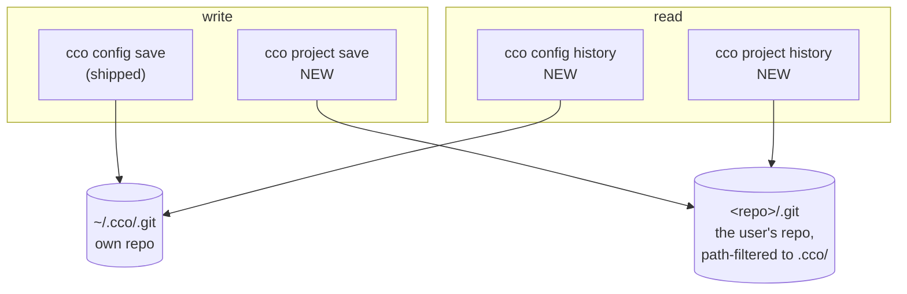
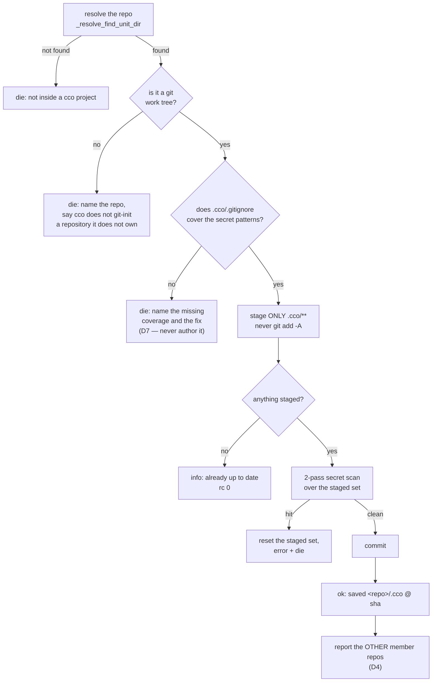
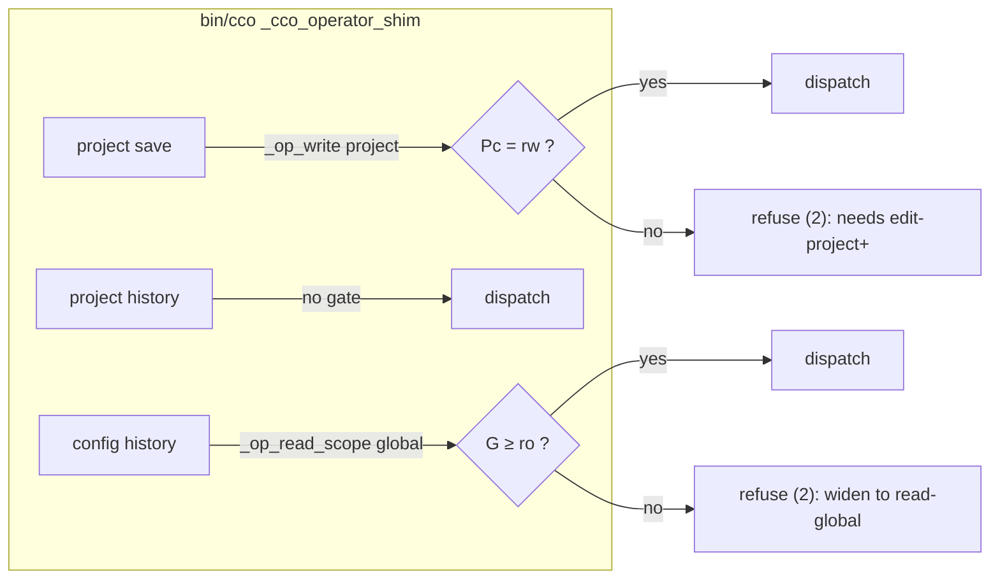

# Project config versioning and the history surface

> **Living design** for roadmap item **[A1](../../../roadmap.md)**. Decisions and their rationale are
> in [ADR-0038](../decisions/0038-project-config-versioning.md); this document holds the mechanism,
> the command surfaces and the test plan. It does not restate the ADR.
>
> **Built 2026-08-21.** The mechanism below is what shipped; §7 records the choices the build had to
> make and why. Tests live in `tests/test_project_save.sh` (T1…T17), `tests/test_operator_shim.sh`
> (T18…T22) and `tests/test_invariants.sh` (INV-GIF).

## 1. What is being built

Three verbs, closing the 2×2 matrix ADR-0038 D2 states:

| | personal `~/.cco` | project `<repo>/.cco` |
|---|---|---|
| **write** | `cco config save` *(shipped, unchanged)* | **`cco project save`** |
| **read** | **`cco config history`** | **`cco project history`** |



The asymmetry the two columns hide is the whole design problem: the personal store **is** a git
repository that cco created and owns; the project config is a **subtree of a repository cco does not
own**. Every difference below descends from that one fact.

## 2. `cco project save`

### 2.1 Surface

```
cco project save [-m <message>]
```

`-m` and nothing else (ADR-0038 D5). Invocation is **cwd-first**: the repo is resolved with
`_resolve_find_unit_dir` (`lib/cmd-resolve.sh:61`), which walks up from `$(pwd -P)` to the nearest
ancestor holding `.cco/project.yml` — the same anchor `cco project add` uses.

### 2.2 The sequence



### 2.3 What is staged, and what is not

Staging is explicit and path-scoped — `git add -- .cco/` — and **never** `git add -A`. This is the
second barrier of the twin, and it is the one that transfers unchanged: whatever else is dirty in the
user's working tree is not touched, which is the entire ergonomic point of the verb.

⚠ **The pathspec is repeated on the COMMIT** — `git commit -m … -- .cco`. Staging alone is not enough:
a file the user had **already staged** before running the verb is in the index, and a bare
`git commit` would sweep it into the config commit. With the pathspec it stays staged and uncommitted,
exactly as they left it. Measured, including on an unborn HEAD, and pinned by T1's second test.

The first barrier does **not** transfer. In `~/.cco` it is a *whitelist* `.gitignore` (`*`, then
`!`-re-include of authored config). In `<repo>/.cco` it is a *blacklist* — the shipped file ignores
`secrets.env`, `*.env`, `*.key`, `*.pem`, `.credentials.json`, plus the generated session artifacts
(`claude/workspace.yml`, `claude/packs.md`, `claude/scheduled_tasks.lock`,
`claude/settings.local.json`). A blacklist is a lower bound by construction, it lives in the user's
repo, and it can be edited or deleted.

⚠ **Do not reach for `_sync_synced_files` here.** It looks like the right list and is not: it is the
*copy* set for `cco sync`, enumerated positively so a copy is deterministic. `save` must commit
whatever the user actually has under `.cco/` minus what git already ignores — a positive enumeration
would silently drop a file the user added, which is exactly the failure a versioning verb must not
have.

### 2.4 The missing-barrier refusal (D7)

Before staging, the verb checks that `.cco/.gitignore` exists and that it actually ignores each class
in **`_SECRET_PROJECT_GITIGNORE_CLASSES`** — the classes cco's own scaffold declares, **not** the whole
`_SECRET_FILENAME_PATTERNS` list; §7 records why that distinction is load-bearing and what keeps the
two in step. If it does not, the verb **refuses and names the fix** — it does not author the file.
Rationale is in ADR-0038 D7 (P-C: the file would land in the user's repo, inside the very commit they
asked for).

Coverage is measured by **asking git** (`git check-ignore` on a probe path per class), never by
grepping the file for a literal: what protects the user is a rule that matches, however it is spelled
and wherever in the repo's ignore chain it lives.

The 2-pass scan (`_secret_match_filename` + `_secret_match_content`, `*.example` exempt) then runs on
the staged set regardless, against the **full** pattern list. On a hit: unstage, name the offending
path and the pattern it matched, and die.

🔑 The scan is **one function for both gates** — `_secret_scan_staged` in `lib/secrets.sh`, which
`cco config save` now calls too. What made one function serve both is an optional **pathspec**: the
project verb passes `.cco`, so it never scans (and never refuses over) staged work elsewhere in the
user's tree; the twin omits it because it owns its whole store. Factoring rather than copying is what
the file's own header asks for (*"keeping the pattern lists and match semantics here avoids drift
across the two gates"*), and a divergent second copy is the failure that comment predicts.

⚠ The unstage is scoped too — `git reset -q -- .cco`, never the twin's bare `git reset`. Clearing the
whole index would discard staging the user did themselves, as the side effect of a verb that refused
to do anything.

### 2.5 Reporting the other member repos (D4)

After a successful commit, the verb reports what it did **not** cover. Two independent facts, both
already computable:

| Fact | Source | Message |
|---|---|---|
| Another member repo has an uncommitted `.cco/` | `_reminder_git_dirty "$root" ".cco"` | names the repos, and that `cco project save` there covers them |
| Member repos carry **divergent** `.cco/` content | `_sync_fingerprint_compute` per root, ≥2 distinct | names the divergence and points at `cco sync` |

The two are deliberately separate: a repo can be committed and divergent (someone committed a
different config), or identical and uncommitted. The user needs to tell those apart — that is what
ADR-0038 D4 asks for.

Member roots come from `_effective_repo_mounts "$project_yml"`, the resolver `_start_emit_reminders`
already uses (`lib/cmd-start.sh:1918`). ⚠ **Invariant H1 applies**: reminders are computed only
against already-resolved roots. A `save` invoked outside a resolved project must degrade to silence on
this section, never resolve on its own.

### 2.6 Message classification (ADR-0059)

Every message this verb emits is classified by the ADR-0059 taxonomy, and the classification is not
free:

| Message | Level | Why |
|---|---|---|
| already up to date | `info` | nothing happened and nothing is owed |
| saved `<repo>/.cco @ <sha>` | `ok` | the outcome |
| other member repos uncommitted / divergent | `note` | actionable, but not a defect — this is the level D20–D25 exist for |
| missing `.gitignore` coverage, secret hit, not a git tree | `die` | refusals, each naming its fix |

⚠ **No `warn`.** A `⚠ warn` gates a launch (ADR-0059 D1); nothing this verb reports is a condition
that should stop a session from starting. Classifying the multi-repo report as `warn` would make every
multi-repo project pause at every `cco start`.

## 3. `cco project history` and `cco config history`

### 3.1 Surface

```
cco project history [-n <count>] [--full]
cco config  history [-n <count>] [--full]
```

Default output is one line per commit (ADR-0038 D6): **date · short sha · author · message · which
parts of the config changed**. `--full` adds the diff. `-n` overrides the default limit.

The *which parts changed* column is what earns the verb over `git log --oneline`. It is derived from
the commit's changed paths, collapsed to config-meaningful groups rather than printed file by file:

| Changed path | Reported as |
|---|---|
| `.cco/project.yml` | `project.yml` |
| `.cco/claude/rules/**` | `claude/rules` |
| `.cco/claude/agents/**` | `claude/agents` |
| `.cco/claude/skills/**` | `claude/skills` |
| `.cco/claude/CLAUDE.md`, `settings.json` | the file name |
| `.cco/setup.sh`, `mcp-packages.txt`, … | the file name |

### 3.2 Where each one reads

| Verb | Git root | Filter |
|---|---|---|
| `cco project history` | the cwd repo (`_resolve_find_unit_dir`) | `-- .cco/` |
| `cco config history` | `_cco_config_dir` (`~/.cco`) | none — the whole store *is* the config |

`cco project history` is path-filtered (ADR-0038 D3), so it shows **every** commit that touched the
config, including commits that also touched code and commits made by hand years before this verb
existed. Measured on this repo: 5 such commits, none of which a trailer-based history would have found.

### 3.3 Degradation, per store

Neither verb may die on an absent history — a project that has never committed its config is a normal
state, not an error.

- **`project history`** on a repo with no `.cco/` commits: `info` that the config has never been
  committed, naming `cco project save`. rc 0.
- **`config history`** on a `~/.cco` that is not yet a git tree: `info` naming `cco config save`
  (which is what git-inits it). rc 0.

## 4. Access classification (ADR-0038 D8)



⚠ **The `save` gate is policy, not mechanism** — ADR-0038 D8 records the measurement and the reason at
length. Restated here only as the operational warning: **do not "fix" this gate by reasoning from the
filesystem.** A read-only `.cco` bind sits inside a read-write repo, and `git add -- .cco/` on it
returns **0**, because git reads the worktree and writes to `.git/`. The gate holds because a session
that may not edit the project's config may not fix it into the repo's history either.

There is consequently **no ro-mount guard** on `project save` mirroring the one in `_config_save`
(`lib/cmd-config.sh:93`). That guard exists because `~/.cco` contains its own `.git` and a `git init`
there genuinely fails on a read-only mount. Adding a symmetric guard here would be guarding against a
failure that cannot occur.

## 5. What else changes

| Surface | Change | Note |
|---|---|---|
| `lib/reminders.sh` (b) | remedy becomes `→ cco project save` | closes the asymmetry with (a) |
| `defaults/managed/.claude/rules/cco-config-interaction.md` | drop *"is forthcoming; until it lands, use git directly"*, name the verb | ⚠ **image-baked** — this edit owes a `cco build` in the acceptance lane |
| `bin/cco` | dispatcher arms + `cco project --help` + `cco --help` | three verbs |
| CLI reference / user guide | three new entries | |
| `changelog.yml` | one entry | owed **at implementation**, not before |

⚠ The `cco build` is the **only** part of this unit that needs one, and it is needed by exactly one
file. Everything else is host-side CLI, produced at run time.

## 6. Test plan

Derived from the contract above, not from the implementation. New file `tests/test_project_save.sh`,
mirroring `tests/test_config.sh`'s seeding style.

### 6.1 `project save`

| # | Test | Asserts |
|---|---|---|
| T1 | commits `.cco/**` only | an unrelated dirty file outside `.cco/` is **not** in the commit |
| T2 | nothing to save | `info`, rc 0, no commit created |
| T3 | secret content in a staged file | refuses, **and the staged set is reset** (not left staged) |
| T4 | `*.example` exempt | a `secrets.env.example` holding a pattern still commits |
| T5 | missing `.cco/.gitignore` | refuses, names the fix, **creates no file** |
| T6 | `.gitignore` present but not covering `*.key` | refuses — the check is on coverage, not existence |
| T7 | not a git work tree | refuses, and **does not `git init`** |
| T8 | `-m` honoured; absent `-m` uses the default | the commit message |
| T9 | cwd-first from a subdirectory | resolves to the repo root, not the cwd |
| T10 | other member repo dirty | the report **names** it |
| T11 | member repos divergent | the report names the divergence and points at `cco sync` |
| T12 | committed-but-divergent vs uncommitted | the two are reported **distinctly** (D4's requirement) |

### 6.2 `history`

| # | Test | Asserts |
|---|---|---|
| T13 | a hand-made commit touching `.cco/` **and** code appears | D3 — the path filter, not a trailer |
| T14 | the changed-parts column groups correctly | `claude/rules/x.md` → `claude/rules` |
| T15 | `-n` limits; `--full` adds the diff | |
| T16 | no config commits yet | `info` + rc **0**, never a die |
| T17 | `config history` on a non-git `~/.cco` | `info` naming `cco config save`, rc 0 |

### 6.3 Shim

| # | Test | Asserts |
|---|---|---|
| T18 | `project save` at `read-project` | refused, exit **2**, message names edit-project+ |
| T19 | `project save` at `edit-project` | reaches the dispatcher |
| T20 | `project history` at `read-project` | reaches the dispatcher (free) |
| T21 | `config history` at `read-project` | refused, exit 2, names `read-global` |
| T22 | `config history` at `read-global` | reaches the dispatcher |

Extend `tests/test_operator_shim.sh` for T18–T22 rather than starting a third file — that is where the
sibling classifications are already asserted.

### 6.4 What the suite cannot reach

- **The `cco build` half.** The managed-rule edit is baked; the suite tests `defaults/` on disk, not
  the image. Verified by a host `cco start` after a rebuild, and stated as such — not claimed green.
- **The real mount shape.** T18–T22 exercise the shim's classification, not a genuinely read-only
  `.cco` bind. The measurement that `git add` succeeds on one was made by hand and is recorded in
  ADR-0038 D8; a hermetic test cannot reproduce a virtiofs child mount.

## 7. Settled at implementation

Both of ADR-0038's *Open* items are decided, and one thing the plan left implicit had to be too:

| Choice | Value |
|---|---|
| default commit message when `-m` is absent | **`project config update`** — the commit lands in the user's own log among code commits, where the twin's bare `config update` would not say *which* config |
| default `-n` for `history` | **10** |
| which patterns §2.4's coverage check demands | the classes **cco's own scaffold writes**, not all of `_SECRET_FILENAME_PATTERNS` |

The third needs its reason recorded, because the obvious reading of §2.4 is wrong. The full pattern
list carries `.netrc` and `.cco/remotes`; `_cco_write_project_gitignore` has never written either, so
demanding them would refuse `cco project save` on every project cco scaffolded itself — the verb dead
on arrival. The floor is `_SECRET_PROJECT_GITIGNORE_CLASSES` (`lib/secrets.sh`), and **INV-GIF**
(`tests/test_invariants.sh`) fails if the scaffold ever stops satisfying it. The 2-pass scan is
unaffected and still runs against the full list, so nothing is unguarded: the floor bars classes
*before* staging, the scan reads the files.

Two implementation shapes worth naming, both measured rather than reasoned:

- **The pathspec is on the COMMIT as well as the staging.** `git commit -m … -- .cco` builds the
  commit from `.cco/` alone, leaving an unrelated file the user had already staged **staged and
  uncommitted**. Without it, `save` would sweep their pending work into the config commit — and it
  works on an unborn HEAD too.
- **The refusal's reset is scoped as well**: `git reset -q -- .cco`, never the twin's bare
  `git reset`, which would discard staging the user did themselves as the side effect of a refusal.
