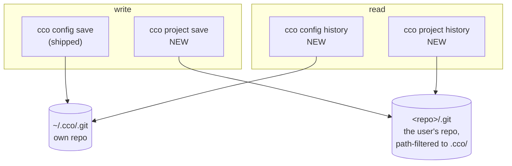
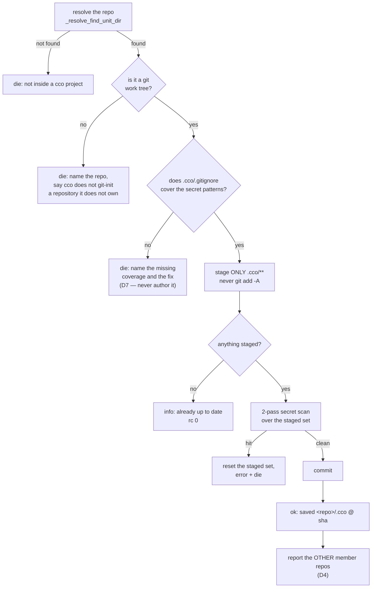
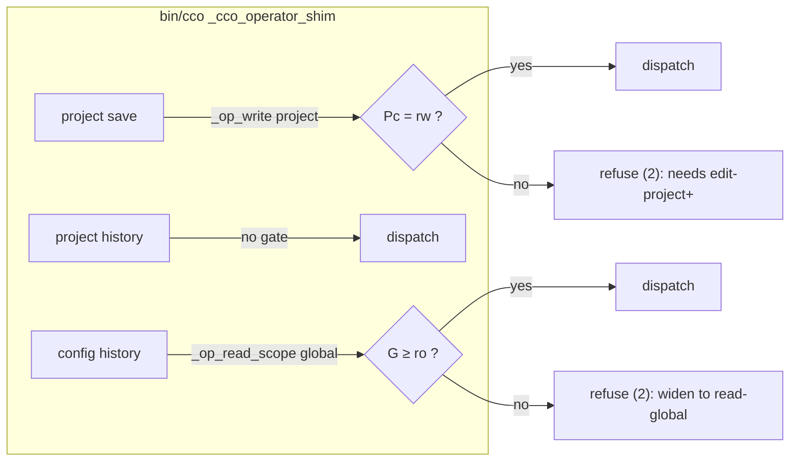

# Project config versioning and the history surface

> **Living design** for roadmap item **[A1](../../../roadmap.md)**. Decisions and their rationale are
> in [ADR-0038](../decisions/0038-project-config-versioning.md); this document holds the mechanism,
> the command surfaces and the test plan. It does not restate the ADR.
>
> **Built 2026-08-21.** The mechanism below is what shipped; §7 records the choices the build had to
> make and why. Tests live in `tests/test_project_save.sh` (T1…T17), `tests/test_operator_shim.sh`
> (T18…T22) and `tests/test_invariants.sh` (INV-GIF).
>
> ✅ **Amendment A2 (D13…D15) built 2026-08-24**, and **Amendment A3 (D16…D19)** with it — A3 is what
> `/review-implementation` found in A2's own build: the barrier repeated, one screen away, the
> unfollowable-remedy defect D13 had just removed. Everything below describes what runs.

## 1. What is being built

Five verbs, closing the matrix ADR-0038 D2 states and Amendment A1 widens:

| | personal `~/.cco` | project `<repo>/.cco` |
|---|---|---|
| **write** | `cco config save` *(shipped, unchanged)* | **`cco project save`** |
| **read — what is not saved yet** | **`cco config status`** | **`cco project status`** |
| **read — what was saved** | **`cco config history`** | **`cco project history`** |

The `status` row is Amendment A1, raised during implementation: the write half had
no preview, and `history` does not supply one — it answers what **was** saved, the
distance `git log` keeps from `git status`. §5b holds its mechanism.



The asymmetry the two columns hide is the whole design problem: the personal store **is** a git
repository that cco created and owns; the project config is a **subtree of a repository cco does not
own**. Every difference below descends from that one fact.

## 2. `cco project save`

### 2.1 Surface

```
cco project save [-m <message>]
```

`-m` and nothing else (ADR-0038 D5), and an **empty** `-m` is refused rather than replaced by the
default (A4). Invocation is **cwd-first**: the repo is resolved with `_resolve_find_unit_dir`
(`lib/cmd-resolve.sh:61`), which walks up from `$(pwd -P)` to the nearest ancestor holding
`.cco/project.yml` — the same anchor `cco project add` uses.

🔴 **THAT UNIT DIR IS NOT NECESSARILY THE GIT TOP-LEVEL** (A4 D20). `.cco/project.yml` may sit in a
subdirectory of the repository that versions it — a service inside a monorepo, a repo adopted below
its root — and the two halves of git disagree about which one paths are relative to:

| | Relative to |
|---|---|
| a **pathspec** (`-- .cco`, `check-ignore <path>`) | the **cwd**, i.e. wherever `git -C` points |
| every **output path** — `status --porcelain`, `diff --cached --name-only`, `ls-files`, `show --name-only`, and `check-ignore -v`'s **source** | the **top-level**, always |

So all three verbs resolve the unit dir into three values, once, and use those everywhere:
`_PROJECT_GITROOT` (`rev-parse --show-toplevel`) is the cwd of every git call; `_PROJECT_SPEC`
(`rev-parse --show-prefix` + `.cco`) is every pathspec, every strip prefix and every path printed;
`_PROJECT_REPO` (the top-level's basename) is the display prefix, so `<repo>/<spec>` is openable.

⚠ The prefix is **git's own answer**, never string arithmetic on two paths that can differ by a
symlink. At the top level it is empty, so `$_PROJECT_SPEC` is `.cco` and every message is unchanged —
which is also why a test written only at the top level cannot measure any of this (§6.2e).

### 2.2 The sequence



### 2.3 What is staged, and what is not

Staging is explicit and path-scoped — `git add -- <spec>`, where `<spec>` is `.cco` relative to the
git top-level (§2.1) — and **never** `git add -A`. This is the
second barrier of the twin, and it is the one that transfers unchanged: whatever else is dirty in the
user's working tree is not touched, which is the entire ergonomic point of the verb.

⚠ **The pathspec is repeated on the COMMIT** — `git commit -m … -- .cco`. Staging alone is not enough:
a file the user had **already staged** before running the verb is in the index, and a bare
`git commit` would sweep it into the config commit. With the pathspec it stays staged and uncommitted,
exactly as they left it. Measured, including on an unborn HEAD, and pinned by T1's second test.

The first barrier does **not** transfer. In `~/.cco` it is a *whitelist* `.gitignore` (`*`, then
`!`-re-include of authored config). In `<repo>/.cco` it is a *blacklist* — the shipped file ignores
`secrets.env`, `*.env`, `*.key`, `*.pem`, `.credentials.json`, plus the generated session artifacts
(`claude/workspace.yml`, `claude/packs.md`, `claude/scheduled_tasks.lock`,
`claude/settings.local.json`). A blacklist is a lower bound by construction, it lives in the user's
repo, and it can be edited or deleted.

⚠ **Do not reach for `_sync_synced_files` here.** It looks like the right list and is not: it is the
*copy* set for `cco sync`, enumerated positively so a copy is deterministic. `save` must commit
whatever the user actually has under `.cco/` minus what git already ignores — a positive enumeration
would silently drop a file the user added, which is exactly the failure a versioning verb must not
have.

### 2.4 The missing-barrier refusal (D7)

Before staging, the verb checks that `.cco/.gitignore` exists and that it actually ignores each class
in **`_SECRET_PROJECT_GITIGNORE_CLASSES`** — the classes cco's own scaffold declares, **not** the whole
`_SECRET_FILENAME_PATTERNS` list; §7 records why that distinction is load-bearing and what keeps the
two in step. If it does not, the verb **refuses and names the fix** — it does not author the file.
Rationale is in ADR-0038 D7 (P-C: the file would land in the user's repo, inside the very commit they
asked for).

Coverage is measured by **asking git** (`git check-ignore --no-index` on a probe path per class),
never by grepping the file for a literal: what protects the user is a rule that matches, however it is
spelled and wherever in the repo's ignore chain it lives.

⚠ **`--no-index` is not optional, and it is not a loosening** (Amendment A2, D13). Without it git
consults the **index** before the ignore chain, so a file the user committed *before* adding the rule
reports as **not ignored** — the barrier then refuses and prints, as its remedy, a line that is
**already in the file**. The save is refused permanently and the instruction cannot be followed. The
index is not part of the ignore chain; the question this barrier asks is *does a rule exist*, and
`--no-index` is what asks exactly that.

A **tracked** file that a rule should ignore is reported as a `note` and the save **proceeds**. The
save is not the event that exposes it — it is already in the repository's history — and the floor
still holds where it can act: `_secret_scan_staged` reads `git diff --cached`, so tracked **and
modified** stages, and refuses; tracked and unmodified is not in the commit at all. The note must not
imply that `git rm --cached` cleans the past: it stops future commits, it does not rewrite made ones.

🔴 **An ignore rule that keeps an ESSENTIAL file out of the commit refuses** (D15, as amended by
**A3 D16**). The state D15 found: the root `.gitignore` ignores `.cco/` in its entirety, every class
probe reports *ignored*, the barrier passes, `git add -- .cco` stages **nothing**, and the verb
reports `already up to date — nothing to save` while `status` reports it clean and never committed —
the config never saved, both verbs affirming success.

⚠ **The probe proves less than D15 concluded, and reaches further than D15 looked** — both measured:

- *"`.cco/` is ignored entirely"* is **not** what `.cco/project.yml` being ignored establishes. A root
  `.gitignore` of merely `*.yml` satisfies the key while git still stages two files, so the refusal
  named a rule that **is not in the file**. The finding therefore states what it can prove — *an
  ignore rule drops an essential file, so the save would be partial* — and names the rule that
  **actually fires**, from `git check-ignore -v --no-index`, at a path the user can open.
- The essential set is **`project.yml` and `.gitignore`**, not one path. A root rule of just
  `.cco/.gitignore` left every class probe satisfied and `project.yml` committable, so the save
  reported **`✓ saved`** on a config whose **barrier never landed** — and every clone of it starts
  unprotected.

`save` then **proves** the outcome rather than predicting it: after `git add -- .cco`, each essential
must be in the index the commit is built from. That assertion is unreachable while the barrier holds
— which is its purpose, and why it is pinned by a direct call rather than through the CLI.

⚠ **Refusing when `.cco/` is wholly ignored stays, deliberately.** It is the supported path for a solo
adopter keeping their cco config out of git; there the save must **abort**, not half-succeed, and the
message says so rather than reading as an error to route around.

The 2-pass scan (`_secret_match_filename` + `_secret_match_content`, `*.example` exempt) then runs on
the staged set regardless, against the **full** pattern list. On a hit: unstage, name the offending
path and the pattern it matched, and die.

🔑 The scan is **one function for both gates** — `_secret_scan_staged` in `lib/secrets.sh`, which
`cco config save` now calls too. What made one function serve both is an optional **pathspec**: the
project verb passes `.cco`, so it never scans (and never refuses over) staged work elsewhere in the
user's tree; the twin omits it because it owns its whole store. Factoring rather than copying is what
the file's own header asks for (*"keeping the pattern lists and match semantics here avoids drift
across the two gates"*), and a divergent second copy is the failure that comment predicts.

⚠ The unstage is scoped too — `git reset -q -- .cco`, never the twin's bare `git reset`. Clearing the
whole index would discard staging the user did themselves, as the side effect of a verb that refused
to do anything.

### 2.5 Reporting the other member repos (D4)

After a successful commit, the verb reports what it did **not** cover. Two independent facts, both
already computable:

| Fact | Source | Message |
|---|---|---|
| Another member repo has an uncommitted `.cco/` | `_reminder_git_dirty "$root" ".cco"` | names the repos, and that `cco project save` there covers them |
| Member repos carry **divergent** `.cco/` content | `_sync_fingerprint_compute` per root, ≥2 distinct | names the divergence and points at `cco sync` |

The two are deliberately separate: a repo can be committed and divergent (someone committed a
different config), or identical and uncommitted. The user needs to tell those apart — that is what
ADR-0038 D4 asks for.

Member roots come from `_effective_repo_mounts "$project_yml"`, the resolver `_start_emit_reminders`
already uses (`lib/cmd-start.sh:1918`). ⚠ **Invariant H1 applies**: reminders are computed only
against already-resolved roots. A `save` invoked outside a resolved project must degrade to silence on
this section, never resolve on its own.

### 2.6 Message classification (ADR-0059)

Every message this verb emits is classified by the ADR-0059 taxonomy, and the classification is not
free:

| Message | Level | Why |
|---|---|---|
| already up to date | `info` | nothing happened and nothing is owed |
| saved `<repo>/.cco @ <sha>` | `ok` | the outcome |
| other member repos uncommitted / divergent | `note` | actionable, but not a defect — this is the level D20–D25 exist for |
| a **tracked** file a `.gitignore` rule should ignore (A2 D13) | `note` | same level, same reason: actionable, and the save still proceeds |
| missing `.gitignore` coverage, **vacuous** coverage (A2 D15), secret hit, not a git tree | `die` | refusals, each naming its fix |

⚠ **No `warn`.** A `⚠ warn` gates a launch (ADR-0059 D1); nothing this verb reports is a condition
that should stop a session from starting. Classifying the multi-repo report as `warn` would make every
multi-repo project pause at every `cco start`.

This is what fixes A2 D13's level, and it is the reason a **confirmation prompt** was rejected there
as well: the pause `warn` reaches is `_cco_warn_gate`, whose call sites are the two launches and are
asserted **by name** in the suite. Reaching it from a verb is an amendment to ADR-0059, not a code
change — and it would buy nothing, since this verb's output survives on screen rather than being
overwritten by the TUI, which is the whole reason the gate exists.

## 3. `cco project history` and `cco config history`

### 3.1 Surface

```
cco project history [-n <count>] [--full]
cco config  history [-n <count>] [--full]
```

Default output is one line per commit (ADR-0038 D6): **date · short sha · author · message · which
parts of the config changed**. `--full` adds the diff. `-n` overrides the default limit.

The *which parts changed* column is what earns the verb over `git log --oneline`. It is derived from
the commit's changed paths, collapsed to config-meaningful groups rather than printed file by file.
⚠ An ungrouped entry reports its **config-relative path**, not its bare basename: the path says
*where* it is as well as what it is called, and two `settings.json` under different trees would
otherwise render identically.

| Changed path | Reported as |
|---|---|
| `.cco/project.yml` | `project.yml` |
| `.cco/claude/rules/**` | `claude/rules` |
| `.cco/claude/agents/**` | `claude/agents` |
| `.cco/claude/skills/**` | `claude/skills` |
| `.cco/claude/CLAUDE.md`, `settings.json` | its config-relative path (`claude/CLAUDE.md`) |
| `.cco/setup.sh`, `mcp-packages.txt`, … | its config-relative path |

### 3.2 Where each one reads

| Verb | Git root | Filter |
|---|---|---|
| `cco project history` | the cwd repo (`_resolve_find_unit_dir`) | `-- .cco/` |
| `cco config history` | `_cco_config_dir` (`~/.cco`) | none — the whole store *is* the config |

`cco project history` is path-filtered (ADR-0038 D3), so it shows **every** commit that touched the
config, including commits that also touched code and commits made by hand years before this verb
existed. Measured on this repo: 5 such commits, none of which a trailer-based history would have found.

### 3.3 Degradation, per store

Neither verb may die on an absent history — a project that has never committed its config is a normal
state, not an error.

- **`project history`** on a repo with no `.cco/` commits: `info` that the config has never been
  committed, naming `cco project save`. rc 0.
- **`config history`** on a `~/.cco` that is not yet a git tree: `info` naming `cco config save`
  (which is what git-inits it). rc 0.

## 4. Access classification (ADR-0038 D8)



⚠ **The `save` gate is policy, not mechanism** — ADR-0038 D8 records the measurement and the reason at
length. Restated here only as the operational warning: **do not "fix" this gate by reasoning from the
filesystem.** A read-only `.cco` bind sits inside a read-write repo, and `git add -- .cco/` on it
returns **0**, because git reads the worktree and writes to `.git/`. The gate holds because a session
that may not edit the project's config may not fix it into the repo's history either.

There is consequently **no ro-mount guard** on `project save` mirroring the one in `_config_save`
(`lib/cmd-config.sh:93`). That guard exists because `~/.cco` contains its own `.git` and a `git init`
there genuinely fails on a read-only mount. Adding a symmetric guard here would be guarding against a
failure that cannot occur.

## 5. What else changes

| Surface | Change | Note |
|---|---|---|
| `lib/reminders.sh` (b) | remedy becomes `→ cco project save` | closes the asymmetry with (a) |
| `defaults/managed/.claude/rules/cco-config-interaction.md` | drop *"is forthcoming; until it lands, use git directly"*, name the verb | ⚠ **image-baked** — this edit owes a `cco build` in the acceptance lane |
| `bin/cco` | dispatcher arms + `cco project --help` + `cco --help` | three verbs |
| CLI reference / user guide | three new entries | |
| `changelog.yml` | one entry | owed **at implementation**, not before |

⚠ The `cco build` is the **only** part of this unit that needs one, and it is needed by exactly one
file. Everything else is host-side CLI, produced at run time.

## 5b. `cco project status` and `cco config status` (Amendment A1)

### 5b.1 Surface

```
cco project status [--full]
cco config  status [--full]
```

No `-n`: there is one current state, not a list to limit. `--full` adds the diff,
symmetric with `history --full`.

### 5b.2 The one property that makes it worth having

**Each `status` reproduces ITS OWN save's rule about what gets committed** (A1 D11).
A preview that lists files the save would skip is worse than no preview, because it
is believed:

| Store | `save` commits | `status` therefore lists |
|---|---|---|
| `<repo>/.cco` | everything under `.cco/**` git does not ignore | `git status … -- .cco`, so gitignored files are excluded by git itself |
| `~/.cco` | the `_CONFIG_ALLOWLIST` entries that exist | `git status … -- <those entries>` |

⚠ **The allowlist pathspec looks redundant and is not.** Once `config save` has run,
its whitelist `.gitignore` (`*` then `!`-re-include) already excludes a stray file,
so dropping the pathspec changes nothing — *on a store that has been saved before*.
Before the first save that barrier does not exist, and the preview would promise to
commit a `~/.cco/scratch.txt` that `config save` would never touch. This is the
`_sync_synced_files` trap in a new costume: the **nearly** right list is the
dangerous one, and the case that exposes it is not the common one.

### 5b.3 It reports the barrier; it never enforces it (A1 D10)

`save` refuses on a missing or insufficient `.cco/.gitignore` (D7). `status` prints
the same finding, **in the same words**, at **rc 0**, and still lists what would be
committed. ⚠ *Still lists* is literal and reaches the `excluded` branch too (A4): that branch
returned before the listing, so its own message said *"part of the config could not be committed"*
and never named the other part. It now names it, with no count line and no `→ cco project save` —
nothing there claims the save would succeed. A preview that dies is one nobody can use to find out why their save
would die — and paraphrasing the refusal would send the user hunting for a message
that does not exist.

One rule, two levels: `_project_gitignore_findings` is the pure question,
`_project_save_assert_gitignore` the refusal, and **one** renderer —
`_project_render_findings` — which `save` sends to stderr and `status` prints to
stdout (A3 D17). Same split as `_reminder_roots_divergent`.

⚠ **Never the word "clean" while a finding stands** (A3 D17). Nothing to *commit* is not *saved*: in
the composite state — the root swallows `.cco/` **and** `.cco/.gitignore` is missing — git reports
nothing changed, and the clean branch affirmed exactly the silent failure the barrier had caught. All
findings are also rendered **together**, by one renderer: returning early on `missing` sent the user to
create the file and only then meet the second refusal, two round trips for one broken state.

**Both refusal paths, not one** (Amendment A2, D14). A1's own premise was that `save` has *two* ways
to refuse and no way to ask *what would it commit, and would it succeed*. Reporting only the
`.gitignore` barrier answers half: with a `.cco/.netrc` present, `status` lists it as `A .netrc` and
closes with `→ cco project save`, and the save then refuses on the scan — a preview that promises a
save that will fail.

So `status` runs `_secret_scan_staged`'s question over the set it would commit and reports the
outcome, in the refusal's own words. D10 governs it unchanged: **report, never enforce, rc 0**. The
vacuous-coverage state of D15 is reported here on the same terms.

⚠ **The scan answers for content ENTERING the commit, never for a path leaving it** (A4 D21).
`git diff --cached --name-only` lists a deleted path exactly like an added one, so the filename pass
refused the one action that removes a secret from the config — and the refusal's own `git reset`
restored the index entry its remedy told the user to drop. Both gates filter with `--diff-filter=d`;
both previews drop `D` entries from the set they hand the scan. The deletion is still **listed** as
`D <file>`: what is filtered is the scan's set, not the user's view of the commit. Same set on both
sides is D11, in whichever direction it moves.

⚠ The scan reads the **staged set**, and §5b.4 forbids this verb from staging anything. The preview
therefore asks the same question of the set it *computed*, without an index write — the same
constraint that already made `--full` reach for `git diff --no-index` instead of
`--intent-to-add`. A `status` that stages to find out is a read verb that writes.

### 5b.4 A read verb touches nothing

Not HEAD, not the index, not the working tree — pinned by
`test_project_status_changes_nothing`, which compares full `git status --porcelain`
before and after.

This is why `--full` diffs **new** files with `git diff --no-index -- /dev/null
<path>` rather than the obvious `git add --intent-to-add`: `git diff HEAD` cannot
show an untracked file, and staging one to make it visible is precisely the write
this verb may not perform.

🔴 **And `--full` withholds the diff of a file it has just called secret-like** (A3 D18). Measured: a
`.cco/.netrc` rendered `a secret-like file would be staged` and then its password 24 lines below — the
preview publishing what it warned about. One line naming the matched pattern replaces the diff. The
question is asked **per file**, not reused from the scan, because the scan stops at its first hit while
every listed file is rendered; and **`*.example` is exempt** on the scan's own terms (FR-S3), since a
skeleton exists to be read. Shared renderer, so this reaches `cco config status` as well.

### 5b.5 Output goes to stdout

The whole answer — header, barrier report, file list, the `→ cco project save`
hint — is stdout, so it pipes. Only the cross-repo facts stay `note` on stderr:
they are about **other** repos, not the answer to "what is in this one".

⚠ Known, and NOT introduced by this unit: piping any cco verb into a consumer that
closes early (`| head`, `| less` then quit) makes the EXIT trap print
`✗ cco exited unexpectedly`. Measured on `cco docs | head -1`, which this unit never
touched. Recorded as [FI-73](../../../improvements.md); `status --full` and
`history --full` are simply the verbs most likely to be piped.

## 6. Test plan

Derived from the contract above, not from the implementation. New file `tests/test_project_save.sh`,
mirroring `tests/test_config.sh`'s seeding style.

### 6.1 `project save`

| # | Test | Asserts |
|---|---|---|
| T1 | commits `.cco/**` only | an unrelated dirty file outside `.cco/` is **not** in the commit |
| T2 | nothing to save | `info`, rc 0, no commit created |
| T3 | secret content in a staged file | refuses, **and the staged set is reset** (not left staged) |
| T4 | `*.example` exempt | a `secrets.env.example` holding a pattern still commits |
| T5 | missing `.cco/.gitignore` | refuses, names the fix, **creates no file** |
| T6 | `.gitignore` present but not covering `*.key` | refuses — the check is on coverage, not existence |
| T7 | not a git work tree | refuses, and **does not `git init`** |
| T8 | `-m` honoured; absent `-m` uses the default | the commit message |
| T9 | cwd-first from a subdirectory | resolves to the repo root, not the cwd |
| T10 | other member repo dirty | the report **names** it |
| T11 | member repos divergent | the report names the divergence and points at `cco sync` |
| T12 | committed-but-divergent vs uncommitted | the two are reported **distinctly** (D4's requirement) |

### 6.2 `history`

| # | Test | Asserts |
|---|---|---|
| T13 | a hand-made commit touching `.cco/` **and** code appears | D3 — the path filter, not a trailer |
| T14 | the changed-parts column groups correctly | `claude/rules/x.md` → `claude/rules` |
| T15 | `-n` limits; `--full` adds the diff | |
| T16 | no config commits yet | `info` + rc **0**, never a die |
| T17 | `config history` on a non-git `~/.cco` | `info` naming `cco config save`, rc 0 |

### 6.2b `status` (Amendment A1)

| # | Test | Asserts |
|---|---|---|
| S1 | the listed set | M/A/D correct; a **gitignored** file and a file **outside `.cco/`** are both absent |
| S2 | nothing is written | HEAD **and** full `git status --porcelain` identical before and after, including the user's own staging |
| S3 | clean store | names the last save; never-saved store points at `save` |
| S4 | insufficient `.gitignore` | **reported at rc 0**, names the gap and the fix, still lists the files, authors nothing |
| S5 | missing `.gitignore` | same, and creates no file |
| S6 | `--full` on a NEW file | its diff appears (the `--no-index` path) |
| S7 | `config status` | lists only allowlisted paths — asserted on a **never-saved** store, the only state where the pathspec is load-bearing (§5b.2) |

### 6.2c The barrier's predicate (Amendment A2)

Derived from §2.4 and §5b.3 as amended. Amendment A1's plan is unchanged; these are additions.
**AT** = *amendment test* — a separate series because these span both verbs, and because a bare `A<n>`
would collide with roadmap item A1/A2 and with Amendment A1 itself.

| # | Test | Asserts |
|---|---|---|
| AT1 | a **tracked** `.cco/secrets.env`, rule present | save **succeeds** (rc 0) and emits the `note`. Discriminates against the index-aware probe: without `--no-index` this refuses |
| AT2 | the note's wording | it says the file is **already in history** and that `git rm --cached` does not rewrite it — a note that implies otherwise is the defect it replaced |
| AT3 | tracked **and modified** secret | still **refuses**, on the scan — the floor D13 relies on. Without this, D13's rationale is unpinned |
| AT4 | root `.gitignore` ignores `.cco/` wholly | **refuses**, names the **root** `.gitignore`. Discriminates against the vacuous pass: today this reports *nothing to save* at rc 0 |
| AT5 | `status` in the AT4 state | reports the same, **rc 0** (D10), never *clean* |
| AT6 | `status` with a `.cco/.netrc` present | reports that the save **would refuse** on the scan, rc 0, and still lists the set (D14) |
| AT7 | `status` in the AT6 state writes nothing | full `git status --porcelain` identical before and after — the scan preview must not stage (§5b.3) |
| AT8 | ⚠ **the compensating control D7 rests on** | a `.cco/.netrc` under a *scaffold-conformant* `.gitignore` is **refused** by the scan, staged set reset. §7 justifies the narrow floor with exactly this claim and nothing pinned it |
| AT9 | no `warn` is emitted by any of the above | the level stays `note`/`die` — a `warn` here would gate every launch |

### 6.2d The review's four rulings (Amendment A3)

Derived from A3 D16…D19. **AR** = *amendment-review test*, a third series for the same reason AT was a
second one.

| # | Test | Asserts |
|---|---|---|
| AR1 | root `.gitignore` is merely `*.yml` | refuses, names the rule **`*.yml`** and `<repo>/.gitignore:1`, and does **not** claim *entirely* / *commit nothing at all*. Discriminates against the message A2 shipped |
| AR2 | root rule is just `.cco/.gitignore` | **refuses** — before A3 this reported `✓ saved` on a config whose barrier never landed |
| AR3 | root swallows `.cco/` **and** `.cco/.gitignore` is missing | **both** findings in one invocation. Discriminates against the early return that cost a round trip |
| AR4 | `status` in the AR3 state | never says **"is clean"**, rc 0 (D10). AT5 widened from the adjacent state to *any* standing finding |
| AR5 | `status --full` on a `.cco/.netrc` | prints `diff withheld`, and **not** the secret's content, while a normal file is still diffed |
| AR6 | `status --full` on `secrets.env.example` | the skeleton **is** still diffed — the FR-S3 exemption, without which the one file meant to be read is hidden |
| AR7 | scan refusal on a **tracked** `.cco/secrets.env` | the remedy is `git rm --cached`, and the circular *"move the secret into …"* is gone |
| AR8 | scan refusal on an **untracked** `.cco/.netrc` | the *move* remedy stays — it is the right one there |
| AR9 | ⚠ the essentials **post-condition**, called DIRECTLY | refuses on an index missing an essential. It is unreachable through the CLI while the barrier holds, so a CLI test would credit it with the barrier's pass — measured: neutralising it changed nothing in the suite until this test existed |

### 6.2e The whole-cycle review's three rulings (Amendment A4)

Derived from A4 D20…D22. **AS** = *amendment-scope test*, a fourth series — the first whose subject is
a **topology** rather than a state.

| # | Test | Asserts |
|---|---|---|
| AS1 | a secret under a `.cco/` **one directory below** the git top-level | **refuses**, `content matches`, nothing committed. Before A4: `✓ saved`, with the key readable in `git show HEAD:…` |
| AS2 | `save` on that same nested unit | reports `saved mono/svc/.cco`, commits `svc/.cco/project.yml`, and still commits **nothing** outside `.cco/` |
| AS3 | `status --full` on the nested unit | lists the **config-relative** path and prints the diff. Before A4 the `--full` half printed nothing at all |
| AS4 | `save` after **deleting** a tracked `.cco/secrets.env` | **succeeds**, and the deletion is in `HEAD`. rc 0 alone is not the assertion — a save that committed nothing would pass it |
| AS5 | `status` in the AS4 state | does **not** preview a refusal, and still lists `D secrets.env` |
| AS6 | the same deletion on **`~/.cco`** | succeeds there too. The rule holds on both gates or on neither — and on the personal store the false refusal's reset was the *bare* one |
| AS7 | `cco config save --help` through the gate probe | admits at `edit-all` **and** returns a usage line. The probe drives `<verb> --help` precisely so a verb with no handler fails rather than passing vacuously |
| AS8 | the content pass with `file(1)` absent from `PATH` | still finds a secret in a text file, still excludes a binary. It answered "clean" on both gates before |

⚠ **AS1–AS3 are the NESTED half of a discriminating pair**; the flat halves are T3 and T13, and both
passed on the broken code. That is why three reviews did not see D20: *a test written only at the top
level cannot measure the difference between a pathspec and an output path.* Every entry above is
pinned by a mutation — reverting the fix fails exactly its own test and nothing else.

### 6.3 Shim

| # | Test | Asserts |
|---|---|---|
| T18 | `project save` at `read-project` | refused, exit **2**, message names edit-project+ |
| T19 | `project save` at `edit-project` | reaches the dispatcher |
| T20 | `project history` at `read-project` | reaches the dispatcher (free) |
| T21 | `config history` at `read-project` | refused, exit 2, names `read-global` |
| T22 | `config history` at `read-global` | reaches the dispatcher |
| S8 | `project status` at `read-project` | reaches the dispatcher (free, A1 D12) |
| S9 | `config status` at `read-project` / `read-global` | refused exit 2 / reaches the dispatcher |

Extend `tests/test_operator_shim.sh` for T18–T22 rather than starting a third file — that is where the
sibling classifications are already asserted.

### 6.4 What the suite cannot reach

- **The `cco build` half.** The managed-rule edit is baked; the suite tests `defaults/` on disk, not
  the image. Verified by a host `cco start` after a rebuild, and stated as such — not claimed green.
- **The real mount shape.** T18–T22 exercise the shim's classification, not a genuinely read-only
  `.cco` bind. The measurement that `git add` succeeds on one was made by hand and is recorded in
  ADR-0038 D8; a hermetic test cannot reproduce a virtiofs child mount.

## 7. Settled at implementation

Both of ADR-0038's *Open* items are decided, and one thing the plan left implicit had to be too:

| Choice | Value |
|---|---|
| default commit message when `-m` is absent | **`project config update`** — the commit lands in the user's own log among code commits, where the twin's bare `config update` would not say *which* config |
| default `-n` for `history` | **10** |
| which patterns §2.4's coverage check demands | the classes **cco's own scaffold writes**, not all of `_SECRET_FILENAME_PATTERNS` |

The third needs its reason recorded, because the obvious reading of §2.4 is wrong. The full pattern
list carries `.netrc` and `.cco/remotes`; `_cco_write_project_gitignore` has never written either, so
demanding them would refuse `cco project save` on every project cco scaffolded itself — the verb dead
on arrival. The floor is `_SECRET_PROJECT_GITIGNORE_CLASSES` (`lib/secrets.sh`), and **INV-GIF**
(`tests/test_invariants.sh`) fails if the scaffold ever stops satisfying it. The 2-pass scan is
unaffected and still runs against the full list, so nothing is unguarded: the floor bars classes
*before* staging, the scan reads the files.

⚠ That last sentence is a **compensating control, and until Amendment A2 nothing tested it.** INV-GIF
guards one direction only — scaffold ⊇ floor — which is the drift that would kill the verb, not the
one that would let a secret through. What carries the narrow floor is the claim that a `.netrc` under
`.cco/` is caught by the scan and refused; **§6.2c AT8 is that claim, pinned.** A justification whose
load-bearing half is unmeasured is an assumption wearing a rationale's clothes. ✅ AT8 exists and
passes — and it **passed on its first run**, which is the honest reading: it pins behaviour that
already held, it did not fix anything.

### A2's build settled two more (2026-08-24)

| Choice | Value |
|---|---|
| does D14's scan preview reach `cco config status` too | **yes** |
| does `status` also surface D13's tracked-file finding | **yes** — *maintainer, 2026-08-24* — on **stdout**, not as a `note` |

The first is §5b's own scope: that section is titled for **both** verbs, and `_config_save` has
exactly one refusal path (its first barrier writes itself), so previewing the scan on one store and
not the other rebuilds the very asymmetry A1 D9 refused to leave open. The mechanism is a split of
`_secret_scan_staged` into `_secret_scan_paths` (the 2-pass question, over paths on stdin) and the
staged-set caller — both `status` verbs ask it of the set they computed, never of the index, which is
what §5b.4 requires.

The second was raised as an open question and **ruled by the maintainer**: `status` is the surface
read *before* deciding, so it is where the user should meet a tracked covered file without having to
run a save to find out. Two consequences the build had to get right:

- **The level is not `save`'s.** §5b.5 keeps facts about **this** repo inside the answer on stdout and
  sends only the cross-repo ones to stderr — so `save` emits a `note`, `status` prints the same words
  into its own output. One finding, two deliveries: `_project_tracked_ignored_message` is the text,
  and it has exactly one definition, the split `_project_gitignore_findings` already makes.
- **It is computed AFTER the vacuous return.** In the D15 state every file under `.cco/` probes as
  ignored, so the finding would name the entire config — noise manufactured by the broken root rule,
  not a fact about those files. Pinned by
  `test_project_status_does_not_list_every_file_as_tracked_when_coverage_is_vacuous`.

It is **not** a refusal, so the closing `→ cco project save` hint stays.

Two implementation shapes worth naming, both measured rather than reasoned:

- **The pathspec is on the COMMIT as well as the staging.** `git commit -m … -- .cco` builds the
  commit from `.cco/` alone, leaving an unrelated file the user had already staged **staged and
  uncommitted**. Without it, `save` would sweep their pending work into the config commit — and it
  works on an unborn HEAD too.
- **The refusal's reset is scoped as well**: `git reset -q -- .cco`, never the twin's bare
  `git reset`, which would discard staging the user did themselves as the side effect of a refusal.

### A4's build settled one more (2026-08-26)

The whole-cycle review's fixes needed one shape choice, and it is the one a future reader is most
likely to undo: **which value the shared renderers receive as their `<git_root>`.**

`config-read.sh` and `secrets.sh` already documented that parameter as the **git root** — and the
project verbs had always passed the **unit dir**. At the top level the two coincide, so the mismatch
was invisible and the documentation looked satisfied. The fix is therefore not in the renderers: they
were right. It is in the three `cmd_project_*` bodies, which now pass `_PROJECT_GITROOT` and a
top-level-relative pathspec (§2.1), and `config-read.sh` is **unchanged**.

⚠ **The consequence to keep in mind when touching any of this**: a helper in `cmd-project-save.sh`
that takes `root` means the **git top-level**, and the `.cco` it acts on is `$spec`, never the
literal. A new call site that reaches for `basename "$root"` or a bare `.cco` reintroduces D20
silently — and, at the top level, every test will still pass.
