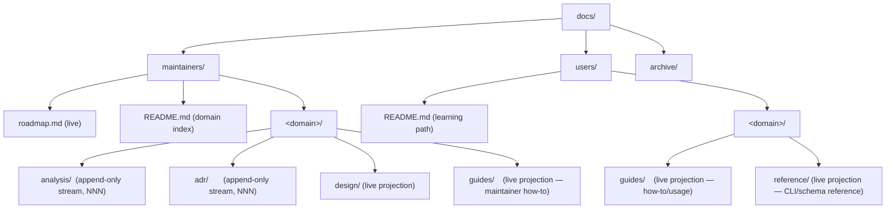
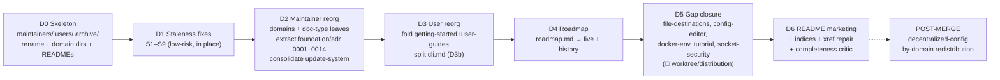

# Documentation Reorganization Plan — claude-orchestrator

**Status**: EXECUTED 2026-06-26 (maintainer go-ahead given). Phases D0–D6 applied as
atomic commits; the execution log is in §11. A few large/sensitive sub-tasks were
deliberately deferred (see §11) — they remain on this contract.
**Supersedes scope of**: `documentation-review-handoff.md` (the pre-merge doc-coherence
sweep is folded into this reorg as the staleness pass).
**Governing policy**: `.claude/rules/documentation-lifecycle.md` (3 doc classes) +
the adapted **Cave documentation guidelines** (audience → domain → doc-type leaf;
append-only stream vs live projection).

This document is the **plan only**. It defines the target structure, the file-by-file
migration map, the staleness fixes, the coverage gaps, and a phased execution sequence.
Execution happens phase-by-phase, each an atomic LOCAL commit, after approval.

---

## 1. Locked decisions

| # | Decision | Choice |
|---|---|---|
| D-1 | Top-level layout | **Full Cave adoption**: `docs/maintainers/` + `docs/users/` + `docs/archive/`; domain is a folder, **doc-type is the leaf**; `getting-started/`+`reference/`+`user-guides/` fold into `users/<domain>/{guides,reference}`; monolithic references (`cli.md`, `context-hierarchy.md`) split per domain. |
| D-2 | `decentralized-config/` sprint folder | **Defer**: reorganize everything else by domain now; `decentralized-config/` stays the canonical config/sharing **design source-of-truth** until merge. Its by-domain content redistribution is a **post-merge** cycle. |
| D-3 | ADR scheme | **Keep numbering + forward**: the 27 `decentralized-config/decisions/` ADRs stay `0005–0027`; the 14 ADRs embedded in `architecture.md` are **extracted** into a `foundation/adr/` stream (`0001–0014`) preserving references; per-domain numbering applies to **new** ADRs only. |
| D-4 | This session scope | **Plan now, execute in phases**: this document + the file-by-file map + the phased plan; moves/fixes/new-docs land in later approved phases. |

**Hard constraint from doc-lifecycle (timing)**: never write a user guide ahead of
shipped code. Unshipped features get a `🚧 planned` marker, **not** a user guide:
- `worktree` — design-ready, **not implemented**.
- `docker-security` Phase C (network isolation) — pending.
- `auth` GitHub-PAT path — pending (OAuth shipped).
- `distribution / packaging` — post-v1.

---

## 2. Target structure

Top split is **audience**. No role sub-scope in v1 (cco maintainers are one role; cco
users are one role) — the optional `<role>/` level from the guidelines is **not** used
yet; it can be introduced later without breaking the tree.

Repo-root files stay where tooling/GitHub expect them: `README.md` (landing/marketing),
`CLAUDE.md`, `CONTRIBUTING.md`, `SECURITY.md`, `TODO.md`, `.github/`.

### 2.1 Domain taxonomy

The domains are the **functional areas** the maintainer enumerated, made symmetric across
both audiences where a user-facing surface exists.

| Domain | Scope | Maintainer content | User content |
|---|---|---|---|
| **foundation** | What cco is, core model, the 4-tier context hierarchy, requirements, core ADRs | architecture design, spec (FR/NFR), ADR 0001–0014, conventions cross-link | overview, concepts, installation, first-project, dev-workflow, structured-agentic-development; reference: context-hierarchy |
| **configuration** | Config model: scope hierarchy, the four `.claude` levels, `~/.cco` vs `<repo>/.cco`, **file types & XDG destinations** (CONFIG/STATE/CACHE/DATA), rules organization, llms refs | scope-hierarchy, rules-and-guidelines, llms, **file-destinations** (new design), project-config | configuration-management, project-setup, configuring-rules; reference: project-yaml, cli-config |
| **packs** | Knowledge packs | packs design | knowledge-packs guide; reference: cli-pack |
| **templates** | Project/pack templates | templates design (new/thin) | reference: cli-template |
| **sharing** | publish/install vs export/import, sharing repos, embedding-vs-sharing asymmetry | **deferred** in `decentralized-config/` until merge; `archive/sharing` is history | sharing guide; reference: cli-remote |
| **update-system** | update + migrations + changelog | consolidated design + analysis stream | update/migration guide; reference: cli-update |
| **environment** | Docker image, compose, networking, mounts (rw/ro, repo vs extra), sandbox isolation, `setup.sh`/`setup-build.sh`, custom images | docker + environment designs (merged) | docker-env recipes guide, custom-environment guide |
| **integration** | auth, browser-mcp, agent-teams, worktree | per-feature analysis+design | authentication, browser-automation, agent-teams, subagents; worktree 🚧 |
| **security** | Docker socket security (proxy/policy), sandbox security model, threat model | docker-security + security model design | socket-security policy guide |
| **internal-projects** | tutorial, config-editor | tutorial + config-editor (new) design | tutorial launch guide, config-editor guide |
| **engineering** | Contributing, coding conventions, testing, review playbooks | conventions, testing, contributing, review-playbooks (temp) | — (CONTRIBUTING.md at root links here) |
| **distribution** | Packaging as cco packages (post-v1) | 🚧 placeholder | 🚧 placeholder |
| **decentralized-config** | The refactor sprint folder (DEFERRED) | design.md/requirements.md/guiding-principles.md + ADR 0005–0027 + reviews + handoffs (kept cohesive until merge) | — |

### 2.2 Doc-type leaf conventions

- **analysis/** — `analysis-NNN-<slug>.md`, append-only, dated, `status: accepted | superseded by <ref>`. The current single `analysis.md` per domain becomes `analysis-001-<slug>.md`.
- **adr/** — `adr-NNNN-<slug>.md` (4-digit, per-domain), append-only, dated, status. Existing numbered ADRs keep their numbers (D-3).
- **design/** — `design-<slug>.md`, live projection, edited in place, **references** the analysis/adr it is grounded on.
- **guides/** — `guide-<slug>.md` (maintainer) / topical name (user), live projection.
- **reference/** — live projection, CLI/schema contract for users.

---

## 3. File-by-file migration map

Action legend: **MV** = `git mv` as-is · **MV+FIX** = move + staleness rewrite ·
**SPLIT** = break into multiple targets · **CONSOLIDATE** = merge several into one ·
**ARCHIVE** = `git mv` to `docs/archive/` · **KEEP** = stays (deferred/root) ·
**NEW** = create · **REWRITE** = in-place living rewrite.

### 3.1 Repo root (no move)

| Current | Action | Notes |
|---|---|---|
| `README.md` | REWRITE (Phase D6) | landing/marketing pass (§8) |
| `CLAUDE.md`, `CONTRIBUTING.md`, `SECURITY.md`, `TODO.md`, `.github/*` | KEEP | CONTRIBUTING links to `maintainers/engineering/guides/` |
| `docs/README.md` | REWRITE (D6) | top index → `maintainers/` + `users/` |

### 3.2 User onboarding & guides → `docs/users/`

| Current | Target | Action |
|---|---|---|
| `getting-started/overview.md` | `users/foundation/guides/overview.md` | MV |
| `getting-started/concepts.md` | `users/foundation/guides/concepts.md` | MV |
| `getting-started/installation.md` | `users/foundation/guides/installation.md` | MV |
| `getting-started/first-project.md` | `users/foundation/guides/first-project.md` | MV |
| `user-guides/README.md` | `users/README.md` | REWRITE (learning path) |
| `user-guides/development-workflow.md` | `users/foundation/guides/development-workflow.md` | MV |
| `user-guides/structured-agentic-development.md` | `users/foundation/guides/structured-agentic-development.md` | MV |
| `user-guides/configuration-management.md` | `users/configuration/guides/configuration-management.md` (+ split sharing → `users/sharing/guides/`, update → `users/update-system/guides/`) | SPLIT+FIX (drop `ADR-0024` leak L56) |
| `user-guides/project-setup.md` | `users/configuration/guides/project-setup.md` | MV |
| `user-guides/configuring-rules.md` | `users/configuration/guides/configuring-rules.md` | MV |
| `user-guides/knowledge-packs.md` | `users/packs/guides/knowledge-packs.md` | MV |
| `user-guides/authentication.md` | `users/integration/guides/authentication.md` | MV |
| `user-guides/browser-automation.md` | `users/integration/guides/browser-automation.md` | MV |
| `user-guides/agent-teams.md` | `users/integration/guides/agent-teams.md` | MV |
| `user-guides/advanced/subagents.md` | `users/integration/guides/subagents.md` | MV |
| `user-guides/advanced/custom-environment.md` | `users/environment/guides/custom-environment.md` | MV |
| `user-guides/troubleshooting.md` | `users/troubleshooting.md` | MV (cross-cutting, kept single) |

### 3.3 Reference split → `docs/users/<domain>/reference/`

| Current | Target | Action |
|---|---|---|
| `reference/project-yaml.md` | `users/configuration/reference/project-yaml.md` | MV (whole) |
| `reference/context-hierarchy.md` | `users/foundation/reference/context-hierarchy.md` | MV (whole; conceptual home) |
| `reference/cli.md` (1812) | `users/<domain>/reference/cli-<domain>.md` + `users/reference/cli.md` (index) | **SPLIT** (own sub-phase D3b) — by command group: cli-config, cli-pack, cli-template, cli-remote, cli-llms, cli-update, cli-project, cli-session(start/new/stop), cli-security |

### 3.4 Maintainer — architecture → foundation / engineering / security

| Current | Target | Action |
|---|---|---|
| `maintainer/architecture/architecture.md` | `maintainers/foundation/design/architecture.md` (living) **+** extract 14 ADRs → `maintainers/foundation/adr/adr-0001..0014-*.md` | SPLIT (D-3) |
| `maintainer/architecture/spec.md` | `maintainers/foundation/analysis/spec.md` (FR/NFR baseline) | MV |
| `maintainer/architecture/security.md` | `maintainers/security/design/design-security-model.md` | MV |
| `maintainer/architecture/coding-conventions.md` | `maintainers/engineering/guides/coding-conventions.md` | MV |
| `maintainer/architecture/testing.md` | `maintainers/engineering/guides/testing.md` | MV |

### 3.5 Maintainer — decisions → roadmap / domains / reviews

| Current | Target | Action |
|---|---|---|
| `maintainer/decisions/roadmap.md` (1899) | `maintainers/roadmap.md` + `maintainers/foundation/design/roadmap-history.md` | CONSOLIDATE/SPLIT (Phase D4): live plan vs the §73 mega-block history |
| `maintainer/decisions/framework-improvements.md` | `maintainers/roadmap.md` (open items) / promote completed → changelog or ADR | TRIAGE (HITL-light) |
| `maintainer/decisions/managed-integrations.md` | `maintainers/integration/guides/managed-integrations.md` | MV |
| `maintainer/decisions/minor-fixes-20-03-2026.md` | `docs/archive/decisions/` | ARCHIVE (dated, shipped) |
| `maintainer/decisions/reviews/*` | `maintainers/reviews/*` | MV (global history) |
| `maintainer/review-playbooks.md` | `maintainers/engineering/guides/review-playbooks.md` | MV (keep **temporary** marker → cave pack post-migration) |
| `maintainer/README.md` | `maintainers/README.md` | REWRITE (domain index) |

### 3.6 Maintainer — configuration subtrees

| Current | Target | Action |
|---|---|---|
| `configuration/README.md` | `maintainers/configuration/README.md` | REWRITE |
| `configuration/scope-hierarchy/analysis.md` | `maintainers/configuration/scope-hierarchy/analysis/analysis-001-scope-hierarchy.md` | MV (history, forward-annotate) |
| `configuration/scope-hierarchy/design.md` | `maintainers/configuration/scope-hierarchy/design/design-scope-hierarchy.md` | MV (living) |
| `configuration/rules-and-guidelines/analysis.md` | `maintainers/configuration/rules-and-guidelines/analysis/analysis-001-*.md` | MV (history) |
| `configuration/rules-and-guidelines/defaults-alignment-design.md` | `maintainers/configuration/rules-and-guidelines/design/design-defaults-alignment.md` | MV+FIX (`defaults/system/`→`defaults/managed/`) |
| `configuration/llms/analysis.md` | `maintainers/configuration/llms/analysis/analysis-001-llms.md` | MV (history, forward-annotate → ADR-0014) |
| `configuration/llms/design.md` | `maintainers/configuration/llms/design/design-llms.md` | MV+FIX (paths `user-config/llms/`→CACHE/`~/.cco`; forward-pointer to decentralized-config §2.4/6.2) — **HITL: keep-with-annotation vs archive** |
| `configuration/packs/design.md` | `maintainers/packs/design/design-packs.md` | MV+FIX (`user-config/packs/`→`~/.cco/packs/`) |
| `configuration/environment/analysis.md` | `maintainers/environment/analysis/analysis-001-environment.md` | MV |
| `configuration/environment/design.md` | `maintainers/environment/design/design-environment.md` | MV |
| `configuration/update-system/design.md` | `maintainers/update-system/design/design-update-system.md` | CONSOLIDATE (absorb base-tracking-fix as "shipped fix" + ux-improvements as "planned") |
| `configuration/update-system/analysis.md` | `maintainers/update-system/analysis/analysis-001-taxonomy.md` | MV (living taxonomy ref) |
| `configuration/update-system/base-tracking-fix-design.md` | folded into design; original → `maintainers/update-system/analysis/` (history) | CONSOLIDATE |
| `configuration/update-system/ux-improvements-analysis.md` | `maintainers/update-system/analysis/analysis-002-ux.md` | MV (history) |
| `configuration/update-system/ux-improvements-design.md` | folded into design (Planned section) | CONSOLIDATE |
| `configuration/_archive/{vault,sharing,resource-lifecycle}/` | `docs/archive/{vault,sharing,resource-lifecycle}/` | MV (confirm redirect pointers resolve) |
| `configuration/decentralized-config/**` | `maintainers/configuration/decentralized-config/**` | **KEEP cohesive** (D-2; moves only via parent rename) |

### 3.7 Maintainer — integration → integration / environment / security

| Current | Target | Action |
|---|---|---|
| `integration/docker/design.md` | `maintainers/environment/design/design-docker.md` | MV+FIX (clarify generated compose uses pre-built `image:`, not inline `build:`) |
| `integration/docker-security/analysis.md` | `maintainers/security/analysis/analysis-001-socket-security.md` | MV |
| `integration/docker-security/design.md` | `maintainers/security/design/design-socket-proxy.md` | MV (Phase C still 🚧) |
| `integration/auth/analysis.md` | `maintainers/integration/auth/analysis/analysis-001-auth.md` | MV |
| `integration/auth/design.md` | `maintainers/integration/auth/design/design-auth.md` | MV (PAT path still pending) |
| `integration/browser-mcp/analysis.md` | `maintainers/integration/browser-mcp/analysis/analysis-001-browser.md` | MV |
| `integration/browser-mcp/design.md` | `maintainers/integration/browser-mcp/design/design-browser.md` | **MV+FIX** (§3–§7 layout rewrite — the logged item) |
| `integration/agent-teams/analysis.md` | `maintainers/integration/agent-teams/analysis/analysis-001-agent-teams.md` | MV |
| `integration/worktree/analysis.md` | `maintainers/integration/worktree/analysis/analysis-001-worktree.md` | MV |
| `integration/worktree/design.md` | `maintainers/integration/worktree/design/design-worktree.md` | MV (🚧 not shipped — no user guide) |

### 3.8 Maintainer — internal → internal-projects

| Current | Target | Action |
|---|---|---|
| `internal/tutorial/analysis.md` | `maintainers/internal-projects/tutorial/analysis/analysis-001-tutorial.md` | MV |
| `internal/tutorial/design.md` | `maintainers/internal-projects/tutorial/design/design-tutorial.md` | MV |
| — (config-editor has no docs) | `maintainers/internal-projects/config-editor/{analysis,design}/` | **NEW** (gap; ground on `internal/config-editor/` + ADR-0027) |

---

## 4. Staleness fixes catalogue (the folded doc-coherence sweep)

Applied **during** the move of each file (MV+FIX), code-grounded.

| # | File | Fix | Ground |
|---|---|---|---|
| S1 | browser-mcp design §3–§7 | `browser-mcp.json`→`browser.json`; `projects/<name>/`→CACHE `…/managed/`; mount `/workspace/.managed:ro` | `cmd-start.sh:469,708` |
| S2 | llms design | paths `user-config/llms/`→CACHE/`~/.cco`; coordinate model → ADR-0014 forward-pointer | CLAUDE.md four-bucket; ADR-0014 |
| S3 | packs design | `user-config/packs/`→`~/.cco/packs/` | CLAUDE.md "Config homes" |
| S4 | rules-and-guidelines design | `defaults/system/`→`defaults/managed/` | scope-hierarchy/design; `Dockerfile` |
| S5 | docker design | note: generated compose uses `image: claude-orchestrator:latest`; build via `cco build` | `cmd-start.sh:568` |
| S6 | configuration-management (user) | drop `ADR-0024 "Front E"` leak | guide:56 |
| S7 | scope-hierarchy analysis | forward-annotate as history (pre-managed-split taxonomy) | scope-hierarchy/design |
| S8 | cross-references | after `archive/` move + rename, repair dangling links; verify `_archive`→`archive` redirects | — |
| S9 | terminology | confirm no residual "Config Repo" → "sharing repo" in shipped docs | ADR-0018 D1 |
| S10 | repo working tree (HITL) | check if `user-config/global/` & `user-config/projects/{…}` are git-tracked; gitignore/remove if stale | touches repo, not docs |

---

## 5. Coverage gaps & new docs

Symmetric coverage (each theme user-side + maintainer-side). Status: ✅ exists · ⚠️ rewrite/rehome · 🆕 create · 🚧 deferred (unshipped).

| Theme | User-side action | Maintainer-side action |
|---|---|---|
| Config | ⚠️ rehome guides | ⚠️ rehome scope-hierarchy/rules + 🆕 `design-file-destinations.md` (XDG CONFIG/STATE/CACHE/DATA: nature, content, sync) |
| Docker env & sandbox | 🆕 `users/environment/guides/docker-and-networking.md` (mounts rw/ro, repo vs extra, ports, sibling net) | ⚠️ merge docker+environment designs |
| File types & destinations | n/a (internal) | 🆕 dedicated design (above) |
| Sharing | ⚠️ split sharing guide out of configuration-management | defer (decentralized-config) |
| Packs | ✅ | ⚠️ fix paths |
| Update & migrations | ⚠️ split update guide out of configuration-management | ⚠️ consolidate 5→1 |
| Distribution/packaging | 🚧 placeholder | 🚧 placeholder |
| Integration · auth | ✅ | ✅ (note PAT pending) |
| Integration · browser | ✅ | ⚠️ fix §3–§7 |
| Integration · docker-security | 🆕 `users/security/guides/socket-security.md` (when/why mount socket, policy choice) | ⚠️ rehome (Phase C 🚧) |
| Integration · worktree | 🚧 (not shipped) | ✅ keep design |
| Integration · agent-teams | ✅ | ✅ |
| Embedded · tutorial | 🆕 `users/internal-projects/guides/tutorial.md` (how to launch `cco start tutorial`, what to expect) | ✅ |
| Embedded · config-editor | 🆕 `users/internal-projects/guides/config-editor.md` | 🆕 analysis+design (§3.8) |

---

## 6. Phased execution plan

Each phase = one or few atomic LOCAL commits; tests not affected (docs only) but
`bin/test` runs as a sanity check after structural moves. **No phase starts without
go-ahead** (workflow.md).

- **D0 — Skeleton**: create `docs/maintainers/`, `docs/users/`, `docs/archive/`; `git mv` `_archive/`→`archive/`; rename `maintainer/`→`maintainers/`; create domain dirs + placeholder `README.md` indices. Pure structure.
- **D1 — Staleness**: S1–S9 in place (before moves so diffs are clean), code-grounded.
- **D2 — Maintainer reorg**: move per-domain into `<domain>/{analysis,adr,design,guides}`; extract `foundation/adr/0001–0014`; consolidate `update-system` 5→1; rehome docker→environment, docker-security→security, conventions/testing→engineering.
- **D3 — User reorg**: fold `getting-started/`+`user-guides/`→`users/<domain>/{guides}`; **D3b** split `cli.md` per domain + index; split `configuration-management` into config/sharing/update guides.
- **D4 — Roadmap**: `roadmap.md`→`maintainers/roadmap.md` (live plan) + `foundation/design/roadmap-history.md`; triage `framework-improvements`/`minor-fixes`.
- **D5 — Gap closure**: create the 🆕 docs; mark 🚧 worktree/distribution.
- **D6 — Polish**: README marketing pass (§8); rewrite `docs/README.md` + `users/README.md` + `maintainers/README.md` indices; cross-reference repair; completeness critic (which tree/CLAUDE.md/reference not opened; which claim asserted from memory).
- **POST-MERGE**: redistribute `decentralized-config/` content by domain (D-2 deferral); re-home ADR 0005–0027; archive sprint folder with a pointer.

---

## 7. README / marketing plan (D6)

Repo `README.md` is the GitHub landing page (brand + marketing) and stays at root (§10).
Current state: functional but dry. Target improvements:

- **Value prop first**: one-sentence hook + "what problem it kills" above the fold.
- **Visual**: a session-start screenshot/GIF + one clean architecture Mermaid (not the dense one).
- **"Why not just native Claude Code + scripts?"** short comparison.
- **Quickstart with payoff**: each step states the payoff; end with "→ run `cco start tutorial`".
- **Feature highlights** as scannable cards with deep-links into `docs/users/<domain>/`.
- **Clear doc entry points**: Users → `docs/users/README.md`; Maintainers → `docs/maintainers/README.md`.

---

## 8. Open HITL items

1. **llms design disposition** (S2): keep-with-forward-annotation under `configuration/llms/` (recommended — has llms-specific detail not in decentralized-config) **vs** archive now. Resolve at D2.
2. **Stale dev artifacts** (S10): `user-config/global/` & `user-config/projects/{…}` in the working tree — confirm git-tracked status; gitignore/remove if stale. Touches the repo, not just docs.
3. **`framework-improvements.md` triage**: which items are open backlog (→ roadmap) vs shipped (→ changelog/ADR). Needs a quick maintainer pass at D4.
4. **cli.md split granularity** (D3b): confirm the per-command-group boundaries before splitting 1812 lines.
5. **Reviews home**: global `maintainers/reviews/` vs per-domain `reviews/`. Defaulting to global; confirm.

---

## 9. Conventions reference

- Files: `kebab-case.md`, type-prefixed (`analysis-NNN-`, `adr-NNNN-`, `design-`, `guide-`).
- `NNN`/`NNNN`: zero-padded, **local to domain**.
- Stream docs (analysis/adr): date + `status` header mandatory.
- Live docs (design/guides/reference): no SUPERSEDED banners inside; history in git.
- Living docs reference the analysis/adr they ground on (staleness check: a live doc
  pointing at a superseded stream doc is stale).
- Language: docs in English; comments/identifiers in English (per global rules).
- Diagrams: Mermaid only, in fenced blocks.

---

## 11. Execution log (2026-06-26)

Executed with parallel sub-agents on disjoint file-sets; structural `git mv` done
serially first. Commits (LOCAL, branch `feat/vault/decentralized-config`):

| Commit | Phase | What |
|---|---|---|
| `1af6e77` | — | this plan |
| `431d9d1` | D0+D2+D3 | structural reorg (129 renames → maintainers/users/archive, doc-type leaves) |
| `e58ecb9` | D1 | staleness S1–S6 (browser-mcp layout, llms/packs paths, docker note, update-system organize, scope/llms status headers, ADR-0024 leak) |
| `28d8121` | D2 | extract 15 foundation ADRs (0001–0015) from architecture.md; trim to living design |
| `e16beb3` | D5 | gap docs: file-destinations design, config-editor analysis+design, tutorial/config-editor user guides, docker-and-networking + socket-security user guides |
| `fe166fa` | D4 | roadmap split → live (132 lines) + roadmap-history.md; backlog triaged |
| `850b28d` | D6 | indices (docs/users/maintainers/configuration README) + repo README landing pass |
| `eac63e5` | D6 | cross-reference repair: 220 links recomputed via rename map (link-integrity 456→19, residue intentional) |
| `0fa2432` | D6 | test-comment doc-path refresh (comment-only) |

**Link integrity**: 899 relative links scanned; 19 residual broken are intentional —
GitHub-relative URLs (`CONTRIBUTING.md`/`SECURITY.md`), frozen `archive/` history
back-refs (already broken pre-reorg), and one `[name](url)` format placeholder.

### Deferred (still on this contract)
- **D3b — `cli.md` per-domain split** (1812 lines): kept whole at `users/reference/cli.md`
  for now. HITL #4 (boundaries) unresolved → do as a focused follow-up.
- **`context-hierarchy.md` split**: kept whole at `users/foundation/reference/`.
- **`configuration-management.md` split** into config/sharing/update guides: kept whole
  (DRY — it already covers all three, cross-linked) instead of duplicating.
- **update-system 5→1 deep consolidation**: files organized + cross-linked, bodies not merged.
- **decentralized-config by-domain redistribution**: deferred to **post-merge** (D-2).
- **HITL #2** — `user-config/` working-tree dev artifacts: not touched (repo, not docs).
- **HITL #1** — llms design: kept-with-forward-annotation (recommended default applied).

---

*Generated with Claude Code*
