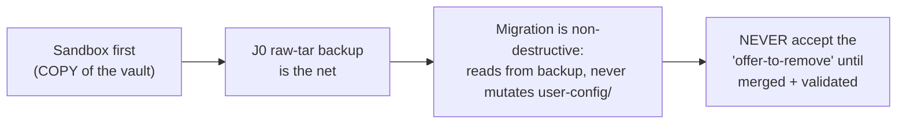
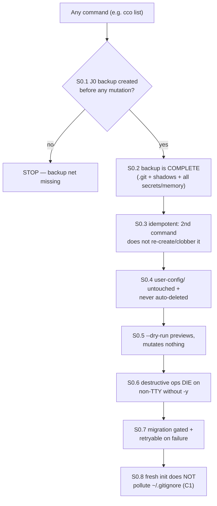
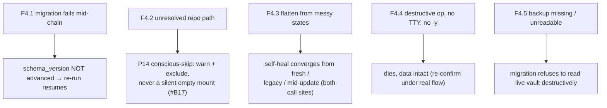

# Decentralized-config v1 — E2E Validation Checklist & Procedure

**Audience:** the maintainer-dev dogfooding the breaking cutover before merge (and any future
cco developer validating a migration). **This is dev process, not a shipped feature.**

**Goal.** Walk a *real legacy-vault install* through **legacy config → backup → migration →
functional test**, and — most importantly — **prove the safety nets first**: the commands and
mechanisms that must work *before* any migration touches data, plus the failure paths that protect
against data loss. Pass = both migration audiences converge idempotently with no data loss, and
every safety net fires as designed.

**Relationship to other docs (do not duplicate):**
- [`P2-dogfooding-validation.md`](P2-dogfooding-validation.md) — the **sandbox recipe** (§3),
  the **legacy-vault fate** (§1), and the high-level validation sequence. *Set up your sandbox
  there first; this doc is the runnable checklist that exercises it.*
- [`reviews/27-06-2026-pre-e2e-comprehensive-review.md`](reviews/27-06-2026-pre-e2e-comprehensive-review.md)
  — the findings this gate de-risks; checks below cite the relevant IDs (C1, C2/C3, C6/C7, BL1/BL2).
- ADRs: **0006** (breaking cutover · lazy migration · raw-tar backup), **0008** (`~/.cco` fresh git
  store), **0021** (`cco init --migrate` · cascade/forget), **0025** (eager-global / lazy-project
  migration ownership), **0028** (flat `~/.cco/.claude`), **0029** (destructive-confirm contract).

> **Baseline before you start:** branch `feat/vault/decentralized-config`, unit suite
> **945/0** (`CCO_ALLOW_HOST_RESOLVE=1 ./bin/test`). Commits are LOCAL (the maintainer pushes from
> the Mac). The e2e here is the **gate that precedes the merge** — merge nothing until it passes.

---

## 0. Golden rules (safety invariants — never violate)



1. **Sandbox first.** Run the whole flow against a *throwaway copy* of the real vault with all
   roots redirected (P2 §3) before ever touching the real install.
2. **The migration is non-destructive by design** — it reads from a backup copy and never mutates
   `user-config/`; nothing auto-deletes.
3. **The J0 raw-tar backup is the net** — it captures the *whole* vault (`.git` +
   `profile-state/<branch>/` shadows + **all** profiles' secrets and memory).
4. **Never accept the legacy-vault offer-to-remove** until the feature is merged to `main` and the
   real flow is confirmed working. The redundancy (original `user-config/` + its remote + the tar)
   is the whole point.

---

## 1. Environment setup

Follow **P2 §3 (sandbox recipe)** verbatim. In short:

```bash
# Host shell (macOS/Linux), on feat/vault/decentralized-config:
export CCO_USER_CONFIG_DIR=/tmp/cco-dogfood/user-config   # a COPY of the real vault
export CCO_DATA_HOME=/tmp/cco-dogfood/data
export CCO_STATE_HOME=/tmp/cco-dogfood/state
export CCO_CACHE_HOME=/tmp/cco-dogfood/cache
export HOME=/tmp/cco-dogfood/home          # isolates ~/.cco -> /tmp/cco-dogfood/home/.cco

cp -a /real/path/user-config "$CCO_USER_CONFIG_DIR"        # realistic legacy data
```

Record, for later assertions:
- `BK="$CCO_STATE_HOME/cco/backups"` — where the J0 raw-tar lands.
- `GC="$HOME/.cco/.claude"` — the flat global config home (ADR-0028).
- the project(s) you will migrate, and at least one **multi-repo (joined)** project to exercise
  C2/C3.

- [ ] Sandbox roots exported; `user-config/` is a **copy**, not the real vault.
- [ ] `git rev-parse --abbrev-ref HEAD` = `feat/vault/decentralized-config`.

---

## 2. Phase 0 — Pre-migration safety-net verification

**The commands and mechanisms that MUST work before the migration is allowed to change anything.**
Run these on the freshly-copied legacy vault, *before* a deliberate full migration.



### S0.1 — Backup is created automatically on the first command (J0, ADR-0006)
```bash
ls -la "$BK"/vault-*.tar.gz 2>/dev/null && echo "no backup yet"
cco list >/dev/null            # any command triggers J0 on first run
ls -la "$BK"/vault-*.tar.gz    # now present
stat -f '%Lp' "$BK"/vault-*.tar.gz 2>/dev/null || stat -c '%a' "$BK"/vault-*.tar.gz
```
- [ ] The archive appears **only after** the first command, and is mode **`0600`**.
- [ ] It was written atomically (no leftover `*.tmp`/partial in `$BK`).

### S0.2 — Backup completeness / recoverability (BL1/BL2)
The net is only a net if it can restore *everything*, including inactive profiles' gitignored data.
```bash
tar tzf "$BK"/vault-*.tar.gz | grep -E '/\.git/|profile-state/|secrets\.env|/memory/' | head
```
- [ ] Archive contains the vault `.git/`.
- [ ] Archive contains `profile-state/<branch>/…` shadows for **every** profile (not just active).
- [ ] Inactive-profile `secrets.env` **and** `memory/` are present (the BL1/BL2 lesson — they live
      on the profile-state branch shadow, not the working tree).

### S0.3 — Backup is idempotent (not re-created or clobbered)
```bash
A=$(ls "$BK"/vault-*.tar.gz); cco_before=$(stat -f %m "$A" 2>/dev/null || stat -c %Y "$A")
cco list >/dev/null            # second command
A2=$(ls "$BK"/vault-*.tar.gz); cco_after=$(stat -f %m "$A2" 2>/dev/null || stat -c %Y "$A2")
[ "$A" = "$A2" ] && [ "$cco_before" = "$cco_after" ] && echo "OK: backup untouched"
```
- [ ] The marker gate prevents a second backup; the original archive is byte-stable.

### S0.4 — Legacy vault is never mutated or auto-deleted (ADR-0006 Dec. 2)
```bash
md5sum() { command md5sum "$@" 2>/dev/null || md5 "$@"; }
find "$CCO_USER_CONFIG_DIR" -type f | sort | xargs md5sum > /tmp/uc-before.txt
# … run migration commands later …
# re-run the same find|md5sum into /tmp/uc-after.txt and diff
```
- [ ] After every migration command, `user-config/` is **bit-for-bit unchanged** (`diff` clean).
- [ ] No command path deletes `user-config/`; removal is offered only as an explicit, manual
      instruction — and you **decline it** (golden rule #4).

### S0.5 — Dry-run previews without mutating
```bash
cco update --dry-run           # lists pending migrations, runs none
```
- [ ] `--dry-run` lists the pending global/project migrations and exits **0**.
- [ ] `schema_version` in `<state>/cco/.../meta` is **unchanged** after `--dry-run`.

### S0.6 — Destructive-confirm safety nets DIE on non-TTY without `-y` (C6/C7, ADR-0029 D2)
These guard against an unattended pipeline silently destroying data.
```bash
cco config validate --fix </dev/null;            echo "exit=$?"   # expect non-zero
cco project coords --sync --from <unit> </dev/null; echo "exit=$?"# expect non-zero
cco forget <project> </dev/null;                 echo "exit=$?"   # expect non-zero
```
- [ ] Each exits **non-zero** with a *"re-run with `-y`"* message and changes **nothing**.
- [ ] `--force` is **rejected** as a skip-confirm flag on `forget` / `remote remove` /
      `template remove` (it is the in-use override only; `cco forget X --force` → "Unknown option").

### S0.7 — Migration is gated and retryable
- [ ] Migrations are gated by `schema_version` (already-applied ones are skipped on re-run).
- [ ] A migration that fails mid-chain leaves `schema_version` **un-advanced**, so the next
      `cco update` resumes from the failed step (see Phase 4, F4.1 for the injected-failure test).

### S0.8 — Fresh init does not pollute the user's `~/.gitignore` (C1 regression)
```bash
printf '.DS_Store\nnode_modules/\n' > "$HOME/.gitignore"     # pre-existing user gitignore
B=$(cat "$HOME/.gitignore")
cco init >/dev/null 2>&1 || true                              # run from a fresh repo dir
[ "$B" = "$(cat "$HOME/.gitignore")" ] && echo "OK: ~/.gitignore untouched"
```
- [ ] `~/.gitignore` is **byte-for-byte unchanged** — migration 009's vault-era patterns are gated
      to the legacy layout and never touch `$HOME` under the flat/decentralized layout.

**Phase 0 gate:** every box above ticked → the safety nets hold; proceed to migrate.

---

## 3. Phase 1 — Backup (explicit confirmation)

Phase 0 already proved J0 created the net automatically. Now make it conscious:
- [ ] Note the archive path `$BK/vault-<date>.tar.gz` and keep it.
- [ ] (Belt-and-suspenders) keep the original `user-config/` and its git **remote** as independent
      fallbacks (P2 §1 "net redundancy").

---

## 4. Phase 2 — Migration (both audiences)

### Audience A — a new user pulling the update from `main` (`cco update`)
Eager global migration (ADR-0025): populates/repoints `~/.cco` from the backup; runs the global
chain (`migrations/global/` **001→015**, note **no 008**) and the project chain
(`migrations/project/` **001→013**) in order, idempotently, schema-gated; the **015 flatten**
moves `~/.cco/global/.claude` → `~/.cco/.claude` (ADR-0028).
```bash
cco update                     # eager global migration + chain + flatten + changelog
cco update                     # run AGAIN — must be a no-op (idempotent)
```
- [ ] `schema_version` converges to the latest (global and project chains both applied).
- [ ] The flat global home exists: `$GC` is present and there is **no** `~/.cco/global/.claude/`.
- [ ] The personal global config (agents/rules/skills/settings, packs, templates, `setup*.sh`,
      `languages`, `secrets.env`) is restored under `~/.cco` from the backup.
- [ ] `changelog.yml` entries surface via `cco update` / `cco update --news`; nothing silently
      skipped.
- [ ] The **second** `cco update` reports nothing to do (idempotent convergence).

### Audience B — the dev migrating a project (`cco init --migrate`)
Lazy, per-project (ADR-0021): hydrates `<repo>/.cco/` in one pass (a complete, final `project.yml`),
reading from the backup, never mutating `user-config/`.
```bash
cd /path/to/<repo>             # a repo that was a project in the legacy vault
cco init --migrate <project>
cco init --migrate <project>   # run AGAIN — must REFUSE to clobber (F11)
```
- [ ] `<repo>/.cco/project.yml` is written **complete in one pass** (repos/llms/packs final,
      machine-agnostic names + coordinates) — no second schema-migration of the same file.
- [ ] The project is registered in the machine-local STATE index (logical name → host path).
- [ ] Gitignored data is recovered, **including for a project on an inactive profile** (secrets +
      memory from the profile-state shadow — BL1/BL2).
- [ ] Migrated memory is readable by the session (lands in STATE `session/memory`, the path
      `cco start` actually mounts — the H7 lesson).
- [ ] The **re-run** refuses with guidance (`cco join` or remove `.cco/` to re-migrate), proving
      no destructive clobber.

---

## 5. Phase 3 — Functional verification (the migrated install works)

```bash
cco list                         # projects, packs, templates, llms, remotes all enumerated
cco resolve <name>               # logical name → host path (clone-from-url if needed)
cco start <project> --dry-run    # generates docker-compose without launching
cco start <project>              # real launch
cco sync                         # refresh resolved config into place
cco config save -m "post-migrate baseline"   # versions ~/.cco
```
- [ ] `cco list` shows the migrated projects and global resources.
- [ ] `cco start <project>` launches; the four `.claude` scopes mount as expected; packs/templates
      resolve; tags work.
- [ ] **Multi-repo (joined) project (C2/C3):** `cco start` does not collide CDP ports across
      sessions, and `cco stop <project>` stops the right container — both resolve the project via
      index **membership**, not a bare `paths:` lookup.
- [ ] `cco config save/push/pull` versions/syncs `~/.cco` (Phase-3 remote is opt-in; not required
      for this gate).

---

## 6. Phase 4 — Failure-path verification (deliberately break things)

Confirm the system degrades safely and the nets fire. Use the sandbox — these are destructive by intent.



### F4.1 — Migration failure is retryable
- [ ] Simulate a failing migration (e.g. point a migration step at an unwritable dir, or inject a
      non-zero return in a sandbox copy of a `migrations/*/NNN_*.sh`). Run `cco update`.
- [ ] It errors and **stops**; `schema_version` is **not** advanced past the failed step.
- [ ] Fix the cause and re-run `cco update` → it **resumes** from the failed migration and converges.
      No partial/duplicated application.

### F4.2 — Unresolved reference → conscious-skip (P14, #B17)
- [ ] Remove/rename a repo's host path so its name no longer resolves, then `cco start <project>`.
- [ ] The unresolved mount is **warned about and excluded** — never a silent empty bind-mount.
- [ ] `cco resolve <name>` (re-point / clone) recovers it; the next start mounts it for real.

### F4.3 — Flatten self-heal converges from any starting state (the dogfooding-caught bug)
- [ ] **Fresh** (`~/.cco/.claude` only): no-op, no error.
- [ ] **Legacy** (`~/.cco/global/.claude` present): content moves to `~/.cco/.claude`, legacy
      remnant cleaned.
- [ ] **Mid-update** (both dirs partially present): converges without clobbering newer content.
- [ ] Reachable from **both** entry points: migration 015 **and** the first-run bootstrap
      (`_cco_first_run`, runs on *any* command before `check_global`) — so a pre-flatten user is
      never locked out of `cco update`.

### F4.4 — Destructive ops under no-TTY (re-confirm under the real flow)
- [ ] Re-run S0.6 in the migrated state: `cco config validate --fix`, `cco project coords --sync`,
      `cco forget`, and the `remove` family with `</dev/null` → all **die**, nothing destroyed.

### F4.5 — Missing / corrupted backup
- [ ] Delete or truncate `$BK/vault-*.tar.gz`, then attempt a migration that reads from it.
- [ ] The migration **refuses / errors** rather than destructively mutating `user-config/` or
      producing a half-migrated state. (The live vault stays the source of truth; re-create the
      backup and retry.)

---

## 7. Phase 5 — Rollback

The whole design keeps rollback trivial: nothing was destroyed.
- [ ] Switch the cco on `PATH` back to `main`/`develop` (the old cco still reads `user-config/`).
- [ ] Confirm the real projects launch under the **old** cco — proving the legacy world is intact.
- [ ] If `~/.cco` / DATA / STATE / CACHE need clearing, remove the sandbox dirs (or, on a real run,
      the freshly-created `~/.cco` — it is new and does not collide with `user-config/`).
- [ ] Full restore (if ever needed): `tar xzf "$BK"/vault-<date>.tar.gz -C <dest>`.

---

## 8. Sign-off checklist

- [ ] **Phase 0** — all eight safety nets (S0.1–S0.8) verified *before* migrating.
- [ ] **Phase 2A** — `cco update` migrates eagerly + flattens, idempotent on re-run, no data loss.
- [ ] **Phase 2B** — `cco init --migrate` hydrates `<repo>/.cco/` in one pass, recovers
      inactive-profile secrets/memory, refuses to clobber on re-run.
- [ ] **Phase 3** — migrated install is fully functional (incl. multi-repo start/stop).
- [ ] **Phase 4** — every failure path degrades safely; nets fire.
- [ ] **Phase 5** — rollback to the legacy world confirmed; `user-config/` bit-for-bit intact.
- [ ] **Reconciliation** — every migration claim in
      [`reviews/27-06-2026-pre-e2e-comprehensive-review.md`](reviews/27-06-2026-pre-e2e-comprehensive-review.md)
      §5 has a corresponding check above (and vice-versa); flag any gap.

**Only when every box is ticked:** proceed to merge `feat/vault/decentralized-config`, and **only
then** accept the legacy-vault removal (golden rule #4).

---

## 9. Reference map

| Concern | Source of truth |
|---|---|
| Sandbox recipe + legacy-vault fate | [`P2-dogfooding-validation.md`](P2-dogfooding-validation.md) |
| Raw-tar backup, breaking cutover, lazy migration | ADR-0006 |
| `~/.cco` fresh git store, remote opt-in | ADR-0008 |
| `cco init --migrate`, forget, delete-cascade | ADR-0021 |
| Eager-global / lazy-project migration ownership | ADR-0025 |
| Flat `~/.cco/.claude` + flatten 015 self-heal | ADR-0028 |
| Destructive-confirm contract (`-y`, `--force` override, non-TTY → die) | ADR-0029 D2 |
| Findings de-risked here (C1, C2/C3, C6/C7, BL1/BL2, H7, P14/#B17) | [`reviews/27-06-2026-pre-e2e-comprehensive-review.md`](reviews/27-06-2026-pre-e2e-comprehensive-review.md) |
| Migration chains | `migrations/global/` (001–015, no 008) · `migrations/project/` (001–013) |

---

*Generated with Claude Code*
