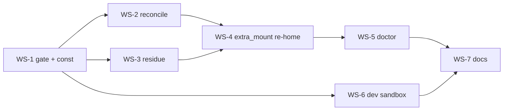

# Index-integrity hardening — implementation plan

**Branch**: `feat/index/integrity-hardening` (from `develop`).
**Decision**: [ADR-0052](../decisions/0052-index-integrity-version-gate-and-reconcile.md).
**Delivery**: single delivery of the whole cluster (WS-1..6 + docs) **before** resuming the host
e2e-review v3.1. Large scope → may span sessions; commit atomically per workstream.
**Suite baseline**: 1465/7 in-container (the 7 are host-only privilege-boundary artifacts —
FI-19: 6 in `test_access_scope`, 1 `test_paths_symlink_safe_tool_root`). The earlier "1463/9"
note was stale — 2 of those host-only tests were fixed upstream; the total (1472) is unchanged.
Run `bin/test` after each WS; keep the count at 1465/7 + new tests. After WS-1: **1475/7** (+10).

> ⚠ Self-dev caveats (project CLAUDE.md + memory): changes to `entrypoint.sh`/`hooks/`/`Dockerfile`
> and **store-touching verbs run the image-baked cco** — `lib/` edits are invisible in-session until
> `cco build`. The hermetic test suite DOES exercise `lib/` directly, so unit/integration tests are
> the in-session signal; live dogfood is a **host / post-build** gate.

## Resume state (update as workstreams land)

| WS | Title | Status | Commit |
|----|-------|--------|--------|
| 0  | ADR-0052 + this plan | ✅ written | — |
| 1  | Fail-loud version gate + `CCO_INDEX_VERSION` + `_cco_in_container` ==0 | ✅ | `93b3354` |
| 2  | Non-destructive reconcile (first_run + 017) | ⏳ | — |
| 3  | In-index residue absorption | ⏳ | — |
| 4  | extra_mount re-home (FI-23) | ⏳ | — |
| 5  | Index-focused doctor (FI-22) | ⏳ | — |
| 6  | Developer sandbox (isolated XDG) | ⏳ | — |
| 7  | Docs: changelog + backlog flip + living-doc sweep | ⏳ | — |

## Sequencing

WS-1 first (it defines `CCO_INDEX_VERSION`, which WS-2/3 consume). WS-2 and WS-3 both touch
`lib/index.sh` migration path — land WS-2 then WS-3 to avoid churn. WS-6 is independent of the index
logic (env plumbing) and can run in parallel. WS-7 last.

## Session grouping (tracked in roadmap.md → "Index-integrity hardening")

Delivered across **4 consecutive implementation sessions**; each session's ritual is
**design + verify against ADR-0052 and the cited ADRs + correctness review of the current tree →
implement → tests green (1463/9 + new) → atomic commit(s) → flip the WS row above**.

| Session | WS | Verify against |
|---|---|---|
| **S1 — Version-gate foundations** | WS-1 | ADR-0052 §1; FI-16 mutation-order; ADR-0051 D6 |
| **S2 — Reconcile + residue** | WS-2, WS-3 | ADR-0052 §2/§3; ADR-0051 D6; ADR-0017 D2; ADR-0047 |
| **S3 — Scoping + doctor** | WS-4, WS-5 | ADR-0052 §4/§5; ADR-0051 D2; ADR-0021 Dec.5 |
| **S4 — Dev-sandbox + docs cutover** | WS-6, WS-7 (+ N3) | ADR-0052 §6/§7; `paths.sh` XDG; update-system + documentation-lifecycle rules |

N3 (`q`/Exit abort) is small and independent — it rides S4 unless pulled earlier for convenience.

---

## WS-1 — Fail-loud version gate

**Goal**: `disk-version > binary-supported → die`, one host-only choke point, self-maintaining.

**Files / anchors**:
- `lib/index.sh` — introduce a single `CCO_INDEX_VERSION` (=2) source; `_index_ensure_file:199`
  (writer) and `_index_version:179` (reader default) consume it; add `_latest_index_version()` echoing
  the constant (mirrors `_latest_schema_version`).
- `lib/migrate.sh:234` `_cco_first_run` — insert `_cco_version_gate "$cmd"` **after**
  `_cco_bootstrap_roots` (56), **before** `_cco_flatten_global_claude` (196) / `_cco_backup_legacy_vault`.
- New `_cco_version_gate`: read global `.cco/meta` `schema_version` (`_read_cco_meta`,
  `update-meta.sh:28`) vs `_latest_schema_version global` (208); read index `version:` vs
  `_latest_index_version`. On any `disk > supported` → `die` with a message naming the artifact + the
  remedy ("use the newer cco, or run its `cco update`").
- `lib/paths.sh:294` `_cco_in_container` — add `[[ "${CCO_IN_CONTAINER:-}" == "0" ]] && return 1`.

**Notes**: gate is host-only (first_run is already `_cco_host_side_ok`-guarded). `die` on ALL verbs
(ADR-0052 §1) — no verb classification. Per-project `.cco/meta` gate is deferred (first_run has no
project in hand); the global + index bounds stop the session before any mutation.

**Tests**: new `tests/test_version_gate.sh` — disk index `version: 3` → any command dies; global meta
`schema_version` > latest → dies; equal/less → passes. `CCO_IN_CONTAINER=0` forces host mode.

## WS-2 — Non-destructive reconcile (N1 + N2)

**Goal**: merge legacy `<state>/cco/index` into `<state>/cco/shared/index`, never clobber.

**Files / anchors**:
- `lib/index.sh` — new `_index_reconcile_legacy_location()`:
  - guard `! _cco_container_operator || return 0` (host-only);
  - `legacy=$(_cco_state_dir)/index`, `new=$(_index_file)`;
  - absent legacy → 0; legacy-only → `mv`; both → merge (below).
  - Merge: run the legacy (v1) through the v1→v2 re-homing to candidate `(project,name)→path` +
    unscoped orphans; for each, adopt if `new` lacks it, skip if paths agree, else conflict:
    TTY → `_prompt` keep-legacy/keep-new; no-TTY → keep both files + `warn`, do NOT delete legacy.
    Remove legacy only on a fully-resolved merge. Optional `.bak` of legacy before removal.
  - Reuse the atomic writers (`_index_pp_set`, `_index_set_unscoped`) so INV-IDX holds.
- `lib/migrate.sh` `_cco_first_run` — call `_index_reconcile_legacy_location` after the gate (§1),
  before flatten. Idempotent → cheap `[[ -f legacy ]]` no-op once merged.
- `migrations/global/017_state_shared_subbucket.sh:45-53` — replace the index arm's `rm -f`/`mv`
  with a call to `_index_reconcile_legacy_location` (keep the pack/template arm as-is).

**Tests**: `tests/test_index_reconcile.sh` — both-exist with disjoint entries → union; overlapping same
path → deduped; overlapping different path non-TTY → both files kept + warn + legacy NOT deleted;
legacy-only → moved; idempotent second run → no-op. Update/confirm `test_migrate*.sh` no longer
asserts "new wins" destruction.

## WS-3 — In-index residue absorption

**Goal**: a `version: 2` file with a non-empty `paths:` residue (old-binary write) is folded in.

**Files / anchors**:
- `lib/index.sh:213` `_index_migrate_if_needed` — after the `version < 2` branch, add: if `version >= 2`
  and `_index_section_dump paths` is non-empty → re-home those entries (same logic as
  `_index_migrate_v1_to_v2`'s consume loop) into `project_paths:`/`unscoped:`, then drop `paths:`.
- Factor the re-homing so v1→v2 and residue-absorption share it.

**Tests**: extend `tests/test_index.sh` — a hand-built v2 file with a stray `paths:` entry, first write
absorbs it; a clean v2 file is untouched (no spurious rewrite).

## WS-4 — extra_mount re-home (FI-23)

**Goal**: legacy extra_mounts migrate under their declaring project, not `unscoped:`.

**Files / anchors**:
- `lib/index.sh` v1→v2 re-homing — for each project in `projects:`, resolve its unit dir
  (`_resolve_unit_dir_for_project`) and read `yml_get_mount_coords` (`yaml.sh:349`); re-home matching
  flat/unscoped names under that project. Host-only (needs project.yml on disk).
- `lib/cmd-config.sh` — `_cv_detect` gains `_cv_detect_fi23_residue`: for each project's declared
  extra_mounts, if unscoped-bound but not project-scoped → record an `fi23_rehome` op;
  `_cv_prune_record` handles it (`_index_pp_set` + `_index_section_remove unscoped`).

**Tests**: `tests/test_resolve.sh` / `test_migrate_completeness.sh` — a v1 index with an extra_mount not
in repos-membership migrates under the declaring project; `config validate --fix` re-homes a residue.

## WS-5 — Index-focused doctor (FI-22)

**Goal**: malformed internal records are visible, reported separately, never auto-pruned.

**Files / anchors**:
- `lib/cmd-config.sh:220-412` — `_cv_detect` collects malformed index records into a separate
  `_CV_MALFORMED` (not `_CV_RECS`); the report emits them under a distinct heading with remediation
  advice; `--fix` prunes only orphans (existing two-phase confirm), never malformed. Generalise the
  `cco path list` precedent (`cmd-resolve.sh:895`).

**Tests**: `tests/test_config_validate.sh` — a malformed index line is reported (not pruned); a genuine
orphan is still pruned under `--fix`.

## WS-6 — Developer sandbox

**Goal**: isolate a dev binary's internal state so §1's `die` never bites a developer.

**Files / anchors**:
- Env toggle (e.g. `CCO_DEV_SANDBOX=1` and/or a `--dev-sandbox` flag) resolved early in `bin/cco` /
  `lib/paths.sh`: when set, point `CCO_STATE_HOME`/`CCO_CACHE_HOME`/`CCO_DATA_HOME` (and decide on
  `~/.cco`) at a sandbox root (e.g. `~/.cco-devsandbox/...`) unless already overridden.
- Optional one-shot seed-copy from the real buckets (a small `cco dev-sandbox init`, or auto-seed on
  first use). Visible indicator in `cco whoami` (`cmd-whoami.sh`) + a banner line.

**Tests**: `tests/test_dev_sandbox.sh` — toggle redirects the bucket resolvers; whoami reports sandbox;
off by default (no behaviour change).

## WS-7 — Docs

- `changelog.yml` — one additive entry (data-preservation on upgrade + gate + dev sandbox).
- `docs/maintainers/roadmap-backlog.md` — flip FI-16 / FI-23 / (index-part of) FI-22 to landed with a
  pointer to ADR-0052; record N1/N2/N3; note the deferred broad-reader validation still under FI-22;
  add FI-27 only if the sandbox scope splits.
- Living-doc sweep: root `CLAUDE.md` index section (STATE bucket description), the decentralized-config
  `design.md` if it describes the index location/migration, and `docs/users/reference/cli.md` for the
  `--dev-sandbox` surface + any `cco config validate` malformed-report note.

## Out-of-session / host gates (post-merge, from the Mac)

- `cco build` then live dogfood: the 0.5.2→develop reconcile (start-before-update ordering), the gate
  refusing a downgraded binary, the dev-sandbox toggle.
- Re-run the suite on the host for a clean 1463/0 (host has no privilege-boundary skips — FI-19).
- Push both branches + merge to develop (host-only per FI-20 — `.cco`-touching merges).
