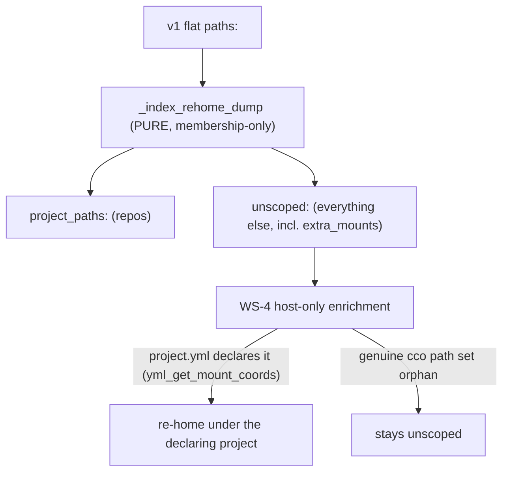

# S3 handoff — Scoping + doctor (WS-4 + WS-5)

> **RETIRED — S3 landed at `564040e` (2026-07-23):** WS-4 host-only `_index_rehome_extra_mounts`
> enrichment + `config validate --fix` re-home lane; WS-5 `_CV_MALFORMED` report lane. Suite `1498/7`.
> Kept for its reference value; the live starting point is now [`S4-handoff.md`](./S4-handoff.md).

**Read this first, then `00-plan.md` §WS-4/§WS-5 for the full spec.** This handoff carries the
*starting context* + the *S2-derived guidance* that the original plan could not know. Retire it once
S3 lands.

## Where we are

- **Branch**: `feat/index/integrity-hardening` (from `develop`). **Decision**:
  [ADR-0052](../decisions/0052-index-integrity-version-gate-and-reconcile.md).
- **S1 (WS-1) + S2 (WS-2/WS-3) are DONE.** On the branch:
  - `93b3354` + review `8811108` — WS-1 fail-loud version gate + `CCO_INDEX_VERSION` (S1).
  - `5e43863` — WS-2 non-destructive legacy reconcile + WS-3 residue absorption + the shared
    `_index_rehome_dump` classifier (S2).
- **Suite baseline: `1493/7` in-container** (the 7 are the pre-existing host-only FI-19 artifacts: 6 in
  `test_access_scope`, 1 `test_paths_symlink_safe_tool_root` — NOT ours). Keep it at `1493/7 + S3's new
  tests`. **Confirm the FAIL names are unchanged — never assume** (`bin/test --file test_access_scope`
  and `--file test_paths`).
- **Working-tree hygiene**: `.cco/project.yml` is modified by the MAINTAINER (FI-25) — **never stage it**.
  `tmp/` and `to-verify-guides-docs.md` are untracked scratch — leave them out. Stage only S3's files.

## What S2 leaves for S3 to consume

- **`_index_rehome_dump "<paths_dump>" "<projects_dump>"`** (`lib/index.sh`) — the SINGLE v1→v2
  re-homing classifier. It is **PURE** (string in, `pp`/`un` TSV stream out; no file/project.yml
  access), consumed by the v1→v2 rewrite, the reconcile, and residue absorption.
- **`_index_extract_bindings <file>`**, **`_index_reconcile_legacy_location [<interactive>]`**,
  **`_index_absorb_residue`**, **`_index_drop_section`** — the reconcile/residue machinery. The
  `_index_file` reconcile-only override + the optional file arg on `_index_read_state` are the tools for
  reading a non-live index.
- A clean v2 index is now the norm on any host-side write (reconcile + residue keep it clean).

## ⚠ The S2 nuance that MUST shape WS-4

WS-4 re-homes **extra_mounts** under their **declaring project** (FI-23), not `unscoped:`. But
membership (`projects:`) lists **repos**, not extra_mounts — so an extra_mount is *never* in the
membership the pure `_index_rehome_dump` classifies by, and correctly falls to `unscoped:` there. The
fix therefore CANNOT live inside `_index_rehome_dump` (it is pure and must stay so):

- Layer WS-4 as a **host-only** step (needs `project.yml` on disk): for each project in `projects:`,
  resolve its unit dir (`_resolve_unit_dir_for_project`) + read `yml_get_mount_coords`
  (`yaml.sh:349`); re-home the matching flat/unscoped names under that project via the atomic writers
  (`_index_pp_set` + `_index_section_remove unscoped`), so INV-IDX holds. Keep it **additive** to the
  pure classifier, not a rewrite of it.
- On-disk residue is re-homed by a new `cco config validate --fix` detection
  (`_cv_detect_fi23_residue` → `_cv_prune_record`), reusing the ADR-0021 two-phase sync-class confirm.

## ⚠ The S1/S2 read-safety pattern that MUST shape WS-5

WS-5 makes malformed internal records **visible, reported separately, and never auto-pruned**. Reuse the
established honesty vocabulary rather than inventing one: probe by **opening** (never `test -r`), and
keep malformed records in a **separate lane** (`_CV_MALFORMED`, not `_CV_RECS`) so `--fix` prunes only
genuine orphans (the format repair is the user's call). Generalise the `cco path list` precedent
(`cmd-resolve.sh:895`). This is the flag-on-read + warn-once contract of ADR-0052 §5.

## Session ritual (same as every cluster session)

1. **Design micro-pass**: verify against the ADRs below + a correctness review of the current tree
   *before* touching code. Re-read the WS-4/WS-5 spec in `00-plan.md` and the code at the anchors
   (line numbers drift — anchor on function names).
2. Implement WS-4, then WS-5.
3. Tests green: **`1493/7` + new** (`bin/test`; confirm the 7 FAIL names are unchanged).
4. Atomic commit(s) + flip the WS-4/WS-5 rows in `00-plan.md` + write the S4 handoff, retire this one.
5. **Do NOT auto-advance to S4** — the maintainer launches each session explicitly.

**Verify S3 against**: ADR-0052 §4/§5; ADR-0051 D2 (no global-default layer — the FI-23 root);
ADR-0021 Dec.5 (`config validate --fix` two-phase sync-class calibration).

## Self-dev caveats & host gates

- **`lib/` edits are invisible to store-touching verbs in-session** (they run the image-baked cco) until
  `cco build`. The hermetic suite exercises `lib/` directly, so unit/integration tests are the in-session
  signal; **live dogfood is a host / post-build gate.**
- Host gates after the WHOLE cluster (S4), from the Mac: `cco build` + dogfood the 0.5.2→develop
  reconcile (start-before-update ordering + the both-present merge), host suite clean 0-failure, push both
  branches + merge → develop (host-only per FI-20). Only then resume e2e-review v3.1.

## Launch pointer

> *"Esegui Sessione 3 del piano index-integrity (roadmap §Index-integrity; ADR-0052 §4/§5; 00-plan
> WS-4+5; S3-handoff.md): design+verifica-ADR/correttezza → implementa WS-4 extra_mount re-home poi WS-5
> doctor → test 1493/7+nuovi → commit atomico + flip WS rows + handoff S4."*
