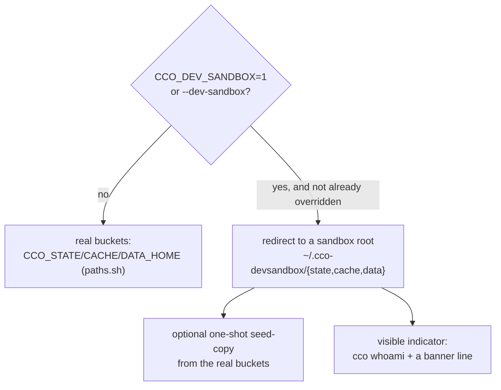

# S4 handoff — Dev-sandbox + docs cutover (WS-6 + WS-7 + N3)

> **RETIRED — S4 landed (2026-07-23), the FINAL session of the index-integrity cluster:** WS-6
> developer sandbox (`--dev-sandbox` → isolated STATE/DATA/CACHE, CONFIG shared, opt-in seed, whoami
> indicator); N3 (`_resolve_unit` propagates rc=2 → `cco start` aborts, `cco resolve[/--all]` exit
> cleanly); WS-7 docs cutover (changelog #48, FI-16/23 done + FI-22 partial, living-doc sweep,
> ADR-0051 D6 + ADR-0021 §5 + ADR-0052 §7 forward-annotations). Suite `1511/7` in-container. The
> whole cluster is now on `feat/index/integrity-hardening`, ready for the host gates (see below +
> `00-plan.md`). Kept for reference.

**Read this first, then `00-plan.md` §WS-6/§WS-7 for the full spec.** This handoff carries the
*starting context* + the *S1–S3-derived guidance* the original plan could not know (chiefly the WS-7
inventory the cluster accrued). Retire it once S4 lands — S4 is the **final** session of the cluster.

## Where we are

- **Branch**: `feat/index/integrity-hardening` (from `develop`). **Decision**:
  [ADR-0052](../decisions/0052-index-integrity-version-gate-and-reconcile.md).
- **S1 (WS-1) + S2 (WS-2/WS-3) + S3 (WS-4/WS-5) are DONE.** On the branch:
  - `93b3354` + review `8811108` — WS-1 fail-loud version gate + `CCO_INDEX_VERSION` (S1).
  - `5e43863` — WS-2 non-destructive legacy reconcile + WS-3 residue absorption + the shared
    `_index_rehome_dump` classifier (S2).
  - `564040e` — WS-4 extra_mount re-home (host-only `_index_rehome_extra_mounts` enrichment +
    `cco config validate --fix` fi23 re-home lane) + WS-5 malformed doctor lane (S3).
- **Suite baseline: `1498/7` in-container** (the 7 are the pre-existing host-only FI-19 artifacts: 6 in
  `test_access_scope`, 1 `test_paths_symlink_safe_tool_root` — NOT ours). Keep it at `1498/7 + S4's new
  tests`. **Confirm the FAIL names are unchanged — never assume** (`bin/test --file test_access_scope`
  and `--file test_paths`).
- **Working-tree hygiene**: `.cco/project.yml` is modified by the MAINTAINER (FI-25) — **never stage it**.
  `tmp/` and `to-verify-guides-docs.md` are untracked scratch — leave them out. Stage only S4's files.

## What S3 leaves for S4

- **WS-4/WS-5 shipped code + tests, NO docs yet.** The changelog + backlog flips + living-doc sweep for
  the WHOLE cluster are deliberately batched into **WS-7** (this session). Do not forget WS-4/WS-5 there.
- `cco config validate` now has **three lanes** (`_config_validate` in `lib/cmd-config.sh`): orphans
  (pruned), **re-home** (mis-scoped extra_mounts — MOVED under their declaring project, own confirm),
  **malformed** (non-absolute index values — REPORTED, never pruned). The inline `--help` text was
  updated; `docs/users/reference/cli.md` was NOT (that is the WS-7 shipped-behavior sweep).
- `_index_rehome_extra_mounts` (`lib/index.sh`) is host-only + resolver-guarded (`_resolve_project_yml`,
  `yml_get_mount_coords`, `command -v`) — the same guard shape WS-6 must respect if it touches the
  migration path (it should not — WS-6 is env plumbing).

## WS-6 — developer sandbox (ADR-0052 §7)

**Goal**: isolate a dev binary's internal state so §1's `die`-on-newer-state never bites a developer
running two cco versions on the same machine — the ONLY realistic multi-version scenario, and the
root cause (shared XDG state), not the reaction.

- Env toggle (`CCO_DEV_SANDBOX=1` and/or a `--dev-sandbox` flag) resolved **early** in `bin/cco` /
  `lib/paths.sh`: when set, point the bucket resolvers (`_cco_state_dir`/`_cco_cache_dir`/
  `_cco_data_dir` via `CCO_STATE_HOME`/`CCO_CACHE_HOME`/`CCO_DATA_HOME`) at a sandbox root **unless
  already overridden** (don't clobber a caller/test override). Decide on `~/.cco` (CONFIG) — likely
  leave it shared, or sandbox it too; record the call in the ADR §7 forward-annotation.
- Optional one-shot seed-copy from the real buckets (a small `cco dev-sandbox init`, or auto-seed on
  first use). Visible indicator in `cco whoami` (`lib/cmd-whoami.sh`) + a banner line so a sandbox
  session is never mistaken for the real one.
- **Tests**: `tests/test_dev_sandbox.sh` — the toggle redirects the bucket resolvers; whoami reports
  sandbox; **off by default = no behaviour change** (the regression guard for every other test).

## N3 — `q`/Exit honours the exit (ADR-0052 §6)

Small + independent; rides S4. `_resolve_unit` maps `_prompt_for_path` rc=2 (abort) to `return 0`, and
`_start_resolve_paths` ignores the return, so `q`/Exit at a `cco start` mount prompt boots the session
anyway (the menu promises "(q) Exit" but delivers "skip-and-boot"). Propagate rc=2 through `_resolve_unit`
→ `_start_resolve_paths` aborts the start before the container boots; standalone `cco resolve` exits
cleanly; bindings already written stay valid. Test in `tests/test_resolve.sh` / `test_start_*`.

## WS-7 — docs cutover (the cluster's single doc pass)

- **`changelog.yml`** — ONE additive entry for the whole cluster: data-preservation on upgrade (the
  non-destructive reconcile + residue absorption), the fail-loud version gate, the extra_mount re-home,
  the `config validate` malformed report, and the developer sandbox. (ADR-0052 batched it here on
  purpose — WS-1…WS-5 shipped no changelog.)
- **`docs/maintainers/roadmap-backlog.md`** — flip **FI-16** (gate), **FI-23** (extra_mount re-home),
  and the **index-part of FI-22** (the doctor) to landed with a pointer to ADR-0052; record N1/N2/N3;
  **note the still-open FI-22 remainder** (broad structural validation of the OTHER lenient readers —
  tags, remotes — is explicitly out of scope this cluster, ADR-0052 §5); add FI-27 only if the sandbox
  scope splits.
- **Living-doc sweep** (per `.claude/rules/documentation-lifecycle.md` — rewrite living docs to truth,
  forward-annotate ADRs, don't banner):
  - root `CLAUDE.md` — the STATE bucket description (the index location + the new gate/reconcile story);
  - the decentralized-config `design.md` if it describes the index location/migration;
  - `docs/users/reference/cli.md` — the `--dev-sandbox` surface AND the `cco config validate` three-lane
    behavior (orphans / re-home / malformed-report), which S3 shipped but did not document there.
- Forward-annotate ADR-0051 D6 (its "lossless migration" now also covers the location + residue + the
  extra_mount re-home) and ADR-0021 (`config validate --fix` gained the malformed lane + the fi23
  re-home op) — history docs, annotate, do not rewrite.

## Session ritual (same as every cluster session)

1. **Design micro-pass**: verify against the ADRs below + a correctness review of the current tree
   *before* touching code. Re-read the WS-6/WS-7 spec in `00-plan.md` and anchor on function names
   (line numbers drift).
2. Implement WS-6, then N3, then WS-7 (docs last — never ahead of the code).
3. Tests green: **`1498/7` + new** (`bin/test`; confirm the 7 FAIL names are unchanged).
4. Atomic commit(s) + flip the WS-6/WS-7 rows in `00-plan.md`, retire this handoff. This is the last
   session — the cluster is then ready for the host gates below.

**Verify S4 against**: ADR-0052 §6/§7; `lib/paths.sh` XDG bucket resolvers; the `update-system` +
`documentation-lifecycle` rules (WS-7 classification + living-vs-history discipline).

## Self-dev caveats & host gates

- **`lib/` edits are invisible to store-touching verbs in-session** (they run the image-baked cco) until
  `cco build`. The hermetic suite exercises `lib/` directly, so unit/integration tests are the in-session
  signal; live dogfood is a host / post-build gate.
- Host gates after the WHOLE cluster (from the Mac): `cco build` + dogfood — the 0.5.2→develop reconcile
  (start-before-update ordering + the both-present merge), the gate refusing a downgraded binary, the
  extra_mount re-home on a real legacy index, the dev-sandbox toggle, and `q`/Exit aborting a start.
  Re-run the suite on the host for a clean **0-failure** (the host has no privilege-boundary skips —
  FI-19). Push both branches + merge → develop (host-only per FI-20 — `.cco`-touching merges). **Only
  then resume e2e-review v3.1.**

## Launch pointer

> *"Esegui Sessione 4 (finale) del piano index-integrity (roadmap §Index-integrity; ADR-0052 §6/§7;
> 00-plan WS-6+7 + N3; S4-handoff.md): design+verifica-ADR/correttezza → implementa WS-6 dev-sandbox +
> N3 q/Exit-abort → WS-7 docs cutover (changelog + backlog flip FI-16/22/23 + living-doc sweep) → test
> 1498/7+nuovi → commit atomico + flip WS rows + retire handoff. Poi cluster pronto per gli host gate."*
