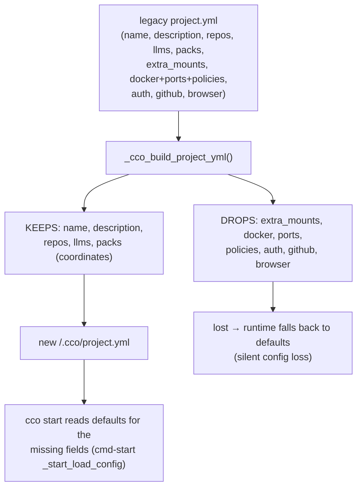
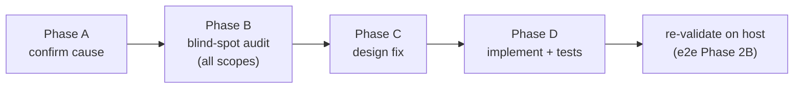

# Handoff — Migration completeness fix (project.yml drops most config)

**Status:** 🔴 OPEN BLOCKER. Found during e2e dogfooding on the real host (2026-06-28),
branch `feat/vault/decentralized-config`. Must be fixed (and re-validated) **before merge**.
**Audience:** the maintainer-dev resuming the fix in a fresh session.

> This handoff is self-contained: read it top-to-bottom, then start at **§6 Next-session
> instructions**. Do the *preventive analysis* (§6 Phase A) before touching code — confirm the
> cause from the source yourself; do not trust this summary blindly.

---

## 1. TL;DR

`cco init --migrate <project>` writes a **`project.yml` that is missing most of the legacy
project's configuration**. Only `name`, `description`, `repos`, `llms`, `packs` survive. The
migration **silently drops**: `extra_mounts`, the whole `docker:` block (`mount_socket`, `ports`,
`env`, `network`, `image`), the Docker-socket **policies** (`docker.containers` /
`docker.mounts` / `docker.security`), `auth`, `github`, and `browser`. The project still *starts*
because the start-time code applies defaults for the absent fields — so the loss is **silent**.

**Nothing is lost at the source** — migration is non-destructive (reads from the J0 backup; the
legacy `user-config/projects/<p>/project.yml` is intact). The fix is to make the migration
**complete**, then re-migrate.

---

## 2. How it was found

Dogfooding the breaking cutover on the host: migrated a real project (`cave-flow`) with
`cco init --migrate cave-flow`. The resulting `<repo>/.cco/project.yml` was reduced to:

```yaml
name: cave-flow
description: "TODO: Add project description"
repos:
  - name: cave-flow
  - name: cave-eda-framework
packs:
  - name: cave-core
```

The legacy `project.yml` was **complete** (ports, extra_mounts, container-access policies, …).
The migrated `.cco/claude/` tree even references mounts that no longer appear in `project.yml`
— the visible symptom of the dropped `extra_mounts`.

---

## 3. Evidence (code-grounded — re-verify in Phase A)

| Claim | Where |
|---|---|
| The new schema **does** support docker/ports/policies/auth/extra_mounts/github/browser | `templates/project/base/project.yml` (full block with `docker:` → `ports`, `env`, `network`, `image`, `containers`/`mounts`/`security`; `auth:`; `extra_mounts:`; `github:`; `browser:`) |
| The migration writer emits **only** name/desc/repos/llms/packs | `lib/migrate.sh` → `_cco_build_project_yml()` (**:556**) |
| The migration **never reads/writes** docker/auth/ports/extra_mounts/env/github/browser | `grep -nE 'docker\|auth\|ports?\|extra_mount\|env:\|github\|browser\|network\|mount_socket\|security\|containers:\|policy' lib/migrate.sh` → only false positives (`authored`/`authoritative`) |
| `_cco_migrate_project` copies some **files** (mcp.json/setup.sh/secrets) but adds nothing to project.yml | `lib/migrate.sh` → `_cco_migrate_project()` (**:631**), the `for f in mcp.json setup.sh …` loop |
| Start-time code reads all the dropped fields from project.yml (so they matter at runtime) | `lib/cmd-start.sh` → `_start_load_config()` (**:216–289**): `auth.method`, `docker.image`, `docker.mount_socket`, `docker.network`, `browser.*`, `github.*`; ports/env feed compose; `extra_mounts` via `_effective_extra_mounts` / `_mount_override_get` |

### Why the test suite is green (the blind spot)

`tests/test_migrate.sh` (**:385–432**) builds its legacy `project.yml` fixture with **only**
name/description/repos/llms/packs and asserts only those. It **never** includes
docker/ports/policies/auth/extra_mounts → the drop is invisible to the suite. Closing this blind
spot is part of the fix.

### Design intent vs. implementation

`design.md` §9 says the migration "**writes the complete final `project.yml` in one pass**"
(≈ lines 842 / 894 / 913). But the §11 test-plan row (≈ line 1113) scopes "complete" to
*"repos+llms+**packs** coordinates written together"* — i.e. "complete" was implemented as
"all **coordinate** sections in one pass, no second schema-migration", not "all **config**".
That gap between the prose and the implemented/tested scope is the root of the bug.

---

## 4. Impact

- **Silent config loss** on every migrated project that customized any of: ports, env, network,
  custom image, `mount_socket`, container/mount/security policies, auth method, github, browser,
  extra_mounts. The project runs on **defaults**, so nothing errors — it just quietly behaves
  differently (no socket, default ports, no extra mounts, default policy).
- **General, not cave-flow-specific** — affects all `cco init --migrate` runs.
- **Non-destructive / recoverable** — source vault intact; re-migration after the fix restores
  everything.
- **Merge blocker** — a migration that loses user config cannot ship.

---

## 5. Reference files

| Path | Role |
|---|---|
| `lib/migrate.sh` | `_cco_build_project_yml` (**:556**, the bug) · `_cco_migrate_project` (**:631**) · `_cco_populate_global_from` (**:265**, the *global* migration — audit it too) · helpers `_migrate_legacy_repos` (**:450**), `_migrate_legacy_list` (**:468**), `_migrate_yml_scalar` (**:478**) — reuse these |
| `templates/project/base/project.yml` | Canonical target schema — the full set of fields a complete `project.yml` may carry |
| `lib/cmd-start.sh` | `_start_load_config` (**:216–289**) — every project.yml field consumed at runtime; `_effective_extra_mounts` / `_mount_override_get` for the mounts path |
| `tests/test_migrate.sh` | The migration tests + the blind-spot fixture (**:385–432**) |
| `docs/.../decentralized-config/design.md` | §9 migration ("complete final project.yml"), §11 phase-2 test plan |
| `decisions/0021-resource-lifecycle.md` | `cco init --migrate` contract |
| `decisions/0023-*.md` (D5) | `extra_mounts` join the coordinate model + host-path in the **index** (no vendor) |
| `decisions/0016-*.md` (D2) | uniform unit-manifest schema |
| `reviews/27-06-2026-pre-e2e-comprehensive-review.md` · `e2e-validation-checklist.md` | the gate this blocks |
| `migrations/{global,project,pack,template}/` | the migration chains to audit for other drops (§6 Phase B) |

---

## 6. Next-session instructions

Work the phases in order, with a maintainer gate between each (per `.claude/rules/workflow.md`).
Branch: `feat/vault/decentralized-config`. No new ADR expected (it's a completeness **bugfix**, not
a design change) and **no changelog** (internal bugfix) — but if Phase C uncovers a genuine schema
decision (e.g. how to map a legacy field with no new-schema home), record it as ADR-0030.

### Phase A — Preventive analysis: confirm the cause (read-only)

1. Re-derive the bug from source — do **not** trust §3. Read `_cco_build_project_yml` and confirm
   exactly which keys it emits; re-run the grep; read `_cco_migrate_project` end-to-end.
2. Get the **real fixture**: the legacy `cave-flow/project.yml`
   (`<vault>/projects/cave-flow/project.yml`, e.g.
   `/Users/alessandro/Projects/CaveResistance/Software/claude-orchestrator/user-config/projects/cave-flow/project.yml`).
   Use it to enumerate, field by field, *legacy-present → migrated? → start-time-consumed?*.
3. Produce a **field-coverage matrix** for `project.yml`: every top-level key + nested
   docker/policy keys → {migrated ✓/✗, runtime-read ✓/✗, tested ✓/✗}.

**Gate:** confirmed cause + the coverage matrix, reviewed.

### Phase B — Broader blind-spot audit (no drops *anywhere* in migration)

The maintainer explicitly asked to verify completeness **beyond** the project.yml decentralized
migration. Build a coverage matrix per migration path; for each, list every legacy artifact and
prove it is either migrated or *intentionally* dropped (with the decision reference):

- **Global** (`_cco_populate_global_from`, **:265**): `.claude/`, `packs/`, `templates/`,
  `setup.sh`/`setup-build.sh`/`mcp-packages.txt`, `secrets.env`(+`.example`), `languages`,
  profile→tag seeding — anything in the legacy global not carried?
- **Project** (this bug) — the §6-Phase-A matrix.
- **Packs / templates / llms** — legacy `source`/coordinate relocation (P4): any field lost?
- **Migration chains** (`migrations/global/001–015`, `migrations/project/001–013`): do they cover
  every legacy→new structural change, or does the eager whole-vault migration assume a field the
  chains never set?
- **Method check:** for *each* path, ask "what did the legacy layout hold that the new layout has
  a home for, and does the migration write it?" Treat a missing test fixture as an unproven cell,
  not a pass.

**Gate:** a written coverage matrix per scope; every ✗ is either a bug to fix or a documented,
referenced intentional drop.

### Phase C — Design the fix

For `_cco_build_project_yml` (and any other gaps Phase B finds):

- **Passthrough blocks** (identical legacy→new schema): carry `docker:` (incl. `ports`, `env`,
  `network`, `image`, and the `containers`/`mounts`/`security` policy sub-blocks), `auth:`,
  `github:`, `browser:` **verbatim**. Decide the extraction mechanism: per-block awk (from
  `^<key>:` to the next top-level key) vs. the cleaner **"start from the legacy yml, transform only
  the coordinate sections (repos/llms/packs/extra_mounts), keep the rest"** rewrite. Prefer
  whichever keeps comments/coordinates correct without a second schema-migration (open-closed).
- **`extra_mounts`**: mirror the `repos` handling — emit the coordinate (`name` + optional
  `url`/`ref`/`target`/`readonly`) **and** register the host path into the STATE index
  (ADR-0023 D5: host-path in index, no vendor). Reuse `_migrate_legacy_repos`-style parsing +
  `_local_paths_get` + the `$idx_out` writer.
- **Edge cases:** legacy field absent (omit, don't emit empty); machine-specific values must NOT
  leak into the committed yml (keep the AD3/G8 "no local paths in project.yml" invariant — paths go
  to the index); a legacy field with **no** new-schema home → ADR-0030 + explicit decision.

**Gate:** design note (approach + edge cases + alternatives), maintainer-approved.

### Phase D — Implement + test (green per phase)

- Implement on the feature branch; keep the migration **idempotent** and **atomic** (the existing
  stage-then-`mv` flow, F44).
- **Re-migration story:** for an already-migrated project the user re-runs `cco forget <p>` +
  `rm -rf <repo>/.cco` + `cco init --migrate <p>` (the tool already guides this). Document it.
- **Close the blind spot:** extend `tests/test_migrate.sh` with a legacy fixture that includes
  docker (ports/env/network/image + a policy block), auth, github, browser, and extra_mounts;
  assert each survives into `<repo>/.cco/project.yml` **and** that extra_mount paths land in the
  index. Add equivalent assertions for any other gap Phase B found.
- Run `CCO_ALLOW_HOST_RESOLVE=1 ./bin/test` green; then re-validate on the host per
  `e2e-validation-checklist.md` Phase 2B (migrate cave-flow, diff against the legacy yml).

**Acceptance:** a migrated `project.yml` is field-for-field equivalent to the legacy one (modulo the
intended coordinate transforms + paths→index); extra_mounts resolve at `cco start`; the new tests
fail on the *old* `_cco_build_project_yml` and pass on the fixed one; full suite green; host re-validation clean.

---

## 7. Migration data-flow (where the drop happens)





---

## 8. Working-tree state at handoff (uncommitted on the feature branch)

The e2e session that found this bug also produced **uncommitted** changes — do not mistake them
for the fix, and decide whether to commit them first:

- `lib/migrate.sh` — `_cco_rm_temp()` (silent + forced temp-dir cleanup: `chflags nouchg` +
  `chmod -N` ACL strip + `chmod u+rwx` + silent `rm`, wired to all 5 cleanup sites). Fixes the
  noisy `rm:` output during migrate (read-only / deny-delete-ACL llms dirs). **This is the file the
  project.yml fix also lives in — rebase mentally around it.**
- `bin/cco` — bare `cco` no longer prints a spurious `exited unexpectedly (exit 0)`.
- `scripts/cco-decentralized-state.sh`, `scripts/cco-sandbox-e2e.sh`, `scripts/README.md` — e2e
  dogfooding utilities (reset/backup/restore the 4 roots; one-command sandbox).
- `docs/maintainers/roadmap.md` — cross-PC STATE-sync daemon idea (under the State-sync (T) item).

Suggested atomic commits before starting the fix:
`fix(migrate): force + silence temp-dir cleanup` · `fix(cco): no spurious exit-unexpected on bare run`
· `chore(scripts): e2e dogfooding utilities` · `docs(roadmap): STATE-sync daemon idea`.

---

*Generated with Claude Code*
