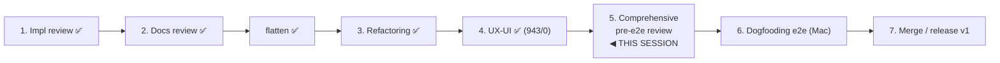

# Handoff — Comprehensive pre-e2e review (PRE-MERGE step 5)

**Status**: Self-contained launcher for the **final whole-system review of decentralized-config
v1**, the last gate **before** the Mac dogfooding e2e (roadmap "Pre-merge review cycle" step 5).
**NOT started.** Runs in its **own clean session** after maintainer go-ahead. Branch
`feat/vault/decentralized-config`, commits **LOCAL** (pushed from the maintainer's Mac).
Baseline **943/0** (`CCO_ALLOW_HOST_RESOLVE=1 ./bin/test`). Written 2026-06-27, after the UX-UI
review (step 4, ADR-0029) shipped.

> **One-line goal.** Before risking a live e2e, sweep the *whole* decentralized-config v1 one
> last time for **(a)** latent bugs/issues, **(b)** divergence between the code and the
> ADRs/design, **(c)** stale or incoherent user guides / CLI reference, and **(d)** a complete,
> correct **migration** path for both audiences who will run it. Produce one review record;
> resolve findings cluster-by-cluster with the maintainer; **merge nothing** until after the e2e.

This is **not** a new development phase — the build is complete (Phases 0–5) and the four
prior reviews are done. It is a **confidence gate**: a final, code-grounded, read-only pass that
de-risks the e2e and the v1 merge. It deliberately **re-runs the implementation- and
documentation-review lenses over the entire v1 surface at once** (not phase-by-phase) and adds a
dedicated **migration** dimension.

---

## 1. Reading order & source-of-truth precedence

Open by reading the source of truth, then the recurring playbooks, then the prior review records
(so you do not re-litigate settled findings):

1. `../../foundation/design/guiding-principles.md` — **P1–P18** (the governing law).
2. `decisions/` — **ADRs 0005–0029** (decision history; forward-annotations matter).
3. `design.md` — the living design (§2 layout/buckets · §3 index · §4 sync · §6 domains ·
   **§7 command surface** · §9 teardown/migration · §11 test plan).
4. `requirements.md` — FR-level contracts.
5. `../../engineering/guides/review-playbooks.md` — **§1 implementation review** + **§2
   documentation review** (this session runs both lenses, plus migration).
6. The recurring project playbooks (method + Transitional Registry + doc-lifecycle):
   [`implementation-review-handoff.md`](implementation-review-handoff.md) ·
   [`documentation-review-handoff.md`](documentation-review-handoff.md).
7. Prior review records — do **not** re-raise their resolved findings:
   `reviews/18-06-2026-impl-readiness-review.md` (design-readiness, 58 findings) ·
   `reviews/26-06-2026-migration-impl-review.md` (migration correctness; **H7 latent bug** lesson) ·
   `reviews/27-06-2026-refactoring-review.md` · `reviews/27-06-2026-ux-ui-review.md` (+ ADR-0029).
8. `.claude/rules/` — `documentation-lifecycle.md` (history vs living vs archived; design-intent-now
   vs shipped-behavior-at-cutover), `update-system.md` (changelog/migration rules), `git-workflow.md`.

**Precedence on conflict**: guiding-principles → ADRs → design → requirements → shipped docs.

---

## 2. The four review dimensions (the maintainer's brief)

Each dimension is **read-only** with respect to production code until the maintainer approves a
fix. Ground every finding in `file:line`.

### D1 — Bug-free (no latent issues/regressions)

- Sweep `bin/cco` + `lib/*.sh` + `migrations/**` for latent bugs the unit suite would not catch:
  reader/writer path mismatches (the **H7** class — a writer and its reader disagreeing on a path,
  e.g. `memory` vs `session/memory`), bash 3.2 traps (unguarded `set -u` array expansions,
  `local x=$(...)` masking exit codes), non-idempotent state mutations, `die` paths that leak temp
  files/secrets, TOCTOU on the index/STATE writes, and the `CCO_*` test-seam leaking into prod.
- Cross-check the **Transitional Registry** (see `implementation-review-handoff.md`): every
  transitional shim must be retired — no central-layout (`$PROJECTS_DIR`/`CCO_*_DIR`), no `@local`,
  no `manifest.yml`/`cmd-vault.sh` remnants, no schema-bridge readers.
- **Pass** = no unresolved 🔴/blocker; each survivor adversarially verified (try to *refute* it).

### D2 — Design adherence (and doc-vs-code arbitration)

- For each ADR decision and principle, confirm the code implements it. Where code and a doc
  disagree, **decide the direction** explicitly (this is the maintainer's key ask):
  - *Stale doc* → the code is correct per the ADR/principle; the **doc** is fixed (living-rewrite,
    or history forward-annotation per `documentation-lifecycle.md`).
  - *Deviation from ADR* → the **code** drifted from a settled decision; route a code fix (or, if
    the drift is actually a better decision, open a new ADR — next free **0030** — and supersede).
- Watch the high-leverage invariants: 4-bucket taxonomy (CONFIG/STATE/CACHE/DATA), coordinate-per-
  unit + the machine-local index, P13 project≠pack asymmetry, P5/P6 config-vs-internal, the sharing
  2×2, ADR-0028 flat `~/.cco/.claude`, ADR-0029 (one list surface, confirm contract, verb symmetry).
- **Pass** = every mismatch has an explicit *doc-stale* or *code-deviation* verdict + a routed fix.

### D3 — User guides & CLI reference coherence

- Verify `docs/users/` — the guides **and** `reference/cli.md` — describe **exactly what ships**
  and the decentralized model: every documented command/flag exists and behaves as written; every
  shipped command/flag is documented; examples run; no vault/profile/central-layout language; the
  redirect stubs, the `-y/--yes/--force` confirm contract, `cco list [<kind>]`, `cco tag remove`,
  `cco template update/validate`, and the demoted `cco path` are all reflected (ADR-0029).
- Cross-check the user guides against the cli.md and against the code — a guide must not promise a
  workflow the code no longer supports. Surface docs to **update / correct / archive**.
- **Pass** = `docs/users/` is coherent with the code and the model; no shipped-behavior lag.

### D4 — Migration completeness (two audiences)

The single most e2e-critical dimension. Verify the update path **end to end** for **both** people
who will run it:

- **Audience A — a new user pulling the update from `main`.** They already have a working install
  on an older schema. On the next `cco update` they must converge cleanly:
  - the **eager global migration** (ADR-0025) populates/repoints `~/.cco`;
  - the `migrations/global/` chain (001→015, note **no 008**) and `migrations/project/` chain
    (001→013) each run **in order**, **idempotently**, gated by `schema_version`;
  - the **015 flatten** (`~/.cco/global/.claude` → `~/.cco/.claude`, ADR-0028) converges from
    fresh / legacy-vault / mid-update states, with the `_cco_flatten_global_claude` self-heal
    reachable from **both** migration 015 and `_cco_first_run` (the bug dogfooding already caught);
  - `changelog.yml` (through #18) notifies every additive change; no migration is silently skipped.
- **Audience B — the maintainer-dev testing the feature branch in preview (the upcoming e2e).**
  A legacy-vault user on the dev machine: J0 backs the vault up (raw tar, any command), then
  `cco init --migrate <project>` (lazy, per-project, ADR-0021) hydrates `<repo>/.cco/`; the legacy
  vault is removed **only** after merge + validation. Verify backup integrity (inactive-profile
  secrets/memory recovered — the BL1/BL2 lesson), no data loss, and re-runnability.
- Reconcile against `P2-dogfooding-validation.md` (the e2e plan): every migration claim this review
  makes should have a corresponding e2e check, and vice-versa — flag gaps either way.
- **Pass** = both audiences converge idempotently with no data loss; the migration chain is
  complete, ordered, and changelog-announced; the e2e plan covers what this review found.

---

## 3. Method — multi-agent, read-only, adversarial, cluster-resolved

This is a broad surface, so run it as a **multi-agent review** (the precedent of the two big prior
reviews — `18-06-2026-impl-readiness` and `26-06-2026-migration-impl`), not a single linear pass:

1. **Fan out** parallel read-only lenses — at least one per dimension (D1–D4), and split D1/D2 by
   subsystem (resolve/index · sync · update/migration engine · sharing/packs/templates · llms ·
   tags/config · start/compose) so coverage is exhaustive.
2. **Adversarially verify** every candidate finding before it counts — spawn skeptics prompted to
   *refute* it (default to refuted if uncertain); kill plausible-but-wrong findings. This is the
   lesson that keeps these reviews honest.
3. **Dedup + classify** survivors by severity (blocker / high / med / nit) and, for D2, by
   *doc-stale* vs *code-deviation*.
4. **Completeness critic** — a final agent asks "what subsystem/claim/migration step went
   unchecked?"; its gaps become the next round.
5. **Resolve cluster-by-cluster with the maintainer** (the established pattern): present
   options + a recommendation per cluster → decide → persist to ADR/design/docs or fix code →
   commit (atomic, LOCAL, green per step). Code-ground every claim.

> If the maintainer opts into orchestration ("ultracode" / "use a workflow"), this maps cleanly
> onto a fan-out→verify→synthesize Workflow. Otherwise run the lenses as sequential `Agent`
> sub-tasks. Either way: **read-only first, fixes only after maintainer approval.**

---

## 4. Scope

**In scope** (the whole v1):
- Code: `bin/cco`, `lib/**`, `migrations/**`, `defaults/**`, `templates/**`, `proxy/**`, `config/**`.
- Tests: `tests/**` — confirm they encode the design/requirements and do **not** endorse wrong
  behavior or hide false positives (review-playbooks §1).
- Docs: `docs/users/**` (D3) and `docs/maintainers/**` (D2 living design + ADRs coherence).
- The migration chain + `changelog.yml` + `P2-dogfooding-validation.md` (D4).

**Out of scope / do not re-open**:
- Settled design decisions (ADRs 0005–0029) — unless a code-grounded *deviation* forces a new ADR.
- Findings already resolved in the four prior reviews (read their resolution logs first).
- `docs/archive/**` (frozen, history) and post-v1 deferrals (index namespacing, `cco config protect`
  helper, Case-C `project internalize`, cross-PC memory sync) — note, don't fix.
- The actual e2e run — that is **step 6** (`P2-dogfooding-validation.md`), after this review.

---

## 5. Output & working agreement

- **Review record**: `reviews/<DD-MM-2026>-pre-e2e-comprehensive-review.md` (stamp the run date;
  do not reuse 27-06 — it already has two records). A **decision-history** doc per
  `documentation-lifecycle.md`: method/inputs, findings table (sev · dimension · file:line ·
  disposition), the doc-stale-vs-code-deviation verdicts, and a Resolution log.
- **Fixes**: only after maintainer approval, per cluster. Atomic **LOCAL** commits on
  `feat/vault/decentralized-config` (never `main`/`develop` — `git-workflow.md`); conventional
  messages + the `Co-Authored-By: Claude` trailer; **do not push** (the maintainer pushes from the
  Mac). `CCO_ALLOW_HOST_RESOLVE=1 ./bin/test` green per step; **baseline 943/0**.
- **Changelog/migration**: per `update-system.md` — a user-visible additive fix → `changelog.yml`
  (next id **19**); any new file rename/move/policy change → a migration. A pure doc/coherence fix
  needs neither.
- **Next free ADR = 0030** (open one only if D2 surfaces a genuine code-deviation that the
  maintainer decides to *bless* rather than revert).
- **Merge nothing.** This gate precedes the e2e; the legacy vault is removed only after merge +
  validation. On completion, flip roadmap **step 5 → done** and hand off to **step 6 dogfooding**.

---

## 6. Reference paths

- Governing law: `../../foundation/design/guiding-principles.md` (P1–P18).
- Decisions: `decisions/` (ADRs 0005–0029; next free 0030).
- Living design: `design.md` (esp. §7 command surface, §9 migration, §11 test plan) · `requirements.md`.
- Method: `../../engineering/guides/review-playbooks.md` §1+§2 · `implementation-review-handoff.md` ·
  `documentation-review-handoff.md`.
- Prior records: `reviews/18-06-2026-impl-readiness-review.md` · `reviews/26-06-2026-migration-impl-review.md` ·
  `reviews/27-06-2026-refactoring-review.md` · `reviews/27-06-2026-ux-ui-review.md`.
- Migration: `migrations/global/` (001–015, no 008) · `migrations/project/` (001–013) ·
  `migrations/{pack,template}/` · `changelog.yml` (through #18) · `P2-dogfooding-validation.md`.
- User docs (D3): `docs/users/reference/cli.md` + `docs/users/**` guides.
- Roadmap: `../../roadmap.md` → "Pre-merge review cycle" step 5.
- Rules: `.claude/rules/{documentation-lifecycle,update-system,git-workflow,workflow}.md`.

---

*Generated with Claude Code*
