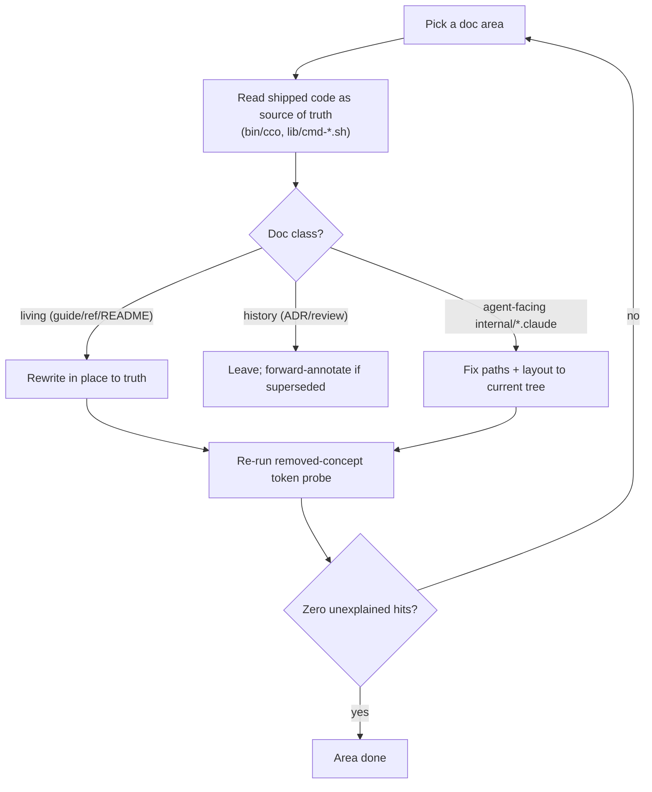
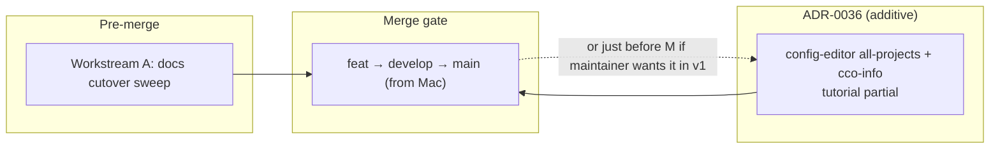

# Handover — Pre-merge/release: docs & CLI-reference accuracy review + config-editor/tutorial access design

> **Created**: 2026-06-29 · **Branch**: `feat/vault/decentralized-config` (commits local, pushed from Mac)
> **For**: the next session, before the v1 merge to `develop`/`main` (roadmap step 7).
> **Status going in**: v1 build-complete, host e2e validated, suite **1010/0**. No code blockers.
> The `cco sync` UX refinement just landed (ADR-0035). This handover scopes the **remaining
> pre-merge work**: bring all shipped-behavior docs to truth, then decide the config-editor/tutorial
> access design.

This is a coordination artifact, not a design doc. The authoritative design lives in
`design.md`, the `decisions/` ADRs, and the per-area `docs/maintainers/**/design/` trees.

---

## 0. Why now (lifecycle framing)

Per `.claude/rules/documentation-lifecycle.md`, **shipped-behavior docs** (README, user guides, the
CLI reference, the agent-facing `internal/*/​.claude/` instructions) are updated *at the phase that
makes the change true, or in a consolidated cutover sweep* — **never ahead of the code**. v1 is now
shipped, so this is exactly that **cutover sweep**: rewrite living docs to the implemented
decentralized-config truth, in place, **no "SUPERSEDED" banners** (history lives in git; ADRs/reviews
stay as the immutable decision trail and are only *forward-annotated*).

Accuracy matters doubly here because **the docs are a runtime dependency**: the built-in
**tutorial** and **config-editor** sessions mount `docs/` read-only and instruct their agents to
consult specific paths. Stale reference = a built-in agent gives wrong guidance. (Concrete proof
below — the config-editor CLAUDE.md already points at pre-reorg paths.)

---

## 1. Workstream A (PRIMARY) — docs / guides / CLI-reference accuracy review

**Goal**: every user-facing and agent-facing doc accurately reflects the implemented
decentralized-config model. The CLI reference (`docs/users/reference/cli.md`) and the project.yml
reference must be **exact** — they are cited by the built-in agents and drive development.

### 1.1 Scope (the doc surface)

- **User docs** (`docs/users/**`, ~30 files): `reference/cli.md`, `configuration/reference/` (project.yml),
  `configuration/guides/` (project-setup, configuration-management), `foundation/guides/`,
  `integration/guides/`, `packs/guides/`, `security/guides/`, `internal-projects/guides/`,
  `environment/guides/`, and the top-level `docs/users/*.md` (README/landing).
- **Repo-root `README.md`** and **`CLAUDE.md`** (the latter is largely current; spot-check the command
  list against `bin/cco`).
- **Agent-facing internal configs** (these ARE docs the built-ins consume):
  - `internal/config-editor/.claude/CLAUDE.md` + `.claude/rules/config-safety.md`
  - `internal/tutorial/.claude/CLAUDE.md`
- **Maintainer living docs** already mostly reconciled (`design.md` is current as of ADR-0035); spot-check
  the per-area `design/` trees and the `internal-projects/{config-editor,tutorial}/design` docs.

### 1.2 Known-stale seed (already found — start here, do NOT treat as exhaustive)

A removed-concept token probe over `docs/users/` (verify each — some are legitimate, e.g. shell/git
"profile"):

| Token | Files | Likely action |
|---|---|---|
| `vault` | 3 | Removed concept → "personal store `~/.cco`" / "committed `<repo>/.cco/`". |
| `@local` | 2 | Removed → the STATE index (`cco resolve`/`cco path`). |
| `manifest.yml` | 2 | Removed (ADR-0012) → structure-based sharing. |
| `global/.claude` | 4 | Flattened (ADR-0028) → `~/.cco/.claude/`. |
| `profile` | 7 | **Review individually** — profile machinery is gone, but some hits are unrelated. |
| `user-guides/` | 1 | Pre-reorg path → `users/...` tree. |

**Agent-facing stale refs (high priority — they mislead the built-in agents at runtime):**
- `internal/config-editor/.claude/CLAUDE.md`:
  - Layout diagram shows `~/.cco/global/.claude/` → must be **`~/.cco/.claude/`** (ADR-0028 flatten).
  - The "Documentation Reference" table paths are **pre-reorg**: `user-guides/project-setup.md`,
    `reference/cli.md`, etc. Docs mount at `/workspace/cco-docs` = repo `docs/`, so paths must be the
    reorg'd `users/...` (e.g. `users/reference/cli.md`,
    `users/configuration/guides/project-setup.md`, `users/configuration/reference/<project-yaml>.md`).
    Re-derive every row against the real tree.
- `internal/tutorial/.claude/CLAUDE.md`: same probe (doc-path refs + any `global/.claude`/`vault`).

### 1.3 Method

1. **Per area, code-grounded**: open the shipped code (`bin/cco`, `lib/cmd-*.sh`) as the source of
   truth for each command/flag/path, then reconcile the doc to it. The CLI surface is large — verify
   command names, flags, default behaviors (esp. the freshly changed `cco sync`, `cco resolve`,
   `cco init/join/forget`, `cco list`, `cco config`, `cco update`).
2. **Living docs rewritten in place** to truth; **ADRs/reviews left as history** (forward-annotate only).
3. **No banners** inside living docs; let git hold the history.
4. **Fix the agent-facing configs first** (§1.2) — smallest surface, highest runtime impact.
5. Re-run the token probe after edits; aim for zero unexplained removed-concept hits.

### 1.4 Definition of done (Workstream A)
- Token probe over `docs/users/` + `internal/*/.claude/` returns only explained hits.
- `cli.md` and the project.yml reference match `bin/cco`/`lib/` exactly (every command, flag, default).
- Built-in config-editor/tutorial CLAUDE.md doc tables resolve to real `/workspace/cco-docs/...` paths.
- README + landing pages describe the in-repo model (no vault/@local/manifest/profile residue).
- Suite still green (docs-only changes shouldn't move it; agent-config edits don't either).

---

## 2. Workstream B (DESIGN — decide whether to implement pre-merge) — config-editor & tutorial access scope

The maintainer raised: config-editor *"should become an internal project, like tutorial"* — **it
already is** (`internal/config-editor/`, reserved name, generated at start, ADR-0027). The real open
question is its **access scope**: today it can edit `~/.cco` (global) + **one** target project; the
maintainer wants it to **edit any project's config + global, with access to all projects' repos and to
"cco info"**. Tutorial should get a *partial* version of this.

### 2.1 Current state (ADR-0027, code-grounded in `lib/cmd-start.sh:42-173`)

| Aspect | Today |
|---|---|
| Instantiation | Reserved name; `_setup_internal_config_editor` refreshes `.claude/` + **generates** `project.yml` at start (host paths injected via in-process mount override, never committed — AD3/G8). |
| Mounts | `~/.cco` **rw** → `/workspace/cco-config`; `docs/` **ro** → `/workspace/cco-docs`; **project mode** (`--project <name>` or cwd-hosted) adds **that one** project's `<repo>/.cco` **rw** → `/workspace/<name>-config`. |
| Edit-protection | Exempt (`is_internal=true`) — the sanctioned agentic edit path (ADR-0027 D3). |
| cco "info" (index/tags/remotes/DATA/STATE) | **Not mounted** by design — machine-local, "managed only via `cco …`, never hand-edited". |
| cco CLI in-container | **Host-only** — cannot run inside; the agent prints host commands. |
| Docker socket | `mount_socket: false`. |
| Tutorial | `~/.cco` **ro** + `docs/` **ro**; `repos: []`; no project mounts. |

### 2.2 Desiderata (maintainer)
- Edit **any** project's config (not just one) + global, in one session.
- Access to **all repos of all projects**.
- Access to **cco info** (project list, tags, remotes, index state) for accurate assistance.
- Tutorial: a *partial* version (likely read access to project list/info, still read-only on config).

### 2.3 Design dimensions & options (to resolve with the maintainer)

**D-α — All-projects access.** Enumerate the STATE index and mount each **resolved** member's
`<repo>/.cco` (skip unresolved). Options:
- (a) **Opt-in flag** `cco start config-editor --all` (default stays single-target/global) — least
  surprising, bounded blast radius. *(recommended default)*
- (b) **Always all** — most convenient, but a crowded workspace and a large rw surface every session.
- (c) **Multi-target** `--project a --project b` — explicit subset.
Note: editing project X's `project.yml` does not propagate; the agent must tell the user to `cco sync`
(host-only) — consistent with the decentralized model.

**D-β — "cco info" exposure** (the index/DATA are deliberately not hand-editable). Options:
- (a) **Generated read-only snapshot** at start (dump `cco list` / project→path / tags / remotes into a
  file under the session, e.g. `/workspace/cco-info/…`) — respects "managed via cco", zero write risk.
  *(recommended)*
- (b) **Read-only mount** of STATE index + DATA registries — live but raw; still must stay read-only.
- (c) **cco read-subset in-container** — requires cco + deps in the image and the buckets mounted;
  biggest change, probably post-v1.

**D-γ — Safety.** Rw access to *all* project configs + global is a wide surface. Keep/extend
`config-safety.md`: explain-before-write, diff-before-overwrite, never secrets, confirm destructive;
consider a per-project "touched" summary at session end with the exact `cco sync`/`cco config save`
commands to run.

**D-δ — Tutorial partial.** Likely just D-β(a) (read-only info snapshot) + keep `~/.cco` ro; no project
config rw. Teaching stays read-only (its whole point vs config-editor).

**D-ε — Workspace layout / naming.** With N project mounts, settle the target paths
(`/workspace/<name>-config`) and avoid collisions with `cco-config`/`cco-docs`/`cco-info`.

### 2.4 Open questions for the maintainer
1. All-projects = opt-in flag (D-α a) or always (b)? Default scope when neither `--project` nor `--all`?
2. cco-info via generated snapshot (D-β a) or read-only mount (b)? Which fields (list, tags, remotes,
   index paths, divergence/sync-state)?
3. Does the agent need any **write** to cco-internal state, or is read-only sufficient (everything
   mutating goes through host `cco …`)?
4. Tutorial: read-only info snapshot only, or more?
5. **Sequencing**: implement pre-merge, or land docs (Workstream A) now and design+build B as a
   follow-up ADR right after merge? (B is additive — new flag + extra mounts + a snapshot generator —
   so it does **not** block the merge.)

### 2.5 Recommendation on sequencing
Do **Workstream A first** (it's the actual pre-merge gate and the maintainer's stated priority).
Treat **Workstream B as a fresh ADR (next free = 0036)**: it's additive and self-contained, so it can
land just before or just after the merge without holding up v1. If implemented pre-merge, it needs:
generated-snapshot + all/multi-target mount logic in `_setup_internal_config_editor`, a new
`--all`/`--project` repeat in the `config-editor` arm of `cmd_start`, doc updates, and tests
(`tests/test_config_editor.sh`). Keep it out of the Workstream-A commits.

---

## 3. Reading order / entry points
1. This handover.
2. `.claude/rules/documentation-lifecycle.md` (the doc-class rules governing Workstream A).
3. `docs/maintainers/roadmap.md` "Current status" (v1 ready-to-merge; deferral list).
4. For B: `decisions/0027-config-editor-builtin-and-edit-protection.md` +
   `docs/maintainers/internal-projects/config-editor/design/design-config-editor.md` +
   `lib/cmd-start.sh:42-207` (the config-editor/tutorial setup + dispatch).
5. `bin/cco` + `lib/cmd-*.sh` as the source of truth for every CLI claim in the docs.

## 4. Risks & non-goals
- **Non-goal**: re-running the big multi-agent reviews (impl-readiness, pre-e2e) — already done.
- **Risk**: over-editing — do not "improve" design decisions during a doc sweep; reconcile to the
  *shipped* behavior, raise genuine design gaps separately.
- **Risk (B)**: widening config-editor's rw surface without the safety guardrails (D-γ).
- **Watch**: the cutover migration (legacy vault → in-repo) is the one non-deterministic risk on a real
  upgrade; legacy-vault code removal stays **after** merge+validation (pre-merge principle).

## 5. Merge gate (definition of done for the session)
- Workstream A done (§1.4) and committed.
- Workstream B: either an **ADR-0036 decision** (if implementing pre-merge, code+tests+docs green) or a
  **logged decision to defer** to immediately-post-merge (roadmap note).
- Suite green; roadmap + `design.md` status reflect the final pre-merge state.
- Hand the merge (`feat → develop`, then `develop → main`) to the maintainer on the Mac (commits are
  local; cco never pushes from the container).
