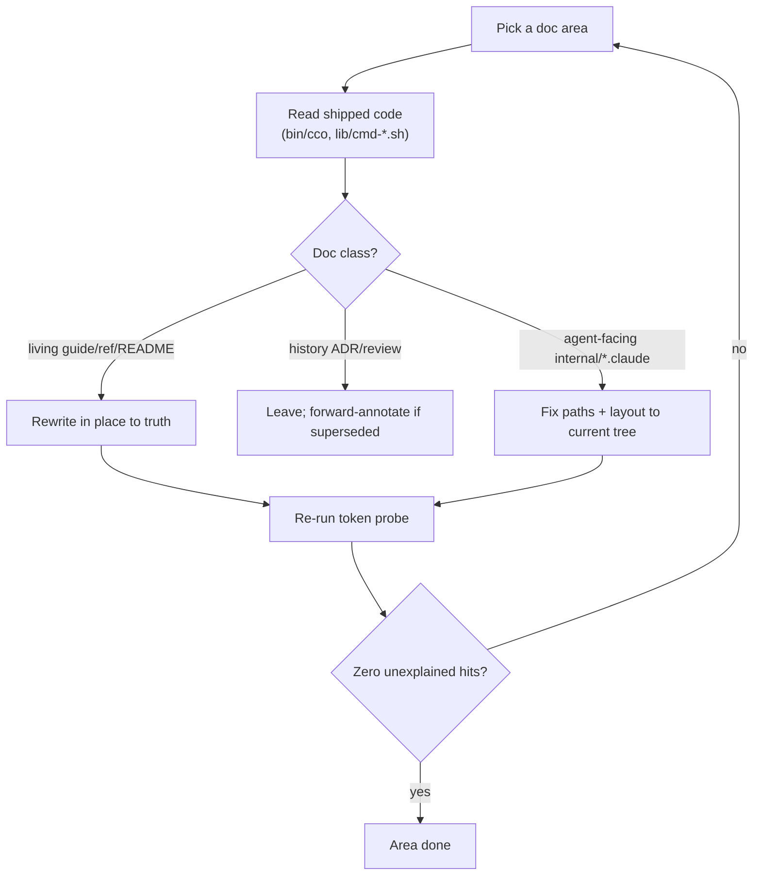

# Handover A (PRE-MERGE) — docs & CLI-reference accuracy cutover sweep

> **✅ DONE (2026-06-29)** — merge gate cleared. Agent-facing doc tables (config-editor +
> tutorial) remapped to the `users/<domain>/<type>/` tree and the store layout flattened to
> `~/.cco/.claude/`; `cli.md` code-grounded against `bin/cco` + `lib/cmd-*.sh` (0 stale, 0 wrong;
> 11 undocumented flags added across init/start/new/update/clean); removed-concept token probe
> over `docs/users/` + `internal/*/.claude/` + README + CLAUDE.md returns only explained hits
> (migration context / removal affirmations / real `defaults/global/.claude/` source paths);
> stale doc pointers in shipped scaffolds (`templates/**`, `defaults/global/setup*.sh`) fixed;
> roadmap status flipped. Suite **1010/0**. **Next: maintainer merges `feat → develop` (from Mac).**

> **Created**: 2026-06-29 · **Branch**: `feat/vault/decentralized-config` (commits local, pushed from Mac)
> **When**: NOW, before the v1 merge to `develop` (roadmap step 7). This is the **merge gate**.
> **Status going in**: v1 build-complete, host e2e validated, suite **1010/0**, no code blockers.
> **Siblings**: Handover B (`config-editor-access-design-handoff.md`, post-merge/develop) ·
> Handover C (`../../engineering/npm-packaging-distribution-handoff.md`, release track).

Coordination artifact, not a design doc. Authoritative design = `design.md`, the `decisions/` ADRs,
and the per-area `docs/maintainers/**/design/` trees.

---

## 0. Why now (lifecycle framing)

Per `.claude/rules/documentation-lifecycle.md`, **shipped-behavior docs** (README, user guides, the CLI
reference, the agent-facing `internal/*/​.claude/` instructions) are updated *at the phase that makes the
change true, or in a consolidated cutover sweep* — **never ahead of the code**. v1 is now shipped, so
this is that **cutover sweep**: rewrite living docs to the implemented decentralized-config truth, in
place, **no "SUPERSEDED" banners** (git holds history; ADRs/reviews stay immutable, forward-annotated only).

Accuracy matters doubly: the docs are a **runtime dependency**. The built-in **tutorial** and
**config-editor** sessions mount `docs/` read-only and tell their agents to consult specific paths.
Stale reference = a built-in agent gives wrong guidance (proof in §1.2).

## 1. Scope — the doc surface

- **User docs** (`docs/users/**`, ~30 files): `reference/cli.md`, `configuration/reference/` (project.yml),
  `configuration/guides/` (project-setup, configuration-management), `foundation/guides/`,
  `integration/guides/`, `packs/guides/`, `security/guides/`, `internal-projects/guides/`,
  `environment/guides/`, and the `docs/users/*.md` landing pages.
- **Repo-root `README.md`** and **`CLAUDE.md`** (the latter mostly current; spot-check its command list
  against `bin/cco`).
- **Agent-facing internal configs** (docs the built-ins consume — HIGHEST runtime impact, smallest surface):
  - `internal/config-editor/.claude/CLAUDE.md` + `.claude/rules/config-safety.md`
  - `internal/tutorial/.claude/CLAUDE.md`
- **Maintainer living docs**: `design.md` is current (through ADR-0035); spot-check per-area `design/`
  trees + `internal-projects/{config-editor,tutorial}/design`.

### 1.2 Known-stale seed (found already — start here; NOT exhaustive)

Removed-concept token probe over `docs/users/` (verify each — some `profile` hits are legitimate):

| Token | Files | Likely action |
|---|---|---|
| `vault` | 3 | → "personal store `~/.cco`" / "committed `<repo>/.cco/`". |
| `@local` | 2 | → the STATE index (`cco resolve`/`cco path`). |
| `manifest.yml` | 2 | Removed (ADR-0012) → structure-based sharing. |
| `global/.claude` | 4 | Flattened (ADR-0028) → `~/.cco/.claude/`. |
| `profile` | 7 | **Review individually** — profile machinery gone; some hits unrelated. |
| `user-guides/` | 1 | Pre-reorg path → `users/...` tree. |

**Agent-facing stale refs (do first):**
- `internal/config-editor/.claude/CLAUDE.md`:
  - Layout diagram shows `~/.cco/global/.claude/` → must be **`~/.cco/.claude/`** (ADR-0028).
  - "Documentation Reference" table paths are **pre-reorg** (`user-guides/project-setup.md`,
    `reference/cli.md`, …). Docs mount at `/workspace/cco-docs` = repo `docs/`, so every row must be the
    reorg'd `users/...` path (e.g. `users/reference/cli.md`,
    `users/configuration/guides/project-setup.md`, `users/configuration/reference/<project-yaml>.md`).
    Re-derive each row against the real tree.
- `internal/tutorial/.claude/CLAUDE.md`: same probe (doc-path refs + `global/.claude`/`vault`).

## 2. Method

1. **Per area, code-grounded**: `bin/cco` + `lib/cmd-*.sh` are the source of truth for every
   command/flag/path; reconcile the doc to the code. Pay special attention to the recently changed
   surface: `cco sync` (ADR-0035), `cco resolve`, `cco init`/`join`/`forget`, `cco list`, `cco config`,
   `cco update`.
2. **Living docs rewritten in place** to truth; **ADRs/reviews left as history** (forward-annotate only).
3. **No banners** inside living docs.
4. **Fix agent-facing configs first** (§1.2).
5. Re-run the token probe after edits; aim for zero unexplained removed-concept hits.

## 3. Definition of done (the merge gate)
- Token probe over `docs/users/` + `internal/*/.claude/` returns only explained hits.
- `cli.md` and the project.yml reference match `bin/cco`/`lib/` exactly (every command, flag, default).
- Built-in config-editor/tutorial CLAUDE.md doc tables resolve to real `/workspace/cco-docs/...` paths.
- README + landing pages describe the in-repo model (no vault/@local/manifest/profile residue).
- Suite green (docs-only + agent-config edits shouldn't move it).
- `design.md`/`roadmap.md` status reflect the final pre-merge state.
- **Then** hand the merge `feat → develop` to the maintainer (Mac); cco never pushes from the container.

## 4. Risks & non-goals
- **Non-goal**: re-running the big multi-agent reviews (already done); "improving" design decisions during
  a doc sweep (reconcile to *shipped* behavior; raise genuine gaps separately).
- **Watch**: the cutover migration (legacy vault → in-repo) is the one non-deterministic upgrade risk;
  legacy-vault code removal stays **after** merge+validation (pre-merge principle).
