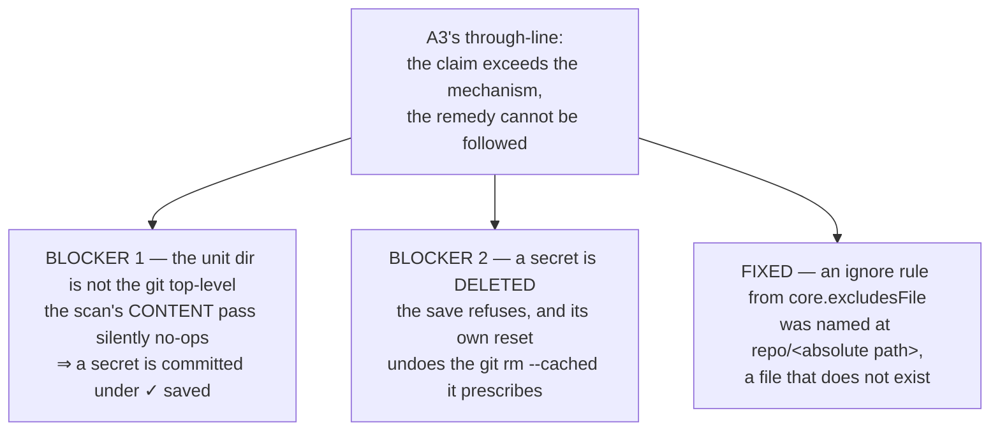

# Implementation review — the whole `save`/`status`/`history` cycle (six verbs, both stores)

> **Historical record.** Point-in-time review of branch `feat/config/save-and-history`
> (26 commits ahead of `develop`), run 2026-08-26 against
> [ADR-0038](../decisions/0038-project-config-versioning.md) D1…D8 + A1 (D9…D12) +
> A2 (D13…D15) + A3 (D16…D19) and
> [the living design](../design/design-project-config-versioning.md)
> §2.4 · §2.6 · §5b · §6.1/6.2/6.2b/6.2c/6.2d · §6.4 · §7.
>
> Scope as the maintainer framed it: **the finished cycle, not the A3 delta** — six
> verbs, both stores. A3 got particular attention because it is the unreviewed part.

## Verdict

**REVIEW NEEDED — do not open the merge gate yet.** One objective defect was fixed in
place; **two blockers** are escalated because each remedy is a decision the maintainer
has not made.

Both blockers are **the same failure A3 exists to abolish**, in two states A3 did not
look at:

> *a message that claims more than its mechanism proves, and a remedy the user cannot
> follow* — plus, in one of them, a `✓ saved` over a committed secret.



## Fixed in place

### `bug` — `lib/cmd-project-save.sh:_project_ignore_rule_for` named the rule at a path that does not exist

D16 requires the `excluded` refusal to name *the rule that actually fires*, **"at a
path the user can open"**. `git check-ignore -v` reports an **in-repo** source relative
to the repo root — but a rule inherited from **`core.excludesFile`** (the user's global
gitignore, a very common setup) comes back as an **absolute** path. The repo-name
prefix was applied unconditionally, so it produced:

```
.cco/project.yml is ignored by the rule *.yml (app//home/you/.gitignore_global:1)
```

`app//home/you/…` is not a file. That is D16's own requirement broken and D13's
unfollowable remedy reappearing — one *source of rules* over, rather than one screen
over.

**Realignment** (smallest that removes the defect; no new wording, no behaviour
choice): an absolute source is printed as git gave it, since it is already openable;
an in-repo source keeps the repo prefix that disambiguates a root `.gitignore` from a
nested one.

**Regression test**: `tests/test_project_save.sh::test_project_save_names_a_global_ignore_rule_at_a_path_that_exists`.

⚠ The discriminating assertion is the **negative** one (`app/$HOME/…` absent): the
broken string *contains* the correct path as a substring, so `assert_output_contains`
alone passes on the defect. **Oracle proven**: reverting the fix in place makes exactly
this test fail (`53 passed, 1 failed`) while its sibling `…_names_the_rule_that_actually_fires`
still passes, so the fix does not regress the in-repo path.

## REVIEW NEEDED

### BLOCKER 1 — when `<repo>/.cco` is not at the git top-level, the secret scan's content pass silently does nothing and the save reports `✓ saved`

**What is suspended**: the merge gate for this cycle.

**Evidence** — measured, with a discriminating control (same secret, same command):

| Topology | Result |
|---|---|
| `.cco/project.yml` **at** the git top-level | `✗ refusing to save — … (content matches at line 1)`, rc 1 |
| `.cco/project.yml` **one directory down** (`mono/svc/.cco/…`) | `✓ saved svc/.cco @ 7504a11`, rc 0 — and `git show HEAD:svc/.cco/claude/rules/leak.md` prints `API_KEY=sk-ant-…` |

**Mechanism.** `_resolve_find_unit_dir` returns the nearest ancestor holding
`.cco/project.yml`; nothing requires it to be the git top-level. Every *pathspec* is
then correct (pathspecs are cwd-relative, and `git -C "$root"` makes cwd the unit dir),
but every *output path* is wrong, because `git status --porcelain`, `git diff --cached
--name-only`, `git ls-files` and `git show --name-only` all report **repo-root-relative**
paths. Concretely:

- `_secret_scan_paths` tests `[[ -f "$root/$f" ]]` → `mono/svc/svc/.cco/…` → false →
  **the content pass is skipped for every file**, on both save gates. Only the
  filename pass survives (it matches on suffix).
- `_status_changed`'s strip prefix never matches, so `cco project status` lists
  `svc/.cco/project.yml` and `cco project status --full` prints **no diffs at all** —
  the `--full` half of the verb is silently dead.
- `_project_tracked_ignored` pipes root-relative paths into a cwd-relative
  `check-ignore --stdin`, so D13's tracked-file finding never fires.
- `_history_parts` cannot strip, so D6's changed-parts column degrades to raw paths.

**Why it is escalated, not fixed**: the defect is unambiguous, the remedy is not. At
least two are defensible and both are user-facing —

1. **Support it**: anchor the path arithmetic on `git rev-parse --show-toplevel` and
   carry the unit dir's prefix through the shared renderers (touches
   `cmd-project-save.sh` **and** `config-read.sh`, i.e. both stores' renderers).
2. **Refuse it**: `save`/`status`/`history` die when the unit dir is not the git
   top-level, naming the constraint. Cheaper, safer, and arguably the honest answer
   for a model whose whole vocabulary is `<repo>/.cco`.

Whichever is chosen, the pair (flat refuses / nested refuses) must be pinned as a
**discriminating** test — a nested-only test would pass under option 2 for the wrong
reason.

**What unblocks it**: the maintainer picks 1 or 2.

### BLOCKER 2 — a save that *removes* a secret is refused, and the refusal undoes the remedy it prints

**What is suspended**: the merge gate for this cycle.

**Evidence** — measured on the project store, in the state **D13 deliberately makes
reachable** (a `.cco/secrets.env` tracked from a hand-made commit):

1. The user deletes the secret — the single most desirable action — and runs
   `cco project save`. It **refuses**: *"a secret-like file is staged under app/.cco:
   `.cco/secrets.env` (filename matches secrets.env)"*. Nothing with secret content is
   being added; a **deletion** is.
2. The remedy is unfollowable twice over: *"keep the real value in
   `app/.cco/secrets.env`, which is gitignored"* — they just deleted it — and
   *"Untrack it with `git rm --cached`"*, which is what the deletion already achieves.
3. **The refusal reverts the remedy.** Following it literally (`git rm --cached -- .cco/secrets.env`)
   and retrying refuses again, and the refusal's `git reset -q -- .cco` restores the
   index entry the user just removed. Measured: the follow-up `git commit` then reports
   `no changes added to commit`. The verb cannot be used to reach the state it demands.

**Both stores.** The twin behaves the same way: with a committed `~/.cco/packs/demo/app.env`,
deleting it makes `cco config save` refuse with *"Move the secret into
`~/.cco/secrets.env`"*, and `cco config status` previews that same refusal at rc 0. On
`~/.cco` the reset is the bare `git reset`, so it unstages everything.

**How it got here, honestly**: `_secret_scan_staged` reads `git diff --cached
--name-only`, which lists deletions, and `config-read.sh` *deliberately* keeps deletions
in the preview set so `status` and `save` can never disagree (the D11 drift rule). The
parity is right; nobody asked whether the *scan* should answer for a path that is being
removed. Note D13's own rationale already names the boundary: *"Neither path lets **new**
secret content through, which is the only thing `save` is in a position to prevent."*

**Why it is escalated, not fixed**: three remedies, each with a different user-visible
contract —

1. Exclude deletions from the scan on **both** gates (`--diff-filter=d`) and from both
   previews, keeping `status`/`save` in lockstep. Closest to D13's stated rationale;
   changes a refusal into a success.
2. Keep refusing, but branch the remedy for the deletion case (D19's shape, one state
   further).
3. Keep refusing, but stop the reset from clobbering staging the user made **inside**
   `.cco` — narrower, and it leaves the false refusal standing.

**What unblocks it**: the maintainer picks one; then a regression test in the deletion
state on **both** stores.

## Remaining findings

| # | Sev | Where | Finding |
|---|---|---|---|
| 1 | major | `lib/cmd-config.sh:_config_save` | `cco config save --help` **dies** (`✗ Unknown option: --help`) — the only one of the six verbs without a `--help` arm. It also means the house probe `assert_gate_allows` (which drives `<verb> --help`) cannot be used on it. P-B says the two stores "must not drift into different spellings or different behaviour"; this is a visible drift inside the reviewed matrix. Left for the author: the usage text is new user-facing wording. |
| 2 | minor | `lib/cmd-project-save.sh:cmd_project_status` | In the `excluded` state `status` returns before listing the changed set, so it never answers *what would be committed*. §5b.3/D10 promise the barrier is reported **and** the files are still listed. Defensible (nothing would be committed), but the message says "part of the config could not be committed" without ever naming the other part. |
| 3 | minor | `lib/cmd-project-save.sh:cmd_project_save` | `save` reports the D4 member facts only after a **successful commit**; on `already up to date` it reports nothing — while `status` reports them on its clean path. Faithful to §2.2's flowchart, but "already up to date" is the state where believing the config is saved is most likely. |
| 4 | minor | `lib/cmd-config.sh:_config_status` | The leak remedy is a **second copy** of `_config_save`'s die string, inline. Identical today; the project half factored the same text into `_project_secret_remedy` precisely so it could not drift. |
| 5 | minor | `lib/cmd-project-save.sh:_project_secret_remedy:584` | The line begins with a bare `⚠`, the glyph `warn()` owns. It is an existing house idiom (`cmd-resolve.sh`, `cmd-project-query.sh`), so not a level violation — but **AT9's oracle is `assert_output_not_contains "⚠"`**, so the glyph is doing double duty as the warn detector. AT9 passes only because its three scenarios miss this branch. |
| 6 | minor | `lib/cmd-project-save.sh:cmd_project_save` | `-m ""` is silently replaced by the default message rather than rejected. |
| 7 | nit | `tests/test_project_save.sh::test_project_save_refuses_to_commit_a_config_without_its_barrier` | Asserts `assert_output_contains ".gitignore"` — a token present in almost every refusal this verb emits. rc 1 + empty log carry the discrimination; the content assertion adds little. |
| 8 | nit | design §3.1 | The changed-parts table says `.cco/claude/CLAUDE.md` reports as *"the file name"*; the code reports the config-relative path (`claude/CLAUDE.md`) and documents that as deliberate. The code is better; the living doc should follow it. |
| 9 | nit | `lib/secrets.sh:_secret_match_content` | Gated on `file … | grep -q text`. Where `file(1)` is absent the content pass silently returns "clean" on both gates. Pre-existing, defense-in-depth only. |

Also unchanged and still unruled, as the handoff records: `_secret_scan_staged` is now a
pipeline, so under `pipefail` a `git diff --cached` failure (rc 128) returns 128 and the
caller prints its refusal with an **empty** path. Fail-closed and unreachable behind the
`rev-parse --is-inside-work-tree` guard.

## Good practices

- **A3's own lens was applied honestly, and it works.** The `excluded` refusal names the
  rule via `check-ignore -v --no-index` at a real line; the tracked note refuses to
  imply that `git rm --cached` rewrites history; `--full` withholds the diff of a file
  it just called secret-like, with the `*.example` exemption that keeps the one file
  meant to be read readable. Both blockers above were found *by taking that lens
  further*, not by disagreeing with it.
- **AR9 is the model for pinning an unreachable guard.** Calling
  `_project_save_assert_essentials` directly, because the barrier ahead of it makes a
  CLI test credit the guard with the barrier's pass, is the right shape — and the
  comment says exactly why, including that neutralising it once changed nothing.
- **`_secret_scan_paths` / `_secret_scan_staged` was factored, not copied**, and the
  optional pathspec is what let one function serve both gates. The file header
  predicted the drift; the split honours it.
- **The scoped reset and the pathspec-on-the-commit** are both correct and both tested
  from the user's side (a pre-staged unrelated file stays staged and uncommitted).
- **The one-renderer split** (`_project_gitignore_findings` = question,
  `_project_save_assert_gitignore` = refusal, `_project_render_findings` = rendering)
  is what makes "the same words on both surfaces" a property rather than a promise.
- **Comments carry the measurement, not the mechanism.** `--no-index is not optional`,
  `the gate is policy, not mechanism`, `the pathspec is on the COMMIT` — each names what
  a future reader would otherwise re-derive wrongly.

## Suite

`Results: 1771 passed, 7 failed, 1778 total` (container). The 7 are the known
host-only set, unchanged name for name; +1 over the branch's 1777 is the regression
test added above. `lib/cmd-project-save.sh` and `tests/test_project_save.sh` both parse
under real `bash:3.2` (Docker socket), with a negative control that returns rc 2.
