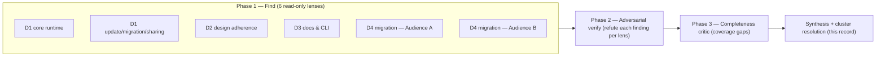

# Pre-e2e Comprehensive Review — decentralized-config v1

**Date**: 2026-06-27
**Status**: Findings recorded; resolution PENDING maintainer approval (cluster-by-cluster).
**Branch**: `feat/vault/decentralized-config` (commits LOCAL, push from Mac).
**Baseline**: 943/0 (`CCO_ALLOW_HOST_RESOLVE=1 ./bin/test`), re-confirmed at review start.
**Gate**: Pre-merge review cycle **step 5** — the final whole-system read-only pass before the
Mac dogfooding e2e (step 6) and the v1 merge (step 7). Launcher:
`pre-e2e-comprehensive-review-handoff.md`.

This is a **decision/analysis record** (immutable history per
`.claude/rules/documentation-lifecycle.md`). The findings are objective; the **Resolution log**
at the end is appended as clusters are resolved.

---

## 1. Method & inputs

Multi-agent, read-only, adversarial — the precedent of the two big prior reviews (18-06
impl-readiness, 26-06 migration-impl). 13 agents, ~995k subagent tokens, 0 findings dropped (every
candidate survived adversarial refutation at high confidence).

**Dimensions** (the maintainer's brief): **D1** bug-free · **D2** design adherence with explicit
*doc-stale vs code-deviation* arbitration · **D3** user guides & CLI reference coherence · **D4**
migration completeness for both audiences (A new-user-from-`main`, B dev-e2e legacy-vault).

**Inputs**: guiding-principles P1–P18 · ADRs 0005–0029 · `design.md` · `requirements.md` ·
prior review resolution logs (18-06, 26-06, 27-06×2) · `changelog.yml` (#1–#18) ·
`P2-dogfooding-validation.md` · `docs/users/**` · the full `bin/cco` + `lib/**` + `migrations/**`
surface.

**Verification model**: each candidate finding was independently re-checked by a skeptic agent
prompted to refute it (default-refuted on uncertainty). The two highest-leverage code findings
(C1, C6) were additionally hand-verified by the lead.

---

## 2. Outcome

**No blocker. No unresolved 🔴.** The build is complete and largely correct; the four prior
reviews already resolved 58+ findings and the H7 latent bug. **20 actionable findings** survived
verification: **6 high · 5 med · 9 nit**.

**Most e2e-critical dimension (D4 migration) came back clean** — both audiences converge
idempotently, no data-loss vector. The global chain (001–015, no 008) and project chain (001–013)
are ordered, idempotent, schema-gated; the ADR-0028 flatten self-heal is wired in **both** the
dispatch bootstrap and migration 015; BL1/BL2 (inactive-profile secrets/memory) recovery is in
place; `changelog.yml` is current through #18. **One real migration bug surfaced from the D1
engine lens, not D4: C1** (migration 009 writes vault-era patterns to `~/.gitignore` on fresh
installs).

The bulk of the remaining work is **D3 user-facing doc coherence** (the shipped CLI moved under
ADR-0029; several guides + `CLAUDE.md` + `cli.md` lag) and a small set of **ADR-0029 D2
confirm-contract code deviations** (C6/C7).

---

## 3. Findings table

| ID | Sev | Dim | Verdict | Location | One-line |
|----|-----|-----|---------|----------|----------|
| C1 | high | D1 | bug | `migrations/global/009_cco_dir_consolidation.sh:28-29,50-53` | On fresh decentralized install `user_config_dir` resolves to `$HOME`; appends vault-era patterns to `~/.gitignore`. |
| C2 | med | D1 | bug | `lib/cmd-start.sh:1168` | `_collect_claimed_browser_ports` queries `paths:` with a project name → joined multi-repo projects silently dropped from the CDP-port scan (collision risk). |
| C3 | nit | D1 | bug (latent) | `lib/cmd-stop.sh:29` | Same project-name-vs-`paths:` key mismatch; `yml_name` container override inert for joined projects. |
| C4 | nit | D1 | cosmetic | `lib/update.sh:128-133` | Pending-migration count is `latest - current`; missing global 008 makes it overstate by 1. |
| C5 | nit | D1 | code-deviation | `lib/cmd-config.sh:282-284` | `_cv_confirm` TTY-detects with `[[ -t 0 ]]` instead of the codebase `(exec < /dev/tty)` idiom. |
| C6 | high | D2 | code-deviation | `lib/cmd-forget.sh:45`, `lib/cmd-remote.sh:175`, `lib/cmd-template.sh:339` | `--force` accepted as a pure `-y` alias with no in-use block to override — contradicts ADR-0029 D2. |
| C7 | med | D2 | code-deviation | `lib/cmd-project-coords.sh:201-205`, `lib/cmd-config.sh:279-285` | `coords --sync` / `config validate --fix` warn+skip (return 0/1) on non-TTY without `-y` instead of **dying** (ADR-0029 D2). `coords --sync` returning 0 masks a skipped mutation in CI. |
| C8 | nit | D2 | doc-stale | `lib/cmd-pack.sh:8` | Dependency comment lists `manifest.sh`, removed by ADR-0012. |
| C9 | nit | D2 | code-deviation | `lib/cmd-start.sh:19-20,56` | tutorial/config-editor setup `mkdir`s dead session-state dirs in the legacy `USER_CONFIG_DIR` path (never mounted; real state lives in STATE). |
| C10 | nit | D1 | code-deviation | `lib/local-paths.sh:449,275,383,13`; `lib/cmd-start.sh:702,1289,1328` | `_assert_resolved_paths` is dead code; 3 call-site comments + the `Provides:` header falsely claim it runs (the real guard is the P14 conscious-skip). |
| C11 | nit | D1 | test-stale | `tests/test_paths.sh:93,112,130,145,160` | Five `export GLOBAL_DIR=…` no-ops left from the ADR-0028-retired variable. |
| C12 | high | D3 | coherence | `docs/users/configuration/guides/configuration-management.md:146-148,502,564-565` | `cco tag add/rm` argument order inverted vs code (`<name> <tag>`). |
| C13 | high | D3 | doc-stale | `CLAUDE.md:65,69,74` | Lists `cco remote list` / `cco llms list` (now die-stubs); `cco config save` shows wrong flags `[msg] [--yes]`. |
| C14 | high | D3 | code-deviation / doc | `docs/users/reference/cli.md:1100` | `cli.md` documents `--dry-run` for `cco config save`, but the code `die`s on it. Decision: remove from doc **or** implement. |
| C15 | high | D3 | doc-stale | `docs/users/packs/guides/knowledge-packs.md:180,154-165` | Uses removed `cco pack list`; `project.yml` repos example uses non-existent `path:` field. |
| C16 | med | D3 | doc-stale | `docs/users/foundation/guides/first-project.md:68`, `…/configuration/guides/project-setup.md:83,85,89`, `docs/users/troubleshooting.md:350` | `project.yml` examples use removed `path:`/`source:` fields (silently ignored by the parser). |
| C17 | med | D3 | doc-stale | `docs/users/troubleshooting.md:366` | Suggests non-existent `cco init <project> --repo` syntax. |
| C18 | med | D3 | doc-stale | `…/configuration/guides/configuration-management.md:585,348,578`, `docs/users/integration/guides/authentication.md:229` | Lists `cco remote list` (die-stub); marks shipped `cco template update` as 🚧 planned. |
| C19 | nit | D3 | doc-stale | `docs/users/foundation/guides/installation.md:106` | Describes `cco list` as "List available projects" — it lists every resource kind. |
| C20 | nit | D3 | coherence | `lib/cmd-remote.sh:347` | Redirect message says `cco list remote` (singular) vs the documented plural `cco list remotes`. |

**D4 (migration) returned only positive confirmations** — see §5.

---

## 4. Findings detail (by resolution cluster)

### Cluster 1 — Migration safety (e2e-critical code bug)

**C1 — migration 009 pollutes `~/.gitignore` on fresh installs.** `high · bug`.
`migrations/global/009_cco_dir_consolidation.sh:28-29` computes
`user_config_dir=$(dirname "$(dirname "$target_dir")")` with the comment "up from
`global/.claude/`". In the vault model that produced `<vault>`; in the decentralized model
`target_dir = ~/.cco/.claude` (`_cco_global_claude_dir`, `paths.sh:295`), so `user_config_dir =
$HOME`. The relocate `mv`s (lines 22-48) are guarded by source-existence + `! -d target`, so they
no-op on a clean `$HOME`; but the gitignore hunk (lines 50-53) only checks `[[ -f
"$user_config_dir/.gitignore" ]]` and unconditionally appends vault-era patterns
(`global/.claude/.cco/meta`, `projects/*/.cco/docker-compose.yml`, …). It fires on every `cco
init` (`cmd-init.sh:203` runs global migrations from `current=0`) and any `cco update` with
`schema_version < 9`, whenever `~/.gitignore` exists.
*Recommendation*: guard the whole vault-relocate block with a vault-presence check
(`[[ -d "$user_config_dir/global" ]] || return 0` right after computing `user_config_dir`), so it
only runs when an actual legacy vault layout is present. Idempotent bug-fix to an existing
migration → no changelog, no new migration; verify idempotency on re-run.

### Cluster 2 — ADR-0029 D2 confirm-contract code deviations

**C6 — `--force` misused as `-y` alias.** `high · code-deviation`. `design.md:757-758` (ADR-0029
D2): "`--force` is reserved for *override-a-block* … it is **not** a second spelling of 'assume
yes'." `cco forget`, `cco remote remove`, `cco template remove` have no in-use/overwrite block,
yet accept `-y|--yes|--force) → yes=true`. The self-aware comments at `cmd-remote.sh:175` /
`cmd-template.sh:339` acknowledge the deviation; `cmd-template.sh` doesn't even list `--force` in
help. Reference: `cco pack remove` (`cmd-pack.sh:291-296`) gates `--force` behind a real in-use
die.
*Recommendation (Option A)*: drop `--force` from these three; accept only `-y/--yes`; update help.
(Option B — add a real block for `--force` to override — has no resource-in-use semantics here, so
A is correct.)

**C7 — non-TTY warn+skip instead of die.** `med · code-deviation`. ADR-0029 D2: "Non-interactive
without `-y` → **die** with a re-run message." The shared `_confirm_destructive` (`utils.sh:139-141`)
dies; but `coords --sync` (`cmd-project-coords.sh:201-205`) warns and `return 0`, and
`config validate --fix` `_cv_confirm` (`cmd-config.sh:282-284`) warns and `return 1`. The
`coords --sync` `return 0` is the worse half — a CI `cco project coords --sync </dev/null`
silently "succeeds" with nothing applied. Tests currently encode the warn+skip behavior, not the
die contract.
*Recommendation*: route both through `_confirm_destructive`; update
`tests/test_project_coords.sh` + `tests/test_config_validate.sh` to assert non-zero exit.

### Cluster 3 — Multi-repo index-key latent bugs (one root cause)

**C2** (`med`) and **C3** (`nit`) share a root cause: `_index_get_path "$name"` queries the
`paths:` section (keyed by **repo** logical names), but the caller passes a **project** name. A
project registered via `cco join` writes only `_index_set_project_repos` (`migrate.sh:819`), never
`_index_set_path` for the project name, so the project name is absent from `paths:`.
- **C2** `cmd-start.sh:1168`: the port-conflict scan `continue`s past every joined multi-repo
  project → two such sessions can be handed the same CDP port (silent collision). Single-repo
  `cco init` is unaffected (`cmd-init.sh:308` writes the project name into `paths:`).
- **C3** `cmd-stop.sh:29`: `proj_yml` never set → the `yml_name` container-name override is inert.
  Harmless today (container is named from the project key), latent if a `project.yml` `name:` ever
  diverges from the key.
*Recommendation*: shared fix — on empty `_index_get_path`, fall back to `_index_get_project_repos`
and resolve the first member path (mirrors the `_resolve_start_paths` cwd-first/by-name two-step).

### Cluster 4 — User-facing docs coherence (D3)

Mostly **doc-stale** lag from the ADR-0029 CLI surface change + the decentralized `project.yml`
schema. All are doc rewrites except **C14**, which needs a decision (remove `--dry-run` from
`cli.md` §3.21 vs implement it in `_config_save`; dispatch-level help already omits it →
remove is the cleaner path). Items: **C12** (tag arg order), **C13** (`CLAUDE.md` die-stubs +
`config save` flags), **C14** (`config save --dry-run`), **C15** (`pack list` + `path:`),
**C16** (`path:`/`source:` in 3 guides), **C17** (`init --repo`), **C18** (`remote list` + 🚧
`template update`), **C19** (`cco list` description), **C20** (singular `cco list remote` redirect).
Coherence/doc fixes → no ADR; no changelog/migration.

### Cluster 5 — Code cleanup nits

Hygiene, no behavior change: **C4** (off-by-one pending count), **C5** (`[[ -t 0 ]]` vs
`/dev/tty`), **C8** (`manifest.sh` comment), **C9** (dead session-state `mkdir`s), **C10**
(`_assert_resolved_paths` dead code + stale comments), **C11** (stale `GLOBAL_DIR` test exports).

---

## 5. D4 migration — verified clean (positive confirmations)

Both D4 lenses found **no defects**; recorded for the e2e plan's benefit:
- **J0 backup (ADR-0006)**: raw tar incl. `.git` + `profile-state/` shadows, atomic `mv`, `0600`,
  integrity check, idempotent marker (`migrate.sh:100-171`).
- **Eager global / lazy project (ADR-0025/0021)**: global eager on `cco update`; project lazy via
  `cco init --migrate`, one-pass complete `project.yml`, no double schema-migration, re-runnable;
  pre-existing `.cco/` refused (F11).
- **Flatten self-heal (ADR-0028)**: single `_cco_flatten_global_claude` helper called from both
  `_cco_first_run` (every command) and migration 015; idempotent from fresh/legacy/mid-update.
- **BL1/BL2**: inactive-profile secrets + memory recovered from `profile-state/<branch>/` shadow
  (`migrate.sh:646-673,704-706,753-757`).
- **Ordering/idempotency**: runner iterates existing files numerically; the missing global 008 does
  not break sequencing; `schema_version` advances only on success (`update-meta.sh:227-275`).
- **Legacy vault never auto-deleted**; removal is manual, post-merge.
- **changelog.yml** current through #18; flatten correctly has no changelog entry (breaking →
  migration, per `update-system.md`).

---

## 6. Coverage gaps (completeness critic)

Areas not deeply inspected this pass (the critic put e2e confidence at ~79%, "ready with minor
pre-gate actions"). None has a known defect; listed so the maintainer can decide on a focused
second pass before the e2e:
- `lib/cmd-update.sh` full (orchestrates the migration runner; `schema_version` write
  idempotency/TOCTOU) — **e2e-critical**.
- `lib/cmd-resolve.sh` interior (H7-class reader/writer path mapping).
- `lib/index.sh` STATE atomic-write (`mktemp`+`mv`, ADR-0022 D2) under the multi-repo key issue C2/C3.
- `lib/secrets.sh` full (secrets.env generation; ties to BL1).
- `lib/yaml.sh` full (coordinate parsers across all sections).
- Individual `migrations/project/001-013` + `migrations/pack/*` scripts (only sampled).
- `lib/packs.sh` resolution layers / cross-tree collision (P15).
- A few user guides not fully read: `structured-agentic-development.md`, `agent-teams.md`.

---

## 7. Proposed resolution plan

Read-only review complete. Proposed order (each cluster: present options → decide → fix → atomic
LOCAL commit, suite green per step; **merge nothing**):

1. **Cluster 1 (C1)** — migration-safety code fix. Highest priority for the e2e.
2. **Cluster 2 (C6, C7)** — ADR-0029 D2 deviations. Decision: fix-to-ADR (recommended) vs bless
   via ADR-0030.
3. **Cluster 3 (C2, C3)** — multi-repo index-key fix (one shared change).
4. **Cluster 4 (C12–C20)** — D3 doc coherence sweep (+ C14 decision).
5. **Cluster 5 (C4,C5,C8,C9,C10,C11)** — cleanup nits (batchable).

Optional pre-e2e: a focused second-pass lens over the §6 e2e-critical gaps
(`cmd-update.sh`, `cmd-resolve.sh`, `index.sh`).

**Next free ADR = 0030** (open only if C6/C7 are blessed as deviations). **Next changelog id = 19**
(only if a fix is user-visible additive; the C1/C6/C7 fixes are bug/contract corrections → none
expected). On completion: flip roadmap step 5 → done, hand to step 6 dogfooding.

---

## 8. Resolution log

### Cluster 1 — Migration safety — ✅ DONE (2026-06-27)

**C1** resolved. Root cause confirmed by the lead: migration 009's vault-relocation block was
authored for the legacy layout where `target_dir == <vault>/global/.claude`, so
`dirname(dirname(target_dir))` was the vault root. Under ADR-0028's flat layout
`target_dir == ~/.cco/.claude`, so it resolves to `$HOME` — and the block iterated `~/packs` and
rewrote `~/.gitignore` with stale vault patterns on every fresh `cco init`.

Fix scoped **narrowly** (a first, broader guard over the whole `migrate()` body wrongly skipped the
**target_dir-relative** `.cco-base/ → .cco/base/` consolidation that migration 007 + the base-tracking
rely on under the flat layout too — caught by `test_init_creates_cco_base`). Final fix: the
`target_dir`-relative moves (`.cco-meta`, `.cco-base`) run unconditionally; only the **user-root**
operations (`.cco-remotes`, `packs/`, vault `.gitignore`) are gated behind
`[[ "$target_dir" == "$user_config_dir/global/.claude" ]]` (true only for the real vault layout).
Idempotent; legacy vault users unaffected.

- `migrations/global/009_cco_dir_consolidation.sh` — narrower vault-root guard.
- `tests/test_update.sh` — new `test_migration_009_global_skips_flat_layout` pins both halves of the
  contract (flat layout still consolidates `.cco-base/`, but never touches `$HOME/.gitignore`).
- No changelog / no new migration (idempotent bug-fix to an existing migration).
- Suite: **944/0** (943 baseline + 1 regression test).

### Cluster 2 — ADR-0029 D2 confirm-contract — ✅ DONE (2026-06-27)

Maintainer directive: **fix the code to the ADR** (no ADR-0030).

**C6** — dropped `--force` as a `-y` synonym from the three verbs with no in-use/overwrite block
to override: `cco forget` (`cmd-forget.sh`), `cco remote remove` (`cmd-remote.sh`), `cco template
remove` (`cmd-template.sh`). They now accept only `-y/--yes`; help text updated. The legitimate
override `--force` on `cco template update`/`import` and `cco pack/llms remove` (real in-use/overwrite
blocks) is untouched. `cmd_forget`'s confirm already dies on non-TTY, so it was already D2-compliant
apart from the alias.

**C7** — routed the two stragglers through the canonical `_confirm_destructive` (utils.sh), which
**dies** on non-TTY without `-y` instead of warn+skip:
- `cco project coords --sync` (`cmd-project-coords.sh`) — the `return 0` warn+skip that masked a
  skipped sync in CI now dies.
- `cco config validate --fix` (`cmd-config.sh`) — the local `_cv_confirm` helper (warn+skip,
  `return 1`) was **deleted** and both call sites now use `_confirm_destructive`.
- Tests updated to assert the die contract (non-zero exit + "re-run with -y", data preserved):
  `test_project_coords_sync_non_interactive_without_yes_aborts`,
  `test_config_validate_fix_dies_without_confirmation` (renamed from `…_skips_…`).

**Side effect on C5**: deleting `_cv_confirm` removes the exact target of C5 (its `[[ -t 0 ]]` vs
`(exec < /dev/tty)` idiom). The residual question — whether the canonical `_confirm_destructive`
itself should adopt the `/dev/tty` idiom — is re-scoped into Cluster 5 as a maintainer nit.

No changelog / no new ADR (contract corrections to just-shipped ADR-0029 behavior). Suite **944/0**.

### Cluster 3 — Multi-repo index-key latent bugs — ✅ DONE (2026-06-27)

**C2 + C3** shared one root cause: both call sites passed a **project** name to `_index_get_path`,
which queries the `paths:` section (keyed by **repo** names). A joined multi-repo project's key
lives in `projects:` (membership), not `paths:`, so the lookup silently returned empty. The codebase
already has the canonical resolver `_resolve_unit_dir_for_project` (cmd-resolve.sh) — used by ~15
other call sites — which walks membership and returns the first member hosting `.cco/project.yml`.
These two were the only sites still using the low-level helper directly.

- **C2** `cmd-start.sh` `_collect_claimed_browser_ports`: joined multi-repo projects were dropped
  from the CDP-port conflict scan → silent port collision. Now resolves via membership.
- **C3** `cmd-stop.sh` `cmd_stop`: the `name:` container override was inert for joined projects.
  Now resolves via membership; dependency header updated to note cmd-resolve.sh.
- `tests/test_stop.sh` — new `test_stop_multirepo_project_resolves_yml_name_via_membership`: a
  project whose key is in `projects:` but not `paths:`, with a member-hosted `project.yml name:`
  that differs from the key; asserts `cco stop <key>` stops the `name:`-derived container (fails
  without the fix).
- C2's fix is identical; a full collector test needs docker + `cco start` browser mocking and is
  left to the e2e (the resolver path is exercised by the C3 test).

No changelog / no new ADR. Suite **945/0**.

### Cluster 4 — User-facing docs coherence (D3) — ✅ DONE (2026-06-27)

All doc-coherence findings fixed to match the shipped ADR-0029 surface + the decentralized
`project.yml` schema. **C14 decision (maintainer's "follow my recommendation")**: *removed*
`--dry-run` from the `cco config save` docs rather than implementing it (the dispatch-level help
already omitted it).

- **C12** `configuration-management.md` — `cco tag add/rm` argument order corrected to `<name> <tag>`
  in §4 examples (×3 + line 502) and the §11 reference table.
- **C13** `CLAUDE.md` — `cco remote list`→`cco list remotes`, `cco llms list`→`cco list llms`,
  `cco config save [msg] [--yes]`→`cco config save [-m <msg>]`.
- **C14** `cli.md` §3.21 + `configuration-management.md` (§3 bash block line 134 + §11 table) —
  dropped the unimplemented `--dry-run` from `cco config save` (usage, option line, example, table).
- **C15** `knowledge-packs.md` — `cco pack list`→`cco list packs`; repos example `path:`→`name:`.
  (The pack `files:` `path:` entries elsewhere in the guide are legitimate and left intact.)
- **C16** `first-project.md`, `project-setup.md`, `troubleshooting.md` — repos `path:` / extra_mounts
  `source:` removed from `project.yml` examples (host paths live in the index via `cco resolve`),
  matching the canonical `project-yaml.md`.
- **C17** `troubleshooting.md` — `cco init <project> --repo …` → `cd <repo> && cco init`.
- **C18** `configuration-management.md` + `authentication.md` — `cco remote list`→`cco list remotes`;
  removed the 🚧 "planned" labels on the shipped `cco template update` (callout + table row). The
  `cco config protect` 🚧 (post-v1 deferral) was left as-is.
- **C19** `installation.md` — `cco list` re-described as listing every resource kind.
- **C20** `lib/cmd-remote.sh` — redirect message `cco list remote`→`cco list remotes` (plural, matches
  cli.md). No test asserts this string.

Completeness sweep caught two extra `config save --dry-run` stragglers (config-mgmt §3/§11) — fixed.
The cli.md redirect-documentation lines (`the per-noun verb was removed → use cco list <kind>`) are
correct and intentionally kept. **Post-resolution follow-up (C6 in cli.md):** the D3 lens had only
flagged `CLAUDE.md`; a sweep found `cli.md` §3.4b still listed `-y, --yes, --force` for `cco forget`
and the §3.11 confirm-contract text implied `--force` on `template remove`/`remote remove`. Fixed:
forget help drops `--force`; the contract now scopes `--force` to the in-use **override** (only
`pack`/`llms remove`). Pure doc/coherence + one CLI string: no changelog, no migration, no ADR.
Suite **945/0**.

### Cluster 5 — Code cleanup nits — ✅ DONE (2026-06-27)

- **C4** — pending-migration count: replaced `latest_schema - current_schema` (which overstated by
  one across the missing global 008) with a new `_count_pending_migrations` helper
  (`update-meta.sh`) that counts files with `id > current`. Applied at both `update.sh` call sites
  (global + project). `latest_schema` is kept (still used to stamp the post-migration schema). The
  existing dry-run test asserts the substring, not the number — still green.
- **C5** — **mooted** by Cluster 2 (the flagged `_cv_confirm` was deleted). Updated the stale
  `_cv_confirm` reference in the `_confirm_destructive` doc comment (`utils.sh`). The residual design
  question — whether the canonical `_confirm_destructive` should adopt the `(exec < /dev/tty)` idiom
  used by the merge/migrate prompts instead of `[[ -t 0 ]]` — is left as an **open maintainer
  decision** (it changes the just-ruled ADR-0029 D2 TTY semantics; not changed here).
- **C8** — removed the stale `manifest.sh` (ADR-0012) from the `cmd-pack.sh` dependency comment.
- **C9** — removed the dead `mkdir`s of `runtime_dir/.cco/claude-state` + `runtime_dir/memory` in the
  tutorial/config-editor setup (`cmd-start.sh`), replaced with `mkdir -p "$runtime_dir"`, and fixed
  the misleading header comment. **Verified dead three ways**: the tutorial `project.yml` mounts only
  cco-docs/cco-config; session transcripts/memory always mount from STATE via
  `_cco_project_session_*` (cmd-start.sh:395/648-650); no code reads those runtime-dir paths. Two
  tutorial tests asserted the **obsolete pre-decentralized** behavior (one even simulated user memory
  in `runtime_dir/memory` and expected it preserved) — rewritten to assert the corrected contract
  (`assert_dir_not_exists` on the dead dirs; `.claude/` refresh still verified).
- **C10** — removed the dead `_assert_resolved_paths` function (`local-paths.sh`) and corrected its
  five stale references (Provides header + two comments there; three call-site comments in
  `cmd-start.sh`) to describe the **live** mechanism — the P14 conscious-skip in
  `_effective_repo_mounts`/`_effective_extra_mounts`. `_project_effective_paths` is kept (live caller
  at `cmd-start.sh:519`).
- **C11** — removed the five no-op `export GLOBAL_DIR` (ADR-0028-retired) seams in `test_paths.sh`.

No changelog, no migration, no ADR. Suite **945/0**.

---

## 9. Final status

All five clusters resolved (2026-06-27). **6 commits** on `feat/vault/decentralized-config` (LOCAL,
not pushed): review record + one per cluster. Baseline moved **943/0 → 945/0** (two regression tests
added: migration-009 flat-layout guard, multi-repo stop membership resolution). No blocker surfaced;
the D4 migration dimension was clean. **Merge nothing** — this gate precedes the Mac dogfooding e2e
(step 6); the legacy vault is removed only after merge + validation.

**Open items handed forward (not fixed here):**
- C5 residual — `_confirm_destructive` `[[ -t 0 ]]` vs `(exec < /dev/tty)` idiom: maintainer decision.
- §6 coverage gaps — `cmd-update.sh`, `cmd-resolve.sh`, `index.sh` atomicity were not deeply
  inspected; recommend a focused spot-check or rely on the e2e (no known defect).
- Pre-existing test-isolation fragility: `test_migration_010_user_project_named_tutorial` calls
  `warn` without sourcing `colors.sh`, so it fails under `--file test_tutorial` but passes in the
  full suite. Out of this review's scope; noted for a future test-hygiene pass.

Roadmap: flip **step 5 → done**, hand off to **step 6 dogfooding** (`P2-dogfooding-validation.md`).
