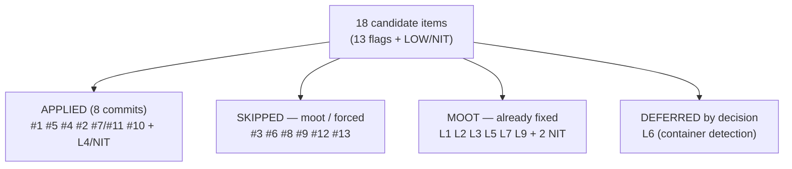

# Refactoring / Optimization Review — decentralized-config v1 (PRE-MERGE step 3)

**Date**: 2026-06-27 · **Branch**: `feat/vault/decentralized-config` (commits LOCAL,
pushed from the maintainer's Mac) · **Method**: `engineering/guides/review-playbooks.md` §3
(S.O.L.I.D., DRY, Open/Closed, KISS, YAGNI) · **Launcher**:
[`refactoring-review-handoff.md`](../refactoring-review-handoff.md).

**Outcome**: 8 atomic LOCAL commits `e65aa2f`→`0c3c822`. Test suite **914/0 → 921/0**
(green per step; +7 `_peel_tab` unit tests). **Behaviour-preserving** — no CLI surface,
exit-code, or written-file change; no migration needed (no tracked-file move, no
`*_FILE_POLICIES` change); no ADR reopened. The single non-pure-refactor item (#10) was a
maintainer-approved, scoped change to a non-blocking warning; one item (L6) was deferred by
decision (see §4).

This is a **decision-history record** (immutable; documentation-lifecycle.md). It exists so a
future session does not re-litigate which flags were applied, skipped (and why), or moot.

---

## 1. Inputs

- **Backlog A** — the 13 optimization flags parked by
  [`reviews/25-06-2026-impl-adherence-review.md`](25-06-2026-impl-adherence-review.md)
  §"Optimization & duplication backlog".
- **Backlog B** — the residual LOW/NIT from
  [`reviews/26-06-2026-migration-impl-review.md`](26-06-2026-migration-impl-review.md).

Every item was re-grepped against the current code (line numbers in the source reviews had
drifted) and re-verified live before disposition.

---

## 2. Backlog A — disposition of the 13 flags

| # | Flag | Disposition | Rationale |
|---|------|-------------|-----------|
| 1 | Tab-peel idiom (~37×) | ✅ Applied | `_peel_tab` in `lib/utils.sh` + `tests/test_utils.sh`. The manual peel is **deliberate** (`cmd-project-coords.sh` comment: "empty middles survive") — `IFS=$'\t' read` collapses empty middle fields because tab is whitespace to `read`. The helper centralizes this correctness subtlety. Adopted in `cmd-resolve`, `cmd-project-validate`, `cmd-project-coords`. Name-only first-field peels (`${x%%\t*}`) left as-is (already minimal). |
| 5 | Per-section peel in coords (4×) | ✅ Applied | `_coords_scan_section` (emitter + label + url-field-index) — 4 near-identical loops → 4 one-line calls. |
| 4 | Mixed `_pv_validate_unit` (127 lines) | ✅ Applied | Split into `_pv_validate_{repos,mounts,llms,packs,stray_paths}`; accumulators stay reachable via bash dynamic scoping (helpers run only as callees). |
| 2 | Index-enumeration loop (13×) | ✅ Applied — **honest scope 6/13** | `_project_foreach` in `cmd-resolve.sh` (yields `<proj>\t<unit_dir>\t<yml>` for resolvable projects with a manifest). Adopted in the 6 sites with that exact shape (update `--all`, llms rename + where-used, pack usage ×2, coords). The other **7 legitimately differ** and were left as-is (forcing them through a flagged helper would hurt readability): `validate`/`_resolve_all` warn on unresolved; `query` shows unresolved with placeholders; `clean` acts on `.cco` without requiring a manifest; `config` reads index membership; `stop` uses the cache-managed dir; `start` resolves via `_index_get_path` + skips the current project. The reserved `_template` pseudo-entry (verified **never written** to `projects:`) is now skipped uniformly, removing a prior inconsistency. |
| 7 / 11 | 324-line `cmd_update` dispatcher | ✅ Applied (partial by design) | Extracted `_update_usage()` (help heredoc) and `_update_discover_pack_remotes(cache_mode)` (explicit arg, no dynamic-scope coupling): **307 → 212 lines**. **NOT** split into "one handler per mode": `cco update` is a single **mode-PARAMETERIZED** pipeline (migrations → scope → global → project, mode threaded into `_update_global`/`_update_project`), not a mode switch — per-mode handlers would fight that design and add hidden coupling. |
| 10 | Duplicated secret-scan | ✅ Applied (scoped) | Only `cmd-build.sh` still had an inline scan; `config`/`export`/`migrate` already used `lib/secrets.sh`. Routed `cmd-build` through `_secret_match_content`. **Maintainer-approved "route as-is"**: this NON-BLOCKING build-arg warning shifts coverage — loses the generic `TOKEN=` match (GitHub `ghp_`/`gho_` still caught), gains private keys / `sk-` / the `:` form. The blocking gates (`config save`, `project export`) are **untouched**. |
| 3 | Two 3-way mergers | ⏭️ Skipped | `cmd-pack` (whole-file) and `update-merge` (line-level) share a 4-line decision shape but operate at different granularities; a shared helper would couple two distinct semantics — forced abstraction (KISS). |
| 6 | "Single-use" `_pack_merge_put` | ⏭️ Skipped | Flag was factually wrong — **3 real call-sites** (one per merge case). Keep. |
| 8 | `_kv_lookup` in `update-merge` | ⏭️ Moot | No by-hand key=value peel exists in `update-merge.sh` (re-grepped). |
| 9 | `_pack_merge_eq` equality | ⏭️ Skipped | Correctly context-specific (treats file absence as a meaningful state). Keep local. |
| 12 | `_COORD_RULES` data table | ⏭️ Skipped (YAGNI) | Per-section rules diverge too much (packs url-optional + collision; llms url-mandatory) for a table to pay off; the #4 per-section split already localizes them. |
| 13 | `_pack_resolve_dir` comment vs code | ⏭️ Moot | Post-F1 (flat store), comment and code agree (`~/.cco/packs` = `$PACKS_DIR`). |

---

## 3. Backlog B — LOW/NIT disposition

| Item | Disposition | Note |
|------|-------------|------|
| L4 `chmod 0600 … \|\| true` swallows failure | ✅ Applied | `migrate.sh _cco_confirm_overwrite_global`: warn on chmod failure instead of silent `\|\| true` (backups dir is 0700, so not a leak). |
| NIT `tar 2>/dev/null` hides backup cause | ✅ Applied | Capture tar stderr; include the cause in the abort warning. Control flow unchanged. |
| NIT misleading "index-driven" comment | ✅ Applied | `cmd-start.sh`: config-editor ephemeral mounts resolve via the session override, not the index — comment corrected. |
| L8 `cco forget` recovery hint | ⏭️ Deferred to UX review (step 4) | Pure user-facing message wording — UX-review territory. |
| L1, L2, L3, L5, L7, L9 | ⏭️ Moot | Re-verified already fixed by earlier sessions (word-split fixed; warn-on-drop present; `vault\|` arm gone; design §3 index schema aligned; awk strips only quoting delimiters; `global-migrated` marker comment correct, TODO is legitimate future-work). |
| NIT "never fatal" comment · NIT redundant `*/secrets.env` | ⏭️ Moot | Comment accurate; the find-exclusion and `.example` skip are complementary, not redundant. |

---

## 4. Deferred by decision — L6 (container detection)

**Flag**: `_cco_in_container` (`lib/paths.sh`) false-positives for a HOST user literally
named `claude` (`HOME=/home/claude`), so all resolvers refuse with the anti-in-container
guard. Already documented in-code with the `CCO_ALLOW_HOST_RESOLVE=1` escape hatch.

**Technical finding**:
- `/.dockerenv` is created by the Docker **daemon** in every container regardless of image →
  **reliable for the native Docker distribution** (`docker compose run`).
- It is **absent** under non-Docker OCI runtimes (**podman** uses `/run/.containerenv`;
  containerd/CRI-O/k8s create nothing) — which is exactly why the `HOME=/home/claude`
  fallback exists today: it catches "in container" when `/.dockerenv` is missing but the
  entrypoint's `claude` user makes `HOME=/home/claude`.

**Decision (maintainer, 2026-06-27): keep A now, do B in the next image-touching session.**
- **A (now)**: status quo — the dual heuristic is adequate; the false-positive is rare and has
  the documented escape hatch.
- **B (next session)**: the entrypoint/compose exports a **positive** `CCO_IN_CONTAINER=1`
  marker; `_cco_in_container` checks it as the primary signal (keeping `/.dockerenv` as a
  secondary fallback) and **drops** the `HOME=/home/claude` heuristic. Authoritative and
  runtime-independent — removes **both** the host-`claude` false-positive **and** the podman
  false-negative.
- **Why not now**: B touches `config/entrypoint.sh` + the compose-gen env, which are **not
  active in this self-dev session** (require `cco build && cco start` to validate). A
  behaviour-preserving refactor pass must not ship an unvalidated container-detection change.

Tracked in `roadmap.md` → post-v1 backlog.

---

## 5. Commits

| Commit | Item |
|--------|------|
| `e65aa2f` | `_peel_tab` helper + tests (#1) |
| `7f44cd3` | adopt `_peel_tab` in resolve (#1) |
| `6bfe237` | `_coords_scan_section` + `_peel_tab` in coords (#5) |
| `031d0a9` | split `_pv_validate_unit` per section (#4) |
| `9b63dcf` | `_project_foreach` + 6 enumerators (#2) |
| `9e093c5` | `_update_usage` + `_update_discover_pack_remotes` (#7/#11) |
| `d01ea93` | backup diagnostics (L4/NIT) + stale comment polish |
| `0c3c822` | route `cmd-build` secret scan through `secrets.sh` (#10) |

*Generated with Claude Code*
