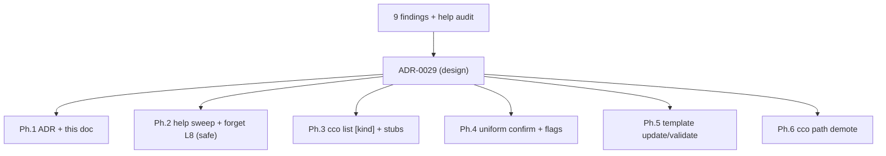

# UX-UI Review — decentralized-config v1 (PRE-MERGE step 4)

**Date**: 2026-06-27 · **Branch**: `feat/vault/decentralized-config` (commits LOCAL,
pushed from the maintainer's Mac) · **Method**: `engineering/guides/review-playbooks.md` §4
(symmetry/learnability · no duplicate paths · completeness/reachability · destructive-confirm ·
simple onboarding · inform-before-act) · **Launcher**:
[`../ux-ui-review-handoff.md`](../ux-ui-review-handoff.md).

**Scope**: the user-facing CLI surface — `bin/cco` (dispatcher + `usage()`), every subcommand in
`lib/cmd-*.sh` (+ `lib/tags.sh`, `lib/migrate.sh`, `lib/remote.sh`), and the user reference
`docs/users/reference/cli.md`.

**Outcome**: 9 findings (UX-1…UX-9) + a full help audit. A reachability sweep came back **clean**
(no implemented-but-unreachable op; no broken wiring; all `--help` heredocs matched their `case`
arms). The defects are **coherence** issues. The maintainer expanded the brief into a small UX
**redesign** of the listing surface and a uniform destructive-confirm + verb-symmetry pass; the
design decisions are recorded in **[ADR-0029](../decisions/0029-ux-ui-review-unified-list-confirm-symmetry.md)**
(which **refines ADR-0023 D1**).

This is a **decision-history record** (immutable; `documentation-lifecycle.md`). It exists so a
future session does not re-litigate which findings were raised, how they were disposed, and why.

---

## 1. Method & inputs

Two read-only analyses fed this review (both code-grounded, file:line):

- **Reachability sweep** — every dispatched verb/sub-verb vs every `cmd_*`/`_*` function: are useful
  operations all reachable, are all dispatched handlers implemented, do help texts match the `case`
  arms? **Result: clean.** The only intentionally-removed verbs are the existing `die` stubs
  (`share`/`manifest`; `project publish|install|update|internalize|resolve|add-pack|remove-pack|
  delete`).
- **Help audit** — full inventory of 21 top-level commands + 35 subcommands (project 7, pack 11,
  llms 6, template 8, remote 5) with parsed args/flags vs documented help; plus `usage()`
  completeness and help-format consistency. Defect list in §3.

Precedence on conflict (handoff): guiding-principles → ADRs → design → shipped docs.

---

## 2. Findings & dispositions

| # | Sev | Finding | Disposition |
|---|-----|---------|-------------|
| **UX-1** | High | `cco list` lists **only tagged** resources (`tags.sh:221`, iterates `_tags_all`) but `usage()`/`--help` say "list your packs/projects/templates" → a user with untagged projects sees "no tagged resources yet"; real listing is `cco <noun> list`. The word *list* names two operations. | **ADR-0029 D1**: `cco list` → cross-resource dashboard (tags become a column); `cco list <kind>`; `cco list [<kind>] --tag`. |
| **UX-2** | High | `cco join` is dispatched (`bin/cco:168`) but **absent from `usage()`** (a primary onboarding verb invisible in `cco help`). Plus the broader help-completeness gaps in §3. | **ADR-0029 D5**: add `join` to `usage()`; full help-completeness/consistency sweep. |
| **UX-3** | Med | Destructive confirmation **inconsistent**: `forget` always previews+confirms; `pack remove`/`llms remove` confirm only **if referenced** (silent `rm` of an unused, possibly unrecoverable resource); `template remove` + `remote remove` **never** confirm. | **ADR-0029 D2**: one confirm contract (preview → `[y/N]` → `-y` skip → non-TTY die) on every destructive op. |
| **UX-4** | Med | Confirm-skip flag spelled two ways: `--force` (pack/llms) vs `-y/--yes` (forget/config/coords). | **ADR-0029 D2**: `-y/--yes` canonical everywhere; `--force` reserved for *override-a-block* (implies `-y`). |
| **UX-5** | Med | `cco tag rm` breaks the `add/remove` convention used by every other family (`remote remove`, `pack remove`, …). | **ADR-0029 D3**: `cco tag remove` canonical; `rm` kept as alias. |
| **UX-6** | Low/Med | Verb-coverage asymmetry: `template` lacks `update` + `validate` (pack/llms have `update`; pack/project have `validate`); only `llms` has `rename`. | **ADR-0029 D3**: add `template update` + `template validate` (pack parity); other asymmetries are intentional (P13 project≠pack; llms-only `rename`) and **documented in help**. |
| **UX-7** | Low | `cco path set\|list` exposes the **internal** index (P6: hidden) as a top-level "low-level editor" in `usage()`. | **ADR-0029 D4**: demote — keep the command, remove from main `usage()`, document under `cco resolve --help` as an advanced override. |
| **UX-8** | Low | **L8 carry-in**: `cco forget` on an untracked/half-migrated project dies (`cmd-forget.sh:96`) with no recovery hint. | **ADR-0029 D5**: enrich the message — suggest `cco join` (if `.cco/` in cwd) and `cco resolve --scan`. |
| **UX-9** | Low | Tag-filter split: list a project with `cco project list`, but filter by tag only via `cco list --tag` (not `cco project list --tag`). | **Folded into ADR-0029 D1** — `cco list [<kind>] --tag` is the single tag-filter home. |

**Audited and left as-is (no action):** `cco config push/pull` (push warns about a private remote;
pull is fast-forward-only with abort + reconcile instructions — `cmd-config.sh:122-151`);
`cco clean` (only `.bak`/`.new`/`.tmp`/generated-compose — all regenerable — plus `--dry-run`);
`cco config validate --fix` and `cco project coords --sync` (already preview-first + `-y`).

---

## 3. Help audit (feeds ADR-0029 D5)

**Completeness** — flags parsed but undocumented:
- `cco update` — `--offline`, `--no-cache`, `--dry-run` missing from help (`lib/cmd-update.sh`).
- `cco resolve` — `--all` parsed (`cmd-resolve.sh:310`) but absent from the Options block (`:283-303`).
- `cco config` main help (`cmd-config.sh:379-393`) omits `validate --dry-run` (present at `:298-315`).

**Correctness** — help vs behaviour:
- `cco list` help/`usage()` overstate behaviour (UX-1).
- `cco sync` one-liner doesn't explain `--from` (which repo is the source).

**Layout / consistency:**
- **`cco llms` family help mixes `install`-only options** into the dispatch-level help
  (`cmd-llms.sh:11-29`), unlike pack/project/template/remote which defer options to the subcommand.
- **`-h`** accepted in some commands (forget/config/project-validate/coords) but not others
  (pack/llms/template/remote subcommands, update, clean, resolve, new, build) → standardize.
- **Four help-format patterns** coexist (rich Options+Examples · minimal one-liner · Arguments+
  Options+Exit-codes · mixed dispatch/sub). Align toward the richer shape where a command has
  arguments/options; keep trivial commands one-line.

**`usage()` (bin/cco:107-147):**
- `join` missing (UX-2). `help` itself unlisted (add a footer line).
- `forget` and `chrome` sit oddly under "Projects & Packs" — `forget` is a lifecycle verb (inverse
  of init/join), `chrome` is a host-side tool. Regroup.

---

## 4. Decisions & governance

- All design decisions → **[ADR-0029](../decisions/0029-ux-ui-review-unified-list-confirm-symmetry.md)**
  (D1 unified list · D2 confirm contract · D3 verb symmetry · D4 `cco path` demote · D5 help).
- **Refines ADR-0023 D1** (listing moves out of the namespaces) → forward-annotate ADR-0023 D1.
- **No file migration** (no tracked file renamed; no `*_FILE_POLICIES` change). Removed CLI verbs use
  `die` redirect stubs (precedent: `share`/`manifest`, `project publish`).
- **`changelog.yml`**: additive entries for the `cco list` dashboard, the uniform confirm + `-y`,
  `cco tag remove`, and `cco template update`/`validate`.

## 5. Implementation plan (atomic LOCAL commits, green per step)

1. **Ph.1 ✅** `e872312` — ADR-0029 + this review doc.
2. **Ph.2 ✅** `c08a87d` (2a) + `227d2c7` (2b) — help sweep (join in `usage()`; `config validate
   --dry-run`; llms family-help cleanup; regroup) + UX-8 forget message; `-h` alias everywhere.
3. **Ph.3 ✅** `9a5565a` — `cco list [<kind>] [--tag] [--sort]` unified index; removed `cco <noun>
   list` (stubs); suite call-sites migrated; `changelog.yml` #16; new `tests/test_list.sh`.
4. **Ph.4 ▶ handed off** — uniform destructive-confirm + `-y/--yes` canonical + `--force` override,
   across forget/pack/llms/template/remote (non-TTY without `-y` → die, maintainer-confirmed).
5. **Ph.5 ▶ handed off** — `cco tag remove` (alias `rm`) + `cco template update` + `cco template
   validate` (pack parity).
6. **Ph.6 ▶ handed off** — `cco path` demote (out of `usage()`, into `cco resolve --help`).
7. **Ph.7 ▶ handed off** — `docs/users/reference/cli.md` + `CLAUDE.md` + design.md §7 re-sync;
   roadmap step 4 → done; banner the handoffs.

Ph.4–Ph.7 launcher: [`../ux-ui-fixes-handoff.md`](../ux-ui-fixes-handoff.md).

## Resolution log

- *2026-06-27* — Findings raised; maintainer expanded scope to the listing redesign + uniform
  confirm + template parity; chose **Option A** (single `cco list`, redirect stubs) and **demote**
  for `cco path`. Recorded in ADR-0029.
- *2026-06-27* — **Ph.1–Ph.3 implemented & committed** (`e872312`/`c08a87d`/`227d2c7`/`9a5565a`),
  suite **921/0 → 928/0** (green per step). Help audit re-grounded: `cco update --help` and `cco
  resolve --help` were **already complete** (audit 1a/1b were false positives — not changed). The
  keystone breaking change (`cco list`) is in.
- *2026-06-27* — **Ph.4–Ph.7 handed off** to a fresh session via
  [`../ux-ui-fixes-handoff.md`](../ux-ui-fixes-handoff.md); non-TTY-without-`-y` → **die** confirmed.
  Baseline for the continuation = **928/0**; next free ADR = 0030 (none expected).
