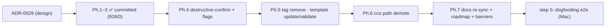

# Handoff — UX-UI fixes Ph.4 → Ph.7 (PRE-MERGE step 4, continuation)

> **✅ COMPLETE (2026-06-27).** Ph.4–Ph.7 are all implemented & committed:
> Ph.4 `f61cb39` (uniform destructive-confirm + `_confirm_destructive` helper, changelog #17) ·
> Ph.5 `0eec1e4` (`cco tag remove` + `cco template update`/`validate`, changelog #18) ·
> Ph.6 `4c0430f` (`cco path` demote) · Ph.7 (shipped-behavior doc re-sync + banners, this commit).
> Suite **928/0 → 943/0**, green per step; no new ADR (ADR-0029 covered all). Review §5 +
> Resolution log + roadmap step 4 flipped to done. **Next = dogfooding e2e (step 5).** This
> launcher is kept as history.

**Status**: Self-contained launcher for the **remaining UX-UI fix phases** of the pre-merge
UX-UI review (review cycle step 4). Ph.1–Ph.3 are **done and committed** (see below); this handoff
drives **Ph.4 → Ph.7**. **DONE** (see banner). Branch `feat/vault/decentralized-config`,
commits **LOCAL** (pushed from the maintainer's Mac). Written 2026-06-27.

> **One-line goal.** Finish operationalising [ADR-0029](decisions/0029-ux-ui-review-unified-list-confirm-symmetry.md):
> make every destructive action confirm uniformly, finish verb symmetry (`tag remove`, `template
> update`/`validate`), demote the internal `cco path`, then re-sync the shipped-behavior docs.

---

## 0. What is already done (do NOT redo)

5 atomic LOCAL commits on `feat/vault/decentralized-config`; suite **928/0** (baseline for this
handoff):

| Commit | Phase | What |
|---|---|---|
| `e872312` | Ph.1 | ADR-0029 + `reviews/27-06-2026-ux-ui-review.md` |
| `c08a87d` | Ph.2a | `join` in `usage()`; `usage()` regroup; `config validate --dry-run`; llms family-help cleanup; `forget` recovery hint (UX-8) |
| `227d2c7` | Ph.2b | `-h` accepted as `--help` alias on every (sub)command |
| `9a5565a` | Ph.3 | **unified `cco list [<kind>] [--tag] [--sort]`**; removed `cco <noun> list` → redirect stubs; `changelog.yml` #16; new `tests/test_list.sh` |

**Audit false-positives already discounted** (do not "fix" — they are already correct): `cco update
--help` already documents `--offline/--no-cache/--dry-run`; `cco resolve --help` already documents
`--all`.

---

## 1. Reading order

1. [`decisions/0029-ux-ui-review-unified-list-confirm-symmetry.md`](decisions/0029-ux-ui-review-unified-list-confirm-symmetry.md) — **the spec for everything below** (D2 confirm contract, D3 symmetry, D4 `cco path`, D5 help).
2. **This file.**
3. [`reviews/27-06-2026-ux-ui-review.md`](reviews/27-06-2026-ux-ui-review.md) — findings UX-1…UX-9 + dispositions + the §5 phase plan.
4. `../../foundation/design/guiding-principles.md` — **P1/P6** (config vs internal: `cco path` exposes the internal index, hence the demote), **P13** (intentional project≠pack asymmetry — do not "fix" it).
5. `../../foundation/design/design.md` §7 (the command table — living doc; Ph.7 re-syncs it).
6. `../../engineering/guides/review-playbooks.md` §4 (method) — the destructive-confirm + symmetry checklist items.
7. `.claude/rules/` — `workflow.md`, `git-workflow.md`, `update-system.md` (changelog/migration rules), `documentation-lifecycle.md` (shipped-behavior docs re-synced at cutover — Ph.7).

**Precedence on conflict**: guiding-principles → ADRs → design → shipped docs.

---

## 2. Confirmed decisions (no re-litigation)

- **Listing layout = Option A** (single `cco list`, redirect stubs) — **done** (Ph.3).
- **`cco path` = demote+relabel** (keep the command, drop from `usage()`, document under `cco
  resolve --help`) — Ph.6.
- **Destructive non-TTY rule = ERROR** (maintainer-confirmed 2026-06-27): a destructive action with
  no TTY and no `-y` **dies** with a "re-run with -y" message — the `cco forget` model. (Not
  warn-and-skip.)
- **Confirm-skip flag**: `-y` / `--yes` canonical everywhere; `--force` = *override-a-block*
  (resource in use / overwrite existing), and `--force` **implies** `-y`. Not a second spelling of
  "assume yes".

---

## 3. Ph.4 — uniform destructive-confirmation contract (ADR-0029 D2)

**Contract (model: `cmd_forget` in `lib/cmd-forget.sh` — read it first, it is the reference):**
1. **Preview** what will be removed, including the id-keyed cascade (CONFIG copy + DATA provenance +
   STATE base/meta + tags binding) — `forget` already prints this list.
2. **Confirm** `[y/N]` (default No).
3. `-y` / `--yes` skips the prompt; `--force` additionally overrides an in-use/overwrite **block**
   and implies `-y`.
4. **Non-TTY without `-y` → `die`** ("re-run with -y").

**Apply to (current state → required change):**

| Handler | File:fn | Current | Change |
|---|---|---|---|
| pack remove | `lib/cmd-pack.sh:235` `cmd_pack_remove` | Confirms **only if used-by-project**; `--force` skips | **Always** preview+confirm; `-y/--yes` skip; in-use = a `--force` block; non-TTY no-`-y` → die |
| llms remove | `lib/cmd-llms.sh:557` `_llms_remove` | Confirms **only if referenced**; `--force` | Same as pack |
| template remove | `lib/cmd-template.sh:326` `cmd_template_remove` | **No confirm** (immediate `rm -rf`) | Add full contract (it cascades DATA/STATE/tags too) |
| remote remove | `lib/cmd-remote.sh:171` `_cmd_remote_remove` | **No confirm** | Add contract (removes url + token) |
| forget | `lib/cmd-forget.sh:41` | ✅ conforms (reference) | none (optionally align `-y\|--yes\|--force` help wording) |
| config validate --fix | `lib/cmd-config.sh` `_cv_confirm` | ✅ conforms | none |
| project coords --sync | `lib/cmd-project-coords.sh` | ✅ conforms | none |

**DRY (recommended, S.O.L.I.D./DRY):** extract a shared helper — e.g. `_confirm_destructive
<prompt> <force-bool>` — into `lib/utils.sh`, modelled on `_cv_confirm` (`lib/cmd-config.sh:279`,
which already implements prompt + `-y` + non-TTY guard). Then route forget/pack/llms/template/remote
through it. This is the cleanest way to make the contract uniform and is itself a refactoring-review
win.

**Audited OK — leave untouched:** `cco clean` (regenerable artifacts + `--dry-run`); `cco config
pull` (fast-forward-only abort). Do not add confirms there.

**Tests:** for each newly-guarded remove, add (a) interactive **No** aborts (pipe `n`), (b) `-y`
skips, (c) non-TTY without `-y` dies, (d) `--force` overrides the in-use block. Model on
`tests/test_forget.sh`. Files: `tests/test_pack_cli.sh`, `tests/test_template.sh`,
`tests/test_remote.sh`, and a new `tests/test_llms*.sh` site if none exists.

---

## 4. Ph.5 — verb symmetry & template completeness (ADR-0029 D3)

- **`cco tag remove`** (canonical) with `rm` kept as alias: `lib/tags.sh` `cmd_tag` (the `add|rm)`
  action case ~line 180) → accept `add|rm|remove`; update its `--help` (`add`/`remove`) and the
  top-level `usage()` line in `bin/cco` (`tag <add|rm>` → `tag <add|remove>`). Keep `rm` working.
- **`cco template update <name>` [`--all`] [`--force`]**: mirror `cmd_pack_update`
  (`lib/cmd-pack.sh:494`). Infrastructure exists — templates record provenance:
  `_cco_template_data_source` (`lib/paths.sh:203`, the DATA `source` coordinate) and
  `_cco_template_meta` (`lib/paths.sh:209`, STATE `installed_commit`, written by
  `_meta_record_provenance` at install, `lib/cmd-template.sh:509`). Re-clone from the source
  coordinate, apply, update `installed_commit`. Add to the `cco template` dispatch + family help.
  (Supersedes the "future `cco template sync`" placeholder in `CLAUDE.md`.)
- **`cco template validate [name]` [`--all`]**: mirror `cmd_pack_validate` (`lib/cmd-pack.sh:311`) —
  structural validation of the template tree. Add to dispatch + family help.
- **`changelog.yml`**: append one additive entry (next id = 17) covering `tag remove` + `template
  update`/`validate`.
- **Intentional asymmetries to KEEP (do not "complete"):** a project has no `install`/`publish`/
  `remove` (rides its code-repo remote; deregister via `cco forget`, P13/ADR-0018 D2); only `llms`
  has `rename` (entries are URL-auto-named). Note these in the relevant family `--help` if not
  already clear.
- **Tests:** `tag remove`/`tag rm` equivalence; `template update` (provenance round-trip);
  `template validate` (good + malformed tree). New file `tests/test_template_update.sh` or extend
  `tests/test_template.sh`.

---

## 5. Ph.6 — demote `cco path` (ADR-0029 D4 / P1/P6)

The machine-local index is **internal** (P6). Keep `cco path set|list` (the manual-override
escape-hatch — `lib/cmd-resolve.sh` `cmd_path`), but:
- Remove the `path <set|list>` line from `usage()` in `bin/cco` (the "Local paths & sync" group).
- Add an "Advanced" note to `cco resolve --help` (the resolve heredoc in `lib/cmd-resolve.sh`,
  ~lines 283-303) pointing power users at `cco path set|list` for manual index overrides.
- No deprecation, no behavior change. Tests: `cco path` still works; `cco resolve --help` mentions
  it; `cco help` (usage) no longer lists `path`.

---

## 6. Ph.7 — shipped-behavior doc re-sync (documentation-lifecycle: cutover)

Now that the code ships, update the shipped-behavior docs (do **not** run ahead of code — these land
last):
- `docs/users/reference/cli.md` — replace `cco <noun> list` with `cco list [<kind>] [--tag]
  [--sort]`; add `cco template update`/`validate`, `cco tag remove`; note destructive confirmations
  + `-y/--force`; move `cco path` to an "advanced" note.
- `CLAUDE.md` (repo root) — the "Build & Run Commands" block: same edits (list/tag/template/path).
- `docs/maintainers/foundation/design/design.md` §7 — the **living** command table: rewrite to the
  new surface (ADR-0029). No "superseded" banners — rewrite in place.
- `docs/maintainers/roadmap.md` — mark **step 4 (UX-UI review) done**; next = step 5 dogfooding.
- **Banners**: mark [`ux-ui-review-handoff.md`](ux-ui-review-handoff.md) step 4 complete; banner
  **this** file done; append the per-phase entries to the `reviews/27-06-2026-ux-ui-review.md`
  **Resolution log** and flip its §5 phase statuses.

---

## 7. Working agreement

- Phases (`.claude/rules/workflow.md`): implement per the approved ADR-0029; **pause and discuss**
  only if a spec gap forces a *new* decision (otherwise proceed — the design is frozen).
- **Green per step**: `CCO_ALLOW_HOST_RESOLVE=1 ./bin/test` after each change. **Baseline 928/0.**
- Atomic **LOCAL** commits per logical unit (one per phase, or finer); conventional-commit messages
  ending with the `Co-Authored-By: Claude` trailer; feature branch only
  (`.claude/rules/git-workflow.md` — never `main`/`develop`); **do not push** (the maintainer pushes
  from the Mac).
- `update-system.md`: these are **additive** CLI features → `changelog.yml` entries (Ph.5 id 17),
  **no migration** (no tracked-file rename, no `*_FILE_POLICIES` change; removed verbs use `die`
  stubs, the existing precedent).
- Next free ADR = **0030** (Ph.4–7 should need **no** new ADR — ADR-0029 covers them; open one only
  if a genuinely new decision surfaces).

---

## 8. Reference paths

- Spec: `decisions/0029-ux-ui-review-unified-list-confirm-symmetry.md` · refined ADR-0023 (D1) ·
  ADR-0021 (forget/cascade) · ADR-0011/0015 (tags → DATA) · ADR-0018 (project≠pack, P13).
- Review record: `reviews/27-06-2026-ux-ui-review.md`.
- Method: `../../engineering/guides/review-playbooks.md` §4.
- Governing law: `../../foundation/design/guiding-principles.md` (P1/P6/P13).
- Living command table: `../../foundation/design/design.md` §7.
- Roadmap: `../../roadmap.md` → "Pre-merge review cycle" step 4.
- Code (handlers to touch): `lib/cmd-pack.sh` · `lib/cmd-llms.sh` · `lib/cmd-template.sh` ·
  `lib/cmd-remote.sh` · `lib/cmd-forget.sh` (model) · `lib/cmd-config.sh` (`_cv_confirm`, DRY model)
  · `lib/tags.sh` (`cmd_tag`) · `lib/cmd-resolve.sh` (`cmd_path`, resolve help) · `bin/cco`
  (`usage()`, dispatch) · `lib/paths.sh` (template provenance helpers) · `changelog.yml`.
- Tests: `tests/test_forget.sh` (confirm model) · `tests/test_pack_cli.sh` · `tests/test_template.sh`
  · `tests/test_remote.sh` · `tests/test_tag.sh` · `tests/test_list.sh` · `tests/helpers.sh`
  (`setup_cco_env`, `setup_global_from_defaults`, `create_project`, `run_cco`, `assert_output_*`).

---

*Generated with Claude Code*
