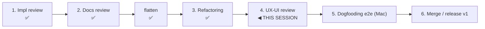

# Handoff — UX-UI Review (PRE-MERGE step 4)

**Status**: Self-contained launcher for the **pre-merge UX-UI review** (roadmap "Pre-merge
review cycle" step 4). **NOT started.** Runs in its **own clean session** after maintainer
go-ahead. Branch `feat/vault/decentralized-config`, commits **LOCAL** (push from the
maintainer's Mac). Written 2026-06-27, after the refactoring review (step 3) shipped.

> **One-line goal.** Evaluate the shipped decentralized-config v1 **CLI surface** for a
> frictionless, coherent, learnable UX: similar verbs do similar things, no two commands are
> redundant paths to the same action, every implemented-and-useful operation is reachable,
> destructive actions confirm, onboarding is minimal, and the surface never leaks internal
> detail the user shouldn't see. Method = `engineering/guides/review-playbooks.md` §4.

---

## 0. TL;DR — what this session does

1. Read the source-of-truth (guiding-principles + the CLI reference + ADR-0023 D1 namespaces)
   and the **review playbook §4**.
2. Run the **UX-UI review** read-only over the CLI surface (`bin/cco` dispatcher + `lib/cmd-*.sh`
   + the user-facing reference `docs/users/reference/cli.md`).
3. Apply the §2 checklist; produce findings with options + a recommendation.
4. Present to the maintainer; **pause and discuss before changing any decided UX** (the command
   surface is partly decided design — ADR-0023 D1 etc.); then apply the approved ones, green per
   step.

This is a **UX** pass. Unlike the refactoring review it **may** propose surface changes — but the
design (ADRs 0005–0028, principles P1–P18) is frozen, so a change that touches a *decided* verb
layout needs maintainer sign-off (and possibly an ADR), not a unilateral edit. Many findings will
be wording / help-text / confirmation-prompt fixes.

---

## 1. Reading order

1. `../../foundation/design/guiding-principles.md` (**P1–P18**, governing law).
2. **This file.**
3. `../../engineering/guides/review-playbooks.md` **§4 UX-UI review** (the method + checklist).
   TEMPORARY staging doc, promoted to the `cave` pack post-merge.
4. The CLI surface: `bin/cco` (the dispatcher / verb table) + the user reference
   `docs/users/reference/cli.md`; the namespaces decision **ADR-0023 D1** (`cco config` vs
   `cco project`); the sharing 2×2 (**ADR-0018**: publish/install vs export/import).
5. `.claude/rules/` — `workflow.md` (phase discipline), `git-workflow.md`,
   `documentation-lifecycle.md`.
6. The carry-in backlog (§3) and the shipped code it points at.

**Precedence on conflict**: guiding-principles → ADRs → design → shipped docs.

---

## 2. Method (review-playbooks §4)

- **Own clean session**, **read-only** w.r.t. production code until the maintainer approves changes.
- Checklist:
  - **Symmetry & learnability** — similar verbs map to the same action/meaning across noun
    families; no ambiguity/confusion. (e.g. do `pack`/`template`/`llms`/`remote`/`project`
    sub-verbs line up? `add`/`remove`/`list`/`show`/`update`/`export`/`import` consistent?)
  - **No multiple paths** to the same action via different commands, unless an explicit,
    documented reason differentiates them.
  - **Completeness / reachability** — operations that are implemented and useful are exposed by
    the CLI. Find features implemented in `lib/` but **not reachable** from any verb / help.
  - **Explicit confirmation** of destructive or sensitive actions (e.g. `forget`, `clean`,
    `*  remove`, `config pull`, `coords --sync`) — reduce accidental data loss.
  - **Simple onboarding** — `init` / `join` / `new` scoped to only the necessary info.
  - **Inform-before-act** — before a destructive/sharing action the user gets all relevant info
    (what will change, where, reversibility).
- **Pause and discuss** before changing a *decided* verb/namespace; wording/help/confirmation
  fixes are low-risk and can proceed once approved.
- **Green per step.** `CCO_ALLOW_HOST_RESOLVE=1 ./bin/test` after each change. Baseline **921/0**
  (post-refactoring-review + L6 fix, 2026-06-27). Atomic LOCAL commits per logical unit.
- A change that **renames a verb / moves a tracked file / changes a `*_FILE_POLICIES` entry**
  needs a migration (`.claude/rules/update-system.md`); a help-text/prompt tweak does not.

---

## 3. Carry-in backlog

- **L8** (from the 26-06 migration review, deferred here by the refactoring review): `cco forget`
  on an untracked / half-migrated project dies with "not tracked — nothing to forget"; the message
  could suggest recovery (`cco join` if `.cco/` exists, or `cco resolve --scan` to re-discover).
  `lib/cmd-forget.sh`. Pure user-facing wording — squarely a UX-review item.

Suggested first sweeps (not exhaustive — derive the rest from the §2 checklist against `bin/cco`):
- **Verb symmetry across noun families** — `pack` / `template` / `llms` / `remote` / `project`:
  compare their `add|install|remove|list|show|update|export|import|publish` sub-verbs for gaps and
  asymmetric naming (e.g. is there an implemented op missing from one family that the others have?).
- **Reachability** — grep `lib/cmd-*.sh` for internal helpers that perform a useful, user-meaningful
  operation with no verb exposing it.
- **Destructive-action confirmation** — audit `forget`, `clean --all`, `* remove`, `config pull`
  (non-fast-forward abort), `project coords --sync` for a preview + confirm (or `-y`).
- **Help/onboarding** — `cco` (no args) / `--help` completeness and consistency; `init`/`join`/`new`
  prompts scoped to the minimum.

---

## 4. Out of scope (later steps / post-merge)

- **Dogfooding e2e on Mac** (step 5) — `P2-dogfooding-validation.md`; re-validate the **flatten**,
  the **global build-extension reader fix** (`a92effc`), and the **L6** container-detection fix on a
  real install.
- **Merge / release v1** (step 6).
- **Post-merge doc ops** — per-domain split of `cli.md` / `context-hierarchy.md` / the
  `configuration-management.md` guide; by-domain redistribution of the `decentralized-config/`
  sprint folder (roadmap backlog).

---

## 5. Working agreement

- Workflow phases (`.claude/rules/workflow.md`): analysis (read-only) → propose with options +
  recommendation → maintainer approves → implement, green per step. **Pause and discuss** before
  changing a decided verb/namespace or any behaviour.
- Atomic LOCAL commits per logical unit; conventional-commit messages; feature branch only
  (`.claude/rules/git-workflow.md` — never `main`/`develop`).
- Gate after each step: `CCO_ALLOW_HOST_RESOLVE=1 ./bin/test` (baseline **921/0**).
- Final: record findings + dispositions in `reviews/<DD-MM-YYYY>-ux-ui-review.md` (decision-history,
  per `documentation-lifecycle.md`); update the roadmap step 4 → done; banner this handoff.

---

## 6. Reference paths

- Method: `../../engineering/guides/review-playbooks.md` §4
- CLI surface: `bin/cco`, `lib/cmd-*.sh`; user reference `docs/users/reference/cli.md`
- Namespaces / sharing decisions: ADR-0023 D1, ADR-0018 (in `decisions/` + living `design.md`)
- Governing law: `../../foundation/design/guiding-principles.md`
- Roadmap entry: `../../roadmap.md` → "Pre-merge review cycle" step 4
- Prior cycle records: `reviews/27-06-2026-refactoring-review.md` (step 3; carries L8 → here)
- Rules: `.claude/rules/{workflow,update-system,documentation-lifecycle,git-workflow}.md`

---

*Generated with Claude Code*
