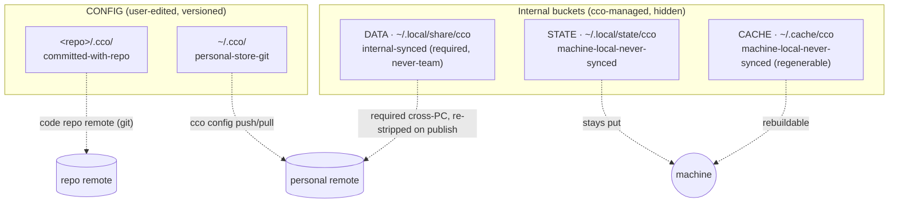

# File Types and Destinations — Design

> **Status**: living

> Consolidates the "which file goes where, and why" rules that are otherwise
> scattered across the decentralized-config design. This document is the
> quick-reference map from a concrete file to its destination bucket and sync
> class. For the full `resource → (bucket, mutator, sync)` taxonomy and the
> rationale behind each decision, the deeper source is
> [decentralized-config/design.md §2](../../decentralized-config/design.md#2-layout)
> (and ADR-0016, the authoritative taxonomy it projects).

---

## 1. The five destinations

cco never invents ad-hoc file locations. Every framework-managed file lands in
**one of five destinations**, grouped into two CONFIG buckets (user-edited,
IDE-reachable, versioned) and three internal buckets (cco-managed, hidden, never
hand-edited). The resolver lives in
[`lib/paths.sh`](../../../../../lib/paths.sh) (`_cco_config_dir`,
`_cco_data_dir`, `_cco_state_dir`, `_cco_cache_dir`) and runs **host-side only**.

| Destination | Path (default) | Override | Nature | Sync class |
|---|---|---|---|---|
| **CONFIG / repo** | `<repo>/.cco/` | — | committed project config | `committed-with-repo` |
| **CONFIG / personal** | `~/.cco/` | — | personal global config store | `personal-store-git` |
| **DATA** | `$XDG_DATA_HOME/cco` → `~/.local/share/cco` | `$CCO_DATA_HOME` | internal, identity-keyed | `internal-synced` (required, never-team) |
| **STATE** | `$XDG_STATE_HOME/cco` → `~/.local/state/cco` | `$CCO_STATE_HOME` | machine-local, non-portable | `machine-local-never-synced` |
| **CACHE** | `$XDG_CACHE_HOME/cco` → `~/.cache/cco` | `$CCO_CACHE_HOME` | regenerable | `machine-local-never-synced` |

**Sync classes**

- `committed-with-repo` — travels with the code repo's own git remote (Axis-1),
  and is byte-identical across a project's config-bearing repos by construction
  (Axis-2). This is normal git; cco does not run a merge engine.
- `personal-store-git` — versioned in the `~/.cco` git store and pushed/pulled
  with `cco config save/push/pull`. Private to the user — **never** shared with a
  team or third party.
- `internal-synced` — internal cco bookkeeping that still needs to follow the
  user across their machines (`required`), but is **never-team** (re-stripped on
  publish). Carried by the DATA-bucket transport, not by any config repo.
- `machine-local-never-synced` — per-machine plumbing. Either non-portable
  (absolute paths, secrets, auth) or fully regenerable; never leaves the machine.

---

## 2. CONFIG / repo — `<repo>/.cco/` (committed with the code)

**Nature.** Per-project, machine-agnostic, user-authored config that lives
**inside the repo it serves** and is versioned with the repo's normal git. Holds
the config of exactly one project — the one the repo *hosts* (`project.yml`'s
`name:`). Mounted into the session and overlaid `:ro` for the structural files
(ADR-0027 D3), so an in-container agent cannot silently mutate it while working
on code.

**Sync class:** `committed-with-repo`.

**What lives here (concrete members)**

| Member | Notes |
|---|---|
| `project.yml` | Logical names + machine-agnostic `url`/`ref` coordinates. **No absolute paths** (those live in the STATE index). |
| `claude/` tree | `CLAUDE.md`, `rules/`, `agents/`, `skills/`, `settings.json` — the project Claude config, copy-synced to `/workspace/.claude`. Authored config only — no generated files. |
| `secrets.env` | **GITIGNORED** real values — the one in-repo exception to "config only". |
| `secrets.env.example` | Committed skeleton (exempt from the secret content scan). |
| `.gitignore` | Ignores `secrets.env` + secret patterns; `!secrets.env.example`. |
| `mcp.json`, `setup.sh`, `mcp-packages.txt` | Project MCP config, setup script, MCP package list (H5). |
| `packs/<name>/` | Optional project-scoped authored pack (no coordinate ⇒ it *is* the source), or last-layer cache of a referenced pack (has a coordinate). |

**Why here.** Project config is owned by the project and must travel with the
code, identically across the project's config-bearing repos — so it belongs in
the repo, carried by that repo's git remote. Putting it in a central store would
break the "machine-agnostic, versioned-with-the-code" invariant and make a
truthful `git diff` impossible. Generated and internal files are deliberately
*evicted* from this tree (see §6) so the commit and the `cco sync` stay clean.

---

## 3. CONFIG / personal — `~/.cco/` (the personal store)

**Nature.** A user-facing, git-versioned store for everything personal and
global to the user, kept as a `~/.cco` **dotdir** (not under `$XDG_CONFIG_HOME`)
on purpose — it is a tree the user authors directly (the `~/.docker` / `~/.cargo`
precedent). Opt-in remote, private by default.

**Sync class:** `personal-store-git` (`cco config save/push/pull`).

**What lives here (concrete members)**

| Member | Notes |
|---|---|
| `.claude/` | Global Claude config: `CLAUDE.md`, `rules/`, `agents/`, `skills/`, `settings.json`, `mcp.json`. Copied once on `cco init`, user-owned thereafter. |
| `packs/<name>/` | Authored knowledge packs (flat by name): `pack.yml` + content. |
| `templates/<name>/` | Authored project/pack templates. |
| `languages` | The single config datum split out of the legacy `.cco/meta`; regenerates `language.md`. |
| `secrets.env` / `secrets.env.example` | Global secrets (gitignored) + committed skeleton. |
| `setup.sh`, `setup-build.sh`, `mcp-packages.txt` | Global runtime/build setup + MCP package list. |
| `.git/`, `.gitignore` | The store's own git + an allowlist `.gitignore` (only `packs/`, `templates/`, `.claude/` and the few config files are committed). |

**Why here.** These resources are personal and cross-project but **not** tied to
any one code repo, so they cannot ride a repo remote. They are also genuine
user-authored config (edited in an IDE or via the config-editor session), so
they belong in a versioned store the user controls — not in the hidden internal
buckets. Note what is deliberately **not** here: `tags.yml` → DATA, llms content
→ CACHE, `backups/` → STATE, and there is no `manifest.yml` (sharing discovery is
structure-based).

---

## 4. DATA — `~/.local/share/cco` (internal but synced)

**Nature.** Internal cco bookkeeping that is hidden and never hand-edited, yet
must follow the user across their machines. Centralized and keyed by resource
identity (config decentralizes, internal centralizes).

**Sync class:** `internal-synced` — `required` cross-PC, `never-team` (re-stripped
on publish so it never reaches a third party).

**What lives here (concrete members)**

| Member | Notes |
|---|---|
| `tags.yml` | Per-user global tag registry, typed keys `{packs, projects, templates}` → `[tags]`. Powers `cco list --tag`. |
| `remotes` | De-tokenized sharing-repo endpoint registry: `name → url` (the **token** is split out to STATE). |
| `projects/<id>/source` | Install-provenance: the upstream coordinate **only** (`url`/`ref`/`resource`), keyed by project identity. |
| `packs/<name>/source` | Idem, keyed by pack name. |
| `templates/<name>/source` | Idem, keyed by template name. |

**Why here.** Tags, the remotes registry, and install provenance are not
user-authored config (so they don't belong in either CONFIG bucket) but they
*are* portable, meaningful state the user expects to find on every machine — so
they cannot live in machine-local STATE/CACHE either. DATA is the dedicated home
for "internal but required-synced". The `source` file is kept a pure upstream
coordinate; machine-local bookkeeping (`commit`/`installed`/`version`) is split
to STATE so nothing machine-local rides a `required`-synced file, and the
de-tokenized registry keeps secrets off the synced path.

---

## 5. STATE — `~/.local/state/cco` (machine-local, never synced)

**Nature.** Per-machine, non-portable runtime/auth state and the absolute-path
index. Hidden, never hand-edited, never synced.

**Sync class:** `machine-local-never-synced`.

**What lives here (concrete members)**

| Member | Notes |
|---|---|
| `index` | Logical name → absolute host path, and project → member repos. Subsumes the removed `@local` markers and per-repo `local-paths.yml`. |
| `remotes-token` | Sharing-repo auth tokens, `0600`, isolated from the DATA registry (the M3 secret split). |
| `last_seen` / `last_read` | Global changelog markers. |
| `claude.json`, `.credentials.json` | Seeded Claude preferences/MCP metadata and OAuth tokens. |
| `sync-meta` | Sync-set membership + last-synced fingerprints. |
| `backups/` | Vault-migration archives (moved out of `~/.cco`). |
| `global/update/{meta,base}` | Global update artifacts: per-file hash manifest, `schema_version`, policies, flags + the 3-way-merge ancestors. |
| `projects/<id>/update/{meta,base}` | Per-project update meta (incl. `installed-commit`) + merge ancestors. |
| `projects/<id>/session/{memory,claude-state}` | Auto-memory + session transcripts (the future opt-in state-sync boundary). |
| `projects/<id>/docker-compose.yml`, `.tmp/` | Generated compose + dry-run scratch. |
| `packs/<name>/update/base`, `templates/<name>/update/{meta,base}` | Pack/template sync-before-publish merge ancestors + template install meta. |

**Why here.** These files are either non-portable (the index holds host-absolute
paths that only make sense on this machine; compose embeds them too), security-
sensitive (tokens, credentials), or load-bearing internal merge state that must
never be swept into a cross-PC/cross-team sync. The `/session` (opt-in) vs
`/update` (never) split inside `projects/<id>/` is the allowlist boundary that
protects future state-sync from ever exporting base/hashes/tokens.

---

## 6. CACHE — `~/.cache/cco` (regenerable)

**Nature.** Re-fetchable downloads and framework-generated overlays. Hidden,
never hand-edited, safe to delete (cco regenerates it).

**Sync class:** `machine-local-never-synced` (regenerable).

**What lives here (concrete members)**

| Member | Notes |
|---|---|
| `llms/<name>/` | llms.txt **content** download + its cache-state sidecar (`etag`, `resolved_url`, `downloaded`). Re-fetched from the coordinate. |
| `installed/` | Sharing-repo clones used for install/update. |
| `remote_cache` | Remote HEAD + timestamp (avoids re-hitting the network on update checks). |
| `projects/<id>/.claude/` | Generated overlays `packs.md` and `workspace.yml`, mounted `:ro` over `/workspace/.claude`. |
| `projects/<id>/managed/` | Generated `browser.json`, `github.json`, `policy.json`, mounted `:ro` into `/workspace/.managed`. |
| `*.bak`, `dry-run/` | Update artifacts cleaned by `cco clean`. |

**Why here.** Everything in CACHE can be reproduced from a source of truth: llms
content from its coordinate, clones from the remote, overlays (`packs.md`,
`workspace.yml`, `docker-compose.yml`, `managed/*.json`) from `project.yml` at
the next `cco start`. Generated overlays are kept out of the committed
`<repo>/.cco/` tree precisely so they don't pollute the truthful `git diff` or
the `cco sync`; they are layered back into the session via nested `:ro` mounts.
Because it is all regenerable, CACHE is never synced.

---

## 7. Decision shortcut

When adding a new framework-managed file, ask in order:

1. **Is it user-authored config?** → CONFIG. Tied to a code repo? `<repo>/.cco/`.
   Personal/global? `~/.cco/`.
2. **Is it regenerable from a source of truth?** → CACHE.
3. **Is it portable internal state the user needs on every machine?** → DATA
   (and keep secrets/machine-local bits out of it — split them to STATE).
4. **Otherwise** (non-portable, secret, or internal merge/auth state) → STATE.

> Anchor it against the authoritative taxonomy before committing: the
> `resource → (bucket, mutator, sync)` table in
> [decentralized-config/design.md §2](../../decentralized-config/design.md#2-layout)
> and ADR-0016. The field-level user view of `project.yml` lives in the
> [project.yml reference](../../../../users/configuration/reference/project-yaml.md).
