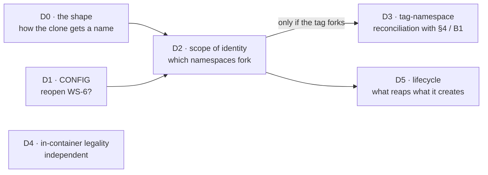
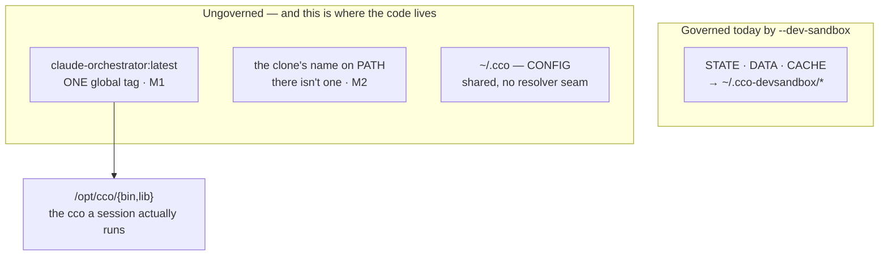
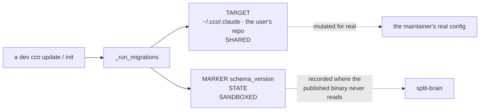
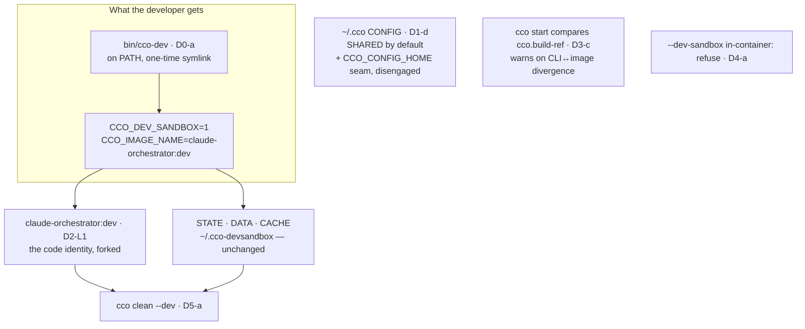

# Developer execution mode — decision clinic

> **Gate artifact, awaiting a ruling.** This document exists so the six decisions that gate
> `/design` for [A10](../../roadmap.md) can be answered against evidence rather than against a
> conversation. It is **decision support, not a design**: it selects nothing, and every
> recommendation in it is stated as a recommendation and defended.
>
> **Inputs, not restated here**: the approved analysis
> [`dev-execution-mode.md`](dev-execution-mode.md) (§11.0 what was already ruled, §11.1 what is
> open, §12.1 the host probes), the [A10 roadmap entry](../../roadmap.md), and
> [FI-79](../../improvements.md) / [FI-80](../../improvements.md).
>
> **Measurement provenance.** Everything cited as measured was measured — either by the approved
> analysis (cited by section) or by this session against the same clone, on
> `feat/devmode/dev-execution-mode`. Nothing new was inferred from the host: this session runs
> in-container. Claims that remain **asserted** are marked as such.

## 0. How to answer this

Six decisions, `D0` … `D5`. Five are the analysis's §11.1 questions; **`D0` is not in that list**
and is raised here because the design cannot pick a shape without it — see §*D0* for why it was
not visible when §11.1 was written.

Answer per decision with the option letter. Where an option is accepted with a modification, say
which. The rulings become **one ADR** at the design gate; this file stays as the historical record
of what was on the table.

**Dependency between the decisions** — `D3` is moot unless `D2` takes the image tag; everything
else is independent:

## 1. Already ruled — do not re-litigate

From the direction gate, 2026-08-27 (analysis §11.0):

- **Both CLIs stay installed.** The cheap collapse — a `CONTRIBUTING.md` change plus a
  PATH-shadowing check — is **explicitly rejected**, not overlooked.
- **The identity oracle lands first, as its own unit.** Shipped as A11 (`cco whoami` host branch +
  `LABEL cco.build-ref`), built, tested and host-verified; only its merge is owed.

## 2. The three measurements every option below is judged against

These are the analysis's, restated in one place because each option's cost is a function of them.

| # | Measurement | Where |
|---|---|---|
| **M1** | **The image tag is the code identity of the in-session cco.** `Dockerfile:201-211` bakes `bin/` + `lib/` into `/opt/cco` and symlinks `/usr/local/bin/cco`; a normal session mounts **no host `lib/`**. `IMAGE_NAME` is hardcoded at `bin/cco:37` with no override, so both binaries `-t` **one global tag** and overwrite each other — sandbox or not | analysis §3.1 |
| **M2** | **The clone has no name on PATH.** `which -a cco` printed the *same path twice* — one binary through a duplicated PATH entry, not two installs. So coexistence is a state **to create**; the ergonomic complaint is *the clone has no name*, not *which one wins*; and "detect the other install and warn" has, today, **nothing to detect** | analysis §12.1 |
| **M3** | **The version gate is dormant, not bypassed.** npm `latest` and the clone are both `0.6.0`, both `CCO_INDEX_VERSION=2`, both max migration `017`, across 148 commits. `cco --version` is a **non-discriminating oracle** — any acceptance test built on it is a false pass by construction | analysis §2, §12.1 |

The shape of the problem, as measured — the sandbox governs the left half, and the left half is not
the half that decides which code runs:

---

## D0 — The shape: how does the developer name the clone?

### Context

**Why this is here and not in §11.1.** When §11.1 was written the working premise was *two installs
that shadow each other*; the host probes then measured **M2** — there is exactly one binary on PATH
and the clone has no name at all. That reframes the question from *which one wins* to *what do you
type*, and no §11.1 question asks it. `D2` (scope) and `D5` (lifecycle) both need the answer:
whatever the developer types is the thing that must carry the identity and the thing the reaper must
know about.

Analysis §10 put four shapes on the table (**A** a second shim · **B** dispatch by `exec` from the
published binary · **C** a sourced profile · **D** extend `--dev-sandbox` only). §11.0's ruling keeps
**A** and **B** in play. Today the invocation is `~/claude-orchestrator/bin/cco …` — positional,
cwd-dependent, and the thing the maintainer complained about.

### Options

**D0-a — `bin/cco-dev`, a shim in the clone the developer symlinks onto PATH once.**
Three lines: export the dev env, `exec "$(dirname …)/cco" "$@"`.

- **Pros.** Ships with the clone, so it works **this cycle** with no npm release. It gives the clone
  a *name*, which M2 says is the actual defect. `cco` keeps meaning exactly what it means today, so
  the published binary's behaviour is untouched — zero user-visible blast radius. It composes with
  every other decision below: whatever `D1`/`D2` decide, the shim is where the env is set.
- **Cons.** ⚠ **A packaging trap, measured**: `package.json` `files` lists **`"bin/cco"`, not
  `"bin/"`**, while `Dockerfile:201` does `COPY bin/` and `.dockerignore` does not exclude `bin/`.
  So a new `bin/cco-dev` is **baked into the image and never published to npm**, and
  `scripts/check-pack-hygiene.sh` is a **denylist** over `npm pack --dry-run` that would not catch
  the omission. The design must rule the two placements deliberately (publish it? exclude it from
  the image?), not inherit them. Second con: the developer still runs one `ln -s`, a
  `CONTRIBUTING.md` step — but a **one-time** one, not per invocation.

**D0-b — `cco --dev <cmd>` / `CCO_DEV_REPO`: the published binary `exec`s into the clone.**

- **Pros.** One name to remember. The analysis verified the mechanics survive the resolution: `exec`
  sets `BASH_SOURCE[0]` to the absolute target, the readlink loop at `bin/cco:21-25` finds no
  symlink, `REPO_ROOT` lands on the clone, and because `exec` replaces the process image the outer
  EXIT trap at `bin/cco:14` never fires (no spurious `✗ cco exited unexpectedly`). The clone needs
  nothing on PATH at all.
- **Cons.** 🔴 **It cannot be used until an npm release carrying the dispatcher ships** — the
  installed `0.6.0` cannot dispatch (analysis §5, and §11.0 carries the consequence). So it does not
  solve the maintainer's problem in this cycle. It needs `CCO_DEV_REPO` to live somewhere, and the
  natural home is CONFIG — coupling it to `D1`. And a flag that changes *which binary executes* sits
  in a parser with **no `--` terminator handling** (`grep -n '"--")' lib/*.sh bin/cco` → zero hits):
  harmless today, a latent defect the day any verb gains passthrough args.

**D0-c — a sourced profile (`activate.sh` / direnv shape).**

- **Pros.** **Prior art exists in-repo**, written by this project for this purpose:
  `scripts/cco-sandbox-e2e.sh` redirects `HOME` plus all four roots and delivers the environment
  through a sourced `activate.sh`. It composes with anything and needs no new binary.
- **Cons.** Its own header names the trap — *"`export`s set by a subprocess do NOT survive into your
  shell"* — so it must be **sourced**, and the resulting state is **active but invisible**: nothing
  in the prompt says you are in it, and `cco whoami` becomes the only way to find out. The analysis
  calls this *"the invisible-active-state cost, already paid once here"*. It is the shape most likely
  to produce the next incident, in a different costume.

**D0-d — do nothing new: document `--dev-sandbox` harder in `CONTRIBUTING.md`.**

- **Pros.** Zero cost, zero surface.
- **Cons.** It **does not give the clone a name**: the invocation becomes
  `~/claude-orchestrator/bin/cco --dev-sandbox …`, which is *longer* than the thing complained
  about. It answers none of M1, M2 or M3. Listed so the null option is on the record, not because it
  is competitive.

### Recommendation — **D0-a**, with **D0-b kept available and explicitly deferred**

`bin/cco-dev`, because it is the only option that removes M2 **in this cycle** and the only one whose
blast radius on the published binary is nil. The packaging trap is a two-line ruling, not a risk, once
it is decided rather than inherited.

**D0-a does not preclude D0-b.** A dispatcher can land in Block B once a release carrying it exists,
and it would then be a second front door to the same identity — not a redesign. Say so in the ADR so
the option is deferred with a reason instead of dropped.

Against **D0-c**: this project's whole `false-success-class-audit.md` is about states that read as
working. An invisible active mode is that class.

### Product & UX impact

| Who | What changes |
|---|---|
| **User** (npm install, never touches the clone) | **Nothing.** `cco` resolves, behaves and names its image exactly as today. If `bin/cco-dev` is added to `package.json` `files` they gain one unused file in `node_modules`; if it is not, they see nothing at all |
| **Developer** | Types `cco-dev <verb>` from any cwd instead of `~/claude-orchestrator/bin/cco <verb>`. One-time `ln -s` in `CONTRIBUTING.md` replaces the current two-option "put `bin/` on PATH **or** `npm link`" section — and `npm link`, which **substitutes** the published shim, stops being the recommended route |
| **Agent in a session** | Unchanged — `cco-dev` is host-only by construction (`D4`) |

---

## D1 — Is the WS-6 "CONFIG stays shared" call reopened?

### Context

`--dev-sandbox` redirects STATE/DATA/CACHE; **CONFIG (`~/.cco`) stays shared** by the explicit WS-6
call, whose rationale is *"all three gate/reconcile inputs live in the redirected buckets, so
isolating those three is sufficient"* (`lib/paths.sh:562-583`). The analysis's verdict, §6:
**true as written and insufficient as a safety argument** — it reasons about the *gate's inputs*,
while the exposure is in the *migration engine's targets*. Measured: `_run_migrations` runs
**target-shared / marker-sandboxed** — target `~/.cco/.claude` (`lib/update.sh:138`) and target
**the user's repo** (`:432`, so the mutation gets committed), while the marker `schema_version`
lives in sandboxed STATE. Worst reachable writer: `cco init --force` → `rm -rf "$gclaude"`
(`lib/cmd-init.sh:198`) re-seeded from the **dev tree's** defaults. Frequency, also measured: only
**2 of 17** global migrations touch CONFIG at all.

⚠ Reopening is **not** only an ADR annotation: `tests/test_dev_sandbox.sh:75-86`
(`test_dev_sandbox_config_stays_shared`) **pins** `CONFIG=$HOME/.cco` and asserts the string
`.cco-devsandbox` never appears. And `_cco_config_dir()` (`lib/paths.sh:455-460`) is a literal
`$HOME/.cco` with **no override seam** — `CCO_CONFIG_DIR` exists only as a template placeholder and
in unset-lists, not as a resolver. So isolating CONFIG costs either a new seam or a `$HOME` redirect.

### Options

**D1-a — Keep CONFIG shared; write the split-brain down.** No code, no test change; an ADR section
naming the target/marker split and enumerating the CONFIG writers reachable from a dev run
(analysis §6.3, eight of them).

- **Pros.** Zero cost. The WS-6 rationale is genuinely good *for its own purpose*: CONFIG holds the
  developer's **authored, git-versioned** packs/templates/`.claude`, and forking it forks the thing
  the maintainer is usually dogfooding — this very project's sessions adopt `core-dev-framework`
  from `~/.cco/packs`. Measured frequency is low (2/17 migrations; `cco init --force` is a
  deliberately destructive verb).
- **Cons.** The exposure stays, now as *documented accepted risk*. `cco init --force` from a dev tree
  still destroys the real `~/.cco/.claude`; `cco update`'s project migration still commits into a
  repo. "We wrote it down" is not a control.

**D1-b — Fork CONFIG too: add `CCO_CONFIG_HOME` and engage it under the sandbox.**

- **Pros.** Symmetric with the other three buckets. Closes the target/marker split at the root.
  Makes `--dev-sandbox` mean what a developer already believes it means: *nothing of mine is
  touched*.
- **Cons.** Changes a pinned test and reverses an ADR call. It **forks the authored store**, so a
  dev session does not see the packs the maintainer wrote — dogfooding breaks in a way that is
  itself a source of confusion. ⚠ And a measured asymmetry it does not fix: `cco build` reads the
  **real** CONFIG regardless of the sandbox (`~/.cco/mcp-packages.txt`, `setup-build.sh`,
  `claude-version` — `lib/cmd-build.sh:73-104`), so a forked CONFIG silently changes what a dev
  build bakes unless it is seeded — a **new** seed obligation, on top of `D5`'s.

**D1-c — Keep CONFIG shared, but make the destructive writers refuse under an active dev sandbox**
(`cco init --force`, `cco update --sync`, the CONFIG-targeting migrations).

- **Pros.** Removes the worst reachable writer without forking the authored store. Cheap, targeted,
  and in the project's fail-loud idiom.
- **Cons.** It is a **denylist over a class the analysis explicitly called a lower bound** — a
  CONFIG writer added tomorrow inherits no protection. And it makes the dev binary *less capable*
  than the published one exactly where that hurts most: a maintainer developing migration `018`
  needs to **run** it.

**D1-d — Add the `CCO_CONFIG_HOME` seam but leave it disengaged by default**; `--dev-sandbox` keeps
CONFIG shared, and a developer working *on* config code opts in.

- **Pros.** The seam is independently worth having: today the only way to isolate CONFIG is a `$HOME`
  redirect, which `tests/helpers.sh` and `scripts/cco-sandbox-e2e.sh` both pay for the hard way, and
  which drags every other `$HOME`-derived path with it. Default behaviour unchanged ⇒ the pinned test
  stays green ⇒ no ADR reversal, only an extension.
- **Cons.** **Opt-in protection protects nobody who did not think of it**, and the 2026-08-27
  incident is precisely a case of not thinking of it. Two dev modes to document instead of one.

**D1-e — Keep CONFIG shared and move the marker to CONFIG**, so target and marker are always on the
same side of the boundary.

- **Pros.** Fixes the actual defect — the *split* — rather than its symptom, and without forking the
  authored store. A dev-run migration that mutates real CONFIG would then be *recorded where the
  published binary reads it*, so the published binary neither re-runs it nor is confused by it.
- **Cons.** It relocates a versioned marker between buckets — a migration **of the migration
  system**, with its own compatibility window. And `schema_version` sits in STATE by an explicit
  taxonomy call (machine-local state, not user config), so moving it **pre-empts the cross-cutting
  resource-taxonomy analysis** that is already scheduled for exactly this kind of question. It also
  legitimises dev runs mutating real config rather than discouraging them.

### Recommendation — **D1-d + D1-a**, and hand the marker question to the taxonomy analysis

Concretely: **do not fork CONFIG by default** (the WS-6 rationale holds, and dogfooding depends on
it) — **add the missing `CCO_CONFIG_HOME` resolver seam** so CONFIG isolation stops requiring a
`$HOME` redirect — **write the split-brain down** with the eight reachable writers named — and
**refer the target/marker split to the cross-cutting resource-taxonomy analysis** rather than
settling it inside A10.

Defended: the seam is the part with value independent of this decision (tests want it now), costs no
behaviour change, and keeps `tests/test_dev_sandbox.sh:75-86` green as written. Full isolation
(`D1-b`) trades a **low-frequency, deliberate-verb** risk for a **high-frequency, every-session**
dogfooding break — a bad trade on the measured numbers. `D1-e` is the intellectually correct fix and
is exactly why it should not be decided here: it belongs to the taxonomy analysis that will decide
which bucket versioned markers live in, for every bucket, once.

**One narrow guard is worth taking anyway, and it is `D1-c` reduced to a single site**: `cco init
--force` refuses when a dev sandbox is active and CONFIG is not isolated. It is the one *irreversible*
writer in the list (an `rm -rf` of the real `~/.cco/.claude`), the guard is a two-line condition, and
unlike a general denylist it makes no claim to cover a class. Take it or leave it independently of
the rest — say which.

### Product & UX impact

| Who | What changes |
|---|---|
| **User** | **Nothing.** `CCO_CONFIG_HOME` unset ⇒ `_cco_config_dir` resolves exactly as today. The seam is invisible until someone sets it |
| **Developer** | `--dev-sandbox` keeps sharing packs/templates/`.claude` — the dogfooding path is unchanged. A developer *working on config code* can now set one env var instead of redirecting `$HOME`. If the narrow guard is taken: `cco-dev init --force` refuses with a message naming the isolation env var, instead of destroying the real store |
| **The suite** | Gains a real seam for CONFIG isolation; `tests/test_dev_sandbox.sh:75-86` stays green **as written**, which is the check that the default did not move |

---

## D2 — What is the scope of dev identity?

### Context

Four cumulative layers. **L0** buckets only (what ships today) · **L1** + the image tag · **L2** +
container and network names · **L3** + CONFIG (= `D1-b`, decided above). M1 is the whole argument
for L1: the tag decides which `bin/` + `lib/` a session actually runs, and it is **one global tag**
both binaries overwrite.

Measured surface of a tag axis: **6 functional consumers** — `lib/utils.sh:380,381` (`check_image`
and its `die`), `lib/cmd-new.sh:123`, `lib/cmd-start.sh:1590`, `lib/cmd-build.sh:107,163` — plus
**7 documentation surfaces**, including `FROM claude-orchestrator:latest` in the custom-image guide.
⭐ **The tag is a published user contract**, so the default must not move.

Two adjacent global namespaces, neither dev-aware: `container_name: cc-${project_name}`
(`lib/cmd-start.sh:1984`) and `network` defaulting to `cc-${project_name}` (`:1597`).

⚠ **A limit of any tag axis, worth naming now**: `project.yml`'s `docker.image` **already** overrides
`$IMAGE_NAME` (`lib/cmd-start.sh:1589-1590`). A project that pins a custom image built
`FROM claude-orchestrator:latest` does **not** follow the dev tag. The tag axis therefore covers the
default path, not every path — which is one of the reasons `D3`'s label check earns its place.

### Options

**D2-L0 — buckets only; add nothing.**

- **Pros.** Zero cost.
- **Cons.** M1 says this is precisely the half that does **not** decide which code runs. The
  incident recurs unchanged. On the record as the null option.

**D2-L1 — buckets + image tag.**

- **Pros.** The smallest addition that changes *which code runs in a session*, i.e. the only layer
  whose absence is **correctness** rather than ergonomics. Six functional consumers, all reading one
  variable, so the change is mechanical once the seam exists.
- **Cons.** A second image on the machine (a real disk cost, and the reason `D5` exists). Six
  consumers and seven doc surfaces must stay coherent. ⚠ **Implementation constraint**: `IMAGE_NAME`
  is assigned at `bin/cco:37`, **before** the flag strip at `:141` — an env seam
  (`CCO_IMAGE_NAME`, which does **not** exist today) works there unchanged, but a *flag*-driven tag
  needs the assignment moved or re-evaluated after `_cco_apply_dev_sandbox`.

**D2-L2 — + container and network names.**

- **Pros.** Lets a dev session and a real session for the **same project** run at once. The running
  registry is in sandboxed STATE, so without this the two do not see each other.
- **Cons.** What actually happens today is a **legible Docker refusal** — `container_name` already
  in use — not silent corruption. So L2 buys **ergonomics, not correctness**. And the namespace is
  contested: **B2** (`cco attach`) is about to rewrite container naming. YAGNI plus a scheduled
  owner ⇒ defer.

**D2-L3 — + CONFIG.** Decided in `D1`; not re-opened here.

### Recommendation — **L1**, with L2 deferred to B2 by name

Take the image tag; leave container/network names alone. The discriminator is the one the analysis
supplies: **L1's absence is measured correctness (M1), L2's absence is a Docker error message.**
Shipping L2 now would also decide, inside A10, a namespace B2 has been scheduled to design.

Mechanism recommended: **`CCO_IMAGE_NAME` env seam at `bin/cco:37`**, defaulting to
`claude-orchestrator:latest` — the published contract, unmoved — with the dev shim (`D0-a`) and
`--dev-sandbox` both setting it. ⚠ **Make `--dev-sandbox` itself switch the tag**, not only the shim:
otherwise the *documented* flag keeps half an identity and stays the trap it is today. Name that as
what it is — **a behaviour change to a shipped, documented flag** (`docs/users/reference/cli.md`
§3.34): a script that runs `cco --dev-sandbox build` would, after this, build a different tag, and
`cco --dev-sandbox start` would fail `check_image` until a dev image exists. Host-only, dev-only,
and the failure is legible — but it is a change, and it should be ruled, not slipped in.

### Product & UX impact

| Who | What changes |
|---|---|
| **User** | **Nothing, by construction.** `CCO_IMAGE_NAME` unset ⇒ `claude-orchestrator:latest`, so `FROM claude-orchestrator:latest`, `project.yml docker.image`, `check_image`'s message and all 7 doc surfaces read exactly as today |
| **Developer** | `docker images` shows two cco images instead of one (**and the disk to match** — the reason `D5` is not optional). `cco-dev build` no longer overwrites the image a real session uses, which is the incident. `cco-dev start` uses the dev image; forgetting to build it fails at `check_image` with a message that must now name **which** image is missing |
| **Anyone who scripted `--dev-sandbox`** | Their build now produces `claude-orchestrator:dev`. Realistically one person; still a documented-flag change |

---

## D3 — Does a tag axis pre-empt `packaging-distribution.md` §4's deferred `:<package.version>` tagging?

> Moot unless `D2` takes the tag.

### Context

`engineering/design/packaging-distribution.md` §4 (`:141-154`, restated in the §8 DoD at `:240`)
**explicitly parks the tag**: *"v1 keeps the image tag `claude-orchestrator:latest` (`IMAGE_NAME` in
`bin/cco`); tagging the image with `:<package.version>` is a later refinement."* So the tag is
already a deferred item **with a named owner**. If A10 adds a second tag, someone owns reconciling
the two schemes — and the analysis flagged the compound risk: A10's tag axis, **B1** (`cco build`
inside `cco update`) and **B2** (container naming) all touch one namespace, and *"sequencing is
cheaper than three passes."*

### Options

**D3-a — Declare the axes orthogonal, in one sentence, now.** `claude-orchestrator:latest` stays the
published default; `claude-orchestrator:dev` is a **channel**, not a version; when §4's refinement
lands it applies to the **published channel** (`:<version>` plus a moving `latest`) and leaves the dev
channel alone.

- **Pros.** The cheapest possible reconciliation, because the two axes genuinely do not collide once
  someone says so. It discharges the "three designs, one namespace" risk by writing the shape down
  where B1 and B2 will read it.
- **Cons.** It is a decision taken inside A10 that **binds a Block B design not yet written**. If B1
  later wants `:<version>-dev`, the sentence needs an ADR amendment — cheap, but it is one.

**D3-b — Take no position: use an opaque `dev` tag and let §4's refinement reconcile later.**

- **Pros.** No pre-emption; A10 stays minimal.
- **Cons.** "No position" is exactly how a namespace gets discovered late — the failure the analysis
  named. And it is not even true: occupying the literal tag `dev` **is** a position, just an
  undeclared one.

**D3-c — Do not fork the tag; discriminate by label.** Keep one tag and make `cco start` compare the
image's `cco.build-ref` (A11's `LABEL`) against the running CLI's own `_cco_build_ref "$REPO_ROOT"`,
warning or refusing on divergence.

- **Pros.** No namespace decision at all, no second image, no disk cost, and the
  `FROM claude-orchestrator:latest` contract is untouched. It uses A11's instrument for exactly what
  it was built for, and it is one of the **three residues A11 deliberately left unbuilt** — so it is
  already scoped, and its absence is a known gap.
- **Cons.** 🔴 **It gives detection, not coexistence.** The two binaries still overwrite one image,
  so switching still means rebuilding. The direction gate ruled **coexistence**, so on its own this
  under-delivers the ruling.

### Recommendation — **D3-a *and* D3-c**, as complements rather than alternatives

They answer different questions. **D3-a** buys coexistence and costs one sentence in
`packaging-distribution.md` §4 plus the same sentence in the A10 ADR. **D3-c** buys detection for
everything the tag does **not** cover — the measured gap in `D2`: a project pinning
`project.yml docker.image` never follows the dev tag, and a user who is not in dev mode at all can
still be running a `latest` that a dev `cco build` produced. That case is the original 2026-07-15
incident and no tag axis closes it.

⚠ **`D3-c` is the second of A11's three deliberate residues** (*`cco start` does not warn on a
CLI↔image divergence*). Taking it here closes it with the instrument already built; leaving it open
means the residue outlives the unit that made it computable.

### Product & UX impact

| Who | What changes |
|---|---|
| **User** | With `D3-a`: nothing. With `D3-c`: a **new warning at `cco start`** when the image on the machine was built from a tree that is not the CLI's. That is user-perceivable and must be ruled as such: `warn` (proceed) or `refuse` (stop)? ⭐ **Recommend `warn`** — the divergence is usually intended (a user who built once and updated the CLI), and ADR-0059's producer taxonomy puts "an accepted divergence the user can act on" in `warn`, not `die` |
| **Developer** | Two images with declared meanings; the warning tells them which tree built the image before a session starts, instead of after a confusing one |
| **B1 / B2** | Inherit a written namespace instead of discovering one |

---

## D4 — Is the dev surface legal in-container?

### Context

Measured (analysis §7): the flag strip at `bin/cco:141-152` runs **unconditionally**, and
`_cco_apply_dev_sandbox` returns 0 under `_cco_in_container` (`lib/paths.sh:634`). So
`cco --dev-sandbox <verb>` inside a session is **silently consumed and silently ignored** — the flag
is accepted, removed from argv, and does nothing. Whatever surface A10 adds inherits that shape
unless it decides otherwise. Host-only is not in question — a session's operator buckets **are** the
sacred `cco start` mounts (ADR-0047), pre-created behind the privilege boundary. The question is what
happens when someone asks anyway.

### Options

**D4-a — Refuse.** `refuse` (exit 2), naming the host as where it belongs.

- **Pros.** Fail-loud, with a precedent one block above it: `bin/cco:128` already refuses every
  invocation at `cco_access=none` with exit 2. **A flag that silently does nothing is a false-success
  surface**, and this repo keeps a whole audit of that class
  (`engineering/analysis/false-success-class-audit.md`). It teaches the boundary at the moment the
  boundary is touched.
- **Cons.** A script that passes the flag defensively would start failing in-session. **Nothing
  measured suggests one exists** — say so rather than assume it away.

**D4-b — Ignore, with a `note` or `warn`.**

- **Pros.** Non-breaking and informative.
- **Cons.** A warning that is always ignorable trains people to ignore warnings, and it leaves a flag
  whose meaning depends on where you are standing.

**D4-c — Leave it silent.**

- **Pros.** Zero cost.
- **Cons.** It is the exact shape this repo has paid for repeatedly. On the record as the null
  option; not competitive.

### Recommendation — **D4-a, and fix the existing `--dev-sandbox` swallow in the same change**

A10 is the unit that touches this parser block; leaving a known false-success one line from an edit
is how it survives another cycle. Placement is already correct: the strip sits at `:141`, **after**
the `cco_access=none` refusal at `:128`, so a `none` session still gets its own refusal first and
this one fires only for operator sessions.

### Product & UX impact

| Who | What changes |
|---|---|
| **User** | **Nothing** — the flag is host-only and dev-only; a user never types it |
| **Developer / agent in a session** | `cco --dev-sandbox …` in-container stops returning 0 and starts refusing with a message that names the host. Today's behaviour is a lie that reads as success |

---

## D5 — Which lifecycle verbs are in scope now, and which are deferred?

### Context

Six gaps, measured (analysis §8): **re-seed** — `_cco_dev_sandbox_seed` opens with
`[[ -d "$root/state" ]] && return 0`, one-shot **permanently**, so refreshing means `rm -rf` by hand
· **backup** — the J0 legacy-vault backup lands in `<state>/backups`, i.e. *inside* the sandbox when
active, so it backs up nothing real · **reset/cleanup** — `cco clean` has categories
`bak|new|tmp|generated`, never scans CACHE, and knows nothing about `~/.cco-devsandbox` · **doctor**
— **there is no `cco doctor` verb at all** · **listing** — `CCO_DEV_SANDBOX_ROOT` is arbitrary per
invocation and nothing records which roots exist · **Docker-side** — nothing reaps a dev image,
container or network, because none has a dev identity yet.

⭐ The load-bearing asymmetry: five of the six are **pre-existing** debt. But if `D2` takes **L1**,
A10 *creates* a new orphan class — a multi-gigabyte dev image — that did not exist before. Shipping a
new identity without a reaper adds an orphan class to a project that already tracks one (ADR-0045's
running registry).

### Options

**D5-a — Reaper only**: one command that removes what the dev identity creates — the sandbox root
and, under L1, the dev image.

- **Pros.** Discharges exactly the obligation A10 creates and nothing more. Nothing else in the six
  is a correctness gap.
- **Cons.** Re-seed and listing stay hand-rolled — which is what happens today, so no regression, but
  no relief either.

**D5-b — Reaper + re-seed** (a `--reseed` that clears and re-seeds in one step).

- **Pros.** Today the refresh is `rm -rf ~/.cco-devsandbox && cco --dev-sandbox-seed …`, and the
  first half is a **destructive path typed by hand** — a footgun with no undo. A flag removes it.
- **Cons.** One more global flag on a binary that already carries `--dev-sandbox` and
  `--dev-sandbox-seed` with no home.

**D5-c — Reaper + re-seed + a `cco dev` verb group** (`cco dev status|clean|reseed`).

- **Pros.** Discoverable; consolidates flags that are already three-deep with no namespace.
- **Cons.** ⚠ A **new top-level verb is a user-facing surface decision** in a session that has not
  been asked for one, and it collides with B2/B3's CLI-shape work. And `cco dev status` would
  **duplicate what A11 just shipped** in `cco whoami` — one concept, two homes, which is the rule
  this project enforces hardest.

**D5-d — Defer all six**; record them as accepted debt with an owner.

- **Pros.** Smallest possible unit.
- **Cons.** Only honest if `D2` = L0. Under L1 the dev image is **new** debt created by this unit, not
  inherited.

### Recommendation — **D5-a**, as `cco clean --dev`

Extend an existing verb rather than invent one: `cco clean` already means *remove what cco created*,
already has `--dry-run`, and already takes a category flag — so the destructive preview is free and
no new user-facing verb is decided here. Scope: the sandbox root (`_cco_dev_sandbox_root`) and, under
L1, the dev image.

⚠ **One honest wrinkle to rule with it**: today `cco clean` removes *files* (`.bak`/`.new`/`.tmp`/
generated), never Docker objects. Putting `docker rmi` behind it widens what the verb does. The
alternative is a documented `docker rmi claude-orchestrator:dev` in `CONTRIBUTING.md` — cheaper, and
"docker artifacts get a docker verb" is a defensible line. **Recommend widening it**: a reaper that
covers half of what the identity creates is the kind of half-measure that leaves the other half
orphaned, and `--dry-run` already exists to make the widening safe. But it is a genuine call — say
which.

**Defer, with the reason on the record**: re-seed (`D5-b`) unless it falls out for free; the backup
misdirection (pre-existing, and it belongs with FI-16's territory); listing; `doctor` — a verb this
project **does not have**, whose introduction is far larger than A10; and all Docker container/network
reaping, which only L2 would create and `D2` does not take L2. Record them in `improvements.md` with
an owner rather than only in the ADR, so they are findable from the place gaps are tracked.

### Product & UX impact

| Who | What changes |
|---|---|
| **User** | `cco clean --help` grows one flag they will never use. If the Docker widening is taken, `cco clean --dev` is the only path that can remove an image — and it is opt-in, category-explicit, and `--dry-run`-able |
| **Developer** | One command reclaims the dev image and the sandbox root instead of two hand-typed `rm -rf` / `docker rmi`. Under L1 this is not a nicety: a dev image is gigabytes, rebuilt often |
| **Deferred** | Five gaps stay open **and named**. The one that will be missed first is re-seed; it is the cheapest to add later and the only one with a `rm -rf` in its current workaround |

---

## 6. The recommendations as one shape

If every recommendation is accepted, A10 is: **a named shim, a tag seam, a refusal, a warning, and a
reaper.** No new verb, no reversed ADR, no moved default.

| # | Ruling recommended | Costs |
|---|---|---|
| **D0** | `bin/cco-dev` shim; dispatcher deferred to Block B by name | a `package.json` `files` ruling + a `.dockerignore`/image placement ruling; a `CONTRIBUTING.md` rewrite |
| **D1** | CONFIG stays shared; add `CCO_CONFIG_HOME` disengaged; split-brain documented; marker question → taxonomy analysis; **optional** narrow guard on `cco init --force` | one resolver seam; no test change; ADR section |
| **D2** | **L1** — buckets + image tag via `CCO_IMAGE_NAME`; `--dev-sandbox` switches the tag too; L2 deferred to **B2** by name | 6 consumers, 7 doc surfaces; a documented-flag behaviour change |
| **D3** | **a + c** — declare the axes orthogonal in §4, **and** wire the A11 label check into `cco start` as a `warn` | one sentence in `packaging-distribution.md`; one new user-visible warning |
| **D4** | **a** — refuse in-container, and fix the existing `--dev-sandbox` swallow | a refusal branch; a regression test that the flag no longer returns 0 in-container |
| **D5** | **a** — `cco clean --dev` reaps the sandbox root **and** the dev image; five gaps deferred and named | widens `cco clean` to Docker objects (rule it explicitly) |

## 7. What these recommendations deliberately do NOT do

Stated so the design is not read as claiming more than it does:

- **They do not make the version gate protect anything.** M3: the gate is dormant between the two
  binaries that actually exist. Nothing here wakes it, and no acceptance test may lean on
  `cco --version`.
- **They do not cover a project that pins `project.yml docker.image`.** The tag axis reaches the
  default path only; `D3-c`'s label check is what covers the rest, and it warns rather than prevents.
- **They do not isolate CONFIG.** A dev `cco init --force` still reaches the real store unless the
  narrow guard is taken, and a dev `cco update` still runs migrations against shared targets.
- **They do not fork container or network names** — a dev and a real session for the same project
  still collide, legibly, at Docker.
- **They do not add `cco doctor`, a sandbox listing, or a re-seed.**
- **They introduce no detection of a second install**, because M2 says there is nothing to detect
  until this design creates it.

## 8. If the rulings land, what `/design` produces

One ADR carrying the six rulings; a design document under `engineering/design/`; the amendment
sentence in `packaging-distribution.md` §4; and an acceptance lane that **must include a real
`cco build`** — both A11's label and any tag axis are baked, and 🔴 in-session `docker run` returns
rc 0 with **empty stdout** (FI-82), so `docker image inspect` is the only identity channel that works
from here.

## 9. Sources

- [`dev-execution-mode.md`](dev-execution-mode.md) — the approved analysis: §2 (M3), §3.1 (M1),
  §3.3 (the CONFIG seam asymmetry), §5 (the `exec` mechanics), §6 (the split-brain, the eight
  writers, the recovery gap), §7 (the in-container swallow), §8 (the six lifecycle gaps), §9 (the
  Block B overlap), §10 (the discriminating facts), §11 (ruled + open), §12.1 (M2 and the host probes)
- [`roadmap.md`](../../roadmap.md) — A10, A11, and the Block B entries B1/B2/B3
- [`improvements.md`](../../improvements.md) — FI-79, FI-80, FI-82, FI-16
- [`packaging-distribution.md`](../design/packaging-distribution.md) §4, §8, §9
- ADR-0052 §7 and its WS-6 implementation annotation
- Code measured this session: `bin/cco:34-38,120-153`, `lib/paths.sh:562-650`,
  `lib/cmd-build.sh:24-37,100-165`, `lib/cmd-start.sh:1585-1600,1980-1990,2748-2756`,
  `lib/utils.sh:379-383`, `lib/cmd-clean.sh:8-30`, `lib/cmd-whoami.sh:45-80`, `package.json`,
  `.dockerignore`, `CONTRIBUTING.md:12-38`
