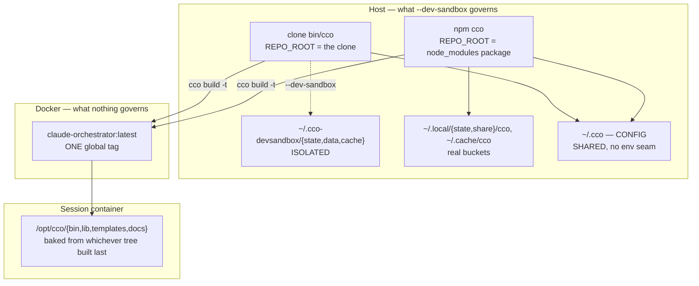
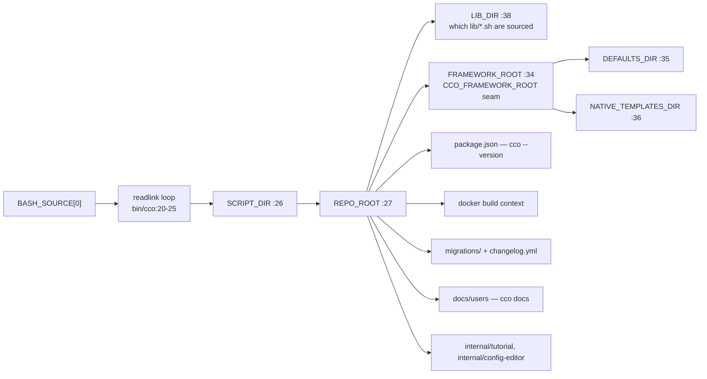
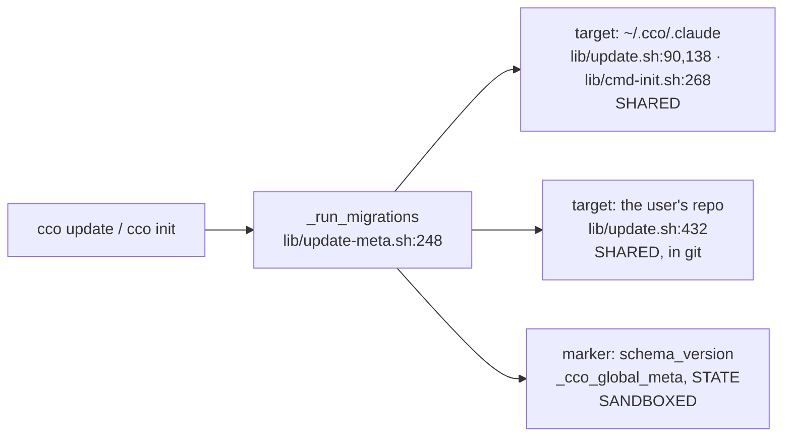

# Developer execution mode — feasibility & inventory

> **DRAFT — 2026-08-27.** Analysis lens: **feasibility + inventory**. This is *not* a
> requirements analysis and it does **not** select a solution: it records the measured
> facts that discriminate between the sketched options, because the choice belongs to the
> design gate. Promotion of this draft to the approved analysis artifact happens when the
> maintainer approves the direction (`rules/workflow.md`, *Phase artifacts — gate
> preconditions*).
>
> **Builds on**, and does not restart: [ADR-0052 §7 + the WS-6 implementation
> annotation](../../configuration/decentralized-config/decisions/0052-index-integrity-version-gate-and-reconcile.md),
> [`engineering/design/packaging-distribution.md` §4/§9](../design/packaging-distribution.md),
> [`roadmap.md` Block B and the *Developer-mode residue* backlog line](../../roadmap.md),
> and [`improvements.md` FI-16](../../improvements.md).
>
> **Measurement provenance.** All greps, line numbers and `git` measurements were taken
> against this clone on `develop` at `ed69492`. The npm registry query was live. The
> analysis ran **inside a cco session container**, so no property of the maintainer's host
> was observed — §12 lists the three host probes still owed.

## 1. Context — the incident, and what already exists

On 2026-08-27 the maintainer ran `cco build` from the host using the **npm-distributed
CLI**, not `./bin/cco` from the development clone. The two have collided before (FI-16,
twice: 2026-07-15 and 2026-07-16). What is wanted is a *strong* and *complete* dev mode, so
every maintainer has one defined path instead of re-inventing it or remembering a
`./bin/cco` that only resolves from the repo root.

Two things already shipped and must be built on, not re-derived:

- **`--dev-sandbox` / `--dev-sandbox-seed`** (ADR-0052 §7, WS-6 annotation 2026-07-23),
  implemented in `lib/paths.sh:584-650` and `bin/cco:141-153`, documented in
  `docs/users/reference/cli.md` §3.34, indicated by `cco whoami` at
  `lib/cmd-whoami.sh:57-60`. It redirects STATE/DATA/CACHE to
  `~/.cco-devsandbox/{state,data,cache}`. **CONFIG (`~/.cco`) stays shared by explicit
  decision** — the WS-6 annotation: *"Sandboxing CONFIG too would needlessly fork the
  developer's authored packs/templates/`.claude`."*
- **The fail-loud version gate** `_cco_version_gate` (`lib/migrate.sh:230-303`), reached
  only from `_cco_first_run` (`lib/migrate.sh:305-333`, called at `bin/cco:635`). §7's
  stated purpose is to make that gate's `die` costless for a developer.

## 2. The headline measurement — both bounds are dormant

Measured, and it reframes the whole problem:

| Quantity | npm `latest` | clone `develop` @ `ed69492` |
|---|---|---|
| `package.json` `version` | `0.6.0` | `0.6.0` |
| `CCO_INDEX_VERSION` (`lib/index.sh:53`) | `2` | `2` |
| highest `migrations/global/` id | `017` | `017` |
| commits since tag `v0.6.0` | 0 | **148** |
| inserted lines under `lib/ bin/ templates/` | — | **+3246 / -214** |

Commands: `npm view @claude-orchestrator/cco version dist-tags`,
`git rev-list v0.6.0..develop --count`,
`git show v0.6.0:lib/index.sh | grep CCO_INDEX_VERSION`,
`git ls-tree --name-only v0.6.0 migrations/global/`,
`git diff --stat v0.6.0..develop -- lib/ bin/ Dockerfile config/ defaults/ templates/`.

Two consequences the design must not assume away:

1. **The version gate cannot fire between the two binaries the maintainer actually has.**
   It is calibrated on exactly two versioned artifacts — the index version and the global
   `schema_version` — and neither has moved across 148 commits. The 2026-08-27 collision is
   not a near-miss on the gate; it is the *ungated* class.
2. **`cco --version` does not discriminate.** Both print `cco 0.6.0`
   (`_cco_print_version`, `bin/cco:294-302`, reads `$REPO_ROOT/package.json`). Any acceptance
   oracle built on it is a false pass by construction.

`develop` also carries `lib/cmd-project-save.sh` — an entire verb (`cco project save` /
`status` / `history`, ADR-0038) absent from `v0.6.0`, which commits into the user's repo git.

## 3. Q1 — Inventory of identity

> ⚠ **Every list in this section is a LOWER BOUND.** Each is the result of a stated
> command, not of exhaustive reasoning. A surface that names the identity by a string not
> matched by that command is not in the list.

### 3.1 `IMAGE_NAME` consumers

**Enumerated by** `grep -rn "IMAGE_NAME"` over the tree excluding `.git/`, then a **second
pass** on the literal `claude-orchestrator:latest`. The second pass found four surfaces the
variable grep misses — which is the direct evidence that the list is a lower bound.

| Site | Role |
|---|---|
| `bin/cco:37` | the constant — hardcoded, **no env override, no dev variant** |
| `lib/cmd-build.sh:107` | the `Building Docker image '…'` banner |
| `lib/cmd-build.sh:163` | `docker build … -t "$IMAGE_NAME" "$REPO_ROOT"` |
| `lib/cmd-start.sh:1590` | default when `project.yml` `docker.image` is unset |
| `lib/cmd-new.sh:123` | generated compose for temp sessions |
| `lib/utils.sh:380-381` | `check_image` preflight + its `die` message |
| `templates/project/base/project.yml:148` | shipped scaffold, commented `# image:` |
| `tests/golden/project-add-base-template.yml:152` | golden pinning that scaffold line |
| `tests/test_start_dry_run.sh:1000` | asserts the literal in generated compose |
| `docs/users/reference/cli.md:2644,2759` · `docs/users/configuration/reference/project-yaml.md:200` · `docs/users/environment/guides/custom-environment.md:203,227,247` · `docs/users/troubleshooting.md:64` | the tag is a **documented user-facing contract**, incl. `FROM claude-orchestrator:latest` for custom images |

**The load-bearing finding.** `Dockerfile:201-211` bakes `bin/`, `lib/`, `templates/`,
`docs/users`, `changelog.yml` and `package.json` into `/opt/cco`, then
`ln -sf /opt/cco/bin/cco /usr/local/bin/cco`. A normal project session mounts **no host
`lib/`** — `_CCO_MOUNT_OVERRIDE` (`lib/cmd-start.sh:55,116`) mounts `$REPO_ROOT/docs` only
for the built-in tutorial and config-editor. So the image tag is not merely a build
artifact: **it is the code identity of the in-session cco**. One global tag means one
in-container cco per machine.

The diagram is the result: the sandbox isolates the **host half** of a two-half system. The
container half is decided by a tag both binaries overwrite, so isolation without a tag axis
is cosmetic.

**Two adjacent global namespaces**, not dev-aware either: `container_name: cc-${project_name}`
(`lib/cmd-start.sh:1984`, `lib/cmd-new.sh:124`) and `network` defaulting to
`cc-${project_name}` (`lib/cmd-start.sh:1597,2751-2753`).

### 3.2 Where `SCRIPT_DIR` / `REPO_ROOT` / `FRAMEWORK_ROOT` decide which code and assets run

**Enumerated by** `grep -rn "REPO_ROOT|FRAMEWORK_ROOT|SCRIPT_DIR|LIB_DIR|DEFAULTS_DIR|NATIVE_TEMPLATES_DIR"`
over `lib/ bin/ scripts/`, plus reading `bin/cco:20-52` as the single derivation point.

Call sites: `lib/update-meta.sh:210,232,253` (`_latest_schema_version`,
`_count_pending_migrations`, `_run_migrations`) · `lib/update-changelog.sh:9` ·
`bin/cco:294-302` · `lib/cmd-docs.sh:12` · `lib/cmd-start.sh:20,43,55,77,107,116` ·
`lib/update.sh:303` · `lib/cmd-build.sh:26,163` · `lib/paths.sh:541-550`
(`_cco_install_provenance`) · `lib/cmd-init.sh:120` and `lib/cmd-update.sh:27` (echo
`$REPO_ROOT` into hints) · `lib/rename.sh:189` · `bin/cco:52` (`USER_CONFIG_DIR`).

`_cco_install_provenance` classifies `npm | brew | clone | unknown` and **has exactly one
consumer**, `lib/cmd-update.sh:14`. Nothing surfaces it to a user.

### 3.3 Bucket resolvers in `lib/paths.sh`

**Enumerated by** `grep -n "^_cco_[a-z_]*()" lib/paths.sh` — a full function listing, not a
keyword search.

Buckets: `_cco_config_dir:455` · `_cco_global_claude_dir:467` · `_cco_data_dir:484` ·
`_cco_state_dir:496` · `_cco_state_shared_dir:521` · `_cco_internal_runtime_dir:533` ·
`_cco_cache_dir:553`.
Derived homes: `_cco_llms_dir:61` · `_cco_claude_install_dir:73` · `_cco_languages_file:86` ·
`_cco_claude_version_file:95` · `_cco_access_file:104` · `_cco_last_seen_file:119` ·
`_cco_last_read_file:123` · `_cco_global_meta:152` · `_cco_global_base_dir:156` ·
`_cco_project_meta:162` · `_cco_project_base_dir:166` · `_cco_pack_source:238` ·
`_cco_pack_meta:246` · `_cco_pack_base_dir:250` · `_cco_project_source:256` ·
`_cco_template_source:262` · `_cco_template_meta:270` · `_cco_template_base_dir:277` ·
`_cco_remotes_file:46` · `_cco_remotes_token_file:52`.
Globals in `bin/cco`: `PACKS_DIR:161`, `TEMPLATES_DIR:162`, `LLMS_DIR:163`.

**Seam asymmetry, measured.** DATA/STATE/CACHE each accept a `CCO_*_HOME` override.
**CONFIG accepts none** — `_cco_config_dir()` is a literal `$HOME/.cco` (`lib/paths.sh:455-460`).
`CCO_CONFIG_DIR` exists only as a template placeholder (`lib/cmd-start.sh:44`) and in
unset-lists (`bin/test:44`, `tests/helpers.sh:658`); it is **not** a resolver seam. So the
only mechanism that isolates CONFIG today is redirecting `$HOME`. `PACKS_DIR`/`TEMPLATES_DIR`
*do* have `CCO_PACKS_DIR`/`CCO_TEMPLATES_DIR` seams, so packs/templates are partially
separable from the rest of `~/.cco`.

## 4. Q2 — Invocation forms possible today

`CONTRIBUTING.md:12-35` offers exactly two setups, both **global and substitutive**. Neither
is a coexistence story.

- **npm global** — `package.json` `bin: {"cco": "bin/cco"}`; npm writes a symlink; the
  readlink loop resolves it to the package root; provenance `npm`.
- **`npm link`** — same shim path retargeted at the clone; provenance `clone`. It
  **overwrites** the global-install symlink, so the npm install is no longer reachable by
  name. Substitution, not coexistence.
- **`bin/` on PATH** — whichever PATH entry wins; order-dependent and invisible.
- **Absolute path / `./bin/cco`** — works when absolute; the relative form is the ergonomic
  complaint and cannot work from another cwd.
- **Two installs at once** — nothing prevents it and **nothing detects it**. `cco --version`
  returns the same string from both (§2). `cco whoami`'s host branch
  (`lib/cmd-whoami.sh:50-70`) prints *"Not in a cco session (host context)"* and then only
  the dev-sandbox block if active: **no `REPO_ROOT`, no provenance, no version**. There is
  no verb today that answers *"which cco am I running, from where"*.

**Would an `exec` dispatch survive the resolution?** Yes. `exec "<clone>/bin/cco" "$@"` sets
`BASH_SOURCE[0]` to that absolute path; the loop at `bin/cco:21-25` finds no symlink and
falls through; `SCRIPT_DIR` = `<clone>/bin`, `REPO_ROOT` = `<clone>`. `exec` replaces the
process image, so the outer EXIT trap at `bin/cco:14` never fires — no spurious
`✗ cco exited unexpectedly`. Exported env carries over. Two placement constraints for the
design: dispatch must precede `bin/cco:60` (the `source "$LIB_DIR/…"` block) if no old npm
`lib/` may ever be parsed, and its position relative to `bin/cco:128` (the in-container
`none` refusal) decides whether the flag is legal in-session.

**Parser fact.** The existing consumer at `bin/cco:141-152` strips `--dev-sandbox` from
**anywhere** in argv with no `--` terminator handling. `grep -n '"--")' lib/*.sh bin/cco`
returns **zero** hits, so today this is harmless — but a `--dev` flag of the same shape
inherits a latent defect the day any verb gains passthrough args.

## 5. Q3 — The compatibility contract if the distributed CLI dispatches

- **Who runs the gate.** Whoever is the process. `_cco_version_gate` is reached only from
  `_cco_first_run`, invoked at `bin/cco:635` — *after* dispatch. An `exec` to the clone
  before that point means **only the clone's gate runs**, with the clone's bounds. That is
  the correct direction and makes "old dispatcher, new clone" safe *for the gate*.
- **Can an old distributed launch a newer clone?** Mechanically yes — `exec` needs nothing
  from the target. But the distributed binary **must already contain the dispatcher**, and
  the installed `0.6.0` does not. Any dispatcher-based option therefore requires an npm
  release before it can be used at all.
- **Does the sandbox make the gate irrelevant?** No — and neither does the sandbox. The gate
  is **already dormant** between these two specific versions (§2). Schema stasis, not the
  sandbox, is what silences it. A design that argues "the gate protects us" must be checked
  against that measurement.
- **The declared-but-unbuilt handshake.** FI-16 already names it: *"CLI↔image version
  handshake at `cco start` — the host cco and the image's `/opt/cco` can diverge (exactly the
  2026-07-15 case: npm cco + dev-built image), today with no signal."* Confirmed open.
  `/opt/cco/BUILD` (written by `Dockerfile:221-222` from `_cco_build_ref`) has **one** reader:
  `lib/cmd-whoami.sh:102`, in-container only. The `Dockerfile` sets no `LABEL`, so there is no
  host-side inspect surface either. A usable oracle exists but is unwired —
  `docker run --rm claude-orchestrator:latest cat /opt/cco/BUILD` yields `branch@shortsha` for
  a clone build and the literal `unknown` for an npm build (`lib/cmd-build.sh:26-29`: no
  `.git` in the context → `unknown`). Unlike `cco --version`, that asymmetry **does**
  discriminate.

## 6. Q4 — Shared CONFIG: what actually breaks

### 6.1 Where each artifact lives

| Artifact | Bucket | Sandboxed |
|---|---|---|
| projects index (`lib/index.sh:69`) | STATE/shared | yes |
| global `schema_version` (`lib/paths.sh:152`) | STATE | yes |
| registries / provenance | DATA | yes |
| running registry (`lib/utils.sh:297`) | STATE | yes |
| `claude.json`, credentials (`lib/cmd-start.sh:1776`) | STATE | yes |
| generated compose | STATE | yes |
| **`~/.cco/.claude`** | CONFIG | **no** |
| **packs / templates** | CONFIG | **no** (partial `CCO_PACKS_DIR`/`CCO_TEMPLATES_DIR` seams) |
| **`secrets.env`, `languages`, `access.yml`, `claude-version`, `mcp-packages.txt`, `setup*.sh`** | CONFIG | **no** |
| **`<repo>/.cco/`** (project config, in git) | the user's repo | **no** |

### 6.2 The split-brain

`_run_migrations` is called with a **target** and a **marker** that now sit on opposite
sides of the sandbox boundary.

A dev-only migration mutates the maintainer's real config and records that it ran in a
bucket the published binary never reads. Historically the class is rare — only 2 of 17
global migrations touch CONFIG (`migrations/global/009`, `015`, found with
`grep -ln "_cco_config_dir|_cco_global_claude_dir|PACKS_DIR|TEMPLATES_DIR" migrations/global/*`)
— so the design should weigh probability, not only possibility.

### 6.3 CONFIG writers reachable from a dev run

1. `cco init --force` → `rm -rf "$gclaude"` (`lib/cmd-init.sh:198`) then re-seed from the
   **dev tree's** defaults (`:224`). Destroys the real `~/.cco/.claude`.
2. `cco init` → `_run_migrations "global" "$gclaude" 0` (`lib/cmd-init.sh:268`).
3. `cco update` → `_run_migrations "global" "$installed_dir"` (`lib/update.sh:138`, dir from `:90`).
4. `cco update` → `_run_migrations "project" "$project_dir"` (`lib/update.sh:432`) — target is
   the repo working tree, and the mutation will be committed.
5. `cco update --sync` → `cp "$global_defaults_root/$rf" "$config_root/$rf"` (`lib/update.sh:218`).
6. Pack/template store writes: `lib/cmd-pack.sh:60,1042,1046` · `lib/cmd-template.sh:287,472,526,599`
   · `lib/cmd-project-export-import.sh:209-210` · `lib/migrate.sh:388,390,692-732`.
7. `cco config save` / `cco project save` commit into `~/.cco`'s git and the user's repo git.
8. `cco build` **reads** real CONFIG regardless of sandbox: `~/.cco/mcp-packages.txt`,
   `~/.cco/setup-build.sh`, `~/.cco/claude-version` (`lib/cmd-build.sh:73-104`).

**Recovery gap.** `_CONFIG_ALLOWLIST` (`lib/cmd-config.sh:37-39`) covers `.gitignore packs
templates .claude setup.sh setup-build.sh mcp-packages.txt languages secrets.env.example`.
**`access.yml` and `claude-version` are absent**, so those two shared members have no
`cco config save` history to restore from. `~/.cco` is a git repo only after the first
`cco config save` (`lib/cmd-config.sh:128`). `access.yml` is create-only today
(`_write_access_scaffold`, `lib/cmd-init.sh:136-137`), so current risk is low; the gap is
structural.

**Verdict on the WS-6 call.** The rationale — *"the gate's inputs all live in the redirected
buckets, so isolating those three is sufficient"* — is **true as written and insufficient as
a safety argument**: it reasons about the gate's *inputs*, while the exposure is in the
migration engine's *targets*. The design must state whether it reopens the call or accepts
the exposure explicitly.

⚠ **Reopening it is a test change, not only an ADR annotation.**
`tests/test_dev_sandbox.sh:75-86` (`test_dev_sandbox_config_stays_shared`) **pins**
`CONFIG=$HOME/.cco` and asserts the string `.cco-devsandbox` does not appear. That file has
9 tests (`grep -c "^test_"`); none covers the image tag and none covers a CONFIG write.

## 7. Q5 — In-container: host-only by construction

Declare it host-only.

- `_cco_apply_dev_sandbox` (`lib/paths.sh:634`) returns 0 under `_cco_in_container`. The
  reason is in the section comment: a session's operator buckets **are** the sacred
  `cco start` mounts (ADR-0047), pre-created host-side behind the privilege boundary.
- The in-container cco is `/usr/local/bin/cco → /opt/cco/bin/cco` (`Dockerfile:211`) — the
  image's own code. There is no second cco inside a session to disambiguate; "which build"
  is answered at `cco build` time.
- ⚠ **Oracle defect, measured.** The flag strip at `bin/cco:141-152` runs unconditionally,
  before the operator shim. So `cco --dev-sandbox <verb>` **inside a session is silently
  consumed and silently ignored** — `_cco_apply_dev_sandbox` no-ops and the `whoami`
  indicator lives in the host branch. Whatever surface the design picks must **refuse**
  in-container, not swallow.

## 8. Q6 — Lifecycle: what is missing today

Measured against `lib/paths.sh:584-650`, `lib/cmd-clean.sh` and the verb list in `bin/cco`.

- **Re-seed** — none. `_cco_dev_sandbox_seed` (`lib/paths.sh:606`) opens with
  `[[ -d "$root/state" ]] && return 0`: one-shot, permanently. No `--reseed`; refreshing a
  stale sandbox means `rm -rf` by hand.
- **Backup** — none for the sandbox. The J0 legacy-vault backup lands in `<state>/backups`,
  i.e. *inside* the sandbox when active, so it backs up nothing real.
- **Reset / cleanup** — none. `cco clean` has categories `bak|new|tmp|generated` scoped to
  the global `.claude` and indexed projects, **never scans CACHE**, and knows nothing about
  `~/.cco-devsandbox`. A sandbox is created and never reaped.
- **`doctor`** — **there is no `cco doctor` verb**; `grep -rn "doctor" lib/ bin/cco
  docs/users/reference/cli.md` returns zero. ADR-0052 §5's "doctor" is the
  `cco config validate --fix` flag-on-read contract, which has no sandbox awareness.
- **Listing dev environments** — none. `CCO_DEV_SANDBOX_ROOT` is arbitrary per invocation and
  nothing records which roots exist; `cco whoami` reports only the active one.
- **Docker-side lifecycle** — nothing reaps a dev image, dev containers or dev networks,
  because none of the three has a dev identity yet.

## 9. Q7 — Overlap with Block B

- **`engineering/design/packaging-distribution.md` §4** (`:141-154`) already owns the build
  context and **explicitly parks the tag**: *"**v1 keeps the image tag
  `claude-orchestrator:latest`** (`IMAGE_NAME` in `bin/cco`); tagging the image with
  `:<package.version>` is a later refinement, not required for the package to install and
  run."* Restated in the §8 DoD at `:240`. The image tag is therefore **already a deferred
  item with a named owner**.
- **§9** (`:247-256`) defers `cco update` orchestration + the responsibility-axis split to the
  update-refactor workstream, and Homebrew post-v1. Nothing about dev mode.
- **`roadmap.md` Block B** (`:807+`): **B1** makes `cco update` the orchestrator of
  `npm update → migrations → cco build` and asks what the npm post-install hook does — the
  same seam a dispatcher would sit on, and it flags *"It has never built the image"* as the
  thing that changes. **B2** (`cco attach`) rewrites compose generation and container naming
  — the same namespace a dev identity would fork. **B3** (FI-30) is the install/init
  coherence pass that would absorb any `CONTRIBUTING.md` change.
- **`roadmap.md:1072`** already carries the item: *"**Developer-mode residue** — ✅ Mostly
  shipped … What remains is **ergonomics** — running the local `bin/` build against an
  npm-installed cco without typing the path."* The measurements above say the residue is
  **larger than ergonomics**: the image tag, the CLI↔image handshake and the migration
  target/marker split are correctness.

⚠ **Duplication risk for the gate.** If dev mode adds an image-tag axis, B1 adds `cco build`
to `cco update`'s orchestration, and B2 renames containers for persistence, then three
designs touch one naming namespace. Sequencing, or a shared naming decision, is cheaper than
three passes.

## 10. Facts that discriminate between the sketched options

Options on the table, recorded without preference: **A** a second `cco-dev` shim on PATH ·
**B** `cco --dev <cmd>` / `CCO_DEV_REPO`, the distributed binary dispatching by `exec` into
the clone · **C** a session profile in the style of nvm/direnv · **D** extend `--dev-sandbox`
to CONFIG and the image tag. This section supplies facts, not a choice.

- **Bootstrapping.** A and C ship with no npm release. B **requires publishing a version
  containing the dispatcher first**, because the installed `0.6.0` cannot dispatch (§5). D
  requires a release only if the CONFIG seam ships in the published binary.
- **Packaging.** `package.json` `files` lists **`"bin/cco"`, not `"bin/"`**, while
  `Dockerfile:201` does `COPY bin/`. A new `bin/cco-dev` would therefore be **baked into the
  image but not published to npm**. `scripts/check-pack-hygiene.sh` is a **denylist** over
  `npm pack --dry-run` and would not catch the omission — option A needs a `files` edit that
  is invisible to the existing gate.
- **CONFIG isolation mechanism.** `_cco_config_dir()` has no override seam (§3.3), so option
  D is either a new resolver seam or a `$HOME` redirect. **Prior art for the redirect exists
  in-repo**: `scripts/cco-sandbox-e2e.sh` redirects `HOME` plus all four roots and delivers
  the environment through a sourced `activate.sh` — a working implementation of **option C's
  shape**, written by this project for this purpose. Its own header names the trap:
  *"`export`s set by a subprocess do NOT survive into your shell"* — the invisible-active-state
  cost, already paid once here.
- **Image tag.** Under **every** option, isolating STATE/DATA/CACHE without forking the tag
  leaves the in-container cco shared between builds (§3.1). The hypothesis that the tag must
  enter dev identity holds; what it costs is §9's deferral conflict.
- **Oracles — the false-pass surface.** `cco --version` is **measured non-discriminating**.
  `which cco` answers PATH order, not the `REPO_ROOT` reached after the readlink loop.
  `_cco_install_provenance` **does** discriminate but has one internal consumer and no user
  surface. `docker … cat /opt/cco/BUILD` **does** discriminate (`branch@sha` vs `unknown`).
  Any acceptance test for this work must be revert-checked against a binary of each
  provenance, or it passes on both.
- **Platform constraints that bind all four.** bash 3.2 + BSD userland on the macOS host;
  framework tree read-only at runtime; host-only; no host path in committed artifacts.

## 11. Open questions for the design gate

1. **Is the WS-6 CONFIG call being reopened?** The migration target/marker split says the
   rationale is incomplete. Reopening costs a pinned test, an ADR annotation, and — because
   `_cco_config_dir` has no seam — either a new resolver override or a `$HOME` redirect.
   Accepting the exposure is legitimate but must be written down with the split-brain named.
2. **What is the *scope* of dev identity?** Buckets only (today) · plus image tag · plus
   container/network names · plus CONFIG. Each addition is a separate namespace and a
   separate cleanup obligation.
3. **Does a tag axis pre-empt `packaging-distribution.md` §4's deferred `:<package.version>`
   tagging?** Someone owns reconciling it with that refinement and with Block B1.
4. **Should the dev surface be legal in-container?** Today the analogous flag is silently
   swallowed there. Refuse, or ignore-with-notice.
5. **Is a "which cco am I" verb in scope?** It is the prerequisite oracle for *any* option and
   for testing without false passes. It could equally land first as a standalone item —
   extend `cco whoami`'s host branch with `REPO_ROOT` + `_cco_install_provenance` + version.
6. **Should the npm binary remain installed at all?** A and B assume yes. If the answer is
   "a maintainer's machine should only ever carry the clone", the problem collapses to a
   `CONTRIBUTING.md` change plus a PATH-shadowing check. The gate should reject that
   explicitly rather than by omission.
7. **Which lifecycle verbs are in scope now vs deferred?** §8 lists six gaps; shipping an
   identity without a reaper adds a new orphan class to a project that already tracks one
   (ADR-0045's running-registry reaper).

## 12. Host probes still owed

This analysis ran inside a cco session container (`/usr/local/bin/cco` is the baked shim;
`~/.cco` here holds only `packs/`), so **no property of the maintainer's host was observed**.
Three probes, all read-only, are owed before design:

1. `which -a cco` — how many cco binaries are on PATH, and in what order.
2. `cco whoami` and `cco --version` from **each** install — confirms §2's non-discriminating
   `--version` on the real machine and shows what the host branch currently reports.
3. `docker run --rm claude-orchestrator:latest cat /opt/cco/BUILD` — which tree built the
   image that is on the machine right now (`branch@sha` ⇒ clone, `unknown` ⇒ npm).

## 13. Relevant files

- `bin/cco` — `:20-27` readlink loop / `SCRIPT_DIR` / `REPO_ROOT` · `:34-38`
  `FRAMEWORK_ROOT`, `DEFAULTS_DIR`, `NATIVE_TEMPLATES_DIR`, `IMAGE_NAME`, `LIB_DIR` · `:52`
  `USER_CONFIG_DIR` · `:60-119` module sourcing · `:128` in-container `none` refusal ·
  `:141-153` dev-sandbox flag strip + apply · `:161-163` `PACKS_DIR`/`TEMPLATES_DIR`/`LLMS_DIR`
  · `:294-302` `_cco_print_version` · `:577-635` Main and `_cco_first_run`
- `lib/paths.sh` — `:455-460` `_cco_config_dir` (no override seam) · `:484-560` DATA/STATE/CACHE
  · `:541-550` `_cco_install_provenance` · `:562-650` the dev-sandbox block and the WS-6 rationale
- `lib/migrate.sh` — `:230-303` `_cco_version_gate` · `:305-333` `_cco_first_run` ordering
- `lib/update-meta.sh` — `:208-224` `_latest_schema_version` · `:248-…` `_run_migrations`
- `lib/update.sh` — `:90-91` · `:138` · `:218` · `:432`
- `lib/cmd-init.sh` — `:128-160` access scaffold · `:185-268` `_cco_init_ensure_global`
- `lib/cmd-build.sh` — `:24-37` `_cco_build_ref` · `:73-104` CONFIG reads · `:163` build + tag
- `lib/cmd-start.sh` — `:1589-1597` · `:1650-1651` · `:1776-1800` · `:1983-1985` · `:2751-2753`
- `lib/cmd-whoami.sh` — `:50-70` host branch and dev-sandbox indicator · `:95-103` `/opt/cco/BUILD`
- `lib/cmd-config.sh` — `:37-39` `_CONFIG_ALLOWLIST` · `:128` `git init` of `~/.cco`
- `lib/utils.sh` — `:279-360` running registry · `:379-383` `check_image`
- `Dockerfile` — `:200-211` `/opt/cco` bake and the `/usr/local/bin/cco` symlink · `:221-222`
  `CCO_BUILD_REF` → `/opt/cco/BUILD`
- `package.json` — `bin`, `files` (`"bin/cco"`, not `"bin/"`), `version`
- `CONTRIBUTING.md:12-35` — the two substitutive setups
- `scripts/cco-sandbox-e2e.sh` — prior art for the `$HOME`-redirect + sourced-`activate.sh` shape
- `scripts/check-pack-hygiene.sh` — denylist-only tarball gate
- `tests/test_dev_sandbox.sh` — 9 tests; `:75-86` pins CONFIG-stays-shared
- `tests/test_version_gate.sh` · `tests/test_start_dry_run.sh:1000` ·
  `tests/golden/project-add-base-template.yml:152`
- `docs/maintainers/configuration/decentralized-config/decisions/0052-index-integrity-version-gate-and-reconcile.md:173-202`
- `docs/maintainers/engineering/design/packaging-distribution.md:141-154, 247-256`
- `docs/maintainers/roadmap.md:807-895, 1072`
- `docs/maintainers/improvements.md:409-478` (FI-16; the handshake gap at `:471`, the
  `npm link` mitigation at `:472`)
- `docs/users/reference/cli.md:2563-2589` (§3.34)
- `templates/project/base/project.yml:148` · `docs/users/configuration/reference/project-yaml.md:200`
