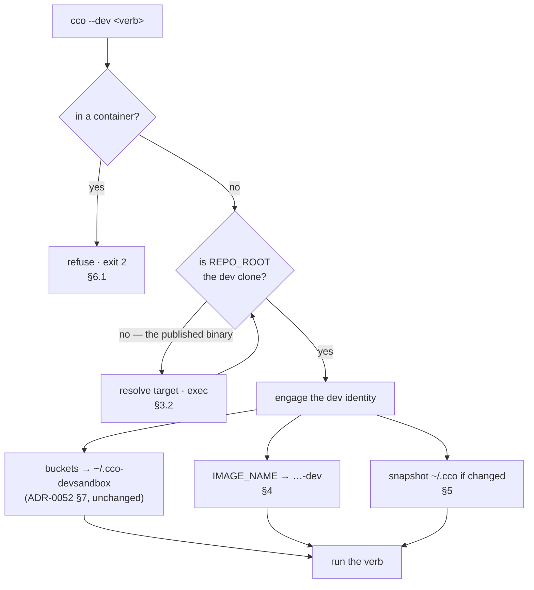
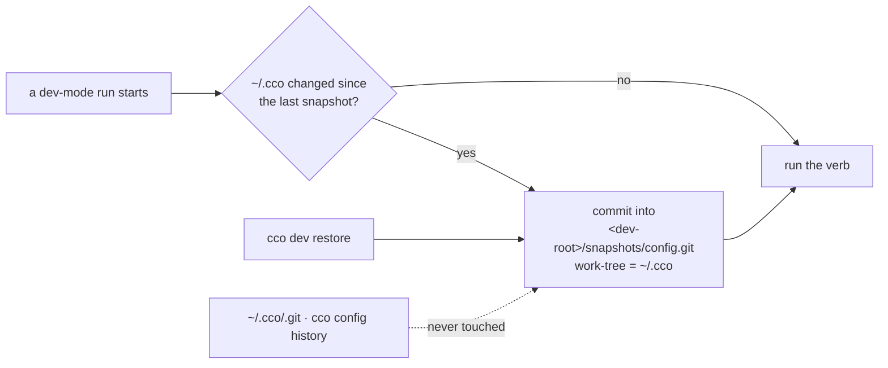

# Developer execution mode — design

> **Living design doc.** The *how* for [ADR-0060](../decisions/0060-developer-execution-mode.md);
> the decisions and their rationale live there and are **not** repeated. Traces to the approved
> analysis [`../analysis/dev-execution-mode.md`](../analysis/dev-execution-mode.md) and to the
> decision clinic
> [`../analysis/dev-execution-mode-decisions.md`](../analysis/dev-execution-mode-decisions.md).
> **Status**: **A10.1 (identity) is built and green as of 2026-09-01** — §3, §4, §6.1 and §6.3 are
> shipped behaviour; one post-implementation correction is
> [Amendment A5](../decisions/0060-developer-execution-mode.md#amendments). **A10.2 (protection and
> tooling) is designed and NOT built**: §5, §6.2, §7 and §8 describe intended behaviour, not what
> the code does today.
>
> **Acceptance criteria, agreed 2026-08-31** — the design is done when each is answered by a named
> artifact: (1) a dev run cannot overwrite the image a real session uses; (2) a dev run's writes to
> the real configuration are restorable; (3) the developer types one name from any cwd; (4) no
> default moves for a user; (5) every new identity has a reaper; (6) each acceptance check is shown
> to **discriminate** before its pass is believed.

## 1. Shape

One binary, one mode. `--dev` forks the **code identity** (image) and the **internal buckets**, and
leaves the **configuration shared** behind a restorable snapshot.



## 2. Requirements, traced

| # | Requirement | Traces to |
|---|---|---|
| **R1** | A dev run must not overwrite the image a real session uses | analysis §3.1 (M1) · ADR-0060 D2/D3 |
| **R2** | The developer invokes the clone **by name**, from any cwd | analysis §12.1 (M2) · D1 |
| **R3** | The **real** configuration — global and project — is what a dev run reads | clinic round 3 · D4 |
| **R4** | A bad dev write to configuration is restorable, and a run that could not be restored does not start — `~/.cco` by snapshot (§5), `<repo>/.cco` by guard (§5.2) | D4.1–D4.7 |
| **R5** | Cases needing a different configuration have a **fixture**, not a redirect | D4/D5 |
| **R6** | No default moves for a user | D3 · *Consequences* |
| **R7** | Every identity the mode creates is reapable | D6 · ADR-0045 precedent |
| **R8** | The mode refuses where it cannot work, never silently no-ops, and says so when the clone runs against the real environment | D7 · analysis §7 |

**Out of scope**, each with its owner: container/network naming (**B2**) · `cco doctor` (its own
roadmap entry) · waking the dormant version gate (M3 — nothing here does) · relocating project
config (priced and rejected, ADR-0060 D4.6) · a snapshot/restore of *mutated* dev state (YAGNI).

## 3. `--dev`: parsing, resolution, dispatch

### 3.1 Where it sits in `bin/cco`

The existing dev-flag block (`bin/cco:141-153`) is the site. It is **after** the
`cco_access=none` refusal (`:128`) — so a `none` session still gets its own refusal first — and
**before** `PACKS_DIR`/`TEMPLATES_DIR`/`LLMS_DIR` (`:161-163`) and the first-run gate (`:635`).

The block runs **post-source**, and that is deliberate: the binary parses **its own** `lib/`, which
is self-consistent by construction, and `exec` then replaces the process image so nothing sourced
survives. Sourcing before dispatch buys `refuse`, `die` and `_cco_in_container` instead of
duplicating them inline.

### 3.2 Argv, with the `--` terminator fixed

Accepted spellings: `--dev`, `--dev=<path>`, and the `CCO_DEV=1` env. The scan **stops at the first
`--`**; `--` and everything after it are passed through verbatim.

⚠ This fixes a latent defect the current strip carries: measured, `grep -n '"--")' lib/*.sh bin/cco`
returns **zero** hits, so today's consume-from-anywhere is harmless *by luck*. A flag that changes
which **binary** executes must not inherit that.

`--dev-sandbox` and `--dev-sandbox-seed` are accepted as **aliases** (of `--dev` and of an implied
`cco dev seed`), each emitting one superseded `note`.

### 3.3 Target resolution — first match wins, no silent fallback

| Order | Source |
|---|---|
| 1 | `--dev=<path>` |
| 2 | `$CCO_DEV_REPO` |
| 3 | walk up from `$PWD` to the nearest enclosing cco clone — **this is what makes worktrees work**, and `rules/git-practices.md` mandates worktree-per-agent |
| 4 | `~/.cco/dev-repo` — a one-line file, the same shape as `claude-version` and `languages` (no YAML parser needed) |
| 5 | **die**, printing the four it tried |

**Validation before `exec`** — the target must have an executable `bin/cco` *and* a `package.json`
naming `@claude-orchestrator/cco`; otherwise die. Never `exec` into an unvalidated path.

**Identity check**: compare `cd -P "$target" && pwd` with `REPO_ROOT`. Equal ⇒ **no dispatch**, run
in place. This is the primary loop guard; `CCO_DEV_DISPATCHED=1`, exported before `exec` and
refused on a second dispatch, is the belt for symlink/mount aliasing.

**Why `exec` is safe here** (measured, analysis §5): it sets `BASH_SOURCE[0]` to the absolute target,
so the readlink loop at `bin/cco:21-25` finds no symlink and `REPO_ROOT` lands on the clone; and
because `exec` replaces the process image, the EXIT trap at `bin/cco:14` never fires — no spurious
`✗ cco exited unexpectedly`.

## 4. Image identity

```
_cco_dev_image "<image>" → "<image with -dev appended to the repository>"
```

The tag separator is the **last `:` after the last `/`** — so a registry host:port is not mistaken
for a tag.

| In | Out |
|---|---|
| `claude-orchestrator:latest` | `claude-orchestrator-dev:latest` |
| `myorg/custom` (no tag) | `myorg/custom-dev` |
| `localhost:5000/foo:1.0` | `localhost:5000/foo-dev:1.0` |
| `foo@sha256:…` (digest-pinned) | **die** — a digest names one specific image and cannot be mapped; the way out is `project.dev.yml` |

**Two application points, and the rule that avoids double-mapping:**

- `bin/cco:37` becomes `IMAGE_NAME="${CCO_IMAGE_NAME:-claude-orchestrator:latest}"` — the default is
  **unmoved**, so `FROM claude-orchestrator:latest` in the custom-image guide and all 7 doc surfaces
  read as today. In the dev block, `IMAGE_NAME=$(_cco_dev_image "$IMAGE_NAME")` **unless
  `CCO_IMAGE_NAME` was set explicitly** — explicit wins, the same rule `_cco_apply_dev_sandbox`
  already applies to `CCO_*_HOME`.
- `lib/cmd-start.sh:1589-1590`: map only a **`docker.image` that was actually set**; when it is
  unset, `docker_image="$IMAGE_NAME"`, which the dev block has already mapped.

```
docker_image=$(yml_get "$project_yml" docker.image)      # project.dev.yml overlay first, §7
if [[ -n "$docker_image" ]]; then
    _cco_dev_active && docker_image=$(_cco_dev_image "$docker_image")
else
    docker_image="$IMAGE_NAME"                            # already mapped
fi
```

A `docker.image` coming from `project.dev.yml` is **not** mapped — it is already the dev pin.

`check_image` (`lib/utils.sh:379-383`) **dies** on a missing mapped image, naming both images and
the two ways out (build it; or pin/unpin via `project.dev.yml`). `cco build` tags the mapped name at
`lib/cmd-build.sh:163`, which is R1 satisfied.

## 5. Configuration protection — the snapshot store

### 5.0 Where the dev root is in practice — and why it is **not** a new XDG bucket

⭐ **Dev mode adds no bucket.** The four-bucket XDG model (ADR-0007/0015) is untouched: dev mode
**re-points three of the existing four** (`CCO_STATE_HOME` / `CCO_DATA_HOME` / `CCO_CACHE_HOME`) at
children of one directory, and CONFIG is not re-pointed at all (ADR-0060 D4). `~/.cco-devsandbox` is
a **container**, not a fifth bucket, and it always was — `_cco_dev_sandbox_root`
(`lib/paths.sh:589-592`) is a plain `$HOME/.cco-devsandbox`, overridable by an absolute
`CCO_DEV_SANDBOX_ROOT`.

```
<dev-root>/                      # default $HOME/.cco-devsandbox — one reap target
├── state/                       # ← CCO_STATE_HOME   ┐ the three redirected XDG buckets;
├── data/                        # ← CCO_DATA_HOME    │ contents seeded from the real ones
├── cache/                       # ← CCO_CACHE_HOME   ┘ by `cco dev seed`
├── snapshots/config.git         # NEW — the pre-run config snapshot store (§5)
├── configs/<name>/              # NEW — fixture global configs (CCO_CONFIG_HOME targets, §7)
└── projects/<name>/             # NEW — fixture test projects (§7)
```

⚠ **The new entries are siblings of the three buckets, never children of `state/`, and that is
measured rather than tidy.** `_cco_dev_sandbox_seed` (`lib/paths.sh:606-628`) does
`cp -a "$real_state" "$root/state"` and is gated by `[[ -d "$root/state" ]] && return 0`. Anything
this design placed under `state/` would therefore be (a) indistinguishable from **copied real STATE**,
and (b) entangled with a one-shot guard — either the seed can never run because the directory already
exists, or a re-seed overwrites the store. Keeping them as siblings leaves both the seed and the
bucket semantics exactly as they ship.

**Env spelling**: `CCO_DEV_ROOT` becomes the preferred name and `CCO_DEV_SANDBOX_ROOT` is kept as the
superseded alias — the same treatment the flags get (§3.2). ⚠ **The default path does not move.**
Renaming `~/.cco-devsandbox` would strand every sandbox that already exists, which is exactly the
orphan class this unit exists not to create.




| Property | Design |
|---|---|
| **Location** | `<dev-root>/snapshots/config.git`, with `GIT_WORK_TREE=$(_cco_config_dir)` — a **sibling** of the three redirected buckets, never inside `state/` (§5.0). Reaped with the dev root |
| **Never `~/.cco/.git`** | `cco config save` promises *"cco never auto-commits"*; and `_config_push` (`lib/cmd-config.sh:283`) operates on `$cfg/.git`, so this store is **structurally unpushable** |
| **Trigger** | **the step is unconditional** — it runs at every `cco --dev` engage, before the verb, whatever the verb is. The **commit** happens only when `git status --porcelain` is non-empty (an empty commit records nothing). Never a list of verbs |
| **Scope** | `git add -A` — **not** `_CONFIG_ALLOWLIST`, which omits `access.yml` and `claude-version`, the two members with no other recovery path |
| **Exclusions** (`$GIT_DIR/info/exclude`) | `secrets.env`, `*.env`, `*.key`, `*.pem` — the same patterns `lib/secrets.sh` already matches, reused rather than restated — plus `.git/`. ⚠ **Correction, measured 2026-09-03**: the `.git/` entry's original rationale (*"so the user's own config repo is not recorded as a gitlink"*) is **wrong twice over**, and the entry is kept only as documentation of intent. Git refuses `.git` as an index path component at any depth, so `~/.cco/.git` is skipped **with or without** the pattern — the exclusion is unobservable, and a test asserting it would be vacuous. And it does **not** stop a *nested* repo (`~/.cco/foo/.git`) from becoming a gitlink, which was measured to still happen. What actually protects the user's config repo is that the store is a separate `GIT_DIR` that never commits into it (the row above) |
| **Implementation constraint** | taken with **plain `git` invocations**, never through `cco config save`: the verb may itself be the code under test |
| **Failure** | 🔴 **`die` — blocking, ruled by the maintainer 2026-09-01.** If the snapshot cannot be taken, the mode's safety property cannot be established, so the run must not proceed. This deliberately departs from `_cco_dev_sandbox_seed`'s `warn`: a partial seed is a convenience, a missing restore point is the protection itself |
| **Message** | `dev snapshot before: cco <argv>` — so `cco dev list` reads as a log of what was about to run |

### 5.0b No-op vs failure, and where the step does **not** fire

| Situation | Behaviour |
|---|---|
| `~/.cco` does not exist (fresh machine) | **no-op + `note`** — there is nothing to protect, and this is not a failure |
| `~/.cco` exists, git missing / store un-initialisable / `status` or `commit` fails | 🔴 **`die`** |
| `~/.cco` exists, tree unchanged since the last snapshot | no commit, no message — the step succeeded |

**Where it fires**: on `cco --dev <verb>`. The `cco dev <sub>` verbs resolve the dev root **without
engaging the mode** (§5.1), so they take no snapshot — **except `cco dev restore`**, which mutates
`~/.cco` and therefore takes one first, so a restore is itself undoable.

⚠ **Ordering is load-bearing, and getting it wrong is a false pass**: `$GIT_DIR/info/exclude` must be
written **at store init, before the first `git add -A`**. A test that asserts the exclusions exist
would pass on a store whose *first commit* already contained `secrets.env`.

### 5.1 Restore

`cco dev restore [<ref>] [--clean] [--dry-run]` — default `HEAD`. It checks out the tracked paths
over `~/.cco`; files **created since** the snapshot are **reported, not deleted**, unless `--clean`
is given. `--dry-run` is the project's existing idiom (`cco clean` has it) and makes the destructive
preview free.

⚠ It resolves the store from the dev root **without engaging dev mode**, so `cco dev restore` works
from an ordinary shell.

**Two orderings the first draft left open, closed 2026-09-03 when the tester found that each had a
second reading:**

- 🔴 **`<ref>` resolves BEFORE restore's own safety snapshot**, never after. §5.0b makes restore
  snapshot first because a restore must itself be undoable — but if `HEAD` were then re-read, it
  would name the snapshot just taken and `cco dev restore` would be a **guaranteed no-op that reports
  success**. Resolve the ref against the store as it stood when the command was typed.
- **`--dry-run` writes nothing at all, the safety snapshot included.** *"Makes the destructive preview
  free"* is the whole point: a preview with a side effect is not free.

⚠ **A defect class found in a reference implementation before any real code existed, and the reason a
test pins it**: restoring by pointing the store's index at the restored ref leaves index and HEAD
**diverged**. The damage is not local — the *next* dev run's snapshot commit comes out empty,
`git commit` returns non-zero, and D4.4 turns that into a `die`. A recovery path that bricks the next
run. **The store must stay usable after a restore.**

### 5.2 Project configuration — a guard, not a second store

⚠ **The snapshot covers `~/.cco` only** (`GIT_WORK_TREE=$(_cco_config_dir)`). `<repo>/.cco` is
protected by **the user's own repo git**, and that protection is complete *only* when the tree is
versioned and clean. The four cases it does not cover — and what the guard does about them:

| Case | Without a guard | With it |
|---|---|---|
| `.cco` committed and clean | ✅ `git checkout -- .cco` restores fully | unchanged |
| `.cco` has **uncommitted** changes | 🔴 the delta is lost | **refuse** |
| `.cco` **never committed** / gitignored | 🔴 nothing to restore to | **refuse** |
| the repo **is not git** — a supported case (`lib/cmd-project-save.sh:452` handles it and refuses to `git init` a repo cco does not own) | 🔴 no protection at all | **refuse** |

⭐ **The membership criterion, so the guard is not merely a list**: it applies to a writer that can
**destroy uncommitted content**. It does **not** apply to a writer whose only effect is a *commit* —
a commit is revertable by construction, and round 3 already accepted that class as *recoverable,
noisy*. ⚠ **This exempts `cco project save`, and the exemption is required, not cosmetic**: that verb
only does anything when `.cco` is dirty, so a dirty-check would make it permanently untestable in dev
mode. Classify a future writer by the criterion, not by finding it on this list.

**Writers to guard** — from `grep -rnE '"\$\{?[a-z_]+\}?/\.cco' lib/*.sh | grep -viE 'HOME|config_dir|cfg_dir'`,
each hit then classified by hand. ⚠ **This is a lower bound and it has already been shown to be one**:
round 3 named four, and a re-grep in the same session found a fifth. Re-run the command at
implementation and classify every hit.

| Writer | Site | Destroys uncommitted? |
|---|---|---|
| project migrations (target = the repo working tree) | `lib/update.sh:432` | yes |
| `cco forget` — `rm -rf "$p/.cco"` | `lib/cmd-forget.sh:240` | yes |
| `cco project import` — `cp -R` over the target `.cco` | `lib/cmd-project-export-import.sh:197` | yes |
| `cco project add` — rewrites `<repo>/.cco/project.yml` | `lib/cmd-project-add.sh:206,261` | yes |
| `cco repo rename` | `lib/cmd-repo.sh:176` | ⚠ probable — classify at implementation |
| `cco project save` | `lib/cmd-project-save.sh` | **no — commit only ⇒ exempt** |
| *(excluded, measured false positives)* `lib/cmd-llms.sh:123,746` writes the **llms store** in CACHE · `lib/cmd-start.sh:1942` writes **dry-run output** | — | not project config |

**The check** — `_cco_dev_project_restorable <unit_dir>`, three conditions in this order:

1. `_project_resolve_unit "$unit"` fails ⇒ **not a git work tree**.
2. `git -C "$_PROJECT_GITROOT" ls-files --error-unmatch -- "$_PROJECT_SPEC"` fails ⇒ **nothing tracked**
   (never committed, or gitignored).
3. `git -C "$_PROJECT_GITROOT" status --porcelain -- "$_PROJECT_SPEC"` non-empty ⇒ **uncommitted
   changes**.

🔴 **Reuse `_project_resolve_unit` (`lib/cmd-project-save.sh:86-97`); never write
`git -C <unit> … -- .cco`.** Its own header records why, and it was paid for: *every* git **output**
path (`status --porcelain`, `ls-files`, `diff --cached --name-only`, `check-ignore -v`'s source) is
reported relative to the **top level**, never to cwd. Joining those onto the unit dir failed silently
and **a secret under a nested `.cco/` was committed under `✓ saved`**. Both halves must anchor on
`$_PROJECT_GITROOT` + `$_PROJECT_SPEC`.

⚠ **Order 2 before 3, and keep both.** A `.cco` that is entirely untracked also shows in
`status --porcelain` (as `??`), so checking 3 first would blame *"uncommitted changes"* for what is
really *"never committed"*. And a **gitignored** `.cco` shows in **neither** `status` (ignored files
are hidden) **nor** `ls-files` — condition 2 is what catches it. Either check alone leaves a hole.

**The refusal** names which of the three failed, the path, and the two ways out: commit or stash
`.cco`, or work on a fixture — `cco dev project new` (§7) creates a **git** repo, so the fixture path
is covered by construction.

📝 **No escape flag.** Round 3 dropped `--allow-project-writes` and this does not bring it back: the
fixture is the escape. Reopen only if the refusal is measured to block a real workflow.

📝 **The 🔴 prohibition above is a STRUCTURAL requirement, not a behavioural one — measured
2026-09-03, and recorded so nobody later mistakes it for something the suite enforces.** For a pure
*predicate* the two spellings are behaviourally identical: git **pathspecs** are cwd-relative, so
`git -C <unit> status -- .cco` resolves correctly even for a nested unit, and it is only git *output*
paths that are top-level-relative — which this check never consumes, since it asks only whether the
output is empty. Every *inconsistent* mix (gitroot + a bare spec, or unit + `$_PROJECT_SPEC`) **is**
caught behaviourally. Write it the prescribed way regardless — the guard sits in the blast radius of
the bug that committed a secret under `✓ saved`, and the next hand to touch it may well consume an
output path — but if the prohibition is to be *enforced*, its home is a static lint in
`tests/test_invariants.sh`, not a behavioural test.

## 6. Fail-loud points

### 6.1 In-container

`--dev` (and its aliases) **refuse** with exit 2, naming the host. Precedent: `bin/cco:128`. The same
change removes the existing silent swallow — today the flag is accepted, stripped from argv and
ignored (`_cco_apply_dev_sandbox` returns 0 under `_cco_in_container`), which is the false-success
shape `../analysis/false-success-class-audit.md` catalogues.

### 6.2 CLI ↔ image divergence at `cco start`

Compare the image's `cco.build-ref` label (A11) with `_cco_build_ref "$REPO_ROOT"`. Differ ⇒
**`warn`**, proceed. Reasons it is `warn` and not `die`: the divergence is often intended (built
once, CLI updated since), and ADR-0059's taxonomy places an accepted divergence the user can act on
at `warn`. It closes A11's second residue and is the **only** cover for a project that pins
`docker.image`, which §4's mapping does not reach.

⚠ Read the label with `docker image inspect`, never `docker run` — in-session `docker run` returns
rc 0 with **empty stdout** (FI-82).

### 6.3 Clone provenance without `--dev` — a note, not an engage

⚠ **The mirror of the incident, and the design did not name it until asked.** The 2026-08-27 incident
was *running the npm `cco build` instead of the clone's*. Running **`./bin/cco build` from the clone
without `--dev`** produces the same collision from the other side: the clone's code tags
`claude-orchestrator:latest`, which is the image a real session uses. Nothing here engages the mode
implicitly — `--dev` is the only switch (§3.2), by design — so this case needs its own signal.

**Ruled 2026-09-01: detect and `note`; do not auto-engage, do not refuse.** Building the real image
from the clone is a **legitimate, documented action** (`CONTRIBUTING.md`), so taking it away would be
wrong; and inferring the mode from where the binary lives would make it implicit, contradicting
*the mode is the context, explicitly chosen* (ADR-0060 D6).

- **Condition**: `_cco_install_provenance` = `clone` **and** dev mode was not requested. ⭐ Unlike M2's
  *"detect the other install"*, which had nothing to detect, this is a property of the **running
  binary** and is knowable today — the classifier already exists (`lib/paths.sh:541-550`) and A11 gave
  it its first user surface.
- **Frequency: every invocation, unrated.** ⭐ Precedent, and it settles the noise question without a
  new mechanism: `_cco_apply_dev_sandbox` already emits a `note` on **every** `--dev-sandbox` run, and
  its own comment rules that gating it *"would put friction on the developer path — it is an accepted
  divergence, which is exactly what `note` is for."* This is the symmetric case. **No list of verbs**
  (a list is a lower bound) and **no rate-limit marker** — rate-limiting would mean writing state into
  the **real** STATE bucket purely to suppress a message.
- **Channel**: `note()` (`lib/colors.sh:47-48`) writes to **stderr** and participates in ADR-0059's
  warn capture, so it never corrupts a machine-readable stdout such as `cco path list`.
- **Placement**: the `else` arm of the dev-mode check in the `bin/cco:141-153` block.

✅ **Measured at implementation** (2026-09-01), both directions, because a note that fires inside a
session would add a stderr line to every in-session cco invocation: `/opt/cco` carries **no** `.git`
(`.dockerignore` excludes it from the build context) and classifies `unknown`, so the note **cannot**
fire in a session; the clone's own `bin/cco` classifies `clone` and emits it, with stdout left clean.

🔴 **What the same measurement found, and the original text did not anticipate** — a git **worktree's
`.git` is a regular file**, not a directory, so the `-d` probe called every worktree `unknown` and this
note was **silent in a worktree**: exactly where `rules/git-practices.md` mandates the work happens.
Ruled and corrected — the probe tests **existence** ([ADR-0060 Amendment A5](../decisions/0060-developer-execution-mode.md#amendments)),
which also changes `cco whoami`'s `provenance` and `cco update`'s engine hint for a worktree. The
amendment names all three consumers.

⚠ **A known false positive, and why it is tolerable**: an install that lives outside
`node_modules/@claude-orchestrator/cco` yet carries a `.git/` — a tarball or git-based install —
classifies as `clone`. It costs one line of stderr. That a false positive is harmless here is
precisely what makes a **note** the right instrument and an auto-engage or a refusal the wrong one.

## 7. Fixtures — for the cases that genuinely need a different configuration

`CCO_CONFIG_HOME` is **built** as a seam on `_cco_config_dir` (`lib/paths.sh:457`), with
`PACKS_DIR`/`TEMPLATES_DIR` (`bin/cco:161-162`) routed through the resolver instead of the literal
— **3 code sites** — and it is **left disengaged**: `--dev` never sets it.

| Fixture | Verb | Notes |
|---|---|---|
| throwaway global config | `cco dev config new\|list\|remove <name>` | created under `<dev-root>/configs/<name>` (§5.0), seeded by copy from the real `~/.cco`. ⭐ `cco dev config use <name>` **prints** the `export CCO_CONFIG_HOME=…` line and never claims to have set it — *"`export`s set by a subprocess do NOT survive into your shell"* (`scripts/cco-sandbox-e2e.sh`, the trap this project already paid for) |
| throwaway test project | `cco dev project new <name>` | `git init` a repo under `<dev-root>/projects/<name>`, scaffold `.cco` from the base template, register it. The index it lands in is **already sandboxed**, so it never pollutes the real project list. ⚠ `cco new` is **not** this — measured (`lib/cmd-new.sh:8-25`), it starts a temporary *session* over existing repos and scaffolds nothing |

### 7.1 `project.dev.yml`

Optional, gitignored, **`project.yml`-only**, merged over it when present and dev mode is active.

- **Overridable**: `docker.*` and other runtime wiring — the reason it exists.
- **Not overridable**: `name:`, which keys the index, the per-project scoping (ADR-0051) and the
  provenance records. An overlay that changed it would fork the identity silently ⇒ **die** if it is
  present in the overlay.

## 8. Verb surface

The mode is the **context**: `cco --dev clean` acts on the dev environment, `cco clean` on the real
one. No verb grows a `--dev` variant.

| Verb | Change |
|---|---|
| `whoami` | extended: the active environment and its roots (host branch, on top of A11's identity block) |
| `clean` | environment-scoped; new `--images` category removing the **active environment's** cco image |
| `dev` | **new**: `seed` · `reset` · `list` · `restore` · `config …` · `project …` |
| `doctor` | ⛔ **not here** — its own roadmap entry |

Top-level surface goes 25 → 26.

### 8.1 `cco dev seed` on a populated dev root — say it, do nothing

**Ruled 2026-09-03 by the maintainer.** `_cco_dev_sandbox_seed` (`lib/paths.sh`) is gated by
`[[ -d "$root/state" ]] && return 0` — a **silent** no-op, which is the shape this project keeps an
audit of. As an implicit one-shot behind `--dev-sandbox-seed` that was tolerable; as an **explicit
verb** it is not, because a developer who types `cco dev seed` and gets exit 0 with no output cannot
tell a seed from a refusal.

- **Behaviour**: exit **0**, and say both what happened and what unblocks it — the root already
  carries a `state/`, so `cco dev reset` reclaims it and a seed then runs. **Nothing is overwritten**,
  and no `--force` is added: `reset` + `seed` already compose, and a second destructive writer would
  be one more thing §5.2's criterion has to classify.
- **Where**: the message belongs to the **verb**, not to the helper. `_cco_dev_sandbox_seed`'s
  contract as an implicit one-shot inside `_cco_apply_dev_sandbox` is unchanged, and its existing
  tests with it.
- ⚠ **Observed in the field, which is what raised it**: A10.1's host acceptance run
  (`bin/cco --dev build`, 2026-09-03) created `~/.cco-devsandbox/state` as a side effect, so that
  machine's dev root is **already past the guard** — a seed there is exactly the silent no-op above.
- 📝 **A benign symptom of an unseeded root, measured the same run**: with STATE empty,
  `_cco_first_run`'s legacy-vault safety net finds no marker and re-archives `user-config/` into the
  sandbox's `state/backups/`. It is non-destructive by construction (the vault is preserved as-is) and
  correct; it stops once the root is seeded, and stops at the root once
  [FI-84](../../improvements.md) moves `user-config/` out of the checkout.

## 9. What does **not** change

- `IMAGE_NAME`'s default, `~/.cco`, `<repo>/.cco`, `project.yml`, and every one of the 7 documented
  image surfaces.
- ⭐ **`tests/test_dev_sandbox.sh:75-86`** (`test_dev_sandbox_config_stays_shared`) stays green **as
  written** — this design does not fork CONFIG, so the pinned test is unchanged and is the check
  that the default did not move.

## 10. Staging and definition of done

**A10.1 — identity.** §3 (`--dev`, dispatch, the `--` fix, the aliases) · §4 (image mapping,
`check_image`) · §6.1 (in-container refusal).
*Done when*: a dev `cco build` produces `…-dev:latest` and leaves `claude-orchestrator:latest`
untouched, **verified by `docker image inspect` on both tags**; `cco --dev` in-container exits 2;
the suite is green with its `Results:` line present.

**A10.2 — protection and tooling.** §5 (snapshot, restore) · §6.2 (the `cco start` warn) · §7
(fixtures, `project.dev.yml`) · §8 (`cco dev`, `clean --images`) · the migration routing
(ADR-0060 D5, at `lib/update.sh:138` and `lib/cmd-init.sh:268`).
*Done when*: a dev run that mutates `~/.cco` is restorable to its pre-run state; a CONFIG-targeting
migration under `--dev` refuses and names the fixture; `cco dev reset` reclaims the sandbox root, the
snapshot store and the dev image.

## 11. Acceptance lane — and the oracles that must be shown to discriminate

⚠ **Both stages are baked**: each needs a real host `cco build`. In-session `docker run` returns rc 0
with empty stdout, so `docker image inspect` is the channel.

| Claim | Oracle | ⚠ Why the obvious oracle fails |
|---|---|---|
| which **code** ran | `cco whoami` → `REPO_ROOT` + provenance (A11) | `cco --version` prints `0.6.0` from **both** — measured non-discriminating (M3) |
| which **tree built** an image | `docker image inspect … cco.build-ref` (A11's label) | `docker run` swallows stdout in-session (FI-82); and without `--entrypoint` it launches Claude Code and prints plausible output |
| the dispatcher actually dispatched | `REPO_ROOT` in `cco whoami` ≠ the published package root | `which cco` answers PATH order, not the resolved root |
| a guard fires | **neutralise it and watch the test fail** | *a mutation that passes = untested behaviour*; *an unreachable guard is an unmeasured guard* |

Further traps that bind this lane, each paid for once: a pipeline's rc is the **last** command's ·
`bash -n` reads only the **first** file · a **missing `Results:` line** is the signal, not the
absence of failures · a named list is a lower bound · the docker proxy refuses at **rc 125**, which
is docker's own code.

## 12. Handed forward, not solved here

- **Sequencing**: §4's image axis, **B1** (`cco build` inside `cco update`) and **B2** (container
  naming) touch one namespace. ADR-0060 D3's orthogonality sentence belongs in
  [`packaging-distribution.md`](packaging-distribution.md) §4 so B1/B2 inherit it.
- **`_CONFIG_ALLOWLIST`** still omits `access.yml` and `claude-version` — now a `cco config save`
  completeness question, not a backup one (the snapshot bypasses the allowlist by design).
- **Accepted and unrepaired**: a broken dev migration can clobber `~/.cco/secrets.env`
  (ADR-0060 D4.5); `cco project save` in dev mode commits into the user's repo — recoverable, noisy;
  the version gate stays dormant.
