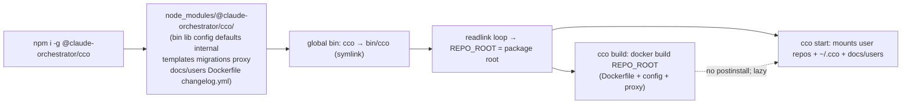
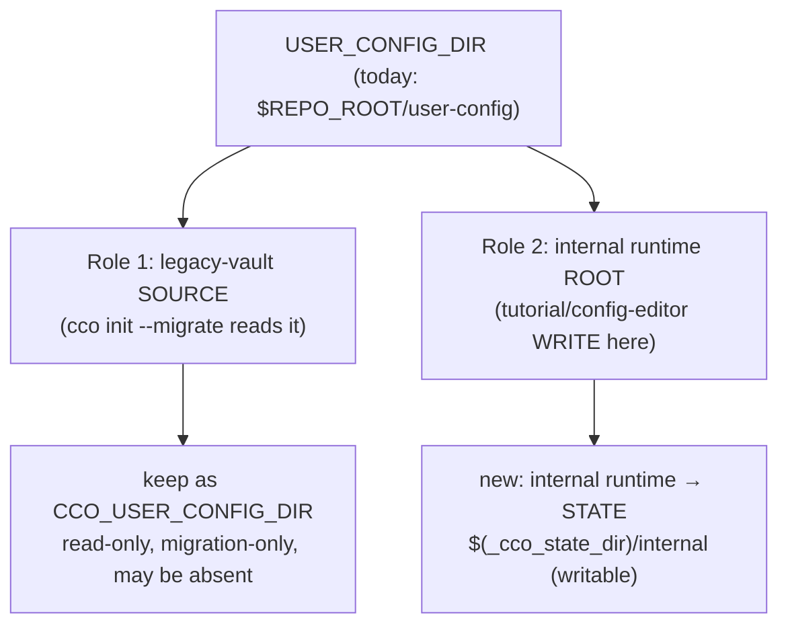
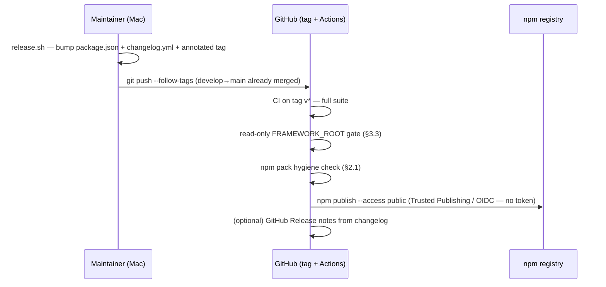

# Release engineering — npm packaging & distribution

> **Living design doc.** Reflects the current/target design for distributing `cco`
> as an npm package and releasing v1. Decisions are recorded in
> [ADR-0037](../decisions/0037-npm-packaging-distribution.md); this doc details the
> *how*. Rewritten in place as the design evolves (history in git).
> **Status**: design ready for implementation (2026-06-30). No code yet.

## 1. Goal & shape

Ship `@claude-orchestrator/cco` so users install with one command and get the
prefix-free `cco`:

```bash
npm i -g @claude-orchestrator/cco
cco init && cco start <project>
```

The package carries the **entire framework tree** (it is both the runtime *and* the
Docker build context). The image and the Go proxy are built **lazily on the host**,
never at `npm install`. Install location may be **read-only / root-owned** → cco
must never write inside it.



## 2. `package.json` shape

```jsonc
{
  "name": "@claude-orchestrator/cco",
  "version": "0.4.0",            // single source of truth (ADR-0037 D7)
  "description": "Isolated, preconfigured Claude Code sessions in Docker — multi-repo orchestration.",
  "bin": { "cco": "bin/cco" },   // global shim → package root via readlink loop
  "keywords": ["claude", "claude-code", "orchestrator", "docker", "cco", "ai", "agents"],
  "os": ["darwin", "linux"],
  "engines": { "node": ">=18" }, // node only provides the installer/shim, not the runtime
  "license": "MIT",
  "repository": { "type": "git", "url": "git+https://github.com/claude-orchestrator/claude-orchestrator.git" },
  "files": [
    "bin/", "lib/", "config/", "defaults/", "templates/", "internal/",
    "migrations/", "proxy/", "docs/users/",
    "Dockerfile", ".dockerignore", "changelog.yml", "README.md", "LICENSE"
  ]
}
```

Notes:
- `engines.node` only constrains the host that runs `npm`/the shim — `cco` itself
  is bash and shells out to `docker`. Keep the floor low (`>=18`).
- The `files` array is the **single authoritative mechanism** (default-deny). npm
  does **not** let `.npmignore` subtract from a path listed in `files`, so the few
  in-tree exclusions are done with `files` **negations**, not a second denylist:
  - `bin/cco` (not `bin/`) — keeps the `bin/test` runner out.
  - `!proxy/**/*_test.go`, `!proxy/**/cco-docker-proxy` — Go tests + any built
    binary stay out (the proxy is compiled in the image build, D4).
  - `!docs/README.md` — the docs root index lives outside `docs/users`.
  - `templates/project/base/secrets.env` is an intended scaffold **placeholder**
    and **must ship** — do not blanket-exclude `secrets.env`.
  - Junk (`.git`, `.DS_Store`, `node_modules`, `*.swp`) is covered by npm's
    built-in default ignores; no `.npmignore` is needed (a non-functional one would
    only mislead).

### 2.1 Hygiene gate

`npm pack --dry-run` must list **only** the allowlisted tree (verified: 182 files,
~402 kB). A CI check greps the pack manifest for forbidden paths (`tests/`,
`bin/test`, `_test.go`, `reviews/`, `secrets` other than the template placeholder,
`.git`, `user-config/`, `docs/maintainers/`, `docs/README.md`) and fails on any hit.

## 3. Read-only-`FRAMEWORK_ROOT` correctness

### 3.1 Symlink resolution matrix (verify before publish)

The global `cco` shim is a symlink whose depth differs by platform/prefix. The
readlink loop (`bin/cco:13-21`) must land `REPO_ROOT` on the package root in all of:

| Platform | Install prefix | Shim location |
|---|---|---|
| macOS (system node) | `/usr/local` | `/usr/local/bin/cco` → `../lib/node_modules/@claude-orchestrator/cco/bin/cco` |
| macOS (nvm) | `~/.nvm/versions/node/<v>` | `…/bin/cco` → `../lib/node_modules/…/bin/cco` |
| Linux (system node) | `/usr` | `/usr/bin/cco` → `../lib/node_modules/…/bin/cco` |
| Linux (nvm/`npm prefix`) | `~/.npm-global` | `…/bin/cco` → `../lib/node_modules/…/bin/cco` |

Verification = `npm i -g ./<tgz>` on macOS **and** Linux, then `cco --version` and a
no-op command from an arbitrary cwd; assert `REPO_ROOT` equals the package root.

### 3.2 The one write violation and its split fix (ADR-0037 D5)

`USER_CONFIG_DIR` (`bin/cco:42`) is the only default pointing inside the framework,
and it mixes two roles. Split them:



- **Role 2 → STATE.** `lib/cmd-start.sh` `_setup_internal_tutorial` /
  `_setup_internal_config_editor` build their `runtime_dir` under a new
  STATE-derived path (a `paths.sh` helper, e.g. `_cco_internal_runtime_dir`), not
  under `USER_CONFIG_DIR`. The `{{CCO_USER_CONFIG_DIR}}` template token kept for
  back-compat is repointed accordingly.
- **Role 1 stays** as the migration read-source; its default leaving the framework
  is harmless (reading a non-existent dir is a no-op; npm users have no legacy
  vault).

### 3.3 Read-only test (the publish gate)

A suite test stages the framework tree into a throwaway dir, `chmod -R 0555` it,
runs the relevant commands with `CCO_FRAMEWORK_ROOT` (and `CCO_USER_CONFIG_DIR`)
pointed appropriately and STATE/CACHE/DATA on a writable tmp, and asserts:

1. `cco build` (build-context read), `cco start tutorial`, `cco start
   config-editor`, `cco update` all succeed.
2. **No file under the read-only tree is created/modified** (a post-run
   `find <ro-tree> -newer <marker>` is empty; the `0555` mode itself would also
   reject any write).

This green run is the **mandatory CI pre-publish gate** (§5). Implemented as
`tests/test_readonly_framework.sh` (stages a `chmod -R a-w` copy of the shipped
trees, runs `cco start tutorial|config-editor --dry-run` from it, asserts success +
no writes under the read-only root + the runtime landing in STATE).

**Bug the gate caught:** `cp -r` of the internal `.claude/` content preserves the
source mode, so on a read-only (npm) framework the STATE runtime copy was itself
read-only — the *next* start's `rm -rf "$runtime_dir/.claude"` refresh then failed.
Fixed by restoring the write bit on both the stale and fresh copies in
`_setup_internal_tutorial` / `_setup_internal_config_editor`.

## 4. Docker build context from an npm install

`cco build` runs `docker build "$REPO_ROOT"` — the context is the installed package
dir. Confirm every build/runtime path derives from `FRAMEWORK_ROOT` / `REPO_ROOT`
(never cwd):

- `Dockerfile`, `config/` (entrypoint, hooks, tmux), `proxy/` (Go source),
  `defaults/managed/` are all in `files` (ADR-0037 D3) → present in context.
- The proxy compiles inside the image build (ADR-0037 D4); the host stays Go-free.
- **Version coupling (D7):** `package.json` `version` is the single source of
  truth; the pinned Claude Code version stays an independent knob (ADR-0039).
  **v1 keeps the image tag `claude-orchestrator:latest`** (`IMAGE_NAME` in
  `bin/cco`); tagging the image with `:<package.version>` is a later refinement,
  not required for the package to install and run.

## 5. Release pipeline



- **`release.sh`** (local): validates clean tree + on `main` + version > current +
  tag free, runs the suite + hygiene pre-flight, bumps the version, commits the
  annotated tag, pushes (changelog entries are added per-feature, not here).
- **CI-on-tag** (`.github/workflows/release.yml`): Linux runner → verify tag ==
  `package.json` version → suite (incl. read-only gate) → hygiene check →
  `npm publish --access public` (scoped packages default to restricted;
  `--access public` is required for a public package).
- **Auth = npm Trusted Publishing (OIDC), no stored token.** The workflow sets
  `id-token: write` and upgrades to an OIDC-capable npm; npm mints a short-lived
  credential from the GitHub OIDC token (and attaches provenance). **Bootstrap:**
  the trusted publisher is configured on the package (which must exist), so the
  **first** publish is manual (`npm login` + `npm publish --access public`);
  afterwards configure the package's Trusted Publisher → this repo + `release.yml`,
  and every tag push publishes with no secret.

## 6. `cco docs` (D9 local renderer)

A thin command that surfaces the packaged `docs/users` on the host:

- `cco docs` → list the user-doc sections (the `docs/users/**` index).
- `cco docs <topic>` → print/page the matching guide (resolve under
  `$REPO_ROOT/docs/users`).
- Read-only, offline, always matched to the installed version. No new dependency
  (use `${PAGER:-less}` / plain `cat` fallback).

The same `docs/users/` tree feeds three consumers: the internal agent mount (the
config-editor/tutorial mount stays at `$REPO_ROOT/docs` → `/workspace/cco-docs`, but
the package ships only `docs/users` so an installed user sees only user docs —
ADR-0037 D3), local `cco docs`, and the Pages source (§7).

## 7. GitHub Pages renderer (additive, free)

A GitHub Action builds a static site from `docs/users/` on `main` and deploys to
Pages (free for public repos). One source, separate renderer — no second copy.

- v1 scope: **`docs/users/` only**.
- Reserved post-v1: an "Architecture/Contributing" section sourced selectively from
  `docs/maintainers/foundation/design` + ADRs (excluding handoffs/reviews/archive).
- The site shows **latest-on-`main`**; the local `cco docs` shows the **installed**
  version — intentional (web = discovery, local = version-accurate).

## 8. Definition of done (traceable to ADR-0037)

- [x] `package.json` + `files` allowlist; `npm pack --dry-run` clean — 182 files /
      ~402 kB; no `.npmignore` needed (§2, D3).
- [x] `npm i -g ./<tgz>` yields a working `cco` on **Linux** (validated: shim
      `cco → ../lib/node_modules/@claude-orchestrator/cco/bin/cco`, readlink resolves
      REPO_ROOT to the package root, `lib/*.sh` source cleanly from an arbitrary cwd).
      **macOS** still to validate on a Mac / CI (§3.1, D1).
- [x] `USER_CONFIG_DIR` split; internal runtime → STATE; nothing writes in
      `FRAMEWORK_ROOT` (§3.2, D5).
- [x] `docs/users`-only contract met by the `files` allowlist; runtime mount
      unchanged (D3).
- [x] Read-only-`FRAMEWORK_ROOT` test green (§3.3, D5) — the publish gate
      (`tests/test_readonly_framework.sh`; caught + fixed the cp-mode refresh bug).
- [x] `cco docs` surfaces `docs/users` locally (§6, D9) — `lib/cmd-docs.sh`,
      `tests/test_docs.sh`, changelog #25.
- [x] `cco update` provenance-aware: prints the right engine-update command (D8)
      — `_cco_install_provenance` + `_cco_engine_update_hint`,
      `tests/test_update_provenance.sh`, changelog #26.
- [x] `release.sh` + CI workflow (tag push + manual dispatch) + npm-pack hygiene
      check (§5, D6) — `scripts/release.sh`, `scripts/check-pack-hygiene.sh`,
      `.github/workflows/release.yml`. **CI OIDC publish validated** — `0.5.1`
      published via a `workflow_dispatch` run (see the OIDC publish debug handoff).
- [x] Pages action publishing `docs/users` (§7, D9) —
      `.github/workflows/pages.yml`. **Validated only after enabling Pages + push.**
- [x] Version coupling **documented** (§4, D7): `package.json` `version` is the
      source of truth; Claude pin independent. **Image-tag-by-version wiring
      deferred** — v1 keeps `claude-orchestrator:latest` (the version lives in
      `package.json`); tagging the image with the version is a later refinement.
- [~] Release: `npm publish` **done** — `@claude-orchestrator/cco@0.5.1` is live on
      npm via CI OIDC trusted publishing. Remaining: reconcile `main → develop`, and
      validate `npm i -g @claude-orchestrator/cco` on a Mac (closes the macOS DoD
      item above).

## 9. Out of scope / deferred

- Homebrew (post-v1).
- `cco update` engine-update orchestration + responsibility-axis split →
  update-refactor workstream.
- `defaults/global/.claude/settings.json` decomposition — **resolved (ADR-0037
  D10)**: 3-class classification done; the functional layer is already immutable in
  `managed-settings.json` so **C ships settings unchanged**; Class-O extraction is
  workstream F.
- npm org creation (maintainer action; ADR-0037 O2; GitHub org taken → repo stays
  personal, D2).
